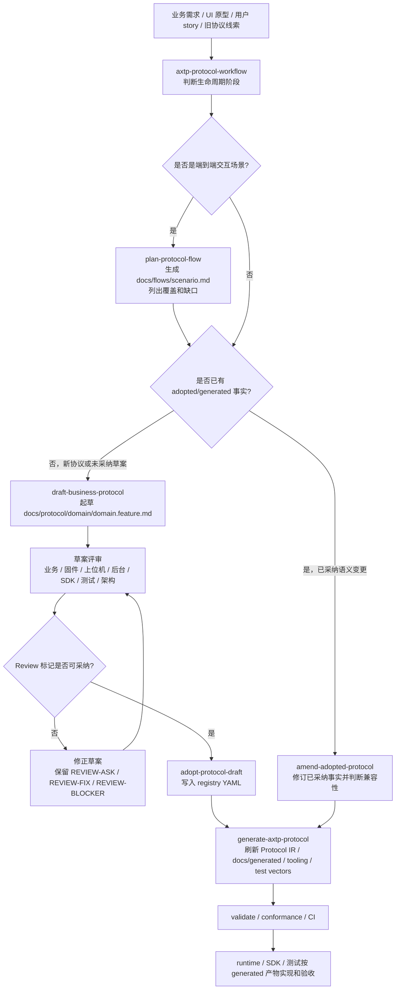

# AXTP 研发 Kickoff

这份文档用于研发启动会快速讲清楚三件事：

```text
Why：为什么要重做协议体系
What：AXTP 到底是什么
How：研发、测试、runtime 如何按同一条流水线协作
```

面向对象：固件/MCU、设备端 Linux/Android、上位机/客户端、云端/后台、SDK/CLI、测试、架构评审和项目管理。

## 30 秒结论

AXTP 不是再写一份格式表，而是把分散在 HID、HTTP、WebSocket、二进制命令表和旧设备协议里的通信能力，收敛为一套统一架构、统一协议语言、统一事实源、统一生成和统一测试的研发体系。

它解决三件事：

1. 让 event、stream、能力发现、错误码、schema 和兼容性有统一治理。
2. 让 HID、TCP、WebSocket、BLE、UART 等链路复用同一套协议骨架。
3. 让固件、上位机、云端、SDK、测试和工具团队围绕同一份 generated protocol 协作。

## Why：为什么要重做

旧协议的问题已经不是“某个字段格式不够好”，而是协议生产方式失控。

| 过去的问题 | 典型表现 | AXTP 的处理方式 |
|---|---|---|
| 协议事实分散 | Word、Excel、固件宏、客户端常量、测试脚本各写一份 | 用 `registry/**/*.yaml` 和 `registry/domains/**/*.yaml` 做机器可读事实源 |
| 不同链路重复设计 | HID 一套命令，HTTP/WebSocket 又一套方法 | 统一 method/event/schema/error/capability 语言，transport 只负责承载 |
| Event 不成体系 | 主动上报被做成特殊 command、轮询或私有 notify | Event Registry 统一 eventId、event schema 和触发语义 |
| Stream 边界不清 | 固件、文件、日志、媒体都容易塞进业务命令 | RPC 负责建流和语义，STREAM 负责连续数据 |
| 兼容性不可控 | 字段删除、重命名、错误码复用容易破坏旧版本 | 用 draft/experimental/mvp/stable、amendment、deprecate/version 管演进 |
| 测试介入太晚 | 到实现末期才发现字段、错误路径和状态事件不可测 | 采纳时同步生成 references、test vectors 和 conformance 输入 |
| 外部 SDK 交付压力 | 客户需要统一 SDK 时，临时补文档、补常量、补示例、补测试说明，交付周期不可控 | 用同一份 spec tag、generated protocol、runtime SDK 和 conformance cases 快速打包交付 |

一句话：AXTP 把协议研发从“人工同步多份表”升级为“需求 -> 草案 -> 事实源 -> 生成 -> conformance”的工程流水线。

这件事还有一个很现实的外部驱动：客户和合作方不会关心我们内部有几套历史协议，他们需要的是一套能快速接入、跨平台行为一致、文档和 SDK 对得上的交付物。没有 AXTP，统一 SDK 往往会变成“临时整理一份接口说明，再从不同项目里抄常量和示例”；有了 AXTP，交付路径变成“锁定 spec tag，生成协议参考，runtime 仓库按 lock 实现，通过 conformance 后发布 SDK”。这会直接缩短外部 SDK 交付周期，也能减少后续支持成本。

## What：AXTP 是什么

AXTP 是一套传输无关的设备通信协议标准。它不绑定某一种 runtime，也不把业务类型塞进 frame header。

核心分层：

```text
Business Layer    device / display / firmware / network / stream / ...
Registry Layer    method / event / error / schema / capability / profile
Payload Layer     CONTROL / RPC / STREAM
Frame Layer       Standard Frame Header / length / fragment / CRC
Transport Layer   USB HID / TCP / WebSocket / BLE / UART / mock
```

| 层级 | 职责 | 主要使用者 |
|---|---|---|
| Transport | 接入 HID、TCP、WebSocket、BLE、UART 等实际链路 | 平台 I/O、设备接入 |
| Frame | 处理 Magic、Version、Length、MessageId、Fragment、CRC | runtime core |
| Payload | 分发 CONTROL、RPC、STREAM | runtime core |
| Registry | 定义 method、event、error、schema、capability、profile | 架构、协议维护者、测试、工具 |
| Business | 执行真实设备功能 | 固件、设备端、后台、上位机 |

顶层 Payload 只有三类：

| PayloadType | 用途 | 典型内容 |
|---|---|---|
| CONTROL | 运行时控制 | OPEN、ACCEPT、HEARTBEAT、ACK、NACK、CLOSE |
| RPC | 业务控制面 | Hello、Identify、Request、Response、Event |
| STREAM | 连续数据面 | 固件数据块、文件块、日志流、音频帧、视频帧 |

核心原则：

```text
Transport 不理解业务方法
Frame 不承载业务类型
PayloadType 只区分 CONTROL / RPC / STREAM
method/event/error/schema 都进入 Registry
Business 不直接修改 Header
```

## What：本仓库负责什么

本仓库是 AXTP core spec repository，不是 runtime 仓库。

| 类型 | 路径 | 状态 |
|---|---|---|
| 业务输入 | `docs/business/` | 评审输入 |
| 场景流程 | `docs/flows/` | 评审输入 |
| 协议草案 | `docs/protocol/` | 评审输入 |
| 正式规范 | `docs/specs/` | 人工维护规则 |
| 机器事实源 | `registry/`、`registry/domains/` | 实现合同 |
| 生成协议 IR | `protocol/axtp.protocol.yaml` | generated contract |
| 生成参考文档 | `docs/generated/` | generated contract |
| 一致性用例 | `docs/conformance/` | runtime 校验输入 |
| legacy 迁移 | `docs/legacy-migration/` | 迁移输入 |

不要手写 generated 产物。如果 generated 内容不符合预期，回修草案、specs、YAML 或 Generator 源头，再重新生成。

Runtime、SDK、mock server 和语言专属 API 设计维护在独立仓库中：

| Runtime 仓库 | 主要目标 |
|---|---|
| `axtp-c-runtime` | IoT、MCU、低资源设备 |
| `axtp-cpp-runtime` | Android、Linux 设备主控、native 控制服务 |
| `axtp-ts-runtime` | Web、Node.js、后台服务 |
| `axtp-flutter-runtime` | 跨端 Mobile App |
| `axtp-python-runtime` | AI、MCP、自动化、脚本集成 |
| `axtp-mock-server` | 调试、验收、原型联调 |

## How：研发怎么协作

AXTP 的日常协作从自然语言需求开始，由 skill 判断阶段，再进入对应目录和自动化。



阶段分工：

| 阶段 | 主责 | 产物 | 关键判断 |
|---|---|---|---|
| 需求输入 | 产品 / 业务 / 架构 | 业务目标、旧协议线索、场景说明 | 是否真实需要协议变化 |
| Flow 规划 | 协议维护者 / 架构 | `docs/flows/<scenario>.md` | 是已有协议覆盖、协议缺口，还是纯 UI/业务逻辑 |
| 草案设计 | 协议维护者 / 架构 | `docs/protocol/<domain>/<domain.feature>.md` | domain.feature、method、event、schema、error 是否合理 |
| 草案评审 | 架构 / 业务负责人 | `[REVIEW-OK]` 范围和 open questions | `[REVIEW-ASK]`、`[REVIEW-BLOCKER]` 是否关闭 |
| 采纳到事实源 | 协议维护者 | `registry/**`、`registry/domains/**` | ID、bitOffset、fieldId、兼容性是否冲突 |
| 已采纳修订 | 协议维护者 / 架构 | amendment、更新后的 YAML/generated | draft/experimental 可修正；stable/MVP 优先 deprecate 或版本化 |
| 生成和校验 | 协议维护者 / 工具 | `protocol/axtp.protocol.yaml`、`docs/generated/*`、test vectors | generated diff 是否符合采纳事实 |
| Runtime 实现 | runtime 团队 | runtime code、tests、examples | 只消费 spec tag、Protocol IR、generated docs 和 conformance |

## How：研发请求应该怎么写

好的请求描述“业务目标”和“协议阶段”，而不是要求直接改某个 generated 文件。

| 你想做什么 | 推荐说法 |
|---|---|
| 规划一个端到端场景 | `为移动 App 发起固件升级规划 AXTP flow，包含进度事件、stream 传输、断线恢复和失败处理。` |
| 起草新协议 | `为 output.layout 起草 AXTP 协议，目标是控制多屏输出画面布局，优先复用 display/video/output 已有草案。` |
| 采纳已评审草案 | `采纳 docs/protocol/audio/audio.algorithm.md，确认命名、schema、event、error 后写入 registry 并重新生成。` |
| 修订已采纳协议 | `修订已采纳的 display.brightness，将 maxBrightness deprecated，不直接删除，保持 stable 兼容性。` |
| 刷新生成产物 | `从当前 YAML 事实源重新生成 AXTP protocol outputs，并运行 source/protocol/conformance 校验。` |

反模式：

```text
直接改 generated protocol。
加点 YAML。
让 runtime 支持这个。
```

这些说法会绕过生命周期阶段，容易制造第二套事实源。

## How：本地验证命令

常用主库验证链路：

```bash
pnpm --dir generators build
pnpm --dir generators test
pnpm --dir generators validate:sources
pnpm --dir generators generate
pnpm --dir generators validate:protocol
scripts/validate-conformance.sh
git diff --check
```

构建本地 spec artifact：

```bash
scripts/build-spec-artifact.sh "$(scripts/print-spec-version.sh)"
```

发布使用 Git tag：

```text
spec/vMAJOR.MINOR.PATCH
```

Runtime 仓库应通过 `AXTP_SPEC.lock.yaml` 或包元数据声明自己实现的 AXTP Spec 版本，不依赖浮动 `main` 做可复现构建。

## 研发底线

- 新业务先进入 `docs/business/`、`docs/flows/` 或 `docs/protocol/`，不要直接写 generated。
- 未评审草案不能作为 runtime 实现合同。
- 已采纳事实必须进入 `registry/` 或 `registry/domains/`。
- `protocol/axtp.protocol.yaml` 和 `docs/generated/**` 只由 Generator 刷新。
- Runtime 专属 API、代码风格、transport adapter 和 SDK packaging 放在 runtime 仓库。
- Stable/MVP 协议字段、ID、method/event/capability 不静默删除、不复用。

## 启动会后先读什么

| 目标 | 入口 |
|---|---|
| 快速使用仓库 | [docs/guides/how-to-use.md](docs/guides/how-to-use.md) |
| 理解正式规范 | [docs/specs/README.md](docs/specs/README.md) |
| 查看当前 generated 协议 | [docs/generated/protocol.md](docs/generated/protocol.md) |
| 查看协议草案工作流 | [docs/protocol/README.md](docs/protocol/README.md) |
| 查看 lifecycle skills | [docs/dev/skills/README.md](docs/dev/skills/README.md) |
| 查看 conformance | [docs/conformance/README.md](docs/conformance/README.md) |
| 查看发布治理 | [docs/release/README.md](docs/release/README.md) |
