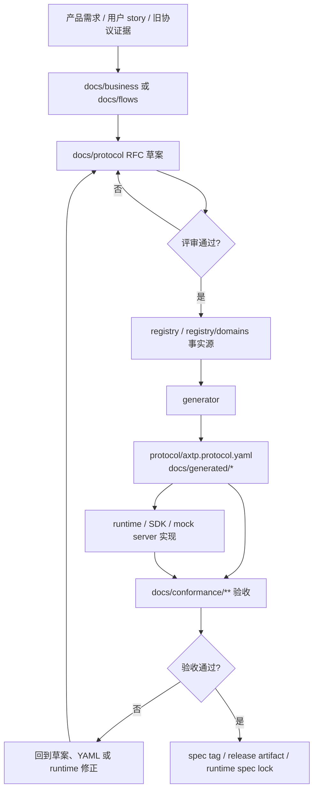

# AXTP Kickoff：为什么改、怎么用、如何推进

## 本次会议目的

这次 kickoff 主要解决三件事：

1. 向大家宣导新的协议规范治理办法，让产品、研发、测试、runtime、SDK 和架构评审后续使用统一的业务流程语言协作，减少重复沟通和口径偏差，提升产研协作效率和产品开发进度。
2. 让大家直观看到 Codex 在协议梳理、文档重整、代码生成、校验和研发流程优化中的能效，推动团队把 AI 纳入现有工作流，让日常开发、评审和交付更高效。
3. 推进后续真实产品落地：NA20 与大屏联动、VM33 Pro 与 NearStream 交互优化，都要基于 AXTP 的新规范、新流程和新验收方式持续推进。

这份文档用四个问题讲清楚 AXTP 改版方案：

```text
1. 为什么改成 AXTP？过去的问题有哪些？
2. AXTP 是什么？为什么它能解决之前的问题？
3. 各个角色怎么用这个东西？
4. 后续如何推进？Roadmap 如何？
```

它不是替代完整规范，也不是 runtime 实现手册。它的目标是让产品、研发、测试、runtime、SDK、mock server 和架构评审在同一套判断标准下推进设备协议改版。

## 1. 为什么改成 AXTP？过去的问题有哪些？

### 1.1 一句话结论

我们不是因为“旧协议字段不好看”才改成 AXTP，而是因为旧协议的生产方式已经无法支撑多产品、多端、多 runtime、多客户 SDK 的交付。

过去的协议更多像“命令表 + 若干文档 + 各端各自实现”。这种方式在单产品、单链路、少量接口时还能跑；一旦产品线变多，App、上位机、云端、SDK、测试、mock server、嵌入式 runtime 同时参与，问题就会成倍放大。

### 1.2 过去的问题

| 问题 | 典型表现 | 后果 |
|---|---|---|
| 协议事实分散 | Word、Excel、固件宏、客户端常量、测试脚本各写一份 | 没有单一事实源，任何变更都需要人工同步。 |
| 传输形态割裂 | HID、TCP、WebSocket、HTTP、BLE、USB 各自有自己的命令语义 | 同一个设备能力在不同链路上行为不一致。 |
| 老二进制命令表扩展困难 | 适合简单 command，不擅长事件、流、能力声明、复杂会话 | 新增 event、stream、capability 时容易打补丁。 |
| HTTP 方案不适合设备实时交互 | 普通接口可以，但低延迟双向、设备事件、连续流数据不自然 | App / 上位机 / 云端很难丝滑感知设备状态。 |
| 设备控制、事件、流和升级混在一起 | 固件升级、日志、媒体、状态变化容易塞进业务命令 | 协议边界不清，测试也难覆盖。 |
| SDK 临时交付 | 客户需要统一 SDK 时才补常量、文档、示例和测试说明 | 外部交付周期不可控，后续支持成本高。 |
| 测试介入太晚 | 实现后期才发现字段、错误码、事件时机不一致 | 缺陷进入联调阶段才暴露，修复成本高。 |
| 老协议迁移没有标准路径 | AXDP、Rooms、VM33、Signage、uxplay 各有自己的历史包袱 | 每个迁移项目都像重新做一遍协议设计。 |

### 1.3 为什么现在必须改

AXTP 的外部驱动很现实：客户和合作方需要的是统一 SDK、稳定协议参考、跨端行为一致和可验证交付，而不是内部解释“这个产品走 HID，那条线走 HTTP，另一个设备走旧命令表”。

AXTP 的内部驱动也同样明确：已有产品经验已经证明，当设备和软件之间有统一、清晰、低延迟的交互协议时，App、上位机、云端和设备的状态同步会更自然，异常恢复更可控，调试和测试也更容易复现。

因此，AXTP 要解决的是：

```text
协议事实怎么定义
协议能力怎么组织
多语言 SDK 怎么生成
runtime 怎么一致实现
测试怎么验收
老协议怎么迁移
客户怎么快速交付
```

## 2. AXTP 是什么？为什么它能解决之前的问题？

第一章看起来列了很多现象：协议事实分散、传输不统一、SDK 难交付、测试介入晚、老协议迁移没有标准路径。它们表面上是不同问题，落到工程上其实是同一个根因：

```text
旧协议把“怎么传”“传什么”“谁来实现”“怎么验收”绑在了一起。
```

这种方式在早期很快，因为新增一个命令、补一段文档、各端手写一下就能跑。但产品线变多以后，任何一个字段变化都会同时牵动固件、App、上位机、云端、SDK、测试、mock server 和客户文档。问题不是某一个端没写好，而是协议本身缺少稳定的分层边界。

AXTP 要做的事情，就是把这些耦合拆开：

```text
链路怎么传        交给 Transport / Frame
运行时怎么管理    交给 CONTROL
业务怎么调用      交给 RPC
大数据怎么走      交给 STREAM
能力怎么定义      交给 domain.feature + registry
SDK 怎么交付      交给 generator + runtime spec lock
测试怎么验收      交给 conformance
```

这样看 AXTP，就不会觉得它只是一个新的包格式。它真正改变的是协议的生产方式：从“各端根据经验同步”，变成“需求先进入流程，事实由 registry 锁定，runtime 和测试都消费同一份合同”。

### 2.1 从旧模式到 AXTP 模式

| 旧模式 | 带来的问题 | AXTP 模式 | 直接收益 |
|---|---|---|---|
| Word、Excel、代码常量、测试脚本各写一份 | 不知道哪份才是真实协议 | `registry/` + `protocol/axtp.protocol.yaml` 作为事实源 | 字段、方法、事件、错误码可生成、可校验。 |
| HID、TCP、WebSocket、BLE 各自带业务语义 | 同一能力在不同链路上行为不一致 | 传输无关，业务语义不绑定具体链路 | runtime 只处理承载差异，业务合同保持一致。 |
| 建连、心跳、请求、事件、文件流都塞进业务命令 | 控制面、业务面、数据面边界不清 | `CONTROL` / `RPC` / `STREAM` 分工 | 建连归建连，业务归业务，大数据归大数据。 |
| 按旧 command 逐条迁移 | 新协议继续继承旧包袱 | 先归类 `domain.feature`，再定义 method / event / schema | 能力边界稳定，SDK 和文档更容易组织。 |
| SDK 到客户要交付时再临时补 | 多语言实现和文档容易不一致 | generator + runtime spec lock | SDK、mock server、测试都跟随同一份协议版本。 |
| 测试等实现完成后再猜字段和错误码 | 联调阶段才暴露协议差异 | `docs/conformance/**` 作为验收输入 | runtime 可以提前验证握手、RPC、错误和事件行为。 |
| 老协议迁移靠个人经验 | 每个项目都像重新设计一次 | `docs/legacy-migration/**` 沉淀证据、分类和计划 | 迁移过程可追踪，也能解释为什么取舍某些能力。 |

这张表的目的不是把 AXTP 讲复杂，而是把研发问题讲清楚：以后我们不再问“旧命令怎么搬过来”，而是先问“这个需求属于哪个能力块、走哪个通道、是否应该进入 registry、用什么 conformance 验收”。

因此，AXTP 的核心价值不在于多了一个协议名字，而在于给产品、研发、测试、runtime、SDK 和客户交付提供同一套入口和规范。每个参与方都可以沿着同一条协议生命周期判断自己该在哪里输入、在哪里评审、在哪里实现、在哪里验收：

```text
需求在哪里写？
草案在哪里评审？
事实在哪里锁定？
runtime 从哪里实现？
测试按什么验收？
客户按哪个版本交付？
```

### 2.2 AXTP 是什么

AXTP 可以先用一句话理解：

```text
AXTP 是一套传输无关的设备通信协议标准，用 CONTROL 建链路，用 RPC 做业务控制，用 STREAM 传连续数据。
```

设备侧常用的 Standard Framed 路径长这样：

```text
Standard Framed wire format

+------------------------------ 12B ------------------------------+-----------+------+
| Magic | Ver | Type | PayloadLen | Src | Dst | MessageId | Frag  | Payload N | CRC  |
|  AX   | 01  | 01   | uint16     | u8  | u8  | uint16    | i / n |           | 16b  |
+-----------------------------------------------------------------+-----------+------+
                      |
                      +-- Type=CONTROL -> opcode + controlId + statusCode + TLV body
                      |
                      +-- Type=RPC     -> JSON { sid, op, d }
                      |              or Binary RPC Header(15B) + body
                      |
                      +-- Type=STREAM  -> streamId + seqId + cursor + data
```

这张图只讲一个重点：Frame Header 不承载业务语义，只负责封包、长度、分片和校验；真正的业务由 PayloadType 分发到 CONTROL / RPC / STREAM，再由 registry 定义 method、event、schema。

WebSocket JSON 这类轻量路径可以跳过 Frame Header，直接复用同一套 RPC envelope：

```text
WebSocket message payload = JSON { "sid": "...", "op": N, "d": { ... } }
```

所以 AXTP 要统一的不是“物理包长什么样”，而是四件事：

- 不同传输共享同一套 RPC 语义。
- 控制面、业务控制面和数据面分开。
- method / event / error / schema 只以 registry 为事实源。
- generator、runtime、mock server 和 conformance 都围绕同一份事实源工作。

### 2.3 三类 Payload 如何分工

| PayloadType | 用途 | Phase 1 范围 |
|---|---|---|
| CONTROL | Standard Framed 的运行时控制 | `OPEN/ACCEPT`、`HEARTBEAT/HEARTBEAT_ACK`、`CLOSE/CLOSE_ACK`。 |
| RPC | 业务控制面 | Hello、Identify、Identified、Request、Response、Event。 |
| STREAM | 连续数据面 | P0 承载 audio/video 媒体流；固件、文件、日志等后续按 profile 增量实现。 |

Phase 1 明确暂不做：

```text
ACK/NACK 严格重传
RESUME / SESSION_RESET
PING/PONG RTT 测量
链路加密
固件 / 文件 / 日志类 STREAM profile
```

这能避免 runtime MVP 一开始就背上过重实现成本。第一阶段先把建连、RPC、心跳、关闭、错误、JSON / JSON_BINARY 边界、audio/video STREAM 数据面和 conformance 跑通。

### 2.4 Source of Truth 如何解决事实分散

AXTP 把不同材料分成不同生命周期：

| 生命周期 | 路径 | 含义 |
|---|---|---|
| 业务输入 | `docs/business/` | 人工需求和业务目标。 |
| 场景流程 | `docs/flows/` | 端到端时序、交互、边界情况。 |
| 协议草案 | `docs/protocol/` | RFC / Draft，修改 registry 前先评审。 |
| 正式规范 | `docs/specs/` | 人读规则和设计原则。 |
| 机器事实源 | `registry/`、`registry/domains/` | 正式实现合同。 |
| Protocol IR | `protocol/axtp.protocol.yaml` | generator 输出，runtime 消费。 |
| Generated | `docs/generated/` | 人读 / 工具读生成参考。 |
| Conformance | `docs/conformance/` | runtime 和测试验收输入。 |

规则很简单：

```text
草案可以讨论；
registry 才是事实；
generated 只能生成；
conformance 用来验收 runtime。
```

这条规则直接对应第一章的问题：过去每个端都能“顺手改一点”，所以最后没有人知道哪一份才是真的。AXTP 允许草案充分讨论，但一旦进入 registry，就必须进入生成、验证和 runtime 消费链路。

### 2.5 domain-feature 如何解决能力混乱

AXTP 不从“新增 command”开始，而是从 `domain.feature` 开始：

```text
domain
  大业务域，例如 audio / video / camera / network / firmware。

domain.feature
  稳定能力块，例如 audio.algorithm、network.wifi、firmware.update。

domain.method / domain.event / schema
  具体动作、状态变化、参数和返回值。
```

示例：

| 业务意图 | domain.feature | method / event |
|---|---|---|
| 音频算法配置 | `audio.algorithm` | `audio.getAlgorithmCapabilities`、`audio.setAlgorithmConfig`、`audio.algorithmConfigChanged` |
| Wi-Fi 配置 | `network.wifi` | `network.getWifiConfig`、`network.setWifiConfig`、`network.wifiConfigChanged` |
| 固件升级 | `firmware.update` | `firmware.prepareUpdate`、`firmware.installUpdate`、`firmware.updateStateChanged` |
| 视频构图 | `video.framing` | `video.getFramingConfig`、`video.setFramingConfig`、`video.framingConfigChanged` |

这能避免把旧命令表原样搬进新协议，也能让 SDK、mock server、测试和文档都围绕能力块组织。

这也是 AXTP 和“重写一份命令表”的根本区别。旧协议通常是先有命令，再解释命令属于什么业务；AXTP 是先确认业务能力边界，再生成稳定的 method、event、schema。

### 2.6 generated + conformance 如何解决 SDK 和一致性

AXTP 的交付链路是：

```text
spec tag
  -> protocol/axtp.protocol.yaml
  -> docs/generated/protocol.json
  -> runtime spec lock
  -> runtime SDK
  -> docs/conformance/**
```

这意味着：

- SDK 不再手抄常量。
- runtime 不再从草案或口头需求实现。
- 测试不再自己猜字段和错误码。
- 客户交付可以绑定明确 spec tag。
- 多语言 runtime 可以围绕同一套 conformance 验收。

## 3. 各个角色怎么用这个东西？

一句话分工：

```text
产品讲清楚要解决什么问题；
协议维护者把需求变成可评审、可生成的协议事实；
runtime / SDK / mock server 按 generated 合同实现；
测试按 conformance 验收；
发布按 spec tag 和 runtime spec lock 管版本。
```

### 3.1 阶段和角色分工

| 阶段 | 产品 / 业务 | 协议维护者 / 架构 | Runtime / SDK / Mock | 测试 / Conformance | 产物 |
|---|---|---|---|---|---|
| 1. 提需求 | 说明用户任务、设备能力、异常、优先级和旧协议证据。 | 判断是否需要 flow 或 protocol draft。 | 提供实现限制，例如 MTU、内存、链路方向。 | 提供验收视角和历史问题。 | `docs/business/`、`docs/legacy-migration/evidence/` |
| 2. 画流程 | 确认端到端场景是否符合产品预期。 | 写 `docs/flows/`，标出已覆盖和缺口。 | 确认链路、时序、状态机是否能实现。 | 确认可测点、超时、失败路径。 | `docs/flows/<scenario>.md` |
| 3. 写草案 | 确认业务字段、状态、事件和兼容要求。 | 写 `docs/protocol/<domain>/<feature>.md` 并组织评审。 | 评估字段、编码、错误码和资源成本。 | 提前提出 conformance case 方向。 | RFC / Draft |
| 4. 采纳事实 | 确认 P0/P1 范围。 | 写入 `registry/` 和 `registry/domains/`，不手写 generated。 | 准备按 generated 合同实现。 | 准备按 generated 合同验收。 | YAML 事实源 |
| 5. 生成验证 | 查看 generated 文档是否符合预期。 | 运行 generator、validate、conformance 源校验。 | 消费 `protocol/axtp.protocol.yaml` 和 `docs/generated/protocol.json`。 | 更新或执行 `docs/conformance/**`。 | `protocol/`、`docs/generated/`、conformance |
| 6. 发布接入 | 决定产品批次和交付窗口。 | 发布 spec tag / artifact。 | 更新 `AXTP_SPEC.lock.yaml` 并实现 runtime。 | 按 runtime 声明 level 验收。 | spec tag、runtime spec lock |

### 3.2 流程图



### 3.3 三条底线

| 底线 | 原因 |
|---|---|
| 不绕过 `docs/protocol/` 直接写 `registry/` | 草案要先被业务、研发、测试和架构看懂并确认。 |
| 不手写 `docs/generated/` 或 `protocol/axtp.protocol.yaml` | generated 只能从 YAML 事实源生成。 |
| runtime 不按草案发布合同 | runtime 只能绑定明确 spec tag / commit 和 generated protocol。 |

## 4. 后续如何推进？Roadmap 如何？

### 4.1 推进原则

AXTP 后续不追求一次性把所有协议域写全。正确节奏是：

```text
先让核心协议可跑；
再让 runtime MVP 可验收；
再用 NA20 打通第一条真实链路；
再按产品优先级迁移老协议和补齐能力域；
最后完善工具链、conformance 和 release 质量。
```

### 4.2 阶段与版本路线

| 阶段 | 推荐版本 | 目标 | 核心交付 | 验收 |
|---|---|---|---|---|
| Phase 1 | v0.1 | 协议核心可跑 | Hello / Identify、OPEN / ACCEPT、HEARTBEAT、CLOSE、Request / Response / Event / Error、sid / requestId、RPC encoding、mock server、client demo。 | WebSocket JSON 与 Standard Framed 两条链路都能解释并跑通最小 RPC。 |
| Phase 2 | v0.2 | 首个真实业务闭环 | NA20 server endpoint、pairing、video/audio stream RPC 控制面 + STREAM 数据面、flow-control event、基础 conformance。 | 上位机能发现、配对、拉流、收事件，并通过基础 runtime/conformance 验收。 |
| Phase 3 | v0.3 | 设备控制能力完善 | `device.*`、`system.*`、framing、focus / zoom / ptz、camera image / exposure / whiteBalance / calibration。 | 常见设备控制能力有 schema、示例、错误码、legacy 映射和测试入口。 |
| Phase 4 | v0.4 | 老协议迁移适配 | AXDP 重建，Rooms / Signage / uxplay 平移，VM33 HTTP + AXTP hybrid，migration docs，legacy mapping。 | 老业务可通过 AXTP 统一入口访问，迁移路径清楚。 |
| Phase 5 | v0.5 | 工具链与多端 runtime | `axtpctl`、`axtp-probe`、`axtp-mock-server`、`axtp-conformance`、多语言 runtime 基础一致。 | 研发能发现设备、连接设备、调试协议、回放问题，多端 runtime 行为一致。 |
| Phase 6 | v1.0 | 稳定协议基础设施 | 稳定 wire protocol、registry、runtime 接口、工具链、release artifact、完整 conformance suite。 | 新设备接入、老协议迁移、新 capability 新增都有标准流程和可验证交付物。 |

### 4.3 近期 P0 / P1 / P2

| 优先级 | 做什么 | 为什么 |
|---|---|---|
| P0 | WebSocket JSON 控制面、Hello / Identify、generated method 调用、mock server、core conformance | 最快让 App、Web、云端、外部 SDK 和测试接入。 |
| P0 | Standard Framed 的 OPEN / ACCEPT、HEARTBEAT、CLOSE、基础 RPC、JSON_BINARY 边界 | 给设备 runtime 建立统一地基。 |
| P0 | audio/video STREAM 数据面、`video.openStream`、`audio.startRecording(deliveryMode=stream)`、STREAM 16B header/parser | 让设备到软件的实时媒体交互真正落地，不只停留在控制面。 |
| P0 | `device.*`、`system.*`、`video.framing`、focus / zoom / ptz 的协议评审 | 先覆盖最常见设备控制能力。 |
| P1 | camera image / exposure / calibration / whiteBalance、diagnostic | 扩展核心设备调节和产测能力。 |
| P1 | `axtpctl`、probe、inspector | 提升研发调试和问题复现效率。 |
| P2 | 固件 / 文件 / 日志类 STREAM profile、ACK/NACK、RESUME、低带宽、强认证 / 加密 | 等固件升级、弱链路、客户安全需求明确后推进。 |
| P2 | Rooms / Signage / uxplay / VM33 深度迁移 | 先 adapter 接入，再逐步标准化 capability。 |

### 4.4 会后行动清单

| 团队 | 下一步 |
|---|---|
| 产品 / 业务 | 列出 P0 场景、客户交付需求、旧协议证据和优先级。 |
| 协议组 / 架构 | 把 P0 场景路由到 `docs/flows/` 或 `docs/protocol/`，明确 domain.feature。 |
| Runtime | 按 `docs/guides/runtime-mvp-conformance.md` 声明 MVP 范围并接入 conformance。 |
| SDK / mock server | 只从 generated protocol 和 spec lock 消费协议事实。 |
| 测试 | 按 `docs/guides/testing-conformance-quickstart.md` 准备验收和失败归类。 |
| 发布 | 明确 spec tag、release artifact、runtime upgrade 和版本锁定规则。 |

## 结束判断

AXTP 改版是否成功，不看文档写了多少，而看四个结果：

```text
1. 新业务能从需求进入草案，再进入 registry 和 generated。
2. runtime 能按 spec lock 实现，并通过声明的 conformance。
3. 测试能明确判断失败归属，而不是靠人工解释。
4. 外部客户能拿到统一 SDK、稳定协议参考和可验证交付物。
```

如果这四件事成立，AXTP 就不只是一套协议格式，而是一套可以持续交付设备能力的工程体系。
