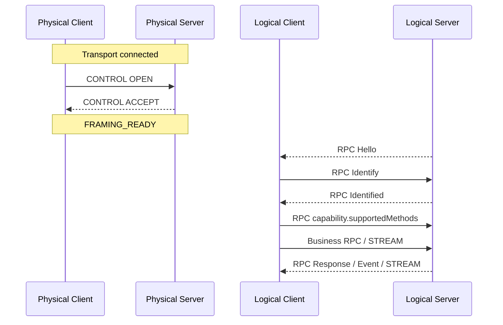
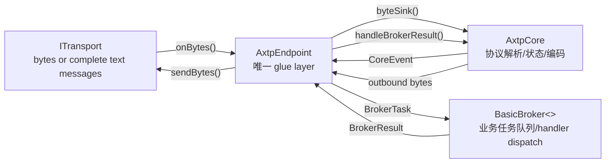
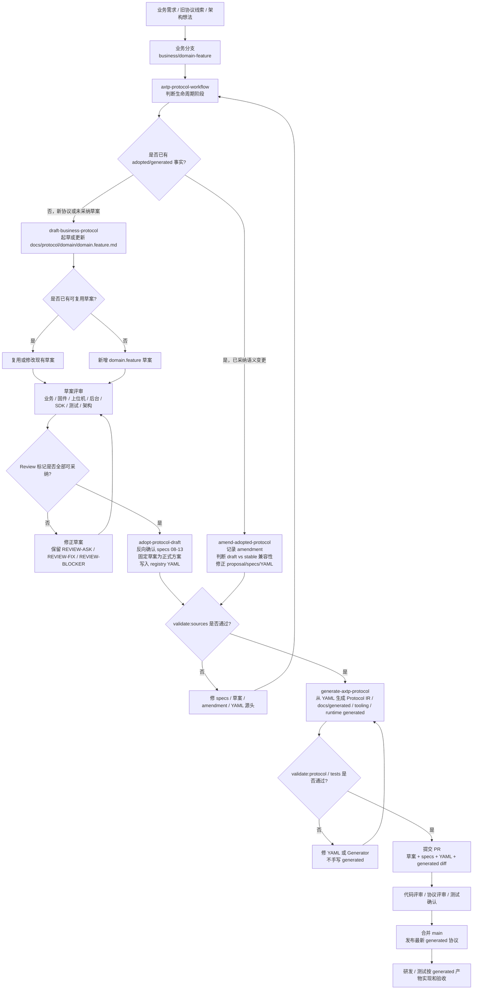

# AXTP 研发 Kickoff 文档

状态：Draft

面向对象：固件/MCU、设备端 Linux/Android、上位机/客户端、云端/后台、SDK/CLI、测试、架构评审和项目管理

定位：用于研发启动会讲清为什么要重做协议、新协议是什么、怎么使用、后续如何落地。

## 1. 一句话结论

AXTP 不是再写一份格式表，而是把公司分散在 HID、HTTP、WebSocket、二进制命令表和旧设备协议里的通信能力，收敛成一套统一架构、统一协议语言、统一事实源、统一生成和统一测试的研发体系。

它解决三件事：

1. 弥补旧协议缺少 event、stream、能力发现和统一治理的问题。
2. 支撑后续设备在 HID、TCP、WebSocket 等链路上无限丝滑地扩展控制面和数据面。
3. 让固件、上位机、云端、测试和工具团队使用同一套 method/event/error/schema/capability 语言。

## 2. 为什么要重做协议

### 2.1 老协议的问题已经从格式问题变成体系问题

旧协议不是一份协议，而是一组历史协议族：

| 来源 | 典型形态 | 主要问题 |
|---|---|---|
| AXDP/HID 二进制命令 | `CmdValue`、固定结构、HID report | 紧凑但事件、能力、流和错误治理不足 |
| VM33 HTTP JSON | `Seq/Class/Method/Param/Result/ErrorNo` | 可读但偏 request/response，设备主动 event 和长任务不自然 |
| Rooms / Signage / Launcher | WebSocket、HTTP、业务 JSON | 有 event 雏形，但和 HID/BinaryRPC 不统一 |
| 临时业务扩展 | 私有字段、私有 notify、分支文档 | 命名、字段、错误码、测试和代码容易漂移 |

继续沿用旧模式，每新增一个业务能力都容易变成：

```text
HID 写一套命令
HTTP/WebSocket 写一套方法
固件写一套常量
上位机写一套 schema
测试写一套脚本
文档再人工对齐一次
```

这不是单个团队的问题，而是协议生产方式的问题。

### 2.2 旧协议很难原生表达 Event

过去很多二进制协议以“主机发命令，设备回响应”为中心。设备主动上报通常被做成：

- 特殊 command。
- 特殊状态包。
- 定时轮询。
- 私有 notify。
- 塞进某个固定 report 的状态位。

这些方式都没有统一的 `eventId`、event schema、订阅关系和触发条件。现在设备需要主动上报的场景越来越多：

- 篮球进球事件。
- OTA 进度和结果。
- AP/Wi-Fi 状态变化。
- 显示窗口状态变化。
- 流打开、关闭、异常。
- 设备状态、告警、按键、输入源变化。

AXTP 把 event 作为 RPC 语义的一等公民，由 Event Registry 统一管理。

### 2.3 管理混乱会让研发持续重复付费

旧模式中，协议事实散落在 Word、PDF、Excel、固件宏、客户端代码、测试脚本和不同项目分支中。典型后果是：

- 同一个业务动作在不同传输上名字不同。
- 同一个错误码在不同设备上含义不同。
- 文档说字段是可选，代码却要求必填。
- 测试工具需要人工维护 method 和 schema。
- 旧协议适配逻辑混进新 runtime，后续越来越难维护。

AXTP 的改造重点不是“文档写得更漂亮”，而是让协议事实可生成、可校验、可复用。

### 2.4 技术上必须支撑后续设备无限丝滑

后续设备会同时面对：

- HID 大 report 音视频/音频通道。
- TCP/局域网直连。
- WebSocket 上位机和云端控制。
- OTA、文件、日志、媒体流等连续数据。
- 多设备、多型号、多能力裁剪。

如果没有统一的协议骨架，每条新链路都会重新设计 request、event、stream、error、capability。AXTP 把这些能力拆成通用层，业务只扩展 Registry，不扩展 Header。

## 3. 新协议是什么

### 3.1 AXTP 的设计方案

AXTP 按五层组织：

```text
Business Layer    device / display / firmware / network / stream / ...
Registry Layer    method / event / error / schema / capability / profile
Payload Layer     CONTROL / RPC / STREAM
Frame Layer       Standard Frame Header / length / fragment / CRC
Transport Layer   USB HID / TCP / WebSocket / future low-bandwidth paths
```

| 层级 | 职责 | 使用者 |
|---|---|---|
| Transport | 接入 HID、TCP、WebSocket 等实际链路 | 平台/设备 I/O 开发 |
| Frame | 处理 Magic、Version、Length、MessageId、Fragment、CRC | runtime/core 开发 |
| Payload | 分发 CONTROL、RPC、STREAM | runtime/core 开发 |
| Registry | 定义 method、event、error、schema、capability、profile | 架构、业务研发、测试、工具 |
| Business | 执行真实设备功能 | 固件、设备端、后台、上位机 |

核心原则：

```text
Transport 不理解业务方法
Frame 不承载业务类型
PayloadType 只区分 CONTROL / RPC / STREAM
method/event/error/schema 都进入 Registry
Business 不直接修改 Header
```

### 3.2 Header 如何设计

Standard Framed 使用固定 12B Header：

```text
+-----------------------------+------------+-----------+
| Standard Frame Header (12B) | Payload(N) | CRC16(2B) |
+-----------------------------+------------+-----------+
```

Wire 图：

```text
Offset  0: Magic[0](1)  Magic[1](1)  Version(1)  PayloadType(1)
Offset  4: PayloadLength(2)  SourceId(1)  DestinationId(1)
Offset  8: MessageId(2)  FrameIndex(1)  FrameCount(1)
Offset 12: Payload starts
Footer:    CRC16(2), covers Header(12B) + Payload(N)
```

字段说明：

| 字段 | 长度 | 说明 |
|---|---:|---|
| `Magic` | 2B | 固定 `0x41 0x58`，ASCII `AX` |
| `Version` | 1B | 当前 Standard Header 版本为 `0x01` |
| `PayloadType` | 1B | `CONTROL=0x01`、`RPC=0x02`、`STREAM=0x03` |
| `PayloadLength` | 2B | Payload 字节数，不含 Header 和 CRC |
| `SourceId` | 1B | 源逻辑节点 |
| `DestinationId` | 1B | 目标逻辑节点 |
| `MessageId` | 2B | 逻辑 Message ID |
| `FrameIndex` | 1B | 当前分片序号，从 0 开始 |
| `FrameCount` | 1B | 分片总数，未分片为 1 |
| `CRC16` | 2B | CRC16-CCITT-FALSE |

多字节整数在线格式中使用 Little-Endian。Frame Header 不出现 `VIDEO`、`OTA`、`FILE`、`Config` 等业务字段。

### 3.3 Payload 如何设计

AXTP 顶层只有三种 Payload：

| PayloadType | 用途 | 典型内容 |
|---|---|---|
| CONTROL | 运行时控制 | OPEN、ACCEPT、HEARTBEAT、ACK、NACK、CLOSE |
| RPC | 业务控制面 | Hello、Identify、Request、Response、Event |
| STREAM | 连续数据面 | OTA chunk、文件块、日志流、音频帧、视频帧 |

#### CONTROL Payload

```text
Standard Frame Header(payloadType=CONTROL)
  + opcode:uint8
  + controlId:uint16
  + statusCode:uint16
  + TLV body(N)
  + CRC16
```

CONTROL 只负责建连、确认、关闭、心跳和运行时控制，不负责业务方法。

#### RPC Binary Payload

```text
Standard Frame Header(payloadType=RPC)
  + rpcEncoding:uint8
  + rpcOp:uint8
  + requestId:uint32
  + methodOrEventId:uint16
  + statusCode:uint16
  + bodyEncoding:uint8
  + body(N)
  + CRC16
```

Binary RPC 适合 HID/TCP/MCU 高效率路径。`methodOrEventId` 来自 Method/Event Registry，body 可以是 TLV 或其他已声明编码。

#### RPC JSON Payload

Standard Framed 中也可以承载 JSON RPC：

```text
Standard Frame Header(payloadType=RPC)
  + UTF-8 JSON {"sid":"...","op":7,"d":{"id":1,"method":"device.getInfo","params":{}}}
  + CRC16
```

WebSocket Unframed JSON 不使用 Standard Frame：

```text
WebSocket text message
  = JSON {"sid":"...","op":7,"d":{"id":1,"method":"device.getInfo","params":{}}}
```

#### STREAM Payload

```text
Standard Frame Header(payloadType=STREAM)
  + streamId:uint32
  + seqId:uint32
  + cursor:uint64
  + data(N)
  + CRC16
```

STREAM Header 固定 16B，不写业务类型。业务含义由 RPC 建流时绑定：

| 场景 | 控制面 | 数据面 |
|---|---|---|
| OTA | `firmware.begin` 返回 stream 相关参数 | STREAM chunk，`cursor=byteOffset` |
| HID audio/video | `stream.open` 绑定 `media.audio` / `media.video` profile | STREAM frame，`cursor=timestampUs` 或业务约定游标 |
| 文件 | file transfer 草案/采纳后的 begin/end 方法 | STREAM chunk |
| 日志 | log stream 草案/采纳后的 start/stop 方法 | STREAM record/chunk |

### 3.4 怎么在传输方案中使用和选择

| Transport Profile | Wire 模式 | CONTROL | RPC | STREAM | 适用场景 |
|---|---|---:|---:|---:|---|
| `AXTP-USB-HID` | Standard Framed | 是 | Binary / JSON | 是 | NA20/NT10 HID、大 report、设备直连 |
| `AXTP-TCP` | Standard Framed | 是 | Binary / JSON | 是 | PC/App 与设备局域网直连 |
| `AXTP-WS-JSON` | WebSocket Unframed JSON | 否 | JSON | 否 | 浏览器、调试工具、轻量上位机 |
| `AXTP-WS-CLOUD-REVERSE` | WebSocket Unframed JSON | 否 | JSON | 否 | 设备主动连云端，云端作为 Logical Client |
| Compact/BLE/UART | 低带宽降级路径 | 按降级 profile | 按降级 profile | 按降级 profile | P1/P2 特殊链路，不改变上层语义 |

选择原则：

- 需要 OTA、音视频、文件、日志等连续数据，优先选 Standard Framed。
- 浏览器、云端、轻量 RPC 控制，优先选 WebSocket Unframed JSON。
- HID/TCP 上如果需要调试便利，可以先用 framed JSON RPC；量产或低资源路径再切 Binary RPC/TLV。
- BLE/UART/小 report HID 不新增业务 PayloadType，只通过低带宽降级 profile 改外层 framing、MTU 和确认策略。

启动流程：



WebSocket JSON 没有 CONTROL OPEN/ACCEPT，建连后由 Logical Server 发送 Hello。

### 3.5 C++ runtime 怎么实现

当前 C++ runtime 的核心结构是：

```text
ITransport <-> AxtpEndpoint -> AxtpCore -> BasicBroker<>
```

框架图：



分层图：

```text
Application / Business
  使用 SDK 或 BasicBroker 注册业务 handler

SDK / Tool
  AxtpClient / AxtpServer / axtpctl
  默认使用 dynamic RPC：methodName + JSON/TLV/Raw body

Runtime Glue
  AxtpEndpoint
  连接 transport、core、broker，负责 poll 和 flush

Protocol Core
  AxtpCore
  FrameDecoder / PayloadDecoder / JsonRpcDecoder / PayloadEncoder / FrameEncoder

Transport
  HidTransport / TcpTransport / WebSocket transport / MockTransport
```

各层给谁用：

| 层级 | 给谁用 | 应该做什么 | 不应该做什么 |
|---|---|---|---|
| `ITransport` | 平台/驱动开发 | 读写 bytes/message，暴露 transport profile | 解析 frame、method、legacy command |
| `AxtpCore` | 协议 runtime 开发 | decode/encode、状态机、CoreEvent、outbound bytes | 持有 transport 或调用业务 |
| `AxtpEndpoint` | 应用集成/SDK | glue core、broker、transport，执行 poll 顺序 | 写业务逻辑 |
| `BasicBroker<>` | 业务开发/SDK | 注册 method handler，返回 BrokerResult | 回调 core 或处理 socket/thread |
| `AxtpClient/AxtpServer` | 上位机/应用开发 | dynamic RPC、mock handler、transport attach | 绕过 runtime 分层 |
| `axtpctl` | 测试/联调 | mock 调用、method 列表、frame inspect | 把业务逻辑塞进 core |

## 4. 怎么使用现在这套新协议

### 4.1 根据业务逻辑实现一份协议草案

先不要直接写 YAML。新增业务需求先进入 `docs/protocol/<domain>/<domain.feature>.md`。

流程：

```text
业务需求
  -> 搜索 docs/protocol 是否已有可复用草案
  -> 按 domain.feature 归类
  -> 写候选 method/event/schema/error/capability/profile
  -> 标记 [REVIEW-DRAFT] / [REVIEW-ASK] / [REVIEW-BLOCKER]
  -> 找相关研发、测试、架构评审
```

草案必须回答：

- 这个能力属于哪个 domain 和 feature。
- 谁调用，设备做什么，是否需要 event 或 stream。
- 请求字段、响应字段、事件字段是什么。
- 需要哪些错误码。
- 是否有旧协议映射证据。
- 是否影响 profile、capability、MVP 或兼容性。

### 4.2 怎么把草案落到规范中

新协议草案评审通过后，才进入采纳流程：

```text
docs/protocol/<domain>/<domain.feature>.md
  -> human review
  -> adopt-protocol-draft
  -> reverse-confirm docs/specs/08-13
  -> registry/**/*.yaml or registry/domains/**/*.yaml
  -> generate-axtp-protocol
  -> protocol/axtp.protocol.yaml
  -> docs/generated/* + tooling/* + runtime generated headers
```

已采纳协议如果后续发现字段、枚举、命名或语义需要修正，不回到普通草案流程，也不直接手改 generated；使用 `amend-adopted-protocol` 记录 amendment、判断兼容性、修正 adopted proposal/specs/YAML，再重新生成。

完整协议评审与发布流程：



### 4.2.1 每个阶段谁来做什么

| 阶段 | 主责角色 | 参与角色 | 主责动作 | 参与角色要确认的内容 | 阶段产物 |
|---|---|---|---|---|---|
| 需求输入 | 业务负责人 / 产品 / 架构 | 固件、上位机、后台、测试 | 提供业务目标、旧协议线索、触发场景、优先级 | 需求是否真实、是否要兼容旧协议、是否涉及 event/stream | 业务描述、旧协议证据、优先级 |
| 建分支和路由 | 协议维护者 / 架构 | 提需求的人 | 建 `business/<domain-feature>` 或 feature 分支；用 `axtp-protocol-workflow` 判断阶段 | 这次是草案、采纳、修订、生成还是实现 | 分支和明确 workflow |
| 草案设计 | 协议维护者 / 架构 | 业务、固件、上位机、后台、测试 | 用 `draft-business-protocol` 起草或更新 `docs/protocol/<domain>/<domain.feature>.md` | 业务语义、domain.feature、method/schema/event/error/capability 是否合理 | 带 `[REVIEW-*]` 的协议草案 |
| 草案评审 | 架构 / 业务负责人 | 固件、上位机、后台、SDK/工具、测试 | 组织评审，逐项关闭或保留 review 标记 | 固件确认资源和状态机；上位机/后台确认调用方式；测试确认可测性；SDK/工具确认生成消费方式 | `[REVIEW-OK]` 的可采纳范围和 open questions |
| 采纳到规范 | 协议维护者 / 架构 | 业务、固件、上位机、测试 | 用 `adopt-protocol-draft` 反向确认 specs 08-13，固定草案为正式方案，写 registry/domain YAML | 未确认事实没有进入 YAML；ID、`bit_offset`、fieldId 无冲突 | specs/YAML/source validation 结果 |
| 已采纳修订 | 协议维护者 / 架构 | 业务、固件、上位机、后台、测试 | 用 `amend-adopted-protocol` 记录修订、判断兼容性、修正 adopted proposal/specs/YAML | draft/experimental 是否可直接修正；stable/MVP 是否必须 deprecate 或版本化 | amendment 记录、更新后的 YAML/source validation |
| 生成产物 | 协议维护者 / SDK/工具 | 测试、研发 | 用 `generate-axtp-protocol` 从 YAML 生成 Protocol IR、generated docs、tooling、test vectors、runtime generated headers | generated diff 是否符合协议变更；测试向量是否覆盖关键路径 | `protocol/axtp.protocol.yaml`、`docs/generated/*`、runtime/tooling generated |
| PR 和发布 | 协议维护者 / 研发负责人 | 业务、固件、上位机、后台、测试 | 提交 PR，说明草案、specs、YAML、generated diff、兼容影响和验证结果 | 各端确认能基于 generated 产物开发和验收 | 合并 main，发布最新 generated 协议 |
| 研发实现和验收 | 固件 / 上位机 / 后台 / SDK | 测试、协议维护者 | 按 generated 文档、JSON、headers、test vectors 实现和联调 | 正向、错误、event、stream、legacy 兼容场景通过 | 端到端功能和测试验收 |

采纳时必须确认：

- `domain.feature` 符合 08 命名和 feature taxonomy。
- method/event/error/capability/schema 的 ID 和 bit offset 不冲突。
- fieldId 在 schema 内稳定且不复用。
- `[REVIEW-ASK]` 和 `[REVIEW-BLOCKER]` 没有被写进 YAML。
- legacy 映射只登记有证据的旧命令、旧状态码和 payload。

修订时必须确认：

- 目标事实已经进入 YAML/generated，而不是未采纳草案。
- 当前 status 是 `draft/experimental` 还是 `mvp/stable`。
- draft/experimental 字段删除或范围收窄有明确人工确认。
- stable/MVP 字段、ID、method/event/capability 默认只能 deprecated 或版本化替代，不能静默删除或复用。
- generated 产物只能由 Generator 刷新，不直接手改。

### 4.3 怎么利用落成后的文件和资源

采纳后研发使用 generated 产物，不依赖未采纳草案：

| 产物 | 使用者 | 用途 |
|---|---|---|
| `docs/generated/protocol.md` | 所有人 | 最终协议参考 |
| `docs/generated/protocol.json` | 工具、SDK、测试 | 机器可读协议模型 |
| `docs/generated/*_registry.generated.md` | 研发、测试、评审 | 查 methodId、eventId、errorCode、capability |
| `tooling/mcp/*.generated.json` | 工具链/MCP | 自动化查询协议事实 |
| `tooling/test-vectors/*` | 测试、runtime | 线格式一致性测试 |
| `runtimes/cpp-core/include/axtp/generated/*` | C++ runtime/SDK | 生成的 ID、traits、registry、codec |

### 4.4 哪些可以手动改，哪些不能改

可以手动改：

- `docs/protocol/**`：业务草案和评审意见。
- `docs/specs/**`：规范说明和治理规则。
- `docs/dev/**`：研发流程、kickoff、skill 和工程说明。
- `registry/**/*.yaml`：已确认协议事实源。
- `registry/domains/**/*.yaml`：新增业务域事实源。
- `runtimes/**` 中非 generated 的 runtime、SDK、tool 代码。
- `generators/src/**`：生成器逻辑。

不能手动改：

- `protocol/axtp.protocol.yaml`
- `docs/generated/**`
- `tooling/mcp/*.generated.json`
- `tooling/test-vectors/**`
- `runtimes/*/generated/**`
- `runtimes/cpp-core/include/axtp/generated/**`
- `generators/src/__snapshots__/**`

如果 generated 内容错了，修源头，不修 generated。

### 4.5 推荐评审流程

每个业务需求走独立业务分支或 feature 分支：

```text
main
  -> business/<domain-feature> 或 feature/<ticket>
  -> draft-business-protocol: docs/protocol 草案设计
  -> 业务/固件/上位机/测试/架构评审
  -> 修正 [REVIEW-*] 问题
  -> adopt-protocol-draft: 对齐 specs 08-13 + 采纳到 registry/domains 或 registry
  -> generate-axtp-protocol: 刷新 generated 产物
  -> 如已采纳协议还需语义修正，走 amend-adopted-protocol + generate-axtp-protocol
  -> 提交 PR
  -> CI/评审通过
  -> 合并 main
  -> main 发布新的 docs/generated/protocol.md
  -> 研发/测试按最新 generated 协议实现和验收
```

评审建议：

| 阶段 | 参与角色 | 重点 |
|---|---|---|
| 草案设计 | 业务负责人、架构 | domain.feature、交互模型、是否需要 event/stream |
| 技术评审 | 固件、上位机、后台、SDK | 字段、错误码、传输选择、资源限制 |
| 测试评审 | 测试、工具 | 可观测性、测试向量、兼容旧协议 |
| 采纳评审 | 架构、协议维护者 | ID、schema、bit offset、generated diff |
| 修订评审 | 架构、协议维护者、相关业务 owner | 删除/废弃/重命名/收窄是否兼容，是否需要版本化 |
| 发布确认 | 研发负责人、测试 | generated 文档、SDK/tool、设备适配计划 |

## 5. 后续开发安排

以下以 `T0` 表示 kickoff/立项日。Owner 使用角色占位，具体姓名由项目管理在会议后补齐。

| 阶段 | 时间节点 | 业务驱动 | 关键任务 | Owner 角色 | 输出物 |
|---|---|---|---|---|---|
| P0 | T0 - T+1 周 | 协议文档和研发共识 | README、How To Use、Kickoff、评审流程固化 | 架构、协议维护者 | 文档入口、流程说明 |
| P0 | T0 - T+2 周 | NA20 + 大屏 + NT10 上位机适配 | 明确 HID audio/video 走 `AXTP-USB-HID` + `stream.open`/STREAM；梳理 AP 设置、Wi-Fi 写入、OTA、设备信息查询草案 | 架构、固件、上位机、测试 | `network.*`、`firmware.ota`、`device.info`、`stream.hidMedia` 评审清单 |
| P1 | T+2 - T+4 周 | NA20/NT10 MVP 联调 | `device.getInfo`、`network.getApInfo`、AP/Wi-Fi 设置草案、OTA STREAM demo、HID media profile 联调 | 固件、上位机、SDK/工具、测试 | 端到端测试记录、必要协议草案/采纳 PR |
| P1 | T+3 - T+5 周 | VM33 Pro 新版本协议适配 | 老协议保留；筛选新协议配置方案：时间同步、篮球进球事件、设备升级、设备信息查询 | 业务负责人、固件、上位机、架构 | VM33 新旧协议映射表、草案评审结论 |
| P1 | T+4 - T+6 周 | UXPlay 控制方案 | 设计设置投屏密码、控制窗口大小、显示状态等 domain.feature 草案 | 上位机、设备端、架构、测试 | UXPlay 控制草案、评审问题清单 |
| P2 | T+5 - T+8 周 | NearHub Launcher 与后台交互通用化 | 梳理 Launcher 设备管理命令，规整后台交互逻辑，定义可复用 method/event/schema | 后台、Launcher、架构、测试 | Launcher 通用化草案、兼容策略 |
| P2 | T+6 - T+9 周 | 工具和测试体系 | 扩展 `axtpctl`、test vectors、mock/server 验证链路；沉淀生成协议到测试用例的路径 | SDK/工具、测试 | CLI 验证命令、测试矩阵 |
| Observe | T0 起持续 | Rooms | 暂不改当前协议方案，只纳入兼容性观察和后续评审 | Rooms 业务负责人、架构 | 观察记录、后续迁移建议 |

### 5.1 NA20 + 大屏 + NT10

目标：基于 HID 的 audio/video 传输和上位机新协议适配。

建议拆分：

| 能力 | 建议协议归属 | 传输选择 | 备注 |
|---|---|---|---|
| AP 设置 | `network.ap` / `network.softAp` 草案或采纳 | RPC over HID/TCP | 当前已有 `network.getApInfo` 和 `network.apInfoChanged` draft |
| Wi-Fi 设置写入 | `network.wifi` 草案 | RPC over HID/TCP | 涉及密码、安全类型、连接结果 event |
| OTA 固件升级 | `firmware.ota` | RPC + STREAM over HID/TCP | 当前已有 firmware MVP 方法和事件 |
| 设备信息查询 | `device.info` | RPC | 当前已有 `device.getInfo` MVP |
| HID audio/video | `stream.hidMedia` | `AXTP-USB-HID` + STREAM | 当前已有 `stream.open` 和 `AXTP-HID-MEDIA` draft |

### 5.2 VM33 Pro 新版本协议适配

策略：老协议继续保留，新功能逐步映射到 AXTP。

优先筛选：

| 能力 | 建议处理 |
|---|---|
| 时间同步策略 | 检查 `system.time` 草案，确认是否采纳为 method/event |
| 篮球进球事件通知 | 先做业务草案，确认 domain 归属、event schema 和触发条件 |
| 设备升级 | 优先复用 `firmware.ota` |
| 设备信息查询 | 优先复用 `device.getInfo` |

要求：VM33 旧协议映射必须有旧 method、payload、status 证据，不能把 TBD 写进 YAML。

### 5.3 UXPlay 控制方案

优先草案：

| 能力 | 可能归属 | 关键问题 |
|---|---|---|
| 设置投屏密码 | `auth` / `signage` / `system` 需评审确认 | 密码生命周期、权限、是否回显 |
| 控制窗口大小 | `output.layout` 或 `video.layout` | 坐标系、屏幕编号、比例、边界 |
| 控制显示状态 | `display.output` / `output.layout` | 显示/隐藏、置顶、窗口状态 event |

先评审 domain 边界，再采纳。

### 5.4 NearHub Launcher 与后台交互通用化

目标：把 Launcher 与后台的设备管理逻辑从项目私有 API，整理成可复用 method/event/schema。

建议步骤：

1. 读取 `docs/legacy-protocols/NearHub-Launcher*.md`。
2. 按 domain.feature 分类现有命令。
3. 已有能力复用现有草案或 registry。
4. 新能力进入 `docs/protocol/<domain>/<domain.feature>.md`。
5. 评审后再采纳到 YAML。

### 5.5 Rooms

Rooms 暂时不改当前协议方案。当前只做三件事：

- 保留旧协议运行。
- 记录与 AXTP model 的差异。
- 后续等业务窗口明确后再做草案评审。

## 6. 测试和验收

### 6.1 协议仓库验收

每次协议事实变更至少运行：

```bash
pnpm --dir generators build
pnpm --dir generators test
pnpm --dir generators validate:sources
pnpm --dir generators generate
pnpm --dir generators validate:protocol
git diff --check
```

文档-only 变更至少运行：

```bash
pnpm --dir generators build
pnpm --dir generators test
pnpm --dir generators validate:sources
pnpm --dir generators validate:protocol
git diff --check
```

### 6.2 Runtime 验收

C++ runtime 测试地图：

| 测试 | 覆盖 |
|---|---|
| `phase1_model_io_test` | model / IO primitives |
| `phase2_inbound_test` | FramedBinary 和 WebSocketJsonRpc inbound decode |
| `phase3_outbound_test` | FramedBinary 和 WebSocketJsonRpc outbound encode |
| `phase4_core_test` | core events、control、broker result |
| `phase5_transport_test` | `AxtpEndpoint` + mock transport |
| `phase6_real_transport_test` | TCP/WebSocketJsonRpc transport flows |
| `phase7_broker_test` | `BasicBroker<>` dynamic dispatch |
| `phase8_api_surface_test` | aggregate header、packet/text IO、dynamic registry |
| `phase9_hid_transport_test` | HID report slicing 和 ManualPoll |

### 6.3 业务验收

每个业务能力 PR 需要能回答：

- method/event/schema 是否出现在 generated protocol。
- 设备能力是否能通过 capability 或 profile 表达。
- 正常路径、参数错误、设备忙、不支持、状态不允许等错误是否可测。
- 如果涉及旧协议，legacy adapter 是否有测试向量或映射证据。
- 如果涉及 STREAM，是否有建流、传输、完成、失败、断开恢复或资源释放测试。

## 7. 会议建议议程

1. 为什么重做协议：旧协议问题、event/stream/治理缺口、后续设备需要。
2. 新协议是什么：五层架构、CONTROL/RPC/STREAM、两条传输路径。
3. Wire format：Standard Frame、CONTROL、RPC Binary、RPC JSON、STREAM。
4. C++ runtime：`ITransport <-> AxtpEndpoint -> AxtpCore -> BasicBroker<>`。
5. 怎么用：草案、评审、采纳、生成、研发/测试消费。
6. 已采纳协议怎么修：amendment、draft vs stable 判断、deprecate/version 策略。
7. 后续安排：NA20/NT10、VM33 Pro、UXPlay、Launcher、Rooms。
8. 决策事项：业务优先级、owner、T0 日期、首批 PR 范围。
