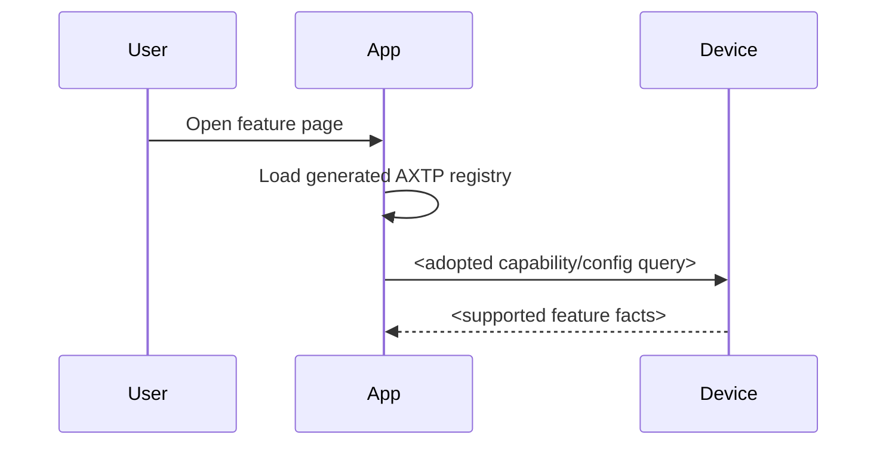

# <Scenario Name> Protocol Interaction Flow

> Status: flow design
> Scope: <product / device / app feature>
> Source inputs: <UI prototype, business story, legacy docs, requirement links>
> Protocol lifecycle: `plan-protocol-flow`

本文根据业务场景和交互 story 梳理需要使用的 AXTP 协议、已有覆盖状态和协议缺口。本文不是最终协议事实源；已采纳事实以 `registry/**/*.yaml`、`registry/domains/**/*.yaml` 和 `docs/generated/**` 为准，新增或修改协议必须转入 `docs/protocol/**` 草案和后续采纳流程。

## 1. Story Summary

| Item | Content |
|---|---|
| User goal | <what the user wants to accomplish> |
| Trigger | <how the flow starts> |
| Success result | <observable success state> |
| Primary actors | <App / server / device / firmware service / user> |
| Product scope | <device family / firmware / App version if known> |

## 2. Source Observations

### 2.1 UI / Prototype

| Screen or control | Observed behavior | Protocol relevance |
|---|---|---|
| <screen/control> | <visible field, toggle, slider, button, validation> | <read config / set config / event / local only> |

### 2.2 Requirement Notes

- <business rule>
- <persistence/restart/latency expectation>
- <legacy compatibility note>

## 3. Assumptions And Non-Goals

| Type | Item | Status |
|---|---|---|
| Assumption | <reasonable working assumption> | `[REVIEW-DRAFT]` |
| Question | <unconfirmed fact> | `[REVIEW-ASK]` |
| Non-goal | <what this flow does not cover> | `[REVIEW-OK]` |

## 4. Protocol Coverage

| Need | Coverage state | AXTP protocol | Evidence | Next action |
|---|---|---|---|---|
| <need> | Adopted/generated / Partially adopted / Drafted only / Missing / Non-protocol | <method/event/capability> | <file path> | <implement / draft / amend / no action> |

## 5. End-To-End Sequence

## 6. Interaction Steps

| Step | Actor | User or system action | Protocol call/event | Request / event payload notes | Response / state result | Error or fallback |
|---:|---|---|---|---|---|---|
| 1 | <actor> | <action> | <method/event or local only> | <fields> | <result> | <errors> |

## 7. Protocol Details

### 7.1 Adopted / Generated Protocols

| Method/Event | Purpose in this flow | Source |
|---|---|---|
| <method/event> | <why used> | `docs/generated/protocol.md` |

### 7.2 Draft Or Missing Protocol Gaps

| Gap | Candidate domain.feature | Candidate method/event/schema | Routed skill | Review question |
|---|---|---|---|---|
| <gap> | `<domain.feature>` | <candidate> | `draft-business-protocol` or `amend-adopted-protocol` | `[REVIEW-ASK]` |

## 8. Test Fixtures

| Fixture | Expected result |
|---|---|
| <fixture-name> | <observable protocol/app/device result> |

## 9. Acceptance Gates

- All required adopted/generated methods are present in the generated registry, and any runtime capability/config query confirms device support.
- App and device use generated schemas for protocol payloads.
- All missing/draft-only protocol gaps have an owner and next workflow.
- Error and unsupported-method behavior is visible in the UI or product flow.

## 10. Open Questions

- `[REVIEW-ASK]` <question>
