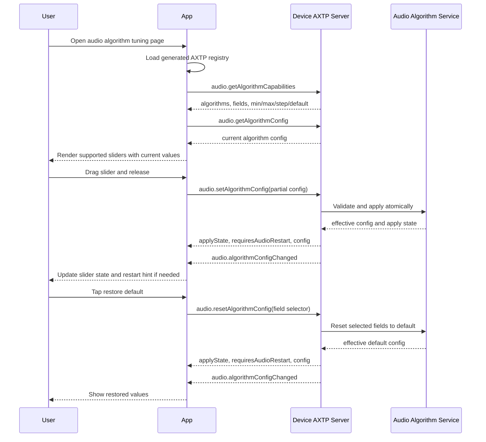

# Audio Algorithm Level Control Protocol Interaction Flow

> Status: flow design
> Scope: App UI for adjusting audio algorithm strength levels
> Source inputs: user request for an audio algorithm tuning UI with level sliders and a restore-default button
> Protocol lifecycle: `plan-protocol-flow`

本文根据“UI 界面上能够调控音频算法强度等级，具备各个调试等级的拖动条，以及恢复默认按钮”的业务场景，梳理 App、设备和 AXTP 协议之间的交互流程。

本文不是最终协议事实源。当前可实现协议以 `docs/generated/protocol.md`、`protocol/axtp.protocol.yaml` 和 `registry/domains/audio/domain.yaml` 为准；如后续 UI 需要当前 `audio.algorithm` 未覆盖的字段或行为，应转入 `amend-adopted-protocol`。

## 1. Story Summary

| Item | Content |
|---|---|
| User goal | 用户在 App 的音频算法调试页中，通过拖动条调整设备音频算法强度等级，并可一键恢复默认值。 |
| Trigger | 用户进入音频算法调试页面。 |
| Success result | UI 展示设备支持的算法等级项、当前值、范围和默认值；用户调整后设备生效；恢复默认后 UI 和设备配置回到默认等级。 |
| Primary actors | User, App, Device AXTP server, audio algorithm service |
| Product scope | `[REVIEW-ASK]` 具体产品型号、固件版本和 UI 原型图未提供；本方案按通用 `audio.algorithm` 能力设计。 |

## 2. Source Observations

### 2.1 UI / Prototype

| Screen or control | Observed behavior | Protocol relevance |
|---|---|---|
| Audio algorithm tuning page | 展示多个音频算法强度项。 | 需要查询 `audio.getAlgorithmCapabilities` 和 `audio.getAlgorithmConfig`。 |
| Level sliders | 每个可调等级项有拖动条；范围、步进和默认值应由设备能力决定。 | 使用 capability 中的 property descriptor 渲染 slider。 |
| Restore default button | 用户点击后恢复默认等级。 | 使用 `audio.resetAlgorithmConfig`。 |
| Save/apply behavior | `[REVIEW-DRAFT]` 默认按“松手或防抖后立即提交”设计；若产品需要显式保存按钮，可把多个 slider 变化合并提交。 | 使用 `audio.setAlgorithmConfig` 的 partial update。 |
| UI prototype image | `[REVIEW-ASK]` 本轮没有可读取的图片文件；控件名称、分组、文案和是否有 enable 开关需 UI 原型确认。 | 不新增协议，只影响 UI 呈现和字段选择。 |

### 2.2 Requirement Notes

- UI 不应写死算法列表、范围、步进或默认值；必须以 `audio.getAlgorithmCapabilities` 返回为准。
- UI 只展示设备声明 `supported=true` 且存在 numeric property descriptor 的字段。
- “等级拖动条”优先覆盖 `level` / `nlpLevel` / `sensitivity` 这类强度字段；时间、角度、电平等高级参数不默认放入本页，除非产品明确要求。
- 恢复默认按钮推荐只恢复本页 slider 字段，不默认重置 `enabled`、`reportingEnabled` 或其他非等级字段。

## 3. Assumptions And Non-Goals

| Type | Item | Status |
|---|---|---|
| Assumption | 拖动条调整的是算法强度等级，而不是算法开关、音频路由、音量或 EQ。 | `[REVIEW-DRAFT]` |
| Assumption | App 连接设备后可完成 AXTP session，并已加载当前产品生成的 AXTP registry。 | `[REVIEW-DRAFT]` |
| Assumption | UI 变更提交采用松手提交或 300-500 ms 防抖提交，避免拖动过程高频 RPC。 | `[REVIEW-DRAFT]` |
| Question | 恢复默认是恢复本页所有 slider 字段，还是恢复 `audio.algorithm` 的全部字段，包括 enabled 和高级参数？ | `[REVIEW-ASK]` |
| Question | UI 是否需要显示算法开关、当前算法运行状态、DOA/beam 实时结果或试听预览？ | `[REVIEW-ASK]` |
| Non-goal | 不新增音频算法协议方法。当前场景由已生成的 `audio.algorithm` 方法覆盖。 | `[REVIEW-OK]` |
| Non-goal | 不把 UI 控件布局、文案、主题或本地校验样式写入协议。 | `[REVIEW-OK]` |

## 4. Protocol Coverage

| Need | Coverage state | AXTP protocol | Evidence | Next action |
|---|---|---|---|---|
| 确认设备是否支持音频算法配置 | Adopted/generated | Generated registry, `audio.getAlgorithmCapabilities`, `audio.algorithm` capability | `docs/generated/protocol.md`, `registry/domains/audio/domain.yaml` | App 实现能力门禁。 |
| 查询可展示的算法和 slider 范围 | Adopted/generated | `audio.getAlgorithmCapabilities` | `docs/generated/protocol.md#audiogetalgorithmcapabilities` | App 按返回 descriptor 渲染 UI。 |
| 查询当前等级值 | Adopted/generated | `audio.getAlgorithmConfig` | `docs/generated/protocol.md#audiogetalgorithmconfig` | App 初始化页面。 |
| 调整单个或多个等级值 | Adopted/generated | `audio.setAlgorithmConfig` | `docs/generated/protocol.md#audiosetalgorithmconfig` | App 在松手、防抖或保存时提交 partial config。 |
| 恢复默认等级 | Adopted/generated | `audio.resetAlgorithmConfig` | `docs/generated/protocol.md#audioresetalgorithmconfig` | App 传入本页 slider 字段 selector。 |
| 其他客户端或设备策略改变配置后同步 UI | Adopted/generated | `audio.algorithmConfigChanged` | `docs/generated/protocol.md#audioalgorithmconfigchanged` | App 订阅/处理 event 并刷新展示。 |
| UI 需要新增算法对象或新字段 | Partially adopted | `audio.algorithm` schema extension | `docs/protocol/audio/audio.algorithm.md`, `registry/domains/audio/domain.yaml` | 转 `amend-adopted-protocol`。 |

## 5. End-To-End Sequence



## 6. Interaction Steps

| Step | Actor | User or system action | Protocol call/event | Request / event payload notes | Response / state result | Error or fallback |
|---:|---|---|---|---|---|---|
| 1 | App | 进入页面后检查当前生成协议是否包含音频算法方法。 | Generated registry lookup | 读取当前产品包中的 generated method/event registry。 | 若包含 `audio.getAlgorithmCapabilities`、`audio.getAlgorithmConfig`、`audio.setAlgorithmConfig`、`audio.resetAlgorithmConfig`，继续运行时查询。 | 若当前 App 包不含这些方法，页面隐藏或提示版本不支持。 |
| 2 | App | 加载算法参数能力。 | `audio.getAlgorithmCapabilities` | `items` 可省略查询全部，也可传产品关心的算法对象数组。 | 返回支持算法、字段、默认值、范围、步进、单位和是否需要重启。 | `NOT_SUPPORTED` / `INVALID_ARGUMENT` 时页面不可用或降级。 |
| 3 | App | 加载当前配置。 | `audio.getAlgorithmConfig` | `items` 与 capability 查询保持一致。 | 返回当前有效配置。 | 读取失败时保留页面空态并允许重试。 |
| 4 | App | 渲染 sliders。 | Non-protocol | 只渲染 `supported=true` 且 descriptor 中存在 numeric `min/max/step/defaultInt32` 的字段。 | UI slider 值来自当前 config；默认标记来自 capabilities。 | 不支持或缺少 descriptor 的字段不展示。 |
| 5 | User/App | 用户拖动等级 slider。 | Non-protocol until commit | 拖动过程本地更新预览值。 | UI 展示待提交状态。 | 若产品需要实时生效，使用防抖提交，不逐像素发送 RPC。 |
| 6 | App | 松手、防抖结束或点击保存。 | `audio.setAlgorithmConfig` | 只发送变化字段，例如 `noiseSuppression.level`。多字段提交需遵守 `multiAlgorithmUpdateSupported`。 | 返回 `applyState`、`requiresAudioRestart` 和最终有效 config。 | `OUT_OF_RANGE` 回滚到设备返回值；`BUSY` 提示稍后重试；`PERMISSION_DENIED` 提示无权限。 |
| 7 | Device | 配置变化通知。 | `audio.algorithmConfigChanged` | `reason=user_request`，`changedFields` 可包含 `noiseSuppression.level` 等路径。 | App 用 event 校正 UI，支持多端同步。 | 若未收到 event，仍以 set response 更新当前页面；后台同步可下次读取。 |
| 8 | User/App | 用户点击恢复默认。 | `audio.resetAlgorithmConfig` | 推荐传本页 slider 字段 map；若产品确认重置全部，可传 `all`。 | 返回默认后的有效 config，并触发 changed event。 | 若 selector 无效返回 `INVALID_ARGUMENT`，App 应重新拉 capabilities。 |

## 7. Protocol Details

### 7.1 Adopted / Generated Protocols

| Method/Event | Purpose in this flow | Source |
|---|---|---|
| `audio.getAlgorithmCapabilities` | 发现支持算法、字段、范围、步进、默认值和更新策略。 | `docs/generated/protocol.md` |
| `audio.getAlgorithmConfig` | 读取当前算法等级值。 | `docs/generated/protocol.md` |
| `audio.setAlgorithmConfig` | 提交拖动条变化，支持 partial config 和原子更新。 | `docs/generated/protocol.md` |
| `audio.resetAlgorithmConfig` | 将选定算法或选定字段恢复到 capability 声明的默认值。 | `docs/generated/protocol.md` |
| `audio.algorithmConfigChanged` | 配置变化后通知 App，支持多端同步和设备策略变化。 | `docs/generated/protocol.md` |

### 7.2 Suggested Slider Fields

UI 应从 capabilities 动态生成；下面是当前 generated schema 中适合“强度等级”页面的候选字段：

| UI label candidate | Config path | Type/range | Notes |
|---|---|---|---|
| Noise Suppression Level | `noiseSuppression.level` | `uint8`, `0..3` | 噪声抑制强度。 |
| Echo Cancellation Level | `echoCancellation.nlpLevel` | `uint8`, `0..3` | 非线性处理强度；UI 文案可显示为回声消除强度。 |
| Dereverberation Level | `dereverberation.level` | `uint8`, `0..3` | 去混响强度。 |
| Howling Suppression Level | `howlingSuppression.level` | `uint8`, `0..3` | 啸叫抑制强度。 |
| Voice Activity Sensitivity | `voiceActivityDetection.sensitivity` | `uint8`, `0..3` | 不是 `level` 字段，但可作为“检测灵敏度” slider。 |

高级 numeric 字段如 `echoCancellation.tailLengthMs`、`beamforming.lookDirectionDeg`、`beamforming.beamWidthDeg`、`autoGainControl.targetLevelDb` 和 `autoGainControl.maxGainDb` 不默认归入“强度等级”页面；若 UI 原型要求展示，应按 capabilities 渲染为高级参数区，而不是新增协议。

### 7.3 Set Config Payload Shape

单个 slider 松手后提交：

```json
{
  "method": "audio.setAlgorithmConfig",
  "params": {
    "config": {
      "noiseSuppression": {
        "level": 3
      }
    }
  }
}
```

多个 slider 批量保存时提交：

```json
{
  "method": "audio.setAlgorithmConfig",
  "params": {
    "config": {
      "noiseSuppression": {
        "level": 2
      },
      "echoCancellation": {
        "nlpLevel": 3
      },
      "dereverberation": {
        "level": 1
      }
    }
  }
}
```

规则：

- 只发送变化字段，未发送字段保持当前值。
- 发送前按 capabilities 中的 `min/max/step` 做本地校验。
- 若 `multiAlgorithmUpdateSupported=false`，App 应拆成单算法请求。
- 若 response `requiresAudioRestart=true` 或 `applyState=pending_restart`，UI 应显示需要音频链路重启或稍后生效的提示。

### 7.4 Restore Default Payload Shape

推荐只恢复本页 slider 字段：

```json
{
  "method": "audio.resetAlgorithmConfig",
  "params": {
    "items": {
      "noiseSuppression": ["level"],
      "echoCancellation": ["nlpLevel"],
      "dereverberation": ["level"],
      "howlingSuppression": ["level"],
      "voiceActivityDetection": ["sensitivity"]
    }
  }
}
```

如果产品确认“恢复默认”应重置全部算法字段，可以改为：

```json
{
  "method": "audio.resetAlgorithmConfig",
  "params": {
    "items": "all"
  }
}
```

`audio.resetAlgorithmConfig` 的默认值来自 `audio.getAlgorithmCapabilities`，不是 App 本地写死。

### 7.5 Draft Or Missing Protocol Gaps

| Gap | Candidate domain.feature | Candidate method/event/schema | Routed skill | Review question |
|---|---|---|---|---|
| UI 仅调整已有等级字段 | None | None | None | 当前 generated/YAML 已覆盖。 |
| UI 需要新增算法对象，例如新的 AI 降噪算法 | `audio.algorithm` | Add schema fields / capabilities | `amend-adopted-protocol` | `[REVIEW-ASK]` 新算法名称、字段、范围、默认值和是否需要重启。 |
| UI 需要展示 DOA/beam 实时结果 | TBD, likely `audio.beam` | New event such as beam info reported | `draft-business-protocol` | `[REVIEW-ASK]` 这是算法结果上报，不应塞进 `audio.algorithmConfigChanged`。 |
| UI 需要算法授权、license 或产测参数 | TBD, likely `auth.license`, `vendor.license`, or `diagnostic.manufacturing` | New or amended protocol | `draft-business-protocol` | `[REVIEW-ASK]` 真实业务归属需确认。 |

## 8. Test Fixtures

| Fixture | Expected result |
|---|---|
| `audio-algorithm-page-load` | App 通过 generated registry、capabilities 和 config 成功渲染 sliders。 |
| `audio-algorithm-unsupported` | 当前 generated registry 缺少 `audio.algorithm` 方法，或设备返回 `NOT_SUPPORTED` 时，页面显示不支持或引导升级。 |
| `audio-algorithm-slider-set` | 调整 `noiseSuppression.level` 后，设备返回最终 config，UI 显示新值。 |
| `audio-algorithm-slider-batch-set` | 多个 slider 批量提交时，设备原子应用或整体拒绝。 |
| `audio-algorithm-out-of-range` | App 本地阻止超范围值；若设备仍返回 `OUT_OF_RANGE`，UI 回滚并提示。 |
| `audio-algorithm-reset-slider-fields` | 点击恢复默认后，仅本页 slider 字段恢复到 capability default。 |
| `audio-algorithm-reset-all-confirmed` | 若产品选择 reset all，所有 `audio.algorithm` 字段恢复默认。 |
| `audio-algorithm-config-changed-event` | 其他端或设备策略修改配置后，App 收到 event 并刷新 slider。 |
| `audio-algorithm-pending-restart` | 返回 `pending_restart` 时，UI 展示待重启/待重建音频链路提示。 |

## 9. Acceptance Gates

- 页面只在当前 generated registry 包含 `audio.algorithm` 相关方法，且设备 `audio.getAlgorithmCapabilities` 返回支持时可用。
- Slider 范围、步进、默认值和是否可展示全部来自 `audio.getAlgorithmCapabilities`。
- 当前值来自 `audio.getAlgorithmConfig` 或 set/reset response，不由 App 猜测。
- Slider 修改使用 `audio.setAlgorithmConfig` partial update。
- 恢复默认使用 `audio.resetAlgorithmConfig`，默认值来自设备 capability。
- App 处理 `audio.algorithmConfigChanged`，支持多端同步。
- Error UI 覆盖 unsupported、invalid argument、out of range、busy、permission denied 和 pending restart。

## 10. Open Questions

- `[REVIEW-ASK]` UI 原型中具体有哪些算法 slider？是否只包含 `level` 类字段，还是包含 AGC、beamforming、DOA 等高级参数？
- `[REVIEW-ASK]` 拖动时是否需要实时预览生效，还是松手/保存后生效？
- `[REVIEW-ASK]` 恢复默认按钮是恢复本页 slider 字段，还是恢复整个 `audio.algorithm` 配置？
- `[REVIEW-ASK]` 是否需要按设备角色、会议场景、房间 profile 或用户权限限制可调字段？
