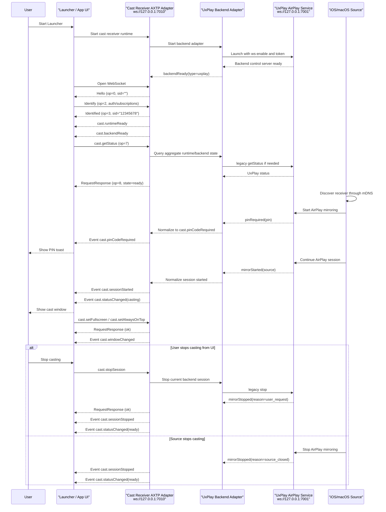

# Cast Receiver UxPlay Protocol Interaction Flow

> Status: flow design
> Scope: Launcher-integrated AirPlay receiver, Electron control service, UxPlay backend adapter
> Source inputs: `docs/business/cast-reciever-uxplay.md`, `docs/legacy-migration/evidence/WEBSOCKET_PROTOCOL.md`, pasted AXTP Cast Capability design reference
> Protocol lifecycle: Stage 10 `plan-protocol-flow`

本文根据 UxPlay/AirPlay 接收端控制需求，梳理 Launcher / UI、AXTP 外部控制口、UxPlay backend 和 iOS/macOS 投屏源之间的业务交互流程。

本文不是最终协议事实源。当前已经 adopted/generated 的事实只覆盖 AXTP core WebSocket JSON profile 和 RPC handshake；`cast.*` 业务方法与事件尚未进入 registry/generated，本文只把它们作为 Stage 20 `draft-business-protocol` 的候选缺口。

命名说明：`cast.status`、`cast.session` 这类 `domain.feature` 只表示能力草案归属；真正放进 RPC `method` / `event` 的 wire name 不带 feature 中段，例如 `cast.getStatus`、`cast.stopSession`、`cast.sessionStarted`。

## 1. Story Summary

| Item | Content |
|---|---|
| User goal | Launcher 启动投屏接收端后，iOS/macOS 能发现 AirPlay 接收端并投屏；投屏开始、停止、PIN、窗口、音频、runtime 和 backend 状态能被 UI 或外部控制端感知和控制。 |
| Trigger | Launcher 启动 Electron/UxPlay 接收端服务；或控制端连接 `ws://127.0.0.1:7010/` 并订阅投屏状态。 |
| Success result | AirPlay service ready；控制端通过 AXTP handshake 建立 RPC session；投屏开始时 UI 自动显示投屏窗口和 PIN toast；状态变化、服务退出、窗口变化、音频变化都有 AXTP event；控制端可查询状态并发起停止投屏、PIN、音频、窗口和 runtime/backend 控制。 |
| Primary actors | User, Launcher / App UI, Cast Receiver AXTP Adapter, UxPlay Backend Adapter, UxPlay AirPlay Service, iOS/macOS Source |
| Product scope | Windows Launcher 集成 AirPlay 接收端；Electron 外部控制口默认 `ws://127.0.0.1:7010/`；UxPlay backend 内部控制口默认 `ws://127.0.0.1:7001/`。 |

## 2. Source Observations

### 2.1 UI / Prototype

| Screen or control | Observed behavior | Protocol relevance |
|---|---|---|
| Launcher startup | Launcher 启动后自动启动投屏接收端软件和 AirPlay service。 | 需要 runtime/backend ready event；服务启动本身是本地编排行为。 |
| PIN toast | 接收到投屏信号或 backend 要求 PIN 时，应用侧展示当前投屏密码。 | 需要 `cast.pinCodeRequired` / `cast.pinCodeChanged` 候选 event，归属 `cast.pinCode`。 |
| Cast window | 投屏开始后应用软件主动展示投屏内容窗口；停止后可隐藏或恢复默认状态。 | 需要 `cast.sessionStarted` / `cast.sessionStopped` 和 `cast.showWindow` / `cast.hideWindow` 候选能力。 |
| Window change | 窗口大小、显示、隐藏、全屏、置顶变化时有事件发出。 | 需要 `cast.windowChanged` 候选 event，归属 `cast.window`。 |
| Audio control | 可获取或设置投屏音频开关、静音状态。 | 需要 `cast.getAudio` / `cast.setAudio` / `cast.setMuted` 和 `cast.audioChanged` 候选能力。 |
| Runtime config | 可获取和设置服务端口、服务显示名称，并监听端口变化。 | 需要 `cast.runtime` 归属下的候选 method/event；端口变更是否允许运行时生效需评审。 |

### 2.2 Requirement Notes

- 软件分为 UI 层受控端和 backend 服务层受控端，二者管辖范围不同。
- Electron 外部控制口面向 Launcher、UI 或本机外部控制端；UxPlay `7001` 内部控制口是 adapter 到 backend 的实现细节。
- iOS/macOS 通过 mDNS 发现 AirPlay 接收端并开始投屏；mDNS 和 AirPlay 媒体协议本身不进入 AXTP 标准化范围。
- 新 AXTP 流程应使用 `AXTP-WS-JSON` 的 `Hello / Identify / Identified`，不再把 legacy `HelloAck + auth Request` 当作规范握手。
- UxPlay 只作为 `backend.type = "uxplay"`；不应把 `uxplay` 放进标准 AXTP method/event name。
- `showPinWindow` / `hidePinWindow` 的语义是 PIN 展示，应归入 `cast.pinCode`；`showCastWindow` / `hideCastWindow` 才归入 `cast.window`。

## 3. Assumptions And Non-Goals

| Type | Item | Status |
|---|---|---|
| Assumption | Electron 外部控制口是 AXTP Logical Server；Launcher / UI / 外部控制端是 Logical Client。WebSocket 建立后由服务端先发送 `Hello`。 | `[REVIEW-DRAFT]` |
| Assumption | 第一版外部控制口使用 `AXTP-WS-JSON`，即 WebSocket text frame 直接承载 JSON `{sid, op, d}`，不使用 CONTROL、STREAM、CRC16 或 JSON_BINARY header。 | `[REVIEW-DRAFT]` |
| Assumption | 认证优先放在 `Identify.d.authentication` 或后续 `auth.*` 草案中，不再把 legacy `auth` method 作为 cast 业务方法。 | `[REVIEW-DRAFT]` |
| Assumption | `cast` domain 第一版角色固定为 `roles=["receiver"]`、`activeRole="receiver"`；后续如支持投屏发射端，通过 status/capability 字段扩展 role，不改 method name。 | `[REVIEW-DRAFT]` |
| Question | 外部控制口是否只允许本机 `127.0.0.1`，还是需要 LAN 控制；如允许 LAN，鉴权、Origin 和 token 轮换策略需要进入 `auth.*` 或 runtime 配置草案。 | `[REVIEW-ASK]` |
| Question | 修改控制端口后是立即重启监听、生效于下次启动，还是需要 Launcher 重启服务？ | `[REVIEW-ASK]` |
| Question | PIN 是否允许通过 `getPinCode` 明文读取，还是只通过 required/changed event 给 UI 临时展示？ | `[REVIEW-ASK]` |
| Non-goal | 不标准化 AirPlay/mDNS/RAOP 协议和 UxPlay 内部媒体实现。 | `[REVIEW-OK]` |
| Non-goal | 不把 UxPlay 内部 `7001` WebSocket 协议作为 AXTP 公共接口；它只作为 legacy adapter evidence。 | `[REVIEW-OK]` |
| Non-goal | 本文不修改 `registry/**`、`protocol/axtp.protocol.yaml`、`docs/generated/**` 或 conformance。 | `[REVIEW-OK]` |

## 4. Protocol Coverage

| Need | Coverage state | AXTP protocol | Evidence | Next action |
|---|---|---|---|---|
| 外部控制端通过 WebSocket 建立 RPC 通道 | Adopted/generated core | `AXTP-WS-JSON` | `docs/generated/protocol.md`, `docs/specs/1-core/04-Transport-Profiles.md` | 可按 core 实现。 |
| RPC session handshake | Adopted/generated core | `Hello(op=0)`, `Identify(op=2)`, `Identified(op=3)` | `docs/generated/protocol.md`, `docs/specs/1-core/06-RPC-Session.md` | 用新握手替代 legacy `HelloAck`。 |
| RPC 请求、响应、事件 envelope | Adopted/generated core | `Request(op=7)`, `RequestResponse(op=8)`, `Event(op=6)`, `sid/op/d` | `docs/generated/protocol.md`, `docs/specs/1-core/06-RPC-Session.md` | 可按 core 实现。 |
| Legacy token auth | Partially covered / Drafted only | `Identify.d.authentication`, future `auth.*` | `docs/specs/1-core/06-RPC-Session.md`, `docs/protocol/auth/**` | Stage 20 确认 token/HMAC/scopes；不要继续用 `auth` 作为业务 method。 |
| 获取整体投屏状态 | Missing | Candidate `cast.getStatus` under `cast.status` | pasted AXTP Cast Capability design reference | 转 Stage 20 `draft-business-protocol`。 |
| 整体状态变化和错误上报 | Missing | Candidate `cast.statusChanged`, `cast.error` under `cast.status` | pasted reference, legacy `status.changed` / `error` | 转 Stage 20。 |
| 投屏会话查询、停止、开始/停止事件、帧统计 | Missing | Candidate `cast.getSession`, `cast.stopSession`, `cast.sessionStarted`, `cast.sessionStopped`, `cast.frameStats` under `cast.session` | legacy `stop`, `mirrorStarted`, `mirrorStopped`, `casting.*` | 转 Stage 20。 |
| PIN 获取、设置、轮换、展示、隐藏和事件 | Missing | Candidate `cast.getPinCode`, `cast.setPinCode`, `cast.rotatePinCode`, `cast.showPinCode`, `cast.hidePinCode`, `cast.pinCode*` events under `cast.pinCode` | legacy `getPin`, `setPin`, `rotatePin`, `pin.*` | 转 Stage 20。 |
| 投屏音频状态和静音控制 | Missing | Candidate `cast.getAudio`, `cast.setAudio`, `cast.setMuted`, `cast.audioChanged` under `cast.audio` | legacy `getAudio`, `setAudio`, `setMuted`, `audio.changed` | 转 Stage 20。 |
| 投屏窗口显示、隐藏、全屏、置顶和窗口事件 | Missing | Candidate `cast.getWindowState`, `cast.showWindow`, `cast.hideWindow`, `cast.setFullscreen`, `cast.setAlwaysOnTop`, `cast.windowChanged` under `cast.window` | legacy `showCastWindow`, `hideCastWindow`, `setFullscreen`, `window.changed` | 转 Stage 20。 |
| Runtime 显示名称、控制端口、ready、退出 | Missing | Candidate `cast.getDisplayName`, `cast.setDisplayName`, `cast.getRuntimeStatus`, `cast.restartRuntime`, `cast.quitRuntime`, runtime events under `cast.runtime` | legacy `app.ready`, `serverName.changed`, `control.portChanged`, `quitApp` | 转 Stage 20。 |
| UxPlay backend 状态、重启、ready/exited | Missing | Candidate `cast.getBackendStatus`, `cast.restartBackend`, backend events under `cast.backend` | legacy `uxplay.ready`, `uxplay.exited`, `restartUxPlay` | 转 Stage 20。 |
| UxPlay 内部控制口 `ws://127.0.0.1:7001/` | Non-protocol | Adapter implementation detail | `docs/legacy-migration/evidence/WEBSOCKET_PROTOCOL.md` | 运行时内部实现，不进入公共协议。 |
| mDNS 发现和 AirPlay 媒体传输 | Non-protocol | AirPlay/UxPlay implementation detail | `docs/business/cast-reciever-uxplay.md` | 不进入 AXTP cast 控制协议。 |

## 5. End-To-End Sequence



## 6. Interaction Steps

| Step | Actor | User or system action | Protocol call/event | Request / event payload notes | Response / state result | Error or fallback |
|---:|---|---|---|---|---|---|
| 1 | Launcher | 启动投屏接收端 runtime。 | Non-protocol | Launcher 负责进程生命周期、配置加载、日志路径和自动启动策略。 | Cast Receiver AXTP Adapter 开始初始化。 | 启动失败时 Launcher 提示服务不可用；不产生 AXTP event。 |
| 2 | AXTP Adapter | 启动 UxPlay backend。 | Non-protocol / legacy adapter | 使用 `-ws-enable -ws-port <UXPLAY_WS_PORT>`，并传入控制 token。 | UxPlay 内部控制口 ready。 | UxPlay 退出或端口冲突时，后续通过 `cast.backendExited` / `cast.error` 候选 event 上报。 |
| 3 | Control Client | 连接外部控制口。 | `AXTP-WS-JSON` | WebSocket text frame 直接使用 JSON `{sid, op, d}`。 | 进入 RPC handshake。 | WebSocket 连接失败时按本地重连策略处理。 |
| 4 | AXTP Adapter | 发送服务端 Hello。 | `Hello(op=0)` | `sid=""`；包含 `axtpVersion`、`rpcVersion`；如需要认证，包含 challenge/salt。 | Client 获得 session 规则和认证要求。 | Client 在超时内未收到 Hello，应断开并重连。 |
| 5 | Control Client | 提交身份、认证和订阅意图。 | `Identify(op=2)` | `sid=""`；`d.rpcVersion=1`；可携带 `authentication` 和 `eventMasks`。 | Server 校验身份和权限。 | 认证失败时 Server 关闭连接或返回未就绪/认证失败错误；错误码需 Stage 20 评审。 |
| 6 | AXTP Adapter | 确认 session ready。 | `Identified(op=3)` | 返回固定 8 位 hex `sid`，例如 `"12345678"`。 | 后续所有 Request/Event/Response 使用该 `sid`。 | Identified 前收到业务 Request，Server 应拒绝处理。 |
| 7 | AXTP Adapter | 通知 runtime/backend ready。 | Candidate `cast.runtimeReady`, `cast.backendReady` | Event `intent` 待 Stage 20 定义；data 应包含 runtime/backend 摘要。 | UI 可显示投屏接收端可用。 | 如 backend 未 ready，整体 status 可为 `starting` 或 `error`。 |
| 8 | Control Client | 查询完整状态。 | Candidate `cast.getStatus` | Request `params` 可为空。 | 返回 roles、activeRole、state、runtime、backend、session、pinCode、audio、window 摘要。 | 若 backend 暂不可用，仍应返回 runtime 状态，并在 backend 中标 `error/exited`。 |
| 9 | iOS/macOS Source | 发现并开始 AirPlay 投屏。 | Non-protocol | mDNS / AirPlay 由 UxPlay 处理。 | UxPlay 产生内部事件。 | 发现失败属于 AirPlay/backend 配置问题，不应新增 AXTP 方法。 |
| 10 | UxPlay / Backend | 需要 PIN。 | Candidate `cast.pinCodeRequired` | data 包含 `pinCode` 或安全替代字段、`reason`。 | UI 展示 PIN toast。 | 是否允许明文 PIN 上报需评审；如果不允许，改为只通知“需要展示”。 |
| 11 | UxPlay / Backend | 投屏会话开始。 | Candidate `cast.sessionStarted`, `cast.statusChanged` | data 包含 `sessionId`、source device/model/deviceId/ip、protocol。 | UI 显示投屏窗口并进入 casting 状态。 | 缺少 source 字段时仍可进入 casting，但测试需记录字段缺口。 |
| 12 | Control Client | 调整窗口状态。 | Candidate `cast.showWindow`, `cast.hideWindow`, `cast.setFullscreen`, `cast.setAlwaysOnTop` | 参数应只表达窗口控制意图，例如 `{ "fullscreen": true }`。 | 返回窗口状态，并广播 `cast.windowChanged`。 | 若窗口不存在或 runtime 不支持，返回 `CAST_WINDOW_NOT_AVAILABLE` 候选错误。 |
| 13 | Control Client | 调整投屏音频。 | Candidate `cast.setAudio`, `cast.setMuted` | `setAudio` 控制 mirror audio enabled；`setMuted` 控制本地静音。 | 返回音频状态，并广播 `cast.audioChanged`。 | UxPlay 或系统音频不可用时返回 `CAST_AUDIO_NOT_SUPPORTED` 候选错误。 |
| 14 | Control Client | 停止当前投屏。 | Candidate `cast.stopSession` | Request params 可为空，或包含 reason。 | backend 调用 legacy `stop`；成功后广播 stopped/statusChanged。 | 没有活动 session 时返回 `CAST_NO_ACTIVE_SESSION` 候选错误。 |
| 15 | UxPlay / Backend | 服务退出或崩溃。 | Candidate `cast.backendExited`, `cast.error` | data 包含 `code`、`signal`、reason、是否会自动重启。 | UI 提示服务异常或等待自动恢复。 | 若 runtime 自动重启 backend，需额外广播 backendReady/statusChanged。 |
| 16 | Control Client | 退出投屏接收端 runtime。 | Candidate `cast.quitRuntime` | 需要 admin/control scope。 | runtime 返回 quitting，并由 Launcher 接管进程退出。 | 权限不足时拒绝；是否允许外部控制端退出 runtime 需产品确认。 |

## 7. Protocol Details

### 7.1 Adopted / Generated Core Protocols

| Method/Event/Profile | Purpose in this flow | Source |
|---|---|---|
| `AXTP-WS-JSON` | 外部控制口 WebSocket JSON transport profile。 | `docs/generated/protocol.md` |
| `Hello(op=0)` | Logical Server 建立连接后主动宣布 RPC version 和认证要求。 | `docs/specs/1-core/06-RPC-Session.md` |
| `Identify(op=2)` | Logical Client 提交身份、认证和订阅意图。 | `docs/specs/1-core/06-RPC-Session.md` |
| `Identified(op=3)` | Logical Server 分配 RPC `sid`，session 进入 ready。 | `docs/specs/1-core/06-RPC-Session.md` |
| `Request(op=7)` | 控制端调用业务 method。 | `docs/specs/1-core/06-RPC-Session.md` |
| `RequestResponse(op=8)` | 服务端返回请求结果。 | `docs/specs/1-core/06-RPC-Session.md` |
| `Event(op=6)` | 服务端广播状态变化、会话变化和窗口变化。 | `docs/specs/1-core/06-RPC-Session.md` |

### 7.2 Legacy To Candidate Mapping

| Legacy method/event | Candidate AXTP method/event | Notes |
|---|---|---|
| `HelloAck` | `Identified(op=3)` | 新 AXTP 不再使用 `HelloAck` 作为握手确认。 |
| `auth` | `Identify.d.authentication` / future `auth.*` | 认证放到 handshake 或 auth 草案，不作为 `cast.*` method。 |
| `getStatus` | `cast.getStatus` | 聚合 runtime/backend/session/pin/audio/window 状态；归属 `cast.status`。 |
| `status.changed` | `cast.statusChanged` | 整体投屏状态变化；归属 `cast.status`。 |
| `error` | `cast.error` | 投屏能力错误；归属 `cast.status`。 |
| `app.ready` | `cast.runtimeReady` | 投屏接收端 runtime 已就绪；归属 `cast.runtime`。 |
| `control.portChanged` | `cast.controlPortChanged` | 外部控制口端口变化；归属 `cast.runtime`。 |
| `getServerName` | `cast.getDisplayName` | 获取投屏服务显示名；归属 `cast.runtime`。 |
| `setServerName` / `setUxPlayServerName` | `cast.setDisplayName` | 不把 UxPlay 放进公共 method name；归属 `cast.runtime`。 |
| `quitApp` | `cast.quitRuntime` | 退出 runtime；权限需评审。 |
| `uxplay.ready` | `cast.backendReady` | UxPlay 是 backend type；归属 `cast.backend`。 |
| `uxplay.exited` | `cast.backendExited` | backend 退出或崩溃；归属 `cast.backend`。 |
| `restartUxPlay` | `cast.restartBackend` | 重启当前 backend；归属 `cast.backend`。 |
| `mirrorStarted` / `casting.started` | `cast.sessionStarted` | 投屏会话开始；归属 `cast.session`。 |
| `mirrorStopped` / `casting.stopped` | `cast.sessionStopped` | 投屏会话停止；归属 `cast.session`。 |
| `casting.frameStats` | `cast.frameStats` | 投屏帧统计；归属 `cast.session`。 |
| `stop` / `stopCasting` | `cast.stopSession` | 停止当前投屏；归属 `cast.session`。 |
| `getPin` | `cast.getPinCode` | PIN 读取权限需评审；归属 `cast.pinCode`。 |
| `setPin` | `cast.setPinCode` | 设置 PIN；归属 `cast.pinCode`。 |
| `rotatePin` | `cast.rotatePinCode` | 轮换 PIN；归属 `cast.pinCode`。 |
| `showPinWindow` | `cast.showPinCode` | PIN 展示属于 pinCode，不属于 window。 |
| `hidePinWindow` | `cast.hidePinCode` | PIN 隐藏属于 pinCode。 |
| `pinRequired` / `pin.required` | `cast.pinCodeRequired` | PIN required event；归属 `cast.pinCode`。 |
| `pin.accepted` | `cast.pinCodeAccepted` | PIN 被接受；归属 `cast.pinCode`。 |
| `pinChanged` / `pin.changed` | `cast.pinCodeChanged` | PIN 变化；归属 `cast.pinCode`。 |
| `pin.hidden` | `cast.pinCodeHidden` | PIN 被隐藏；归属 `cast.pinCode`。 |
| `getAudio` | `cast.getAudio` | 获取音频状态；归属 `cast.audio`。 |
| `setAudio` | `cast.setAudio` | 控制 mirror audio enabled；归属 `cast.audio`。 |
| `setMuted` | `cast.setMuted` | 控制静音；归属 `cast.audio`。 |
| `audioChanged` / `audio.changed` | `cast.audioChanged` | 音频状态变化；归属 `cast.audio`。 |
| `showCastWindow` | `cast.showWindow` | 显示投屏窗口；归属 `cast.window`。 |
| `hideCastWindow` | `cast.hideWindow` | 隐藏投屏窗口；归属 `cast.window`。 |
| `setFullscreen` | `cast.setFullscreen` | 全屏控制；归属 `cast.window`。 |
| `setAlwaysOnTop` | `cast.setAlwaysOnTop` | 置顶控制；归属 `cast.window`。 |
| `window.changed` | `cast.windowChanged` | 窗口变化；归属 `cast.window`。 |
| `Bye` / `ByeAck` | Reserved / future graceful close | WebSocket 断开已可表示 session 结束；是否启用应用层 Bye 需另行评审。 |

### 7.3 Candidate Request / Response Examples

> 下面示例只用于 Stage 10 评审。`cast.*` 尚未 generated，字段和错误码不得直接作为实现合同。

Handshake:

```json
{
  "sid": "",
  "op": 0,
  "d": {
    "axtpVersion": "1.0.0",
    "rpcVersion": 1
  }
}
```

```json
{
  "sid": "",
  "op": 2,
  "d": {
    "rpcVersion": 1,
    "eventMasks": ""
  }
}
```

```json
{
  "sid": "12345678",
  "op": 3,
  "d": {
    "negotiatedRpcVersion": 1
  }
}
```

Status request:

```json
{
  "sid": "12345678",
  "op": 7,
  "d": {
    "id": 1,
    "method": "cast.getStatus",
    "params": {}
  }
}
```

Status response candidate:

```json
{
  "sid": "12345678",
  "op": 8,
  "d": {
    "id": 1,
    "status": {
      "ok": true,
      "code": 0
    },
    "result": {
      "roles": ["receiver"],
      "activeRole": "receiver",
      "state": "ready",
      "protocols": ["airplay"],
      "runtime": {
        "state": "ready",
        "displayName": "Launcher Cast Receiver",
        "controlPort": 7010
      },
      "backend": {
        "type": "uxplay",
        "state": "ready",
        "controlPort": 7001
      },
      "session": {
        "active": false,
        "sessionId": null
      },
      "pinCode": {
        "required": true,
        "visible": false
      },
      "audio": {
        "enabled": true,
        "muted": false
      },
      "window": {
        "visible": false,
        "fullscreen": false,
        "alwaysOnTop": false
      }
    }
  }
}
```

Session started event candidate:

```json
{
  "sid": "12345678",
  "op": 6,
  "d": {
    "event": "cast.sessionStarted",
    "intent": 1,
    "data": {
      "sessionId": "cast-001",
      "source": {
        "device": "Qing's iPhone",
        "model": "iPhone",
        "deviceId": "legacy-device-id",
        "ip": null
      },
      "protocol": "airplay"
    }
  }
}
```

PIN required event candidate:

```json
{
  "sid": "12345678",
  "op": 6,
  "d": {
    "event": "cast.pinCodeRequired",
    "intent": 1,
    "data": {
      "pinCode": "1234",
      "reason": "airplay_pairing"
    }
  }
}
```

Stop session request candidate:

```json
{
  "sid": "12345678",
  "op": 7,
  "d": {
    "id": 2,
    "method": "cast.stopSession",
    "params": {
      "reason": "user_request"
    }
  }
}
```

### 7.4 Candidate Feature Boundaries

| Feature | Responsibility | Candidate methods | Candidate events |
|---|---|---|---|
| `cast.status` | 投屏能力整体状态、错误和摘要。 | `cast.getStatus` | `cast.statusChanged`, `cast.error` |
| `cast.session` | 一次投屏会话的查询、停止和统计。 | `cast.getSession`, `cast.stopSession` | `cast.sessionStarted`, `cast.sessionStopped`, `cast.frameStats` |
| `cast.pinCode` | PIN 获取、设置、轮换、显示和隐藏。 | `cast.getPinCode`, `cast.setPinCode`, `cast.rotatePinCode`, `cast.showPinCode`, `cast.hidePinCode` | `cast.pinCodeRequired`, `cast.pinCodeAccepted`, `cast.pinCodeChanged`, `cast.pinCodeHidden` |
| `cast.audio` | 投屏音频启用和静音。 | `cast.getAudio`, `cast.setAudio`, `cast.setMuted` | `cast.audioChanged` |
| `cast.window` | 投屏窗口显示、隐藏、全屏和置顶。 | `cast.getWindowState`, `cast.showWindow`, `cast.hideWindow`, `cast.setFullscreen`, `cast.setAlwaysOnTop` | `cast.windowChanged` |
| `cast.runtime` | 投屏接收端应用/服务运行时。 | `cast.getDisplayName`, `cast.setDisplayName`, `cast.getRuntimeStatus`, `cast.restartRuntime`, `cast.quitRuntime` | `cast.runtimeReady`, `cast.runtimeChanged`, `cast.displayNameChanged`, `cast.controlPortChanged` |
| `cast.backend` | 具体投屏后端实现，例如 UxPlay。 | `cast.getBackendStatus`, `cast.restartBackend` | `cast.backendReady`, `cast.backendExited`, `cast.backendChanged` |

### 7.5 Draft Or Missing Protocol Gaps

| Gap | Candidate domain.feature | Candidate method/event/schema | Routed skill | Review question |
|---|---|---|---|---|
| `cast` domain 尚未存在 adopted/generated 事实。 | `cast` | domain metadata, roles, protocols, backend, feature list | `docs/dev/skills/20-draft-business-protocol/SKILL.md` | `[REVIEW-ASK]` 第一版是否只声明 receiver role 和 airplay protocol？ |
| 外部控制口认证方式未标准化。 | `auth.session` / `cast.runtime` | Identify auth fields, token/HMAC scopes, control-port security policy | `docs/dev/skills/20-draft-business-protocol/SKILL.md` | `[REVIEW-ASK]` 本机控制是否可默认 no-auth？LAN 控制是否必须 HMAC/token？ |
| 状态聚合 schema 未定义。 | `cast.status` | `CastStatus`, runtime/backend/session/pin/audio/window summary | `draft-business-protocol` | `[REVIEW-ASK]` `state` 枚举是否采用 `starting/ready/casting/stopping/error/disabled`？ |
| 投屏会话字段未定义。 | `cast.session` | `CastSession`, `CastSource`, stop reason, frame stats | `draft-business-protocol` | `[REVIEW-ASK]` `sessionId` 是 runtime 本地字符串，还是需要可恢复的数字 ID？ |
| PIN 明文读取和事件暴露策略未定义。 | `cast.pinCode` | PIN schema, visibility, expiry, privacy policy | `draft-business-protocol` | `[REVIEW-ASK]` PIN 是否允许通过 response/event 明文出现？ |
| 音频 enabled 与 muted 的边界需确认。 | `cast.audio` | audio state and control schema | `draft-business-protocol` | `[REVIEW-ASK]` `setAudio(enabled)` 与 `setMuted(muted)` 是否都需要，还是合并为一个 state 设置？ |
| 窗口控制对 runtime 和平台能力有依赖。 | `cast.window` | window state, action reason, platform capability | `draft-business-protocol` | `[REVIEW-ASK]` pin window 和 cast window 是否永远是两个不同窗口？ |
| Runtime displayName、controlPort 读写语义未定义。 | `cast.runtime` | display name, control port, restart/quit policy | `draft-business-protocol` | `[REVIEW-ASK]` 端口修改是否立即重启监听，是否需要 admin scope？ |
| Backend 与 runtime 的重启边界未定义。 | `cast.backend` | backend status, restartBackend, backendChanged | `draft-business-protocol` | `[REVIEW-ASK]` `restartUxPlay` 是否只重启 UxPlay，还是重建整个 receiver runtime？ |

## 8. Test Fixtures

| Fixture | Expected result |
|---|---|
| `ws-json-handshake-no-auth` | Client 连接 `7010` 后收到 `Hello(op=0)`，发送 `Identify(op=2)`，收到 `Identified(op=3)` 和 8 位 hex `sid`。 |
| `ws-json-handshake-auth-required` | Hello 携带 challenge；Identify 缺少或错误认证时连接被拒绝；正确认证后进入 ready。 |
| `runtime-backend-ready` | Launcher 启动 receiver 后，控制端收到 runtime/backend ready event，并且 `cast.getStatus` 候选返回 `state=ready`。 |
| `pin-required-toast` | UxPlay 内部产生 `pinRequired` 后，adapter 转为 `cast.pinCodeRequired`，UI 展示 PIN toast。 |
| `session-start-show-window` | `mirrorStarted` / `casting.started` 转为 `cast.sessionStarted` 和 `cast.statusChanged(casting)`，UI 展示投屏窗口。 |
| `session-stop-from-ui` | UI 调用 `cast.stopSession` 候选后，backend 执行 legacy `stop`，控制端收到 stopped/statusChanged。 |
| `session-stop-from-source` | iOS/macOS 主动停止投屏时，控制端只收到 event，不需要先发 request。 |
| `window-state-change` | show/hide/fullscreen/alwaysOnTop 动作返回成功，并广播 `cast.windowChanged`。 |
| `audio-muted-change` | setMuted/setAudio 动作返回成功，并广播 `cast.audioChanged`。 |
| `backend-exited` | UxPlay 异常退出时，控制端收到 `cast.backendExited` 和整体 status/error。 |
| `control-port-change` | 设置或检测到控制端口变化时，广播 `cast.controlPortChanged`；重启策略符合产品定义。 |

## 9. Acceptance Gates

- 外部控制口必须按 `AXTP-WS-JSON` 实现 `sid/op/d` envelope 和 `Hello / Identify / Identified / Request / RequestResponse / Event`。
- `HelloAck`、legacy `auth` method、`Bye/ByeAck` 只能作为迁移线索；新实现的规范握手以 AXTP RPC session 为准。
- `cast.*` 业务能力在进入 registry/generated 前不得作为 adopted SDK 合同发布。
- UxPlay 内部 `7001` 控制口不能直接暴露为标准协议；标准接口应停留在外部 AXTP Adapter。
- runtime 与 backend 必须分层：runtime 表示投屏接收端应用/服务，backend 表示 UxPlay/AirPlay/Miracast 等具体实现。
- PIN、token、control port 和 LAN 控制策略在 Stage 20 草案中必须明确权限和安全边界。
- Event 必须覆盖服务 ready/exited、投屏 started/stopped、PIN required/changed、audio changed、window changed 和 error。
- UI 和测试用例必须能区分“AirPlay 发现/媒体失败”和“AXTP 控制协议失败”。

## 10. Open Questions

- `[REVIEW-ASK]` 文件名是否继续沿用 `cast-reciever-uxplay` 的 legacy 拼写，还是后续统一改为 `cast-receiver-uxplay`？
- `[REVIEW-ASK]` 外部控制口是否允许 LAN 访问？如果允许，是否必须启用 token/HMAC 和 Origin 白名单？
- `[REVIEW-ASK]` `getPinCode` 是否允许返回明文 PIN？PIN event 是否也允许包含明文？
- `[REVIEW-ASK]` `controlPort` 是 runtime 配置项、launcher 配置项，还是只读运行状态？
- `[REVIEW-ASK]` `quitRuntime` 和 `restartRuntime` 是否应该暴露给普通 UI，还是只给调试/运维/admin scope？
- `[REVIEW-ASK]` 投屏窗口和 PIN 窗口是否一定独立？如果产品只有一个窗口，应如何表达 `pinCode.showPinCode` 与 `window.showWindow` 的 UI 映射？
- `[REVIEW-ASK]` `frameStats` 的频率、字段和性能开销是否需要默认开启，还是按订阅/调试模式启用？
- `[REVIEW-ASK]` 是否需要保留 legacy method alias 用于过渡期兼容，还是外部新接口直接只接受 `cast.*`？
