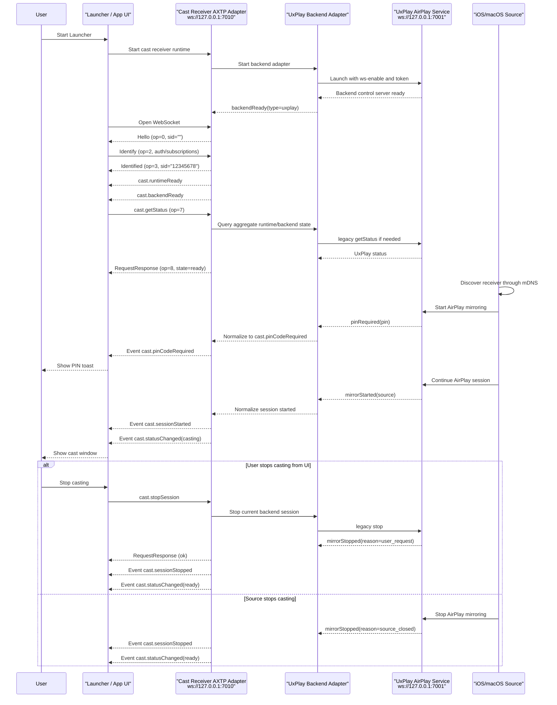

# Cast Receiver UxPlay Protocol Interaction Flow

> Status: flow design
> Scope: Launcher-integrated AirPlay receiver, Electron control service, UxPlay backend adapter
> Source inputs: `docs/business/cast-reciever-uxplay.md`, `docs/legacy-migration/evidence/WEBSOCKET_PROTOCOL.md`, pasted AXTP Cast Capability design reference
> Protocol lifecycle: Stage 10 `plan-protocol-flow`

本文根据 UxPlay/AirPlay 接收端控制需求，梳理 Launcher / UI、AXTP 外部控制口、UxPlay backend 和 iOS/macOS 投屏源之间的业务交互流程。

本文不是最终协议事实源。当前已经 adopted/generated 的事实只覆盖 AXTP core WebSocket JSON profile 和 RPC handshake；`cast.*` 业务方法与事件尚未进入 registry/generated，本文只把它们作为 Stage 20 `draft-business-protocol` 的候选缺口。

命名说明：`cast.status`、`cast.session` 这类 `domain.feature` 只表示能力草案归属；真正放进 RPC `method` / `event` 的 wire name 不带 feature 中段，例如 `cast.getStatus`、`cast.stopSession`、`cast.sessionStarted`。

Flow 文档负责描述业务场景和交互步骤、判断每一步协议覆盖状态、识别协议缺口，并将缺口路由到 candidate `domain.feature`。Flow 文档不负责定义完整 method / event / schema / capability，不分配 methodId / eventId / errorCode / fieldId，也不能替代 `docs/protocol/<domain>/<feature>.md`。

## 0. 速读结论

| 项目 | 内容 |
|---|---|
| Flow 目标 | Launcher 集成 UxPlay 后，通过本机 AXTP WS-JSON 控制口查询投屏状态、处理 PIN、控制窗口/音频/runtime/backend，并把 UxPlay legacy event 标准化为 `cast.*` 候选事件。 |
| 当前协议覆盖 | partial |
| 涉及 domain.feature | `cast.status`, `cast.session`, `cast.pinCode`, `cast.audio`, `cast.window`, `cast.runtime`, `cast.backend`, optional `auth.session` |
| 已有 adopted/generated | `AXTP-WS-JSON`, RPC `Hello / Identify / Identified`, `Request`, `RequestResponse`, `Event`, `sid/op/d` envelope。 |
| 缺口 | `cast` domain 尚未采纳；状态聚合、session、PIN、窗口、音频、runtime/backend、鉴权和错误模型需要 Stage 20 草案。 |
| 是否需要新增协议草案 | yes |
| 是否涉及 Legacy | yes，UxPlay legacy WebSocket 只作为 adapter evidence。 |
| 是否涉及 STREAM | no，AirPlay 媒体面不进入本 AXTP 控制 flow。 |
| 下一步 | draft protocol；先起草 `cast.status` / `cast.session` / `cast.pinCode`，再补 window/audio/runtime/backend。 |

## 1. Story Summary

| Item | Content |
|---|---|
| User goal | Launcher 启动投屏接收端后，iOS/macOS 能发现 AirPlay 接收端并投屏；投屏开始、停止、PIN、窗口、音频、runtime 和 backend 状态能被 UI 或外部控制端感知和控制。 |
| Trigger | Launcher 启动 Electron/UxPlay 接收端服务；或控制端连接 `ws://127.0.0.1:7010/` 并订阅投屏状态。 |
| Success result | AirPlay service ready；控制端通过 AXTP handshake 建立 RPC session；投屏开始时 UI 自动显示投屏窗口和 PIN toast；状态变化、服务退出、窗口变化、音频变化都有 AXTP event；控制端可查询状态并发起停止投屏、PIN、音频、窗口和 runtime/backend 控制。 |
| Primary actors | User, Launcher / App UI, Cast Receiver AXTP Adapter, UxPlay Backend Adapter, UxPlay AirPlay Service, iOS/macOS Source |
| Product scope | Windows Launcher 集成 AirPlay 接收端；Electron 外部控制口默认 `ws://127.0.0.1:7010/`；UxPlay backend 内部控制口默认 `ws://127.0.0.1:7001/`。 |

## 2. Source Observations

### 2.1 UI / Prototype

| Screen or control | Observed behavior | Protocol relevance |
|---|---|---|
| Launcher startup | Launcher 启动后自动启动投屏接收端软件和 AirPlay service。 | 需要 runtime/backend ready event；服务启动本身是本地编排行为。 |
| PIN toast | 接收到投屏信号或 backend 要求 PIN 时，应用侧展示当前投屏密码。 | 需要 `cast.pinCodeRequired` / `cast.pinCodeChanged` 候选 event，归属 `cast.pinCode`。 |
| Cast window | 投屏开始后应用软件主动展示投屏内容窗口；停止后可隐藏或恢复默认状态。 | 需要 `cast.sessionStarted` / `cast.sessionStopped` 和 `cast.showWindow` / `cast.hideWindow` 候选能力。 |
| Window change | 窗口大小、显示、隐藏、全屏、置顶变化时有事件发出。 | 需要 `cast.windowChanged` 候选 event，归属 `cast.window`。 |
| Audio control | 可获取或设置投屏音频开关、静音状态。 | 需要 `cast.getAudio` / `cast.setAudio` / `cast.setMuted` 和 `cast.audioChanged` 候选能力。 |
| Runtime config | 可获取和设置服务端口、服务显示名称，并监听端口变化。 | 需要 `cast.runtime` 归属下的候选 method/event；端口变更是否允许运行时生效需评审。 |

### 2.2 Requirement Notes

- 软件分为 UI 层受控端和 backend 服务层受控端，二者管辖范围不同。
- Electron 外部控制口面向 Launcher、UI 或本机外部控制端；UxPlay `7001` 内部控制口是 adapter 到 backend 的实现细节。
- iOS/macOS 通过 mDNS 发现 AirPlay 接收端并开始投屏；mDNS 和 AirPlay 媒体协议本身不进入 AXTP 标准化范围。
- 新 AXTP 流程应使用 `AXTP-WS-JSON` 的 `Hello / Identify / Identified`，不再把 legacy `HelloAck + auth Request` 当作规范握手。
- UxPlay 只作为 `backend.type = "uxplay"`；不应把 `uxplay` 放进标准 AXTP method/event name。
- `showPinWindow` / `hidePinWindow` 的语义是 PIN 展示，应归入 `cast.pinCode`；`showCastWindow` / `hideCastWindow` 才归入 `cast.window`。

### 2.3 Device / System State Observations

| State | Meaning | Protocol relevance |
|---|---|---|
| runtime starting | Launcher 正在启动 receiver runtime。 | local-only / candidate `cast.runtimeChanged`。 |
| WS control ready | 外部控制口 `7010` 可连接。 | generated WS-JSON profile + candidate runtime event。 |
| RPC identified | 控制端完成 Hello / Identify / Identified，获得 8 位 hex `sid`。 | generated RPC session precondition。 |
| backend starting / ready / exited | UxPlay backend 进程或服务状态变化。 | candidate `cast.backendReady`, `cast.backendExited`, `cast.backendChanged`。 |
| receiver ready | AirPlay 接收端可被发现。 | candidate `cast.statusChanged` / `cast.getStatus`。 |
| pin required / visible / hidden | Backend 需要用户输入 PIN，UI 展示或隐藏 PIN。 | candidate `cast.pinCode*` events。 |
| casting | 有活动 AirPlay 投屏 session。 | candidate `cast.sessionStarted`, `cast.statusChanged`。 |
| window visible / fullscreen / alwaysOnTop | 投屏窗口状态。 | candidate `cast.windowChanged`。 |
| audio enabled / muted | 投屏音频状态。 | candidate `cast.audioChanged`。 |
| error | runtime/backend/session 出错。 | candidate `cast.error` with typed error model。 |

## 3. Assumptions And Non-Goals

| Type | Item | Status |
|---|---|---|
| Assumption | Electron 外部控制口是 AXTP Logical Server；Launcher / UI / 外部控制端是 Logical Client。WebSocket 建立后由服务端先发送 `Hello`。 | `[REVIEW-DRAFT]` |
| Assumption | 第一版外部控制口使用 `AXTP-WS-JSON`，即 WebSocket text frame 直接承载 JSON `{sid, op, d}`，不使用 CONTROL、STREAM、CRC16 或 JSON_BINARY header。 | `[REVIEW-DRAFT]` |
| Assumption | 认证优先放在 `Identify.d.authentication` 或后续 `auth.*` 草案中，不再把 legacy `auth` method 作为 cast 业务方法。 | `[REVIEW-DRAFT]` |
| Assumption | `cast` domain 第一版角色固定为 `roles=["receiver"]`、`activeRole="receiver"`；后续如支持投屏发射端，通过 status/capability 字段扩展 role，不改 method name。 | `[REVIEW-DRAFT]` |
| Question | 外部控制口是否只允许本机 `127.0.0.1`，还是需要 LAN 控制；如允许 LAN，鉴权、Origin 和 token 轮换策略需要进入 `auth.*` 或 runtime 配置草案。 | `[REVIEW-ASK]` |
| Question | 修改控制端口后是立即重启监听、生效于下次启动，还是需要 Launcher 重启服务？ | `[REVIEW-ASK]` |
| Question | PIN 是否允许通过 `getPinCode` 明文读取，还是只通过 required/changed event 给 UI 临时展示？ | `[REVIEW-ASK]` |
| Non-goal | 不标准化 AirPlay/mDNS/RAOP 协议和 UxPlay 内部媒体实现。 | `[REVIEW-OK]` |
| Non-goal | 不把 UxPlay 内部 `7001` WebSocket 协议作为 AXTP 公共接口；它只作为 legacy adapter evidence。 | `[REVIEW-OK]` |
| Non-goal | 本文不修改 `registry/**`、`protocol/axtp.protocol.yaml`、`docs/generated/**` 或 conformance。 | `[REVIEW-OK]` |

## 4. Protocol Coverage

| Need | Coverage state | AXTP protocol | Evidence | Next action |
|---|---|---|---|---|
| 外部控制端通过 WebSocket 建立 RPC 通道 | generated | `AXTP-WS-JSON` | `docs/generated/protocol.md`, `docs/specs/1-core/04-Transport-Profiles.md` | 可按 core 实现。 |
| RPC session handshake | generated | `Hello(op=0)`, `Identify(op=2)`, `Identified(op=3)` | `docs/generated/protocol.md`, `docs/specs/1-core/06-RPC-Session.md` | 用新握手替代 legacy `HelloAck`。 |
| RPC 请求、响应、事件 envelope | generated | `Request(op=7)`, `RequestResponse(op=8)`, `Event(op=6)`, `sid/op/d` | `docs/generated/protocol.md`, `docs/specs/1-core/06-RPC-Session.md` | 可按 core 实现。 |
| Legacy token auth | draft | `Identify.d.authentication`, future `auth.*` | `docs/specs/1-core/06-RPC-Session.md`, `docs/protocol/auth/**` | Stage 20 确认 token/HMAC/scopes；不要继续用 `auth` 作为业务 method。 |
| 获取整体投屏状态 | missing | Candidate `cast.getStatus` under `cast.status` | pasted AXTP Cast reference, legacy `getStatus` | 转 Stage 20。 |
| 整体状态变化和错误上报 | missing | Candidate `cast.statusChanged`, `cast.error` | legacy `status.changed` / `error` | 转 Stage 20。 |
| 投屏会话查询、停止、开始/停止事件、帧统计 | missing | Candidate `cast.getSession`, `cast.stopSession`, `cast.sessionStarted`, `cast.sessionStopped`, `cast.frameStats` | legacy `stop`, `mirrorStarted`, `mirrorStopped`, `casting.*` | 转 Stage 20。 |
| PIN 获取、设置、轮换、展示、隐藏和事件 | missing | Candidate `cast.getPinCode`, `cast.setPinCode`, `cast.rotatePinCode`, `cast.showPinCode`, `cast.hidePinCode`, `cast.pinCode*` | legacy `getPin`, `setPin`, `rotatePin`, `pin.*` | 转 Stage 20。 |
| 投屏音频状态和静音控制 | missing | Candidate `cast.getAudio`, `cast.setAudio`, `cast.setMuted`, `cast.audioChanged` | legacy `getAudio`, `setAudio`, `setMuted`, `audio.changed` | 转 Stage 20。 |
| 投屏窗口显示、隐藏、全屏、置顶和窗口事件 | missing | Candidate `cast.getWindowState`, `cast.showWindow`, `cast.hideWindow`, `cast.setFullscreen`, `cast.setAlwaysOnTop`, `cast.windowChanged` | legacy `showCastWindow`, `hideCastWindow`, `setFullscreen`, `window.changed` | 转 Stage 20。 |
| Runtime 显示名称、控制端口、ready、退出 | missing | Candidate `cast.getDisplayName`, `cast.setDisplayName`, `cast.getRuntimeStatus`, `cast.restartRuntime`, `cast.quitRuntime`, runtime events | legacy `app.ready`, `serverName.changed`, `control.portChanged`, `quitApp` | 转 Stage 20。 |
| UxPlay backend 状态、重启、ready/exited | missing | Candidate `cast.getBackendStatus`, `cast.restartBackend`, backend events | legacy `uxplay.ready`, `uxplay.exited`, `restartUxPlay` | 转 Stage 20。 |
| UxPlay 内部控制口 `ws://127.0.0.1:7001/` | non-protocol | Adapter implementation detail | `docs/legacy-migration/evidence/WEBSOCKET_PROTOCOL.md` | 运行时内部实现，不进入公共协议。 |
| mDNS 发现和 AirPlay 媒体传输 | non-protocol | AirPlay/UxPlay implementation detail | `docs/business/cast-reciever-uxplay.md` | 不进入 AXTP cast 控制协议。 |

Coverage 取值：

| Coverage | Meaning |
|---|---|
| generated | 已进入 `docs/generated/**` 或 protocol IR，可作为实现合同视图。 |
| adopted | 已写入 registry YAML，但当前 flow 未直接引用 generated 输出。 |
| draft | 已有 `docs/protocol/**` 草案，但尚未 adopted/generated。 |
| missing | 没有合适的 adopted/generated/draft 协议覆盖。 |
| local-only | App/UI/runtime 本地逻辑，不需要 AXTP 协议。 |
| non-protocol | 产品规则、人工流程、运营策略或文档说明，不进入协议。 |

## 5. End-To-End Sequence



## 6. Interaction Steps

| Step | Actor | Action | Capability / precondition | Protocol call/event | Payload fields | Result / state change | Coverage | Error / fallback |
|---:|---|---|---|---|---|---|---|---|
| 1 | Launcher | 启动投屏接收端 runtime。 | Launcher 配置可用。 | local-only | process config, ports | Cast Receiver AXTP Adapter 开始初始化。 | local-only | 启动失败时 Launcher 提示服务不可用。 |
| 2 | AXTP Adapter | 启动 UxPlay backend。 | Backend binary/config 可用。 | non-protocol / legacy adapter | `-ws-enable`, backend port, token | UxPlay 内部控制口 ready。 | non-protocol | UxPlay 退出或端口冲突时，后续通过候选 event 上报。 |
| 3 | Control Client | 连接外部控制口。 | `AXTP-WS-JSON` profile。 | WebSocket open | `ws://127.0.0.1:7010/` | 进入 RPC handshake。 | generated | WebSocket 连接失败时按本地重连策略处理。 |
| 4 | AXTP Adapter | 发送服务端 Hello。 | WebSocket 已建立。 | `Hello(op=0)` | `sid=""`, `axtpVersion`, `rpcVersion`, auth challenge optional | Client 获得 session 规则和认证要求。 | generated | 超时未收到 Hello，Client 应断开并重连。 |
| 5 | Control Client | 提交身份、认证和订阅意图。 | Server Hello 已收到。 | `Identify(op=2)` | `rpcVersion`, `authentication`, `eventMasks` | Server 校验身份和权限。 | generated | 认证字段属于 RPC session；业务 auth/scopes 的产品策略仍需 draft。 |
| 6 | AXTP Adapter | 确认 session ready。 | Identify 已通过。 | `Identified(op=3)` | fixed 8-char hex `sid` | 后续 Request/Event/Response 使用该 `sid`。 | generated | Identified 前收到业务 Request，Server 应拒绝处理。 |
| 7 | AXTP Adapter | 通知 runtime/backend ready。 | runtime/backend 已初始化。 | Candidate `cast.runtimeReady`, `cast.backendReady` | state, backend type, ports | UI 可显示投屏接收端可用。 | missing | 如 backend 未 ready，整体 status 可为 `starting` 或 `error`。 |
| 8 | Control Client | 查询完整状态。 | RPC identified。 | Candidate `cast.getStatus` | params empty | 返回 roles、state、runtime、backend、session、pinCode、audio、window 摘要。 | missing | backend 暂不可用时仍返回 runtime 状态。 |
| 9 | iOS/macOS Source | 发现并开始 AirPlay 投屏。 | AirPlay/mDNS 可用。 | non-protocol | mDNS / AirPlay | UxPlay 产生内部事件。 | non-protocol | 发现失败属于 backend 配置问题。 |
| 10 | UxPlay / Backend | 需要 PIN。 | Backend emits pinRequired。 | Candidate `cast.pinCodeRequired` | pinCode or secure placeholder, reason | UI 展示 PIN toast。 | missing | 是否允许明文 PIN 上报需评审。 |
| 11 | UxPlay / Backend | 投屏会话开始。 | AirPlay session established。 | Candidate `cast.sessionStarted`, `cast.statusChanged` | sessionId, source, protocol | UI 显示投屏窗口并进入 casting 状态。 | missing | 缺少 source 字段时仍可进入 casting，但记录字段缺口。 |
| 12 | Control Client | 调整窗口状态。 | Active window or runtime supports window control。 | Candidate `cast.showWindow`, `cast.hideWindow`, `cast.setFullscreen`, `cast.setAlwaysOnTop` | window intent fields | 返回窗口状态，并广播 `cast.windowChanged`。 | missing | 窗口不存在或不支持时返回 window unavailable。 |
| 13 | Control Client | 调整投屏音频。 | Audio control supported。 | Candidate `cast.setAudio`, `cast.setMuted` | enabled, muted | 返回音频状态，并广播 `cast.audioChanged`。 | missing | 系统音频不可用时返回 typed error。 |
| 14 | Control Client | 停止当前投屏。 | Active cast session exists。 | Candidate `cast.stopSession` | reason | backend 调用 legacy `stop`；成功后广播 stopped/statusChanged。 | missing | 没有活动 session 时返回 no active session。 |
| 15 | UxPlay / Backend | 服务退出或崩溃。 | Backend process exits。 | Candidate `cast.backendExited`, `cast.error` | code, signal, reason, restart policy | UI 提示服务异常或等待自动恢复。 | missing | 自动重启 backend 后广播 backendReady/statusChanged。 |
| 16 | Control Client | 退出投屏接收端 runtime。 | Admin/control scope。 | Candidate `cast.quitRuntime` | reason | runtime 返回 quitting，并由 Launcher 接管退出。 | missing | 权限不足时拒绝；是否暴露需产品确认。 |

## 7. State Changes And Events

| State change | Trigger | Event needed | Payload | Client handling | Coverage |
|---|---|---|---|---|---|
| RPC session identified | `Identified(op=3)` | no business event | sid, negotiated RPC version | 开始业务查询。 | generated |
| runtime ready | Receiver runtime 初始化完成 | `cast.runtimeReady` / `cast.runtimeChanged` | runtime state, displayName, controlPort | 更新接收端可用状态。 | missing |
| backend ready / exited | UxPlay 启动成功或退出 | `cast.backendReady`, `cast.backendExited` | backend type, state, code/signal | 更新 backend 状态；必要时触发重启策略。 | missing |
| status changed | ready/casting/stopping/error 切换 | `cast.statusChanged` | aggregate status summary | UI 更新主状态；必要时调用 `cast.getStatus` 校准。 | missing |
| PIN required / changed / hidden | Backend 要求 PIN 或 PIN 轮换/隐藏 | `cast.pinCodeRequired`, `cast.pinCodeChanged`, `cast.pinCodeHidden` | pin visibility, pin code policy, expiry | 展示/隐藏 PIN toast。 | missing |
| session started / stopped | AirPlay mirror started/stopped | `cast.sessionStarted`, `cast.sessionStopped` | sessionId, source, protocol, reason | 显示或隐藏投屏窗口。 | missing |
| window changed | UI 或 runtime 改变窗口状态 | `cast.windowChanged` | visible, fullscreen, alwaysOnTop, bounds optional | 同步窗口控件。 | missing |
| audio changed | UI 或 backend 改变 audio/mute | `cast.audioChanged` | enabled, muted | 同步音频控件。 | missing |
| cast error | runtime/backend/session 出错 | `cast.error` | code, message, source, recoverable | 展示错误并可触发重试。 | missing |

## 8. Protocol Details

### 8.1 Adopted / Generated Protocols

| Method/Event/Profile | Purpose in this flow | Source |
|---|---|---|
| `AXTP-WS-JSON` | 外部控制口 WebSocket JSON transport profile。 | `docs/generated/protocol.md` |
| `Hello(op=0)` | Logical Server 建立连接后主动宣布 RPC version 和认证要求。 | `docs/specs/1-core/06-RPC-Session.md` |
| `Identify(op=2)` | Logical Client 提交身份、认证和订阅意图。 | `docs/specs/1-core/06-RPC-Session.md` |
| `Identified(op=3)` | Logical Server 分配 RPC `sid`，session 进入 ready。 | `docs/specs/1-core/06-RPC-Session.md` |
| `Request(op=7)` | 控制端调用业务 method。 | `docs/specs/1-core/06-RPC-Session.md` |
| `RequestResponse(op=8)` | 服务端返回请求结果。 | `docs/specs/1-core/06-RPC-Session.md` |
| `Event(op=6)` | 服务端广播状态变化、会话变化和窗口变化。 | `docs/specs/1-core/06-RPC-Session.md` |

### 8.2 Draft Or Missing Protocol Gaps

| Gap | Candidate domain.feature | Candidate method/event/schema | Routed skill | Review question |
|---|---|---|---|---|
| `cast` domain 尚未存在 adopted/generated 事实。 | `cast` | domain metadata, roles, protocols, backend, feature list | `docs/dev/skills/20-draft-business-protocol/SKILL.md` | `[REVIEW-ASK]` 第一版是否只声明 receiver role 和 airplay protocol？ |
| 外部控制口认证方式未标准化。 | `auth.session` / `cast.runtime` | Identify auth fields, token/HMAC scopes, control-port security policy | `docs/dev/skills/20-draft-business-protocol/SKILL.md` | `[REVIEW-ASK]` 本机控制是否可默认 no-auth？LAN 控制是否必须 HMAC/token？ |
| 状态聚合 schema 未定义。 | `cast.status` | `CastStatus`, runtime/backend/session/pin/audio/window summary | `draft-business-protocol` | `[REVIEW-ASK]` `state` 枚举是否采用 `starting/ready/casting/stopping/error/disabled`？ |
| 投屏会话字段未定义。 | `cast.session` | `CastSession`, `CastSource`, stop reason, frame stats | `draft-business-protocol` | `[REVIEW-ASK]` `sessionId` 是 runtime 本地字符串，还是需要可恢复的数字 ID？ |
| PIN 明文读取和事件暴露策略未定义。 | `cast.pinCode` | PIN schema, visibility, expiry, privacy policy | `draft-business-protocol` | `[REVIEW-ASK]` PIN 是否允许通过 response/event 明文出现？ |
| Runtime displayName、controlPort 读写语义未定义。 | `cast.runtime` | display name, control port, restart/quit policy | `draft-business-protocol` | `[REVIEW-ASK]` 端口修改是否立即重启监听，是否需要 admin scope？ |
| Backend 与 runtime 的重启边界未定义。 | `cast.backend` | backend status, restartBackend, backendChanged | `draft-business-protocol` | `[REVIEW-ASK]` `restartUxPlay` 是否只重启 UxPlay，还是重建整个 receiver runtime？ |

### 8.3 Legacy To Candidate Mapping

| Legacy method/event | Candidate AXTP method/event | Notes |
|---|---|---|
| `HelloAck` | `Identified(op=3)` | 新 AXTP 不再使用 `HelloAck` 作为握手确认。 |
| `auth` | `Identify.d.authentication` / future `auth.*` | 认证放到 handshake 或 auth 草案，不作为 `cast.*` method。 |
| `getStatus` / `status.changed` / `error` | `cast.getStatus`, `cast.statusChanged`, `cast.error` | 整体投屏状态；归属 `cast.status`。 |
| `mirrorStarted` / `casting.started` | `cast.sessionStarted` | 投屏会话开始；归属 `cast.session`。 |
| `mirrorStopped` / `casting.stopped` | `cast.sessionStopped` | 投屏会话停止；归属 `cast.session`。 |
| `stop` / `stopCasting` | `cast.stopSession` | 停止当前投屏；归属 `cast.session`。 |
| `getPin` / `setPin` / `rotatePin` | `cast.getPinCode`, `cast.setPinCode`, `cast.rotatePinCode` | PIN 权限需评审；归属 `cast.pinCode`。 |
| `showPinWindow` / `hidePinWindow` | `cast.showPinCode`, `cast.hidePinCode` | PIN 展示属于 pinCode，不属于 window。 |
| `getAudio` / `setAudio` / `setMuted` | `cast.getAudio`, `cast.setAudio`, `cast.setMuted` | 投屏音频状态和静音；归属 `cast.audio`。 |
| `showCastWindow` / `hideCastWindow` / `setFullscreen` / `setAlwaysOnTop` | `cast.showWindow`, `cast.hideWindow`, `cast.setFullscreen`, `cast.setAlwaysOnTop` | 投屏窗口控制；归属 `cast.window`。 |
| `app.ready` / `control.portChanged` / `quitApp` | `cast.runtimeReady`, `cast.controlPortChanged`, `cast.quitRuntime` | Runtime 层，不等同于 UxPlay backend。 |
| `uxplay.ready` / `uxplay.exited` / `restartUxPlay` | `cast.backendReady`, `cast.backendExited`, `cast.restartBackend` | UxPlay 是 backend type；不进入 method name。 |
| `Bye` / `ByeAck` | Reserved / future graceful close | WebSocket 断开已可表示 session 结束；是否启用应用层 Bye 需另行评审。 |

### 8.4 Candidate Request / Response Examples

下面示例只用于 Stage 10 评审。`cast.*` 尚未 generated，字段和错误码不得直接作为实现合同。

Handshake:

```json
{
  "sid": "",
  "op": 0,
  "d": {
    "axtpVersion": "1.0.0",
    "rpcVersion": 1
  }
}
```

```json
{
  "sid": "",
  "op": 2,
  "d": {
    "rpcVersion": 1,
    "eventMasks": ""
  }
}
```

```json
{
  "sid": "12345678",
  "op": 3,
  "d": {
    "negotiatedRpcVersion": 1
  }
}
```

Status request:

```json
{
  "sid": "12345678",
  "op": 7,
  "d": {
    "id": 1,
    "method": "cast.getStatus",
    "params": {}
  }
}
```

Status response candidate:

```json
{
  "sid": "12345678",
  "op": 8,
  "d": {
    "id": 1,
    "status": {
      "ok": true,
      "code": 0
    },
    "result": {
      "roles": ["receiver"],
      "activeRole": "receiver",
      "state": "ready",
      "protocols": ["airplay"],
      "runtime": {
        "state": "ready",
        "displayName": "Launcher Cast Receiver",
        "controlPort": 7010
      },
      "backend": {
        "type": "uxplay",
        "state": "ready",
        "controlPort": 7001
      },
      "session": {
        "active": false,
        "sessionId": null
      },
      "pinCode": {
        "required": true,
        "visible": false
      },
      "audio": {
        "enabled": true,
        "muted": false
      },
      "window": {
        "visible": false,
        "fullscreen": false,
        "alwaysOnTop": false
      }
    }
  }
}
```

Session started event candidate:

```json
{
  "sid": "12345678",
  "op": 6,
  "d": {
    "event": "cast.sessionStarted",
    "intent": 1,
    "data": {
      "sessionId": "cast-001",
      "source": {
        "device": "Qing's iPhone",
        "model": "iPhone",
        "deviceId": "legacy-device-id",
        "ip": null
      },
      "protocol": "airplay"
    }
  }
}
```

Stop session request candidate:

```json
{
  "sid": "12345678",
  "op": 7,
  "d": {
    "id": 2,
    "method": "cast.stopSession",
    "params": {
      "reason": "user_request"
    }
  }
}
```

### 8.5 Candidate Feature Boundaries

| Feature | Responsibility | Candidate methods | Candidate events |
|---|---|---|---|
| `cast.status` | 投屏能力整体状态、错误和摘要。 | `cast.getStatus` | `cast.statusChanged`, `cast.error` |
| `cast.session` | 一次投屏会话的查询、停止和统计。 | `cast.getSession`, `cast.stopSession` | `cast.sessionStarted`, `cast.sessionStopped`, `cast.frameStats` |
| `cast.pinCode` | PIN 获取、设置、轮换、显示和隐藏。 | `cast.getPinCode`, `cast.setPinCode`, `cast.rotatePinCode`, `cast.showPinCode`, `cast.hidePinCode` | `cast.pinCodeRequired`, `cast.pinCodeAccepted`, `cast.pinCodeChanged`, `cast.pinCodeHidden` |
| `cast.audio` | 投屏音频启用和静音。 | `cast.getAudio`, `cast.setAudio`, `cast.setMuted` | `cast.audioChanged` |
| `cast.window` | 投屏窗口显示、隐藏、全屏和置顶。 | `cast.getWindowState`, `cast.showWindow`, `cast.hideWindow`, `cast.setFullscreen`, `cast.setAlwaysOnTop` | `cast.windowChanged` |
| `cast.runtime` | 投屏接收端应用/服务运行时。 | `cast.getDisplayName`, `cast.setDisplayName`, `cast.getRuntimeStatus`, `cast.restartRuntime`, `cast.quitRuntime` | `cast.runtimeReady`, `cast.runtimeChanged`, `cast.displayNameChanged`, `cast.controlPortChanged` |
| `cast.backend` | 具体投屏后端实现，例如 UxPlay。 | `cast.getBackendStatus`, `cast.restartBackend` | `cast.backendReady`, `cast.backendExited`, `cast.backendChanged` |

## 9. Test / Conformance Notes

| Case | Given | When | Then | Protocol evidence |
|---|---|---|---|---|
| happy path | Receiver runtime running on `7010` | Client connects and completes Hello / Identify / Identified | Client receives 8-char hex `sid` and can query candidate status | `AXTP-WS-JSON`, RPC session |
| unsupported | Client sends business Request before Identified | Server receives request | Server rejects or closes according to RPC session rules | `docs/specs/1-core/06-RPC-Session.md` |
| auth path | Hello indicates auth required | Client identifies without/with invalid auth | Server rejects; correct auth enters ready | `Identify.d.authentication`, future `auth.*` |
| event path | UxPlay emits `mirrorStarted` | Adapter normalizes event | Client receives `cast.sessionStarted` and `cast.statusChanged(casting)` | candidate `cast.session`, `cast.status` |
| PIN path | UxPlay emits `pinRequired` | Adapter normalizes event | UI shows PIN toast or secure placeholder | candidate `cast.pinCode` |
| stop path | Active session exists | UI calls candidate `cast.stopSession` | Backend stops mirror and emits stopped/statusChanged | candidate `cast.session` |
| backend failure | UxPlay exits unexpectedly | Adapter observes process exit | Client receives backend exited/error state | candidate `cast.backend`, `cast.error` |
| legacy boundary | Internal backend control on `7001` exists | External client tries to treat it as AXTP public contract | Documentation rejects this path; only `7010` adapter is public | non-protocol adapter detail |

## 10. Acceptance Gates

- 外部控制口必须按 `AXTP-WS-JSON` 实现 `sid/op/d` envelope 和 `Hello / Identify / Identified / Request / RequestResponse / Event`。
- `HelloAck`、legacy `auth` method、`Bye/ByeAck` 只能作为迁移线索；新实现的规范握手以 AXTP RPC session 为准。
- `cast.*` 业务能力在进入 registry/generated 前不得作为 adopted SDK 合同发布。
- UxPlay 内部 `7001` 控制口不能直接暴露为标准协议；标准接口应停留在外部 AXTP Adapter。
- runtime 与 backend 必须分层：runtime 表示投屏接收端应用/服务，backend 表示 UxPlay/AirPlay/Miracast 等具体实现。
- PIN、token、control port 和 LAN 控制策略在 Stage 20 草案中必须明确权限和安全边界。
- Event 必须覆盖服务 ready/exited、投屏 started/stopped、PIN required/changed、audio changed、window changed 和 error。
- UI 和测试用例必须能区分“AirPlay 发现/媒体失败”和“AXTP 控制协议失败”。

## 11. Open Questions

| Question | Impact | Owner | Status | Next action |
|---|---|---|---|---|
| 文件名是否继续沿用 `cast-reciever-uxplay` 的 legacy 拼写，还是后续统一改为 `cast-receiver-uxplay`？ | docs | TBD | REVIEW-ASK | 如改名，单独迁移链接。 |
| 外部控制口是否允许 LAN 访问？如果允许，是否必须启用 token/HMAC 和 Origin 白名单？ | security / product | TBD | REVIEW-ASK | 进入 auth/runtime 草案。 |
| `getPinCode` 是否允许返回明文 PIN？PIN event 是否也允许包含明文？ | security / protocol | TBD | REVIEW-ASK | 决定 PIN schema。 |
| `controlPort` 是 runtime 配置项、launcher 配置项，还是只读运行状态？ | product / runtime | TBD | REVIEW-ASK | 决定是否支持 set。 |
| `quitRuntime` 和 `restartRuntime` 是否应该暴露给普通 UI，还是只给调试/运维/admin scope？ | permission / product | TBD | REVIEW-ASK | 进入 capability/permission 定义。 |
| 投屏窗口和 PIN 窗口是否一定独立？如果产品只有一个窗口，应如何表达 `pinCode.showPinCode` 与 `window.showWindow` 的 UI 映射？ | UI / protocol | TBD | REVIEW-ASK | 确认 feature 边界。 |
| `frameStats` 的频率、字段和性能开销是否需要默认开启，还是按订阅/调试模式启用？ | conformance / performance | TBD | REVIEW-ASK | 决定 event 频率和订阅策略。 |
| 是否需要保留 legacy method alias 用于过渡期兼容，还是外部新接口直接只接受 `cast.*`？ | legacy / product | TBD | REVIEW-ASK | 决定 adapter 策略。 |
