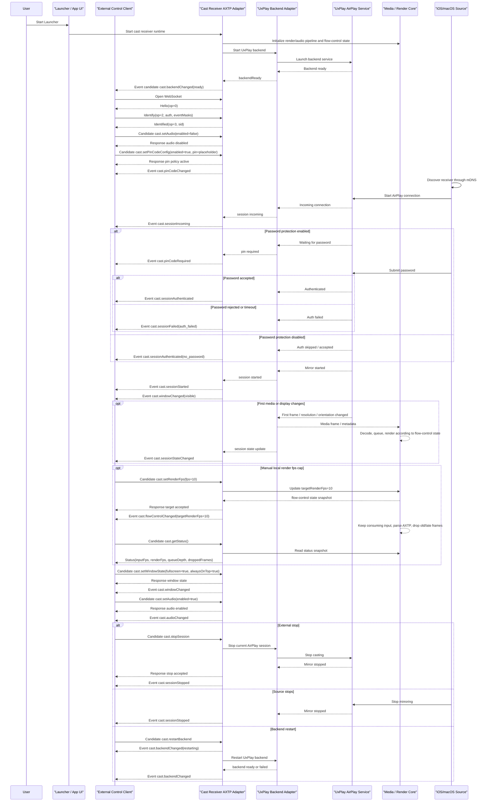

# Cast Receiver UxPlay Protocol Interaction Flow

> Status: flow design
> Scope: Windows Launcher 集成 AirPlay 接收端、UxPlay backend adapter、Media / Render Core、外部 AXTP 控制口
> Source inputs: `docs/business/cast-reciever-uxplay.md`, `docs/legacy-migration/evidence/WEBSOCKET_PROTOCOL.md`, `docs/generated/protocol.md`, `docs/protocol/auth/auth.session.md`, `docs/protocol/auth/auth.token.md`, `docs/protocol/auth/auth.permission.md`
> Protocol lifecycle: Stage 10 `plan-protocol-flow`

本文根据 Launcher 集成 UxPlay/AirPlay 接收端的业务需求，梳理外部 AXTP 控制端、Launcher UI、Cast Receiver Adapter、UxPlay backend、Media / Render Core 和 iOS/macOS 投屏源之间的交互流程。

本文不是最终协议事实源。已采纳事实以 `registry/**/*.yaml`、`registry/domains/**/*.yaml`、`protocol/axtp.protocol.yaml` 和 `docs/generated/**` 为准；新增或修改协议必须进入 `docs/protocol/**` 草案，并经过后续采纳和生成流程。

Flow 文档负责描述业务场景和交互步骤、判断每一步协议覆盖状态、识别协议缺口，并将缺口路由到 candidate `domain.feature`。Flow 文档不负责定义完整 method/event/schema/capability，不分配 methodId/eventId/errorCode/fieldId，也不能替代 `docs/protocol/<domain>/<feature>.md`。

命名说明：`cast.session`、`cast.pinCode`、`cast.audio`、`cast.window`、`cast.backend`、`cast.flowControl` 仅表示候选 feature 归属。真正进入 RPC wire 的 method/event 名称需要在 Stage 20 协议草案中确认，例如候选 `cast.stopSession`、`cast.pinCodeChanged`、`cast.windowChanged`、`cast.setRenderFps`。

## 0. 速读结论

| 项目 | 内容 |
|---|---|
| Flow 目标 | Launcher 启动 UxPlay AirPlay 接收端后，外部控制端通过 AXTP WS-JSON 控制口管理投屏音频、停止投屏、密码保护、指定密码、窗口置顶/全屏/还原、backend 重启和本地渲染流控，并接收投屏过程中的状态和事件。 |
| 当前协议覆盖 | partial |
| 涉及 domain.feature | `cast.session`, `cast.pinCode`, `cast.audio`, `cast.window`, `cast.backend`, `cast.flowControl`; optional aggregate `cast.status`; draft `auth.session` / `auth.token` / `auth.permission` |
| 已有 adopted/generated | `AXTP-WS-JSON`, RPC `Hello`, `Identify`, `Identified`, `Request`, `RequestResponse`, `Event`, JSON `sid/op/d` envelope。 |
| 缺口 | `cast` domain 尚未有 adopted/generated 协议；投屏会话、密码策略、音频播放、窗口控制、backend 重启、本地渲染流控、投屏过程事件、错误模型和 legacy adapter mapping 均需 Stage 20 草案。 |
| 是否需要新增协议草案 | yes |
| 是否涉及 Legacy | yes，主要旧协议证据为 `docs/legacy-migration/evidence/WEBSOCKET_PROTOCOL.md`。 |
| 是否涉及 STREAM | indirect。外部 WebSocket 控制 flow 不承载 STREAM；如底层媒体来自 HID/AXTP STREAM，`cast.flowControl` 只观测和控制接收端本地渲染策略，不修改 STREAM header 或 payload。 |
| 下一步 | 使用 `docs/dev/skills/20-draft-business-protocol/SKILL.md` 起草 `cast.session`、`cast.pinCode`、`cast.audio`、`cast.window`、`cast.backend`、`cast.flowControl`；如需要聚合状态，再起草 `cast.status`。 |

## 1. Story Summary

| Item | Content |
|---|---|
| User goal | 用户能通过 Launcher 使用 AirPlay 投屏接收能力；外部控制端能控制投屏音频、停止投屏、密码保护、指定密码、投屏窗口、backend 重启和本地渲染流控，并能实时感知投屏过程状态。 |
| Trigger | Launcher 启动投屏接收端；控制端连接 AXTP 控制口；iOS/macOS 发起 AirPlay 投屏；用户或外部控制端修改投屏设置或手动降低本地渲染 fps。 |
| Success result | Receiver 可被发现；默认不播放投屏音频；密码策略按配置生效；投屏请求、等待密码、鉴权、开始、异常、结束等过程都有事件；窗口置顶/全屏/还原、backend 重启和本地渲染流控都有状态反馈；降低到 10fps 时队列和延迟不持续增长。 |
| Primary actors | User, Launcher / App UI, External Control Client, Cast Receiver AXTP Adapter, UxPlay Backend Adapter, UxPlay AirPlay Service, Media / Render Core, iOS/macOS Source |
| Product scope | Windows Launcher 集成 AirPlay receiver；外部控制口使用 AXTP WS-JSON；UxPlay backend 内部控制口只作为 adapter 实现细节。 |

## 2. Source Observations

### 2.1 UI / Prototype

| Screen or control | Observed behavior | Protocol relevance |
|---|---|---|
| Launcher startup | Launcher 随软件启动自动拉起投屏接收端和 AirPlay service。 | 启动编排是 local-only；receiver/backend ready 和 failed 需要候选业务事件。 |
| Audio playback toggle | 投屏音频播放默认关闭，可由外部控制端开启或关闭。 | 需要 `cast.audio` 查询、设置和 `audioChanged` 事件。 |
| Stop casting action | 外部控制端可关闭当前投屏。 | 需要 `cast.session` 停止方法和 session stopped/status changed 事件。 |
| Password protection toggle | 可打开或关闭投屏密码保护；关闭后允许无密码直接投屏。 | 需要 `cast.pinCode` 配置方法和 pin policy changed 事件。 |
| Set cast password | 外部控制端可指定投屏密码。 | 需要 password set 方法、校验规则和 password changed 事件；明文暴露策略需安全评审。 |
| PIN toast / password prompt | 接收到投屏请求后，若需要密码，UI 展示当前投屏密码或等待输入密码状态。 | 需要 waiting-for-password / pin required / auth failed / auth accepted 类事件。 |
| Cast lifecycle display | UI 需要知道有投屏请求、鉴权完成、开始投屏、投屏结束。 | 需要 `cast.session` 生命周期事件。 |
| Cast window controls | 可将投屏窗口置顶、放大到全屏、还原到正常状态。 | 需要 `cast.window` 控制方法和 `windowChanged` 事件。 |
| Backend restart | UxPlay backend 异常或配置变更后可重启。 | 需要 `cast.backend` 重启方法和 backend restarting/ready/exited/failed 事件。 |
| Render fps control | 外部控制端可把接收端本地渲染帧率降到 10fps，后续可恢复到 25fps。 | 需要 `cast.flowControl` 设置目标渲染 fps，并返回/上报 input/render fps、queue 和 drop 统计。 |
| Flow policy control | 外部控制端可调整视频队列上限、late frame 阈值和 drop policy。 | 需要 `cast.flowControl` 策略方法；WebSocket 回调只更新控制状态，媒体线程读取执行。 |
| Overlay / diagnostics | overlay 可显示 fps、queue、drop、延迟和错误摘要。 | 可作为 `cast.flowControl` 或聚合状态字段；是否正式可控待确认。 |

### 2.2 Requirement Notes

- 投屏音频播放开关默认关闭。
- 密码保护关闭时，允许发射端无密码直接投屏。
- 密码保护开启时，需要支持指定当前投屏密码。
- 投屏密码开关变化、密码值变化、投屏状态变化都需要通知外部控制端。
- 投屏窗口控制只覆盖置顶、全屏、还原正常状态；不覆盖完整窗口坐标、多显示器和拖拽同步。
- Backend 重启只表示重启 UxPlay backend，不表示退出 Launcher 或重启整个 receiver runtime。
- WebSocket 手动流控属于 `cast` 域；`cast.setRenderFps` 只控制接收端本地渲染 fps，不要求发射端降低发送 fps。
- 降低本地渲染 fps 时，HID 输入必须继续消费，AXTP 数据必须继续解析，视频队列和端到端延迟不得持续增长。
- 外部控制端不直接请求关键帧；fps 大幅变化、丢帧爆发或解码异常时，接收端内部可自动请求关键帧。
- `cast.flowControl` 与公共 `stream.flowControl` 不同：前者是投屏接收端业务流控，后者是 runtime/STREAM 公共流控。
- UxPlay、AirPlay、mDNS、RAOP、H.264/AAC 媒体面不进入 AXTP 标准化范围。
- UxPlay 内部控制口是 adapter 实现细节；外部控制端只面向 AXTP 控制口。

### 2.3 Device / System State Observations

| State | Meaning | Protocol relevance |
|---|---|---|
| receiver starting | Launcher 正在启动投屏接收端。 | local-only；可通过候选 receiver/backend 状态事件通知 UI。 |
| receiver ready | AirPlay 接收端可被发现。 | 候选 `cast.session` 或 aggregate `cast.status` 状态。 |
| backend starting / ready / exited / failed | UxPlay backend 进程或服务状态变化。 | 候选 `cast.backendChanged` / `cast.backendReady` / `cast.backendExited`。 |
| RPC identified | 外部控制端完成 Hello / Identify / Identified，获得 8 位 hex `sid`。 | generated；业务 request/event 的前置条件。 |
| password protection enabled / disabled | 接收端是否要求发射端输入密码。 | 候选 `cast.pinCodeChanged`。 |
| password available / changed | 当前投屏密码已生成、指定或变更。 | 候选 `cast.pinCodeChanged`；明文策略待确认。 |
| incoming request | 发射端发起投屏连接。 | 候选 `cast.sessionIncoming` / `cast.sessionStateChanged`。 |
| waiting for password | 发射端需要输入密码。 | 候选 `cast.pinCodeRequired` / `cast.sessionStateChanged`。 |
| authenticated | 发射端鉴权通过。 | 候选 `cast.sessionAuthenticated` / `cast.sessionStateChanged`。 |
| casting | 有活动 AirPlay 投屏会话。 | 候选 `cast.sessionStarted` / `cast.sessionStateChanged`。 |
| audio playback enabled / disabled | 接收端是否播放投屏音频。 | 候选 `cast.audioChanged`。 |
| window normal / fullscreen / alwaysOnTop | 投屏窗口展示状态变化。 | 候选 `cast.windowChanged`。 |
| target render fps | 接收端本地目标渲染 fps，例如 10 或 25。 | 候选 `cast.flowControlChanged` / `cast.getStatus`。 |
| input fps / render fps | 实际输入 fps 和实际渲染 fps。 | 候选 `cast.getStatus`；可用于诊断 fps cap 是否生效。 |
| video queue depth | 视频队列当前深度。 | 候选 `cast.getStatus` / `cast.flowControlChanged`；应稳定在上限附近，不持续增长。 |
| drop mode / dropped frames / late frames | 当前丢帧策略和统计。 | 候选 `cast.flowControlChanged` / `cast.getStatus`；用于判断延迟是否受控。 |
| internal keyframe request count | 接收端内部自动请求关键帧的次数。 | 候选 `cast.getStatus`；不暴露外部 requestKeyFrame 方法。 |
| overlay enabled | 是否开启 fps/queue/drop/latency 诊断 overlay。 | 候选 `cast.flowControlChanged`；是否正式可控待确认。 |
| stopping / ended / failed | 投屏会话正在结束、已结束或失败。 | 候选 `cast.sessionStopping` / `cast.sessionStopped` / `cast.sessionFailed`。 |

## 3. Assumptions And Non-Goals

| Type | Item | Status |
|---|---|---|
| Assumption | 外部控制口是 AXTP Logical Server；Launcher UI 或外部控制端是 Logical Client。WebSocket 建立后由服务端先发送 `Hello`。 | `[REVIEW-DRAFT]` |
| Assumption | 第一版外部控制口使用 `AXTP-WS-JSON`，即 WebSocket text frame 直接承载 JSON `{sid, op, d}`，不使用 CONTROL、STREAM、CRC16 或 JSON_BINARY header。 | `[REVIEW-DRAFT]` |
| Assumption | 认证优先放在 `Identify.d.authentication` 或 `auth.*` 草案中，不继续把 legacy `auth` 当成 cast 业务 method。 | `[REVIEW-DRAFT]` |
| Assumption | `cast` 第一版角色固定为 receiver：`roles=["receiver"]`、`activeRole="receiver"`；后续如支持 sender，再通过 capability/status 扩展角色。 | `[REVIEW-DRAFT]` |
| Assumption | `cast.session` 承载投屏生命周期主线；如 UI 需要跨 session/pin/audio/window/backend 的聚合状态，再补 `cast.status`。 | `[REVIEW-DRAFT]` |
| Decision | 投屏音频播放默认关闭，开关只控制接收端本地播放，不改变 AirPlay 媒体协商，除非后续产品明确要求。 | `[REVIEW-DRAFT]` |
| Decision | Backend 重启只重启 UxPlay backend，不等同于 Launcher 退出或 receiver runtime 重启。 | `[REVIEW-DRAFT]` |
| Decision | `cast.setRenderFps` 只控制接收端本地渲染 fps，不要求 NT10、AirPlay Source 或其他发射端降低发送 fps。 | `[REVIEW-OK]` |
| Decision | 外部控制端不直接请求关键帧；接收端在 fps 大幅变化、丢帧爆发或解码异常时内部自动触发关键帧请求。 | `[REVIEW-OK]` |
| Assumption | WebSocket 回调线程只更新 `cast.flowControl` 控制状态，不直接操作 D3D、WASAPI 或窗口资源。 | `[REVIEW-DRAFT]` |
| Assumption | `cast.flowControl` 与公共 `stream.flowControl` 分层：前者是投屏接收端业务流控，后者是 runtime/STREAM 公共流控。 | `[REVIEW-DRAFT]` |
| Question | 外部控制口是否只允许本机 `127.0.0.1`，还是需要 LAN 控制；如允许 LAN，密码读取、停止投屏、窗口控制和 backend 重启必须有权限 scope。 | `[REVIEW-ASK]` |
| Non-goal | 不标准化 AirPlay、mDNS、RAOP、H.264/AAC 媒体面或 UxPlay 内部媒体实现。 | `[REVIEW-OK]` |
| Non-goal | 不把 UxPlay 内部控制口作为 AXTP 公共接口；它只作为 adapter evidence。 | `[REVIEW-OK]` |
| Non-goal | 不把 `cast.flowControl` 写成通用 `video` 域能力；视频 stream、codec 和关键帧底层能力仍归 `video.stream`。 | `[REVIEW-OK]` |
| Non-goal | 不覆盖完整窗口系统管理，例如窗口坐标、多显示器选择、拖拽同步、系统级置顶覆盖策略。 | `[REVIEW-OK]` |
| Non-goal | 本文不修改 `docs/protocol/**`、`registry/**`、`protocol/axtp.protocol.yaml`、`docs/generated/**`。 | `[REVIEW-OK]` |

## 4. Protocol Coverage

| Need | Coverage state | AXTP protocol | Evidence | Next action |
|---|---|---|---|---|
| 外部控制端通过 WebSocket 建立 RPC 通道 | generated | `AXTP-WS-JSON` | `docs/generated/protocol.md`, `registry/core/protocol_meta.yaml` | 可按 generated/core 实现。 |
| RPC session handshake | generated | `Hello(op=0)`, `Identify(op=2)`, `Identified(op=3)` | `docs/generated/protocol.md`, `docs/specs/1-core/06-RPC-Session.md` | 用新 handshake 替代 legacy `HelloAck`。 |
| RPC 请求、响应、事件 envelope | generated | `Request(op=7)`, `RequestResponse(op=8)`, `Event(op=6)`, JSON `sid/op/d` | `docs/generated/protocol.md`, `docs/specs/1-core/06-RPC-Session.md` | 可按 core 实现。 |
| 外部控制口 token、权限和 LAN 安全策略 | draft | `Identify.d.authentication`, draft `auth.session` / `auth.token` / `auth.permission` | `docs/protocol/auth/auth.session.md`, `docs/protocol/auth/auth.token.md`, `docs/protocol/auth/auth.permission.md` | Stage 20 细化本场景 auth 策略。 |
| Launcher 启动投屏接收端 | local-only | App process orchestration | `docs/business/cast-reciever-uxplay.md` | UI/runtime 实现，不进 AXTP。 |
| 启动 UxPlay backend | non-protocol | Backend adapter implementation | `docs/legacy-migration/evidence/WEBSOCKET_PROTOCOL.md` | 只作为 adapter 实现。 |
| 查询投屏会话和主状态 | missing | Candidate `cast.getSession`, optional `cast.getStatus` | business requirement, legacy `getStatus` | 转 Stage 20。 |
| 投屏过程状态变化事件 | missing | Candidate `cast.sessionIncoming`, `cast.sessionStateChanged`, `cast.sessionStarted`, `cast.sessionStopped`, `cast.sessionFailed` | business requirement, legacy `mirrorStarted`, `mirrorStopped`, `casting.*` | 转 Stage 20。 |
| 关闭当前投屏 | missing | Candidate `cast.stopSession` | business requirement, legacy `stop` / `stopCasting` | 转 Stage 20。 |
| 投屏音频播放开关 | missing | Candidate `cast.getAudio`, `cast.setAudio`, `cast.audioChanged` | business requirement, legacy `getAudio`, `setAudio`, `audio.changed` | 转 Stage 20；默认关闭。 |
| 密码保护开关 | missing | Candidate `cast.getPinCodeConfig`, `cast.setPinCodeConfig`, `cast.pinCodeChanged` | business requirement, legacy `getPin`, `setPin`, `pin.*` | 转 Stage 20；关闭后允许无密码投屏。 |
| 指定投屏密码 | missing | Candidate `cast.setPinCode`, optional `cast.getPinCode` | business requirement, legacy `setPin` | 转 Stage 20；明文读取/事件需安全评审。 |
| 等待密码、鉴权成功/失败事件 | missing | Candidate `cast.pinCodeRequired`, `cast.pinCodeAuthSucceeded`, `cast.pinCodeAuthFailed` | business requirement, legacy PIN / auth events | 转 Stage 20。 |
| 投屏窗口置顶、全屏、还原 | missing | Candidate `cast.getWindowState`, `cast.setWindowState`, `cast.windowChanged` | business requirement, legacy `setFullscreen`, `setAlwaysOnTop`, `window.changed` | 转 Stage 20。 |
| UxPlay backend 状态和重启 | missing | Candidate `cast.getBackendStatus`, `cast.restartBackend`, `cast.backendChanged` | business requirement, legacy `restartUxPlay`, `uxplay.ready`, `uxplay.exited` | 转 Stage 20。 |
| 查询接收端聚合状态 | missing | Candidate `cast.getStatus` | business requirement | 返回 source、HID、AXTP、video/audio stream、fps、queue、drop、mute、fullscreen、overlay、last error 等摘要；转 Stage 20。 |
| 设置本地目标渲染 fps | missing | Candidate `cast.setRenderFps`, feature `cast.flowControl` | business requirement | 只控制接收端本地渲染 fps；不要求 source 降低输入 fps；转 Stage 20。 |
| 设置队列和丢帧策略 | missing | Candidate `cast.setFlowPolicy`, feature `cast.flowControl` | business requirement | 包含 `videoQueueFrames`、`lateFrameThresholdMs`、`dropMode`、`keyFrameOnDropBurst`；转 Stage 20。 |
| fps cap 下静音 | missing | Candidate `cast.setMuted` or `cast.audio` method | business requirement | 静音时继续消费音频数据，不重启音频设备，不影响视频渲染；转 Stage 20 时与 `cast.audio` 合并裁决。 |
| 内部自动请求关键帧 | local-only / optional reuse | Internal policy, optional `video.requestKeyFrame` reuse | `docs/generated/protocol.md`, `docs/protocol/video/video.stream.md` | 不作为外部 `cast` 方法；由接收端内部在 fps 大幅变化、丢帧爆发或解码异常时触发。 |
| AirPlay 媒体传输、mDNS 发现、RAOP 鉴权细节 | non-protocol | AirPlay/UxPlay implementation detail | business requirement | 不进入 AXTP cast 控制协议。 |

Coverage 取值：

| Coverage | Meaning |
|---|---|
| generated | 已进入 `docs/generated/**` 或 protocol IR，可作为实现合同视图。 |
| adopted | 已写入 registry YAML，但当前 flow 未直接引用 generated 输出。 |
| draft | 已有 `docs/protocol/**` 草案，但尚未 adopted/generated。 |
| missing | 没有合适的 adopted/generated/draft 协议覆盖。 |
| local-only | App/UI/runtime 本地逻辑，不需要 AXTP 协议。 |
| non-protocol | 产品规则、人工流程、运营策略或文档说明，不进入协议。 |

## 5. End-To-End Sequence

## 6. Interaction Steps

| Step | Actor | Action | Capability / precondition | Protocol call/event | Payload fields | Result / state change | Coverage | Error / fallback |
|---:|---|---|---|---|---|---|---|---|
| 1 | Launcher | 启动投屏接收端 runtime。 | Launcher 配置可用。 | local-only | process config | Receiver runtime 开始初始化。 | local-only | 启动失败时 UI 显示接收端不可用。 |
| 2 | AXTP Adapter | 启动 UxPlay backend。 | Backend binary/config/token 可用。 | non-protocol / legacy adapter | backend config, token | UxPlay backend starting。 | non-protocol | 启动失败后通过候选 backend/error event 上报。 |
| 3 | AXTP Adapter | backend ready。 | UxPlay backend 可用。 | Candidate `cast.backendChanged` | state=`ready`, backendType=`uxplay` | Receiver 可被发现。 | missing | 若 backend 不可用，状态为 failed，控制端可请求 restartBackend。 |
| 4 | Control Client | 连接外部 AXTP 控制口。 | `AXTP-WS-JSON` profile。 | WebSocket open + RPC `Hello/Identify/Identified` | `axtpVersion`, `rpcVersion`, auth info, `eventMasks` | Client 获得 8 位 hex `sid`。 | generated / draft auth | 鉴权失败时拒绝 Identify 或关闭连接。 |
| 5 | Control Client | 查询当前状态。 | RPC identified。 | Candidate `cast.getSession` / optional `cast.getStatus` | session selector, include summaries | 返回 receiver/backend/session/pin/audio/window 摘要。 | missing | backend 暂不可用时仍应返回 backend failed 摘要。 |
| 6 | Control Client | 设置默认投屏音频播放状态。 | `cast.audio` supported。 | Candidate `cast.setAudio` | `enabled=false` by default | 后续投屏默认不播放音频。 | missing | 不支持音频控制时 UI 隐藏开关或只读展示。 |
| 7 | Control Client | 开启或关闭密码保护。 | `cast.pinCode` supported。 | Candidate `cast.setPinCodeConfig` | `enabled`, optional password policy | 密码保护策略生效并触发 changed event。 | missing | 密码格式错误返回 invalid argument；无权限返回 permission denied。 |
| 8 | Control Client | 指定投屏密码。 | 密码保护可用。 | Candidate `cast.setPinCode` | password placeholder, apply policy | 新密码对后续鉴权生效并触发 changed event。 | missing | 明文密码是否能读取或事件携带需安全评审。 |
| 9 | iOS/macOS Source | 发起投屏连接请求。 | Receiver discoverable。 | non-protocol AirPlay | source summary | Backend 产生 incoming connection。 | non-protocol | mDNS/AirPlay 发现失败不进入 AXTP 控制协议。 |
| 10 | Backend / AXTP Adapter | 上报投屏请求到达。 | Source starts AirPlay session。 | Candidate `cast.sessionIncoming` | sessionId, source summary, requiresPassword | UI 可提示“有设备正在请求投屏”。 | missing | 如果短时间内失败，后续发送 failed/stopped 校准。 |
| 11 | Backend / AXTP Adapter | 等待发射端输入密码。 | 密码保护开启。 | Candidate `cast.pinCodeRequired` and/or `cast.sessionStateChanged` | sessionId, pin policy, expiresAt optional | UI 展示 PIN 或等待状态。 | missing | 若事件不含明文 PIN，UI 需要通过受控接口或本地安全通道获取。 |
| 12 | Backend / AXTP Adapter | 鉴权成功。 | 发射端输入正确密码，或密码保护关闭。 | Candidate `cast.sessionAuthenticated` | sessionId, authMode | UI 可准备显示投屏画面。 | missing | 密码保护关闭时仍应有状态变化，避免 UI 误判。 |
| 13 | Backend / AXTP Adapter | 鉴权失败或超时。 | 密码错误、超时、取消。 | Candidate `cast.sessionFailed` / `cast.pinCodeAuthFailed` | sessionId, reason, retryable | UI 展示失败或等待重试。 | missing | 失败后是否保持 incoming/waiting 状态待确认。 |
| 14 | Backend / AXTP Adapter | 投屏会话正式开始。 | AirPlay session established。 | Candidate `cast.sessionStarted`, `cast.sessionStateChanged` | sessionId, source, protocol, audio/window summary | UI 进入 casting，显示停止投屏按钮。 | missing | 缺少 source 字段时仍可进入 casting，但记录 legacy 缺口。 |
| 15 | Backend / AXTP Adapter | 首帧、分辨率或方向变化。 | UxPlay 获得媒体元信息。 | Candidate `cast.sessionStateChanged` or optional media meta event | sessionId, video size, orientation, firstFrame flag | UI 可调整窗口或展示“已出画”。 | missing | 这是低频状态事件，不是媒体 STREAM 数据。 |
| 16 | Control Client | 打开或关闭投屏音频播放。 | 有无活动会话都可设置目标状态。 | Candidate `cast.setAudio`, event `cast.audioChanged` | enabled, session scope optional | 当前会话或后续会话的音频播放状态改变。 | missing | 当前无会话时保存为目标状态；是否返回 current/effective 需草案确认。 |
| 17 | Control Client | 设置接收端本地目标渲染 fps。 | Active session or render pipeline ready；`cast.flowControl` supported。 | Candidate `cast.setRenderFps`, event `cast.flowControlChanged` | fps, apply scope, reason | `targetRenderFps` 更新；Media / Render Core 按目标 fps 本地渲染。 | missing | `fps=0`、超出范围、权限不足或 pipeline 不可用需 typed error；不要求 source 降低输入 fps。 |
| 18 | Media / Render Core | 应用 fps cap。 | targetRenderFps 已更新。 | local-only runtime action | targetRenderFps, inputFps, renderFps, queue limits | HID 输入继续消费，AXTP 数据继续解析；未渲染帧按策略丢弃。 | local-only | 队列持续增长或延迟持续变大时上报状态/错误。 |
| 19 | Control Client | 设置流控策略。 | `cast.flowControl` supported。 | Candidate `cast.setFlowPolicy`, event `cast.flowControlChanged` | videoQueueFrames, lateFrameThresholdMs, dropMode, keyFrameOnDropBurst | 队列上限、late frame 阈值和 drop 策略更新。 | missing | dropMode 不支持、参数越界或策略冲突时返回 invalid argument。 |
| 20 | Control Client | 查询接收端状态快照。 | RPC identified；pipeline available。 | Candidate `cast.getStatus` or `cast.getFlowControlState` | include flow/audio/window/backend summaries | 返回 input/render fps、queue depth、dropped/late frames、keyframeRequestCount、muted、fullscreen、overlay、lastError。 | missing | event 丢失或重连后用该查询校准 UI。 |
| 21 | Media / Render Core | 内部自动请求关键帧。 | fps 大幅变化、丢帧爆发、解码异常或恢复播放。 | local-only policy, optional internal `video.requestKeyFrame` reuse | stream/source context, reason | 关键帧请求计数增加；不暴露外部 cast 关键帧请求方法。 | local-only / optional reuse | 必须防抖，避免短时间内疯狂请求关键帧。 |
| 22 | Control Client | fps cap 下静音或取消静音。 | Active or configured cast audio state。 | Candidate `cast.setMuted` or `cast.audio` method, event `cast.audioChanged` | muted | 本地音频输出静音/恢复；音频数据继续消费。 | missing | 不重启音频设备，不影响视频渲染。 |
| 23 | Control Client | 窗口置顶、全屏、还原正常状态。 | 投屏窗口存在，或产品允许预设窗口状态。 | Candidate `cast.setWindowState`, event `cast.windowChanged` | fullscreen, alwaysOnTop, mode=`normal` optional | UI 窗口状态同步。 | missing | 无窗口时返回 invalid state 或保存预设，待确认；fps cap 下仍需稳定。 |
| 24 | Control Client | 外部主动关闭投屏。 | Active session exists。 | Candidate `cast.stopSession` | sessionId optional, reason=`external_request` | 会话进入 stopping，然后 stopped。 | missing | 无活动 session 时返回幂等成功或 no active session，待确认。 |
| 25 | Source / Backend | 发射端主动结束投屏。 | Active session exists。 | Candidate `cast.sessionStopped` | reason=`source_closed` | UI 恢复未投屏状态。 | missing | 若事件丢失，客户端重连后调用 get 校准。 |
| 26 | Control Client | 重启 UxPlay backend。 | Admin/control permission; backend restart supported。 | Candidate `cast.restartBackend`, events `cast.backendChanged`, `cast.sessionStopped` if needed | reason, force policy optional | Backend restarting；当前投屏可能被结束。 | missing | 权限不足、backend busy、重启失败需要 typed error。 |
| 27 | Backend / AXTP Adapter | backend 重启完成或失败。 | restart in progress。 | Candidate `cast.backendChanged` | state=`ready`/`failed`, reason, retryable | UI 恢复入口或展示错误。 | missing | 如果 backend ready 后 receiver 仍不可发现，应继续上报 failed/starting。 |

## 7. State Changes And Events

### 7.1 投屏过程事件总表

| State change | Trigger | Event needed | Payload | Client handling | Coverage |
|---|---|---|---|---|---|
| backend starting | Launcher 启动或外部请求重启 backend | `cast.backendChanged` | backend state, backend type, reason | 显示接收服务启动中，禁用投屏操作。 | missing |
| backend ready | UxPlay backend ready，receiver 可被发现 | `cast.backendChanged`, optional `cast.sessionStateChanged` | backend state, discoverable flag | UI 显示投屏接收可用。 | missing |
| backend exited | UxPlay 进程退出或内部控制断开 | `cast.backendChanged`, `cast.sessionFailed` if active | exit code/signal, active session affected | UI 显示服务异常；必要时允许重启。 | missing |
| backend restarting | 外部调用 restartBackend 或自动恢复 | `cast.backendChanged` | restarting state, reason, activeSessionImpact | UI 进入恢复中；暂停新的投屏请求。 | missing |
| password policy changed | 外部打开/关闭密码保护 | `cast.pinCodeChanged` | enabled, hasPassword, changed fields | 刷新设置 UI；必要时更新 PIN toast。 | missing |
| password value changed | 外部指定新密码或接收端生成/轮换密码 | `cast.pinCodeChanged` | enabled, hasPassword, optional masked/visible PIN policy | 刷新密码展示；敏感字段按安全策略处理。 | missing |
| incoming request | 发射端发起投屏连接 | `cast.sessionIncoming` | sessionId, source summary, requiresPassword | 提示有投屏请求；如果需密码，准备展示 PIN。 | missing |
| waiting for password | 密码保护开启，发射端等待输入密码 | `cast.pinCodeRequired` / `cast.sessionStateChanged` | sessionId, pin policy, timeout optional | 展示当前密码或等待输入提示。 | missing |
| auth succeeded | 发射端通过密码鉴权，或无密码模式直接允许 | `cast.sessionAuthenticated` | sessionId, authMode | UI 准备进入投屏中。 | missing |
| auth failed | 密码错误、超时、取消或权限拒绝 | `cast.sessionFailed` / `cast.pinCodeAuthFailed` | sessionId, reason, retryable | 展示错误；可等待重试或回到 ready。 | missing |
| session preparing | 鉴权后媒体协商、窗口准备、音频策略应用 | `cast.sessionStateChanged` | sessionId, phase=`preparing` | UI 可显示连接中。 | missing |
| session started | AirPlay mirror started | `cast.sessionStarted` | sessionId, source, protocol, startedAt | UI 进入 casting；启用停止投屏。 | missing |
| first frame received | 首个视频帧到达或画面可展示 | `cast.sessionStateChanged` | sessionId, firstFrame=true, video summary | UI 可移除加载态，展示投屏画面。 | missing |
| media info changed | 分辨率、方向、画面比例、source 名称等低频变化 | `cast.sessionStateChanged` | sessionId, changed fields, media summary | 调整窗口显示或 UI 文案。 | missing |
| audio playback changed | 外部设置或 backend 策略改变接收端本地音频播放 | `cast.audioChanged` | enabled, effective state, reason | 同步音频开关；默认关闭。 | missing |
| window changed | 外部设置或 UI 行为改变窗口置顶/全屏/正常状态 | `cast.windowChanged` | visible, fullscreen, alwaysOnTop, mode | 同步窗口按钮状态。 | missing |
| target render fps changed | 外部设置本地目标渲染 fps | `cast.flowControlChanged` | targetRenderFps, previousTargetRenderFps, reason | 更新 UI；需要完整统计时调用 getStatus。 | missing |
| flow policy changed | 外部设置队列上限、late frame 阈值或 dropMode | `cast.flowControlChanged` | videoQueueFrames, lateFrameThresholdMs, dropMode, keyFrameOnDropBurst | 更新诊断面板；必要时提示策略已应用。 | missing |
| render fps reduced | Media / Render Core 应用 fps cap | optional `cast.flowControlChanged` or stats snapshot | inputFps, renderFps, queue depth, droppedFrames | overlay 或状态页显示 renderFps 接近目标值。 | missing |
| video queue pressure | 队列接近上限、持续 late frame 或丢帧爆发 | `cast.flowControlChanged` or optional warning event | queue depth, droppedFrames, lateFrames, lastError | 展示诊断信息；持续恶化时建议恢复 fps 或重启 backend。 | missing |
| internal keyframe requested | fps 大幅变化、丢帧爆发或解码异常 | no public event required; visible in status | keyframeRequestCount, reason | 仅用于诊断；外部控制端不直接请求关键帧。 | local-only / missing status |
| overlay changed | 外部或本地调试开关改变 overlay 状态 | `cast.flowControlChanged` if exposed | overlayEnabled | 更新 UI 按钮；是否正式可控待确认。 | missing |
| media interrupted | AirPlay 媒体暂时中断、网络抖动、source 暂停 | `cast.sessionStateChanged` or optional `cast.sessionInterrupted` | sessionId, reason, recoverable | 显示恢复中，不立即判定结束。 | missing |
| media resumed | 中断后恢复 | `cast.sessionStateChanged` or optional `cast.sessionResumed` | sessionId, reason | 恢复 UI 状态。 | missing |
| session stopping | 外部关闭、发射端关闭或 backend 重启导致结束中 | `cast.sessionStateChanged` | sessionId, reason | UI 进入处理中。 | missing |
| session stopped | 投屏结束 | `cast.sessionStopped` | sessionId, reason, endedAt | UI 恢复未投屏状态；需要完整状态时调用 get 校准。 | missing |
| session failed | 连接、鉴权、媒体协商或 backend 错误失败 | `cast.sessionFailed` | sessionId, error summary, recoverable | 展示错误，允许重试或重启 backend。 | missing |
| receiver error | 非会话级错误，例如 backend unavailable、permission denied | `cast.backendChanged` or optional aggregate `cast.error` | source, error code/name, message, retryable | 展示可操作错误；按需调用 get 校准。 | missing |

### 7.2 事件边界

| Event family | 应包含 | 不应包含 |
|---|---|---|
| `cast.session*` | 投屏连接请求、等待、鉴权、开始、首帧、媒体信息低频变化、中断/恢复、停止、失败。 | 高频帧数据、音视频 payload、窗口坐标管理、密码明文策略。 |
| `cast.pinCode*` | 密码保护开关、当前是否有密码、密码变更、等待输入密码、鉴权失败摘要。 | 明文密码是否直接下发待安全评审；不承载 AirPlay 媒体认证细节。 |
| `cast.audio*` | 接收端本地投屏音频播放是否启用、设置结果、有效状态变化。 | 通用系统音量、混音器、音频算法或 AirPlay 音频编码流。 |
| `cast.window*` | 投屏窗口是否可见、是否全屏、是否置顶、是否还原正常状态。 | 多显示器选择、任意坐标拖拽、完整窗口管理系统。 |
| `cast.backend*` | UxPlay backend ready/exited/restarting/failed、重启结果。 | Launcher 退出、receiver runtime 端口变更、UxPlay 内部 `7001` wire contract。 |
| `cast.flowControl*` | 接收端本地目标渲染 fps、input/render fps、队列、drop policy、late frame、overlay 和内部关键帧请求统计。 | 不要求 source 降低 fps；不定义 `video.stream` payload、codec 或公共 `stream.flowControl` ACK/window 语义。 |

## 8. Protocol Details

### 8.1 Adopted / Generated Protocols

| Method/Event/Profile | Purpose in this flow | Source |
|---|---|---|
| `AXTP-WS-JSON` | 外部控制口 WebSocket JSON transport profile。 | `docs/generated/protocol.md`, `registry/core/protocol_meta.yaml` |
| `Hello(op=0)` | Logical Server 建立连接后主动宣布 RPC version 和认证要求。 | `docs/generated/protocol.md`, `docs/specs/1-core/06-RPC-Session.md` |
| `Identify(op=2)` | Logical Client 提交身份、认证和订阅意图。 | `docs/generated/protocol.md`, `docs/specs/1-core/06-RPC-Session.md` |
| `Identified(op=3)` | Logical Server 分配 RPC `sid`，session 进入 ready。 | `docs/generated/protocol.md`, `docs/specs/1-core/06-RPC-Session.md` |
| `Request(op=7)` | 控制端调用业务 method。 | `docs/generated/protocol.md`, `docs/specs/1-core/06-RPC-Session.md` |
| `RequestResponse(op=8)` | 服务端返回请求结果。 | `docs/generated/protocol.md`, `docs/specs/1-core/06-RPC-Session.md` |
| `Event(op=6)` | 服务端广播投屏、密码、音频、窗口和 backend 状态变化。 | `docs/generated/protocol.md`, `docs/specs/1-core/06-RPC-Session.md` |

### 8.2 Draft Or Missing Protocol Gaps

| Gap | Candidate domain.feature | Candidate method/event/schema | Routed skill | Review question |
|---|---|---|---|---|
| `cast` domain 尚未存在 adopted/generated 事实。 | `cast` | domain metadata, receiver role, backend type, AirPlay support | `docs/dev/skills/20-draft-business-protocol/SKILL.md` | `[REVIEW-ASK]` 第一版是否只声明 receiver role 和 `airplay` protocol？ |
| 外部控制口认证方式未标准化到本场景。 | `auth.session` / `auth.token` / `auth.permission` | Identify auth fields, token/HMAC scopes, LAN/Origin policy | `draft-business-protocol` | `[REVIEW-ASK]` 本机控制是否可 no-auth？LAN 控制是否必须 token/HMAC？ |
| 投屏会话状态机和事件未定义。 | `cast.session` | `getSession`, `stopSession`, `sessionIncoming`, `sessionAuthenticated`, `sessionStarted`, `sessionStateChanged`, `sessionStopped`, `sessionFailed` | `draft-business-protocol` | `[REVIEW-ASK]` 是否需要 `incoming/waitingForPassword/authenticated/preparing/casting/interrupted/stopping/ended/failed` 全量状态？ |
| 密码保护开关和指定密码未定义。 | `cast.pinCode` | `getPinCodeConfig`, `setPinCodeConfig`, `setPinCode`, `pinCodeChanged`, `pinCodeRequired`, auth result events | `draft-business-protocol` | `[REVIEW-ASK]` PIN 是否允许在 response/event 明文出现？ |
| 投屏音频播放控制未定义。 | `cast.audio` | `getAudio`, `setAudio`, `audioChanged` | `draft-business-protocol` | `[REVIEW-ASK]` 仅控制接收端本地播放，还是影响 AirPlay 音频协商？ |
| 投屏窗口置顶/全屏/还原未定义。 | `cast.window` | `getWindowState`, `setWindowState`, `windowChanged` | `draft-business-protocol` | `[REVIEW-ASK]` “还原正常状态”是否同时取消置顶、恢复尺寸和位置？ |
| UxPlay backend 状态和重启未定义。 | `cast.backend` | `getBackendStatus`, `restartBackend`, `backendChanged` | `draft-business-protocol` | `[REVIEW-ASK]` 重启 backend 时是否强制停止当前投屏？ |
| 接收端本地渲染 fps 和手动流控未定义。 | `cast.flowControl` | `setRenderFps`, `setFlowPolicy`, `flowControlChanged`, flow-control state schema | `draft-business-protocol` | `[REVIEW-ASK]` `fps=0` 是不限制还是拒绝？默认 dropMode 是什么？ |
| 接收端聚合状态是否承载 flow-control 统计未定义。 | optional `cast.status` / `cast.flowControl` | `getStatus` or `getFlowControlState`, status snapshot schema | `draft-business-protocol` | `[REVIEW-ASK]` `cast.getStatus` 是否作为聚合状态接口存在，还是流控状态只在 `cast.flowControl` 查询？ |
| fps cap 下静音边界未定义。 | `cast.audio` / `cast.flowControl` | `setMuted`, `audioChanged`, flow-control state `muted` | `draft-business-protocol` | `[REVIEW-ASK]` 静音是否作为 `cast.audio` 方法，还是在 `cast.flowControl` 状态中只读展示？ |
| 聚合状态是否需要独立 feature。 | optional `cast.status` | `getStatus`, `statusChanged`, aggregate status schema | `draft-business-protocol` | `[REVIEW-ASK]` 用 `cast.session` + feature events 是否足够，还是 UI 需要一个聚合状态接口？ |
| Legacy 错误码和状态码需映射。 | `cast.session` / `cast.pinCode` / `cast.backend` / `auth.*` | common error reuse, feature-specific details | `draft-business-protocol` | `[REVIEW-ASK]` 是否复用 AXTP common errors，还是补 cast-specific typed details？ |

### 8.3 Legacy To Candidate Mapping

| Legacy method/event | Candidate AXTP method/event | Notes |
|---|---|---|
| `HelloAck` | `Identified(op=3)` | 新 AXTP 不使用 `HelloAck` 作为握手确认。 |
| `auth` | `Identify.d.authentication` / `auth.*` | 认证放到 handshake 或 auth 草案，不作为 `cast.*` method。 |
| `getStatus`, `status.changed`, `error` | `cast.getSession` / optional `cast.getStatus`, `cast.sessionStateChanged`, optional `cast.error` | 状态主线优先归入 `cast.session`；如需要聚合，再引入 `cast.status`。 |
| `mirrorStarted`, `casting.started` | `cast.sessionStarted` | 投屏会话正式开始。 |
| `mirrorStopped`, `casting.stopped` | `cast.sessionStopped` | 投屏会话结束。 |
| `stop`, `stopCasting` | `cast.stopSession` | 外部主动停止当前投屏。 |
| `casting.frameStats` | optional diagnostic event under `cast.session` | 调试/诊断统计；不应变成高频媒体事件。 |
| `getPin`, `setPin`, `rotatePin`, `pin.*` | `cast.getPinCodeConfig`, `cast.setPinCodeConfig`, `cast.setPinCode`, `cast.pinCodeChanged`, `cast.pinCodeRequired` | PIN 明文暴露和日志脱敏需要安全评审。 |
| `showPinWindow`, `hidePinWindow` | UI behavior driven by `cast.pinCodeRequired` / `cast.pinCodeChanged` | PIN 展示是 UI 行为，不一定需要单独 public method。 |
| `getAudio`, `setAudio`, `setMuted`, `audio.changed` | `cast.getAudio`, `cast.setAudio`, `cast.audioChanged` | 当前需求是投屏音频播放开关，默认关闭；`muted` 是否独立保留待确认。 |
| `showCastWindow`, `hideCastWindow`, `setFullscreen`, `setAlwaysOnTop`, `window.changed` | `cast.getWindowState`, `cast.setWindowState`, `cast.windowChanged` | 当前需求只需要置顶、全屏、还原正常状态。 |
| `uxplay.ready`, `uxplay.exited`, `restartUxPlay` | `cast.backendChanged`, `cast.restartBackend` | UxPlay 是 backend type，不进入标准 method name。 |
| 暂无旧协议映射 | `cast.setRenderFps`, `cast.setFlowPolicy`, `cast.flowControlChanged` | 手动渲染 fps 和流控策略来自新增业务需求，当前不保留旧实现 alias。 |
| `Bye`, `ByeAck` | optional RPC close / WebSocket close policy | Core 中 Bye/ByeAck 是 optional；是否暴露应用层 graceful close 待评审。 |

### 8.4 Candidate Feature Boundaries

| Feature | Responsibility | Candidate methods/events |
|---|---|---|
| `cast.session` | 投屏请求、鉴权阶段、投屏会话生命周期、停止投屏、低频媒体状态。 | `cast.getSession`, `cast.stopSession`, `cast.sessionIncoming`, `cast.sessionAuthenticated`, `cast.sessionStarted`, `cast.sessionStateChanged`, `cast.sessionStopped`, `cast.sessionFailed` |
| `cast.pinCode` | 密码保护开关、指定密码、密码状态变化、等待输入密码、密码鉴权结果摘要。 | `cast.getPinCodeConfig`, `cast.setPinCodeConfig`, `cast.setPinCode`, `cast.pinCodeChanged`, `cast.pinCodeRequired` |
| `cast.audio` | 投屏音频在接收端本地播放的开关和有效状态。 | `cast.getAudio`, `cast.setAudio`, `cast.audioChanged` |
| `cast.window` | 投屏窗口置顶、全屏、还原正常状态和状态反馈。 | `cast.getWindowState`, `cast.setWindowState`, `cast.windowChanged` |
| `cast.backend` | UxPlay backend ready/exited/restarting/failed 和重启动作。 | `cast.getBackendStatus`, `cast.restartBackend`, `cast.backendChanged` |
| `cast.flowControl` | 接收端本地渲染 fps、队列/drop 策略、late frame 阈值、overlay 和流控统计。 | `cast.setRenderFps`, `cast.setFlowPolicy`, `cast.flowControlChanged`, optional `cast.getFlowControlState` |
| optional `cast.status` | 跨 session/pin/audio/window/backend 的聚合状态查询和变化通知。 | `cast.getStatus`, `cast.statusChanged` |

## 9. Test / Conformance Notes

| Case | Given | When | Then | Protocol evidence |
|---|---|---|---|---|
| happy path no password | Receiver ready，密码保护关闭，音频默认关闭 | Source 发起 AirPlay 投屏 | Client 收到 incoming/authenticated/started；音频状态保持 disabled | candidate `cast.session`, `cast.audio`, `cast.pinCode` |
| happy path with password | 密码保护开启且已指定密码 | Source 发起投屏并输入正确密码 | Client 收到 waitingForPassword/authenticated/sessionStarted | candidate `cast.pinCode`, `cast.session` |
| wrong password | 密码保护开启 | Source 输入错误密码或超时 | Client 收到 auth failed/sessionFailed，不误报 casting | candidate `cast.pinCode`, `cast.session` |
| stop casting | Active session exists | Client 调用 stopSession | Receiver 停止投屏并发送 sessionStopped，UI 恢复未投屏 | candidate `cast.session` |
| no active session stop | No active session | Client 调用 stopSession | 返回幂等成功或 no active session，行为需定稿 | candidate `cast.session` |
| audio default off | Receiver ready | Session starts without prior audio enable | 接收端不播放投屏音频，状态可查询为 disabled | candidate `cast.audio` |
| audio toggle during casting | Active session exists | Client 打开音频播放 | 接收端恢复/开启音频播放并发送 audioChanged | candidate `cast.audio` |
| window controls | Active session window visible | Client 设置置顶、全屏、还原 | 每次状态变化都有 windowChanged；无窗口时返回明确错误或预设策略 | candidate `cast.window` |
| backend restart without session | Backend ready, no active session | Client 调用 restartBackend | Client 收到 restarting -> ready 或 failed | candidate `cast.backend` |
| backend restart with active session | Active session exists | Client 调用 restartBackend | 当前投屏被停止或标记受影响，随后 backend restarting/ready | candidate `cast.backend`, `cast.session` |
| backend exited unexpectedly | Active or idle backend exits | Adapter detects exit | Client 收到 backendChanged/failed；active session 不应继续显示为 casting | candidate `cast.backend`, `cast.session` |
| render fps cap 25fps | 25fps 输入，receiver 正常播放 | Client 设置 targetRenderFps=25 | renderFps 接近 25；inputFps 仍接近 source；队列稳定 | candidate `cast.flowControl` |
| render fps cap 15fps | 25fps 输入，receiver 正常播放 | Client 设置 targetRenderFps=15 | renderFps 接近 15；HID/AXTP 输入继续消费；队列不持续增长 | candidate `cast.flowControl` |
| render fps cap 10fps | 25fps 输入，receiver 正常播放 | Client 设置 targetRenderFps=10 | overlay/status 显示 renderFps 接近 10；延迟不持续变大 | candidate `cast.flowControl` |
| render fps cap 5fps | 25fps 输入，receiver 正常播放 | Client 设置 targetRenderFps=5 | drop policy 生效；队列深度稳定；画面仍按最新状态更新 | candidate `cast.flowControl` |
| restore render fps | targetRenderFps=10 | Client 恢复 targetRenderFps=25 | 画面继续正常播放；必要时内部关键帧请求计数可观测 | candidate `cast.flowControl`, optional `video.requestKeyFrame` internal reuse |
| muted during fps cap | targetRenderFps=10, active session | Client 设置 muted true/false | 音频数据继续消费，不重启音频设备，不影响视频渲染 | candidate `cast.audio`, `cast.flowControl` |
| window control during fps cap | targetRenderFps=10, active window | Client 拖动窗口或切换全屏/还原 | 窗口事件正常；HID/AXTP 解析和队列稳定 | candidate `cast.window`, `cast.flowControl` |
| long run low fps | 25fps 输入，targetRenderFps=10 | 持续运行 10 分钟以上 | renderFps 接近 10，inputFps 接近 source，queue depth 和 latency 不持续增长 | candidate `cast.flowControl` |
| reconnect calibration | Client reconnects after event loss | Client completes Identify and calls get | UI 能用查询结果校准 session/pin/audio/window/backend 状态 | candidate get methods + generated RPC session |
| auth and permissions | LAN or protected control port | Client lacks permission for password read/backend restart/window control | Request rejected with standard permission/capability error | draft `auth.*`, core Error Model |

## 10. Acceptance Gates

- 外部控制口必须按 `AXTP-WS-JSON` 实现 JSON `sid/op/d` envelope 和 `Hello / Identify / Identified / Request / RequestResponse / Event`。
- `HelloAck`、legacy `auth` method、legacy light protocol `type/id/op/data/ok/error` 只能作为迁移线索；新规范握手以 AXTP RPC session 为准。
- `cast.*` 业务能力在进入 registry/generated 前不得作为 adopted SDK 合同发布。
- 投屏音频播放开关默认关闭；控制端打开前不应播放投屏音频。
- 密码保护关闭时必须允许无密码直接投屏；密码保护开启时必须能指定或获得当前有效密码。
- 密码保护开关变化、密码值变化、等待密码、鉴权成功/失败、投屏开始/结束都必须有事件或可查询状态。
- 投屏窗口置顶、全屏、还原正常状态都必须有明确反馈；完整窗口坐标和多显示器不是本 flow 范围。
- Backend 重启必须和 Launcher 退出、receiver runtime 重启区分；本 flow 只要求重启 UxPlay backend。
- `cast.setRenderFps` 必须只控制接收端本地渲染 fps，不要求 source 降低输入 fps。
- 手动 fps cap 下 HID 输入必须继续消费，AXTP 数据必须继续解析，视频队列不得持续增长，端到端延迟不得持续变大。
- WebSocket 回调线程不得直接操作 D3D、WASAPI 或窗口资源；它只更新控制状态，由媒体线程读取执行。
- 外部控制端不直接请求关键帧；内部关键帧请求必须防抖，并可通过状态统计观测。
- UxPlay 内部控制口不能直接暴露为标准协议；标准接口应停留在外部 AXTP Adapter。
- UI 和测试用例必须能区分 AirPlay discovery/media 失败、UxPlay backend 失败、密码鉴权失败和 AXTP 控制协议失败。
- 本流程不修改 registry、generated 或 Protocol IR；后续协议事实必须通过 Stage 20/30/50 工作流进入正式生成路径。

## 11. Open Questions

| Question | Impact | Owner | Status | Next action |
|---|---|---|---|---|
| 文件名是否继续沿用 `cast-reciever-uxplay` 的 legacy 拼写，还是后续统一改为 `cast-receiver-uxplay`？ | docs | TBD | REVIEW-ASK | 如改名，单独迁移链接。 |
| 外部控制口是否允许 LAN 访问？如果允许，是否必须启用 token/HMAC、Origin 白名单和权限 scope？ | security / product | TBD | REVIEW-ASK | 进入 auth/cast capability 草案。 |
| 投屏密码保护默认开启还是关闭？默认密码由 Launcher 配置、随机生成，还是用户首次设置？ | product / security | TBD | REVIEW-ASK | 决定 `cast.pinCode` capability defaults。 |
| `getPinCode` 是否允许返回明文 PIN？PIN event 是否也允许包含明文？ | security / protocol | TBD | REVIEW-ASK | 决定 PIN schema、日志脱敏和 UI 获取路径。 |
| 指定投屏密码后，是否立即影响已发起但尚未鉴权完成的投屏请求？ | product / backend | TBD | REVIEW-ASK | 决定 setPinCode apply policy。 |
| `stopSession` 在无活动会话时应返回成功，还是返回 no active session？ | protocol / app | TBD | REVIEW-ASK | 决定幂等性规则。 |
| 投屏状态枚举是否需要完整区分 `incoming/waitingForPassword/authenticated/preparing/casting/interrupted/stopping/ended/failed`？ | product / protocol | TBD | REVIEW-ASK | 决定 `cast.session` 状态机。 |
| `firstFrame`、分辨率变化、方向变化是否必须作为标准事件，还是仅作为 optional diagnostic 字段？ | product / conformance | TBD | REVIEW-ASK | 决定 `cast.sessionStateChanged` payload。 |
| `mediaInterrupted` / `mediaResumed` 是否需要进入 MVP，还是由 `sessionStateChanged` 的 generic state 表达？ | product / backend | TBD | REVIEW-ASK | 决定是否新增专门事件。 |
| “还原到正常状态”是否只退出全屏，还是同时取消置顶、恢复窗口尺寸和位置？ | UI / protocol | TBD | REVIEW-ASK | 决定 `cast.window` 行为。 |
| 投屏窗口置顶是否需要在没有活动投屏时预设，还是只允许活动投屏窗口存在时调用？ | UI / runtime | TBD | REVIEW-ASK | 决定 invalid state vs preset。 |
| Backend 重启是否会强制结束当前投屏会话？如果会，停止原因如何展示给用户？ | product / backend | TBD | REVIEW-ASK | 决定 `restartBackend` 与 `sessionStopped` 的事件顺序。 |
| Backend 重启是否只重启 UxPlay backend，还是需要重建 backend adapter 到 UxPlay 的内部 WebSocket 连接？ | backend / runtime | TBD | REVIEW-ASK | 决定 backend boundary。 |
| 是否需要一个独立 `cast.status` 聚合接口，还是 `cast.session` + `cast.pinCode` + `cast.audio` + `cast.window` + `cast.backend` 查询足够？ | protocol / app | TBD | REVIEW-ASK | 决定是否创建 `cast.status` 草案。 |
| `fps=0` 是表示不限制本地渲染 fps，还是直接拒绝？ | protocol / app | TBD | REVIEW-ASK | 决定 `cast.setRenderFps` 参数校验。 |
| 目标 fps 高于当前输入 fps 时，是按输入 fps 运行，还是只把目标值作为上限保存？ | protocol / runtime | TBD | REVIEW-ASK | 决定 `targetRenderFps` 与 `inputFps` 的关系。 |
| 默认 `dropMode` 使用 `drop-late`、`drop-oldest` 还是 `render-latest`？ | runtime / product | TBD | REVIEW-ASK | 决定 `cast.flowControl` capability defaults。 |
| `cast.getStatus` 是否承载 flow-control 统计，还是另设 `cast.getFlowControlState`？ | protocol / app | TBD | REVIEW-ASK | 决定聚合状态和 feature-specific 查询边界。 |
| overlay 是否只是本地调试开关，还是进入正式 `cast.flowControl` 能力？ | product / runtime | TBD | REVIEW-ASK | 决定 overlay 字段是否进入草案。 |
| `cast.setMuted` 是否作为 `cast.audio` 的方法，还是只在 `cast.flowControl` 状态中展示？ | protocol / product | TBD | REVIEW-ASK | 决定 fps cap 下音频静音归属。 |
