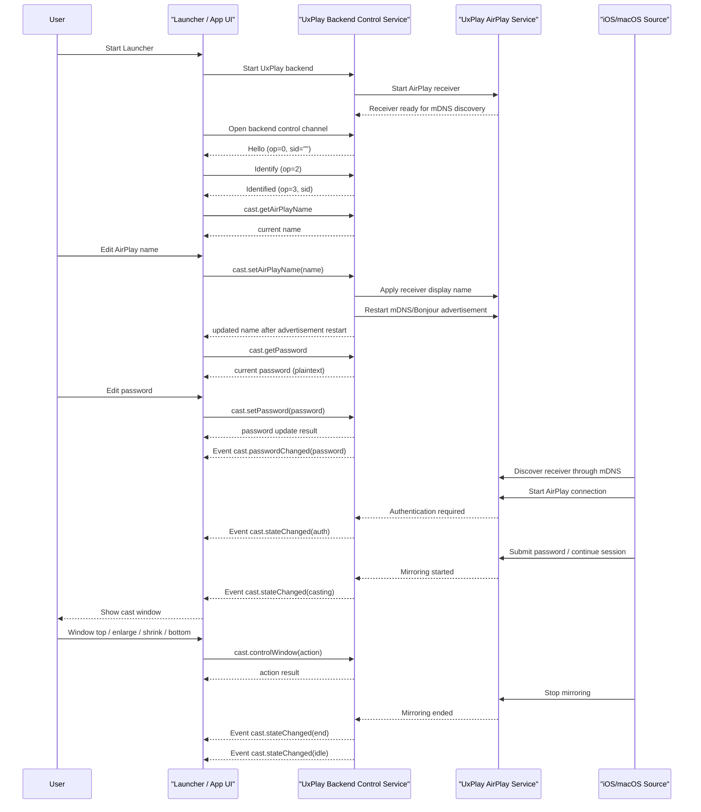

# Cast Receiver UxPlay Protocol Interaction Flow

> Status: flow design
> Scope: Launcher-integrated AirPlay receiver with UxPlay backend internal control
> Source inputs: `docs/business/cast-reciever-uxplay.md`
> Protocol lifecycle: Stage 10 `plan-protocol-flow`

本文根据新的 UxPlay/AirPlay 接收端控制需求，梳理 Launcher / UI、UxPlay backend 内部控制服务和 iOS/macOS 投屏源之间的最小业务交互流程。

本文不是最终协议事实源。当前 adopted/generated 的事实只覆盖 AXTP core WebSocket JSON profile 和 RPC session 基础能力；本场景所需 `cast.*` / UxPlay receiver 业务方法与事件尚未进入 registry/generated。本文只记录 Stage 10 flow 方案和后续 Stage 20 `draft-business-protocol` 缺口。

## 1. Story Summary

| Item | Content |
|---|---|
| User goal | Launcher 启动 UxPlay backend 后，iOS/macOS 能发现 AirPlay 接收端并投屏；UI 能通过 backend 内部控制读取/设置 AirPlay 名称、读取/设置投屏密码、接收密码和投屏状态变化，并控制投屏窗口层级和大小。 |
| Trigger | Launcher 启动 UxPlay backend；或 UI 打开投屏设置 / 投屏窗口控制界面。 |
| Success result | UxPlay backend 是唯一控制承载点；UI 可以完成 AirPlay 名称、投屏密码、投屏状态和窗口控制的最小闭环。 |
| Primary actors | User, Launcher / App UI, UxPlay Backend Control Service, UxPlay AirPlay Service, iOS/macOS Source |
| Product scope | Windows Launcher 集成 AirPlay 接收端；控制面合并到 UxPlay backend 内部控制服务。 |

## 2. Source Observations

### 2.1 UI / Prototype

| Screen or control | Observed behavior | Protocol relevance |
|---|---|---|
| 投屏设置页 / AirPlay 名称 | UI 读取当前 AirPlay 显示名称；用户修改后保存；backend 立即重启 mDNS/Bonjour 广播发布新名称。 | 需要名称读取和设置 method；设置成功表示新名称已重新发布。 |
| 投屏设置页 / 投屏密码 | UI 读取当前密码；用户修改后保存；backend 密码变化时携带明文密码通知 UI 刷新。 | 需要密码读取、设置 method 和密码变更 event；读取响应和事件均明文携带 `password`。 |
| 投屏状态展示 | UI 根据投屏流程展示空闲、认证、投屏中、结束等状态。 | 需要状态变化 event，状态枚举收窄为 `idle/auth/casting/end`。 |
| 投屏窗口控制 | UI 触发窗口置顶、放大、缩小、置底；置底表示隐藏投屏窗口。 | 需要窗口动作 method；本轮不要求窗口状态查询或窗口变化 event。 |

### 2.2 Requirement Notes

- UxPlay backend 内部控制服务是唯一控制承载点。
- 只保留 AirPlay 名称、投屏密码、投屏状态流程、投屏窗口控制四组能力。
- AirPlay 名称设置成功后立即重启 mDNS/Bonjour 广播。
- 投屏密码获取响应和密码变更事件均携带明文密码。
- 不包含音频、端口、runtime/backend 重启、退出、帧统计、服务 ready/exited 等扩展控制能力。
- mDNS / AirPlay / RAOP 媒体协议仍由 UxPlay 处理，不进入 AXTP 业务协议设计。

## 3. Assumptions And Non-Goals

| Type | Item | Status |
|---|---|---|
| Assumption | Launcher / UI 直接连接 UxPlay backend 内部控制服务。 | `[REVIEW-DRAFT]` |
| Assumption | UxPlay backend 内部控制服务作为 AXTP Logical Server，WebSocket 建立后发送 `Hello`，接收并校验 UI 的 `Identify`，再返回 `Identified` 和 `sid`。 | `[REVIEW-OK]` |
| Assumption | `cast.setAirPlayName` 成功后，backend 立即重启 mDNS/Bonjour 广播并发布新名称。 | `[REVIEW-OK]` |
| Assumption | 投屏密码获取响应和密码变更事件均携带明文 `password`。 | `[REVIEW-OK]` |
| Assumption | 第一版投屏状态事件只允许 `idle`、`auth`、`casting`、`end` 四个状态。 | `[REVIEW-DRAFT]` |
| Assumption | 窗口控制是动作型接口：置顶、放大、缩小、置底；其中置底表示隐藏投屏窗口。 | `[REVIEW-OK]` |
| Non-goal | 不设计外部端口配置或 LAN 控制策略。 | `[REVIEW-OK]` |
| Non-goal | 不设计音频、帧统计、服务启停、backend 重启、runtime 退出或错误上报扩展。 | `[REVIEW-OK]` |
| Non-goal | 不修改 `registry/**`、`protocol/axtp.protocol.yaml`、`docs/generated/**` 或 conformance。 | `[REVIEW-OK]` |

## 4. Protocol Coverage

| Need | Coverage state | AXTP protocol | Evidence | Next action |
|---|---|---|---|---|
| UI 与 backend 建立控制 RPC 通道 | Adopted/generated core | `AXTP-WS-JSON`, `Hello(op=0)`, `Identify(op=2)`, `Identified(op=3)`, `Request(op=7)`, `RequestResponse(op=8)`, `Event(op=6)` | `docs/generated/protocol.md`, `docs/specs/1-core/06-RPC-Session.md` | UxPlay backend 作为 AXTP Logical Server 实现。 |
| AirPlay 名称获取 | Missing | Candidate `cast.getAirPlayName` | `docs/business/cast-reciever-uxplay.md` | Stage 20 起草。 |
| AirPlay 名称设置 | Missing | Candidate `cast.setAirPlayName` | `docs/business/cast-reciever-uxplay.md` | Stage 20 起草；成功后立即重启 mDNS/Bonjour 广播。 |
| 投屏密码获取 | Missing | Candidate `cast.getPassword` | `docs/business/cast-reciever-uxplay.md` | Stage 20 起草；response 明文返回 `password`。 |
| 投屏密码设置 | Missing | Candidate `cast.setPassword` | `docs/business/cast-reciever-uxplay.md` | Stage 20 起草。 |
| 投屏密码变更事件 | Missing | Candidate `cast.passwordChanged` | `docs/business/cast-reciever-uxplay.md` | Stage 20 起草；event 明文携带 `password`。 |
| 投屏状态流程变更 | Missing | Candidate `cast.stateChanged` with `idle/auth/casting/end` | `docs/business/cast-reciever-uxplay.md` | Stage 20 起草状态机。 |
| 窗口置顶 | Missing | Candidate `cast.setWindowTop` or `cast.controlWindow(action=top)` | `docs/business/cast-reciever-uxplay.md` | Stage 20 起草窗口动作。 |
| 窗口放大 | Missing | Candidate `cast.enlargeWindow` or `cast.controlWindow(action=enlarge)` | `docs/business/cast-reciever-uxplay.md` | Stage 20 起草窗口动作。 |
| 窗口缩小 | Missing | Candidate `cast.shrinkWindow` or `cast.controlWindow(action=shrink)` | `docs/business/cast-reciever-uxplay.md` | Stage 20 起草窗口动作。 |
| 窗口置底 | Missing | Candidate `cast.controlWindow(action=hide)` | `docs/business/cast-reciever-uxplay.md` | Stage 20 起草；置底语义为隐藏窗口。 |
| mDNS 发现和 AirPlay 媒体传输 | Non-protocol | AirPlay/UxPlay implementation detail | `docs/business/cast-reciever-uxplay.md` | 不进入 AXTP cast 控制协议。 |

## 5. End-To-End Sequence



## 6. Interaction Steps

| Step | Actor | User or system action | Protocol call/event | Request / event payload notes | Response / state result | Error or fallback |
|---:|---|---|---|---|---|---|
| 1 | Launcher / UI | 启动 UxPlay backend。 | Non-protocol | Launcher 负责进程启动和本地配置加载。 | backend 启动 AirPlay service。 | 启动失败由 Launcher 本地提示，不扩大协议范围。 |
| 2 | UI / Backend | 建立 backend 控制通道。 | `Hello(op=0)` / `Identify(op=2)` / `Identified(op=3)` | backend 是 AXTP Logical Server，先发 `Hello`；UI 发送 `Identify`；backend 返回 `Identified` 和 `sid`。 | UI 可使用该 `sid` 发起业务 request 并接收 event。 | 握手或认证失败时 UI 进入不可控状态。 |
| 3 | UI | 打开投屏设置页并读取名称。 | Candidate `cast.getAirPlayName` | params 为空。 | 返回 `{ "name": string }`。 | backend 不可用时 UI 显示读取失败。 |
| 4 | User / UI | 保存新的 AirPlay 名称。 | Candidate `cast.setAirPlayName` | `{ "name": string }`；长度和字符约束待 Stage 20 定义。 | backend 立即重启 mDNS/Bonjour 广播，并在成功后返回应用后的名称。 | 名称非法或 mDNS/Bonjour 重启失败时返回业务错误。 |
| 5 | UI | 读取当前投屏密码。 | Candidate `cast.getPassword` | params 为空。 | 明文返回 `{ "password": string|null }`。 | backend 不可用时 UI 显示读取失败。 |
| 6 | User / UI | 保存投屏密码。 | Candidate `cast.setPassword` | `{ "password": string }`；格式、长度和空密码策略待定义。 | 返回应用结果。 | 密码非法时返回参数错误。 |
| 7 | Backend | 密码发生变化。 | Candidate `cast.passwordChanged` | data 明文携带 `{ "password": string|null }`。 | UI 直接刷新密码展示。 | 密码为空或关闭密码时使用 `null`。 |
| 8 | Source / AirPlay | 发射端连接并进入认证阶段。 | Candidate `cast.stateChanged` | `{ "state": "auth" }`，可附加 reason/source 摘要。 | UI 展示认证中或密码提示。 | 认证失败后可发 `end`，随后回 `idle`。 |
| 9 | Source / AirPlay | 认证通过并开始投屏。 | Candidate `cast.stateChanged` | `{ "state": "casting" }`。 | UI 展示投屏窗口。 | 缺少 source 信息不阻塞 casting 状态。 |
| 10 | Source / AirPlay | 投屏结束。 | Candidate `cast.stateChanged` | `{ "state": "end" }`；随后可发 `{ "state": "idle" }`。 | UI 恢复空闲或结束态。 | 如果 backend 只能上报 stopped，adapter 应归一为 `end`。 |
| 11 | User / UI | 置顶投屏窗口。 | Candidate `cast.controlWindow` | `{ "action": "top" }`。 | backend 完成窗口层级动作。 | 窗口不存在时返回不可用。 |
| 12 | User / UI | 放大投屏窗口。 | Candidate `cast.controlWindow` | `{ "action": "enlarge" }`。 | backend 放大窗口。 | 达到最大尺寸时可返回当前状态或 no-op。 |
| 13 | User / UI | 缩小投屏窗口。 | Candidate `cast.controlWindow` | `{ "action": "shrink" }`。 | backend 缩小窗口。 | 达到最小尺寸时可返回当前状态或 no-op。 |
| 14 | User / UI | 置底投屏窗口。 | Candidate `cast.controlWindow` | `{ "action": "hide" }`。 | backend 隐藏投屏窗口。 | 窗口不存在时返回不可用或 no-op。 |

## 7. Protocol Details

### 7.1 Adopted / Generated Protocols

| Method/Event | Purpose in this flow | Source |
|---|---|---|
| `AXTP-WS-JSON` | 可作为 UI 与 UxPlay backend 控制通道的 JSON RPC envelope。 | `docs/generated/protocol.md` |
| `Hello(op=0)` | UxPlay backend 作为 AXTP Logical Server，在 WebSocket 建立后宣布 RPC session 规则。 | `docs/generated/protocol.md` |
| `Identify(op=2)` | UI 作为 AXTP Logical Client，提交客户端身份、认证和订阅意图。 | `docs/generated/protocol.md` |
| `Identified(op=3)` | UxPlay backend 确认 session ready 并分配 `sid`。 | `docs/generated/protocol.md` |
| `Request(op=7)` | UI 调用 backend 控制 method。 | `docs/generated/protocol.md` |
| `RequestResponse(op=8)` | backend 返回控制 method 结果。 | `docs/generated/protocol.md` |
| `Event(op=6)` | backend 推送密码和投屏状态变化。 | `docs/generated/protocol.md` |

### 7.2 Candidate Request / Response Examples

> 下面示例只用于 Stage 10 评审。`cast.*` 尚未 generated，字段和错误码不得直接作为实现合同。

Handshake:

```json
{
  "sid": "",
  "op": 0,
  "d": {
    "axtpVersion": "1.0.0",
    "rpcVersion": 1
  }
}
```

```json
{
  "sid": "",
  "op": 2,
  "d": {
    "rpcVersion": 1,
    "eventMasks": ""
  }
}
```

```json
{
  "sid": "12345678",
  "op": 3,
  "d": {
    "negotiatedRpcVersion": 1
  }
}
```

Get AirPlay name:

```json
{
  "sid": "12345678",
  "op": 7,
  "d": {
    "id": 1,
    "method": "cast.getAirPlayName",
    "params": {}
  }
}
```

Set AirPlay name:

```json
{
  "sid": "12345678",
  "op": 7,
  "d": {
    "id": 2,
    "method": "cast.setAirPlayName",
    "params": {
      "name": "Meeting Room AirPlay"
    }
  }
}
```

Get password:

```json
{
  "sid": "12345678",
  "op": 7,
  "d": {
    "id": 3,
    "method": "cast.getPassword",
    "params": {}
  }
}
```

Get password response:

```json
{
  "sid": "12345678",
  "op": 8,
  "d": {
    "id": 3,
    "method": "cast.getPassword",
    "status": {
      "ok": true,
      "code": 0
    },
    "result": {
      "password": "1234"
    }
  }
}
```

Password changed event:

```json
{
  "sid": "12345678",
  "op": 6,
  "d": {
    "event": "cast.passwordChanged",
    "data": {
      "password": "5678"
    }
  }
}
```

Cast state changed event:

```json
{
  "sid": "12345678",
  "op": 6,
  "d": {
    "event": "cast.stateChanged",
    "data": {
      "state": "casting"
    }
  }
}
```

Window action:

```json
{
  "sid": "12345678",
  "op": 7,
  "d": {
    "id": 3,
    "method": "cast.controlWindow",
    "params": {
      "action": "top"
    }
  }
}
```

Hide window action:

```json
{
  "sid": "12345678",
  "op": 7,
  "d": {
    "id": 4,
    "method": "cast.controlWindow",
    "params": {
      "action": "hide"
    }
  }
}
```

### 7.3 Draft Or Missing Protocol Gaps

| Gap | Candidate domain.feature | Candidate method/event/schema | Routed skill | Review question |
|---|---|---|---|---|
| AirPlay 名称读写缺少 adopted/generated 协议。 | `cast.receiver` | `cast.getAirPlayName`, `cast.setAirPlayName`, `AirPlayName` schema | `draft-business-protocol` | `[REVIEW-ASK]` 名称长度、字符集、立即生效策略如何定义？ |
| 投屏密码读写和变更事件缺少 adopted/generated 协议。 | `cast.auth` or `cast.password` | `cast.getPassword`, `cast.setPassword`, `cast.passwordChanged`, `CastPassword` schema | `draft-business-protocol` | `[REVIEW-OK]` response/event 均明文携带 `password`。 |
| 投屏状态机缺少 adopted/generated 协议。 | `cast.session` | `cast.stateChanged`, `CastState=idle/auth/casting/end` | `draft-business-protocol` | `[REVIEW-ASK]` `end` 后是否必须再发 `idle`？ |
| 窗口动作缺少 adopted/generated 协议。 | `cast.window` | `cast.controlWindow`, `WindowAction=top/enlarge/shrink/hide` | `draft-business-protocol` | `[REVIEW-ASK]` 放大是否等同 maximize/fullscreen？ |

## 8. Test Fixtures

| Fixture | Expected result |
|---|---|
| `backend-axtp-handshake` | UI 连接 backend 后收到 `Hello(op=0)`，发送 `Identify(op=2)`，收到 `Identified(op=3)` 和可用于后续请求的 `sid`。 |
| `backend-control-direct` | UI 控制请求直接到 UxPlay backend control service。 |
| `airplay-name-get-set` | `cast.getAirPlayName` 返回当前名称；`cast.setAirPlayName` 成功后 mDNS/Bonjour 已用新名称重新发布，再次读取为新名称。 |
| `password-get-set` | `cast.getPassword` 明文返回当前密码；`cast.setPassword` 成功后 backend 应用新密码。 |
| `password-changed-event` | 密码被 UI 设置或 backend 更新后，UI 收到携带明文 `password` 的 `cast.passwordChanged`。 |
| `state-idle-auth-casting-end` | 发射端连接、认证、开始投屏、结束投屏时，UI 按顺序收到 `auth/casting/end`，最终可回到 `idle`。 |
| `window-top` | UI 发送窗口置顶动作后，投屏窗口进入最前层级或 always-on-top。 |
| `window-enlarge-shrink` | UI 发送放大/缩小动作后，投屏窗口尺寸变化或在边界处 no-op。 |
| `window-bottom-hide` | UI 发送置底动作后，投屏窗口被隐藏。 |

## 9. Acceptance Gates

- UxPlay backend 内部控制服务承载名称、密码、状态和窗口四组最小能力。
- UxPlay backend 内部控制服务作为 AXTP Logical Server，实现 `Hello / Identify / Identified`。
- AirPlay 名称设置成功后立即重启 mDNS/Bonjour 广播。
- 状态事件只使用 `idle`、`auth`、`casting`、`end`。
- 密码读取响应和密码变更事件都明文携带 `password`。
- 窗口置顶、放大、缩小可执行；窗口置底按隐藏窗口处理。
- 所有新增 `cast.*` 候选能力在进入 registry/generated 前不得作为 adopted SDK 合同发布。
- 本 Stage 10 输出不修改 `registry/**`、`protocol/axtp.protocol.yaml`、`docs/generated/**`。

## 10. Open Questions

- `[REVIEW-ASK]` `auth` 状态是否只表示需要密码认证，还是也覆盖认证校验中和认证失败？
- `[REVIEW-ASK]` `end` 状态是否是瞬时事件，之后是否必须由 backend 主动再发 `idle`？
- `[REVIEW-ASK]` 窗口放大是全屏、最大化，还是按固定步进放大？
