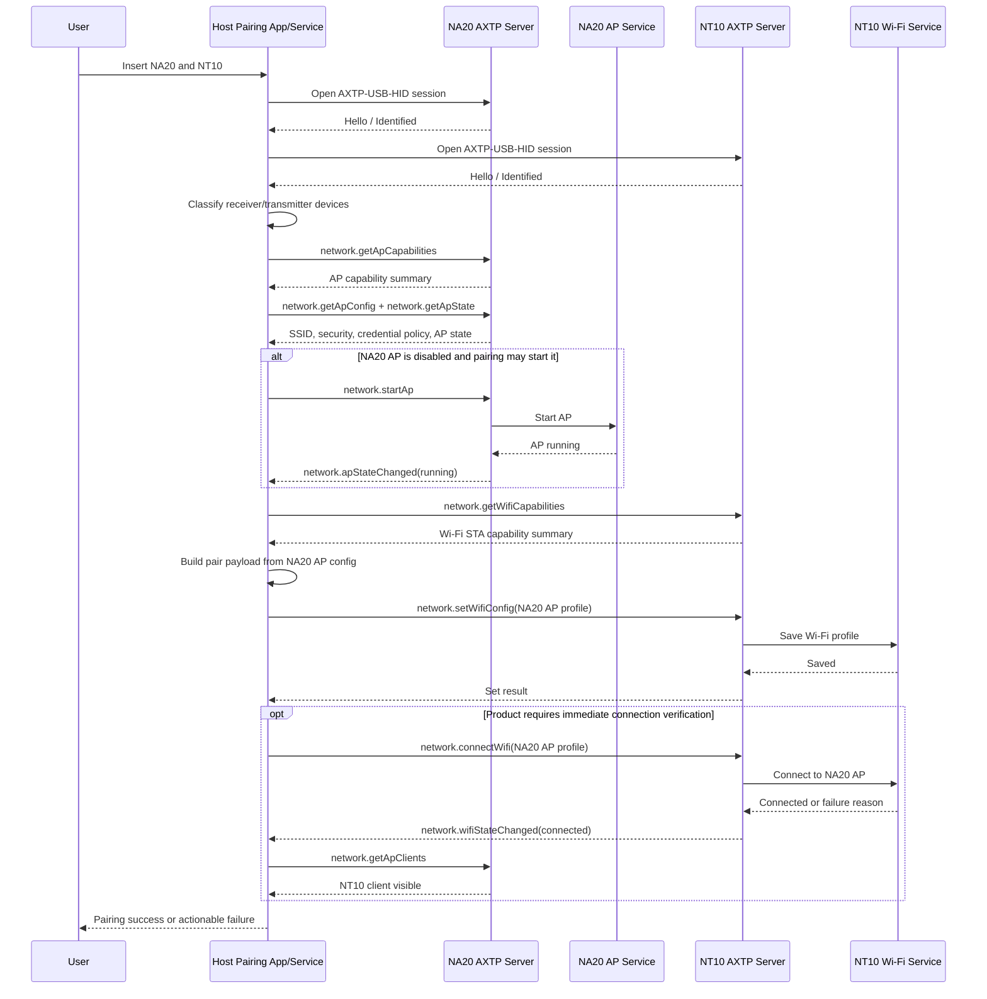

# Cast RX/TX Pairing Protocol Interaction Flow

> Status: flow design
> Scope: NA20 receiver AP management, NT10 transmitter Wi-Fi STA management, and host-side pairing orchestration
> Source inputs: `docs/business/cast-rxtx-paring.md`
> Protocol lifecycle: Stage 10 `plan-protocol-flow`

本文根据“投屏器发射/接收端配对流程”的业务需求，梳理上位机、NA20 接收端、NT10 发射端和 AXTP 协议之间的交互流程。

本文不是最终协议事实源。当前 generated 协议只包含已采纳的 `audio` 域业务方法；本流程涉及的 `network.ap`、`network.wifi`、`device.info` 仍是 `docs/protocol/**` 草案或主机实现细节，后续需要进入 Stage 20 `draft-business-protocol` 完成协议草案细化和采纳前评审。

## 1. Story Summary

| Item | Content |
|---|---|
| User goal | 用户将 NA20 和 NT10 同时插到上位机，系统自动完成配对：读取 NA20 的热点信息，并写入 NT10 的 Wi-Fi STA 配置。 |
| Trigger | 上位机检测到 NA20 和 NT10 通过 USB 接入，或用户在上位机软件中触发“自动配对”。 |
| Success result | NT10 保存 NA20 的热点连接信息；如果产品要求立即连接，NT10 成功连接到 NA20 AP，NA20 可看到 NT10 客户端。 |
| Primary actors | User, host pairing app/service, NA20 AXTP server, NT10 AXTP server, NA20 AP service, NT10 Wi-Fi service |
| Product scope | NA20 作为投屏接收端和 AP 端点；NT10 作为投屏发射端和 Wi-Fi STA；两者都通过 USB 与上位机交互。 |

## 2. Source Observations

### 2.1 UI / Prototype

| Screen or control | Observed behavior | Protocol relevance |
|---|---|---|
| USB 插入行为 | 用户把 NA20 和 NT10 插到有上位机的电脑上。 | 需要上位机发现两个 USB 设备并分别建立 AXTP 会话；设备枚举本身可由 USB descriptor 或本地设备管理完成。 |
| 自动配对入口 | 需求倾向“插入后自动完成配对”，没有描述手动按钮或配对页面。 | 自动触发属于上位机编排；协议侧需要能读取 AP 信息、写入 Wi-Fi 配置并观察结果。 |
| 配对结果提示 | 原始需求未描述 UI。 | `[REVIEW-ASK]` 是否需要显示“已写入配置”“正在连接”“连接成功/失败”“需重新插拔”等状态。 |

### 2.2 Requirement Notes

- NA20 自带 Wi-Fi 模块，作为 AP 端点，通过 USB 与上位机交互。
- NT10 自带 Wi-Fi 模块，作为 STA 端，连接到 NA20 后进行推流投屏，通过 USB 与上位机交互。
- 本需求只覆盖 NA20 热点功能管理、NT10 Wi-Fi 功能管理和两者配对流程。
- 本需求不覆盖投屏传流、音视频处理或设备升级。
- 需求没有提供旧协议命令、AP 凭据格式、加密方式、持久化策略或错误码映射；这些需要后续协议草案阶段确认。

## 3. Assumptions And Non-Goals

| Type | Item | Status |
|---|---|---|
| Assumption | 上位机同时维护两条独立 AXTP-over-USB-HID 会话：一条到 NA20，一条到 NT10。 | `[REVIEW-DRAFT]` |
| Assumption | NA20 与 NT10 之间的配对由上位机编排完成，不要求 NA20 直接向 NT10 下发配置。 | `[REVIEW-DRAFT]` |
| Assumption | 配对信息至少包含 SSID、安全类型和凭据；是否包含 BSSID、频段、信道、IP 网段或设备标识待确认。 | `[REVIEW-DRAFT]` |
| Assumption | NT10 写入配置后默认持久化，重启或重新插拔后仍能连接 NA20。 | `[REVIEW-DRAFT]` |
| Question | NA20 AP 是否始终开启，还是配对流程需要在必要时启动 AP？ | `[REVIEW-ASK]` |
| Question | NA20 的 AP 密码是否允许通过 AXTP 读出明文，还是应返回一次性配对 token / opaque credential？ | `[REVIEW-ASK]` |
| Question | 如果上位机同时接入多个 NA20 或多个 NT10，自动配对策略是一对一、人工选择，还是按设备序列号绑定？ | `[REVIEW-ASK]` |
| Question | NT10 写入 Wi-Fi 配置后是否必须立即连接并等待成功，还是只需保存配置即可视为配对成功？ | `[REVIEW-ASK]` |
| Non-goal | 不设计 NA20 与 NT10 之间的投屏传流协议。 | `[REVIEW-OK]` |
| Non-goal | 不设计固件升级、音视频流、设备云端绑定或账号权限。 | `[REVIEW-OK]` |
| Non-goal | 默认不新增一个跨设备的 `cast.pairing` 一键方法；优先由上位机编排 `network.ap` 和 `network.wifi` 能力。 | `[REVIEW-OK]` |

## 4. Protocol Coverage

| Need | Coverage state | AXTP protocol | Evidence | Next action |
|---|---|---|---|---|
| 上位机与 NA20/NT10 建立 USB AXTP 会话 | Adopted/generated core | `AXTP-USB-HID`, connection lifecycle | `docs/generated/protocol.md` | 可按 AXTP core/session 实现。 |
| 识别哪个设备是 NA20、哪个是 NT10 | Drafted only / Non-protocol | USB descriptor, `device.info` | `docs/protocol/device/device.info.md` | 若 USB descriptor 足够则不新增协议；若需 AXTP 查询，转 Stage 20 细化 device 草案。 |
| 查询 NA20 是否支持 AP 能力 | Drafted only | `network.getApCapabilities`, `network.ap` | `docs/protocol/network/network.ap.md` | 转 Stage 20 细化并采纳 `network.ap`。 |
| 读取 NA20 AP 配置和状态 | Drafted only | `network.getApConfig`, `network.getApState` | `docs/protocol/network/network.ap.md` | 转 Stage 20；重点确认凭据字段和可读策略。 |
| 必要时启动 NA20 AP | Drafted only | `network.startAp`, `network.apStateChanged` | `docs/protocol/network/network.ap.md` | 转 Stage 20；确认 AP 生命周期和启动条件。 |
| 查询 NT10 是否支持 Wi-Fi STA 配置 | Drafted only | `network.getWifiCapabilities`, `network.wifi` | `docs/protocol/network/network.wifi.md` | 转 Stage 20 细化并采纳 `network.wifi`。 |
| 将 NA20 热点信息写入 NT10 | Drafted only / schema gap | `network.setWifiConfig` | `docs/protocol/network/network.wifi.md` | 转 Stage 20；确认保存配置、凭据、autoConnect 和连接策略字段。 |
| 触发 NT10 连接 NA20 AP 并观察结果 | Drafted only | `network.connectWifi`, `network.getWifiState`, `network.wifiStateChanged` | `docs/protocol/network/network.wifi.md` | 转 Stage 20；确认连接状态枚举、超时和失败原因。 |
| 在 NA20 侧验证 NT10 已接入 AP | Drafted only / Optional | `network.getApClients`, `network.apClientChanged` | `docs/protocol/network/network.ap.md` | 产品若要求强校验，转 Stage 20 细化客户端列表字段。 |
| 上位机本地编排、重试和用户提示 | Non-protocol | Host pairing app/service | `docs/business/cast-rxtx-paring.md` | 作为 App/runtime 行为实现，不进入协议。 |

## 5. End-To-End Sequence



## 6. Interaction Steps

| Step | Actor | User or system action | Protocol call/event | Request / event payload notes | Response / state result | Error or fallback |
|---:|---|---|---|---|---|---|
| 1 | User / Host | 用户插入 NA20 和 NT10。 | Non-protocol / USB enumeration | 上位机发现两个 USB HID 设备。 | 进入自动配对候选集。 | 只发现一个设备时等待另一个设备或提示缺失设备。 |
| 2 | Host | 分别建立到两个设备的 AXTP 会话。 | AXTP connection lifecycle | 使用 `AXTP-USB-HID` 建立 session、完成 Hello / Identify / Identified。 | 两个设备均可接收 RPC。 | 任一会话失败则中止配对并提示设备连接异常。 |
| 3 | Host | 判断设备角色。 | USB descriptor or draft `device.info` | 优先使用 USB VID/PID/product string；如需协议查询，可读取型号、产品名、序列号或角色字段。 | 标记 NA20 receiver 与 NT10 transmitter。 | 无法区分时不应猜测；多设备时进入人工选择或按绑定记录匹配。 |
| 4 | Host | 检查 NA20 AP 能力。 | Draft `network.getApCapabilities` | 查询 AP/SoftAP 是否支持配置读取、启动和客户端列表。 | 确认 NA20 可作为 AP 端点。 | 不支持时中止配对；能力缺失时进入产品兼容处理。 |
| 5 | Host | 获取 NA20 AP 信息。 | Draft `network.getApConfig`, `network.getApState` | 需要 SSID、安全类型、凭据或凭据引用、AP 运行状态；可选 BSSID、频段、信道、IP 网段。 | 上位机获得可写入 NT10 的配对材料。 | 若凭据不可读，应使用配对 token 或让 NA20 生成一次性配置；该行为需 Stage 20 确认。 |
| 6 | Host / NA20 | 若 AP 未运行且允许自动启动，则启动 NA20 AP。 | Draft `network.startAp`, `network.apStateChanged` | 使用当前 AP config 启动；必要时等待 `running` 状态。 | NA20 AP 可被 NT10 连接。 | 启动失败、忙碌或策略禁止时中止并提示。 |
| 7 | Host | 构造 NT10 Wi-Fi profile。 | Non-protocol orchestration | 将 NA20 AP 信息转换为 NT10 STA 配置；不得记录明文密码到普通日志。 | 得到一份待写入 NT10 的 profile。 | 字段缺失时中止；如需要用户确认，显示 NA20 名称/SSID 而不是密码。 |
| 8 | Host | 检查 NT10 Wi-Fi 能力。 | Draft `network.getWifiCapabilities` | 查询 STA 配置、保存 profile、连接和状态上报能力。 | 确认 NT10 可写入并连接 NA20 AP。 | 不支持时中止配对；能力缺失时提示固件不支持。 |
| 9 | Host / NT10 | 写入 NA20 AP 配置到 NT10。 | Draft `network.setWifiConfig` | 建议字段包括 `ssid`、`security`、`credential`、`persist=true`；可选 `bssid`、`hidden`、`autoConnect`。 | NT10 保存 Wi-Fi profile。 | 参数非法、凭据不被接受或存储失败时回滚/提示失败。 |
| 10 | Host / NT10 | 根据产品策略触发立即连接。 | Draft `network.connectWifi` | 可引用刚保存的 profile，或带 `ssid`/profile id。 | NT10 开始连接 NA20 AP。 | 若只要求保存配置，可跳过本步；连接超时需给出失败原因。 |
| 11 | NT10 / Host | 观察 NT10 连接状态。 | Draft `network.wifiStateChanged`, `network.getWifiState` | 状态应区分 connecting、connected、auth_failed、not_found、timeout、disconnected 等。 | Host 判定 NT10 是否已接入 NA20。 | 未收到事件时轮询；auth_failed 时需重新读取或更新 NA20 凭据。 |
| 12 | Host / NA20 | 可选：在 NA20 侧确认 NT10 客户端。 | Draft `network.getApClients`, `network.apClientChanged` | 客户端列表至少需要 MAC/BSSID 或可匹配标识。 | NA20 看到 NT10 客户端，配对强校验通过。 | 如果 NA20 不支持客户端列表，则以 NT10 Wi-Fi state 作为验收依据。 |
| 13 | Host | 完成配对并记录结果。 | Non-protocol | 可本地记录 NA20/NT10 serial、pair time、SSID/profile id；不得保存明文凭据。 | 用户看到配对成功，后续可进入投屏流程。 | 失败结果应保留可诊断原因，例如设备缺失、AP 启动失败、Wi-Fi 写入失败、认证失败。 |

## 7. Protocol Details

### 7.1 Adopted / Generated Protocols

| Method/Event/Profile | Purpose in this flow | Source |
|---|---|---|
| `AXTP-USB-HID` | 上位机通过 USB HID 与 NA20、NT10 分别建立 AXTP 会话。 | `docs/generated/protocol.md` |
| AXTP connection lifecycle | Hello / Identify / Identified 后，上位机才能发起业务 RPC。 | `docs/generated/protocol.md` |

当前 generated 协议没有 adopted `network` 或 `device` 业务方法。因此下面的方法名只能作为草案依赖引用，不能作为实现合同。

### 7.2 Draft Protocol Dependencies

| Draft method/event | Purpose in this flow | Source |
|---|---|---|
| `device.getInfo` | 在 USB descriptor 不足时识别设备型号、角色、序列号或绑定标识。 | `docs/protocol/device/device.info.md` |
| `network.getApCapabilities` | 确认 NA20 支持 AP 配置读取、启动、状态和客户端查询。 | `docs/protocol/network/network.ap.md` |
| `network.getApConfig` | 读取 NA20 AP SSID、安全类型和配对所需凭据材料。 | `docs/protocol/network/network.ap.md` |
| `network.startAp` | 在配对前启动 NA20 AP。 | `docs/protocol/network/network.ap.md` |
| `network.getApState` / `network.apStateChanged` | 判断 NA20 AP 是否已运行。 | `docs/protocol/network/network.ap.md` |
| `network.getApClients` / `network.apClientChanged` | 可选确认 NT10 是否出现在 NA20 AP 客户端列表。 | `docs/protocol/network/network.ap.md` |
| `network.getWifiCapabilities` | 确认 NT10 支持 STA 配置、保存 profile 和连接状态。 | `docs/protocol/network/network.wifi.md` |
| `network.setWifiConfig` | 将 NA20 AP profile 写入 NT10。 | `docs/protocol/network/network.wifi.md` |
| `network.connectWifi` | 可选触发 NT10 立即连接 NA20 AP。 | `docs/protocol/network/network.wifi.md` |
| `network.getWifiState` / `network.wifiStateChanged` | 观察 NT10 连接状态和失败原因。 | `docs/protocol/network/network.wifi.md` |

### 7.3 Candidate Pair Payload Shape

下面只是 flow 阶段的候选语义，用来说明 Stage 20 需要补齐哪些 schema；字段名和类型不得直接视为 adopted 协议。

NA20 AP config response 需要表达：

```json
{
  "ssid": "NA20-xxxx",
  "security": "wpa2-psk",
  "credential": {
    "type": "passphrase",
    "value": "<sensitive>"
  },
  "band": "5g",
  "channel": 149,
  "bssid": "optional",
  "state": "running"
}
```

NT10 Wi-Fi set request 需要表达：

```json
{
  "profile": {
    "ssid": "NA20-xxxx",
    "security": "wpa2-psk",
    "credential": {
      "type": "passphrase",
      "value": "<sensitive>"
    },
    "bssid": "optional",
    "persist": true,
    "autoConnect": true
  }
}
```

安全规则：

- AP 凭据只能在本地可信链路内传递，优先限定为上位机到设备的 USB AXTP 会话。
- 上位机不得把明文凭据写入普通日志、崩溃报告或可同步的配置文件。
- 如果产品不允许读取明文 AP 密码，`network.ap` 需要定义一次性配对 token、opaque credential 或设备内安全导出机制。

### 7.4 Draft Or Missing Protocol Gaps

| Gap | Candidate domain.feature | Candidate method/event/schema | Routed skill | Review question |
|---|---|---|---|---|
| NA20 AP 凭据是否可读、如何安全传给 NT10 尚未定义。 | `network.ap` | `network.getApConfig` response credential policy / schema | `docs/dev/skills/20-draft-business-protocol/SKILL.md` | `[REVIEW-ASK]` 返回明文 passphrase、一次性 token，还是 opaque credential？ |
| NT10 Wi-Fi profile 的保存、立即连接和持久化语义尚未定义。 | `network.wifi` | `network.setWifiConfig`, `network.connectWifi`, profile schema | `docs/dev/skills/20-draft-business-protocol/SKILL.md` | `[REVIEW-ASK]` 写入后是否默认持久化并自动连接？ |
| 连接状态和失败原因需要可测试枚举。 | `network.wifi` | `network.getWifiState`, `network.wifiStateChanged` state/reason schema | `docs/dev/skills/20-draft-business-protocol/SKILL.md` | `[REVIEW-ASK]` 需要区分 auth_failed、ap_not_found、timeout、unsupported_security 吗？ |
| NA20 AP 客户端列表是否作为配对成功强校验。 | `network.ap` | `network.getApClients`, `network.apClientChanged` client schema | `docs/dev/skills/20-draft-business-protocol/SKILL.md` | `[REVIEW-ASK]` 是否必须在 NA20 侧看到 NT10 才算成功？ |
| 上位机是否需要通过 AXTP 查询设备角色。 | `device.info` | role/model/product/serial fields | `docs/dev/skills/20-draft-business-protocol/SKILL.md` | `[REVIEW-ASK]` USB VID/PID/product string 是否足以区分 NA20 和 NT10？ |
| 产品是否需要单 RPC 原子配对能力。 | `[REVIEW-ASK]` taxonomy TBD | Possible `cast.pairing` / `device.pairing` / no new capability | `docs/dev/skills/20-draft-business-protocol/SKILL.md` only if required | `[REVIEW-ASK]` 当前是否接受上位机编排多个 network 方法，而不是一个 pairing 方法？ |

## 8. Test Fixtures

| Fixture | Expected result |
|---|---|
| `single-na20-nt10-ap-running` | 上位机识别一台 NA20 和一台 NT10；读取 NA20 AP config；写入 NT10 Wi-Fi profile；配对成功。 |
| `single-na20-nt10-ap-disabled` | 若产品允许自动启动，Host 调用 AP start 后继续配对；若不允许，提示 NA20 AP 未开启。 |
| `multiple-na20-one-nt10` | 自动配对不得随机选择；应按绑定记录或用户选择确定目标 NA20。 |
| `one-na20-multiple-nt10` | 支持逐个写入多个 NT10，或按产品策略只允许选择一个 NT10。 |
| `nt10-wifi-unsupported` | Host 检测缺少 `network.wifi` 能力后中止，提示固件或设备不支持配对。 |
| `credential-not-readable` | 如果 NA20 不允许导出凭据，流程进入明确失败或 token-based pairing 分支，不泄露密码。 |
| `auth-failed` | NT10 写入后连接失败，Host 能展示认证失败并避免误报配对成功。 |
| `persist-after-replug` | NT10 重新插拔或重启后仍保留 NA20 Wi-Fi profile，除非产品明确要求临时配对。 |

## 9. Acceptance Gates

- 上位机能稳定发现并区分 NA20 和 NT10；多设备场景不发生误配。
- NA20 AP 信息能以已确认的安全策略提供给上位机，并能转成 NT10 Wi-Fi profile。
- NT10 能保存 NA20 Wi-Fi profile；如产品要求立即连接，必须能报告连接成功或可诊断失败原因。
- 明文 AP 密码不得进入普通日志、本地持久化记录或非必要 UI。
- 所有 `network.ap`、`network.wifi`、`device.info` 依赖在采纳前都只能作为草案依赖，不得按 generated 实现合同开发。
- 本流程不修改 registry、generated 或 Protocol IR；后续协议事实必须通过 Stage 20/30/50 工作流进入正式生成路径。

## 10. Open Questions

- `[REVIEW-ASK]` `cast-rxtx-paring` 文件名是否沿用当前拼写，还是后续统一改为 `cast-rxtx-pairing`？
- `[REVIEW-ASK]` NA20 AP 的 SSID/密码是固定出厂值、运行时生成值，还是由上位机/用户可配置？
- `[REVIEW-ASK]` NT10 写入 Wi-Fi 后是否需要立刻断开 USB 侧流程并开始推流，还是只完成配置保存？
- `[REVIEW-ASK]` AP 凭据是否需要加密封装、一次性有效期或与 NT10 设备身份绑定？
- `[REVIEW-ASK]` 配对成功是否需要 NA20 侧客户端列表确认，还是 NT10 自身连接状态即可？
- `[REVIEW-ASK]` 旧协议中 `APInfo`、`Wifi`、`OpenApService`、`CommonSetTailWiFiSSID` 等条目的 payload 是否能提供字段级映射？
