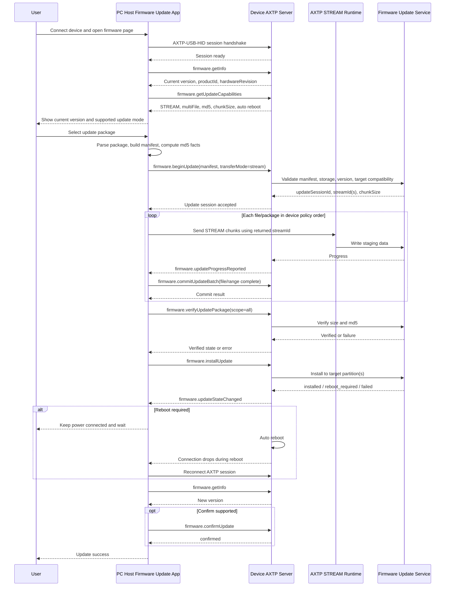

# Device Firmware Update Protocol Interaction Flow

> Status: flow design
> Scope: PC host updates a directly connected device through the generic `firmware.update` capability
> Source inputs: `docs/business/device-firmware-update.md`, `docs/protocol/firmware/firmware.update.md`, `docs/protocol/firmware/firmware.info.md`, `docs/legacy-migration/classification/firmware.md`
> Protocol lifecycle: Stage 10 `plan-protocol-flow`

本文根据“设备接到 PC 上位机后可以读取当前版本并执行固件更新，且需要从单个 `.bin` 扩展到多个 `.bin` 文件”的业务需求，梳理上位机、设备、固件升级服务和 AXTP 协议之间的交互流程。

本文不是最终协议事实源。当前 generated 协议提供 AXTP Core、Standard Framed transport、STREAM 数据面和错误码；`firmware.getInfo`、`firmware.getUpdateCapabilities`、`firmware.beginUpdate`、`firmware.commitUpdateBatch`、`firmware.verifyUpdatePackage`、`firmware.installUpdate` 及固件更新事件仍是 `docs/protocol/firmware/**` 草案依赖。后续需要进入 Stage 20 `draft-business-protocol` 继续细化并采纳 `firmware.update` / `firmware.info`。

Flow 文档负责描述业务场景和交互步骤、判断每一步协议覆盖状态、识别协议缺口，并将缺口路由到 candidate `domain.feature`。Flow 文档不负责定义完整 method / event / schema / capability，不分配 methodId / eventId / errorCode / fieldId，也不能替代 `docs/protocol/<domain>/<feature>.md`。

## 0. 速读结论

| 项目 | 内容 |
|---|---|
| Flow 目标 | PC Host 读取设备固件信息，选择单 `.bin` 或多 `.bin` 包，通过 AXTP STREAM 上传、md5 校验、安装并等待设备自动重启后确认新版本。 |
| 当前协议覆盖 | partial |
| 涉及 domain.feature | `firmware.info`, `firmware.update`, `stream.flowControl` |
| 已有 adopted/generated | AXTP Standard Framed transport、Core STREAM 数据面、firmware/stream error codes。 |
| 缺口 | `firmware.*` 业务方法和事件未 generated；manifest、多文件顺序传输、md5 校验、自动重启、confirm/rollback 边界需草案采纳。 |
| 是否需要新增协议草案 | yes，已有草案需 review/adopt。 |
| 是否涉及 Legacy | yes |
| 是否涉及 STREAM | yes |
| 下一步 | draft protocol；P0 锁定顺序上传、多文件 manifest、md5、设备自动重启，resume/parallel 作为 future。 |

## 1. Story Summary

| Item | Content |
|---|---|
| User goal | 用户将设备连接到 PC 上位机，查看当前固件版本，选择或导入升级包，并完成可靠升级。 |
| Trigger | 上位机检测到设备接入，或用户打开固件升级页面并选择本地固件更新包。 |
| Success result | 设备确认包兼容、接收单文件或多文件固件、完成 md5 校验和安装；需要重启时设备自动重启，上位机重新连接后看到新版本。 |
| Primary actors | User, PC host firmware update app/service, Device AXTP server, firmware update service, AXTP STREAM runtime |
| Product scope | 通用 `firmware.update` 能力；优先覆盖 PC 本地上传固件更新，兼容单 `.bin`、多 `.bin` 和带 manifest 的整包。 |

## 2. Source Observations

### 2.1 UI / Prototype

| Screen or control | Observed behavior | Protocol relevance |
|---|---|---|
| Device connection entry | 设备接到 PC 后，上位机识别设备并建立会话。 | 使用 AXTP Standard Framed transport，典型路径是 `AXTP-USB-HID`。 |
| Current version display | 上位机需要知道当前版本号信息。 | 草案依赖 `firmware.getInfo`。 |
| Firmware package picker | 用户选择一个 `.bin`、多个 `.bin` 或一个包含 manifest 的包。 | 本地文件解析和 manifest 生成是上位机行为；协议只接收 manifest、hash、target 和文件集合。 |
| Start update button | 用户确认升级后，上位机开始固件更新。 | 草案依赖 `firmware.getUpdateCapabilities` 和 `firmware.beginUpdate`。 |
| Progress view | UI 展示整体进度、每个文件进度、当前阶段和失败原因。 | 草案依赖 `firmware.updateProgressReported`、`firmware.updateStateChanged`；事件丢失时可用 `firmware.getUpdateState`。 |
| Cancel / retry | 接收或校验阶段允许取消；传输异常时首版可重试当前文件或重新开始。 | 草案依赖 `firmware.cancelUpdate`；断点续传、乱序补传和多文件并行只作为预留设计。 |
| Reboot / confirm prompt | 安装完成后设备自动重启，上位机提示保持供电并等待重连。 | 草案依赖 `firmware.installUpdate` response；不要求上位机调用 `system.reboot`。 |
| UI prototype image | `[REVIEW-ASK]` 本轮没有 UI 图；页面文案、按钮状态、失败提示和是否要求用户二次确认需产品/UI 确认。 | 不新增协议，只影响 App 流程和状态展示。 |

### 2.2 Requirement Notes

- 单 `.bin` 和多 `.bin` 不应走两套协议；都统一表达为 `FirmwareUpdateManifest.files[]`。
- 多文件包可包含 bootloader、application、resource、model 或 vendor 等目标；安装顺序由设备策略决定，不由文件列表顺序作为唯一事实。
- 本产品生产包不做签名，只使用 md5 做完整性校验；sha256 和签名字段可保留为协议扩展能力，不作为本流程 P0 要求。
- 安装后如需重启，由设备自动执行；上位机只负责提示保持供电、等待断连和重连后读取版本。
- 首版不要求断点续传、乱序补传或多文件并行传输；相关状态字段和方法只作为后续预留。
- `firmware.update` 草案明确 P0 推荐使用 `firmware.update` STREAM 数据面，`file.transfer` 暂存模式仅为 P1 扩展。
- Legacy 线索中 AXDP Alpha/Beta 升级、Rooms / Signage / VM33 远程升级和进度查询都被归类到 `firmware.update`；这些只能作为迁移证据。

### 2.3 Device / System State Observations

| State | Meaning | Protocol relevance |
|---|---|---|
| session ready | PC Host 与设备已经建立 Standard Framed AXTP session。 | generated；固件本地上传需要 RPC + STREAM。 |
| current firmware known | Host 已读取当前版本和硬件/产品信息。 | draft query；`firmware.getInfo`。 |
| update capability known | 设备返回 transferModes、hashAlgorithms、multiFile、chunkSize、autoReboot 等能力。 | draft query；`firmware.getUpdateCapabilities`。 |
| package parsed | Host 已把单/多文件包转成 manifest。 | local-only；不进入协议。 |
| update session accepted | 设备接受 manifest 并返回 updateSessionId / streamId。 | draft request；`firmware.beginUpdate`。 |
| receiving | 设备 staging 区正在接收 STREAM bytes。 | generated STREAM + draft firmware binding。 |
| batch committed | Host 告知某个文件或 range 已完整发送。 | draft request；`firmware.commitUpdateBatch`。 |
| verified | 设备完成 size/md5 校验。 | draft request/result；`firmware.verifyUpdatePackage`。 |
| installing | 设备开始安装，部分阶段不可取消。 | draft event/state；`firmware.updateStateChanged`。 |
| rebooting | 安装后设备自动重启，连接会断开。 | state/event + reconnect fallback。 |
| confirmed | Host 重连后读取到新版本，必要时确认 A/B 更新。 | draft query/action；`firmware.getInfo`, optional `firmware.confirmUpdate`。 |

## 3. Assumptions And Non-Goals

| Type | Item | Status |
|---|---|---|
| Assumption | 上位机和设备通过 `AXTP-USB-HID` 建立 Standard Framed 会话，因此可以同时使用 RPC 和 STREAM。 | `[REVIEW-DRAFT]` |
| Assumption | PC 本地固件更新包可以由上位机解析出 manifest；如果包内没有 manifest，上位机需要按产品包规则生成 manifest。 | `[REVIEW-DRAFT]` |
| Assumption | 单 `.bin` 可表示为 `files[]` 中一个 `fileId=app` 或产品定义的目标文件；多 `.bin` 使用多个 `fileId` 分别描述。 | `[REVIEW-DRAFT]` |
| Assumption | 设备在安装前有 staging 区或 A/B 分区保护，校验失败不会覆盖当前可启动版本。 | `[REVIEW-DRAFT]` |
| Assumption | 生产包不强制签名，本流程 P0 只使用 md5 做完整性校验。 | `[REVIEW-OK]` |
| Assumption | 安装后需要重启时由设备自动重启，上位机不调用 `system.reboot`。 | `[REVIEW-OK]` |
| Assumption | P0 不要求断点续传、乱序补传或多文件并行传输；相关设计仅作为协议预留。 | `[REVIEW-OK]` |
| Non-goal | 不设计固件包制作工具、发布后台、灰度策略或自动检查更新策略。 | `[REVIEW-OK]` |
| Non-goal | 不把 STREAM ACK/window/header 字段重新定义在固件更新协议内。 | `[REVIEW-OK]` |
| Non-goal | 不在本阶段修改 `docs/protocol/**`、registry YAML、Protocol IR 或 generated 文件。 | `[REVIEW-OK]` |

## 4. Protocol Coverage

| Need | Coverage state | AXTP protocol | Evidence | Next action |
|---|---|---|---|---|
| 上位机与直连设备建立可传 RPC 和 STREAM 的会话 | generated | `AXTP-USB-HID`, Standard Framed, CONTROL/RPC/STREAM lifecycle | `docs/generated/protocol.md`, `protocol/axtp.protocol.yaml` | 可按 AXTP Core 实现连接和数据面。 |
| 识别设备型号、硬件版本或产品 ID | draft | USB descriptor, `device.info`, `firmware.getInfo` | `docs/protocol/device/device.info.md`, `docs/protocol/firmware/firmware.info.md` | USB 信息足够时可作为 local-only；否则细化草案。 |
| 查询当前固件版本 | draft | `firmware.getInfo` | `docs/protocol/firmware/firmware.info.md`, `docs/protocol/firmware/firmware.update.md` | 转 Stage 20 细化并采纳。 |
| 查询固件更新能力 | draft | `firmware.getUpdateCapabilities`, `firmware.update` capability | `docs/protocol/firmware/firmware.update.md` | 明确 multi-file、md5、auto reboot；resume/parallel 仅扩展。 |
| 本地选择和解析固件更新包 | local-only | Host 固件更新 app/service | `docs/business/device-firmware-update.md` | 上位机实现，不进入协议。 |
| 创建固件更新会话并传入 manifest | draft | `firmware.beginUpdate` | `docs/protocol/firmware/firmware.update.md` | 确认 manifest、multi-file、streamLayout 和 idempotency。 |
| 固件数据传输 | draft | Core `STREAM`; draft `firmware.update` stream profile binding | `docs/generated/protocol.md`, `docs/protocol/firmware/firmware.update.md` | Core STREAM 已 generated；绑定 streamId/fileId 需采纳。 |
| 提交单文件或多文件传输批次 | draft | `firmware.commitUpdateBatch` | `docs/protocol/firmware/firmware.update.md` | 确认 batchId、ranges、complete 和幂等。 |
| 查询/上报进度 | draft | `firmware.getUpdateState`, `firmware.updateProgressReported`, `firmware.updateStateChanged` | `docs/protocol/firmware/firmware.update.md` | P0 采用顺序传输和状态轮询兜底。 |
| 校验包完整性和 md5 | draft | `firmware.verifyUpdatePackage` | `docs/protocol/firmware/firmware.update.md` | 生产包 P0 用 md5 校验。 |
| 安装已校验固件更新 | draft | `firmware.installUpdate` | `docs/protocol/firmware/firmware.update.md` | 确认 installMode、rebootPolicy、A/B 和不可取消阶段。 |
| 设备自动重启后确认新版本 | draft | `firmware.installUpdate`, `firmware.getInfo`; optional `firmware.confirmUpdate` | `docs/protocol/firmware/firmware.update.md` | 本流程不新增 Host 主动重启的 system action。 |
| 固件更新错误码 | generated | Firmware and stream error codes | `docs/generated/protocol.md`, `registry/error/error_code.yaml` | 复用已生成错误码；草案方法需声明错误映射。 |

Coverage 取值：

| Coverage | Meaning |
|---|---|
| generated | 已进入 `docs/generated/**` 或 protocol IR，可作为实现合同视图。 |
| adopted | 已写入 registry YAML，但当前 flow 未直接引用 generated 输出。 |
| draft | 已有 `docs/protocol/**` 草案，但尚未 adopted/generated。 |
| missing | 没有合适的 adopted/generated/draft 协议覆盖。 |
| local-only | App/UI/runtime 本地逻辑，不需要 AXTP 协议。 |
| non-protocol | 产品规则、人工流程、运营策略或文档说明，不进入协议。 |

## 5. End-To-End Sequence



## 6. Interaction Steps

| Step | Actor | Action | Capability / precondition | Protocol call/event | Payload fields | Result / state change | Coverage | Error / fallback |
|---:|---|---|---|---|---|---|---|---|
| 1 | User / Host | 用户连接设备，上位机发现设备。 | USB/HID 可枚举，设备支持 Standard Framed。 | AXTP transport/session | CONTROL/RPC session fields | 上位机建立 RPC 和 STREAM 可用会话。 | generated | WebSocket JSON 不支持本地 STREAM 上传；提示使用支持 STREAM 的 transport 或 URL 模式。 |
| 2 | Host | 加载当前产品 generated registry。 | generated registry available。 | local lookup | method/event names | 当前 generated 不含 firmware 业务方法，只能进入草案/legacy 兼容路径。 | generated | 纯 AXTP 实现需等待 Stage 20/30/50。 |
| 3 | Host | 查询当前版本。 | `firmware.info` supported。 | `firmware.getInfo` | productId, hardwareRevision, currentVersion selectors | UI 展示当前版本和硬件信息。 | draft | 草案未采纳前使用旧协议或设备现有接口；读取失败时禁止盲目升级。 |
| 4 | Host | 查询固件更新能力。 | `firmware.update` supported。 | `firmware.getUpdateCapabilities` | transfer modes, stream layout, hashAlgorithms, multiFile | Host 判断是否支持本地 STREAM、多文件、md5 和自动重启。 | draft | 不支持时隐藏升级入口；能力缺失时不要猜测 multi-file 支持。 |
| 5 | User / Host | 用户选择固件更新包。 | 本地文件可读。 | local-only | file list, manifest, md5 | 生成可传给 `beginUpdate` 的 manifest。 | local-only | 包缺失 manifest 且无法生成时中止；版本降级需产品策略确认。 |
| 6 | Host | 单文件或多文件包转 manifest。 | Host 知道产品包规则。 | local-only | `files[]`, `fileId`, `target`, `size`, `hash` | 后续流程统一按 manifest 处理。 | local-only | 文件目标冲突、缺 required 文件或不符合设备策略时中止。 |
| 7 | Host / Device | 创建固件更新会话。 | 设备有存储空间且状态允许升级。 | `firmware.beginUpdate` | packageId, targetVersion, transferMode, streamLayout, manifest, idempotencyKey | 返回 `updateSessionId`、`streamId` / `streams[]`、chunkSize、windowSize。 | draft | `FW_VERSION_UNSUPPORTED`、`FW_STORAGE_NOT_ENOUGH`、`FW_DEVICE_NOT_READY`、`BUSY`。 |
| 8 | Host / Stream | 发送固件字节。 | `beginUpdate` 已返回 streamId。 | PayloadType `STREAM` | `streamId`, `seqId`, `cursor`, bytes | 设备写入 staging 区并更新接收进度。 | draft | Core STREAM 已 generated；firmware stream binding 仍是 draft。 |
| 9 | Device / Host | 展示进度。 | progress event supported。 | `firmware.updateProgressReported`; optional `firmware.getUpdateState` | stage, overall progress, files[] progress | UI 展示 receiving/verifying/installing 等阶段。 | draft | 事件丢失不得导致升级失败；轮询 state 校正。 |
| 10 | Host / Device | 提交文件或 range。 | 当前文件/range 已发送。 | `firmware.commitUpdateBatch` | batchId, files[], ranges, complete | 设备返回 receivedBytes、cursor、progress。 | draft | 同 batchId 重试需幂等；payload 不一致返回 typed error。 |
| 11 | Host / Device | 预留断点续传或补缺失范围。 | resume capability supported。 | Reserved `firmware.getUpdateTransferState` + STREAM | file cursors, missingRanges | P0 不要求；支持时可补传缺失范围。 | draft | 不支持时 Host 从失败文件或整个会话重新开始。 |
| 12 | Host / Device | 校验完整包。 | 所有 required 文件 complete。 | `firmware.verifyUpdatePackage` | scope, expected md5 | 状态进入 `verified`。 | draft | `FW_SIZE_MISMATCH`、`FW_HASH_MISMATCH`、`FW_VERIFY_FAILED` 时不得安装。 |
| 13 | Host / Device | 安装固件更新。 | 状态为 verified。 | `firmware.installUpdate` | installMode, rebootPolicy | 设备进入 `installing`、`installed` 或 `reboot_required`。 | draft | `FW_APPLY_FAILED` 时保留旧版本可启动；不可取消阶段禁用 cancel。 |
| 14 | Device / Host | 处理自动重启。 | install response 指示 requiresReboot。 | `firmware.updateStateChanged` + reconnect | state, disconnectExpected | Host 等待设备断开并重新连接。 | draft | 本流程不要求 `system.reboot`；重连超时展示可诊断失败。 |
| 15 | Host / Device | 重连后读取版本并确认。 | session restored。 | `firmware.getInfo`, optional `firmware.confirmUpdate` | currentVersion, updateSessionId | 新版本显示成功，状态进入 `confirmed`。 | draft | 新版本未启动或确认失败时走 rollback 或人工修复。 |

## 7. State Changes And Events

| State change | Trigger | Event needed | Payload | Client handling | Coverage |
|---|---|---|---|---|---|
| update session accepted | `firmware.beginUpdate` 成功 | `firmware.updateStateChanged` optional | updateSessionId, stage=accepted, streams | 进入传输阶段。 | draft |
| receiving progress | STREAM chunk 写入 staging | `firmware.updateProgressReported` | overall progress, files[] progress, current file | 更新进度条；事件丢失时轮询。 | draft |
| file/range committed | `firmware.commitUpdateBatch` 成功 | optional state/progress event | batchId, fileId, receivedBytes | 进入下一文件或 verify 前置检查。 | draft |
| verification failed | `firmware.verifyUpdatePackage` 校验失败 | `firmware.updateStateChanged` | failed stage, error, fileId | 阻止安装，显示失败文件和 md5 结果。 | draft |
| verified | 校验成功 | `firmware.updateStateChanged` | stage=verified | 允许 install。 | draft |
| installing | `firmware.installUpdate` 被接受 | `firmware.updateStateChanged` | stage=installing, cancelable=false | 禁用取消，提示不要断电。 | draft |
| reboot required / rebooting | 安装完成且设备自动重启 | `firmware.updateStateChanged` | requiresReboot, disconnectExpected | 等待断连和重连。 | draft |
| update confirmed | 重连后读取新版本或 confirm 成功 | `firmware.updateResultReported` optional | currentVersion, result | 显示成功。 | draft |
| stream error | STREAM CRC/offset/timeout | generated stream error / firmware state event | streamId, seqId/cursor, error | P0 重试当前 chunk/file 或重新开始；firmware state event 仍是 draft。 | draft |

## 8. Protocol Details

### 8.1 Adopted / Generated Protocols

| Method/Event/Profile | Purpose in this flow | Source |
|---|---|---|
| `AXTP-USB-HID` | PC 上位机和直连设备之间的 Standard Framed transport，支持 CONTROL、RPC 和 STREAM。 | `docs/generated/protocol.md` |
| Core `STREAM` payload | 固件更新字节传输的数据面，使用 `streamId`、`seqId`、`cursor`、`payload`。 | `docs/generated/protocol.md`, `protocol/axtp.protocol.yaml` |
| Firmware error codes | 升级中复用 `FW_IMAGE_INVALID`、`FW_HASH_MISMATCH`、`FW_APPLY_FAILED`、`FW_STORAGE_NOT_ENOUGH` 等错误。 | `docs/generated/protocol.md`, `registry/error/error_code.yaml` |
| Stream error codes | 传输中复用 `STREAM_CRC_ERROR`、`STREAM_OFFSET_INVALID`、`STREAM_CHUNK_MISSING`、`STREAM_RESUME_FAILED` 等错误。 | `docs/generated/protocol.md`, `registry/error/error_code.yaml` |

当前 generated 协议没有 adopted `firmware.*` 业务方法，也没有可直接消费的 `firmware.update` method/event registry。因此下面的方法名只能作为草案依赖引用，不能作为实现合同。

### 8.2 Draft Or Missing Protocol Gaps

| Gap | Candidate domain.feature | Candidate method/event/schema | Routed skill | Review question |
|---|---|---|---|---|
| 当前版本查询尚未进入 generated。 | `firmware.info` | `firmware.getInfo`, `firmware.infoChanged` | `docs/dev/skills/20-draft-business-protocol/SKILL.md` | `[REVIEW-ASK]` 版本信息是否只归 `firmware.info`，还是需要与 `device.info` 明确边界？ |
| 固件更新业务方法和事件尚未采纳。 | `firmware.update` | `getUpdateCapabilities`, `beginUpdate`, `commitUpdateBatch`, `verifyUpdatePackage`, `installUpdate`, state/progress/result events | `docs/dev/skills/20-draft-business-protocol/SKILL.md` | `[REVIEW-OK]` P0 包含多文件顺序传输、md5 校验和设备自动重启。 |
| 多 `.bin` 包的设备策略和 manifest 来源需要协议化。 | `firmware.update` | `FirmwareUpdateManifest`, `files[]`, target enum, device policy version | `docs/dev/skills/20-draft-business-protocol/SKILL.md` | `[REVIEW-ASK]` 设备策略如何版本化并暴露给 Host？ |
| Host 主动触发系统重启不进入本流程。 | `firmware.update` | `installUpdate.requiresReboot`, auto reboot state/event | `docs/dev/skills/20-draft-business-protocol/SKILL.md` | `[REVIEW-OK]` 安装后由设备自动重启，不新增 `system.reboot` 依赖。 |
| `file.transfer` 暂存模式不能作为 P0。 | `file.transfer` | `file.beginUpload`, `file.completeUpload` | `docs/dev/skills/20-draft-business-protocol/SKILL.md` only for P1 file staging | `[REVIEW-ASK]` 目标设备是否必须先暂存到文件系统，还是可直接使用 `firmware.update` STREAM 写 staging？ |

### 8.3 Package And Manifest Handling

单 `.bin` 和多 `.bin` 不应走两套协议。Host 应统一生成 manifest：

```json
{
  "schemaVersion": 1,
  "packageId": "pkg_2026_0605_001",
  "targetVersion": "2.3.0",
  "files": [
    {
      "fileId": "app",
      "target": "application",
      "name": "app.bin",
      "size": 8388608,
      "required": true,
      "hash": {
        "algorithm": "md5",
        "value": "d41d8cd98f00b204e9800998ecf8427e"
      }
    },
    {
      "fileId": "resource",
      "target": "resource",
      "name": "resource.bin",
      "size": 5242880,
      "required": false,
      "hash": {
        "algorithm": "md5",
        "value": "d41d8cd98f00b204e9800998ecf8427e"
      }
    }
  ]
}
```

Flow rules:

- 单 `.bin` 是 `files[]` 长度为 1 的特例。
- 多 `.bin` 必须以 `fileId` 区分接收进度、hash、缺失范围和安装目标。
- 多 `.bin` 的安装顺序由设备策略决定；manifest 可以表达目标和 required 状态，但不把文件顺序作为安装顺序事实。
- 如果产品已有一个整包格式，可使用 `streamLayout=package`，通过 manifest 中的 offset/size 说明每个文件归属。
- 如果每个文件单独传输，推荐 `streamLayout=file`，由 `beginUpdate` response 返回 `streams[]` 中 `fileId` 到 `streamId` 的绑定。

### 8.4 Error And Recovery Strategy

| Situation | Expected behavior |
|---|---|
| Device does not support firmware.update | Host 在 capability 阶段阻止升级，提示固件或设备不支持。 |
| Unsupported target version or hardware revision | `beginUpdate` 拒绝，UI 显示版本/硬件不兼容。 |
| Insufficient storage or unsafe device state | `beginUpdate` 或 `installUpdate` 返回 `FW_STORAGE_NOT_ENOUGH` / `FW_DEVICE_NOT_READY`，UI 提供可执行修复建议。 |
| Stream interruption | P0 可重试当前 chunk/file 或重新开始；`getUpdateTransferState`、cursor/missingRanges 续传作为预留扩展。 |
| MD5 mismatch | `verifyUpdatePackage` 失败，设备不得安装，Host 显示失败文件和 md5 校验结果。 |
| Install failure | 设备保持旧版本可启动或进入可诊断失败状态；Host 不得误报成功。 |
| Reboot required | Host 等待设备重连，读取新版本，再执行 confirm 或展示成功。 |
| User cancel | 在可取消阶段调用 `cancelUpdate`；进入写 bootloader / switching slot 等不可中断阶段后禁用取消入口。 |

## 9. Test / Conformance Notes

| Case | Given | When | Then | Protocol evidence |
|---|---|---|---|---|
| happy path | 设备支持 `firmware.update` STREAM、多文件、md5 | Host 上传单 `.bin` 或多 `.bin` manifest | upload、commit、verify、install、auto reboot、reconnect 后版本更新 | `firmware.getInfo`, `firmware.beginUpdate`, STREAM, `firmware.installUpdate` |
| unsupported | 设备不支持 `firmware.update` 或当前 generated 无业务方法 | Host 打开升级页面 | Host 不进入升级流程，提示不支持或 legacy adapter | capability / generated registry |
| boundary case | manifest 缺 required 文件或 md5 格式非法 | Host 调用 `beginUpdate` | 设备拒绝并返回 typed error，不创建会话 | `firmware.beginUpdate` validation |
| stream error | 传输中断或 CRC/offset 错误 | Host 继续上传 | P0 重试当前 chunk/file 或重新开始；不要求 resume | STREAM error codes |
| md5 mismatch | 上传完成但 md5 不匹配 | Host 调用 verify | 设备拒绝安装，UI 显示失败文件 | `firmware.verifyUpdatePackage`, `FW_HASH_MISMATCH` |
| auto reboot | install 后设备要求重启 | 设备自动重启 | Host 等待断连/重连并读取新版本 | `firmware.installUpdate`, `firmware.getInfo` |
| cancel receiving | 用户在 receiving 阶段取消 | Host 调用 cancel | 设备清理临时文件并进入 cancelled | `firmware.cancelUpdate`, state event |
| no stream transport | 使用 WebSocket JSON RPC-only transport | 用户选择本地文件上传 | Host 提示该 transport 不支持本地 STREAM 上传或切 URL 模式 | transport profile |

## 10. Acceptance Gates

- Host 在显示升级入口前能够识别设备并读取当前版本；如果 `firmware.getInfo` 未采纳，必须有明确 legacy adapter。
- Host 不根据文件数量硬编码协议分支；单文件和多文件都通过 manifest 驱动。
- Host 在 `beginUpdate` 前校验 package 基本结构、目标版本、文件大小和 md5 元数据。
- `beginUpdate` 成功后，固件字节只通过 AXTP STREAM 发送；STREAM 包内不重复携带 `fileId`、`hash`、`target` 等业务字段。
- 多文件固件更新的进度和完成状态按 `fileId` 独立维护；缺失范围和断点续传为预留扩展。
- 所有 required 文件 complete 后才允许 `verifyUpdatePackage`；校验成功后才允许 `installUpdate`。
- UI 覆盖 unsupported、version incompatible、storage not enough、device not ready、stream interruption、md5 mismatch、install failed、auto reboot required 和 cancel。
- 当前流程文档只修改 `docs/flows/**`；registry、Protocol IR 和 generated 文件必须保持不变。

## 11. Open Questions

| Question | Impact | Owner | Status | Next action |
|---|---|---|---|---|
| 单 `.bin` 的默认 target 是 `application`，还是需要按文件头、包规则或用户选择确定？ | product / firmware | TBD | REVIEW-ASK | Stage 20 固化 target 规则。 |
| 设备策略如何版本化并暴露给 Host，避免上位机解析策略和设备真实策略不一致？ | protocol / firmware | TBD | REVIEW-ASK | 补 capability 或 policy version。 |
| 固件更新包 manifest 是包内固定文件、上位机根据发布元数据生成，还是设备解析 vendor package 后生成？ | product / tooling | TBD | REVIEW-ASK | 决定 package parser 分工。 |
| A/B 设备是否要求 Host 调用 `firmware.confirmUpdate`，还是设备自确认？ | firmware / conformance | TBD | REVIEW-ASK | 决定 confirm 是否 P0。 |
| 升级过程中是否要求电量、温度、供电、空间等 preflight 检查字段返回给 UI？ | product / protocol | TBD | REVIEW-ASK | 补 capability/preflight schema。 |
| 是否需要保留 URL 远程升级作为同一页面的扩展入口，还是本流程只覆盖 PC 本地上传？ | product | TBD | REVIEW-ASK | 决定 URL mode 是否纳入本 flow P1。 |
| `firmware.info` 和 `device.info` 的版本字段边界如何划分，避免 App 同时读两处产生冲突？ | architecture / protocol | TBD | REVIEW-ASK | 对齐 device/system/firmware 信息边界。 |
