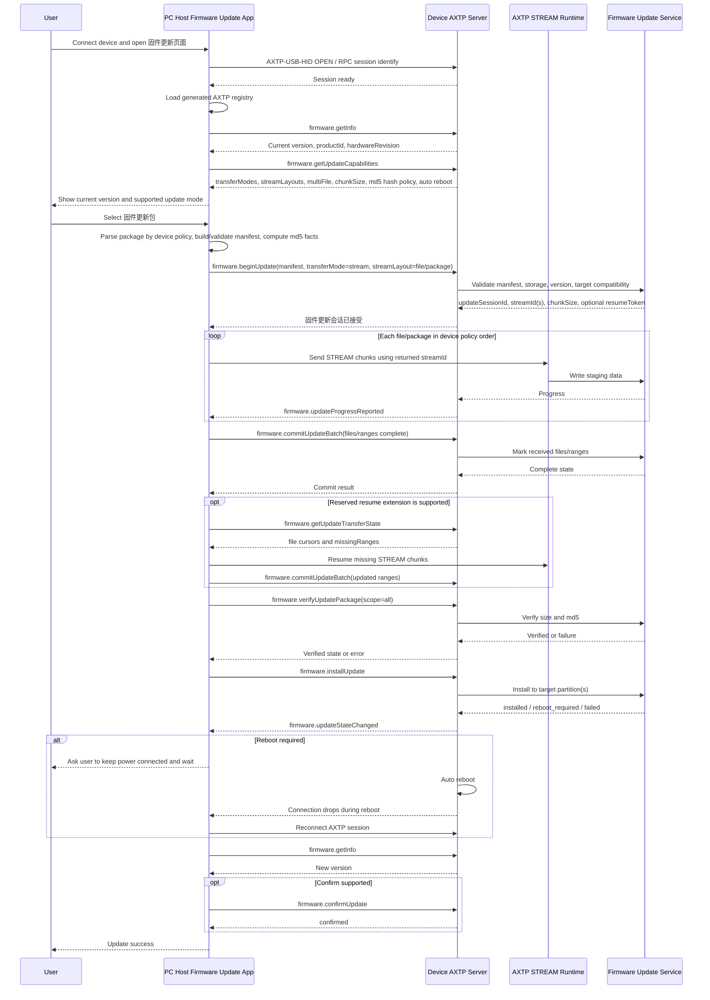

# Device Firmware Update Protocol Interaction Flow

> Status: flow design
> Scope: PC host updates a directly connected device through the generic `firmware.update` capability
> Source inputs: `docs/business/device-firmware-update.md`, `docs/protocol/firmware/firmware.update.md`, `docs/protocol/firmware/firmware.info.md`, `docs/legacy-migration/classification/firmware.md`
> Protocol lifecycle: Stage 10 `plan-protocol-flow`

本文根据“设备接到 PC 上位机后可以读取当前版本并执行固件更新，且需要从单个 `.bin` 扩展到多个 `.bin` 文件”的业务需求，梳理上位机、设备、固件升级服务和 AXTP 协议之间的交互流程。

本文不是最终协议事实源。当前 generated 协议只提供 AXTP Core、Standard Framed transport、STREAM 数据面和 firmware/stream 错误码；`firmware.getInfo`、`firmware.getUpdateCapabilities`、`firmware.beginUpdate`、`firmware.commitUpdateBatch`、`firmware.verifyUpdatePackage`、`firmware.installUpdate` 及固件更新事件仍是 `docs/protocol/firmware/**` 草案依赖。后续需要进入 Stage 20 `draft-business-protocol` 继续细化并采纳 `firmware.update` / `firmware.info`。

## 1. Story Summary

| Item | Content |
|---|---|
| User goal | 用户将设备连接到 PC 上位机，查看当前固件版本，选择或导入升级包，并完成可靠升级。 |
| Trigger | 上位机检测到设备接入，或用户打开固件升级页面并选择本地固件更新包。 |
| Success result | 设备确认包兼容、接收单文件或多文件固件、完成 md5 校验和安装；需要重启时设备自动重启，上位机重新连接后看到新版本。 |
| Primary actors | User, PC host firmware update app/service, Device AXTP server, firmware update service, AXTP STREAM runtime |
| Product scope | 通用 `firmware.update` 能力；优先覆盖 PC 本地上传固件更新，兼容单 `.bin`、多 `.bin` 和带 manifest 的整包。 |

## 2. Source Observations

### 2.1 UI / Prototype

| Screen or control | Observed behavior | Protocol relevance |
|---|---|---|
| Device connection entry | 设备接到 PC 后，上位机识别设备并建立会话。 | 使用 AXTP Standard Framed transport，典型路径是 `AXTP-USB-HID`；设备枚举本身也可能依赖 USB descriptor。 |
| Current version display | 上位机需要知道当前版本号信息。 | 草案依赖 `firmware.getInfo`；采纳前可继续使用旧业务协议或设备现有接口。 |
| Firmware package picker | 用户选择一个 `.bin`、多个 `.bin` 或一个包含 manifest 的包。 | 本地文件解析和 manifest 生成是上位机行为；协议只接收 manifest、hash、target 和文件集合。 |
| Start update button | 用户确认升级后，上位机开始固件更新。 | 草案依赖 `firmware.getUpdateCapabilities` 和 `firmware.beginUpdate`。 |
| Progress view | UI 展示整体进度、每个文件进度、当前阶段和失败原因。 | 草案依赖 `firmware.updateProgressReported`、`firmware.updateStateChanged`，并可用 `firmware.getUpdateState` 兜底轮询；`firmware.getUpdateTransferState` 作为续传预留。 |
| Cancel / retry | 接收或校验阶段允许取消；传输异常时首版可重试当前文件或重新开始。 | 草案依赖 `firmware.cancelUpdate`；断点续传、乱序补传和多文件并行只作为预留设计。 |
| Reboot / confirm prompt | 安装完成后设备自动重启，上位机提示保持供电并等待重连。 | 草案依赖 `firmware.installUpdate` response；不要求上位机调用 `system.reboot`。 |
| UI prototype image | `[REVIEW-ASK]` 本轮没有 UI 图；页面文案、按钮状态、失败提示和是否要求用户二次确认需产品/UI 确认。 | 不新增协议，只影响 App 流程和状态展示。 |

### 2.2 Requirement Notes

- 原始需求指出当前设备固件更新文件通常是一个完整 `.bin`，但需要支持多个 `.bin` 才能完成升级的场景。
- 本场景是设备直连 PC 上位机完成升级，默认不覆盖云端 URL 远程升级；URL 升级已有草案路径 `firmware.beginUpdate(source.type=url)`，可作为后续扩展。
- 上位机不能把“文件名列表”当成升级协议事实；多文件升级必须由 manifest 中的 `files[]`、`fileId`、`target`、`size`、`hash` 和安装策略表达。
- 多文件包可包含 bootloader、application、resource、model 或 vendor 等目标，但安装顺序由设备策略决定；上位机按设备策略解析多文件包，或按设备策略把多个包拆分/排序后下发。
- 本产品生产包不做签名，只使用 md5 做完整性校验；sha256 和签名字段可保留为协议扩展能力，不作为本流程 P0 要求。
- 安装后如需重启，由设备自动执行；上位机只负责提示保持供电、等待断连和重连后读取版本。
- 首版不要求断点续传、乱序补传或多文件并行传输；相关状态字段和方法只作为后续预留。
- `firmware.update` 草案明确 P0 推荐使用 `firmware.update` STREAM 数据面，`file.transfer` 暂存模式仅为 P1 扩展，且 file 域未定稿前不得作为稳定合同。
- Legacy 线索中 AXDP Alpha/Beta 升级、Rooms / Signage / VM33 远程升级和进度查询都被归类到 `firmware.update`；这些只能作为迁移证据，不能跳过草案采纳直接实现。

## 3. Assumptions And Non-Goals

| Type | Item | Status |
|---|---|---|
| Assumption | 上位机和设备通过 `AXTP-USB-HID` 建立 Standard Framed 会话，因此可以同时使用 RPC 和 STREAM。 | `[REVIEW-DRAFT]` |
| Assumption | PC 本地固件更新包可以由上位机解析出 manifest；如果包内没有 manifest，上位机需要按产品包规则生成 manifest。 | `[REVIEW-DRAFT]` |
| Assumption | 单 `.bin` 可表示为 `files[]` 中一个 `fileId=app` 或产品定义的目标文件；多 `.bin` 使用多个 `fileId` 分别描述。 | `[REVIEW-DRAFT]` |
| Assumption | 设备在安装前有 staging 区或 A/B 分区保护，校验失败不会覆盖当前可启动版本。 | `[REVIEW-DRAFT]` |
| Assumption | 多文件包可包含 bootloader、application、resource、model 或 vendor 等目标；安装顺序由设备策略决定，不由包内顺序作为唯一事实。 | `[REVIEW-OK]` |
| Assumption | 上位机按设备策略解析多文件包，或按设备策略将多个包拆分/排序后下发。 | `[REVIEW-OK]` |
| Assumption | 生产包不强制签名，本流程 P0 只使用 md5 做完整性校验。 | `[REVIEW-OK]` |
| Assumption | 安装后需要重启时由设备自动重启，上位机不调用 `system.reboot`。 | `[REVIEW-OK]` |
| Assumption | P0 不要求断点续传、乱序补传或多文件并行传输；相关设计仅作为协议预留。 | `[REVIEW-OK]` |
| Non-goal | 不设计固件包制作工具、发布后台、灰度策略或自动检查更新策略。 | `[REVIEW-OK]` |
| Non-goal | 不把 `firmware.updatePolicy` 混入本次手动升级流程。 | `[REVIEW-OK]` |
| Non-goal | 不把 STREAM ACK/window/header 字段重新定义在固件更新协议内。 | `[REVIEW-OK]` |
| Non-goal | 不在本阶段修改 `docs/protocol/**`、registry YAML、Protocol IR 或 generated 文件。 | `[REVIEW-OK]` |

## 4. Protocol Coverage

| Need | Coverage state | AXTP protocol | Evidence | Next action |
|---|---|---|---|---|
| 上位机与直连设备建立可传 RPC 和 STREAM 的会话 | Adopted/generated core | `AXTP-USB-HID`, Standard Framed, CONTROL/RPC/STREAM lifecycle | `docs/generated/protocol.md`, `protocol/axtp.protocol.yaml` | 可按 AXTP Core 实现连接和数据面。 |
| 识别设备型号、硬件版本或产品 ID | Non-protocol / Drafted only | USB descriptor, draft `device.info` / `firmware.getInfo` | `docs/protocol/device/device.info.md`, `docs/protocol/firmware/firmware.info.md` | USB 信息足够时不上协议；否则转 Stage 20 细化设备/固件信息草案。 |
| 查询当前固件版本 | Drafted only | `firmware.getInfo` | `docs/protocol/firmware/firmware.info.md`, `docs/protocol/firmware/firmware.update.md` | 转 Stage 20 细化并采纳 `firmware.info` 或确认 legacy 兼容接口。 |
| 查询是否支持固件更新、单/多文件、md5 校验和自动重启 | Drafted only | `firmware.getUpdateCapabilities`, `firmware.update` capability | `docs/protocol/firmware/firmware.update.md` | 转 Stage 20 细化并采纳 `firmware.update` capability schema；resume、missingRanges、parallel 仅作为扩展能力。 |
| 本地选择和解析固件更新包 | Non-protocol | Host 固件更新 app/service | `docs/business/device-firmware-update.md` | 上位机实现，不进入协议。 |
| 创建固件更新会话并传入 manifest | Drafted only | `firmware.beginUpdate` | `docs/protocol/firmware/firmware.update.md` | 转 Stage 20；重点确认 manifest、multi-file、streamLayout 和 idempotency 语义。 |
| 固件数据传输 | Partially adopted | Core `STREAM` is generated; `firmware.update` stream profile binding is draft-only | `docs/generated/protocol.md`, `docs/protocol/firmware/firmware.update.md`, `docs/protocol/stream/stream.flowControl.md` | 可复用 AXTP STREAM 数据面；`firmware.beginUpdate` 返回的 `streamId` / `fileId` 绑定需采纳。 |
| 提交单文件或多文件传输批次 | Drafted only | `firmware.commitUpdateBatch` | `docs/protocol/firmware/firmware.update.md` | 转 Stage 20；确认 `batchId`、`ranges[]`、`complete`、幂等和多文件 cursor。 |
| 查询/上报进度；预留断点续传和缺失范围 | Drafted only | `firmware.getUpdateState`, `firmware.updateProgressReported`, `firmware.updateStateChanged`; reserved `firmware.getUpdateTransferState` | `docs/protocol/firmware/firmware.update.md` | 转 Stage 20；P0 采用顺序传输和状态轮询兜底，resume/missingRanges 后续扩展。 |
| 校验包完整性和 md5 | Drafted only | `firmware.verifyUpdatePackage` | `docs/protocol/firmware/firmware.update.md` | 转 Stage 20；生产包不做签名，P0 用 md5 校验。 |
| 安装已校验固件更新 | Drafted only | `firmware.installUpdate` | `docs/protocol/firmware/firmware.update.md` | 转 Stage 20；确认 installMode、rebootPolicy、A/B 和不可取消阶段。 |
| 设备自动重启后确认新版本 | Drafted only | `firmware.installUpdate`, `firmware.getInfo`; optional `firmware.confirmUpdate` / `firmware.rollbackUpdate` reserved | `docs/protocol/firmware/firmware.update.md` | `firmware.update` 转 Stage 20；本流程不新增 Host 主动重启的 system action。 |
| 固件更新错误码 | Adopted/generated core errors and mixed draft status | Firmware and stream error codes such as `FW_HASH_MISMATCH`, `FW_STORAGE_NOT_ENOUGH`, `STREAM_OFFSET_INVALID` | `docs/generated/protocol.md`, `registry/error/error_code.yaml` | 研发可复用已生成错误码；草案方法需声明错误映射。 |

## 5. End-To-End Sequence



## 6. Interaction Steps

| Step | Actor | User or system action | Protocol call/event | Request / event payload notes | Response / state result | Error or fallback |
|---:|---|---|---|---|---|---|
| 1 | User / Host | 用户连接设备，上位机发现设备。 | Non-protocol / AXTP transport | USB descriptor 用于发现设备；AXTP Standard Framed path 使用 CONTROL OPEN/ACCEPT。 | 上位机建立 RPC 和 STREAM 可用会话。 | 未枚举到设备时提示连接异常；WebSocket JSON 不支持 STREAM，不适合作为本地上传 P0 路径。 |
| 2 | Host | 加载当前产品 generated registry。 | Generated registry lookup | 上位机检查当前包是否包含需要的正式方法。 | 当前 generated 不包含 firmware 业务方法，只能进入草案/legacy 兼容路径。 | 若产品固件仍使用旧协议，Host 走 adapter；若要求纯 AXTP，实现需等待 Stage 20/30/50。 |
| 3 | Host | 查询当前版本。 | Draft `firmware.getInfo` | 请求为空；返回 currentVersion、buildId、productId、hardwareRevision、partitionScheme 等。 | UI 展示当前版本和硬件信息。 | 草案未采纳前使用旧协议或设备现有接口；读取失败时禁止盲目升级。 |
| 4 | Host | 查询固件更新能力。 | Draft `firmware.getUpdateCapabilities` | 需要 transferModes、streamLayouts、supportsMultiFile、hashAlgorithms(md5)、requiresSignature=false、preferredChunkSize、autoReboot 等。 | Host 判断是否支持本地 STREAM 固件更新、多文件、md5 校验和设备自动重启策略。 | 不支持时隐藏升级入口或提示固件不支持；能力缺失时不要猜测 multi-file 支持。 |
| 5 | User / Host | 用户选择固件更新包。 | Non-protocol | 上位机检查扩展名、包格式、manifest、md5 和目标版本。 | 生成可传给 `beginUpdate` 的 manifest。 | 包缺失 manifest 且无法按产品规则生成时中止；版本降级需产品策略确认。 |
| 6 | Host | 单文件包转 manifest。 | Non-protocol | 例如一个 `app.bin` 映射为 `files[0].fileId=app`、`target=application`、`size`、`hash`。 | 后续流程仍按 multi-file 统一模型处理。 | 不允许只把文件名塞进 RPC；target 和 hash 必须明确。 |
| 7 | Host | 多文件包转 manifest。 | Non-protocol | 每个 `.bin` 独立 `fileId`，例如 bootloader、app、resource、model、vendor；安装顺序由设备策略决定。 | Host 得到文件集合、安装目标和 md5 校验信息，并按设备策略解析或拆分下发。 | 文件目标冲突、缺 required 文件或不符合设备策略时中止并提示包不完整。 |
| 8 | Host / Device | 创建固件更新会话。 | Draft `firmware.beginUpdate` | 传 `packageId`、`targetVersion`、`transferMode=stream`、`streamLayout=file` 或 `package`、manifest、policy、idempotencyKey。 | 返回 `updateSessionId`、`streamId` 或 `streams[]`、chunkSize、windowSize；`resumeToken` 仅为预留扩展。 | `FW_VERSION_UNSUPPORTED`、`FW_STORAGE_NOT_ENOUGH`、`FW_DEVICE_NOT_READY`、`BUSY` 等应直接显示可诊断原因。 |
| 9 | Host / Stream | 发送固件字节。 | Generated core STREAM + draft `firmware.update` profile binding | STREAM 包只包含 `streamId`、`seqId`、`cursor`、`payload`；业务字段来自 manifest 和 begin response。 | 设备写入 staging 区并更新接收进度。 | `STREAM_CRC_ERROR` / `STREAM_OFFSET_INVALID` 时首版重试当前 chunk/file 或重新开始；missingRanges 补发作为预留扩展。 |
| 10 | Device / Host | 展示进度。 | Draft `firmware.updateProgressReported`; optional `firmware.getUpdateTransferState` | 事件包含 overall progress 和 files[] 进度；未收到事件时 Host 可轮询。 | UI 展示 receiving/downloading/verifying/installing 等阶段。 | 事件丢失不得导致升级失败；以状态查询或 commit response 校正。 |
| 11 | Host / Device | 提交一个或多个文件/range。 | Draft `firmware.commitUpdateBatch` | `batchId` 在会话内唯一；files[] 标记 ranges 和 complete。 | 设备返回每个 file 的 receivedBytes、cursor 和 progress；missingRanges 仅为扩展字段。 | 同 batchId 重试需幂等；payload 不一致返回 `ALREADY_EXISTS` 或 `INVALID_ARGUMENT`。 |
| 12 | Host / Device | 预留断点续传或补缺失范围。 | Reserved draft `firmware.getUpdateTransferState` + STREAM | P0 不要求重连后续传、乱序补传或多文件并行；实现该扩展时再返回每个 file cursor/missingRanges。 | 不实现扩展时 Host 从失败文件或整个会话重新开始。 | 设备丢失临时状态时返回 `FW_TRANSFER_NOT_STARTED` 或 `NOT_FOUND`，Host 重新开始。 |
| 13 | Host / Device | 校验完整包。 | Draft `firmware.verifyUpdatePackage` | `scope=all`；设备校验 required 文件、package hash 和 md5。 | 状态进入 `verified`。 | `FW_SIZE_MISMATCH`、`FW_HASH_MISMATCH`、`FW_VERIFY_FAILED` 时不得安装；UI 指明失败文件。 |
| 14 | Host / Device | 安装固件更新。 | Draft `firmware.installUpdate` | 传 `installMode`、`rebootPolicy`；通常只能在 verified 后调用。 | 设备进入 `installing`、`installed` 或 `reboot_required`。 | `FW_APPLY_FAILED` 时保留旧版本可启动；安装不可取消阶段不应显示 cancel。 |
| 15 | Device / Host | 处理自动重启。 | Draft firmware response | `requiresReboot=true` 时设备自动重启，Host 提示保持供电并等待断连/重连。 | Host 等待设备断开并重新连接。 | 本流程不要求 system 主动重启方法；若设备未重启或重连超时，Host 展示可诊断失败。 |
| 16 | Host / Device | 重连后读取版本并确认。 | Draft `firmware.getInfo`, optional `firmware.confirmUpdate` | Host 读取 currentVersion；A/B 设备可调用 confirm。 | 新版本显示成功，状态进入 `confirmed`。 | 若新版本未启动或确认失败，支持 rollback 的设备走 `firmware.rollbackUpdate` 或自动回滚策略。 |

## 7. Protocol Details

### 7.1 Adopted / Generated Protocols

| Method/Event/Profile | Purpose in this flow | Source |
|---|---|---|
| `AXTP-USB-HID` | PC 上位机和直连设备之间的 Standard Framed transport，支持 CONTROL、RPC 和 STREAM。 | `docs/generated/protocol.md` |
| Core `STREAM` payload | 固件更新字节传输的数据面，使用 `streamId`、`seqId`、`cursor`、`payload`。 | `docs/generated/protocol.md`, `protocol/axtp.protocol.yaml` |
| Firmware error codes | 升级中复用 `FW_IMAGE_INVALID`、`FW_HASH_MISMATCH`、`FW_APPLY_FAILED`、`FW_STORAGE_NOT_ENOUGH` 等错误。 | `docs/generated/protocol.md`, `registry/error/error_code.yaml` |
| Stream error codes | 传输中复用 `STREAM_CRC_ERROR`、`STREAM_OFFSET_INVALID`、`STREAM_CHUNK_MISSING`、`STREAM_RESUME_FAILED` 等错误。 | `docs/generated/protocol.md`, `registry/error/error_code.yaml` |

当前 generated 协议没有 adopted `firmware.*` 业务方法，也没有可直接消费的 `firmware.update` method/event registry。因此下面的方法名只能作为草案依赖引用，不能作为实现合同。

### 7.2 Draft Protocol Dependencies

| Draft method/event | Purpose in this flow | Source |
|---|---|---|
| `firmware.getInfo` | 读取当前固件版本、硬件版本、分区状态和上次升级状态。 | `docs/protocol/firmware/firmware.info.md`, `docs/protocol/firmware/firmware.update.md` |
| `firmware.getUpdateCapabilities` | 查询本设备是否支持 stream 固件更新、多文件、md5 校验、自动重启，以及可选的断点续传、回滚和确认。 | `docs/protocol/firmware/firmware.update.md` |
| `firmware.beginUpdate` | 创建固件更新会话、校验 manifest、协商 `firmware.update` STREAM 和 `streamId` / `fileId` 绑定。 | `docs/protocol/firmware/firmware.update.md` |
| `firmware.commitUpdateBatch` | 提交已接收的文件或 range，支持单文件和多文件顺序传输；断点续传为预留扩展。 | `docs/protocol/firmware/firmware.update.md` |
| `firmware.getUpdateTransferState` | 预留查询每个文件的 cursor、missingRanges 和 resumeToken，用于后续断点续传扩展。 | `docs/protocol/firmware/firmware.update.md` |
| `firmware.getUpdateState` | 查询固件更新会话整体状态、阶段、进度和 lastError。 | `docs/protocol/firmware/firmware.update.md` |
| `firmware.verifyUpdatePackage` | 安装前校验大小、文件 md5 和整包 md5。 | `docs/protocol/firmware/firmware.update.md` |
| `firmware.installUpdate` | 安装已校验的固件更新包，并返回是否由设备自动重启。 | `docs/protocol/firmware/firmware.update.md` |
| `firmware.cancelUpdate` | 在 receiving、batch_committed、verifying、verified 等可取消阶段取消升级并清理临时文件。 | `docs/protocol/firmware/firmware.update.md` |
| `firmware.confirmUpdate` | A/B 或支持自动回滚设备在新版本启动后确认成功。 | `docs/protocol/firmware/firmware.update.md` |
| `firmware.rollbackUpdate` | 在支持 rollback 的设备上回滚到上一个可用版本。 | `docs/protocol/firmware/firmware.update.md` |
| `firmware.updateProgressReported` | 周期性上报接收、校验、安装等进度。 | `docs/protocol/firmware/firmware.update.md` |
| `firmware.updateStateChanged` | 状态变化和失败阶段上报。 | `docs/protocol/firmware/firmware.update.md` |
| `firmware.updateResultReported` | 可选最终成功、失败、取消或回滚结果。 | `docs/protocol/firmware/firmware.update.md` |

### 7.3 Package And Manifest Handling

单 `.bin` 和多 `.bin` 不应走两套协议。Host 应统一生成 manifest：

```json
{
  "schemaVersion": 1,
  "packageId": "pkg_2026_0605_001",
  "targetVersion": "2.3.0",
  "files": [
    {
      "fileId": "app",
      "target": "application",
      "name": "app.bin",
      "size": 8388608,
      "required": true,
      "hash": {
        "algorithm": "md5",
        "value": "d41d8cd98f00b204e9800998ecf8427e"
      }
    },
    {
      "fileId": "resource",
      "target": "resource",
      "name": "resource.bin",
      "size": 5242880,
      "required": false,
      "hash": {
        "algorithm": "md5",
        "value": "d41d8cd98f00b204e9800998ecf8427e"
      }
    }
  ]
}
```

Flow rules:

- 单 `.bin` 是 `files[]` 长度为 1 的特例，不应使用旧 `firmware.begin/end/verify/apply` 名称新开分支。
- 多 `.bin` 必须以 `fileId` 区分接收进度、hash、缺失范围和安装目标。
- 多 `.bin` 的安装顺序由设备策略决定；manifest 可以表达目标和 required 状态，但不把文件顺序作为安装顺序事实。
- 如果产品已有一个整包格式，可使用 `streamLayout=package`，通过 manifest 中的 offset/size 说明每个文件归属。
- 如果每个文件单独传输，推荐 `streamLayout=file`，由 `beginUpdate` response 返回 `streams[]` 中 `fileId` 到 `streamId` 的绑定。
- Manifest 校验失败时，设备必须拒绝 `beginUpdate`，不得创建可安装会话。

### 7.4 Error And Recovery Strategy

| Situation | Expected behavior |
|---|---|
| Device does not support firmware.update | Host 在 capability 阶段阻止升级，提示固件或设备不支持。 |
| Unsupported target version or hardware revision | `beginUpdate` 拒绝，UI 显示版本/硬件不兼容。 |
| Insufficient storage or unsafe device state | `beginUpdate` 或 `installUpdate` 返回 `FW_STORAGE_NOT_ENOUGH` / `FW_DEVICE_NOT_READY`，UI 提供可执行修复建议。 |
| Stream interruption | P0 可重试当前 chunk/file 或重新开始；`getUpdateTransferState`、cursor/missingRanges 续传作为预留扩展。 |
| MD5 mismatch | `verifyUpdatePackage` 失败，设备不得安装，Host 显示失败文件和 md5 校验结果。 |
| Install failure | 设备保持旧版本可启动或进入可诊断失败状态；Host 不得误报成功。 |
| Reboot required | Host 等待设备重连，读取新版本，再执行 confirm 或展示成功。 |
| User cancel | 在可取消阶段调用 `cancelUpdate`；进入写 bootloader / switching slot 等不可中断阶段后禁用取消入口。 |

### 7.5 Draft Or Missing Protocol Gaps

| Gap | Candidate domain.feature | Candidate method/event/schema | Routed skill | Review question |
|---|---|---|---|---|
| 当前版本查询尚未进入 generated。 | `firmware.info` | `firmware.getInfo`, `firmware.infoChanged` | `docs/dev/skills/20-draft-business-protocol/SKILL.md` | `[REVIEW-ASK]` 版本信息是否只归 `firmware.info`，还是需要与 `device.info` 明确边界？ |
| 固件更新业务方法和事件尚未采纳。 | `firmware.update` | `getUpdateCapabilities`, `beginUpdate`, `commitUpdateBatch`, `verifyUpdatePackage`, `installUpdate`, state/progress/result events | `docs/dev/skills/20-draft-business-protocol/SKILL.md` | `[REVIEW-OK]` P0 包含多文件顺序传输、md5 校验和设备自动重启；resume、parallel、confirm、rollback 分层预留。 |
| 多 `.bin` 包的设备策略和 manifest 来源需要协议化。 | `firmware.update` | `FirmwareUpdateManifest`, `files[]`, target enum, device policy version | `docs/dev/skills/20-draft-business-protocol/SKILL.md` | `[REVIEW-OK]` 安装顺序由设备策略决定；`[REVIEW-ASK]` 设备策略如何版本化并暴露给 Host？ |
| Host 主动触发系统重启不进入本流程。 | `firmware.update` | `installUpdate.requiresReboot`, auto reboot state/event | `docs/dev/skills/20-draft-business-protocol/SKILL.md` | `[REVIEW-OK]` 安装后由设备自动重启，不新增 `system.reboot` 依赖。 |
| `file.transfer` 暂存模式不能作为 P0。 | `file.transfer` | `file.beginUpload`, `file.completeUpload` | `docs/dev/skills/20-draft-business-protocol/SKILL.md` only for P1 file staging | `[REVIEW-ASK]` 目标设备是否必须先暂存到文件系统，还是可直接使用 `firmware.update` STREAM 写 staging？ |
| Legacy AXDP `CommonSet/GetNoTargetStrategyState` 曾被自动分类到 firmware，但 firmware.update 草案已排除。 | TBD, likely not firmware | 无固件更新接口 | Separate legacy cleanup / draft workflow | `[REVIEW-ASK]` 该旧命令真实语义是否属于 video framing、audio algorithm、misc/vendor 或其他域？ |

## 8. Test Fixtures

| Fixture | Expected result |
|---|---|
| `firmware-update-single-bin-happy-path` | Host 读取当前版本，生成单文件 manifest，完成 stream upload、commit、verify、install，重连后版本更新。 |
| `firmware-update-multi-bin-file-layout` | Host 上传 app/resource/bootloader 等多个 fileId；每个文件独立进度、cursor、hash 和 complete 状态。 |
| `firmware-update-package-layout` | Host 发送一个整包 blob；manifest 用 package offset/size 说明内部文件，设备按 manifest 切分并校验。 |
| `firmware-update-unsupported-device` | 设备不支持 `firmware.update` 或 generated registry 缺方法时，Host 不进入升级流程。 |
| `firmware-update-version-incompatible` | 目标版本过旧、不匹配 hardwareRevision 或被 anti-rollback 拒绝时，`beginUpdate` 失败且不创建会话。 |
| `firmware-update-insufficient-storage` | staging 空间不足时返回可诊断错误，不开始传输。 |
| `firmware-update-stream-interrupt-restart` | P0 传输中断后，Host 重试当前 chunk/file 或重新开始；resume/missingRanges 用扩展 fixture 覆盖。 |
| `firmware-update-md5-mismatch` | `verifyUpdatePackage` 返回 md5 校验失败，设备不安装，UI 显示失败文件。 |
| `firmware-update-install-failed-safe` | 安装失败时设备仍可启动旧版本，并通过 state/error 说明失败阶段。 |
| `firmware-update-auto-reboot` | `installUpdate` 返回 `requiresReboot=true` 后设备自动重启，Host 等待重连并读取新版本。 |
| `firmware-update-cancel-receiving` | receiving 阶段用户取消，设备清理临时文件并进入 cancelled。 |
| `firmware-update-no-stream-transport` | WebSocket JSON 或不支持 STREAM 的 transport 不允许走本地上传 P0；可提示使用 URL 模式或 USB/TCP。 |

## 9. Acceptance Gates

- Host 在显示升级入口前能够识别设备并读取当前版本；如果 `firmware.getInfo` 未采纳，必须有明确 legacy adapter。
- Host 不根据文件数量硬编码协议分支；单文件和多文件都通过 manifest 驱动。
- Host 在 `beginUpdate` 前校验 package 基本结构、目标版本、文件大小和 md5 元数据。
- `beginUpdate` 成功后，固件字节只通过 AXTP STREAM 发送；STREAM 包内不重复携带 `fileId`、`hash`、`target` 等业务字段。
- 多文件固件更新的进度和完成状态按 `fileId` 独立维护；缺失范围和断点续传为预留扩展。
- 所有 required 文件 complete 后才允许 `verifyUpdatePackage`；校验成功后才允许 `installUpdate`。
- UI 覆盖 unsupported、version incompatible、storage not enough、device not ready、stream interruption、md5 mismatch、install failed、auto reboot required 和 cancel。
- 当前流程文档只修改 `docs/flows/**`；registry、Protocol IR 和 generated 文件必须保持不变。
- 所有 draft-only protocol gaps 都有 Stage 20 后续路径。

## 10. Resolved Review Decisions

- `[REVIEW-OK]` 多文件包可包含 bootloader、application、resource、model 或 vendor 等目标；安装顺序由设备策略决定。
- `[REVIEW-OK]` 上位机按设备策略解析多文件包，或按设备策略将多个包拆分/排序后下发。
- `[REVIEW-OK]` 生产包不强制签名，本流程 P0 只使用 md5 做完整性校验。
- `[REVIEW-OK]` 安装后需要重启时由设备自动重启，上位机不调用 `system.reboot`。
- `[REVIEW-OK]` P0 不要求断点续传、乱序补传或多文件并行传输；相关字段和方法保留为后续扩展。

## 11. Open Questions

- `[REVIEW-ASK]` 单 `.bin` 的默认 target 是 `application`，还是需要按文件头、包规则或用户选择确定？
- `[REVIEW-ASK]` 设备策略如何版本化并暴露给 Host，避免上位机解析策略和设备真实策略不一致？
- `[REVIEW-ASK]` 固件更新包 manifest 是包内固定文件、上位机根据发布元数据生成，还是设备解析 vendor package 后生成？
- `[REVIEW-ASK]` A/B 设备是否要求 Host 调用 `firmware.confirmUpdate`，还是设备自确认？
- `[REVIEW-ASK]` 升级过程中是否要求电量、温度、供电、空间等 preflight 检查字段返回给 UI？
- `[REVIEW-ASK]` 是否需要保留 URL 远程升级作为同一页面的扩展入口，还是本流程只覆盖 PC 本地上传？
- `[REVIEW-ASK]` `firmware.info` 和 `device.info` 的版本字段边界如何划分，避免 App 同时读两处产生冲突？
