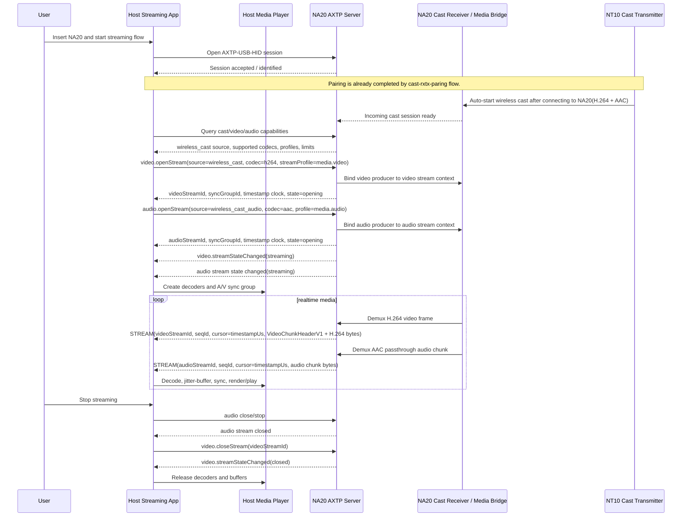

# NA20/NT10 Device Streaming Audio And Video Protocol Interaction Flow

> Status: flow design
> Scope: NA20 receiver USB-HID media bridge, NT10 wireless transmitter, and host-side audio/video playback
> Source inputs: `docs/business/device-streaming.md`, `docs/flows/cast-rxtx-paring.md`, `docs/protocol/video/video.stream.md`, `docs/protocol/stream/stream.flowControl.md`, `docs/protocol/audio/audio.stream.md`
> Protocol lifecycle: Stage 10 `plan-protocol-flow`

本文根据 NA20/NT10 投屏设备业务需求，先输出音频和视频的交互流程方案。当前 `docs/business/device-streaming.md` 只描述了目标和边界，尚未包含可读取的业务流程图或详细 story；因此本文以配对流程为前置条件，并根据现有 `stream` / `video.stream` / `audio` 草案推导投屏阶段的协议交互。

本文不是最终协议事实源。当前 generated 协议只采纳了 AXTP core、STREAM 数据面和 `audio.algorithm`；视频流、音频实时媒体流、投屏会话状态仍需要后续 Stage 20 `draft-business-protocol` 细化和采纳。

## 1. Story Summary

| Item | Content |
|---|---|
| User goal | 用户将 NA20 作为投屏接收端接入上位机，将 NT10 作为投屏发射端接入源端；开始投屏后，上位机能从 NA20 的 USB HID 通道同时接收并播放来自 NT10 的 H.264 视频和 AAC 透传音频。 |
| Trigger | NA20/NT10 已完成配对，NT10 接入 NA20 后自动开始无线投屏推流；Host 发现 NA20 的 `wireless_cast` source 后打开音视频 STREAM。 |
| Success result | NT10 通过 Wi-Fi 将音视频推到 NA20；NA20 将视频和音频分成独立 AXTP STREAM 传给上位机；上位机完成解码、同步和播放。 |
| Primary actors | User, host streaming app/service, NA20 AXTP server, NA20 cast receiver/media bridge, NT10 cast transmitter, host media player |
| Product scope | NA20 receiver AP + USB HID media bridge；NT10 Wi-Fi STA transmitter；上位机播放软件。 |

## 2. Source Observations

### 2.1 UI / Prototype

| Screen or control | Observed behavior | Protocol relevance |
|---|---|---|
| USB 插入行为 | 用户将 NA20 插到上位机，作为投屏接收设备。 | 上位机需要建立到 NA20 的 `AXTP-USB-HID` 会话。 |
| NT10 发射端 | 用户将 NT10 插到源端 PC，作为投屏发射端。 | NT10 接入 NA20 后自动开始向 NA20 推送无线投屏媒体流；NT10 到 NA20 的内部控制仍由设备实现决定。 |
| 开始投屏 | NT10 接入 NA20 后自动开始无线推流；Host 不需要先发“开始投屏”命令才能让 NT10 推流。 | Host 侧流程从发现 `wireless_cast` source、查询能力并打开 video/audio stream 开始；可选 source proxy control 不作为 MVP 前置条件。 |
| 上位机播放 | NA20 通过 USB HID 将音视频数据给上位机，由上位机在合适时机播放。 | 需要 NA20 暴露视频 streamId、音频 streamId、时间戳/同步组和运行状态。 |
| 业务流程图 | 当前文件未包含实际流程图。 | 本文使用 `[REVIEW-ASK]` 标出仍需产品确认的触发、停止、AAC transportFormat 和断连细节。 |

### 2.2 Requirement Notes

- NA20 是投屏接收端，同时是 Wi-Fi AP 端点和 USB HID 设备。
- NT10 是投屏发射端，作为 Wi-Fi STA 连接 NA20，向 NA20 推送 H.264 + AAC 音视频流。
- NA20 不在本流程中本地播放；它作为媒体桥，将收到的音视频经 USB HID 给上位机。
- 视频优先按 `video.stream` 草案建模，数据面走 AXTP `PayloadType = STREAM`。
- 音频采用 AAC 透传方案，通过 `audio.stream` 建模；不采用 NA20 解码 PCM 后再给上位机作为本场景 MVP。
- 上位机 MVP 同时从 NA20 接收视频和音频；不按 audio-only 范围设计。

## 3. Assumptions And Non-Goals

| Type | Item | Status |
|---|---|---|
| Assumption | NA20/NT10 配对流程已经完成，NT10 已可连接 NA20 AP；配对详见 `docs/flows/cast-rxtx-paring.md`。 | `[REVIEW-DRAFT]` |
| Assumption | 上位机至少与 NA20 建立一条 AXTP-over-USB-HID 会话；主流程不要求 Host 直接控制 NT10 开始推流。 | `[REVIEW-DRAFT]` |
| Assumption | NA20 将音频和视频拆成两个独立 `streamId`，通过同一 AXTP session 多路复用。 | `[REVIEW-DRAFT]` |
| Assumption | 音视频同步通过共同的 `castSessionId` / `syncGroupId` 完成；播放主时间轴使用 NT10 源媒体 `timestampUs`，NA20 接收时钟用于 jitter/诊断。 | `[REVIEW-OK]` |
| Assumption | 实时投屏低延迟优先，视频丢包优先请求关键帧，音频丢包优先丢弃过旧 chunk，不默认重传历史媒体数据。 | `[REVIEW-DRAFT]` |
| Decision | NA20 到上位机的音频格式采用 AAC 透传方案；AAC 具体封装如 ADTS/LATM/raw AAC 由 `audio.stream` 草案继续确认。 | `[REVIEW-OK]` |
| Decision | 上位机 MVP 需要同时从 NA20 接收视频和音频。 | `[REVIEW-OK]` |
| Decision | NA20 到上位机的视频 H.264 使用 Annex-B，SPS/PPS 随关键帧发送。 | `[REVIEW-OK]` |
| Decision | 开始投屏由 NT10 接入 NA20 后自动触发，NA20 检测到无线投屏媒体源后向 Host 暴露 `wireless_cast` 能力和状态。 | `[REVIEW-OK]` |
| Decision | NT10 开始/停止无线推流可以做成可选 AXTP source proxy 控制，由 Host 通过 NA20 触发；NA20 与 NT10 之间实现看设备。 | `[REVIEW-OK]` |
| Non-goal | 不设计 NT10 到 NA20 的私有 Wi-Fi 媒体协议、无线丢包恢复或 Wi-Fi 加密细节。 | `[REVIEW-OK]` |
| Non-goal | 不设计设备升级、AP/Wi-Fi 配对、UI 文案或上位机播放器内部渲染实现。 | `[REVIEW-OK]` |
| Non-goal | 不把 H.264/AAC 大数据塞进普通 RPC response；媒体数据必须走 STREAM 数据面。 | `[REVIEW-OK]` |

## 4. Protocol Coverage

| Need | Coverage state | AXTP protocol | Evidence | Next action |
|---|---|---|---|---|
| 上位机与 NA20 建立 USB HID 会话 | Adopted/generated core | `AXTP-USB-HID`, `PayloadType = RPC/STREAM` | `docs/generated/protocol.md`, `docs/specs/1-core/07-Stream-Data-Plane.md` | 可按 AXTP core 实现。 |
| 通过 USB HID 承载连续音视频数据 | Adopted/generated core | STREAM 16B header: `streamId`, `seqId`, `cursor` | `docs/generated/protocol.md`, `docs/specs/1-core/07-Stream-Data-Plane.md` | 可作为数据面基础。 |
| 查询 NA20 是否有投屏输入源和媒体桥能力 | Drafted only | `video.stream` source `wireless_cast`, optional `video.*StreamSource` proxy control | `docs/business/device-streaming.md`, `docs/protocol/video/video.stream.md` | 不新增独立 `cast.streaming`；通过 video/audio state 聚合投屏会话。 |
| 打开 H.264 视频到上位机 | Drafted only | `video.getStreamCapabilities`, `video.openStream`, `video.closeStream`, `video.streamStateChanged` | `docs/protocol/video/video.stream.md` | 转 Stage 20 采纳 `video.stream` 或按本场景补齐 source/sync 字段。 |
| 视频数据分片、帧边界、关键帧和丢包重同步 | Drafted only | `VideoChunkHeaderV1`, `video.requestKeyFrame`, `media.video` profile | `docs/protocol/video/video.stream.md` | H.264 已确认 Annex-B，SPS/PPS 随关键帧；采纳时固化。 |
| 打开 AAC 透传音频到上位机 | Drafted only | Candidate `audio.stream`, `audio.openStream`, `audio.closeStream`, `audio.streamStateChanged` | `docs/protocol/audio/audio.stream.md`, `docs/protocol/stream/stream.flowControl.md` | Stage 20 已起草；采纳前确认 AAC transportFormat。 |
| 音频数据分片、采样时间戳和丢包统计 | Drafted only | `media.audio` / `realtime_audio` stream profile, candidate `AudioChunkHeaderV1` | `docs/protocol/audio/audio.stream.md`, `docs/protocol/stream/stream.flowControl.md` | Stage 20 已起草；确认 AAC frame/chunk envelope。 |
| 音视频同步 | Drafted only | `syncGroupId`, `castSessionId`, `clockDomain`, `receiverClockDomain`, `timestampUs` fields | `docs/protocol/video/video.stream.md`, `docs/protocol/audio/audio.stream.md` | 采纳时统一 video/audio schema。 |
| 查询/订阅整体投屏状态 | Non-protocol / Drafted only | Host 聚合 `video.streamStateChanged` + `audio.streamStateChanged`，可选 `video.streamSourceStateChanged` | `docs/protocol/video/video.stream.md`, `docs/protocol/audio/audio.stream.md` | 不新增 `cast.streaming`。 |
| 上位机本地解码、jitter buffer、A/V sync 和播放 | Non-protocol | Host media player/runtime | 业务实现 | 不进入协议；测试验收需覆盖。 |

## 5. End-To-End Sequence



## 6. Audio And Video Interaction Plan

### 6.1 视频交互流程

| Step | Actor | Action | Protocol call/event | Payload notes | Result | Error or fallback |
|---:|---|---|---|---|---|---|
| 1 | Host | 建立到 NA20 的控制和数据会话。 | `AXTP-USB-HID` | Standard Framed，支持 RPC 和 STREAM。 | Host 可调用 NA20 RPC 并接收 STREAM。 | HID 打开失败则提示 NA20 未连接或被占用。 |
| 2 | Host | 查询视频能力和无线投屏源。 | Draft `video.getStreamCapabilities` | 期望 `sources[]` 包含 `wireless_cast`，`codecs` 包含 `h264`。 | Host 知道分辨率、帧率、码率、chunkSize、并发限制。 | source 不存在时等待 NT10 开始推流或提示未检测到投屏源。 |
| 3 | Host | 打开视频流。 | Draft `video.openStream` | `source=wireless_cast`, `codec=h264`, `streamProfile=media.video`, optional `syncGroupId`。 | NA20 返回 `videoStreamId`、`cursorUnit=timestampUs`、`state=opening`。 | codec/resolution 不支持时按能力重试或降级。 |
| 4 | NA20 | 启动媒体桥输出。 | `video.streamStateChanged` | `state=streaming`, codec/resolution/frameRate, optional `syncGroupId`。 | Host 创建 H.264 decoder。 | 启动失败返回 `MEDIA_STREAM_START_FAILED`。 |
| 5 | NA20 | 发送视频数据。 | `PayloadType=STREAM` | 16B STREAM header + `VideoChunkHeaderV1` + H.264 bytes；同一帧多个 chunk 共享 timestamp/cursor。 | Host 按 `seqId` 检测丢包，按 frame header 重组帧。 | 缺 chunk 或解码失败时调用 `video.requestKeyFrame`。 |
| 6 | Host/NA20 | 统计和状态同步。 | `video.streamStatsReported`, `video.getStreamState` | framesSent、droppedFrames、bitrateKbps、nextSeqId、cursor。 | Host 展示诊断或调整 buffer。 | 事件缺失时可低频轮询 state。 |
| 7 | Host | 正常停止视频。 | `video.closeStream` | `streamId=videoStreamId`, optional `drain=true`。 | NA20 停止视频 producer 并释放 stream context。 | 异常释放使用 `stream.abort`，但不作为正常关闭入口。 |

### 6.2 音频交互流程

| Step | Actor | Action | Protocol call/event | Payload notes | Result | Error or fallback |
|---:|---|---|---|---|---|---|
| 1 | Host | 查询音频实时输出能力。 | Draft `audio.getStreamCapabilities` | 需要确认 `source=wireless_cast_audio`、`codec=aac`、`format=aac`、`streamProfile=media.audio`；AAC 具体 `transportFormat` 待协议草案确认。 | Host 知道 sampleRate、channels、codec/format、chunkDurationMs。 | 不支持 AAC 透传时，本场景 MVP 不应误报 AV 可用。 |
| 2 | Host | 打开音频流。 | Draft `audio.openStream` | AAC 透传：`codec=aac`, `format=aac`, `transportFormat` 使用能力声明的 ADTS/LATM/raw AAC 实际封装，`cursorUnit=timestampUs`。 | NA20 返回 `audioStreamId`、`syncGroupId`、NT10 媒体时钟和 NA20 接收时钟信息。 | 音频能力缺失时应判定 AV 投屏不可完整开始，除非产品另行定义 video-only 降级。 |
| 3 | NA20 | 音频进入 streaming 状态。 | Draft `audio.streamStateChanged` | `state=streaming`, source, codec=aac, format=aac, sampleRate, channels。 | Host 创建 AAC decoder/playback pipeline。 | 启动失败需区分 source 不可用、codec 不支持、音频设备忙。 |
| 4 | NA20 | 发送音频数据。 | `PayloadType=STREAM` | 16B STREAM header + `AudioChunkHeaderV1` + AAC access unit / ADTS / LATM / raw AAC bytes。 | Host 按 timestamp/sampleIndex 放入音频 jitter buffer。 | 实时音频不建议补太旧数据；缺包可静音补偿或丢弃。 |
| 5 | Host/Player | 音频与视频同步播放。 | Non-protocol runtime using stream metadata | 使用共同 `syncGroupId`，以 NT10 源媒体 `cursor/timestampUs` 做播放同步，以 NA20 接收时钟做 jitter/诊断。 | Player 做 A/V sync、缓冲控制和漂移修正。 | 缺少源媒体时间戳或接收时钟时，需要 NA20 提供 clock mapping 或同步基准。 |
| 6 | Host | 正常停止音频。 | Draft `audio.closeStream` | `streamId=audioStreamId`。 | NA20 停止音频 producer 并释放 stream context。 | 异常释放使用 `stream.abort`，同时上报音频状态失败。 |

### 6.3 同步和启动顺序

| Decision | Recommendation | Reason |
|---|---|---|
| 先开视频还是音频 | Host 先查询能力，再打开 video 和 audio；若都成功，等两个 `state=streaming` 或首包到达后交给播放器同步。 | 避免单路提前播放造成首帧无声或黑屏。 |
| streamId 数量 | 视频和音频分别使用独立 `streamId`。 | 便于不同 profile、seqId、丢包策略和关闭生命周期。 |
| 同步标识 | 两个 open response 和状态事件都返回同一个 `syncGroupId` 或 `castSessionId`。 | Host 能把两路 stream 绑定成同一投屏会话。 |
| cursorUnit | 投屏视频和 AAC 透传音频均推荐 `timestampUs`，绑定 NT10 源媒体时钟；NA20 接收时钟通过 `receiverClockDomain` / `receiverTimestampUs` 暴露。 | 直接支持 A/V sync、jitter 估计和漂移校正。 |
| 背压策略 | 视频 `drop_old_frames` + request key frame；音频 `drop_old_chunks` 或静音补偿。 | 投屏低延迟优先，不应堆积过期媒体。 |

## 7. Protocol Details

### 7.1 Adopted / Generated Protocols

| Method/Event/Profile | Purpose in this flow | Source |
|---|---|---|
| `AXTP-USB-HID` | 上位机通过 USB HID 与 NA20 建立 AXTP Standard Framed 会话。 | `docs/generated/protocol.md` |
| `PayloadType = STREAM` | 承载视频和音频连续数据。 | `docs/generated/protocol.md`, `docs/specs/1-core/07-Stream-Data-Plane.md` |
| STREAM 16B header | 每个媒体 chunk 使用 `streamId`, `seqId`, `cursor`。 | `docs/specs/1-core/07-Stream-Data-Plane.md` |
| STREAM error codes | `STREAM_NOT_FOUND`, `STREAM_TIMEOUT`, `STREAM_PAYLOAD_INVALID`, `STREAM_CHUNK_MISSING`, `STREAM_CLOSED` 等错误可复用。 | `docs/generated/protocol.md` |

### 7.2 Draft Dependencies

| Draft method/event | Purpose in this flow | Source |
|---|---|---|
| `video.getStreamCapabilities` | 查询 NA20 可输出的视频源、H.264 能力和 stream 限制。 | `docs/protocol/video/video.stream.md` |
| `video.openStream` | 打开 NA20 到上位机的视频 STREAM 并返回 `videoStreamId`。 | `docs/protocol/video/video.stream.md` |
| `video.closeStream` | 正常关闭视频业务流。 | `docs/protocol/video/video.stream.md` |
| `video.getStreamState` | 查询视频业务流状态和统计。 | `docs/protocol/video/video.stream.md` |
| `video.requestKeyFrame` | 视频丢包或解码失败后重同步。 | `docs/protocol/video/video.stream.md` |
| `video.streamStateChanged` / `video.streamStatsReported` | 视频状态和统计事件。 | `docs/protocol/video/video.stream.md` |
| `stream.flowControl` concepts | 定义实时音视频 profile、ack/window/pause/resume/abort 的边界。 | `docs/protocol/stream/stream.flowControl.md` |
| `audio.getStreamCapabilities` / `audio.openStream` / `audio.closeStream` / `audio.streamStateChanged` | 打开和管理 NA20 到上位机的 AAC 透传实时音频 STREAM。 | `docs/protocol/audio/audio.stream.md` |

### 7.3 Candidate Video Open Payload

候选语义如下，字段名和类型不得视为 adopted 协议：

```json
{
  "method": "video.openStream",
  "params": {
    "source": "wireless_cast",
    "codec": "h264",
    "width": 1920,
    "height": 1080,
    "frameRate": 30,
    "bitrateKbps": 4096,
    "chunkSizeHint": 65536,
    "streamProfile": "media.video",
    "syncGroupId": "cast_001"
  }
}
```

返回：

```json
{
  "result": {
    "streamId": 101,
    "state": "opening",
    "streamProfile": "media.video",
    "source": "wireless_cast",
    "codec": "h264",
    "cursorUnit": "timestampUs",
    "syncGroupId": "cast_001",
    "clockDomain": "nt10_media_clock",
    "receiverClockDomain": "na20_receive_clock",
    "chunkSize": 65536,
    "nextSeqId": 0,
    "nextFrameId": 0
  }
}
```

### 7.4 Candidate Audio Open Payload

AAC 透传候选如下；`transportFormat=adts` 只是示例值，采纳前仍需确认实际默认封装是 ADTS、LATM、raw AAC 之一还是多种都支持：

```json
{
  "method": "audio.openStream",
  "params": {
    "source": "wireless_cast_audio",
    "codec": "aac",
    "transportFormat": "adts",
    "sampleRate": 48000,
    "channels": 2,
    "chunkDurationMs": 20,
    "streamProfile": "media.audio",
    "cursorUnit": "timestampUs",
    "syncGroupId": "cast_001"
  }
}
```

### 7.5 STREAM Payload Rules

| Field | Video rule | Audio rule |
|---|---|---|
| `streamId` | `video.openStream` 分配。 | `audio.openStream` 或替代音频建流方法分配。 |
| `seqId` | 每个 video stream 从 0 递增，用于 chunk 丢失检测。 | 每个 audio stream 从 0 递增，用于 chunk 丢失和统计。 |
| `cursor` | 推荐 `timestampUs`；同一视频帧多个 chunk 共享同一 cursor。 | 投屏 AAC 推荐 `timestampUs`，绑定 NT10 源媒体时钟；`sampleIndex` 可保留给其他音频 source。 |
| data | `VideoChunkHeaderV1 + H.264 bytes`。 | `AudioChunkHeaderV1 + AAC passthrough bytes`；具体 AAC transportFormat 待 Stage 20 确认。 |
| recovery | `video.requestKeyFrame`。 | 实时音频丢包不补旧包，Host 做静音补偿或丢弃。 |

### 7.6 Draft Or Missing Protocol Gaps

| Gap | Candidate domain.feature | Candidate method/event/schema | Routed skill | Review question |
|---|---|---|---|---|
| 整体投屏会话状态不新建独立 domain。 | None | Host 聚合 video/audio state；`castSessionId` 仅作为透明关联字段。 | Runtime/App implementation | `[REVIEW-OK]` 不治理独立 `cast.streaming`。 |
| `video.stream` 尚未采纳到 generated。 | `video.stream` | `video.getStreamCapabilities`, `video.openStream`, `video.closeStream`, `video.requestKeyFrame`, events, optional source proxy control | `docs/dev/skills/30-adopt-protocol-draft/SKILL.md` after review | `[REVIEW-DRAFT]` `wireless_cast` source、H.264 Annex-B、SPS/PPS 随关键帧和同步字段已在草案中补齐。 |
| 投屏音频实时流需要采纳。 | `audio.stream` | `audio.getStreamCapabilities`, `audio.openStream`, `audio.closeStream`, `audio.getStreamState`, `audio.streamStateChanged`, `AudioChunkHeaderV1` | `docs/dev/skills/30-adopt-protocol-draft/SKILL.md` after review | `[REVIEW-OK]` 音频采用 AAC 透传方案；采纳前只需确认 transportFormat。 |
| 音视频同步字段需要采纳。 | `video.stream` / `audio.stream` | `syncGroupId`, `clockDomain`, `receiverClockDomain`, `timestampBaseUs`, `firstPtsUs` | `docs/dev/skills/30-adopt-protocol-draft/SKILL.md` after review | `[REVIEW-DRAFT]` 时间戳来源包含 NT10 源媒体时钟和 NA20 接收时钟。 |
| NT10 开始/停止无线推流为可选 source proxy 控制。 | `video.stream` optional source control | `video.startStreamSource`, `video.stopStreamSource`, `video.getStreamSourceState`, `video.streamSourceStateChanged` | `docs/protocol/video/video.stream.md` | `[REVIEW-OK]` 主流程中 NT10 接入 NA20 后自动开始推流；Host 通过 NA20 的 source proxy control 仅作为可选控制能力，是否进入 MVP 或 P1/deferred 采纳时决定。 |
| MVP 音视频范围已经确认。 | `video.stream` + `audio.stream` | Host 同时打开 video/audio stream | Runtime/App implementation | `[REVIEW-OK]` 上位机同时从 NA20 接收音频和视频。 |

## 8. Test Fixtures

| Fixture | Expected result |
|---|---|
| `na20-nt10-av-h264-aac` | 配对完成后，Host 打开 video 和 audio stream；收到 H.264 + AAC chunk；播放器音视频同步播放。 |
| `na20-nt10-video-only-not-mvp` | Host 打开视频成功但音频能力缺失时，不应判定 AV MVP 成功，除非产品另行定义降级策略。 |
| `na20-nt10-audio-only-not-mvp` | 只打开音频 stream 不能满足本场景 MVP；可作为调试或后续扩展，但不是投屏成功条件。 |
| `audio-aac-unsupported-host` | NA20 声明 AAC 透传但 Host 不支持解码时，Host 提示不支持或走后续产品确认的扩展；不能默认要求 NA20 PCM 输出。 |
| `video-seq-gap` | Host 检测 video `seqId` 缺失后调用 `video.requestKeyFrame`，下一关键帧后恢复画面。 |
| `audio-seq-gap` | Host 检测 audio `seqId` 缺失后做静音补偿或丢弃过期 chunk，不要求 NA20 重传旧音频。 |
| `usb-backpressure` | Host 处理过慢时，NA20 按视频丢旧帧、音频丢旧 chunk 策略保持低延迟，并上报统计。 |
| `nt10-disconnects` | NT10 断开 Wi-Fi 后，NA20 上报 video/audio state failed 或 cast session disconnected，Host 释放播放器资源。 |
| `host-stop-streaming` | Host 先关闭音频再关闭视频，NA20 停止 producer、关闭 stream context，不再发送旧 streamId 的数据。 |

## 9. Acceptance Gates

- 上位机能通过 `AXTP-USB-HID` 与 NA20 建立 Standard Framed session，并接收 `PayloadType=STREAM`。
- NA20 对每一路媒体返回明确的 `streamId`、profile、cursorUnit、codec/format、状态和限制。
- 视频 H.264 chunk 能被 Host 依据 `seqId`、`cursor`、`frameId`、`frameOffset`、`frameStart/frameEnd` 重组并解码。
- 音频 AAC 透传 chunk 能被 Host 依据 `seqId` 和 NT10 源媒体 `timestampUs` 放入音频播放 pipeline。
- 音频和视频具备共同 `syncGroupId/castSessionId` 与统一时钟语义，Host 可做 A/V sync。
- 丢包、背压、NT10 断连、source 不可用、codec 不支持等错误路径都有状态或错误码可观测。
- 本流程不修改 registry、generated、protocol IR；后续协议事实必须通过 Stage 20/30/50 工作流进入正式生成路径。

## 10. Remaining Open Questions

- `[REVIEW-ASK]` 业务流程图是否另有文件或图片？当前 `docs/business/device-streaming.md` 未包含图，本文仅按文字需求推导。
- `[REVIEW-ASK]` AAC 透传的具体 `transportFormat` 是 ADTS、LATM、raw AAC，还是多种都支持？
- `[REVIEW-ASK]` 可选 `video.startStreamSource` / `video.stopStreamSource` 是否进入 `video.stream` MVP，还是 P1/deferred？
- `[REVIEW-ASK]` NT10 断连后，NA20 是否保留 streamId 等待重连，还是立即关闭 video/audio stream？
