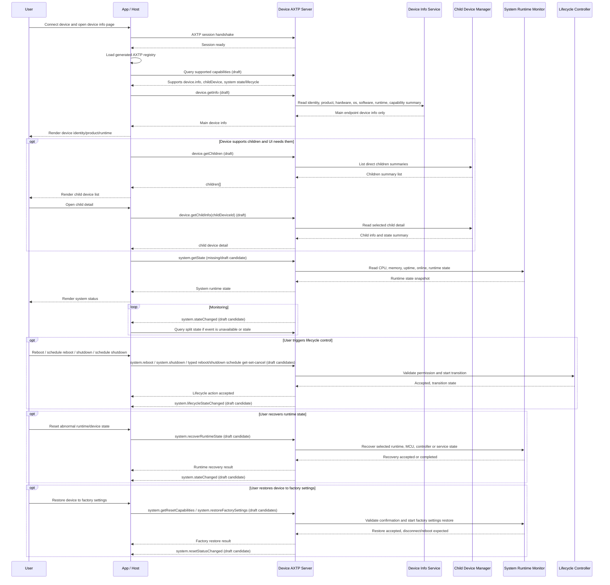

# Device Information And System Runtime State Protocol Interaction Flow

> Status: flow design
> Scope: Generic device identity, device information, child-device discovery, and system runtime state monitoring/control
> Source inputs: `docs/business/device-system-info.md`, pasted reference text 1 for generic `device.getInfo` schema, pasted reference text 2 for child-device split APIs, `docs/protocol/device/**`, `docs/protocol/system/**`, `docs/protocol/capability/capability.registry.md`, `docs/generated/protocol.md`
> Protocol lifecycle: Stage 10 `plan-protocol-flow`

本文根据“设备信息管理需求大纲”和两段参考设计，梳理设备连接后读取基础信息、读取主设备和级联设备、读取/监听系统运行时状态，以及执行关机、重启、计划任务、运行时状态重置和设备软重置类控制的 AXTP 交互流程。

本文不是最终协议事实源；已采纳事实以 `registry/**/*.yaml`、`registry/domains/**/*.yaml`、`protocol/axtp.protocol.yaml` 和 `docs/generated/**` 为准。当前 generated 协议只包含 AXTP Core、connection profiles、RPC/STREAM 基础事实、错误码和 `audio.algorithm` 业务方法；本文涉及的 `device.*` / `system.*` / `capability.*` 仍是草案或缺口。

## 1. Story Summary

| Item | Content |
|---|---|
| User goal | 用户或上位机连接设备后，快速获取当前 AXTP endpoint 代表的主设备身份和产品信息，按需发现级联/子设备，并持续查看 CPU、内存、在线、运行态等系统运行时状态。 |
| Trigger | App / PC host / cloud console 建立 AXTP session 后打开设备信息或系统状态页面。 |
| Success result | UI 可以区分“这是谁”与“现在状态怎样”；主设备信息轻量稳定；子设备和拓扑按需加载；运行时状态可轮询或事件同步；立即关机/重启、计划关机/重启、运行时状态重置和设备软重置都有明确权限、状态反馈和重连策略。 |
| Primary actors | User, App / PC host / cloud server, Device AXTP server, device info service, child-device manager, system runtime monitor, lifecycle controller |
| Product scope | 通用设备；覆盖 Windows Launcher、嵌入式设备、投屏接收端、数字标牌、Rooms 设备、主从/级联设备。 |

## 2. Source Observations

### 2.1 UI / Prototype

| Screen or control | Observed behavior | Protocol relevance |
|---|---|---|
| Device connection result | 连接完成后第一屏需要展示设备 ID、SN、产品、硬件、软件和 AXTP runtime。 | 需要 `device.info`，但当前草案还未采用参考文本中的分组 schema。 |
| Device identity card | 展示 `deviceId`、`serialNumber`、产品型号、展示名。 | `device.getInfo` 应回答“我是谁”，不要把软件名写进 `product.model`。 |
| Product / hardware / OS / software section | 同一接口要适配 Windows 盒子、嵌入式设备、Android 标牌、RTOS dongle 等多种设备。 | `device.info` schema 需要拆为 identity/product/hardware/os/software/runtime/capability 摘要，避免 `model` 字段过载。 |
| AXTP runtime section | 展示承载 AXTP 的 runtime、runtime 版本、host app。 | `runtime` 不等同于硬件型号；例如 NearHub Launcher 应在 `software.components` 或 `runtime.hostAppId`。 |
| Capability summary | 页面展示建模摘要，完整能力走单独能力查询。 | 推荐的 `device.getInfo` 保留轻量 capability 摘要，用于表达 profile、domains 和 domain.feature 建模；supported methods/events 依赖 `capability.registry` 草案或产品静态门禁。 |
| Child devices tab | 有主从或级联设备时，需要查看一级子设备、按需查看子设备详情、必要时查看完整树。 | 不应让 `device.getInfo` 默认返回所有子设备；需要 `device.childDevice` / topology 相关方法。 |
| System status panel | 展示 CPU、内存、在线状态和运行态变化。 | 本轮只保留 `system.state` 与 `system.stateChanged`；健康/告警/fault 判定由业务端根据状态事件自行实现，不保留 `system.health`。 |
| Lifecycle controls | 用户触发关机、立即重启、计划重启、计划关机。 | 立即重启、计划重启、立即关机和计划关机归 `system.lifecycle`；不再保留单独 power-off 动作。 |
| Runtime state recovery | 用户触发重置设备状态，让 MCU、runtime service 或控制器从异常状态恢复。 | 属于 `system.state` 的动作型方法候选 `system.recoverRuntimeState`；不是恢复出厂、恢复默认配置或重新初始化设备。 |
| Device restore | 用户触发设备恢复默认配置或恢复出厂设置。 | 属于 `system.reset` 的动作型方法候选 `system.restoreDefaultSettings` / `system.restoreFactorySettings`；与 MCU/runtime 状态恢复分开。 |
| State change monitor | 状态变化后 UI 自动刷新。 | 需要 system runtime state changed event；若事件未采纳，首版可轮询。 |
| UI prototype image | `[REVIEW-ASK]` 本轮未提供 UI 图；字段显示顺序、危险操作确认弹窗和权限提示需产品/UI 确认。 | 不新增协议，只影响 App 呈现。 |

### 2.2 Requirement Notes

- `device.getInfo` 应轻量、稳定、快速，默认只返回当前 AXTP endpoint 代表的主设备信息。
- `device.getInfo` 不应默认返回所有级联设备。级联设备数量、状态、权限、缓存策略与主设备信息不同，应拆到 children/topology 接口。
- `device.getInfo` 推荐分组：identity / product / hardware / os / software / runtime / capability。
- `device.info` 本轮只保留只读 `device.getInfo`；设备名、资产标识等设置需求明确后再另起草写入协议，暂不定义信息变化通知事件。
- `product.model` 表示硬件或整机型号，不应填 `NearHub Launcher` 这类软件名。
- `software.components` 表示 Launcher、Signage、Cast Receiver 等软件组件；`runtime` 表示当前 AXTP runtime 和 host app。
- 运行时状态建议收敛到 `system`，并拆成 `system.state` 和 `system.lifecycle`：`device` 专注身份、产品和拓扑。
- 健康、告警和 fault 不作为独立 `system.health` capability；设备只提供 `system.stateChanged` 状态变化事件，业务端接收后自行判定。
- 关机、立即重启、计划重启和计划关机属于 system lifecycle control；原“断开设备电源”场景与 shutdown 重复，不再建模为独立 power-off 方法。
- 重置设备状态用于从 MCU、runtime service 或控制器异常状态中恢复，归 `system.state` 的 `recoverRuntimeState` action；恢复默认/恢复出厂属于 `system.reset` 边界，不能混在 `device.info` 或 `system.state`。
- 恢复默认配置属于 `system.restoreDefaultSettings`，表示恢复到当前已安装版本的默认配置，不改变 Launcher 等软件版本；恢复出厂设置属于 `system.restoreFactorySettings`，表示恢复到设备出厂基线，可能把 Launcher 等软件组件回退到出厂初始版本。二者都需要危险操作确认、可查询 reset status 和清除/保留范围确认。

## 3. Assumptions And Non-Goals

| Type | Item | Status |
|---|---|---|
| Assumption | 一个 AXTP endpoint 默认代表一个主设备；子设备是该主设备代理、管理或挂载的对象。 | `[REVIEW-DRAFT]` |
| Assumption | `device.getInfo` 默认不返回 children；如支持 `includeChildren`，默认值必须是 `false`，且只返回 summary。 | `[REVIEW-DRAFT]` |
| Assumption | 推荐的 `device.getInfo` 保留 capability 建模摘要；完整 methods/events/permissions 查询由 `capability.registry` 或后续能力发现协议承接。 | `[REVIEW-DRAFT]` |
| Assumption | `device.info` 与 `device.identity` 合并为一个 `device.info` 能力；本轮只承载只读设备信息，不提供显示名/资产标识写入或信息变化通知。 | `[REVIEW-OK]` |
| Assumption | system 运行时状态拆成 `system.state` 和 `system.lifecycle` 相关 capability，分别表达通用运行指标/状态变化、生命周期控制。 | `[REVIEW-OK]` |
| Assumption | 不保留 `system.health`；健康状态、告警和故障等级由业务端基于 `system.stateChanged` 事件自行判定。 | `[REVIEW-OK]` |
| Assumption | “断开设备的电源”不再作为独立协议动作；软件关机/下电由 `system.shutdown` 覆盖，外部 PDU/继电器硬断电不属于本设备 AXTP 软件协议。 | `[REVIEW-OK]` |
| Assumption | 计划重启是 lifecycle schedule，使用 `system.getRebootSchedule` / `system.setRebootSchedule` / `system.cancelRebootSchedule`。 | `[REVIEW-OK]` |
| Assumption | 计划关机是 lifecycle schedule，使用 `system.getShutdownSchedule` / `system.setShutdownSchedule` / `system.cancelShutdownSchedule`；不再引入硬件/固件级 power schedule，也不保留总括 lifecycle schedules 接口。 | `[REVIEW-OK]` |
| Assumption | 重置设备状态是运行时恢复动作，使用 `system.recoverRuntimeState`；不代表恢复默认配置、恢复出厂或首次初始化。 | `[REVIEW-DRAFT]` |
| Assumption | 重置设备为出厂设置状态是设备级 factory settings restore，使用 `system.restoreFactorySettings`；默认应保留硬件身份字段，具体清除范围需确认。 | `[REVIEW-DRAFT]` |
| Assumption | 旧 `device.power` / AutoPower 线索不进入本 flow 的 `system` feature；如后续需要电池/供电遥测或外部电源控制，应另行定域，不复用独立 system power feature。 | `[REVIEW-DRAFT]` |
| Non-goal | 本 flow 不是最终协议事实源；协议细节进入 `docs/protocol/**` 草案，registry YAML、Protocol IR 和 generated 文件不在本阶段修改。 | `[REVIEW-OK]` |
| Non-goal | 不设计 network、storage、audio、firmware 等非 device/system 业务细节。 | `[REVIEW-OK]` |
| Non-goal | 不把调试方便的一次性大 payload 作为默认稳定接口。 | `[REVIEW-OK]` |

## 4. Protocol Coverage

| Need | Coverage state | AXTP protocol | Evidence | Next action |
|---|---|---|---|---|
| 建立设备管理会话 | Adopted/generated core | AXTP session, RPC, supported connection profiles | `docs/generated/protocol.md`, `protocol/axtp.protocol.yaml` | 可按 AXTP Core 实现连接和 RPC envelope。 |
| 加载当前正式方法表 | Adopted/generated core / local behavior | Generated registry | `docs/generated/protocol.md` | App/Host 使用当前 generated registry 做正式方法门禁。 |
| 运行时能力发现 | Drafted only | `capability.registry` | `docs/protocol/capability/capability.registry.md` | 转 Stage 20 明确 supported methods/events/capabilities 查询。 |
| 获取当前主设备信息 | Drafted only / schema gap | `device.info`; candidate `device.getInfo` | `docs/protocol/device/device.info.md`, pasted reference text 1 | 转 Stage 20 重写 `device.info` 为 identity/product/hardware/os/software/runtime/capability schema，并对齐 `device.getInfo` 命名。 |
| 查询一级子设备摘要 | Drafted only / method gap | `device.childDevice`; candidate `device.getChildren` | `docs/protocol/device/device.childDevice.md`, pasted reference text 2 | 转 Stage 20 补 children summary schema，避免默认塞进 `device.getInfo`。 |
| 查询指定子设备详情 | Drafted only / method gap | `device.childDevice`; candidate `device.getChildInfo` | `docs/protocol/device/device.childDevice.md`, pasted reference text 2 | 转 Stage 20 补 child detail schema 和权限。 |
| 查询完整设备拓扑 | Missing / optional draft extension | Candidate `device.getTopology` | pasted reference text 2 | P1/P2 转 Stage 20；不作为 P0 代替 `getChildren`。 |
| 子设备状态变化通知 | Drafted only / naming gap | `device.childDeviceStateChanged` candidate | `docs/legacy-migration/classification/device.md`, `docs/protocol/device/device.childDevice.md` | 转 Stage 20 明确 child attached/detached/online/health event。 |
| 获取 CPU、内存、在线、uptime 等通用运行状态 | Drafted only / confirmed system split | `system.state`; migrated from old `device.state` direction | user confirmation, `docs/protocol/system/system.state.md` | Stage 20 已新增 `system.state`，承载通用 runtime state 和状态变化事件。 |
| 重置设备运行状态以恢复异常 | Drafted only / new scenario | `system.state`; candidate `system.recoverRuntimeState` | `docs/business/device-system-info.md`, `docs/protocol/system/system.state.md` | Stage 20 已为 MCU/runtime/controller 状态恢复定义动作、scope、权限、状态事件和错误。 |
| 监听运行时状态变化 | Drafted only / single state event | `system.stateChanged` | user confirmation, `docs/protocol/system/system.state.md` | Stage 20 已设计状态变化事件；健康/告警/fault 由业务端自行判定。 |
| 关机、立即重启、计划重启和计划关机控制 | Drafted only / updated method set | `system.lifecycle`; candidates `system.reboot`, `system.shutdown`, `system.getRebootSchedule`, `system.setRebootSchedule`, `system.cancelRebootSchedule`, `system.getShutdownSchedule`, `system.setShutdownSchedule`, `system.cancelShutdownSchedule` | `docs/protocol/system/system.lifecycle.md`, `docs/legacy-migration/classification/system.md` | Stage 20 已补 lifecycle action methods、typed 计划任务 get/set/cancel、危险操作确认语义、计划语义、状态事件和错误。 |
| 设备恢复默认配置或出厂设置 | Drafted only / new scenario | `system.reset`; candidates `system.restoreDefaultSettings`, `system.restoreFactorySettings` | `docs/business/device-system-info.md`, `docs/protocol/system/system.reset.md` | Stage 20 已补设备级 restore、能力查询、status 查询、status 事件、危险操作确认，以及当前版本默认配置 vs 出厂软件基线的区别。 |
| 首次初始化/初始化向导 | Drafted only / semantic split | `system.initialization` | `docs/protocol/system/system.initialization.md` | 不混入 factory settings soft restore；初始化向导另走 `system.initialization`。 |
| 系统时间 | Drafted only | `system.time` | `docs/protocol/system/system.time.md` | 本 flow 仅作为 system 示例，不展开；时间配置另走专门 flow/draft。 |

## 5. End-To-End Sequence



## 6. Interaction Steps

| Step | Actor | User or system action | Protocol call/event | Request / event payload notes | Response / state result | Error or fallback |
|---:|---|---|---|---|---|---|
| 1 | App / Device | 建立 AXTP session。 | Generated core session/RPC | 使用产品选定 transport；连接完成后 App 加载 generated registry。 | RPC 可用。 | 握手失败显示连接错误。 |
| 2 | App | 检查正式 generated 方法。 | Local generated registry lookup | 当前 generated 未包含 `device.*` / `system.*` 业务方法。 | App 知道这些方法仍是草案依赖。 | 纯 AXTP 实现需等待 Stage 20/30/50。 |
| 3 | App / Device | 查询运行时能力。 | Draft `capability.registry` or product static gate | 查询 supported domains/methods/events；能力摘要不替代完整查询。 | App 确认是否支持 device info、children、system state、lifecycle。 | 能力查询未采纳前，用固件版本和产品 profile 做显式门禁。 |
| 4 | App / Device | 读取主设备信息。 | Draft `device.getInfo` candidate | 默认不带 children；capability 只放建模摘要。 | 返回 identity/product/hardware/os/software/runtime/capability summary。 | 读取失败时页面显示无法识别设备；不要用 `product.model` 填软件名。 |
| 5 | App | 渲染设备信息。 | Non-protocol | UI 区分 SN、model、displayName、OS、software component、AXTP runtime。 | 用户看到“这是谁”。 | 本地展示策略，不进入协议。 |
| 6 | App / Device | 查询子设备摘要。 | Draft `device.getChildren` candidate | `includeInfo=summary`，`includeCapabilities=false`，默认只查一级。 | 返回 children[] 摘要、关系、路径、online、connection。 | 不支持子设备时隐藏 tab；子设备多时分页或过滤。 |
| 7 | App / Device | 查询子设备详情。 | Draft `device.getChildInfo` candidate | `deviceId` / `childDeviceId`；详情按需拉取。 | 返回单个子设备详情、software、capability summary、connection、state。 | `NOT_FOUND` 时刷新 children；权限不足提示。 |
| 8 | App / Device | 查询完整拓扑。 | Optional draft `device.getTopology` candidate | 仅拓扑管理页使用，可带 `maxDepth`。 | 返回树状 root/children。 | P0 不依赖；设备不支持时回退 children。 |
| 9 | App / Device | 查询通用系统运行状态。 | Missing candidate `system.getState` | 字段候选：cpu、memory、uptime、load、online、process/runtime summary。 | UI 展示设备是否运行正常和资源占用。 | 旧 `device.state` 方向已迁移到 `system.state`。 |
| 10 | Device / App | 状态变化同步。 | Draft `system.stateChanged`; optional polling | 事件应可按字段变化节流；高频指标不应无节制上报；健康/告警/fault 由业务端基于事件自行判定。 | UI 自动刷新。 | 首版可轮询；事件丢失时以 `system.getState` 校准。 |
| 11 | User / App / Device | 执行立即重启。 | Draft `system.reboot` candidate | 需要 reason、delay、force、confirmation token 等待确认字段。 | 设备接受并进入 rebooting。 | `PERMISSION_DENIED`、`BUSY`、`INVALID_STATE`、`REBOOT_REQUIRED` 等错误可诊断。 |
| 12 | App / Device | 查询当前计划重启。 | Draft `system.getRebootSchedule` candidate | 默认可包含 disabled reboot schedule。 | 返回当前计划重启列表、nextRunAt 和版本。 | 不支持计划重启时隐藏相关 UI；读取失败时禁止覆盖未知计划。 |
| 13 | User / App / Device | 创建或更新计划重启。 | Draft `system.setRebootSchedule` candidate | 需要 schedule、timezone、reason、expectedVersion、confirmation token；可表达一次性或周期性计划。 | 设备保存计划并返回 scheduleId / nextRunAt / version。 | 时间无效返回 `INVALID_ARGUMENT` 或 `OUT_OF_RANGE`；权限不足返回 typed error。 |
| 14 | User / App / Device | 取消计划重启。 | Draft `system.cancelRebootSchedule` candidate | 需要 scheduleId/reason/expectedVersion；用于取消计划重启。 | 设备取消计划并返回新的 reboot schedule 版本。 | 找不到计划返回 `NOT_FOUND`；版本冲突需重新读取 reboot schedule。 |
| 15 | App / Device | 查询当前计划关机。 | Draft `system.getShutdownSchedule` candidate | 默认可包含 disabled shutdown schedule。 | 返回当前计划关机列表、nextRunAt 和版本。 | 不支持计划关机时隐藏相关 UI；读取失败时禁止覆盖未知计划。 |
| 16 | User / App / Device | 创建或更新计划关机。 | Draft `system.setShutdownSchedule` candidate | 需要 schedule、timezone、reason、expectedVersion、confirmation token；语义是 planned graceful shutdown。 | 设备保存计划并返回 scheduleId / nextRunAt / version。 | 时间无效返回 typed error；与已有 lifecycle 计划冲突时返回 `BUSY` 或冲突错误。 |
| 17 | User / App / Device | 取消计划关机。 | Draft `system.cancelShutdownSchedule` candidate | 需要 scheduleId/reason/expectedVersion；用于取消计划关机。 | 设备取消计划并返回新的 shutdown schedule 版本。 | 找不到计划返回 `NOT_FOUND`；版本冲突需重新读取 shutdown schedule。 |
| 18 | User / App / Device | 执行关机。 | Draft `system.shutdown` candidate | 软件发起的 graceful shutdown；覆盖原“断开设备电源”的软件下电诉求。 | 设备进入 shutting_down，连接可能断开。 | 权限不足或 busy 时返回 typed error。 |
| 19 | User / App / Device | 恢复设备运行时异常状态。 | Draft `system.recoverRuntimeState` candidate under `system.state` | 需要 scope、reason、可选 componentId/confirmation token；用于 MCU、runtime service 或控制器异常状态恢复。 | 设备接受或完成状态恢复，随后通过 `system.stateChanged` 校准。 | 不支持该 scope 返回 `NOT_SUPPORTED`；危险/忙状态返回 typed error。 |
| 20 | User / App / Device | 设备恢复默认配置或出厂设置。 | Draft `system.getResetCapabilities`, `system.restoreDefaultSettings`, `system.restoreFactorySettings`, `system.getResetStatus` candidates under `system.reset` | default settings 基于当前版本默认配置且不改软件版本；factory settings 基于出厂基线且可包含 Launcher 等软件版本回退。 | 设备接受 restore，返回 actionId、reset status、baseline、softwareVersionChangeExpected、disconnectExpected/rebootExpected。 | 权限不足、确认缺失、scope 不支持或系统忙时返回 typed error。 |
| 21 | User / App / Device | 监听 lifecycle / state / reset 状态。 | Draft `system.lifecycleStateChanged`, `system.stateChanged`, `system.resetStatusChanged` candidates | 上报 reboot_scheduled、shutdown_scheduled、rebooting、shutting_down、runtime recovery completed、factory restore progress、ready 等状态。 | UI 显示过渡状态并等待重连或刷新；业务端自行计算健康/告警。 | 断开后 App 进入重连流程。 |
| 22 | App / Device | 设备重连后刷新状态。 | Draft `device.getInfo`, `system.getState`, `system.getResetStatus` | 重新读取主设备和 system runtime；如 restore 后连接凭据变化，进入重新配网/绑定流程。 | 确认设备已恢复 ready 或 restore completed。 | 超时提示人工检查。 |

## 7. Protocol Details

### 7.1 Adopted / Generated Protocols

| Method/Event/Profile | Purpose in this flow | Source |
|---|---|---|
| AXTP session / RPC envelope | 建立连接、承载请求响应和事件。 | `docs/generated/protocol.md`, `protocol/axtp.protocol.yaml` |
| Supported connection profiles | 支持 USB HID、TCP 和 WebSocket JSON 等接入方式。 | `docs/generated/protocol.md` |
| Core RPC errors | unsupported、invalid argument、permission denied、busy 等错误基础。 | `docs/generated/protocol.md`, `registry/error/error_code.yaml` |
| Generated method registry | App/Host 用于判断当前产品包中哪些方法已正式采纳。 | `docs/generated/protocol.md` |

当前 generated 协议没有 adopted `device.*`、`system.*` 或 `capability.*` 业务方法。下面的方法名都是 flow 级候选或草案依赖，不是实现合同。

### 7.2 Draft Or Missing Protocol Gaps

| Gap | Candidate domain.feature | Candidate method/event/schema | Routed skill | Review question |
|---|---|---|---|---|
| `device.info` 需要从配置型草案改成轻量主设备信息查询 | `device.info` | `device.getInfo`, `DeviceInfo(identity/product/hardware/os/software/runtime/capability)` | `draft-business-protocol` | `[REVIEW-OK]` `device.info` 合并 `device.identity`，并使用信息型 `device.getInfo` 方向起草。 |
| 设备显示名/资产标识设置暂不进入本轮 | future setting protocol | no current set method or changed event under `device.info` | `draft-business-protocol` | `[REVIEW-OK]` 本轮 `device.info` 只保留只读 `device.getInfo`；有具体设置需求后另起草。 |
| `device.getInfo` 多设备通用 schema 未固化 | `device.info` | productType enum, OS enum, software component roles, runtime fields | `draft-business-protocol` | `[REVIEW-ASK]` productType 枚举首批有哪些值？ |
| 子设备不应默认塞进主设备信息 | `device.childDevice` | `device.getChildren`, `device.getChildInfo`, optional `device.getTopology` | `draft-business-protocol` | `[REVIEW-ASK]` P0 是否只支持一级 children？最大深度和分页策略？ |
| 子设备事件命名和 payload 未固化 | `device.childDevice` | `device.childDeviceStateChanged` / `device.childrenChanged` | `draft-business-protocol` | `[REVIEW-ASK]` 事件是上报在线/离线，还是完整拓扑变化？ |
| system 运行时状态需要拆分 | `system.state`, `system.lifecycle` | `system.getState`, `system.stateChanged`, lifecycle action/schedule methods and events | `draft-business-protocol` | `[REVIEW-OK]` 本 flow 不再保留独立 power 或 health capability；关机和计划关机归 `system.lifecycle`。 |
| power 当前在 device draft，但不再进入 system feature | none in this flow | no independent power feature, power-off method, or power schedule methods | `draft-business-protocol` | `[REVIEW-OK]` power-off 与 shutdown 重复，旧 `device.power`/AutoPower 线索后续如需要应另行定域。 |
| CPU/内存等通用运行时状态没有 system 草案 | `system.state` | `SystemRuntimeState`, `system.getState`, `system.stateChanged` | `draft-business-protocol` | `[REVIEW-ASK]` 哪些通用运行指标是 P0，哪些是诊断/telemetry 扩展？ |
| 重置设备状态缺动作型方法 | `system.state` | `system.recoverRuntimeState`, `RecoverRuntimeStateParams`, `RecoverRuntimeStateResult` | `draft-business-protocol` | `[REVIEW-ASK]` recovery scope 是否只覆盖 runtime service / MCU / controller，是否允许 child device 或 componentId？ |
| 设备恢复默认/恢复出厂缺动作型方法 | `system.reset` | `system.getResetCapabilities`, `system.getResetStatus`, `system.restoreDefaultSettings`, `system.restoreFactorySettings`, `system.resetStatusChanged` | `draft-business-protocol` | `[REVIEW-ASK]` default settings 的当前版本默认配置、factory settings 的出厂软件基线和 Launcher 版本回退范围如何确认？ |
| 健康/告警/fault 不作为 system capability | `system.state` event only | `system.stateChanged` | `draft-business-protocol` | `[REVIEW-OK]` 设备只上报状态变化；业务端接收后自行判定健康、告警和故障等级。 |
| 关机/立即重启/计划重启/计划关机控制缺动作型方法 | `system.lifecycle` | `system.reboot`, `system.shutdown`, `system.getRebootSchedule`, `system.setRebootSchedule`, `system.cancelRebootSchedule`, `system.getShutdownSchedule`, `system.setShutdownSchedule`, `system.cancelShutdownSchedule`, lifecycle event | `draft-business-protocol` | `[REVIEW-ASK]` reboot/shutdown schedule 的一次性/周期性计划、取消和覆盖策略如何定义？ |
| 原“断开设备电源”与 shutdown 重复 | `system.lifecycle` | `system.shutdown` | `draft-business-protocol` | `[REVIEW-OK]` 不新增独立 power-off 方法；外部 PDU/继电器硬断电不属于本设备 AXTP 软件协议。 |
| 能力发现缺正式 runtime query | `capability.registry` | supported methods/events/capabilities query | `draft-business-protocol` | `[REVIEW-ASK]` 是否需要动态能力查询，还是 generated registry + product profile 足够？ |

### 7.3 Recommended Payload Boundaries

`device.getInfo` should answer "who am I":

```json
{
  "identity": {
    "deviceId": "dev_001",
    "serialNumber": "NH-2026-000001",
    "vendorId": "nearhub",
    "productId": "nh-win-box-a1"
  },
  "product": {
    "brand": "NearHub",
    "productType": "windowsDevice",
    "model": "NH-WIN-BOX-A1",
    "displayName": "NearHub Display Controller"
  },
  "hardware": {
    "revision": "A1",
    "cpuArch": "x86_64",
    "memoryBytes": 8589934592
  },
  "os": {
    "type": "windows",
    "name": "Windows 11 IoT Enterprise",
    "version": "10.0.22631",
    "arch": "x86_64"
  },
  "software": {
    "components": [
      {
        "id": "launcher",
        "name": "NearHub Launcher",
        "version": "1.2.3",
        "role": "axtpHost"
      }
    ]
  },
  "runtime": {
    "axtpRuntime": "axtp-ts-runtime",
    "axtpRuntimeVersion": "0.1.0",
    "hostAppId": "launcher"
  },
  "capability": {
    "profile": "windows-managed-device",
    "domains": ["device", "system"],
    "features": [
      "device.info",
      "device.childDevice",
      "system.state",
      "system.lifecycle",
      "system.reset"
    ]
  }
}
```

Rules:

- `product.model` is a hardware or whole-product model; do not put `NearHub Launcher` there.
- `software.components[]` carries Launcher, Signage, Cast Receiver and similar software facts.
- `runtime` carries the AXTP runtime and host app facts.
- `capability` is a modeling summary only; complete supported methods, events, permissions, and dynamic availability belong to a dedicated capability query.
- `device.getInfo` default payload excludes children.

`device.getChildren` should answer "who is below me":

```json
{
  "children": [
    {
      "deviceId": "dev_camera_001",
      "parentDeviceId": "dev_launcher_001",
      "relation": "attached",
      "path": "dev_launcher_001/dev_camera_001",
      "online": true,
      "product": {
        "productType": "cameraDevice",
        "model": "CAM-A1",
        "displayName": "Front Camera"
      },
      "connection": {
        "type": "usb",
        "port": "usb-1"
      }
    }
  ]
}
```

`system.getState` should answer general runtime status:

```json
{
  "uptimeSeconds": 3600,
  "online": true,
  "runtimeRecoverySupported": true,
  "recoverableScopes": ["runtime", "mcu", "controller"],
  "cpu": {
    "usagePercent": 42.5
  },
  "memory": {
    "usedBytes": 2147483648,
    "totalBytes": 8589934592
  }
}
```

`system.recoverRuntimeState` should answer "recover this runtime state":

```json
{
  "scope": "mcu",
  "componentId": "main-controller",
  "reason": "recover_from_abnormal_state",
  "confirmationToken": "TOKEN-REDACTED"
}
```

`system.restoreDefaultSettings` should answer "restore default settings":

```json
{
  "scopes": ["settings"],
  "preserve": ["identity", "network"],
  "reason": "restore_defaults",
  "rebootAfterRestore": false,
  "confirmationToken": "TOKEN-REDACTED"
}
```

Default settings restore uses the current installed version as its baseline. For example, Launcher `1.2.3` remains `1.2.3`; only its configuration returns to the `1.2.3` default values.

`system.restoreFactorySettings` should answer "restore this device to factory settings through software":

```json
{
  "scopes": ["settings", "user_data", "software"],
  "preserve": ["identity"],
  "reason": "device_reassignment",
  "rebootAfterRestore": true,
  "confirmationToken": "TOKEN-REDACTED"
}
```

Factory settings restore uses the factory baseline as its baseline. For example, Launcher `1.2.3` can be restored to the original factory Launcher version such as `1.0.0`, if the device capability says software version rollback is supported.

These system shapes are candidates only. They record the confirmed direction that runtime state is split into `system.state`, `system.lifecycle`, and `system.reset`. Software shutdown is modeled as `system.shutdown`; no separate power-off, power-state, power-schedule, health, warning, or fault capability candidate is retained in this flow. Runtime state recovery is modeled as `system.recoverRuntimeState`; default settings restore and factory settings soft restore are modeled as `system.restoreDefaultSettings` / `system.restoreFactorySettings` under `system.reset`; initialization wizard remains in `system.initialization`.

## 8. Test Fixtures

| Fixture | Expected result |
|---|---|
| `device-info-main-only` | `device.getInfo` returns the current endpoint main device and does not include children by default. |
| `device-info-generic-windows` | Windows Launcher device reports product/hardware/os/software/runtime without putting Launcher in `product.model`. |
| `device-info-generic-embedded` | Embedded or Android device uses the same schema with unavailable fields omitted. |
| `device-capability-summary` | `device.getInfo` carries a lightweight capability modeling summary; full methods/events require a dedicated capability query. |
| `device-children-list` | Device with children returns one-level summaries through `device.getChildren`. |
| `device-child-detail` | App fetches one child detail through `device.getChildInfo`; missing child returns `NOT_FOUND`. |
| `device-topology-optional` | Topology management page uses `device.getTopology` only if capability says supported. |
| `system-state-read` | App reads CPU/memory/uptime/online through `system.state`. |
| `system-state-changed` | App receives `system.stateChanged` and business code computes health/warning/fault if needed. |
| `system-reboot-flow` | Reboot action requires permission and returns lifecycle transition; App waits for disconnect/reconnect. |
| `system-reboot-schedule-read` | App reads current reboot schedule before rendering or modifying reboot schedule UI. |
| `system-set-reboot-schedule-flow` | Set reboot schedule stores a future or recurring reboot plan and reports the next run time. |
| `system-cancel-reboot-schedule-flow` | Cancel reboot schedule removes a configured reboot schedule and returns the new schedule version. |
| `system-shutdown-schedule-read` | App reads current shutdown schedule before rendering or modifying shutdown schedule UI. |
| `system-set-shutdown-schedule-flow` | Set shutdown schedule stores a future or recurring graceful shutdown plan and reports the next run time. |
| `system-cancel-shutdown-schedule-flow` | Cancel shutdown schedule removes a configured shutdown schedule and returns the new schedule version. |
| `system-shutdown-flow` | Shutdown action requires permission and returns lifecycle transition. |
| `system-runtime-recovery-flow` | Runtime recovery targets a supported runtime/MCU/controller scope and emits or is followed by refreshed system state. |
| `system-restore-factory-settings-flow` | Factory settings soft restore requires reset capability, confirmation token, explicit preserve/scope policy and reset status/reconnect handling. |
| `unsupported-draft-method` | Before adoption/generated refresh, App does not call draft-only methods as stable contracts. |

## 9. Acceptance Gates

- `device.getInfo` is lightweight and default-main-device-only.
- `device.info` and `device.identity` are merged; device info schema separates identity/product/hardware/os/software/runtime/capability summary and remains read-only in this flow.
- No device info config write method or device info changed event is retained in this flow.
- Child devices and topology are queried through separate methods and have capability gates.
- Runtime state is not mixed into device identity/product information.
- Runtime state is split into `system.state`, lifecycle, and reset capabilities before adoption.
- Runtime state recovery is explicitly modeled as `system.recoverRuntimeState`, not as factory settings restore or default configuration restore.
- Device default settings restore is explicitly modeled as `system.restoreDefaultSettings`, not as `system.recoverRuntimeState`; it restores current-version default configuration without changing software versions.
- Device factory settings soft restore is explicitly modeled as `system.restoreFactorySettings`, not as `system.recoverRuntimeState`; it restores the factory baseline and may roll software components such as Launcher back to their initial factory versions.
- No independent power-off, power-state, power-schedule, health, warning, or fault capability candidate is retained in this flow.
- Lifecycle controls have explicit permissions, confirmation strategy, typed schedule semantics, transition state and reconnect behavior; 计划重启和计划关机都必须有各自可查询/可取消的策略结论。
- Reset controls have explicit capability query, confirmation strategy, preserve/scope semantics, reset status/progress and reconnect behavior.
- All draft-only and missing gaps have Stage 20 follow-up before registry/YAML/generated work.

## 10. Open Questions

- `[REVIEW-ASK]` `device.getInfo` 是否允许 `includeChildren=true`？如果允许，是否只返回 summary 且默认 false？
- `[REVIEW-ASK]` legacy `SetDeviceName` 后续是继续留在旧 adapter，还是另起草设备名设置协议？
- `[REVIEW-ASK]` 子设备 ID 的稳定性规则是什么？`deviceId`、`localId`、`serialNumber` 和 topology `path` 如何组合？
- `[REVIEW-ASK]` `device.getTopology` 是否进入 P1/P2，还是本轮只采纳 `getChildren` / `getChildInfo`？
- `[REVIEW-ASK]` `system.state` 首批字段有哪些？CPU、内存、在线、uptime、load 是否都是 P0？
- `[REVIEW-ASK]` legacy 中原归 `device.power` / AutoPower 的字段是否另行定域为 telemetry/sensor/external power control，还是仅作为 adapter 私有能力处理？
- `[REVIEW-ASK]` reboot schedule 和 shutdown schedule 是否各自支持多个计划并存、周期性计划、覆盖已有计划和取消计划？
- `[REVIEW-ASK]` `system.recoverRuntimeState` 的 scope 首批有哪些？是否支持 `mcu`、`runtime`、`controller`、`service` 和 `componentId`？
- `[REVIEW-ASK]` `system.restoreFactorySettings` 会清除哪些配置/数据？`deviceId`、SN、license、绑定关系和网络配置是否保留？
- `[REVIEW-ASK]` factory baseline 如何定义？Launcher、runtime、业务应用和固件中哪些组件会回退到出厂初始版本？
- `[REVIEW-ASK]` factory settings restore 后是否必须重启，是否会清除 AXTP 连接凭据并触发重新配网/绑定？
