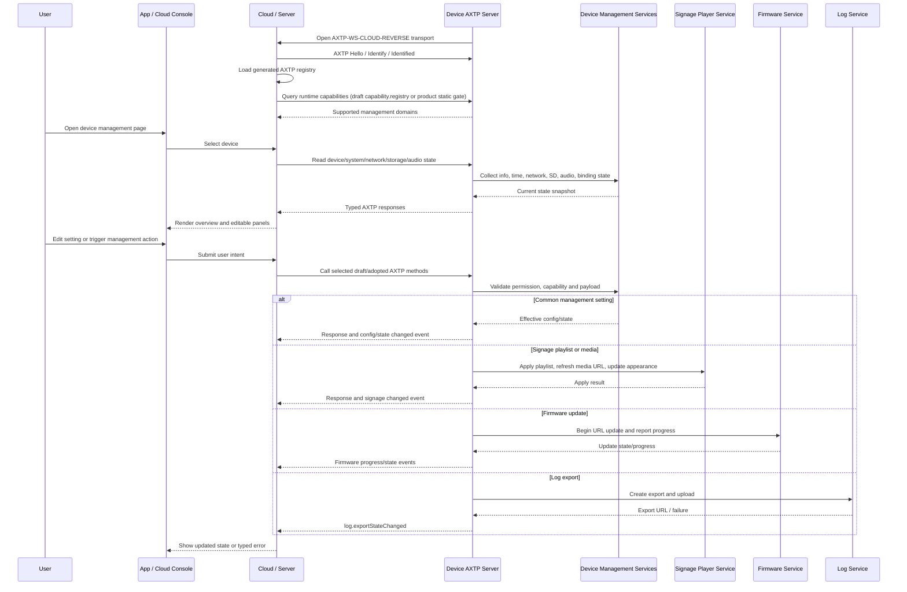

# NearHub Launcher Digital Signage Device Management Protocol Interaction Flow

> Status: flow design
> Scope: NearHub Launcher digital signage device management and common management commands
> Source inputs: `docs/legacy-migration/evidence/NearHub-Launcher数字标牌设备管理通用管理命令.md`, `docs/legacy-migration/evidence/NearHub-Launcher设备管理命令.md`, `docs/legacy-migration/classification/by-source/signage_sdk.md`, `docs/legacy-migration/plans/signage-protocol-migration-plan.md`, `docs/generated/protocol.md`
> Protocol lifecycle: Stage 10 `plan-protocol-flow`

本文根据 NearHub Launcher 两份 legacy Device SDK 文档，把数字标牌设备管理相关 command/event 整理为 AXTP 场景级交互 flow。本文不是最终协议事实源；稳定实现合同仍以 `registry/**/*.yaml`、`registry/domains/**/*.yaml`、`protocol/axtp.protocol.yaml` 和 `docs/generated/**` 为准。

当前 generated 协议只包含 AXTP Core、connection profiles、RPC/STREAM 基础事实、错误码和少量业务方法；本文涉及的 `device.*`、`system.*`、`network.*`、`storage.*`、`audio.volume`、`audio.input`、`firmware.*`、`auth.*`、`signage.*`、`log.*` 仍是草案或缺口，不能直接作为实现合同。

Flow 文档负责描述业务场景和交互步骤、判断每一步协议覆盖状态、识别协议缺口，并将缺口路由到 candidate `domain.feature`。Flow 文档不负责定义完整 method / event / schema / capability，不分配 methodId / eventId / errorCode / fieldId，也不能替代 `docs/protocol/<domain>/<feature>.md`。

## 0. 速读结论

| 项目 | 内容 |
|---|---|
| Flow 目标 | 将 NearHub Launcher legacy 数字标牌设备管理命令映射为 AXTP 场景级管理流程，判断哪些可复用现有草案、哪些仍需新草案或定域。 |
| 当前协议覆盖 | partial |
| 涉及 domain.feature | `capability.registry`, `device.info`, `system.lifecycle`, `system.time`, `system.reset`, `network.interface`, `network.ip`, `network.wifi`, `storage.sdCard`, `audio.volume`, `audio.input`, `firmware.update`, `firmware.updatePolicy`, `auth.session` / binding, `signage.playlist`, `signage.media`, `signage.osd`, `signage.schedule` / `system.lifecycle`, `log.export`, candidate `sensor.telemetry` |
| 已有 adopted/generated | AXTP session/RPC envelope、connection profiles、core/domain error codes、generated registry；`audio.algorithm` 已 generated 但不覆盖本 flow 的音量/输入。 |
| 缺口 | 大部分数字标牌业务方法仍为草案；binding、telemetry、schedule 定域不清；SD 格式化、日志导出、playlist/media URL refresh 需要补 schema 和事件。 |
| 是否需要新增协议草案 | yes |
| 是否涉及 Legacy | yes，31 个 `signage_sdk` legacy 条目均需映射或明确 adapter-only。 |
| 是否涉及 STREAM | no，本 flow 管理面不传大媒体流；固件 URL 升级也不走本地 STREAM 上传。 |
| 下一步 | draft protocol；先消解 `device.info`/`system.reset`/`schedule`/`telemetry`/`binding` 定域问题，再逐个采纳业务草案。 |

## 1. Story Summary

| Item | Content |
|---|---|
| User goal | App / 云端 / 运维人员用 AXTP 管理数字标牌设备，完成上线识别、基础状态读取、配置修改、内容同步、升级、日志导出和绑定状态同步。 |
| Trigger | 设备启动并连接云端，或 App / 服务端打开设备管理页面并选择一台 NearHub Launcher 数字标牌设备。 |
| Success result | 设备完成 AXTP session；调用方按 generated registry 和设备声明能力调用标准 `domain.method`；旧 `Verb + Resource` command 只作为 legacy 映射和灰度 adapter 参考。 |
| Primary actors | User / operator, App, cloud/server, Device AXTP server, device management service, signage player service, firmware service, log service |
| Product scope | NearHub Launcher digital signage SDK migration；覆盖 `signage_sdk` 分类中的 31 个 legacy 条目。 |

## 2. Source Observations

### 2.1 UI / Prototype

| Screen or control | Observed behavior | Protocol relevance |
|---|---|---|
| Device list / connection entry | 设备在线后进入管理入口；旧文档使用 `KeepAlive` method/event 记录在线。 | AXTP session / transport heartbeat 优先；业务 last-online 或 lifecycle 事件为 `system.lifecycle` 草案依赖。 |
| Device overview | 展示型号、设备名、CPU、内存、IP、MAC、版本。 | Legacy `GetDeviceInfo` 映射到 `device.info` 草案；CPU/内存/IP/MAC 分别拆到 system/network。 |
| Device name editor | 修改设备显示名。 | Legacy `SetDeviceName` 暂不映射到当前只读 `device.info`；有具体设置需求后另起草设备名设置协议。 |
| System time form | 设置时区和年月日时分秒。 | Legacy `SetSysTime` 映射到 `system.time` 草案。 |
| Factory reset / restore config button | 旧 `ResetConfig` 文案称恢复出厂设置且通常自动重启。 | 映射到 `system.reset` 草案；需区分恢复当前版本默认配置与恢复出厂基线。 |
| Network summary | 返回 Wi-Fi / Ethernet 数组，含 `connected`、`ip`、`mac`、`ssid`、`rssi`。 | 需要 `network.interface` + `network.ip`，Wi-Fi 字段还依赖 `network.wifi`。 |
| SD card panel | 查询 SD 卡状态和容量；触发格式化。 | Legacy `GetSDInfo` / `FormatSd` 映射到 `storage.sdCard`；需补状态查询和格式化 action。 |
| Audio settings | 设置/查询 Line-out 音量和 Line-in 预增益。 | 映射到 `audio.volume` / `audio.input` 草案；当前 generated `audio.algorithm` 不覆盖这些字段。 |
| Firmware maintenance | URL 远程升级并查询升级进度。 | 优先按 `firmware.update` 草案的 `source.type=url`、`firmware.getUpdateState` 和 progress event 设计。 |
| Binding page / bind code | 设备获取绑定码，服务端/设备查询绑定状态，服务端下发绑定状态变更，设备上报绑定结果。 | 映射到 `auth.session` 或绑定专属 auth 能力；需补绑定码、过期时间、方向和事件语义。 |
| Telemetry | 设备上报温度、电量等遥测。 | 当前分类低置信度；候选 `sensor.telemetry` 或专门 telemetry/sensor 域。 |
| Playlist manager | 服务端全量同步播放列表，设备读取当前列表，资源 URL 即将过期时设备请求刷新。 | 映射到 `signage.playlist` 和 `signage.media` 草案；需补完整 playlist/item/settings schema。 |
| Appearance settings | 管理 `panelLayout`、`autoHidePanel`、`autoHideDelay`。 | 映射到 `signage.osd` 草案；需确认 OSD 命名是否准确表达播放器面板外观。 |
| Update policy settings | 管理自动更新开关、时间窗口和通道。 | 映射到 `firmware.updatePolicy` 草案。 |
| Schedule settings | 旧字段是定时关机和定时重启。 | 分类表指向 `signage.schedule`，但语义更像 `system.lifecycle` 的关机/重启计划；需评审定域。 |
| Log upload button | 服务端请求设备打包日志并上传 OSS，设备通知上传 URL。 | 映射到 `log.export` 草案；旧 `NotifyLogUploadResult` 应改为事件。 |
| UI prototype image | `[REVIEW-ASK]` 本轮没有 UI 图或产品原型；页面布局、按钮确认弹窗、权限提示和失败文案需产品/UI 确认。 | 不新增协议，只影响 App 呈现和交互细节。 |

### 2.2 Requirement Notes

- 两份 legacy 文档采用 Device SDK 风格：Command 为请求-响应，Event 为单向通知；旧 method 使用 `Verb + Resource`，event 使用 `On*`。
- 旧 `Set*` command 统一返回 `{ "ok": true }`；AXTP 中应迁移为标准成功 status 或 typed response，只有确有业务含义时才保留 `ok` 字段。
- 新数字标牌业务目标是 `axtp_only`：App、服务端和固件改用 generated method/schema/capability，不继续扩展旧 SDK command 字符串。
- 当前 `docs/generated/protocol.md` 和 `protocol/axtp.protocol.yaml` 未采纳设备管理业务方法；后续必须先补齐草案、采纳到 registry，再重新生成。
- `device.info` 当前只读，`SetDeviceName` 不应强行塞回 `device.info`。
- 定时关机/重启更像 `system.lifecycle` schedule；播放排期才属于 `signage.schedule`。

### 2.3 Device / System State Observations

| State | Meaning | Protocol relevance |
|---|---|---|
| session ready | 设备与云端或本地 Host 完成 AXTP session。 | generated precondition。 |
| capability known | App/Cloud 知道当前设备支持哪些 generated/draft management domains。 | draft `capability.registry` 或产品静态门禁。 |
| online / offline | 设备在线状态。 | core session heartbeat + optional `system.lifecycle` 业务事件。 |
| overview loaded | device/system/network/storage/audio 等基础状态已读取。 | 多个 draft query 组合。 |
| config changed | 时间、音量、playlist、appearance、update policy 等配置变更。 | 对应 feature 的 changed event；草案需补齐。 |
| destructive action pending | reset、SD format、firmware update、log export 等任务已接受。 | async state/progress event + status query。 |
| restoring default/factory | 设备正在恢复默认配置或出厂设置。 | `system.reset` status/event；可能重启或断连。 |
| firmware updating | URL 远程升级进行中。 | `firmware.update` state/progress event。 |
| playlist replaced | 全量 playlist 下发并替换旧配置。 | `signage.playlist` response/event。 |
| media URL expiring | 设备需要刷新播放项 URL。 | `signage.media` candidate method。 |
| log export ready | 日志导出完成并上传。 | `log.exportStateChanged` event。 |

## 3. Assumptions And Non-Goals

| Type | Item | Status |
|---|---|---|
| Assumption | 数字标牌设备可通过 `AXTP-WS-CLOUD-REVERSE` 连接云端；本地调试或产测也可使用 `AXTP-USB-HID` / `AXTP-TCP`。 | `[REVIEW-DRAFT]` |
| Assumption | 设备在 AXTP session ready 后暴露当前支持的业务能力；采纳前可通过 App 本地 generated registry 和明确的 legacy adapter gate 做能力门禁。 | `[REVIEW-DRAFT]` |
| Assumption | 新 App / 服务端不直接调用 `GetDeviceInfo`、`SetPlaylistConfig` 等旧字符串，除非进入明确的旧固件灰度 adapter。 | `[REVIEW-OK]` |
| Assumption | `RemoteUpgrade` 按 URL 远程升级处理，不另建数字标牌专属升级方法。 | `[REVIEW-OK]` |
| Assumption | playlist set 是全量替换，不是 patch；第二次下发会删除旧配置中未出现的列表或播放项。 | `[REVIEW-DRAFT]` |
| Question | 旧 `GetScheduleConfig` / `SetScheduleConfig` 是设备定时关机/重启，还是数字标牌播放排期？ | `[REVIEW-ASK]` |
| Question | `OnTelemetryReport` 的真实字段集合是什么？是否只有温度和电量示例，还是还包括在线、资源、播放状态等？ | `[REVIEW-ASK]` |
| Question | 绑定语义是账号/租户绑定、auth session、设备认领，还是安装现场 pairing？ | `[REVIEW-ASK]` |
| Non-goal | 不在本阶段修改 `docs/protocol/**`、registry YAML、Protocol IR 或 generated 文件。 | `[REVIEW-OK]` |
| Non-goal | 不把旧 Device SDK envelope、`sdk.call()`/`sdk.notify()` 编程模型或旧 command router 搬进 AXTP Core。 | `[REVIEW-OK]` |
| Non-goal | 不为每个旧 command 保留同名 AXTP method；旧名仅作为 legacyRefs 和 adapter 测试输入。 | `[REVIEW-OK]` |

## 4. Protocol Coverage

| Need | Coverage state | AXTP protocol | Evidence | Next action |
|---|---|---|---|---|
| 建立设备管理会话 | generated | AXTP session, RPC, `AXTP-WS-CLOUD-REVERSE`, `AXTP-WS-JSON`, `AXTP-USB-HID`, `AXTP-TCP` | `docs/generated/protocol.md`, `protocol/axtp.protocol.yaml` | 可按 AXTP Core 实现连接和 RPC envelope。 |
| 运行时发现支持方法和能力 | draft | Local generated registry; draft `capability.registry` | `docs/generated/protocol.md`, `docs/protocol/capability/capability.registry.md` | 本地 generated registry 可先做 gate；动态 supported methods/events 查询需草案。 |
| 设备在线和心跳 | generated | Transport/session heartbeat; optional `system.lifecycle` | `docs/generated/protocol.md`, `docs/protocol/system/system.lifecycle.md` | Core 心跳直接使用；业务 last-online event 需草案。 |
| 设备基础信息 | draft | `device.info`; candidate `device.getInfo` only | `docs/protocol/device/device.info.md`, `docs/legacy-migration/classification/by-source/signage_sdk.md` | 对齐只读信息字段；CPU/内存/IP/MAC 拆到 system/network。 |
| 修改设备名 | missing | future device name setting protocol | legacy `SetDeviceName` | 当前 `device.info` 只读；先留在 legacy adapter 或等待具体设置需求。 |
| 系统时间设置 | draft | `system.time` | `docs/protocol/system/system.time.md` | 补时区、年月日时分秒或 epoch 毫秒策略。 |
| 恢复配置 / 恢复出厂 | draft | `system.reset` | `docs/protocol/system/system.reset.md` | 明确 default settings 与 factory settings 区别。 |
| 网络信息读取 | draft | `network.interface`, `network.ip`, likely `network.wifi` | `docs/protocol/network/network.interface.md`, `docs/protocol/network/network.ip.md`, `docs/protocol/network/network.wifi.md` | 旧数组聚合需要分解为接口、IP 和 Wi-Fi 状态。 |
| SD 卡状态和格式化 | draft | `storage.sdCard` | `docs/protocol/storage/storage.sdCard.md` | 补 `getSdCardState`、`formatSdCard`、format state/progress event。 |
| Line-out 音量 | draft | `audio.volume` | `docs/protocol/audio/audio.volume.md` | 补 output target、volume range、单位和状态/配置命名。 |
| Line-in 预增益 | draft | `audio.input` | `docs/protocol/audio/audio.input.md` | 补 input target、`preGain` 范围和单位。 |
| URL 远程升级和升级进度 | draft | `firmware.update`, `firmware.getUpdateState`, progress/state events | `docs/protocol/firmware/firmware.update.md` | 采纳 URL source 流程；同步更新旧分类中 `firmware.ota` 命名。 |
| 自动更新策略 | draft | `firmware.updatePolicy` | `docs/protocol/firmware/firmware.updatePolicy.md` | 补 `autoUpdate/autoUpdateWindow/channel`。 |
| 绑定码和绑定状态 | draft | `auth.session` or binding-specific auth feature | `docs/protocol/auth/auth.session.md` | 现有 auth 草案不足；补 `GetBindCode`、`bound`、过期时间、状态事件和方向。 |
| 温度、电量等遥测上报 | missing | Candidate `sensor.telemetry`; possible split to sensor/telemetry domains | `docs/legacy-migration/classification/by-source/signage_sdk.md` | 先定域和字段集合；不进入独立 system power feature。 |
| 播放列表全量同步 | draft | `signage.playlist` | `docs/protocol/signage/signage.playlist.md` | 补 playlists/items/settings schema、全量替换语义和错误策略。 |
| 播放项 URL 刷新 | draft | `signage.media`; candidate refresh URL method | `docs/protocol/signage/signage.media.md` | 决定 method 命名和 `url`/`urls` 二选一 schema。 |
| 外观/面板配置 | draft | `signage.osd` or `signage.appearance` | `docs/protocol/signage/signage.osd.md` | 确认 OSD 是否合适，补 `panelLayout/autoHidePanel/autoHideDelay`。 |
| 计划任务 | draft | `signage.schedule` or `system.lifecycle` schedule | `docs/protocol/signage/signage.schedule.md`, `docs/protocol/system/system.lifecycle.md` | 先评审定域；不要把关机/重启塞进播放排期。 |
| 日志导出 | draft | `log.export` | `docs/protocol/log/log.export.md` | 补 OSS target/credential/result event 和旧 `NotifyLogUploadResult` 映射。 |

Coverage 取值：

| Coverage | Meaning |
|---|---|
| generated | 已进入 `docs/generated/**` 或 protocol IR，可作为实现合同视图。 |
| adopted | 已写入 registry YAML，但当前 flow 未直接引用 generated 输出。 |
| draft | 已有 `docs/protocol/**` 草案，但尚未 adopted/generated。 |
| missing | 没有合适的 adopted/generated/draft 协议覆盖。 |
| local-only | App/UI/runtime 本地逻辑，不需要 AXTP 协议。 |
| non-protocol | 产品规则、人工流程、运营策略或文档说明，不进入协议。 |

## 5. End-To-End Sequence

## 6. Interaction Steps

| Step | Actor | Action | Capability / precondition | Protocol call/event | Payload fields | Result / state change | Coverage | Error / fallback |
|---:|---|---|---|---|---|---|---|---|
| 1 | Device / Cloud | 设备上线并建立 AXTP session。 | 设备支持目标 transport。 | AXTP transport/session | `sid`, `op`, RPC handshake | RPC session ready。 | generated | 握手失败返回 core/session error；旧 SDK 连接路径只进灰度 adapter。 |
| 2 | Cloud / App | 加载当前 generated registry。 | App/Cloud 有 spec lock。 | local registry lookup | method/event/capability names | App 知道哪些是正式合同。 | generated | 当前 generated 不含设备管理业务方法时，不把 draft-only 名称当正式合同。 |
| 3 | Cloud / Device | 查询设备运行时支持能力。 | capability registry 草案或产品 profile。 | `capability.registry` query | supported methods/events/capabilities | 返回设备管理域支持情况。 | draft | 采纳前使用产品固件版本/adapter gate 做显式门禁。 |
| 4 | Cloud / Device | 维护在线状态。 | session heartbeat available。 | Core heartbeat; optional `system.lifecycle` event | heartbeat / lifecycle payload | Cloud 更新 last online。 | generated | 如业务必须有 last-online event，补 `system.lifecycle` 草案。 |
| 5 | App / Cloud / Device | 打开设备概览。 | device/system/network 草案可用。 | `device.getInfo` plus system/network queries | identity, product, CPU/memory, ip/mac/version selectors | UI 展示设备基础信息。 | draft | 当前草案字段不足时回到 Stage 20，不从旧 payload 直接生成 YAML。 |
| 6 | App / Cloud / Device | 修改设备名。 | 未来 setting protocol。 | no current standard method | display name candidate | 当前标准草案不承诺设备名写入。 | missing | 需要具体需求后再定义名称长度、非法字符、权限和通知策略。 |
| 7 | App / Cloud / Device | 设置系统时间。 | `system.time` supported。 | `system.setTimeConfig` | timezone, date/time or epoch | 设备时间/时区更新。 | draft | 需定义时区无效、NTP 策略和是否立即生效。 |
| 8 | App / Cloud / Device | 恢复默认配置或恢复出厂。 | `system.reset` supported；危险操作确认满足。 | `system.restoreDefaultSettings` / `system.restoreFactorySettings` | scopes, preserve, rebootAfterRestore, confirmation | 设备确认任务开始；可能重启或回退软件版本。 | draft | 清除范围、Launcher 版本回退和自动重启由草案固定。 |
| 9 | App / Cloud / Device | 读取网络信息。 | network drafts available。 | `network.getInterfaces`, `network.getIpConfig`, optional `network.wifi` | interface selector, address selector | UI 展示 Ethernet/Wi-Fi 链路和地址。 | draft | 不能只靠 `network.ip` 表达 Wi-Fi SSID/RSSI。 |
| 10 | App / Cloud / Device | 读取 SD 卡状态。 | `storage.sdCard` supported。 | `storage.getSdCardState` candidate | state/capacity selector | UI 展示容量和挂载状态。 | draft | 草案需从 generic config 名称改成状态/动作语义。 |
| 11 | App / Cloud / Device | 格式化 SD 卡。 | format supported；用户确认。 | `storage.formatSdCard` candidate + state event | target, filesystem, confirmation | 返回任务接受；事件或查询报告完成。 | draft | 破坏性动作需要权限、busy 和失败状态。 |
| 12 | App / Cloud / Device | 设置或读取 Line-out 音量。 | `audio.volume` supported。 | `audio.volume` get/set candidate | target=`lineOut`, volume, mute optional | 音量生效并同步 UI。 | draft | 范围、单位、静音和状态/配置命名需 Stage 20 固化。 |
| 13 | App / Cloud / Device | 设置或读取 Line-in 预增益。 | `audio.input` supported。 | `audio.input` get/set candidate | target=`lineIn`, `preGain` | 预增益生效并同步 UI。 | draft | `preGain` 单位和范围未知，不应写死。 |
| 14 | App / Cloud / Device | 发起 URL 远程升级。 | `firmware.update` URL source supported。 | `firmware.beginUpdate(source.type=url)` | url, package metadata, policy | 设备开始下载/校验/安装。 | draft | 使用 firmware error codes；不新增 `RemoteUpgrade` stable method。 |
| 15 | App / Cloud / Device | 查询或接收升级进度。 | update session exists。 | `firmware.getUpdateState`, `firmware.updateProgressReported` | updateSessionId, progress/state | UI 显示下载/校验/安装进度。 | draft | 事件丢失时轮询；进度由状态机而非裸百分比表达。 |
| 16 | App / Cloud / Device | 获取或修改自动更新策略。 | `firmware.updatePolicy` supported。 | policy get/set/config changed | autoUpdate, time window, channel | 策略保存并触发 changed event。 | draft | 跨日窗口、channel 枚举和权限需确认。 |
| 17 | Device / Cloud | 获取绑定码。 | binding feature decided。 | binding code method candidate | code request, device identity | 设备/云端得到可展示或可校验绑定码。 | draft | 当前 `auth.session` 草案没有绑定码 schema；转 Stage 20。 |
| 18 | App / Cloud / Device | 查询或设置绑定状态。 | binding state semantics defined。 | binding state get/set/event candidate | bound, tenant/account/device claim fields | 设备绑定状态更新。 | draft | 需确认绑定与 auth session 的关系。 |
| 19 | Device / Cloud | 上报遥测。 | telemetry domain decided。 | `sensor.telemetryReported` candidate | temp, battery, device metrics | Cloud 记录遥测。 | missing | 字段集合不足；先确认是否拆到 sensor/telemetry 域。 |
| 20 | App / Cloud / Device | 全量同步播放列表。 | `signage.playlist` supported。 | `signage.setPlaylistConfig` | playlists, items, schedule/settings | 播放器替换当前配置。 | draft | 第二次全量下发删除缺失项；schema 和错误策略需补。 |
| 21 | App / Cloud / Device | 读取播放列表。 | playlist get supported。 | `signage.getPlaylistConfig` | selector | 返回当前完整 playlist config。 | draft | 需保持 set/get 结构一致。 |
| 22 | Device / Cloud | 刷新播放项资源 URL。 | media URL refresh supported。 | `signage.media` method candidate | itemId, current url, expiry reason | 设备获得新的资源 URL。 | draft | `listMedia` 命名与旧语义不完全一致，需 Stage 20 决定。 |
| 23 | App / Cloud / Device | 管理播放器外观。 | appearance/osd feature decided。 | `signage.getOsdConfig`, `signage.setOsdConfig` | panelLayout, autoHidePanel, autoHideDelay | 外观配置保存并生效。 | draft | 如果这不是 OSD，应重命名或重定位。 |
| 24 | App / Cloud / Device | 管理计划任务。 | schedule domain decided。 | `system.lifecycle` schedule or `signage.schedule` | shutdown/reboot or playlist schedule fields | 设备计划保存。 | draft | 必须先定域；避免把关机/重启塞进播放排期。 |
| 25 | App / Cloud / Device | 请求日志上传。 | `log.export` supported。 | `log.createExport` | export scope, target, credentials, retention | 设备创建日志导出任务。 | draft | OSS 凭证、URL、过期时间和隐私范围必须在 schema 中。 |
| 26 | Device / Cloud | 通知日志上传结果。 | log export task exists。 | `log.exportStateChanged` | taskId, state, url, error | Cloud 获得日志 URL 或失败原因。 | draft | 上传失败、过期 URL、取消和进度事件需补。 |

## 7. State Changes And Events

| State change | Trigger | Event needed | Payload | Client handling | Coverage |
|---|---|---|---|---|---|
| device online/offline | session connected/disconnected or heartbeat lost | optional `system.lifecycleStateChanged` | device id, online state, reason | 更新设备列表在线状态；core heartbeat 已 generated，业务事件仍需草案。 | draft |
| device overview changed | info/system/network/storage/audio 状态变化 | feature-specific changed events | changed fields and state summary | 刷新对应 panel 或调用 get 校准。 | draft |
| restore/default factory progress | reset action accepted | `system.resetStatusChanged` | actionId, status, progress, disconnectExpected | 展示危险操作进度并处理重连。 | draft |
| SD format progress | format action accepted | `storage.sdCardFormatStateChanged` candidate | taskId, state, progress, error | 禁用相关操作，完成后刷新容量。 | draft |
| firmware update progress | URL update started | `firmware.updateProgressReported`, `firmware.updateStateChanged` | state, progress, current stage | 更新升级 UI；事件丢失时轮询。 | draft |
| bind state changed | 绑定码被使用、解绑或绑定失败 | binding state event candidate | state, code/message, tenant/account info | 更新绑定页面和设备列表。 | draft |
| telemetry reported | device periodic reporting | `sensor.telemetryReported` candidate | metrics, timestamp | 记录遥测，按业务策略告警。 | missing |
| playlist replaced | full playlist set succeeded | `signage.playlistChanged` candidate | version, playlist summary | 刷新播放列表和资源下载队列。 | draft |
| media URL refreshed | URL 即将过期或请求刷新 | no event or response-only | itemId, url(s), expiresAt | 更新本地资源 URL。 | draft |
| log export completed | log export/upload task completes | `log.exportStateChanged` | taskId, state, url/error | 展示下载链接或失败原因。 | draft |

## 8. Protocol Details

### 8.1 Adopted / Generated Protocols

| Method/Event/Profile | Purpose in this flow | Source |
|---|---|---|
| AXTP Standard Framed profiles | 本地调试、USB HID 或 TCP 场景可承载 CONTROL、RPC 和 STREAM。 | `docs/generated/protocol.md` |
| `AXTP-WS-JSON` / `AXTP-WS-CLOUD-REVERSE` | 数字标牌设备与云端之间的 RPC-only WebSocket 管理通道。 | `docs/generated/protocol.md` |
| RPC request/response/event envelope | 替代旧 Device SDK command/event envelope。 | `docs/generated/protocol.md`, `protocol/axtp.protocol.yaml` |
| Core and domain error codes | 统一返回 `RPC_METHOD_NOT_FOUND`、`RPC_PARAM_INVALID`、`NOT_SUPPORTED`、`PERMISSION_DENIED`、`BUSY`、firmware/stream errors 等。 | `docs/generated/protocol.md`, `registry/error/error_code.yaml` |
| Local generated registry | App / 服务端用于判断当前正式采纳的 method/event；当前业务方法不覆盖本 flow 的主要设备管理功能。 | `docs/generated/protocol.md` |

`audio.getAlgorithmConfig`、`audio.setAlgorithmConfig`、`audio.getAlgorithmCapabilities`、`audio.resetAlgorithmConfig` 和 `audio.algorithmConfigChanged` 已 generated，但不覆盖本 flow 中的 Line-out 音量和 Line-in 预增益。

### 8.2 Draft Or Missing Protocol Gaps

| Gap | Candidate domain.feature | Candidate method/event/schema | Routed skill | Review question |
|---|---|---|---|---|
| 运行时 supported methods/events 未 generated | `capability.registry` | supported methods/events query | `draft-business-protocol` | `[REVIEW-ASK]` 是否需要动态 capability 查询，还是产品固件版本静态门禁足够？ |
| `device.info` 当前草案收敛为只读信息查询 | `device.info` | `device.getInfo` only | `draft-business-protocol` | `[REVIEW-OK]` 当前不保留设备名写入或信息变化通知；`SetDeviceName` 等需求后续另起草。 |
| SD 卡格式化不是普通 config set | `storage.sdCard` | `storage.getSdCardState`, `storage.formatSdCard`, `storage.sdCardFormatStateChanged` | `draft-business-protocol` | `[REVIEW-ASK]` 是否需要进度、完成事件和格式化失败原因？ |
| URL 远程升级草案与旧分类中 `firmware.ota` 命名冲突 | `firmware.update` | `firmware.beginUpdate`, `firmware.getUpdateState`, progress event | `draft-business-protocol` | `[REVIEW-ASK]` 是否统一废弃 `firmware.ota` 候选名，改以 `firmware.update` 为唯一草案？ |
| 绑定码与 auth session 语义不清 | `auth.session` or `auth.binding` | binding code/state methods and state event | `draft-business-protocol` | `[REVIEW-ASK]` 绑定是设备认领、租户绑定还是认证 session？ |
| 遥测缺少协议草案 | `sensor.telemetry` / telemetry domain | `sensor.telemetryReported` or split events | `draft-business-protocol` | `[REVIEW-ASK]` 除 temp/battery 外还有哪些字段？电量是否作为通用 telemetry 处理？ |
| Schedule 定域冲突 | `system.lifecycle` or `signage.schedule` | shutdown/reboot schedule config or playlist schedule config | `draft-business-protocol` | `[REVIEW-ASK]` 旧 shutdown/reboot schedule 是否属于设备 lifecycle 计划？ |
| Signage media URL 刷新命名不准 | `signage.media` | `signage.refreshPlaylistItemUrl` / `signage.getPlaylistItemUrl` / `signage.listMedia` | `draft-business-protocol` | `[REVIEW-ASK]` 这是按 itemId 刷新 URL，不是通用 media list 吗？ |
| Appearance 是否应命名为 OSD | `signage.osd` or `signage.appearance` | `signage.getOsdConfig`, `signage.setOsdConfig` | `draft-business-protocol` | `[REVIEW-ASK]` `panelLayout` / auto-hide 是播放器面板，不一定是 OSD。 |

### 8.3 Legacy Mapping Checklist

| Legacy entry | Direction | Standard AXTP target for this flow | Coverage | Follow-up |
|---|---|---|---|---|
| `KeepAlive` method/event | Server <-> Device | Core heartbeat; optional `system.lifecycle` | generated | Confirm whether business event is required. |
| `GetDeviceInfo` | Server -> Device | `device.info` | draft | Add full overview schema, split CPU/memory/IP/MAC out where needed. |
| `SetDeviceName` | Server -> Device, Device -> Server | future device name setting protocol / legacy adapter | missing | Do not map to current read-only `device.info`. |
| `SetSysTime` | Server -> Device | `system.time` | draft | Confirm time schema and NTP policy. |
| `ResetConfig` | Server -> Device | `system.reset` | draft | Confirm default/factory scope and reboot behavior. |
| `GetNetworkInfo` | Server -> Device | `network.interface` + `network.ip` + `network.wifi` | draft | Decompose legacy aggregate response. |
| `GetSDInfo` / `FormatSd` | Server -> Device | `storage.sdCard` | draft | Add state query, format action and progress event. |
| `SetLineOutVolume` / `GetLineOutVolume` | Server -> Device | `audio.volume` | draft | Add line-out target and range. |
| `SetLineInPreGain` / `GetLineInPreGain` | Server -> Device | `audio.input` | draft | Confirm range/unit. |
| `RemoteUpgrade` / `UpgradeProgress` | Server -> Device | `firmware.update` URL source and progress state | draft | Prefer `firmware.update` over stale `firmware.ota`. |
| `GetUpdateConfig` / `SetUpdateConfig` | Server <-> Device | `firmware.updatePolicy` | draft | Add auto update policy schema and cross-day window rules. |
| `GetBindCode` / `GetBindConfig` / `SetBindConfig` / `OnBindState` | Server <-> Device | auth binding under `auth.session` or new feature | draft | Add code, expiry, state and event semantics. |
| `OnTelemetryReport` | Device -> Server | `sensor.telemetry` or split domains | missing | Confirm fields and domain. |
| `SetPlaylistConfig` / `GetPlaylistConfig` | Server -> Device | `signage.playlist` | draft | Add full replace schema and consistent get/set shape. |
| `GetPlaylistItemUrl` | Device -> Server | `signage.media` URL refresh | draft | Decide final method name. |
| `GetAppearanceConfig` / `SetAppearanceConfig` | Server <-> Device | `signage.osd` or `signage.appearance` | draft | Confirm OSD vs appearance naming. |
| `GetScheduleConfig` / `SetScheduleConfig` | Server <-> Device | `system.lifecycle` schedule or `signage.schedule` | draft | Must review domain before adoption. |
| `RequestLogUpload` / `NotifyLogUploadResult` | Server -> Device / Device -> Server | `log.createExport`, `log.exportStateChanged` | draft | Convert method-style notify into event. |

## 9. Test / Conformance Notes

| Case | Given | When | Then | Protocol evidence |
|---|---|---|---|---|
| happy path | 设备通过选定 AXTP transport 完成 session | App/Cloud 打开管理页 | 设备信息、状态和可编辑面板按 capability/gate 展示 | AXTP session, generated registry, draft queries |
| unsupported | 当前 generated 不含设备管理业务方法 | App 尝试调用 draft-only method | App 不把 draft-only 方法当正式合同；旧固件只走 adapter | generated registry gate |
| capability discovery | capability 查询被采纳 | Cloud 查询 supported methods/events | 设备返回支持的 management domains/methods/events | `capability.registry` |
| reset path | 用户触发恢复默认或出厂 | Device 接收 reset action | 任务状态/event 明确，断连后可重连确认 | `system.reset` |
| SD format | 用户确认格式化 SD | Device 创建格式化任务 | 状态/进度/完成或错误可观测 | `storage.sdCard` |
| firmware URL update | URL 升级触发 | Device 下载/校验/安装 | UI 通过事件/轮询看到进度和结果 | `firmware.update` |
| playlist replace | 第二次全量下发 playlist | Device 应用新列表 | 未出现在新 playlist 中的旧 item 被删除 | `signage.playlist` |
| media URL refresh | 资源 URL 即将过期 | Device 请求刷新 item URL | 返回 `url` 或 `urls` 以及 `expiresAt` | `signage.media` |
| schedule domain decision | 旧 schedule 字段存在 | 产品确认关机/重启或播放排期 | 测试按最终 domain 编写，不混用 | `system.lifecycle` or `signage.schedule` |
| log export | Cloud 请求日志上传 | Device 导出并上传 | Cloud 收到 URL 或失败原因 event | `log.export` |
| legacy rejection | 新 AXTP 主入口收到旧 command string | Server 处理 request | 返回 method not found / unsupported；灰度 adapter 另测 | RPC errors / adapter gate |

## 10. Acceptance Gates

- `signage_sdk` 31 个 legacy 条目都有 AXTP 覆盖结论，且 draft / missing gap 有明确后续 workflow。
- 当前 flow 不把任何 draft-only method 当作 adopted/generated 实现合同。
- App、服务端和固件的新主路径只使用 generated method/schema；旧 command 字符串只在明确 legacy adapter 中存在。
- 基础设备管理、内容同步、升级、绑定、日志导出和错误路径都有对应测试 case。
- Schedule 定域和 telemetry 定域在采纳前完成评审。
- `device.info`、`storage.sdCard`、`firmware.update`、`auth.session`、`signage.media` 等命名冲突或语义不清问题在 Stage 20 中被消解。
- 后续完成草案采纳后，必须运行生成器刷新 `protocol/axtp.protocol.yaml` 和 `docs/generated/**`，再让 App / 服务端 / 固件实现。

## 11. Open Questions

| Question | Impact | Owner | Status | Next action |
|---|---|---|---|---|
| 设备管理页面的真实 UI 原型有哪些 tab、字段、权限和确认弹窗？ | UI / product | TBD | REVIEW-ASK | 补原型后复核 flow。 |
| `ResetConfig` 是否清除绑定状态、播放列表、网络配置、更新策略和本地媒体缓存？ | product / protocol | TBD | REVIEW-ASK | 固化 `system.reset` scope / preserve。 |
| `GetNetworkInfo` 中 Wi-Fi 的 `ssid/rssi` 是否只在 connected=true 时返回？Ethernet 是否允许 `ssid=null/rssi=null`？ | protocol / firmware | TBD | REVIEW-ASK | 细化 network schema。 |
| SD 卡格式化是否需要进度、是否会卸载当前播放媒体、是否允许取消？ | product / firmware | TBD | REVIEW-ASK | 细化 storage action/state。 |
| Line-out 音量和 Line-in `preGain` 的单位、范围、步进和默认值是什么？ | audio / firmware | TBD | REVIEW-ASK | 细化 audio capability。 |
| 绑定码由设备向服务端获取，还是服务端生成后由设备拉取/展示？绑定状态是否区分 pending/success/failed/unbound？ | auth / product | TBD | REVIEW-ASK | 定义 binding feature。 |
| `OnTelemetryReport` 的完整字段和上报频率是什么？是否包含播放状态或只包含设备传感器？ | product / telemetry | TBD | REVIEW-ASK | 决定 telemetry domain。 |
| `GetPlaylistItemUrl` 最终命名应表达 URL refresh，而不是通用 media list 吗？ | signage / protocol | TBD | REVIEW-ASK | 决定 `signage.media` method。 |
| `GetAppearanceConfig` 是否应继续归 `signage.osd`，还是另建 `signage.appearance`？ | signage / architecture | TBD | REVIEW-ASK | 定域评审。 |
| `GetScheduleConfig` / `SetScheduleConfig` 是播放排期还是设备关机/重启计划？ | product / protocol | TBD | REVIEW-ASK | 决定 `system.lifecycle` vs `signage.schedule`。 |
