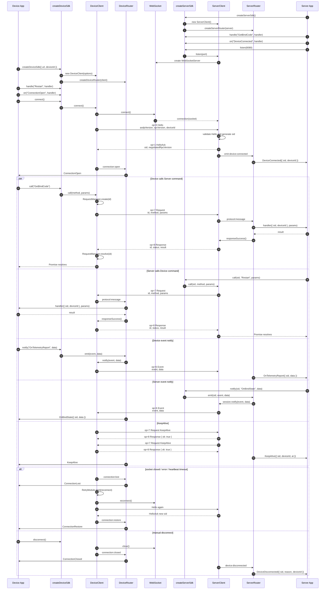
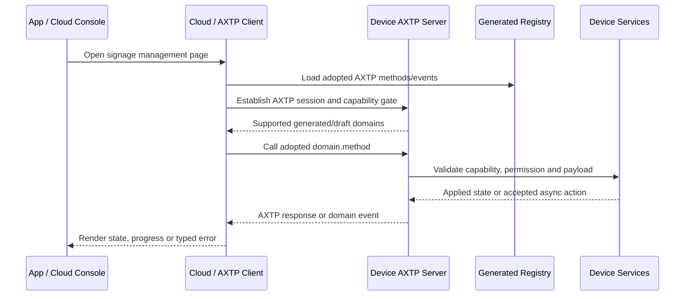

# NearHub Launcher 数字标牌设备管理协议交互 Flow

> Status: flow design
> Scope: NearHub Launcher 数字标牌设备管理、内容管理、绑定、升级和日志导出
> Source inputs: `docs/legacy-migration/evidence/NearHub-Launcher数字标牌设备管理通用管理命令.md`, `docs/legacy-migration/evidence/NearHub-Launcher设备管理命令.md`, `docs/legacy-migration/evidence/device-sdk 时序图｜2026-06-08 379995718ffb8170bcfff6a3b831e355.md`, `docs/legacy-migration/classification/by-source/signage_sdk.md`, `docs/legacy-migration/plans/signage-protocol-migration-plan.md`, `docs/generated/protocol.md`, `docs/protocol/**`
> Protocol lifecycle: Stage 10 `plan-protocol-flow`

本文把 NearHub Launcher Device SDK 中已经实现或规划的数字标牌设备管理命令，整理成 AXTP 场景级交互 flow。本文不是最终协议事实源；稳定实现合同仍以 `registry/**/*.yaml`、`registry/domains/**/*.yaml`、`protocol/axtp.protocol.yaml` 和 `docs/generated/**` 为准。

Notion 中的 `device-sdk 时序图｜2026-06-08` 已导出为本地 evidence 文件。本文采用“双轨对照”口径：先记录当前 `@saas-platform/device-sdk` 真实代码时序和 legacy envelope，再说明 AXTP `axtp_only` 目标态下的协议覆盖、缺口和后续 Stage 20 路由。

当前 generated 协议只包含 AXTP Core / connection profiles / RPC envelope / error code / `audio.algorithm`。数字标牌设备管理所需的 `device.enrollment`、`room.info`、`system.*`、`network.*`、`storage.*`、`audio.volume`、`audio.input`、`software.*`、`signage.*`、`log.*` 尚未进入 generated，不可作为 runtime 实现合同。

## 0. 速读结论

| 项目 | 内容 |
|---|---|
| Flow 目标 | 用导出的 device-sdk 真实时序校准 NearHub Launcher 数字标牌设备管理 flow，同时保留 AXTP 迁移目标和协议覆盖判断。 |
| 当前协议覆盖 | partial |
| 涉及 domain.feature | AXTP session/RPC, candidate `capability.registry`, `device.info`, candidate `device.enrollment`, `room.info`, `system.state`, candidate `system.stateReported`, `system.time`, `system.reset`, `system.lifecycle`, `network.interface`, `network.ip`, `network.wifi`, `storage.sdCard`, `audio.volume`, `audio.input`, candidate `software.update`, candidate `software.updatePolicy`, candidate `software.config`, candidate `software.appearanceConfig`, `signage.playlist`, `signage.media`, `log.export` |
| 当前代码事实 | `@saas-platform/device-sdk` 版本 `1.4.0`；HEAD `d9f24df chore(release): bump launcher version to 1.0.1`；设备端先发 `op=0 Hello`，服务端回 `op=1 HelloAck`；RPC 使用 `op=7/8`，事件使用 `op=6`。 |
| 已有 adopted/generated | AXTP Core session、RPC request/response/event envelope、connection profiles、Core/domain error codes、local generated registry；`audio.algorithm` 已 generated 但不覆盖本 flow。 |
| 缺口 | 当前 device-sdk envelope 不是最终 AXTP 合同；本 flow 的业务方法均未 adopted/generated；`device.enrollment`、`room.setName`、`software.*`、`system.stateReported`、media URL refresh、SD 格式化、playlist schema、日志导出 target/result 需要 Stage 20 补齐。 |
| 是否需要新增协议草案 | yes。优先修改已有 `docs/protocol/**` 草案；没有草案的 `device.enrollment`、`software.*` 和 `system.stateReported` 需在 Stage 20 补齐。 |
| 是否涉及 Legacy | yes。`signage_sdk` 分类中的 31 个 legacy 条目都需要映射、废弃或限定为 adapter-only。 |
| 是否涉及 STREAM | conditional。普通管理面不走 STREAM；legacy `RemoteUpgrade` 是 URL 形式的软件升级，不上传本地包流。`software.update` 后续可为本地包升级或 runtime 扩展保留 STREAM 能力。 |
| 下一步 | 使用 `draft-business-protocol` 补齐草案字段、方法和事件；当前无已采纳业务事实需要 `amend-adopted-protocol`。 |

## 1. Story Summary

| Item | Content |
|---|---|
| User goal | 运维人员、App 或云端服务通过 AXTP 管理数字标牌设备，完成上线识别、状态读取、配置修改、内容同步、升级、日志导出和纳管状态同步。 |
| Trigger | 设备启动后通过云端反连或本地 transport 建立 AXTP session；用户打开设备管理页面或服务端触发后台管理任务。 |
| Success result | 新主路径不再调用 legacy `Verb + Resource` 字符串；调用方根据 generated registry 和设备能力门禁调用标准 `domain.method`。 |
| Primary actors | User / operator, App, cloud/server, Device AXTP server, device management service, signage player service, software update service, log service |
| Product scope | NearHub Launcher digital signage SDK migration；数字标牌目标状态为 `axtp_only`，Rooms legacy compatibility profile 不进入本 flow。 |

## 2. Source Observations

### 2.1 输入来源

| Source | Observation | Flow impact |
|---|---|---|
| `NearHub-Launcher数字标牌设备管理通用管理命令.md` | 以 Device SDK Command/Event 形式列出 31 个数字标牌管理条目，包含研发状态、调用方向、payload 示例和字段表。 | 本 flow 的 legacy 覆盖主输入。 |
| `NearHub-Launcher设备管理命令.md` | 说明 Device SDK 的 `sdk.call` / `sdk.handle` / `sdk.notify` / `sdk.on` 编程模型，并单独列出 `GetBindCode`、`OnBindState`。 | 绑定流程和旧 SDK 调用形态的补充输入。 |
| `device-sdk 时序图｜2026-06-08 379995718ffb8170bcfff6a3b831e355.md` | 记录 `@saas-platform/device-sdk` `1.4.0` 的真实代码时序、验证结果、Mermaid sequence 和关键源码依据。 | 本 flow 的当前实现时序权威 evidence。 |
| `signage_sdk.md` 分类 | 已把 legacy 条目初步映射到候选 `domain.feature`。 | 作为候选路由参考，但分类中的 `firmware.ota`、`signage.schedule` 等结论需按现有草案复核。 |
| `signage-protocol-migration-plan.md` | 决策为数字标牌全量切换 AXTP，不沿用 legacy command 名作为新主路径。 | 本 flow 采用 `axtp_only` 目标；legacy 名只作溯源和短期 adapter。 |
| `docs/generated/protocol.md` | 当前仅生成 core / profiles / error / `audio.algorithm`。 | 本 flow 的业务管理能力全部不能标为 generated。 |
| 导出前 Notion `device sdk 2026 06 08` | 已导出到本地 Markdown，不再依赖在线页面。 | 删除旧在线访问阻塞项。 |

### 2.2 当前 device-sdk 实际代码流程

| Area | Actual implementation fact | Flow impact |
|---|---|---|
| Version / validation | Evidence 记录 device-sdk 版本 `1.4.0`；`pnpm -F @saas-platform/device-sdk type-check` 通过；测试 `52/53` 通过。 | 作为当前实现证据，不代表 AXTP stable contract。 |
| Known test failure | `src/sdk.spec.ts` 中 `createServerSdk register wires command/event handlers` 失败；实际 `response.d.result` 比预期多 `expiresInSeconds: 1800`。 | 绑定码 schema 需要包含或明确处理 `expiresInSeconds`，不应只按旧示例 `code/expiresAt`。 |
| Server bootstrap | `createServerSdk()` 创建 `ServerClient` 和 `ServerRouter`；Server App 注册 `handle()`、`on()` 后 `listen(port)`。 | flow 前置步骤要体现服务端先建 WebSocketServer 和 handler/event subscription。 |
| Device bootstrap | `createDeviceSdk({ url, deviceId })` 创建 `DeviceClient` 和 `DeviceRouter`；Device App 注册 `handle()`、`on()` 后 `connect()`。 | flow 前置步骤要体现设备端 handler/event subscription 早于连接。 |
| Handshake | Device WebSocket 连接后发送 `op=0 Hello(axdpVersion,rpcVersion,deviceId)`；Server 校验并返回 `op=1 HelloAck(sid,negotiatedRpcVersion)`。 | 当前代码是 device-first Hello / HelloAck，不是 AXTP 目标态的 generated Hello/Identify 表达。 |
| Session event | Server 注册 session 后触发 `DeviceConnected({ sid, deviceId })`；Device 端 `connection:open` 映射为 `ConnectionOpen`。 | 这些是 current SDK 事件，不等同于 AXTP stable business events。 |
| RPC request/response | 双方通过 `op=7 Request` 与 `op=8 Response` 执行 command；`RequestManager` 创建 id、等待、resolve/reject。 | 所有 legacy Command 都应标出当前 `sdk.call()` 形态和 AXTP 目标 method。 |
| Event notify | 双方通过 `op=6 Event` 推送 event；Device 例子是 `notify("OnTelemetryReport")`，Server 例子是 `notify(sid,"OnBindState")`。 | legacy Event 的方向和事件名需要保留为 evidence，并路由到目标 AXTP event。 |
| KeepAlive | Device 和 Server 都会自动发起 `KeepAlive` request；成功响应 `{ ok: true }`；App 层收到 KeepAlive 事件。 | 当前在线状态来自 SDK KeepAlive 和连接事件；AXTP 目标优先使用 Core/session 状态。 |
| Reconnect | socket close/error/heartbeat timeout 后，Device 触发 `ConnectionLost`，`RetryModule.start(reconnect)`，重连后触发 `ConnectionRestore`。 | flow 需要区分自动恢复和手动断开。 |
| Manual disconnect | Device App 调 `disconnect()` 后触发 `ConnectionClosed`；Server 侧触发 `DeviceDisconnected({ sid, reason, deviceId })`。 | current SDK 生命周期事件要进入事件表和测试表。 |

### 2.3 Legacy 代码文档观察

- Device SDK 将需要返回值的操作建模为 Command，将状态通知建模为 Event。
- Command 通过 `sdk.call()` 发起、`sdk.handle()` 注册处理器；Event 通过 `sdk.notify()` 发送、`sdk.on()` 监听。
- legacy 命名采用 `Verb + Resource`，例如 `GetDeviceInfo`、`SetPlaylistConfig`、`RequestLogUpload`。
- 多数 `Set*` command 的响应是 `{ "ok": true }`；AXTP 新协议应使用标准成功 status 或 typed response，不应保留无业务含义的 `ok` 字段。
- `FormatSd` 和软件升级是异步过程，需要状态查询或事件，不应只建模成同步配置写入。
- `NotifyLogUploadResult` 在旧文档中是 Device -> Server command；AXTP 里应改为日志导出状态事件。
- `GetScheduleConfig` / `SetScheduleConfig` 的字段是 `shutdown` 和 `reboot`，不是播放排期；现有 `system.lifecycle` 草案已把计划关机/计划重启收敛到 system 域。
- `GetBindCode` 的实际测试结果包含 `code`、`expiresAt` 和 `expiresInSeconds`，后续 `device.enrollment` 草案不能漏掉 `expiresInSeconds`。
- `GetDeviceInfo` 的旧响应把型号、设备名、CPU、内存、IP、MAC、版本混在一个对象里；AXTP 需要拆到 `device.info`、`system.state`、`network.interface`、`network.ip` 和软件版本相关草案。
- 本 flow 的最终定域原则是：未入管设备成为后台管理对象的过程属于 `device.enrollment`；enrollment 后生成的 room endpoint 名称和 profile 属于 `room.info`；Windows 上运行的 NearHub Launcher / signagePlayer / agent 属于 `software.*`；数字标牌播放业务才属于 `signage.*`；系统运行状态和系统级动作属于 `system.*`。

### 2.4 页面 / 控件观察

| Screen or control | Observed behavior | Protocol relevance |
|---|---|---|
| 设备列表 / 在线状态 | 旧 SDK 用 `KeepAlive` method/event 记录连接存活和最后在线。 | 优先使用 AXTP session / transport heartbeat；业务在线变化可选走 `system.lifecycleStateChanged` 或服务端本地状态。 |
| 设备概览 | 显示 model、devName、CPU、memory、IP、MAC、version。 | 拆分为 `device.info`、`room.info`、`system.state`、`network.interface`、`network.ip` 和 `software.*` 版本信息。 |
| 设备名编辑 | `SetDeviceName` 实际设置 enrollment 后后台生成的 room endpoint `displayName`。 | 映射到 `room.setName`；前置条件是 device 已 enrolled 且 `endpoint.type=room`。 |
| 系统时间 | 设置 timezone 和年月日时分秒。 | `system.time` draft。 |
| 恢复出厂 / 恢复配置 | `ResetConfig` 无参数，执行后通常重启。 | Launcher/软件默认配置恢复映射到 `software.restoreDefaultConfig`；真实系统/设备级恢复才使用 `system.reset`。 |
| 网络信息 | 返回 Wi-Fi/Ethernet 数组，含 connected、ip、mac、ssid、rssi。 | `network.interface` + `network.ip` + `network.wifi` draft 组合。 |
| SD 卡面板 | 查询状态、容量并触发格式化。 | `storage.sdCard` draft，但现草案仍偏配置模板，需要改成状态查询和格式化 action。 |
| 音频设置 | Line-out 音量、Line-in 预增益。 | `audio.volume` review-ok 覆盖 lineOut；`audio.input` 仍需字段级补齐 lineIn preGain。 |
| 软件维护 | URL 远程升级，查询进度百分比。 | Launcher / signagePlayer / agent 的升级归到 `software.update`，默认 `target=launcher`；不要命名为 firmware。 |
| 更新策略 | autoUpdate、autoUpdateWindow、channel。 | Launcher / signagePlayer / agent 的自动更新策略归到 `software.updatePolicy`。 |
| 绑定 / 纳管 | 获取 pairing code、查询/设置 enrollment 状态、设备上报 enrollment 结果。 | 归到 `device.enrollment`；不要放到 `auth`，也不要放到 `room`。 |
| 遥测 / 周期状态 | `OnTelemetryReport` 上报 temp、battery，后续也可能包含 CPU、memory、uptime、system time。 | 本 flow 按系统运行状态周期上报处理，目标事件为 `system.stateReported`。 |
| 播放列表 | `SetPlaylistConfig` 全量同步，`GetPlaylistConfig` 读取当前配置。 | `signage.playlist` draft 需要承接完整 playlist/item/settings schema。 |
| 媒体 URL 刷新 | 设备按 itemId 调 `GetPlaylistItemUrl` 获取新的 `url` 或 `urls`。 | `signage.media` draft 需要增加 refresh URL 方法；现有 `listMedia` 分类不准确。 |
| 外观配置 | panelLayout、autoHidePanel、autoHideDelay。 | NearHub Launcher 壳层外观配置归到 `software.getAppearanceConfig` / `software.setAppearanceConfig`，`target=launcher`；不要归到 signage 播放外观或 room profile。 |
| 计划任务 | shutdown/reboot 的 enabled/time/days。 | 应映射 `system.lifecycle` typed schedule，不进入 `signage.schedule` 播放排期。 |
| 日志上传 | 服务端请求打包日志并上传 OSS，设备返回 URL。 | `log.export` draft；结果通知应改为 event。 |

### 2.5 Device / System State Observations

| State | Meaning | Protocol relevance |
|---|---|---|
| session ready | 设备和云端完成 AXTP transport / session。 | generated precondition。 |
| registry known | App/Cloud 加载当前 generated protocol registry。 | generated；只包含已采纳事实。 |
| capability gated | 服务端知道当前软件/固件可用哪些 draft/adopted management capability。 | `capability.registry` draft 或产品版本门禁。 |
| overview loaded | 设备信息、room endpoint profile、状态、网络、存储、音频、纳管和内容配置已读取。 | 多个 draft query 组合。 |
| config changed | 时间、音量、update policy、playlist、Launcher appearance 等发生变化。 | feature-specific changed event；多数仍需草案补齐。 |
| destructive action accepted | reset、SD format、software update、log export 被接受。 | async state/progress event + status query。 |
| software updating | 设备执行 URL 下载、校验、安装 Launcher / signagePlayer / agent。 | `software.update` state/progress。 |
| media url expiring | 设备检测播放项资源 URL 即将过期。 | Device -> Server refresh URL method。 |
| enrollment changed | pairing code 被使用、设备纳管、解绑或绑定失败。 | `device.enrollmentStateChanged` candidate。 |
| log export ready | 日志完成打包和上传。 | `log.exportStateChanged` event。 |

## 3. Assumptions And Non-Goals

| Type | Item | Status |
|---|---|---|
| Assumption | 数字标牌新主路径目标为 `axtp_only`；legacy command 只保留为溯源、测试 fixture 或短期灰度 adapter。 | `[REVIEW-OK]` |
| Assumption | 导出的 `device-sdk 时序图｜2026-06-08` 是当前 `@saas-platform/device-sdk` 实际流程的权威 evidence。 | `[REVIEW-OK]` |
| Assumption | 设备可以通过 `AXTP-WS-CLOUD-REVERSE` 连接云端；本地调试也可使用 generated profiles 支持的 transport。 | `[REVIEW-DRAFT]` |
| Assumption | `SetPlaylistConfig` 是全量替换语义，不是 patch；第二次下发会删除未出现在新配置中的旧播放列表或播放项。 | `[REVIEW-DRAFT]` |
| Assumption | legacy `RemoteUpgrade` 是 Launcher / signagePlayer / agent 的 URL 软件升级，不要求在本 flow 中上传本地包 STREAM，也不要命名为 firmware。 | `[REVIEW-OK]` |
| Assumption | legacy `SetDeviceName` 实际设置 enrollment 后后台生成的 room endpoint `displayName`，目标为 `room.setName`。 | `[REVIEW-OK]` |
| Assumption | `GetAppearanceConfig` / `SetAppearanceConfig` 是 NearHub Launcher 壳层外观配置，目标为 `software.getAppearanceConfig` / `software.setAppearanceConfig`，`target=launcher`。 | `[REVIEW-OK]` |
| Question | 是否需要继续从 `/Users/was/Desktop/code/aw-saas-platform` 实际源码抽取 retry 参数、超时配置、错误码和边界分支？ | `[REVIEW-ASK]` |
| Question | `OnTelemetryReport` 除 temp/battery、CPU、内存、uptime、system time 外是否还有播放状态、资源状态或告警字段？ | `[REVIEW-ASK]` |
| Non-goal | 本文不修改 `docs/protocol/**`、registry YAML、Protocol IR 或 generated 文件。 | `[REVIEW-OK]` |
| Non-goal | 本文不把 Rooms legacy profile 的 parser/router 方案搬到数字标牌；Rooms 兼容策略由 `rooms-protocol-migration-plan.md` 独立约束。 | `[REVIEW-OK]` |
| Non-goal | 本文不为每个 legacy command 保留同名 AXTP method；新协议使用 `domain.method`。 | `[REVIEW-OK]` |

## 4. Protocol Coverage

| Need | Coverage state | AXTP protocol | Evidence | Next action |
|---|---|---|---|---|
| 建立管理会话 | generated | AXTP session/RPC profiles, `AXTP-WS-CLOUD-REVERSE` | `docs/generated/protocol.md` | 可直接按 generated Core 实现。 |
| 保活和最后在线 | generated / draft | Core heartbeat; optional `system.lifecycleStateChanged` | `docs/generated/protocol.md`, `docs/protocol/system/system.lifecycle.md` | Core 层可实现；业务 last-online event 需草案确认。 |
| 加载正式协议事实 | generated | local generated registry | `docs/generated/method_registry.generated.md` | App/Cloud 只能把 generated 内容当合同。 |
| 运行时能力发现 | draft | `capability.registry` | `docs/protocol/capability/capability.registry.md` | 采纳前用软件版本、固件版本或产品 profile 明确门禁。 |
| 设备身份和静态信息 | draft | `device.info` | `docs/protocol/device/device.info.md` | 复用只读草案；旧 `devName` 写入不进入该 feature。 |
| CPU/内存/在线运行状态 | draft | `system.state` | `docs/protocol/system/system.state.md` | 从旧 `GetDeviceInfo` 拆出运行状态字段。 |
| 修改房间 endpoint 名称 | draft gap | `room.info` / candidate `room.setName` | `docs/protocol/room/room.info.md`, legacy `SetDeviceName` | 前置条件：device 已 enrolled，且后台 endpoint 存在并满足 `endpoint.type=room`。 |
| 设置系统时间 | draft | `system.time` | `docs/protocol/system/system.time.md` | 补 timezone、年月日时分秒或 epoch 策略。 |
| Launcher 默认配置恢复 | missing | candidate `software.restoreDefaultConfig` | legacy `ResetConfig` | Launcher / signagePlayer / agent 默认配置恢复归到 software；真实系统/设备级恢复才走 `system.reset`。 |
| 系统/设备级恢复 | draft | `system.reset` | `docs/protocol/system/system.reset.md` | 明确系统 restore scope、preserve、绑定/网络/媒体缓存清除策略。 |
| 网络信息读取 | draft | `network.interface`, `network.ip`, `network.wifi` | `docs/protocol/network/network.interface.md`, `docs/protocol/network/network.ip.md`, `docs/protocol/network/network.wifi.md` | legacy 聚合 response 拆成接口、IP、Wi-Fi 状态。 |
| SD 卡状态和格式化 | draft | `storage.sdCard` | `docs/protocol/storage/storage.sdCard.md` | 把配置模板改成 `getSdCardState`、`formatSdCard`、format state event。 |
| Line-out 音量 | draft | `audio.volume` | `docs/protocol/audio/audio.volume.md` | 使用 `lineOut` target；补范围、单位、默认值。 |
| Line-in 预增益 | draft | `audio.input` | `docs/protocol/audio/audio.input.md` | 补 `lineIn` target、`preGain` 范围和单位。 |
| URL 软件升级和进度 | missing | candidate `software.update` | legacy `RemoteUpgrade`, `UpgradeProgress` | 使用 `software.beginUpdate(source.type=url,target=launcher)`、`software.getUpdateState` 和 `software.updateStateChanged`。 |
| 自动更新策略 | missing | candidate `software.updatePolicy` | legacy `GetUpdateConfig`, `SetUpdateConfig` | 使用 `software.getUpdatePolicy` / `software.setUpdatePolicy`，补 autoUpdate、window、channel、targets、跨日语义。 |
| 绑定码和纳管状态 | missing | candidate `device.enrollment` | legacy docs | 使用 `device.getPairingCode`、`device.getEnrollmentState`、`device.setEnrollmentState`、`device.enrollmentStateChanged`；不放到 auth 或 room。 |
| 周期性系统状态上报 | draft gap | `system.state` / candidate `system.stateReported` | `docs/protocol/system/system.state.md`, legacy docs | 上报 CPU、memory、uptime、system time、temp/battery 等系统运行状态；播放状态另行拆域。 |
| 播放列表全量同步 | draft | `signage.playlist` | `docs/protocol/signage/signage.playlist.md` | 补完整 playlist/item/settings schema 和全量替换语义。 |
| 播放项 URL 刷新 | draft gap | `signage.media` | `docs/protocol/signage/signage.media.md` | 增加 `refreshPlaylistItemUrl` 或等价方法，替代泛 `listMedia`。 |
| Launcher 外观/面板配置 | missing | candidate `software.getAppearanceConfig`, `software.setAppearanceConfig` | legacy `GetAppearanceConfig`, `SetAppearanceConfig` | `target=launcher`；不归到 signage 播放外观、room profile 或 OSD。 |
| 定时关机/重启 | draft | `system.lifecycle` schedules | `docs/protocol/system/system.lifecycle.md` | 从 `signage.schedule` 分类纠偏到 system lifecycle typed schedule。 |
| 日志导出 | draft | `log.export` | `docs/protocol/log/log.export.md` | 补 OSS target/credential/result URL，并把 result notify 改为 event。 |

Coverage 取值：

| Coverage | Meaning |
|---|---|
| generated | 已进入 `docs/generated/**` 或 protocol IR，可作为实现合同视图。 |
| adopted | 已写入 registry YAML，但当前 flow 未直接引用 generated 输出。 |
| draft | 已有 `docs/protocol/**` 草案，但尚未 adopted/generated。 |
| draft gap | 已有相邻草案或目标 domain，但缺少本 flow 需要的方法、事件或 schema。 |
| missing | 没有合适的 adopted/generated/draft 协议覆盖。 |
| current SDK | 当前 `@saas-platform/device-sdk` 真实实现事实，只作 legacy/current evidence。 |
| local-only | App/UI/runtime 本地逻辑，不需要 AXTP 协议。 |
| non-protocol | 产品规则、人工流程、运营策略或文档说明，不进入协议。 |

## 5. End-To-End Sequence

### 5.1 Current device-sdk implementation sequence

### 5.2 AXTP target migration sequence

当前 device-sdk 的 `op=0/1/6/7/8`、`sdk.call()`、`sdk.notify()` 和 legacy method/event 名只作为迁移 evidence。AXTP 目标态必须使用 generated registry 中的 `domain.method` / event / schema；未 adopted/generated 的业务能力只能标为 draft 或 missing。

## 6. Interaction Steps

| Step | Actor | Action | Capability / precondition | Protocol call/event | Payload fields | Result / state change | Coverage | Error / fallback |
|---:|---|---|---|---|---|---|---|---|
| 1 | Server App | 初始化当前 SDK 服务端。 | device-sdk `1.4.0`。 | `createServerSdk()` | none | 创建 `ServerClient` 和 `ServerRouter`。 | current SDK | 非 AXTP generated fact。 |
| 2 | Server App | 注册服务端 command/event。 | Server SDK initialized。 | `handle("GetBindCode")`, `on("DeviceConnected")` | handler, listener | ServerRouter 保存 handler/subscription。 | current SDK | 未注册 handler 时 legacy request 会失败或超时。 |
| 3 | Server App / ServerClient | 启动监听。 | port available。 | `listen(8080)` | port | 创建 WebSocketServer。 | current SDK | 端口占用或 listen 失败由 SDK/运行时处理。 |
| 4 | Device App | 初始化当前 SDK 设备端。 | url, deviceId available。 | `createDeviceSdk({ url, deviceId })` | url, deviceId | 创建 `DeviceClient` 和 `DeviceRouter`。 | current SDK | deviceId 缺失会影响 Hello。 |
| 5 | Device App | 注册设备端 command/event。 | Device SDK initialized。 | `handle("Restart")`, `on("ConnectionOpen")` | handler, listener | DeviceRouter 保存 handler/subscription。 | current SDK | 注册时机应早于 `connect()`。 |
| 6 | Device / Server | 建立当前 SDK WebSocket 连接。 | Server listen ready。 | `connect()` then socket connection | url | socket connected。 | current SDK | socket 错误进入 reconnect 分支。 |
| 7 | DeviceClient / ServerClient | 完成当前 SDK 握手。 | socket connected。 | `op=0 Hello` -> `op=1 HelloAck` | axdpVersion, rpcVersion, deviceId, sid, negotiatedRpcVersion | Server 注册 session；Device 保存 sid。 | current SDK | Hello 校验失败不能进入业务 command。 |
| 8 | ServerRouter / DeviceRouter | 抛出连接事件。 | session registered。 | `DeviceConnected`, `ConnectionOpen` | sid, deviceId | App 层感知设备在线。 | current SDK | 这些是 SDK 事件，不是 AXTP stable events。 |
| 9 | Device / Server | 当前 SDK 维护在线状态。 | session ready。 | bidirectional `op=7 Request KeepAlive` / `op=8 Response { ok: true }` | sid, deviceId, at | 双方维持连接并抛出 KeepAlive。 | current SDK | heartbeat timeout 进入 `ConnectionLost` / reconnect。 |
| 10 | Cloud / App | AXTP 目标态加载 generated registry。 | spec lock available。 | local registry lookup | method/event/capability names | 确认当前正式合同只含 Core 和 `audio.algorithm`。 | generated | 不把 draft-only 名称当 stable 合同。 |
| 11 | Cloud / Device | AXTP 目标态查询运行时能力或产品 profile。 | capability gate required。 | `capability.registry` candidate | supported methods/events | 决定页面显示和可调用功能。 | draft | 采纳前用软件版本、固件版本、产品型号或 adapter gate。 |
| 12 | App / Cloud / Device | 打开设备概览。 | 当前 SDK session ready；AXTP 目标 capability gate 通过。 | Current: `call("GetDeviceInfo")`; Target: `device.getInfo`, `room.getProfile`, `system.getState`, network queries, software version query | legacy flat fields; target selectors | UI 展示型号、room displayName、CPU、内存、IP、MAC、Launcher 版本。 | draft / missing | 旧扁平 payload 只作 evidence，目标 schema 需拆域。 |
| 13 | App / Cloud / Device | 修改 room endpoint 名称。 | device 已 enrolled；后台 endpoint 存在且 `endpoint.type=room`。 | Current: `call("SetDeviceName")`; Target: `room.setName` | roomEndpointId or endpoint selector, displayName | room endpoint `displayName` 更新；当前 SDK 可返回 `{ ok: true }`。 | draft gap | 不映射到只读 `device.info`，也不是未纳管设备名称。 |
| 14 | App / Cloud / Device | 设置系统时间。 | `system.time` target supported。 | Current: `call("SetSysTime")`; Target: `system.setTimeConfig` candidate | timezone, year, month, day, hour, minute, second | 时间和时区更新。 | draft | 需定义 NTP、非法时区和立即生效策略。 |
| 15 | App / Cloud / Device | 恢复 Launcher 默认配置。 | `software.restoreDefaultConfig` target supported；危险操作确认。 | Current: `call("ResetConfig")`; Target: `software.restoreDefaultConfig` | target=`launcher`, scope, preserve, confirmationToken | 异步 restore accepted，可能重启软件或设备。 | missing | 如果是系统/设备级恢复，另走 `system.reset`；需确认 legacy `ResetConfig` 的真实 scope。 |
| 16 | App / Cloud / Device | 读取网络信息。 | network target drafts supported。 | Current: `call("GetNetworkInfo")`; Target: `network.getInterfaces`, `network.getIpConfig`, `network.getWifiState` | connected, ip, mac, ssid, rssi | 返回 Ethernet/Wi-Fi 链路、IP、MAC、SSID、RSSI。 | draft | 单一 `network.ip` 无法表达 Wi-Fi SSID/RSSI。 |
| 17 | App / Cloud / Device | 查询 SD 卡状态。 | `storage.sdCard` target supported。 | Current: `call("GetSDInfo")`; Target: `storage.getSdCardState` candidate | status, totalSize, availableSize | 返回状态、总容量、可用容量。 | draft | 现草案需从 config 模板改为 state/action。 |
| 18 | App / Cloud / Device | 格式化 SD 卡。 | 用户确认，设备不忙。 | Current: `call("FormatSd")`; Target: `storage.formatSdCard` + state event | target, filesystem, confirmation | 创建格式化任务并通过事件/查询完成。 | draft | 需定义 busy、取消、媒体占用和失败原因。 |
| 19 | App / Cloud / Device | 设置或读取 Line-out 音量。 | `audio.volume` target supported。 | Current: `Get/SetLineOutVolume`; Target: `audio.getVolumeState`, `audio.setVolumeState` | target=`lineOut`, level, muted | 音量生效并同步 UI。 | draft | 范围、单位、步进、默认值待确认。 |
| 20 | App / Cloud / Device | 设置或读取 Line-in 预增益。 | `audio.input` target supported。 | Current: `Get/SetLineInPreGain`; Target: `audio.getInputConfig`, `audio.setInputConfig` | target=`lineIn`, `preGain` | 输入预增益生效。 | draft | `preGain` 单位和范围未知。 |
| 21 | App / Cloud / Device | 发起 URL 软件升级。 | `software.update` target supported。 | Current: `call("RemoteUpgrade")`; Target: `software.beginUpdate` | target=`launcher`, source.type=url, url, package metadata, checksum, installPolicy, restartPolicy | 设备开始下载、校验、安装 Launcher / signagePlayer / agent。 | missing | 不新增 `RemoteUpgrade` stable method；不要命名为 firmware。 |
| 22 | App / Cloud / Device | 查询或接收软件升级进度。 | update session exists。 | Current: `call("UpgradeProgress")`; Target: `software.getUpdateState`, `software.updateStateChanged` | updateSessionId, target, phase, progress, state | UI 展示进度和最终状态。 | missing | 事件丢失时轮询。 |
| 23 | App / Cloud / Device | 获取或修改自动更新策略。 | `software.updatePolicy` target supported。 | Current: `Get/SetUpdateConfig`; Target: `software.getUpdatePolicy`, `software.setUpdatePolicy` | targets, autoUpdate, window.start, window.end, channel | 策略保存并通知变化。 | missing | 跨日窗口、channel 枚举和多 target 语义待确认。 |
| 24 | Device / Server | 获取 pairing code。 | Server registered `GetBindCode` handler。 | Current: Device `call("GetBindCode")`; Target: `device.getPairingCode` | code, expiresAt, expiresInSeconds | 返回 pairing code 和过期信息。 | missing | `expiresInSeconds` 是当前测试暴露字段，`device.enrollment` 草案不能漏。 |
| 25 | Server / Device | 查询或设置 enrollment 状态。 | `device.enrollment` semantics defined。 | Current: `GetBindConfig` / `SetBindConfig`; Target: `device.getEnrollmentState`, `device.setEnrollmentState` | enrolled, endpointId, endpoint.type, account/tenant claim fields | 设备纳管状态同步。 | missing | room 只是 enrollment 后的 endpoint 目标，不承载纳管动作。 |
| 26 | Device / Server | 上报 enrollment 结果。 | enrollment attempt finished。 | Current: `notify("OnBindState")`; Target: `device.enrollmentStateChanged` | state, code, message, endpoint summary | 服务端更新设备纳管流程。 | missing | 旧 success/failed 不足以表达 pending/unbound/unmanaged。 |
| 27 | Device / Server | 周期性上报系统状态。 | `system.stateReported` target supported。 | Current: `notify("OnTelemetryReport")`; Target: `system.stateReported` | cpu, memory, uptime, systemTime, temp, battery, sampledAt | 服务端记录系统运行状态或告警。 | draft gap | 若包含播放状态或资源状态，后续拆到 signage/software 专项事件。 |
| 28 | Cloud / Device | 全量同步播放列表。 | `signage.playlist` target supported。 | Current: `call("SetPlaylistConfig")`; Target: `signage.setPlaylistConfig` | playlists, items, type, duration, settings | 播放器替换完整配置。 | draft | 草案需补完整 schema 和全量替换规则。 |
| 29 | Cloud / Device | 读取播放列表。 | `signage.playlist` target supported。 | Current: `call("GetPlaylistConfig")`; Target: `signage.getPlaylistConfig` | selector | 返回当前完整 playlist config。 | draft | set/get schema 应一致。 |
| 30 | Device / Server | 刷新播放项 URL。 | media refresh supported。 | Current: Device `call("GetPlaylistItemUrl")`; Target: `signage.refreshPlaylistItemUrl` candidate | itemId | 返回 `url` 或 `urls`、expiresAt。 | draft gap | 当前 `signage.media` 泛配置命名不足。 |
| 31 | Cloud / Device | 获取或设置 Launcher 外观/面板配置。 | `software.appearanceConfig` target supported。 | Current: `Get/SetAppearanceConfig`; Target: `software.getAppearanceConfig`, `software.setAppearanceConfig` | target=`launcher`, panelLayout, autoHidePanel, autoHideDelay | Launcher 壳层外观配置生效。 | missing | 不归到 signage 播放外观、room profile 或 OSD。 |
| 32 | Cloud / Device | 获取或设置定时关机/重启。 | `system.lifecycle` schedule target supported。 | Current: `Get/SetScheduleConfig`; Target: lifecycle schedule methods | enabled, time, days | lifecycle schedule 保存。 | draft | 不应落到 `signage.schedule` 播放排期。 |
| 33 | Cloud / Device | 请求日志上传。 | `log.export` target supported。 | Current: `call("RequestLogUpload")`; Target: `log.createExport` | scope, target, credentials | 创建日志导出任务。 | draft | OSS target、凭证、隐私范围待补。 |
| 34 | Device / Server | 通知日志上传结果。 | export task exists。 | Current: `call("NotifyLogUploadResult")`; Target: `log.exportStateChanged` | taskId, state, url, error | Cloud 获得下载 URL 或失败原因。 | draft | 旧 command 应改 AXTP event。 |

## 7. State Changes And Events

| State change | Trigger | Event needed | Payload | Client handling | Coverage |
|---|---|---|---|---|---|
| current SDK server sees device | Server validates `op=0 Hello` and registers sid | `DeviceConnected` | sid, deviceId | Server App 更新设备在线和 sid 映射。 | current SDK |
| current SDK device connected | Device receives `op=1 HelloAck` and marks connected | `ConnectionOpen` | none / connection context | Device App 进入可调用状态。 | current SDK |
| current SDK heartbeat | either side sends `KeepAlive` request | `KeepAlive` | sid, deviceId, at or local event | 更新最后在线时间；不作为 AXTP stable event。 | current SDK |
| current SDK connection lost | socket close, error or heartbeat timeout | `ConnectionLost` | connection context | Device App 可提示离线并等待 retry。 | current SDK |
| current SDK reconnect restored | `RetryModule.start(reconnect)` succeeds and new HelloAck arrives | `ConnectionRestore` | new sid / connection context | Device App 恢复业务调用，Server 侧需更新 sid。 | current SDK |
| current SDK manual close | Device App calls `disconnect()` | `ConnectionClosed`, `DeviceDisconnected` | sid, reason, deviceId | 明确区别手动断开和自动重连。 | current SDK |
| AXTP target device online/offline | AXTP session connected/disconnected or heartbeat lost | optional `system.lifecycleStateChanged` | device id, online state, reason | 更新设备列表；Core session 状态可先覆盖。 | generated / draft |
| system state reported | 周期性系统运行状态上报或阈值变化 | `system.stateReported` candidate | cpu, memory, uptime, systemTime, temp, battery, sampledAt | 刷新概览、记录趋势或触发告警。 | draft gap |
| reset progress | reset action accepted | `system.resetStatusChanged` | actionId, status, progress, disconnectExpected | 展示危险操作进度并处理重连。 | draft |
| software config restore progress | Launcher / signagePlayer / agent 默认配置恢复 accepted | `software.configRestoreStateChanged` candidate | taskId, target, scope, state, progress, error | 展示恢复进度，必要时等待软件或设备重启。 | missing |
| SD format progress | format action accepted | `storage.sdCardFormatStateChanged` candidate | taskId, state, progress, error | 禁用 SD 操作，完成后刷新容量。 | draft |
| audio state changed | lineOut volume changed | `audio.volumeStateChanged` candidate | target, level, muted, revision | 同步音量 UI。 | draft |
| input config changed | lineIn preGain changed | `audio.inputConfigChanged` | target, preGain | 同步输入设置。 | draft |
| software update progress | URL update started | `software.updateStateChanged` candidate | updateSessionId, target, phase, progress, state | 显示下载/校验/安装状态。 | missing |
| software update policy changed | policy saved or device policy changed | `software.updatePolicyChanged` candidate | targets, autoUpdate, window, channel | 刷新更新策略页面。 | missing |
| enrollment state changed | pairing code 使用、设备纳管、解绑、纳管失败 | `device.enrollmentStateChanged` candidate | state, code/message, endpoint/account/tenant summary | 更新纳管页面和设备列表。 | missing |
| playlist replaced | full playlist set succeeds | `signage.playlistConfigChanged` | version, playlist summary | 刷新播放列表和下载队列。 | draft |
| media URL refreshed | item URL expiring | response-only or media event | itemId, url/urls, expiresAt | 更新本地资源引用。 | draft gap |
| Launcher appearance changed | panel config saved | `software.appearanceConfigChanged` candidate | target, panelLayout, autoHidePanel, autoHideDelay | 更新 Launcher 壳层面板。 | missing |
| lifecycle schedule changed | reboot/shutdown schedule saved | `system.lifecycleStateChanged` or schedule-specific event | schedule summary | 刷新计划任务设置。 | draft |
| log export completed | export/upload task completes | `log.exportStateChanged` | taskId, state, url/error | 展示下载链接或失败原因。 | draft |

## 8. Protocol Details

### 8.1 Generated AXTP facts and current device-sdk facts

| Fact | Purpose in this flow | Source |
|---|---|---|
| AXTP session / RPC envelope | 迁移目标中替代旧 Device SDK command/event envelope。 | `docs/generated/protocol.md`, `protocol/axtp.protocol.yaml` |
| `AXTP-WS-CLOUD-REVERSE` | 迁移目标中数字标牌设备可由设备侧发起云端 WebSocket 反连，但逻辑上仍是 RPC server。 | `docs/generated/protocol.md` |
| Core and domain error codes | 迁移目标中统一表达 method not found、invalid argument、not supported、permission denied、busy 等错误。 | `docs/generated/protocol.md`, `registry/error/error_code.yaml` |
| Local generated registry | App/Cloud 用于确认已采纳 method/event；当前不含本 flow 的业务管理方法。 | `docs/generated/method_registry.generated.md`, `docs/generated/event_registry.generated.md` |
| `audio.algorithm` generated methods/events | 已生成但只覆盖音频算法参数，不覆盖 Line-out 音量或 Line-in 预增益。 | `docs/generated/protocol.md` |
| current `@saas-platform/device-sdk` envelope | 当前代码真实使用 legacy SDK op/envelope、method string 和 event string。 | `docs/legacy-migration/evidence/device-sdk 时序图｜2026-06-08 379995718ffb8170bcfff6a3b831e355.md` |

Current device-sdk op 表：

| op | Name | Direction / usage | Payload fields | AXTP migration note |
|---:|---|---|---|---|
| `0` | `Hello` | DeviceClient -> ServerClient after WebSocket connect | axdpVersion, rpcVersion, deviceId | 当前代码握手；不是 generated AXTP business method。 |
| `1` | `HelloAck` | ServerClient -> DeviceClient after Hello validation | sid, negotiatedRpcVersion | Server 分配 sid；reconnect 后可产生 new sid。 |
| `6` | `Event` | bidirectional notify | event, data | legacy `OnTelemetryReport` / `OnBindState` 等应映射到 `system.stateReported` / `device.enrollmentStateChanged` 等 AXTP events。 |
| `7` | `Request` | bidirectional command call | id, method, params | legacy `Verb + Resource` method string 应映射到 `domain.method`。 |
| `8` | `Response` | response to `op=7` | id, status, result | `RequestManager` resolve/reject；旧 `{ ok: true }` 不应直接冻结为 AXTP schema。 |

Current device-sdk source evidence:

| Source path in upstream package | Evidence |
|---|---|
| `packages/device-sdk/src/sdk.ts` | `createDeviceSdk` / `createServerSdk` 封装 register、handle、on、call、notify、connect/listen。 |
| `packages/device-sdk/src/clients/device-client.ts` | 设备端 WebSocket 连接、Hello、sid 保存、心跳、断线重连。 |
| `packages/device-sdk/src/clients/server-client.ts` | 服务端 WebSocketServer、Hello 校验、HelloAck、session 注册、设备连接/断开事件。 |
| `packages/device-sdk/src/clients/base-client.ts` | `op=6` 事件、`op=7` 请求、`op=8` 响应、KeepAlive 自动响应、RequestManager resolve/reject。 |
| `packages/device-sdk/src/router/device-router.ts` / `server-router.ts` | 命令 handler、事件订阅和双向 emit。 |
| `packages/device-sdk/src/router/device-router.events.ts` / `server-router.events.ts` | `connection:open` -> `ConnectionOpen`、`device:connected` -> `DeviceConnected` 等事件映射。 |
| `packages/device-sdk/src/protocol/types.ts` | `HelloData`、`HelloAckData`、`RequestData`、`ResponseData`、`EventData` 结构定义。 |
| `packages/device-sdk/src/core/request-manager.ts` | RPC 请求等待、超时、resolve/reject。 |

### 8.2 Draft Or Missing Protocol Gaps

| Gap | Candidate domain.feature | Candidate method/event/schema | Routed skill | Review question |
|---|---|---|---|---|
| 运行时 supported methods/events 未 generated | `capability.registry` | supported methods/events/capabilities query | `draft-business-protocol` | `[REVIEW-ASK]` 是否需要动态 capability 查询，还是产品固件版本静态门禁足够？ |
| 旧 `GetDeviceInfo` 混合多域字段 | `device.info`, `room.info`, `system.state`, `network.*`, `software.*` | `device.getInfo`, `room.getProfile`, `system.getState`, network queries, software version query | `draft-business-protocol` | `[REVIEW-ASK]` version 属于 Launcher、signagePlayer、agent 还是 AXTP runtime？ |
| `SetDeviceName` 实际写 room endpoint 名称 | `room.info` | `room.setName` | `draft-business-protocol` | `[REVIEW-OK]` 前置条件为 device 已 enrolled 且 `endpoint.type=room`。 |
| 设备纳管 / pairing code 不是 auth | `device.enrollment` | `device.getPairingCode`, `device.getEnrollmentState`, `device.setEnrollmentState`, `device.enrollmentStateChanged` | `draft-business-protocol` | `[REVIEW-OK]` 不放到认证会话或 room 业务域。 |
| Launcher 默认配置恢复不是系统恢复 | `software.config` | `software.restoreDefaultConfig`, `software.configRestoreStateChanged` | `draft-business-protocol` | `[REVIEW-ASK]` legacy `ResetConfig` 是否仅恢复 Launcher 配置，还是也触发系统级 reset？ |
| SD 卡格式化不是普通 config set | `storage.sdCard` | `storage.getSdCardState`, `storage.formatSdCard`, format event | `draft-business-protocol` | `[REVIEW-ASK]` 是否需要进度、取消、媒体占用错误？ |
| Line-in preGain 字段缺失 | `audio.input` | lineIn target config/state | `draft-business-protocol` | `[REVIEW-ASK]` preGain 单位、范围、步进和默认值是什么？ |
| URL 升级分类仍有旧固件命名 | `software.update` | `software.beginUpdate(source.type=url,target=launcher)`, `software.getUpdateState`, `software.updateStateChanged` | `draft-business-protocol` | `[REVIEW-OK]` Launcher / signagePlayer / agent 是软件对象，不新增 firmware 目标。 |
| 自动更新策略仍缺软件目标维度 | `software.updatePolicy` | `software.getUpdatePolicy`, `software.setUpdatePolicy`, `software.updatePolicyChanged` | `draft-business-protocol` | `[REVIEW-ASK]` P0 targets 是否仅 launcher，还是同时覆盖 signagePlayer / agent？ |
| 周期性系统状态上报缺少 reported event | `system.state` | `system.stateReported` | `draft-business-protocol` | `[REVIEW-ASK]` 除 temp/battery、CPU、memory、uptime、system time 外还有哪些字段和频率？ |
| Playlist schema 未承接 legacy payload | `signage.playlist` | playlist config schema, full replace method, changed event | `draft-business-protocol` | `[REVIEW-ASK]` clock、website、slideshow 的 settings 是否全部进入 P0？ |
| 播放项 URL 刷新命名不准 | `signage.media` | `signage.refreshPlaylistItemUrl` candidate | `draft-business-protocol` | `[REVIEW-ASK]` response 的 `url` 和 `urls` 二选一是否保留，还是用 typed media URL list？ |
| Launcher 外观配置不是 signage 播放业务 | `software.appearanceConfig` | `software.getAppearanceConfig`, `software.setAppearanceConfig`, `software.appearanceConfigChanged` | `draft-business-protocol` | `[REVIEW-OK]` `panelLayout` / auto-hide 属于 Launcher 壳层，`target=launcher`。 |
| shutdown/reboot schedule 分类需纠偏 | `system.lifecycle` | reboot/shutdown typed schedule get/set/cancel | `draft-business-protocol` | `[REVIEW-OK]` 旧字段是设备生命周期计划，不进入 `signage.schedule`。 |
| 日志导出结果仍是 legacy command | `log.export` | `log.createExport`, `log.exportStateChanged` | `draft-business-protocol` | `[REVIEW-ASK]` OSS 凭证、URL 过期、隐私 scope 和失败原因如何表达？ |

### 8.3 Legacy Mapping Checklist

| Legacy entry | Direction | Standard AXTP target for this flow | Coverage | Follow-up |
|---|---|---|---|---|
| `KeepAlive` method/event | Server <-> Device | Core heartbeat; optional `system.lifecycle` | generated / draft | 确认是否需要业务 last-online event。 |
| `GetDeviceInfo` | Server -> Device | `device.info` + `room.info` + `system.state` + `network.*` + `software.*` | draft / missing | 拆分旧扁平 response。 |
| `SetDeviceName` | Server -> Device, Device -> Server | `room.setName` | draft gap | 只在 device 已 enrolled 且 `endpoint.type=room` 时有效。 |
| `SetSysTime` | Server -> Device | `system.time` | draft | 补时间格式和 NTP 策略。 |
| `ResetConfig` | Server -> Device | `software.restoreDefaultConfig` for Launcher defaults; `system.reset` only for true system restore | missing / draft | 确认 legacy action 的真实 scope。 |
| `GetNetworkInfo` | Server -> Device | `network.interface` + `network.ip` + `network.wifi` | draft | 拆 Wi-Fi/Ethernet 聚合字段。 |
| `GetSDInfo` / `FormatSd` | Server -> Device | `storage.sdCard` | draft | 补状态查询、格式化 action 和 event。 |
| `SetLineOutVolume` / `GetLineOutVolume` | Server -> Device | `audio.volume` | draft | 使用 `lineOut` target。 |
| `SetLineInPreGain` / `GetLineInPreGain` | Server -> Device | `audio.input` | draft | 补 `preGain` schema。 |
| `RemoteUpgrade` / `UpgradeProgress` | Server -> Device | `software.update` URL source and state | missing | 使用 `software.beginUpdate` / `software.getUpdateState` / `software.updateStateChanged`，默认 `target=launcher`。 |
| `GetUpdateConfig` / `SetUpdateConfig` | Server <-> Device | `software.updatePolicy` | missing | 补 targets、autoUpdate、window、channel schema。 |
| `GetBindCode` / `GetBindConfig` / `SetBindConfig` / `OnBindState` | Server <-> Device | `device.enrollment` | missing | 使用 pairing code、enrollment state 和 enrollment state event。 |
| `OnTelemetryReport` | Device -> Server | `system.stateReported` | draft gap | 周期性系统状态上报；播放状态另拆。 |
| `SetPlaylistConfig` / `GetPlaylistConfig` | Server -> Device | `signage.playlist` | draft | 补完整 playlist schema。 |
| `GetPlaylistItemUrl` | Device -> Server | `signage.media` URL refresh | draft gap | 重新命名 refresh method。 |
| `GetAppearanceConfig` / `SetAppearanceConfig` | Server <-> Device | `software.getAppearanceConfig` / `software.setAppearanceConfig` | missing | `target=launcher`；不归到 signage 或 room。 |
| `GetScheduleConfig` / `SetScheduleConfig` | Server <-> Device | `system.lifecycle` reboot/shutdown schedules | draft | 修正旧分类中 `signage.schedule` 结论。 |
| `RequestLogUpload` / `NotifyLogUploadResult` | Server -> Device / Device -> Server | `log.createExport`, `log.exportStateChanged` | draft | 将结果通知改为 event。 |

## 9. Test / Conformance Notes

| Case | Given | When | Then | Protocol evidence |
|---|---|---|---|---|
| current server listen | Server App calls `createServerSdk()` and registers handlers | `listen(8080)` | `ServerClient` creates WebSocketServer and `ServerRouter` holds handlers/subscriptions | device-sdk evidence |
| current device connect | Device App calls `createDeviceSdk({ url, deviceId })` | `connect()` opens WebSocket | Device sends `op=0 Hello` with axdpVersion, rpcVersion, deviceId | device-sdk evidence |
| current HelloAck sid | Server validates Hello | Server sends `op=1 HelloAck` | Device saves sid; Server emits `DeviceConnected`; Device emits `ConnectionOpen` | device-sdk evidence |
| current device command | Device calls `call("GetBindCode")` | Server handler returns result | `op=7 Request` resolves through `op=8 Response`; result may include `expiresInSeconds: 1800` | device-sdk evidence |
| current server command | Server calls `call(sid,"Restart",params)` | Device handler returns result | Server promise resolves after `op=8 Response` | device-sdk evidence |
| current device event | Device calls `notify("OnTelemetryReport", data)` | Server receives `op=6 Event` | Server App handler receives `OnTelemetryReport({ sid, data })` | device-sdk evidence |
| current server event | Server calls `notify(sid,"OnBindState", data)` | Device receives `op=6 Event` | Device App handler receives `OnBindState({ sid, data })` | device-sdk evidence |
| current KeepAlive | SDK connection is open | Either side sends `KeepAlive` request | Peer responds `{ ok: true }`; App layer sees KeepAlive event | device-sdk evidence |
| current reconnect | socket closes, errors, or heartbeat times out | `RetryModule.start(reconnect)` succeeds | Device emits `ConnectionLost` then `ConnectionRestore`; Server may issue new sid | device-sdk evidence |
| current manual disconnect | Device App calls `disconnect()` | socket closes intentionally | Device emits `ConnectionClosed`; Server emits `DeviceDisconnected({ sid, reason, deviceId })` | device-sdk evidence |
| AXTP session happy path | 设备通过 AXTP target transport 连接 | Cloud follows generated AXTP session flow | 设备进入 AXTP RPC 可调用状态 | generated AXTP session/profile |
| generated gate | 当前 generated registry 不含 signage 管理业务方法 | App/Cloud 打开管理页 | 不把 draft-only method 当正式合同，页面按 capability/profile 门禁 | generated registry |
| legacy adapter isolation | 新 AXTP router 收到 `SetPlaylistConfig` 字符串 | Router 查 registry | 返回 method not found 或 adapter-only 处理；不进入正式 method registry | RPC errors / adapter gate |
| overview split | 旧 `GetDeviceInfo` 返回扁平字段 | 新 flow 读取概览 | identity/product、room profile、system state、network state、software version 分别由对应 capability 提供 | `device.info`, `room.info`, `system.state`, `network.*`, `software.*` |
| room name path | 已 enrolled 设备存在 room endpoint | App/Cloud 调整 legacy `SetDeviceName` 等价能力 | 目标 method 是 `room.setName`，且要求 `endpoint.type=room` | `room.info` gap |
| software config restore path | 用户确认恢复 Launcher 默认配置 | Device 接收 restore action | 状态/event 明确，断连后可重连校准；系统级 restore 才进入 `system.reset` | `software.restoreDefaultConfig` gap |
| SD format | 用户确认格式化 | Device 创建格式化任务 | 状态/进度/完成/错误可观测 | `storage.sdCard` |
| URL software update | Cloud 下发 URL | Device 下载、校验、安装 Launcher / signagePlayer / agent | UI 通过事件或轮询看到阶段和结果 | `software.update` gap |
| enrollment flow | Device 请求 pairing code，Server 更新 enrollment 状态 | 设备纳管成功或失败 | 状态事件包含足够状态而不只 success/failed | `device.enrollment` gap |
| system state report | Device 周期性上报系统状态 | Server receives current SDK `OnTelemetryReport` | AXTP target 使用 `system.stateReported` | `system.state` gap |
| Launcher appearance config | App/Cloud 读取或设置外观配置 | Device 应用 panelLayout/autoHide 配置 | 目标 method 使用 `software.getAppearanceConfig` / `software.setAppearanceConfig`，`target=launcher` | `software.appearanceConfig` gap |
| playlist replace | 第二次全量下发 playlist | Device 应用新配置 | 未出现在新配置中的旧 item 被删除 | `signage.playlist` |
| media URL refresh | URL 即将过期 | Device 请求 item URL | 返回 `url` 或 `urls` 以及 `expiresAt` | `signage.media` gap |
| lifecycle schedule | 用户设置定时关机/重启 | Device 保存 schedule | 走 system lifecycle，不走 signage schedule | `system.lifecycle` |
| log export | Cloud 请求日志上传 | Device 打包并上传 | Cloud 收到 URL 或失败原因 event | `log.export` |
| exported SDK test status | Evidence notes type-check passes and tests are `52/53` | Flow uses the evidence | Known failure is documented as binding result shape evidence, not a blocker for this flow doc | exported Notion Markdown |

## 10. Acceptance Gates

- `signage_sdk` 31 个 legacy 条目都有 AXTP 覆盖结论，且 draft / missing gap 有明确后续 workflow。
- 本 flow 已引用本地导出的 device-sdk 时序 evidence，不再依赖在线 Notion 页面。
- 当前 SDK 的 `op=0/1/6/7/8`、`RequestManager`、`RetryModule`、连接事件和 KeepAlive 已在时序、步骤、事件和测试表中覆盖。
- 当前 flow 不把任何 draft-only method 当作 adopted/generated 实现合同。
- App、服务端和设备软件的新主路径只使用 generated method/schema；旧 command 字符串只在明确 legacy adapter 中存在。
- 设备概览不再使用旧 `GetDeviceInfo` 的扁平 schema 作为 AXTP 合同。
- `GetBindCode` / `GetBindConfig` / `SetBindConfig` / `OnBindState` 已归到 `device.enrollment`，不再归到 auth 或 room。
- `SetDeviceName` 已归到 `room.setName`，并记录 device enrolled 与 `endpoint.type=room` 前置条件。
- `RemoteUpgrade` / `UpgradeProgress` / `GetUpdateConfig` / `SetUpdateConfig` 已归到 `software.*`，不再归到 firmware。
- `GetAppearanceConfig` / `SetAppearanceConfig` 已归到 `software.*`，不再归到 signage 或 room。
- `OnTelemetryReport` 已按周期性系统状态上报归到 `system.stateReported`。
- `GetScheduleConfig` / `SetScheduleConfig` 的 shutdown/reboot 语义已从 `signage.schedule` 纠正到 `system.lifecycle`。
- `NotifyLogUploadResult` 在 AXTP 中不再作为 Device -> Server command，而是日志导出事件。
- 后续完成草案采纳后，必须运行生成器刷新 `protocol/axtp.protocol.yaml` 和 `docs/generated/**`，再让 App / 服务端 / 固件实现。

## 11. Open Questions

| Question | Impact | Owner | Status | Next action |
|---|---|---|---|---|
| 是否需要从 `/Users/was/Desktop/code/aw-saas-platform` 实际源码继续抽取 retry 参数、request timeout、错误响应结构和系统事件过滤规则？ | flow / conformance | TBD | REVIEW-ASK | 如需要，后续补充 current SDK edge case 表；本轮先以导出的时序 evidence 为准。 |
| `ResetConfig` 是否只恢复 Launcher 默认配置，还是同时清除纳管状态、播放列表、网络配置、更新策略和本地媒体缓存？ | product / software | TBD | REVIEW-ASK | 固化 `software.restoreDefaultConfig` scope；若确认为系统级恢复，再补 `system.reset` 路径。 |
| `GetDeviceInfo.version` 是 Launcher、signagePlayer、agent 还是 AXTP runtime 版本？ | protocol / software | TBD | REVIEW-ASK | 决定进入 `software.*` 版本查询还是 `device.info` 摘要。 |
| `GetNetworkInfo` 中 Wi-Fi 的 `ssid/rssi` 是否只在 connected=true 时返回？ | protocol / firmware | TBD | REVIEW-ASK | 细化 network schema 和空值规则。 |
| SD 卡格式化是否需要进度、是否会卸载当前播放媒体、是否允许取消？ | product / firmware | TBD | REVIEW-ASK | 细化 storage action/state。 |
| Line-out 音量和 Line-in `preGain` 的单位、范围、步进和默认值是什么？ | audio / firmware | TBD | REVIEW-ASK | 细化 audio capability。 |
| pairing code 是设备主动向服务端获取，还是服务端生成后由设备拉取或展示？ | device enrollment / product | TBD | REVIEW-ASK | 细化 `device.getPairingCode` 请求方向、TTL 和重试规则。 |
| `OnTelemetryReport` 的完整字段和上报频率是什么？ | product / system state | TBD | REVIEW-ASK | 细化 `system.stateReported` P0 字段。 |
| `GetPlaylistItemUrl` 最终命名应表达 URL refresh 吗？ | signage / protocol | TBD | REVIEW-ASK | 决定 `signage.media` method。 |
| `GetAppearanceConfig` 的 `panelLayout`、`autoHidePanel`、`autoHideDelay` 是否还有枚举、范围和默认值？ | software / architecture | TBD | REVIEW-ASK | 细化 `software.getAppearanceConfig` / `software.setAppearanceConfig` schema。 |
| 日志上传 target、临时凭证、URL 过期时间、失败原因和隐私范围如何表达？ | log / security | TBD | REVIEW-ASK | 补 `log.export` schema。 |
