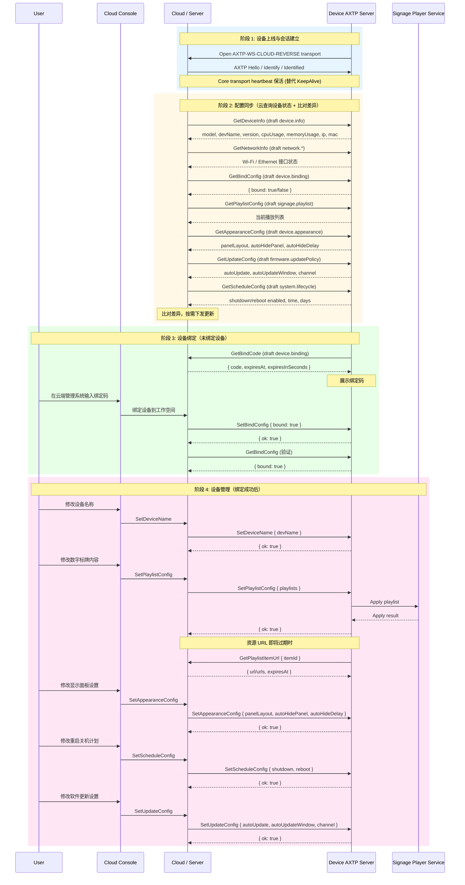

# NearHub Launcher Digital Signage Device Management Protocol Interaction Flow

> Status: flow design
> Scope: NearHub Launcher digital signage device management — implemented commands only
> Source inputs: `docs/legacy-migration/evidence/NearHub-Launcher数字标牌设备管理通用管理命令.md`
> Protocol lifecycle: Stage 10 `plan-protocol-flow`

本文根据 NearHub Launcher legacy Device SDK 文档中 **已研发** 的指令，把数字标牌设备管理交互整理为 AXTP 场景级交互 flow。本文不是最终协议事实源；已采纳事实以 `registry/**/*.yaml`、`registry/domains/**/*.yaml` 和 `docs/generated/**` 为准，新增或修改协议必须转入 `docs/protocol/**` 草案和后续采纳流程。

**范围说明：** 本 flow 仅覆盖证据文档中状态为"已研发"的 15 个业务指令（排除 2 个 KeepAlive，由 Core heartbeat 替代）。14 个未研发指令（音频设置、固件升级、遥测上报、日志导出、系统时间、恢复出厂、SD 卡管理等）不在本 flow 范围内。

## 1. Story Summary

| Item | Content |
|---|---|
| User goal | 设备上线后，运维人员通过云端管理系统完成设备绑定和配置管理，包括设备名称、数字标牌内容、显示面板、重启关机计划和软件更新策略。 |
| Trigger | 设备启动并连接云端。 |
| Success result | 设备完成绑定，所有管理配置项可正常读写和同步。 |
| Primary actors | User / operator, Cloud management console, Cloud / Server, Device AXTP server, Signage player service |
| Product scope | NearHub Launcher digital signage — implemented commands scope |

**端到端流程（4 阶段）：**

1. **设备上线** — 设备启动，通过 `AXTP-WS-CLOUD-REVERSE` 连接云端，建立 AXTP session。
2. **配置同步** — 云端查询设备当前状态（设备信息、网络、绑定状态、播放列表、外观、更新策略、计划任务），比对差异后按需下发更新。
3. **设备绑定** — 设备主动向云端获取绑定码，设备展示绑定码，用户在云端管理系统输入绑定码，完成设备到工作空间的绑定。
4. **设备管理** — 绑定成功后，用户通过云端管理系统修改设备名称、数字标牌内容、显示面板设置、重启关机计划、软件更新设置。

## 2. Source Observations

### 2.1 UI / Prototype

| Screen or control | Observed behavior | Protocol relevance |
|---|---|---|
| 设备列表 / 连接入口 | 设备上线后进入管理入口。 | Core transport heartbeat + session；业务级 KeepAlive 不保留。 |
| 设备概览页 | 展示型号、设备名、CPU、内存、IP、MAC、版本。 | Legacy `GetDeviceInfo` → draft `device.info`。 |
| 设备名称编辑 | 修改设备显示名。 | Legacy `SetDeviceName` → 缺失，需新建 AXTP 草案。 |
| 网络摘要 | 返回 Wi-Fi / Ethernet 数组，含 connected、ip、mac、ssid、rssi。 | Legacy `GetNetworkInfo` → draft `network.*`。 |
| 绑定码页面 | 设备获取并展示绑定码（含过期时间），用户在云端输入绑定码。 | Legacy `GetBindCode` → draft `device.binding`（v0.1 草案已新建）；`GetBindConfig` / `SetBindConfig` 管理绑定状态。 |
| 播放列表管理 | 服务端全量同步播放列表，设备读取当前列表，资源 URL 即将过期时设备请求刷新。 | Legacy `SetPlaylistConfig` / `GetPlaylistConfig` / `GetPlaylistItemUrl` → draft `signage.playlist`。 |
| 外观设置 | 管理 `panelLayout`、`autoHidePanel`、`autoHideDelay`。 | Legacy `GetAppearanceConfig` / `SetAppearanceConfig` → draft `device.appearance`（v0.1 草案已新建）。 |
| 更新策略设置 | 管理自动更新开关、时间窗口和通道。 | Legacy `GetUpdateConfig` / `SetUpdateConfig` → draft `firmware.updatePolicy`。 |
| 计划任务设置 | 管理定时关机和定时重启（enabled、time、days）。 | Legacy `GetScheduleConfig` / `SetScheduleConfig` → draft `system.lifecycle`。 |
| UI prototype image | `[REVIEW-ASK]` 本轮没有 UI 图或产品原型；页面布局、按钮确认弹窗和失败文案需产品/UI 确认。 | 不新增协议，只影响 App 呈现和交互细节。 |

### 2.2 Requirement Notes

- 旧指令采用 Device SDK 风格：Command 为请求-响应，Event 为单向通知。本 flow 只涉及请求-响应型指令（已研发的 17 个条目中，2 个 KeepAlive 事件也由 Core 替代）。
- 旧 `Set*` 指令统一返回 `{ "ok": true }`；AXTP 中应迁移为标准成功 status 或 typed response。
- 新数字标牌业务目标是 `axtp_only`：App、服务端和固件改用 generated method/schema/capability，不继续扩展旧 SDK command 字符串。
- 配置同步采用"云查询设备状态 + 比对差异 + 按需下发"模式。
- KeepAlive 在本 flow 中由 Core transport heartbeat 替代，不再保留为业务指令。

## 3. Assumptions And Non-Goals

| Type | Item | Status |
|---|---|---|
| Assumption | 数字标牌设备通过 `AXTP-WS-CLOUD-REVERSE` 连接云端；本地调试也可使用 `AXTP-USB-HID` / `AXTP-TCP`。 | `[REVIEW-DRAFT]` |
| Assumption | 设备在 AXTP session ready 后暴露当前支持的业务能力。 | `[REVIEW-DRAFT]` |
| Assumption | KeepAlive 由 Core transport heartbeat 替代，不在业务 flow 中出现。 | `[REVIEW-OK]` |
| Assumption | 配置同步是云查询设备状态后比对差异、按需下发，不是设备主动上报。 | `[REVIEW-OK]` |
| Assumption | 绑定流程：设备向云端请求绑定码 → 设备展示绑定码 → 用户在云端输入绑定码 → 云端绑定设备到工作空间。 | `[REVIEW-OK]` |
| Assumption | 播放列表 set 是全量替换，不是 patch；第二次下发会删除旧配置中未出现的列表或播放项。 | `[REVIEW-DRAFT]` |
| Non-goal | 不覆盖未研发指令（音频设置、固件升级、遥测、日志、系统时间、恢复出厂、SD 卡管理）。 | `[REVIEW-OK]` |
| Non-goal | 不在本阶段修改 `docs/protocol/**`、registry YAML、Protocol IR 或 generated 文件。 | `[REVIEW-OK]` |
| Non-goal | 不保留旧 Device SDK 的 KeepAlive 作为 AXTP 业务指令。 | `[REVIEW-OK]` |
| Non-goal | 不把旧 Device SDK envelope、`sdk.call()`/`sdk.notify()` 编程模型搬进 AXTP Core。 | `[REVIEW-OK]` |

## 4. Protocol Coverage

| Need | Coverage state | AXTP protocol | Evidence | Next action |
|---|---|---|---|---|
| 建立 AXTP session | Adopted/generated core | AXTP session, `AXTP-WS-CLOUD-REVERSE` | `docs/generated/protocol.md` | 可按 Core 实现连接和 RPC envelope。 |
| 设备在线和心跳 | Adopted/generated core | Core transport heartbeat | `docs/generated/protocol.md` | 直接使用 Core heartbeat。 |
| 设备基础信息查询 | Drafted only | `device.info` | `docs/protocol/device/device.info.md` | 转 Stage 20 对齐字段：model/devName/version 等；CPU/内存/IP/MAC 拆分到 system/network。 |
| 修改设备名 | Missing | 无对应 AXTP 草案 | legacy `SetDeviceName` | 转 Stage 20 新建设备名设置草案。 |
| 网络信息查询 | Drafted only | `network.interface` + `network.ip` + `network.wifi` | `docs/protocol/network/*.md` | 转 Stage 20 分解旧数组聚合响应。 |
| 绑定码获取 | Drafted only | `device.binding` | `docs/protocol/device/device.binding.md`（v0.1） | 转 Stage 20 补绑定码过期刷新逻辑和 Device→Server 方向。 |
| 绑定状态查询/设置 | Drafted only | `device.binding` | `docs/protocol/device/device.binding.md`（v0.1） | 转 Stage 20 补 bound 状态 schema 和 Server→Device 方向。 |
| 播放列表全量同步 | Drafted only | `signage.playlist` | `docs/protocol/signage/signage.playlist.md` | 转 Stage 20 补 playlists/items/settings schema 和全量替换语义。 |
| 播放列表查询 | Drafted only | `signage.playlist` | `docs/protocol/signage/signage.playlist.md` | 转 Stage 20 保持 set/get 结构一致。 |
| 播放项 URL 刷新 | Drafted only | `signage.playlist` | `docs/protocol/signage/signage.playlist.md` | URL refresh method 归属 signage.playlist；转 Stage 20 补 `url`/`urls` 二选一 schema。 |
| 外观/面板配置 | Drafted only | `device.appearance` | `docs/protocol/device/device.appearance.md`（v0.1） | 转 Stage 20 补 panelLayout/autoHidePanel/autoHideDelay schema。 |
| 软件更新策略 | Drafted only | `firmware.updatePolicy` | `docs/protocol/firmware/firmware.updatePolicy.md` | 转 Stage 20 补 autoUpdate/autoUpdateWindow/channel。 |
| 重启关机计划 | Drafted only | `system.lifecycle` | `docs/protocol/system/system.lifecycle.md` | system.lifecycle v0.8 已覆盖 reboot/shutdown schedule；转 Stage 20 补 legacy 字段映射。 |

## 5. End-To-End Sequence

## 6. Interaction Steps

| Step | Phase | Actor | User or system action | Protocol call/event | Request / event payload notes | Response / state result | Error or fallback |
|---:|---|---|---|---|---|---|---|
| 1 | P1 | Device / Cloud | 设备上线并建立 AXTP session。 | Generated core transport/session | `AXTP-WS-CLOUD-REVERSE` 或产品选择的 transport。 | RPC session ready。 | 握手失败返回 core/session error。 |
| 2 | P1 | Device / Cloud | 维护在线状态。 | Core transport heartbeat | 替代旧 `KeepAlive` 指令和事件。 | Cloud 持续感知设备在线。 | 心跳超时触发断连和重连。 |
| 3 | P2 | Cloud / Device | 查询设备基础信息。 | Draft `device.info` | 旧字段：model, devName, cpuUsage, memoryUsage, ip, mac, version。 | UI 展示设备概览。 | 当前草案字段不足时转 Stage 20 补齐。 |
| 4 | P2 | Cloud / Device | 查询网络信息。 | Draft `network.*` | 旧字段：type, connected, ip, mac, ssid, rssi（数组）。 | UI 展示网络状态。 | 需组合 interface/IP/Wi-Fi 查询。 |
| 5 | P2 | Cloud / Device | 查询绑定状态。 | Draft `device.binding` | 旧字段：bound。 | 判断设备是否已绑定。 | 未绑定进入阶段 3。 |
| 6 | P2 | Cloud / Device | 查询播放列表配置。 | Draft `signage.playlist` | 请求为空。 | 返回当前完整 playlist config。 | 保持 set/get 结构一致。 |
| 7 | P2 | Cloud / Device | 查询外观配置。 | Draft `device.appearance` | 请求为空。 | panelLayout, autoHidePanel, autoHideDelay。 | 草案已新建 `device.appearance.md`（v0.1），转 Stage 20 补 panel 字段。 |
| 8 | P2 | Cloud / Device | 查询更新策略。 | Draft `firmware.updatePolicy` | 请求为空。 | autoUpdate, autoUpdateWindow, channel。 | 跨日窗口和 channel 枚举需确认。 |
| 9 | P2 | Cloud / Device | 查询计划任务配置。 | Draft `system.lifecycle` | 请求为空。 | shutdown/reboot enabled, time, days。 | system.lifecycle v0.8 已有 get/setRebootSchedule 和 get/setShutdownSchedule。 |
| 10 | P2 | Cloud | 比对配置差异，按需下发更新。 | 非 protocol — Cloud 本地逻辑 | 比对查询结果与云端存储。 | 决定是否需要下发 set 操作。 | 差异下发走对应 set 方法。 |
| 11 | P3 | Device / Cloud | 设备请求绑定码。 | Draft `device.binding` — getBindCode | 请求为空；方向 Device → Server。 | `{ code, expiresAt, expiresInSeconds }`。 | 草案已新建 `device.binding.md`（v0.1），转 Stage 20 补绑定码 schema。 |
| 12 | P3 | User / Console | 用户在云端输入绑定码。 | 非 protocol — Console 本地 UI | 用户输入绑定码。 | Console 提交绑定请求。 | 绑定码过期或无效时提示用户。 |
| 13 | P3 | Cloud / Device | 云端通知设备绑定成功。 | Draft `device.binding` — setBindConfig | `{ bound: true }`。 | `{ ok: true }`。 | 待 Stage 20 补 bound 语义和 Server→Device 方向。 |
| 14 | P3 | Cloud / Device | 验证绑定状态。 | Draft `device.binding` — getBindConfig | 请求为空。 | `{ bound: true }`。 | 验证失败需重试或回滚。 |
| 15 | P4 | User / Console / Cloud / Device | 修改设备名称。 | Missing — 需新建草案 | `{ devName }`。 | `{ ok: true }`。 | 无对应 AXTP 草案，转 Stage 20 新建。 |
| 16 | P4 | User / Console / Cloud / Device | 全量同步播放列表。 | Draft `signage.playlist` | `playlists[]`，含日期/时间/星期、items、settings。 | 播放器替换当前配置。 | 第二次全量下发删除缺失项。 |
| 17 | P4 | Device / Cloud | 刷新播放项资源 URL。 | Draft `signage.playlist` | `{ itemId }`，返回 `url` 或 `urls`、`expiresAt`。 | 设备获得新资源 URL。 | URL refresh method 归属 signage.playlist。 |
| 18 | P4 | User / Console / Cloud / Device | 设置外观配置。 | Draft `device.appearance` | panelLayout, autoHidePanel, autoHideDelay。 | 外观配置保存并生效。 | 草案已新建 `device.appearance.md`（v0.1），转 Stage 20 补 panel 字段。 |
| 19 | P4 | User / Console / Cloud / Device | 设置重启关机计划。 | Draft `system.lifecycle` | shutdown/reboot enabled, time, days。 | 设备计划保存。 | system.lifecycle v0.8 已有 schedule 方法。 |
| 20 | P4 | User / Console / Cloud / Device | 设置软件更新策略。 | Draft `firmware.updatePolicy` | autoUpdate, autoUpdateWindow, channel。 | 策略保存并生效。 | 跨日窗口和 channel 枚举需确认。 |

## 7. Protocol Details

### 7.1 Adopted / Generated Protocols

| Method/Event | Purpose in this flow | Source |
|---|---|---|
| AXTP session / transport | 设备上线和连接管理 | `docs/generated/protocol.md` |
| Core transport heartbeat | 替代旧 KeepAlive，维护设备在线 | `docs/generated/protocol.md` |
| `AXTP-WS-CLOUD-REVERSE` | 数字标牌设备与云端之间的 RPC WebSocket 管理通道 | `docs/generated/protocol.md` |
| RPC request/response envelope | 替代旧 Device SDK command envelope | `docs/generated/protocol.md`, `protocol/axtp.protocol.yaml` |
| Core and domain error codes | `RPC_METHOD_NOT_FOUND`, `RPC_PARAM_INVALID`, `NOT_SUPPORTED`, `PERMISSION_DENIED` 等 | `docs/generated/protocol.md`, `registry/error/error_code.yaml` |

### 7.2 Draft Protocol Dependencies

| Draft capability | Needed legacy entries | Draft methods/events | Source |
|---|---|---|---|
| `device.info` | `GetDeviceInfo` | `device.getInfo`（只读） | `docs/protocol/device/device.info.md` |
| `network.interface` + `network.ip` + `network.wifi` | `GetNetworkInfo` | interface list/info, IP config, Wi-Fi state | `docs/protocol/network/*.md` |
| `device.binding` | `GetBindCode`, `GetBindConfig`, `SetBindConfig` | binding code/state get/set | `docs/protocol/device/device.binding.md` |
| `signage.playlist` | `SetPlaylistConfig`, `GetPlaylistConfig` | playlist get/set | `docs/protocol/signage/signage.playlist.md` |
| `signage.playlist` | `GetPlaylistItemUrl` | playlist item URL refresh method | `docs/protocol/signage/signage.playlist.md` |
| `device.appearance` | `GetAppearanceConfig`, `SetAppearanceConfig` | appearance get/set | `docs/protocol/device/device.appearance.md` |
| `firmware.updatePolicy` | `GetUpdateConfig`, `SetUpdateConfig` | update policy get/set | `docs/protocol/firmware/firmware.updatePolicy.md` |
| `system.lifecycle` | `GetScheduleConfig`, `SetScheduleConfig` | shutdown/reboot schedule | `docs/protocol/system/system.lifecycle.md` |

### 7.3 Legacy Mapping Checklist

| Legacy entry | Direction | AXTP target | Coverage state | Follow-up |
|---|---|---|---|---|
| `KeepAlive` 指令 | Server <-> Device | Core transport heartbeat | Adopted core | 不保留为业务指令。 |
| `KeepAlive` 事件 | Server <-> Device | Core transport heartbeat | Adopted core | 不保留为业务指令。 |
| `GetDeviceInfo` | Server -> Device | `device.info` | Drafted only | 补完整概览 schema。 |
| `SetDeviceName` | Server -> Device, Device -> Server | 无对应草案 | Missing | 转 Stage 20 新建设备名设置草案。 |
| `GetNetworkInfo` | Server -> Device | `network.interface` + `network.ip` + `network.wifi` | Drafted only | 分解旧数组聚合响应。 |
| `GetBindCode` | Device -> Server | `device.binding` getBindCode | Drafted only | 草案已新建 `device.binding.md`（v0.1），转 Stage 20 补绑定码 schema 和 Device→Server 方向。 |
| `GetBindConfig` | Server <-> Device | `device.binding` getBindConfig | Drafted only | 草案已新建 `device.binding.md`（v0.1），确认 bound 语义。 |
| `SetBindConfig` | Server -> Device | `device.binding` setBindConfig | Drafted only | 草案已新建 `device.binding.md`（v0.1），确认方向和权限。 |
| `SetPlaylistConfig` | Server -> Device | `signage.setPlaylistConfig` | Drafted only | 补全量替换 schema。 |
| `GetPlaylistConfig` | Server <-> Device | `signage.getPlaylistConfig` | Drafted only | 保持 set/get 结构一致。 |
| `GetPlaylistItemUrl` | Device -> Server | `signage.playlist` URL refresh | Drafted only | URL refresh method 归属 signage.playlist。 |
| `GetAppearanceConfig` | Server <-> Device | `device.getAppearanceConfig` | Drafted only | 草案已新建 `device.appearance.md`（v0.1）。 |
| `SetAppearanceConfig` | Server <-> Device | `device.setAppearanceConfig` | Drafted only | 草案已新建 `device.appearance.md`（v0.1），补 panel 字段。 |
| `GetUpdateConfig` | Server <-> Device | `firmware.getUpdatePolicyConfig` | Drafted only | 补 auto update policy schema。 |
| `SetUpdateConfig` | Server <-> Device | `firmware.setUpdatePolicyConfig` | Drafted only | 补跨日窗口规则。 |
| `GetScheduleConfig` | Server <-> Device | `system.getRebootSchedule` / `system.getShutdownSchedule` | Drafted only | system.lifecycle v0.8 已覆盖；补 legacy 字段映射。 |
| `SetScheduleConfig` | Server <-> Device | `system.setRebootSchedule` / `system.setShutdownSchedule` | Drafted only | system.lifecycle v0.8 已覆盖；补 legacy 字段映射。 |

### 7.4 Draft Or Missing Protocol Gaps

| Gap | Candidate domain.feature | Candidate method/event/schema | Routed skill | Review question |
|---|---|---|---|---|
| `SetDeviceName` 无对应 AXTP 草案 | `device.info` 或新建设备名设置 | `device.setDisplayName` 或类似 | `draft-business-protocol` | `[REVIEW-ASK]` 设备名设置是归属 device.info 扩展还是独立 feature？ |
| 绑定码与绑定状态已定域 | `device.binding` | getBindCode / getBindConfig / setBindConfig | `draft-business-protocol` | `[REVIEW-RESOLVED]` 草案已新建 `device.binding.md`（v0.1），转 Stage 20 细化 schema。 |
| Schedule 定域已解决 | `system.lifecycle` | get/setRebootSchedule + get/setShutdownSchedule | `draft-business-protocol` | `[REVIEW-RESOLVED]` 关机/重启调度已定域 `system.lifecycle` v0.8；`signage.schedule` 草案可删除。 |
| 播放项 URL 刷新已定域 | `signage.playlist` | playlist item URL refresh | `draft-business-protocol` | `[REVIEW-RESOLVED]` URL 刷新是播放项级操作，已归属 `signage.playlist`（v0.2）；`signage.media` 草案已删除，功能已合并。 |
| Appearance 已定域 | `device.appearance` | getAppearanceConfig / setAppearanceConfig | `draft-business-protocol` | `[REVIEW-RESOLVED]` 面板行为是设备级 UI，已定域 `device.appearance`（v0.1）；`signage.osd` 草案已删除，功能已迁移。 |

## 8. Test Fixtures

| Fixture | Expected result |
|---|---|
| `signage-device-session-ready` | 设备通过 `AXTP-WS-CLOUD-REVERSE` 完成 AXTP session，Cloud 能发送 RPC。 |
| `signage-device-heartbeat` | Core transport heartbeat 正常维护在线状态，替代旧 KeepAlive。 |
| `signage-device-config-sync` | 云端查询 7 项配置状态（设备信息、网络、绑定、播放列表、外观、更新策略、计划任务），比对差异后按需下发。 |
| `signage-device-bind-code` | 设备向云端请求绑定码，返回 code + expiresAt + expiresInSeconds。 |
| `signage-device-bind-complete` | 云端设置绑定状态 bound=true，设备确认，查询验证绑定成功。 |
| `signage-device-name-set` | 修改设备名称后设备返回成功，查询确认新名称生效。 |
| `signage-playlist-full-replace` | 全量同步播放列表，第二次下发删除未出现的旧 item。 |
| `signage-playlist-item-url-refresh` | 设备用 itemId 刷新 URL，返回 url 或 urls 以及 expiresAt。 |
| `device-appearance-config` | panelLayout 和 autoHidePanel 配置 set/get 一致。 |
| `system-lifecycle-schedule-config` | 定时关机/重启计划 set/get 一致，映射到 system.get/setRebootSchedule 和 system.get/setShutdownSchedule。 |
| `signage-update-policy-config` | 自动更新策略 set/get 一致，跨日窗口和 channel 枚举按协议处理。 |
| `signage-legacy-command-rejected` | 新 AXTP 主入口收到旧 `SetPlaylistConfig` / `GetDeviceInfo` 字符串时返回 method not found；灰度 adapter 另测。 |

## 9. Acceptance Gates

- 证据文档中 17 个已研发指令全部有 AXTP 覆盖结论（其中 KeepAlive 2 个由 Core 替代，15 个有明确 AXTP 映射）。
- 14 个未研发指令不在本 flow 中出现。
- KeepAlive 在 flow 中标注为"由 Core heartbeat 替代"，不保留为业务指令。
- 配置同步阶段（阶段 2）独立且完整：7 项查询 + 差异比对 + 按需下发。
- 绑定流程（阶段 3）独立且完整：获取绑定码 → 用户输入 → 设置绑定状态 → 验证。
- App、服务端和固件的新主路径只使用 generated method/schema；旧 command 字符串只在灰度 adapter 中存在。
- `device.info`、`device.binding`、`device.appearance`、`signage.playlist`、`firmware.updatePolicy`、`system.lifecycle` 等命名冲突或语义不清问题在 Stage 20 中被消解。
- 后续完成草案采纳后，必须运行 Generator 刷新 `protocol/axtp.protocol.yaml` 和 `docs/generated/**`。

## 10. Open Questions

- `[REVIEW-ASK]` 设备管理页面的真实 UI 原型有哪些 tab、字段、权限和确认弹窗？
- `[REVIEW-ASK]` `SetDeviceName` 应归属 `device.info` 扩展还是独立新建 `device.displayName` feature？
