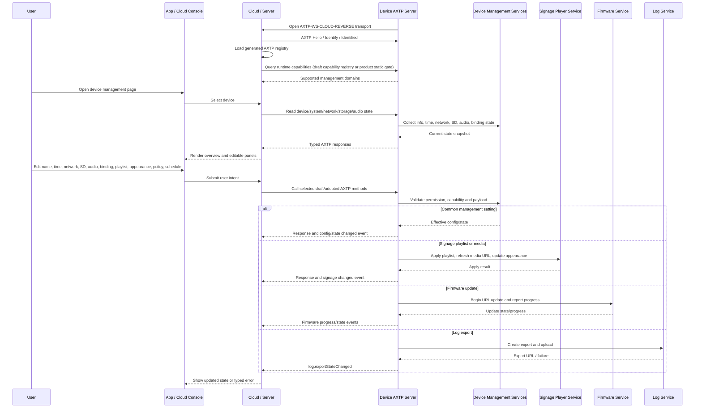

# NearHub Launcher Digital Signage Device Management Protocol Interaction Flow

> Status: flow design
> Scope: NearHub Launcher digital signage device management and common management commands
> Source inputs: `docs/legacy-migration/evidence/NearHub-Launcher数字标牌设备管理通用管理命令.md`, `docs/legacy-migration/evidence/NearHub-Launcher设备管理命令.md`, `docs/legacy-migration/classification/by-source/signage_sdk.md`, `docs/legacy-migration/plans/signage-protocol-migration-plan.md`, `docs/generated/protocol.md`
> Protocol lifecycle: Stage 10 `plan-protocol-flow`

本文根据 NearHub Launcher 两份 legacy Device SDK 文档，把数字标牌设备管理相关 command/event 整理为 AXTP 场景级交互 flow。本文不是最终协议事实源；稳定实现合同仍以 `registry/**/*.yaml`、`registry/domains/**/*.yaml`、`protocol/axtp.protocol.yaml` 和 `docs/generated/**` 为准。

当前 generated 协议只包含 AXTP Core、connection profiles、RPC/STREAM 基础事实、错误码和 `audio.algorithm` 业务方法；本文涉及的 `device.*`、`system.*`、`network.*`、`storage.*`、`audio.volume`、`audio.input`、`firmware.*`、`auth.*`、`signage.*`、`log.*` 仍是草案或缺口，不能直接作为实现合同。

## 1. Story Summary

| Item | Content |
|---|---|
| User goal | App / 云端 / 运维人员用 AXTP 管理数字标牌设备，完成上线识别、基础状态读取、配置修改、内容同步、升级、日志导出和绑定状态同步。 |
| Trigger | 设备启动并连接云端，或 App / 服务端打开设备管理页面并选择一台 NearHub Launcher 数字标牌设备。 |
| Success result | 设备完成 AXTP session；调用方按 generated registry 和设备声明能力调用标准 `domain.method`；旧 `Verb + Resource` command 只作为 legacy 映射和灰度 adapter 参考。 |
| Primary actors | User / operator, App, cloud/server, Device AXTP server, device management service, signage player service, firmware service, log service |
| Product scope | NearHub Launcher digital signage SDK migration；覆盖 `signage_sdk` 分类中的 31 个 legacy 条目。 |

## 2. Source Observations

### 2.1 UI / Prototype

| Screen or control | Observed behavior | Protocol relevance |
|---|---|---|
| Device list / connection entry | 设备在线后进入管理入口；旧文档使用 `KeepAlive` method/event 记录在线。 | AXTP session / transport heartbeat 优先；业务 last-online 或 lifecycle 事件为 `system.lifecycle` 草案依赖。 |
| Device overview | 展示型号、设备名、CPU、内存、IP、MAC、版本。 | Legacy `GetDeviceInfo` 映射到 `device.info` 草案；网络字段可能还需要 `network.interface` / `network.ip`。 |
| Device name editor | 修改设备显示名。 | Legacy `SetDeviceName` 暂不映射到当前 `device.info`；有具体设置需求后另起草设备名设置协议。 |
| System time form | 设置时区和年月日时分秒。 | Legacy `SetSysTime` 映射到 `system.time` 草案。 |
| Factory reset / restore config button | 旧 `ResetConfig` 文案称恢复出厂设置且通常自动重启。 | 映射到 `system.reset` 草案；需确认是恢复当前版本默认配置，还是恢复出厂基线并回退 Launcher 等软件版本。 |
| Network summary | 返回 Wi-Fi / Ethernet 数组，含 `connected`、`ip`、`mac`、`ssid`、`rssi`。 | 需要 `network.interface` + `network.ip`，Wi-Fi 字段还依赖 `network.wifi`；单个 `network.getIpConfig` 不能覆盖全部旧字段。 |
| SD card panel | 查询 SD 卡状态和容量；触发格式化。 | Legacy `GetSDInfo` / `FormatSd` 映射到 `storage.sdCard`，但草案目前缺少明确状态型查询和格式化 action 命名。 |
| Audio settings | 设置/查询 Line-out 音量和 Line-in 预增益。 | 映射到 `audio.volume` / `audio.input` 草案；当前 generated `audio.algorithm` 不覆盖这些字段。 |
| Firmware maintenance | URL 远程升级并查询升级进度。 | 优先按 `firmware.update` 草案的 `source.type=url`、`firmware.getUpdateState` 和 progress event 设计，不新增 `RemoteUpgrade`。 |
| Binding page / bind code | 设备获取绑定码，服务端/设备查询绑定状态，服务端下发绑定状态变更，设备上报绑定结果。 | 映射到 `auth.session` 或绑定专属 auth 能力；当前草案过于通用，需要补绑定码、过期时间、方向和事件语义。 |
| Telemetry | 设备上报温度、电量等遥测。 | 当前分类低置信度；候选 `sensor.telemetry` 或专门 telemetry/sensor 域，不进入独立 system power feature。 |
| Playlist manager | 服务端全量同步播放列表，设备读取当前列表，资源 URL 即将过期时设备请求刷新。 | 映射到 `signage.playlist` 和 `signage.media` 草案；需补完整 playlist/item/settings schema。 |
| Appearance settings | 管理 `panelLayout`、`autoHidePanel`、`autoHideDelay`。 | 映射到 `signage.osd` 草案；需确认 OSD 命名是否准确表达播放器面板外观。 |
| Update policy settings | 管理自动更新开关、时间窗口和通道。 | 映射到 `firmware.updatePolicy` 草案。 |
| Schedule settings | 旧字段是定时关机和定时重启。 | 分类表指向 `signage.schedule`，但语义更像 `system.lifecycle` 的关机/重启计划；需评审定域。 |
| Log upload button | 服务端请求设备打包日志并上传 OSS，设备通知上传 URL。 | 映射到 `log.export` 草案；旧 `NotifyLogUploadResult` 应改为事件。 |
| UI prototype image | `[REVIEW-ASK]` 本轮没有 UI 图或产品原型；页面布局、按钮确认弹窗、权限提示和失败文案需产品/UI 确认。 | 不新增协议，只影响 App 呈现和交互细节。 |

### 2.2 Requirement Notes

- 两份 legacy 文档采用 Device SDK 风格：Command 为请求-响应，Event 为单向通知；旧 method 使用 `Verb + Resource`，event 使用 `On*`。
- 旧 `Set*` command 统一返回 `{ "ok": true }`；AXTP 中应迁移为标准成功 status 或 typed response，只有确有业务含义时才保留 `ok` 字段。
- 新数字标牌业务目标是 `axtp_only`：App、服务端和固件改用 generated method/schema/capability，不继续扩展旧 SDK command 字符串。
- `docs/legacy-migration/plans/signage-protocol-migration-plan.md` 已有迁移设计；本文补充 Stage 10 场景时序、交互步骤、协议覆盖状态和下一步 gap 路由。
- 当前 `docs/generated/protocol.md` 和 `protocol/axtp.protocol.yaml` 未采纳设备管理业务方法；后续必须先补齐草案、采纳到 registry，再重新生成。

## 3. Assumptions And Non-Goals

| Type | Item | Status |
|---|---|---|
| Assumption | 数字标牌设备可通过 `AXTP-WS-CLOUD-REVERSE` 连接云端；本地调试或产测也可使用 `AXTP-USB-HID` / `AXTP-TCP`。 | `[REVIEW-DRAFT]` |
| Assumption | 设备在 AXTP session ready 后暴露当前支持的业务能力；采纳前可通过 App 本地 generated registry 和明确的 legacy adapter gate 做能力门禁。 | `[REVIEW-DRAFT]` |
| Assumption | 新 App / 服务端不直接调用 `GetDeviceInfo`、`SetPlaylistConfig` 等旧字符串，除非进入明确的旧固件灰度 adapter。 | `[REVIEW-OK]` |
| Assumption | `RemoteUpgrade` 按 URL 远程升级处理，不另建数字标牌专属升级方法。 | `[REVIEW-OK]` |
| Assumption | playlist set 是全量替换，不是 patch；第二次下发会删除旧配置中未出现的列表或播放项。 | `[REVIEW-DRAFT]` |
| Question | 旧 `GetScheduleConfig` / `SetScheduleConfig` 是设备定时关机/重启，还是数字标牌播放排期？ | `[REVIEW-ASK]` |
| Question | `OnTelemetryReport` 的真实字段集合是什么？是否只有温度和电量示例，还是还包括在线、资源、播放状态等？ | `[REVIEW-ASK]` |
| Question | 绑定语义是账号/租户绑定、auth session、设备认领，还是安装现场 pairing？ | `[REVIEW-ASK]` |
| Non-goal | 不在本阶段修改 `docs/protocol/**`、registry YAML、Protocol IR 或 generated 文件。 | `[REVIEW-OK]` |
| Non-goal | 不把旧 Device SDK envelope、`sdk.call()`/`sdk.notify()` 编程模型或旧 command router 搬进 AXTP Core。 | `[REVIEW-OK]` |
| Non-goal | 不为每个旧 command 保留同名 AXTP method；旧名仅作为 legacyRefs 和 adapter 测试输入。 | `[REVIEW-OK]` |

## 4. Protocol Coverage

| Need | Coverage state | AXTP protocol | Evidence | Next action |
|---|---|---|---|---|
| 建立设备管理会话 | Adopted/generated core | AXTP session, RPC, `AXTP-WS-CLOUD-REVERSE`, `AXTP-WS-JSON`, `AXTP-USB-HID`, `AXTP-TCP` | `docs/generated/protocol.md`, `protocol/axtp.protocol.yaml` | 可按 AXTP Core 实现连接和 RPC envelope。 |
| 运行时发现支持方法和能力 | Drafted only / Partially adopted core | Local generated registry; draft `capability.registry` | `docs/generated/protocol.md`, `docs/protocol/capability/capability.registry.md` | 转 Stage 20 补 supported methods/events 能力查询，或明确产品级静态 registry 策略。 |
| 设备在线和心跳 | Adopted/generated core + draft business event | Transport/session heartbeat; optional `system.lifecycle` | `docs/generated/protocol.md`, `docs/protocol/system/system.lifecycle.md` | Core 心跳直接使用；如需业务 last-online event，转 Stage 20 补 `system.lifecycle`。 |
| 设备基础信息 | Drafted only | `device.info`; candidate `device.getInfo` only | `docs/protocol/device/device.info.md`, `docs/legacy-migration/classification/by-source/signage_sdk.md` | 转 Stage 20 对齐只读信息字段：`model/devName/version` 等；CPU/内存/IP/MAC 分别拆到 system/network。 |
| 修改设备名 | Deferred / no current AXTP draft | future device name setting protocol | legacy `SetDeviceName` | 当前 `device.info` 只读；先留在 legacy adapter 或等待具体设置需求。 |
| 系统时间设置 | Drafted only | `system.time` | `docs/protocol/system/system.time.md` | 转 Stage 20 补时区、年月日时分秒或 epoch 毫秒策略。 |
| 恢复配置 / 恢复出厂 | Drafted only / semantic gap | `system.reset` | `docs/protocol/system/system.reset.md` | 转 Stage 20 明确 default settings 与 factory settings：前者回到当前版本默认配置，后者回到出厂基线并可能回退 Launcher 版本。 |
| 网络信息读取 | Drafted only / partially scoped | `network.interface`, `network.ip`, likely `network.wifi` | `docs/protocol/network/network.interface.md`, `docs/protocol/network/network.ip.md`, `docs/protocol/network/network.wifi.md` | 转 Stage 20；旧数组聚合需要分解为接口、IP 和 Wi-Fi 状态。 |
| SD 卡状态和格式化 | Drafted only / naming gap | `storage.sdCard` | `docs/protocol/storage/storage.sdCard.md` | 转 Stage 20 补 `getSdCardState`、`formatSdCard`、format state/progress event。 |
| Line-out 音量 | Drafted only | `audio.volume` | `docs/protocol/audio/audio.volume.md` | 转 Stage 20 补 output target、volume range、单位和状态/配置命名。 |
| Line-in 预增益 | Drafted only | `audio.input` | `docs/protocol/audio/audio.input.md` | 转 Stage 20 补 input target、`preGain` 范围和单位。 |
| URL 远程升级和升级进度 | Drafted only | `firmware.update`, `firmware.getUpdateState`, progress/state events | `docs/protocol/firmware/firmware.update.md` | 转 Stage 20 采纳 URL source 流程；同步更新旧分类中 `firmware.ota` 命名。 |
| 自动更新策略 | Drafted only | `firmware.updatePolicy` | `docs/protocol/firmware/firmware.updatePolicy.md` | 转 Stage 20 补 `autoUpdate/autoUpdateWindow/channel`。 |
| 绑定码和绑定状态 | Drafted only / semantic gap | `auth.session` or binding-specific auth feature | `docs/protocol/auth/auth.session.md` | 转 Stage 20 补 `GetBindCode`、`bound`、过期时间、状态事件和方向。 |
| 温度、电量等遥测上报 | Missing | Candidate `sensor.telemetry`; possible split to sensor/telemetry domains | `docs/legacy-migration/classification/by-source/signage_sdk.md` | 转 Stage 20 先定域和字段集合；不进入独立 system power feature。 |
| 播放列表全量同步 | Drafted only | `signage.playlist` | `docs/protocol/signage/signage.playlist.md` | 转 Stage 20 补 playlists/items/settings schema、全量替换语义和错误策略。 |
| 播放项 URL 刷新 | Drafted only / naming gap | `signage.media`; candidate `signage.getPlaylistItemUrl` or `signage.refreshMediaUrl` | `docs/protocol/signage/signage.media.md` | 转 Stage 20 决定 method 命名和 `url`/`urls` 二选一 schema。 |
| 外观/面板配置 | Drafted only / naming review | `signage.osd` | `docs/protocol/signage/signage.osd.md` | 转 Stage 20 确认 OSD 是否合适，补 `panelLayout/autoHidePanel/autoHideDelay`。 |
| 计划任务 | Drafted only / domain conflict | `signage.schedule` or `system.lifecycle` schedule | `docs/protocol/signage/signage.schedule.md`, `docs/protocol/system/system.lifecycle.md` | 先评审定域；不要在结论前把关机/重启 schedule 发布成 signage schedule。 |
| 日志导出 | Drafted only | `log.export` | `docs/protocol/log/log.export.md` | 转 Stage 20 补 OSS target/credential/result event 和旧 `NotifyLogUploadResult` 映射。 |

## 5. End-To-End Sequence

## 6. Interaction Steps

| Step | Actor | User or system action | Protocol call/event | Request / event payload notes | Response / state result | Error or fallback |
|---:|---|---|---|---|---|---|
| 1 | Device / Cloud | 设备上线并建立 AXTP session。 | Generated core transport/session | `AXTP-WS-CLOUD-REVERSE` 或产品选择的 transport。 | RPC session ready。 | 握手失败返回 core/session error；旧 SDK 连接路径只进灰度 adapter。 |
| 2 | Cloud / App | 加载当前 generated registry。 | Non-protocol local lookup | 当前 generated 仅有 `audio.algorithm` 业务方法，不含设备管理方法。 | App 知道哪些是正式合同，哪些必须等草案采纳。 | 若产品要求纯 AXTP，新功能不能调用 draft-only 名称。 |
| 3 | Cloud / Device | 查询设备运行时支持能力。 | Draft `capability.registry` or product static gate | 需要 supported methods/events/capabilities。 | 返回设备管理域支持情况。 | `capability.registry` 采纳前，使用产品固件版本/adapter gate 做显式门禁。 |
| 4 | Cloud / Device | 维护在线状态。 | Core heartbeat; optional draft `system.lifecycle` event | 旧 `KeepAlive` method/event 不保留为新主路径。 | Cloud 更新 last online。 | 如业务必须有 last-online event，补 `system.lifecycle`。 |
| 5 | App / Cloud / Device | 打开设备概览。 | Draft `device.info` plus network drafts | 旧字段：`model/devName/cpuUsage/memoryUsage/ip/mac/version`。 | UI 展示设备基础信息。 | 当前草案字段不足时回到 Stage 20，不从旧 payload 直接生成 YAML。 |
| 6 | App / Cloud / Device | 修改设备名。 | No current standard AXTP method; future setting protocol or legacy adapter | `devName` 或标准化后的 display name 字段。 | 当前标准草案不承诺设备名写入。 | 需要具体需求后再定义名称长度、非法字符、权限、冲突和通知策略。 |
| 7 | App / Cloud / Device | 设置系统时间。 | Draft `system.setTimeConfig` | 旧字段包含 timezone、year/month/day/hour/minute/second。 | 设备时间/时区更新。 | 需定义时区无效、时间漂移、NTP 策略和是否立即生效。 |
| 8 | App / Cloud / Device | 恢复默认配置或恢复出厂。 | Draft `system.reset` action | 旧 `ResetConfig` 无参数；新草案需区分当前版本默认配置与出厂软件基线。 | 设备确认任务开始；可能自动重启或回退 Launcher 等软件版本。 | 需二次确认；清除范围、软件版本回退和自动重启由草案固定。 |
| 9 | App / Cloud / Device | 读取网络信息。 | Draft `network.getInterfaces`, `network.getIpConfig`, optional `network.wifi` | 旧数组含 type、connected、ip、mac、ssid、rssi。 | UI 展示 Ethernet/Wi-Fi 链路和地址。 | 不能只靠 `network.ip` 表达 Wi-Fi SSID/RSSI；需组合查询。 |
| 10 | App / Cloud / Device | 读取 SD 卡状态。 | Draft `storage.sdCard` state query | 旧 `status/totalSize/availableSize`。 | UI 展示容量和挂载状态。 | 草案需从 generic config 名称改成状态/动作语义。 |
| 11 | App / Cloud / Device | 格式化 SD 卡。 | Draft `storage.formatSdCard` candidate + event/state | 旧命令无参数。 | 返回任务接受；事件或查询报告完成。 | 格式化是破坏性动作，需要确认弹窗、权限、busy 和失败状态。 |
| 12 | App / Cloud / Device | 设置或读取 Line-out 音量。 | Draft `audio.setVolumeConfig`, `audio.getVolumeState` or `audio.getVolumeConfig` | 旧字段 `volume: 10`；需 target=`lineOut`。 | 音量生效并同步 UI。 | 范围、单位、静音和状态/配置命名需 Stage 20 固化。 |
| 13 | App / Cloud / Device | 设置或读取 Line-in 预增益。 | Draft `audio.setInputConfig`, `audio.getInputConfig` | 旧字段 `preGain: 5`；需 input target=`lineIn`。 | 预增益生效并同步 UI。 | `preGain` 单位和范围未知，不应写死。 |
| 14 | App / Cloud / Device | 发起 URL 远程升级。 | Draft `firmware.beginUpdate(source.type=url)` | 旧字段 `url`。 | 设备开始下载/校验/安装。 | 使用 firmware error codes；不新增 `RemoteUpgrade` stable method。 |
| 15 | App / Cloud / Device | 查询或接收升级进度。 | Draft `firmware.getUpdateState`, `firmware.updateProgressReported` | 旧 `UpgradeProgress(url)` 返回 `progress`。 | UI 显示下载/校验/安装进度。 | 事件丢失时轮询；进度和最终结果由状态机而非裸百分比表达。 |
| 16 | App / Cloud / Device | 获取或修改自动更新策略。 | Draft `firmware.getUpdatePolicyConfig`, `firmware.setUpdatePolicyConfig` | `autoUpdate`, `autoUpdateWindow.start/end`, `channel`。 | 策略保存并触发 changed event。 | 跨日窗口、channel 枚举和权限需确认。 |
| 17 | Device / Cloud | 获取绑定码。 | Draft auth binding method under `auth.session` or new auth feature | 旧 `GetBindCode` 返回 code、expiresAt、expiresInSeconds。 | 设备/云端得到可展示或可校验绑定码。 | 当前 `auth.session` 草案没有绑定码 schema；转 Stage 20。 |
| 18 | App / Cloud / Device | 查询或设置绑定状态。 | Draft `auth.getSessionState` / `auth.setSessionConfig` or binding method | 旧 `bound: true`。 | 设备绑定状态更新。 | 需确认绑定与 auth session 的关系，不直接复用旧 bool。 |
| 19 | Device / Cloud | 上报绑定结果。 | Draft `auth.sessionStateChanged` | 旧 `status/code/message`。 | Cloud 更新绑定状态。 | 事件名和 payload 需重新定域。 |
| 20 | Device / Cloud | 上报遥测。 | Missing `sensor.telemetryReported` candidate | 旧示例 temp、battery。 | Cloud 记录遥测。 | 字段集合不足；先确认是否拆到 sensor/telemetry 域。 |
| 21 | App / Cloud / Device | 全量同步播放列表。 | Draft `signage.setPlaylistConfig` | `playlists[]`、日期/时间/星期、items、settings。 | 播放器替换当前配置。 | 第二次全量下发删除缺失项；schema 和错误策略需补。 |
| 22 | App / Cloud / Device | 读取播放列表。 | Draft `signage.getPlaylistConfig` | 请求为空。 | 返回当前完整 playlist config。 | 需保持 set/get 结构一致。 |
| 23 | Device / Cloud | 刷新播放项资源 URL。 | Draft `signage.media` method | 旧 `itemId`，返回 `url` 或 `urls`、`expiresAt`。 | 设备获得新的资源 URL。 | `listMedia` 命名与旧语义不完全一致，需 Stage 20 决定。 |
| 24 | App / Cloud / Device | 管理播放器外观。 | Draft `signage.getOsdConfig`, `signage.setOsdConfig` | `panelLayout`, `autoHidePanel`, `autoHideDelay`。 | 外观配置保存并生效。 | 如果这不是 OSD，应重命名或重定位。 |
| 25 | App / Cloud / Device | 管理计划任务。 | Draft `signage.schedule` or `system.lifecycle` schedule | 旧字段是 shutdown/reboot enabled/time/days。 | 设备计划保存。 | 必须先定域；避免把关机/重启塞进播放排期。 |
| 26 | App / Cloud / Device | 请求日志上传。 | Draft `log.createExport` | 旧命令无参数，但 AXTP 应描述导出范围、上传目标和凭证。 | 设备创建日志导出任务。 | 若需要 OSS 上传，凭证、URL、过期时间和隐私范围必须在 schema 中。 |
| 27 | Device / Cloud | 通知日志上传结果。 | Draft `log.exportStateChanged` | 旧 `NotifyLogUploadResult(url)` 是 method；AXTP 推荐事件。 | Cloud 获得日志 URL 或失败原因。 | 上传失败、过期 URL、取消和进度事件需补。 |

## 7. Protocol Details

### 7.1 Adopted / Generated Protocols

| Method/Event/Profile | Purpose in this flow | Source |
|---|---|---|
| AXTP Standard Framed profiles | 本地调试、USB HID 或 TCP 场景可承载 CONTROL、RPC 和 STREAM。 | `docs/generated/protocol.md` |
| `AXTP-WS-JSON` / `AXTP-WS-CLOUD-REVERSE` | 数字标牌设备与云端之间的 RPC-only WebSocket 管理通道。 | `docs/generated/protocol.md` |
| RPC request/response/event envelope | 替代旧 Device SDK command/event envelope。 | `docs/generated/protocol.md`, `protocol/axtp.protocol.yaml` |
| Core and domain error codes | 统一返回 `RPC_METHOD_NOT_FOUND`、`RPC_PARAM_INVALID`、`NOT_SUPPORTED`、`PERMISSION_DENIED`、`BUSY`、firmware/stream errors 等。 | `docs/generated/protocol.md`, `registry/error/error_code.yaml` |
| Local generated registry | App / 服务端用于判断当前正式采纳的 method/event；当前业务方法只有 `audio.algorithm`。 | `docs/generated/protocol.md` |

`audio.getAlgorithmConfig`、`audio.setAlgorithmConfig`、`audio.getAlgorithmCapabilities`、`audio.resetAlgorithmConfig` 和 `audio.algorithmConfigChanged` 已 generated，但不覆盖本 flow 中的 Line-out 音量和 Line-in 预增益。

### 7.2 Draft Protocol Dependencies

| Draft capability | Needed legacy entries | Draft methods/events to review | Source |
|---|---|---|---|
| `capability.registry` | Runtime supported methods/events | `capability.getRegistry*` or a more specific supported-methods query | `docs/protocol/capability/capability.registry.md` |
| `device.info` | `GetDeviceInfo` | Current draft uses only read-only `device.getInfo`; `SetDeviceName` is deferred. | `docs/protocol/device/device.info.md` |
| `system.lifecycle` | `KeepAlive`, schedule if power/reboot plan | `system.lifecycle*`, possible reboot/shutdown schedule semantics | `docs/protocol/system/system.lifecycle.md` |
| `system.time` | `SetSysTime` | `system.setTimeConfig`, optional `system.getTimeConfig` | `docs/protocol/system/system.time.md` |
| `system.initialization` | `ResetConfig` | reset/start initialization action and state/event | `docs/protocol/system/system.initialization.md` |
| `network.interface` + `network.ip` + `network.wifi` | `GetNetworkInfo` | interface list/info, IP config, Wi-Fi state/details | `docs/protocol/network/*.md` |
| `storage.sdCard` | `GetSDInfo`, `FormatSd` | state query, format action, progress/result event | `docs/protocol/storage/storage.sdCard.md` |
| `audio.volume` | `SetLineOutVolume`, `GetLineOutVolume` | volume config/state with target=`lineOut` | `docs/protocol/audio/audio.volume.md` |
| `audio.input` | `SetLineInPreGain`, `GetLineInPreGain` | input config with target=`lineIn`, `preGain` descriptor | `docs/protocol/audio/audio.input.md` |
| `firmware.update` | `RemoteUpgrade`, `UpgradeProgress` | `firmware.beginUpdate(source.type=url)`, `firmware.getUpdateState`, progress/state events | `docs/protocol/firmware/firmware.update.md` |
| `firmware.updatePolicy` | `GetUpdateConfig`, `SetUpdateConfig` | update policy get/set/config changed | `docs/protocol/firmware/firmware.updatePolicy.md` |
| `auth.session` or binding feature | `GetBindCode`, `GetBindConfig`, `SetBindConfig`, `OnBindState` | binding-code query, binding state query/set, binding event | `docs/protocol/auth/auth.session.md` |
| `signage.playlist` | `SetPlaylistConfig`, `GetPlaylistConfig` | playlist get/set/reset/config changed | `docs/protocol/signage/signage.playlist.md` |
| `signage.media` | `GetPlaylistItemUrl` | URL refresh method with `itemId`, `url`/`urls`, `expiresAt` | `docs/protocol/signage/signage.media.md` |
| `signage.osd` | `GetAppearanceConfig`, `SetAppearanceConfig` | OSD/appearance get/set config | `docs/protocol/signage/signage.osd.md` |
| `signage.schedule` or `system.lifecycle` schedule | `GetScheduleConfig`, `SetScheduleConfig` | depends on domain decision | `docs/protocol/signage/signage.schedule.md` |
| `log.export` | `RequestLogUpload`, `NotifyLogUploadResult` | `log.createExport`, `log.getExportState`, `log.exportStateChanged`, progress event | `docs/protocol/log/log.export.md` |

### 7.3 Legacy Mapping Checklist

| Legacy entry | Direction | Standard AXTP target for this flow | Coverage state | Follow-up |
|---|---|---|---|---|
| `KeepAlive` method | Server <-> Device | Core heartbeat; optional `system.lifecycle` | Partially adopted core / draft business | Confirm whether business event is required. |
| `KeepAlive` event | Server <-> Device | Optional `system.lifecycleStateChanged` or session telemetry | Drafted only | Do not keep same event name as stable AXTP. |
| `GetDeviceInfo` | Server -> Device | `device.info` | Drafted only | Add full overview schema. |
| `SetDeviceName` | Server -> Device, Device -> Server | future device name setting protocol / legacy adapter | Deferred | Do not map to current read-only `device.info`. |
| `SetSysTime` | Server -> Device | `system.time` | Drafted only | Confirm time schema and NTP policy. |
| `ResetConfig` | Server -> Device | `system.initialization` / reset action | Drafted only / semantic gap | Confirm factory reset scope and reboot behavior. |
| `GetNetworkInfo` | Server -> Device | `network.interface` + `network.ip` + `network.wifi` | Drafted only / split required | Decompose legacy aggregate response. |
| `GetSDInfo` | Server -> Device | `storage.sdCard` state | Drafted only / naming gap | Add state query and fields. |
| `FormatSd` | Server -> Device | `storage.formatSdCard` candidate | Drafted only / action gap | Add async result/progress event. |
| `SetLineOutVolume` | Server -> Device | `audio.volume` | Drafted only | Add line-out target and range. |
| `GetLineOutVolume` | Server -> Device | `audio.volume` state/config query | Drafted only | Decide state vs config method. |
| `SetLineInPreGain` | Server -> Device | `audio.input` | Drafted only | Add line-in target and `preGain` descriptor. |
| `GetLineInPreGain` | Server -> Device | `audio.input` config query | Drafted only | Confirm range/unit. |
| `RemoteUpgrade` | Server -> Device | `firmware.update` URL source | Drafted only | Prefer current `firmware.update` draft over stale `firmware.ota` naming. |
| `UpgradeProgress` | Server -> Device | `firmware.getUpdateState` / progress event | Drafted only | Use state machine, not only `progress`. |
| `GetBindCode` | Device -> Server | auth binding under `auth.session` or new feature | Drafted only / semantic gap | Add code, expiry and direction. |
| `GetBindConfig` | Server <-> Device | auth binding state | Drafted only / semantic gap | Confirm meaning of `bound`. |
| `SetBindConfig` | Server -> Device | auth binding state update | Drafted only / semantic gap | Avoid generic `createSession` until binding semantics are fixed. |
| `OnBindState` | Device -> Server | auth binding state event | Drafted only / semantic gap | Add status/code/message mapping. |
| `OnTelemetryReport` | Device -> Server | `sensor.telemetry` or split domains | Missing | Confirm fields and domain. |
| `SetPlaylistConfig` | Server -> Device | `signage.setPlaylistConfig` | Drafted only | Add full replace schema. |
| `GetPlaylistConfig` | Server -> Device, Device -> Server | `signage.getPlaylistConfig` | Drafted only | Return same schema as set. |
| `GetPlaylistItemUrl` | Device -> Server | `signage.media` URL refresh | Drafted only / naming gap | Decide final method name. |
| `GetAppearanceConfig` | Server <-> Device | `signage.getOsdConfig` | Drafted only / naming review | Confirm OSD vs appearance naming. |
| `SetAppearanceConfig` | Server <-> Device | `signage.setOsdConfig` | Drafted only / naming review | Add panel fields. |
| `GetUpdateConfig` | Server <-> Device | `firmware.getUpdatePolicyConfig` | Drafted only | Add auto update policy schema. |
| `SetUpdateConfig` | Server <-> Device | `firmware.setUpdatePolicyConfig` | Drafted only | Add cross-day window rules. |
| `GetScheduleConfig` | Server <-> Device | `system.lifecycle` schedule or `signage.schedule` | Drafted only / domain conflict | Must review domain before adoption. |
| `SetScheduleConfig` | Server <-> Device | `system.lifecycle` schedule or `signage.schedule` | Drafted only / domain conflict | Must review domain before adoption. |
| `RequestLogUpload` | Server -> Device | `log.createExport` | Drafted only | Add upload target/credential fields. |
| `NotifyLogUploadResult` | Device -> Server | `log.exportStateChanged` | Drafted only | Convert method-style notify into event. |

### 7.4 Draft Or Missing Protocol Gaps

| Gap | Candidate domain.feature | Candidate method/event/schema | Routed skill | Review question |
|---|---|---|---|---|
| 运行时 supported methods/events 未 generated | `capability.registry` | supported methods/events query | `draft-business-protocol` | `[REVIEW-ASK]` 是否需要动态 capability 查询，还是产品固件版本静态门禁足够？ |
| `device.info` 当前草案收敛为只读信息查询 | `device.info` | `device.getInfo` only | `draft-business-protocol` | `[REVIEW-OK]` 当前不保留设备名写入或信息变化通知；`SetDeviceName` 等需求后续另起草。 |
| SD 卡格式化不是普通 config set | `storage.sdCard` | `storage.getSdCardState`, `storage.formatSdCard`, `storage.sdCardFormatStateChanged` | `draft-business-protocol` | `[REVIEW-ASK]` 是否需要进度、完成事件和格式化失败原因？ |
| URL 远程升级草案与旧分类中 `firmware.ota` 命名冲突 | `firmware.update` | `firmware.beginUpdate`, `firmware.getUpdateState`, progress event | `draft-business-protocol` | `[REVIEW-ASK]` 是否统一废弃 `firmware.ota` 候选名，改以 `firmware.update` 为唯一草案？ |
| 绑定码与 auth session 语义不清 | `auth.session` or `auth.binding` | binding code/state methods and `auth.sessionStateChanged` | `draft-business-protocol` | `[REVIEW-ASK]` 绑定是设备认领、租户绑定还是认证 session？ |
| 遥测缺少协议草案 | `sensor.telemetry` / telemetry domain | `sensor.telemetryReported` or split events | `draft-business-protocol` | `[REVIEW-ASK]` 除 temp/battery 外还有哪些字段？电量是否作为通用 telemetry 处理？ |
| Schedule 定域冲突 | `system.lifecycle` or `signage.schedule` | shutdown/reboot schedule config or playlist schedule config | `draft-business-protocol` | `[REVIEW-ASK]` 旧 shutdown/reboot schedule 是否属于设备 lifecycle 计划？ |
| Signage media URL 刷新命名不准 | `signage.media` | `signage.refreshPlaylistItemUrl` / `signage.getPlaylistItemUrl` / `signage.listMedia` | `draft-business-protocol` | `[REVIEW-ASK]` 这是按 itemId 刷新 URL，不是通用 media list 吗？ |
| Appearance 是否应命名为 OSD | `signage.osd` or `signage.appearance` | `signage.getOsdConfig`, `signage.setOsdConfig` | `draft-business-protocol` | `[REVIEW-ASK]` `panelLayout` / auto-hide 是播放器面板，不一定是 OSD。 |

## 8. Test Fixtures

| Fixture | Expected result |
|---|---|
| `signage-device-session-ready` | 设备通过选定 AXTP transport 完成 session，App / Cloud 能发送 RPC。 |
| `signage-device-generated-registry-gate` | 当前 generated 不含设备管理业务方法时，App 不把 draft-only 方法当正式合同。 |
| `signage-device-capability-query` | 采纳 capability 查询后，设备返回支持的 management domains/methods/events。 |
| `signage-device-info-readonly` | `device.info` 采纳后只读取设备信息；修改设备名不通过当前 `device.info`。 |
| `signage-device-time-set` | 设置系统时间和时区后，设备返回有效时间配置或状态。 |
| `signage-device-reset-confirmation` | 恢复默认配置/恢复出厂需要明确确认；default 不改变 Launcher 版本，factory 可回退到出厂 Launcher 版本，设备返回任务状态并按草案重启或不重启。 |
| `signage-device-network-info` | 网络页面组合 interface/IP/Wi-Fi 信息，覆盖 legacy `GetNetworkInfo` 的字段。 |
| `signage-device-sd-format` | SD 格式化触发后可收到状态/进度/完成或错误。 |
| `signage-device-audio-basic` | Line-out 音量和 Line-in 预增益读写一致，并按能力范围校验。 |
| `signage-device-ota-url` | URL 升级通过 `firmware.update` 草案启动，并通过事件/轮询看到进度。 |
| `signage-device-update-policy` | 自动更新策略 set/get 一致，跨日窗口和 channel 枚举按协议处理。 |
| `signage-device-bind-state` | 绑定码、绑定状态和绑定结果事件按 auth/binding schema 工作。 |
| `signage-device-telemetry` | 遥测字段定域后，设备上报温度、电量等事件，Cloud 正确记录。 |
| `signage-playlist-full-replace` | 二次全量下发会删除未出现在新 playlist 中的旧 item。 |
| `signage-media-url-refresh` | 设备用 `itemId` 刷新 URL，返回 `url` 或 `urls` 以及 `expiresAt`。 |
| `signage-appearance-config` | panel layout 和 auto hide 配置 set/get 一致。 |
| `signage-schedule-domain-decision` | 根据评审结论测试播放排期或设备关机/重启计划，不混用。 |
| `signage-log-export` | `log.createExport` 创建任务，设备通过 `log.exportStateChanged` 返回 URL 或失败原因。 |
| `signage-legacy-command-rejected` | 新 AXTP 主入口收到旧 `SetPlaylistConfig` / `GetDeviceInfo` 字符串时返回 method not found / unsupported；灰度 adapter 另测。 |

## 9. Acceptance Gates

- `signage_sdk` 31 个 legacy 条目都有 AXTP 覆盖结论，且 draft-only / missing gap 有明确后续 skill。
- 当前 flow 不把任何 draft-only method 当作 adopted/generated 实现合同。
- App、服务端和固件的新主路径只使用 generated method/schema；旧 command 字符串只在明确 legacy adapter 中存在。
- 基础设备管理、内容同步、升级、绑定、日志导出和错误路径都有对应测试 fixture。
- Schedule 定域和 telemetry 定域在采纳前完成评审。
- `device.info`、`storage.sdCard`、`firmware.update`、`auth.session`、`signage.media` 等命名冲突或语义不清问题在 Stage 20 中被消解。
- 后续完成草案采纳后，必须运行生成器刷新 `protocol/axtp.protocol.yaml` 和 `docs/generated/**`，再让 App / 服务端 / 固件实现。

## 10. Open Questions

- `[REVIEW-ASK]` 设备管理页面的真实 UI 原型有哪些 tab、字段、权限和确认弹窗？
- `[REVIEW-ASK]` `ResetConfig` 是否清除绑定状态、播放列表、网络配置、更新策略和本地媒体缓存？
- `[REVIEW-ASK]` `GetNetworkInfo` 中 Wi-Fi 的 `ssid/rssi` 是否只在 connected=true 时返回？Ethernet 是否允许 `ssid=null/rssi=null`？
- `[REVIEW-ASK]` SD 卡格式化是否需要进度、是否会卸载当前播放媒体、是否允许取消？
- `[REVIEW-ASK]` Line-out 音量和 Line-in `preGain` 的单位、范围、步进和默认值是什么？
- `[REVIEW-ASK]` 绑定码由设备向服务端获取，还是服务端生成后由设备拉取/展示？绑定状态是否区分 pending/success/failed/unbound？
- `[REVIEW-ASK]` `OnTelemetryReport` 的完整字段和上报频率是什么？是否包含播放状态或只包含设备传感器？
- `[REVIEW-ASK]` `GetPlaylistItemUrl` 最终命名应表达 URL refresh，而不是通用 media list 吗？
- `[REVIEW-ASK]` `GetAppearanceConfig` 是否应继续归 `signage.osd`，还是另建 `signage.appearance`？
- `[REVIEW-ASK]` `GetScheduleConfig` / `SetScheduleConfig` 是播放排期还是设备关机/重启计划？
