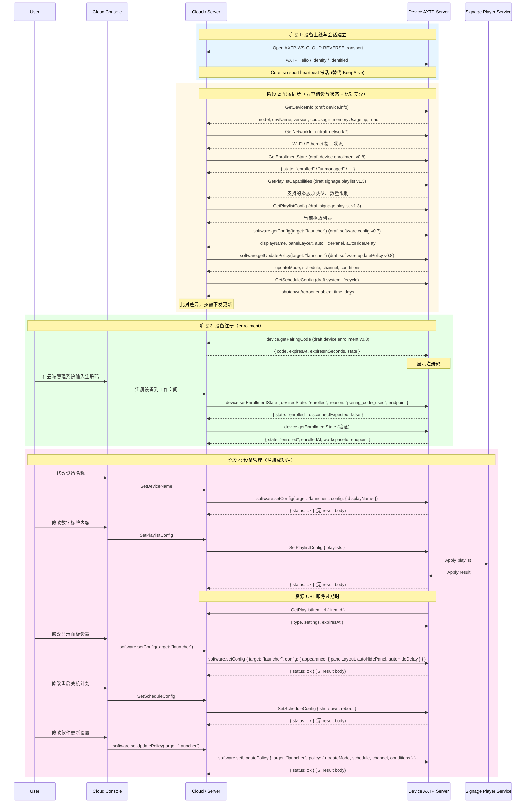

# NearHub Launcher Digital Signage Device Management Protocol Interaction Flow

> Status: flow design
> Scope: NearHub Launcher digital signage device management — implemented commands only
> Source inputs: `docs/legacy-migration/evidence/NearHub-Launcher数字标牌设备管理通用管理命令.md`
> Protocol lifecycle: Stage 10 `plan-protocol-flow`

本文根据 NearHub Launcher legacy Device SDK 文档中 **已研发** 的指令，把数字标牌设备管理交互整理为 AXTP 场景级交互 flow。本文不是最终协议事实源；已采纳事实以 `registry/**/*.yaml`、`registry/domains/**/*.yaml` 和 `docs/generated/**` 为准，新增或修改协议必须转入 `docs/protocol/**` 草案和后续采纳流程。

**范围说明：** 证据文档共 17 个已研发条目，其中 2 个 KeepAlive 由 Core heartbeat 替代，本 flow 覆盖剩余 15 个业务指令。14 个未研发指令（音频设置、固件升级、遥测上报、日志导出、系统时间、恢复出厂、SD 卡管理等）不在本 flow 范围内。

## 0. 速读结论

| 项目 | 内容 |
|---|---|
| Flow 目标 | NearHub Launcher 数字标牌设备管理全流程协议覆盖 — 设备上线、配置同步、注册纳管、管理配置四阶段。 |
| 当前协议覆盖 | **partial** — 全部业务指令已有 draft 覆盖，但无正式 adopted/generated domain（仅 `audio` domain 在 registry 中）。 |
| 涉及 domain.feature | `device.info`, `device.enrollment`, `network.interface` / `network.ip` / `network.wifi`, `signage.playlist`, `software.config`, `software.updatePolicy`, `system.lifecycle` |
| 已有 adopted/generated | AXTP Core session / transport / heartbeat / RPC envelope (`docs/generated/protocol.md`)。 |
| 缺口 | 7 个业务 domain 仍 draft-only，未进入 registry adoption。 |
| 是否需要新增协议草案 | no — 全部缺口已有成熟 draft 覆盖。 |
| 是否涉及 Legacy | yes — 15 个 legacy Device SDK 指令需 AXTP adapter 迁移。 |
| 是否涉及 STREAM | no |
| 下一步 | 6 个 domain.feature（`device.enrollment`, `signage.playlist`, `software.config`, `software.updatePolicy`, `system.lifecycle`, `device.info`）转 Stage 30 `adopt-protocol-draft`；`network.*` 待 draft 成熟后补齐。 |

## 1. Story Summary

| Item | Content |
|---|---|
| User goal | 设备上线后，运维人员通过云端管理系统完成设备注册（enrollment）和配置管理，包括设备名称、数字标牌内容、显示面板、重启关机计划和软件更新策略。 |
| Trigger | 设备启动并连接云端。 |
| Success result | 设备完成注册，所有管理配置项可正常读写和同步。 |
| Primary actors | User / operator, Cloud management console, Cloud / Server, Device AXTP server, Signage player service |
| Product scope | NearHub Launcher digital signage — implemented commands scope |

**端到端流程（4 阶段）：**

1. **设备上线** — 设备启动，通过 `AXTP-WS-CLOUD-REVERSE` 连接云端，建立 AXTP session。
2. **配置同步** — 云端查询设备当前状态（设备信息、网络、注册状态、播放列表、软件配置、更新策略、计划任务），比对差异后按需下发更新。
3. **设备注册（enrollment）** — 设备主动向云端获取注册码，设备展示注册码，用户在云端管理系统输入注册码，完成设备到工作空间的注册。
4. **设备管理** — 注册成功后，用户通过云端管理系统修改设备名称、数字标牌内容、显示面板设置、重启关机计划、软件更新设置。

## 2. Source Observations

### 2.1 UI / Prototype

| Screen or control | Observed behavior | Protocol relevance |
|---|---|---|
| 设备列表 / 连接入口 | 设备上线后进入管理入口。 | Core transport heartbeat + session；业务级 KeepAlive 不保留。 |
| 设备概览页 | 展示型号、设备名、CPU、内存、IP、MAC、版本。 | Legacy `GetDeviceInfo` → draft `device.info`。 |
| 设备名称编辑 | 修改设备显示名。 | Legacy `SetDeviceName` → draft `software.config` v0.7（target: `"launcher"`，`displayName` 字段）。 |
| 网络摘要 | 返回 Wi-Fi / Ethernet 数组，含 connected、ip、mac、ssid、rssi。 | Legacy `GetNetworkInfo` → draft `network.*`。 |
| 注册码页面 | 设备获取并展示注册码（含过期时间），用户在云端输入注册码。 | Legacy `GetBindCode` → draft `device.enrollment` v0.8；`GetBindConfig` / `SetBindConfig` → `device.getEnrollmentState` / `device.setEnrollmentState`。 |
| 播放列表管理 | 服务端全量同步播放列表，设备读取当前列表，资源 URL 即将过期时设备请求刷新。 | Legacy `SetPlaylistConfig` / `GetPlaylistConfig` / `GetPlaylistItemUrl` → draft `signage.playlist` v1.3。废弃 `slideshow` 类型，Adapter 映射为 `image`。 |
| 外观设置 | 管理 `panelLayout`、`autoHidePanel`、`autoHideDelay`。 | Legacy `GetAppearanceConfig` / `SetAppearanceConfig` → draft `software.config` v0.7（target: `"launcher"`，`appearance` 子对象）。 |
| 更新策略设置 | 管理自动更新开关、时间窗口和通道。 | Legacy `GetUpdateConfig` / `SetUpdateConfig` → draft `software.updatePolicy` v0.8（target: `"launcher"`，`updateMode` 枚举 + `schedule` + `channel` + `conditions`）。 |
| 计划任务设置 | 管理定时关机和定时重启（enabled、time、days）。 | Legacy `GetScheduleConfig` / `SetScheduleConfig` → draft `system.lifecycle`。 |
| UI prototype image | `[REVIEW-ASK]` 本轮没有 UI 图或产品原型；页面布局、按钮确认弹窗和失败文案需产品/UI 确认。 | 不新增协议，只影响 App 呈现和交互细节。 |

### 2.2 Requirement Notes

- 旧指令采用 Device SDK 风格：Command 为请求-响应，Event 为单向通知。本 flow 只涉及请求-响应型指令（已研发的 17 个条目中，2 个 KeepAlive 事件也由 Core 替代）。
- 旧 `Set*` 指令统一返回 `{ "ok": true }`；AXTP 中应迁移为标准成功 status 或 typed response。
- 新数字标牌业务目标是 `axtp_only`：App、服务端和固件改用 generated method/schema/capability，不继续扩展旧 SDK command 字符串。
- 配置同步采用"云查询设备状态 + 比对差异 + 按需下发"模式。
- KeepAlive 在本 flow 中由 Core transport heartbeat 替代，不再保留为业务指令。

### 2.3 Device / System State Observations

| State | Meaning | Protocol relevance |
|---|---|---|
| AXTP session connected | 设备通过 `AXTP-WS-CLOUD-REVERSE` 与云端建立 RPC session。 | 所有业务方法的前提条件（P2–P4）。 |
| Enrollment state（6 枚举） | `unmanaged` / `pairing_available` / `pending` / `enrolled` / `failed` / `unenrolling` | 决定设备进入注册阶段（P3）还是管理阶段（P4）。 |
| Playlist config | 当前播放列表全量配置（playlists + items + settings）。 | 全量替换语义；每次 set 是硬替换。 |
| Software config per target | 每个 target（`launcher` / `signagePlayer` / `agent`）的运行配置。 | `setConfig` 使用 partial update；`getConfig` 返回完整配置。 |
| Update policy per target | 每个 target 的更新策略（updateMode + schedule + channel + conditions）。 | 同上。 |
| Reboot / shutdown schedule | 定时重启和关机计划（enabled + time + days）。 | 独立的 get/set per type；无独立变化事件。 |

## 3. Assumptions And Non-Goals

| Type | Item | Status |
|---|---|---|
| Assumption | 数字标牌设备通过 `AXTP-WS-CLOUD-REVERSE` 连接云端；本地调试也可使用 `AXTP-USB-HID` / `AXTP-TCP`。 | `[REVIEW-DRAFT]` |
| Assumption | 设备在 AXTP session ready 后暴露当前支持的业务能力。 | `[REVIEW-DRAFT]` |
| Assumption | KeepAlive 由 Core transport heartbeat 替代，不在业务 flow 中出现。 | `[REVIEW-OK]` |
| Assumption | 配置同步是云查询设备状态后比对差异、按需下发，不是设备主动上报。 | `[REVIEW-OK]` |
| Assumption | 注册流程：设备向云端请求注册码 → 设备展示注册码 → 用户在云端输入注册码 → 云端注册设备到工作空间。 | `[REVIEW-OK]` |
| Assumption | 播放列表 set 是全量替换（硬替换），不是 patch；第二次下发会删除旧配置中未出现的列表或播放项。 | `[REVIEW-OK]` |
| Non-goal | 不覆盖未研发指令（音频设置、固件升级、遥测、日志、系统时间、恢复出厂、SD 卡管理）。 | `[REVIEW-OK]` |
| Non-goal | 不在本阶段修改 `docs/protocol/**`、registry YAML、Protocol IR 或 generated 文件。 | `[REVIEW-OK]` |
| Non-goal | 不保留旧 Device SDK 的 KeepAlive 作为 AXTP 业务指令。 | `[REVIEW-OK]` |
| Non-goal | 不把旧 Device SDK envelope、`sdk.call()`/`sdk.notify()` 编程模型搬进 AXTP Core。 | `[REVIEW-OK]` |

## 4. Protocol Coverage

| Need | Coverage state | AXTP protocol | Evidence | Next action |
|---|---|---|---|---|
| 建立 AXTP session | Adopted/generated core | AXTP session, `AXTP-WS-CLOUD-REVERSE` | `docs/generated/protocol.md` | 可按 Core 实现连接和 RPC envelope。 |
| 设备在线和心跳 | Adopted/generated core | Core transport heartbeat | `docs/generated/protocol.md` | 直接使用 Core heartbeat。 |
| 设备基础信息查询 | Drafted (review-ok) | `device.info` | `docs/protocol/device/device.info.md` | 草案已达 review-ok 状态；转 Stage 30 registry review + adopt。 |
| 修改设备名 | Drafted only | `software.config`（target: `"launcher"`） | `docs/protocol/software/software.config.md` v0.7（含 `displayName` 字段） | `displayName` 写入路径已归入 `software.config`，`device.info` 只读返回。`[REVIEW-RESOLVED]` 归属已确认（`software.config` v0.7 写入 + `device.info` 只读），转 Stage 30 采纳。 |
| 网络信息查询 | Drafted only | `network.interface` + `network.ip` + `network.wifi` | `docs/protocol/network/*.md` | 转 Stage 20 分解旧数组聚合响应。 |
| 注册码获取 | Drafted only | `device.enrollment` | `docs/protocol/device/device.enrollment.md` v0.8 | `device.getPairingCode` 方向已确认（Device → Server）；6 状态枚举和状态机已定义。`[REVIEW-ASK]` pairing code 命名确认后转 Stage 30 采纳。 |
| 注册状态查询/设置 | Drafted only | `device.enrollment` | `docs/protocol/device/device.enrollment.md` v0.8 | enrollment state 6 枚举值和 legacy 字段映射已完成。转 Stage 30 采纳。 |
| 播放列表能力查询 | Drafted only | `signage.playlist` | `docs/protocol/signage/signage.playlist.md` v1.3 | `signage.getPlaylistCapabilities`；转 Stage 30 采纳。 |
| 播放列表全量同步 | Drafted only | `signage.playlist` | `docs/protocol/signage/signage.playlist.md` v1.3 | playlists/items/settings schema 已完成；全量替换语义已确认（硬替换）。转 Stage 30 采纳。 |
| 播放列表查询 | Drafted only | `signage.playlist` | `docs/protocol/signage/signage.playlist.md` v1.3 | set/get 结构一致。转 Stage 30 采纳。 |
| 播放项 URL 刷新 | Drafted only | `signage.playlist` | `docs/protocol/signage/signage.playlist.md` v1.3 | URL refresh 重构为 `type` + `settings` 显式类型判别模式。转 Stage 30 采纳。 |
| 外观/面板配置 | Drafted only | `software.config`（target: `"launcher"`） | `docs/protocol/software/software.config.md` v0.7 | target 枚举列出 `"launcher"`/`"signagePlayer"`/`"agent"`；外观字段嵌套为 `appearance` 子对象。`[REVIEW-ASK]` target 完整枚举确认后转 Stage 30 采纳。 |
| 软件更新策略 | Drafted only | `software.updatePolicy`（target: `"launcher"`） | `docs/protocol/software/software.updatePolicy.md` v0.8 | `updateMode` 枚举已定义（`auto`/`manual`/`notify`）；跨午夜 `schedule` 语义草案候选中（`end < start` 表示跨日），采纳前确认 `[REVIEW-ASK]`。转 Stage 30 采纳。 |
| 重启关机计划 | Drafted only | `system.lifecycle` | `docs/protocol/system/system.lifecycle.md` | system.lifecycle v0.8 已覆盖 reboot/shutdown schedule；legacy 字段映射已完成。转 Stage 30 采纳。 |

## 5. End-To-End Sequence

## 6. Interaction Steps

| Step | Phase | Actor | User or system action | Protocol call/event | Request / event payload notes | Response / state result | Error or fallback |
|---:|---|---|---|---|---|---|---|
| 1 | P1 | Device / Cloud | 设备上线并建立 AXTP session。 | Generated core transport/session | `AXTP-WS-CLOUD-REVERSE` 或产品选择的 transport。 | RPC session ready。 | 握手失败返回 core/session error。 |
| 2 | P1 | Device / Cloud | 维护在线状态。 | Core transport heartbeat | 替代旧 `KeepAlive` 指令和事件。 | Cloud 持续感知设备在线。 | 心跳超时触发断连和重连。 |
| 3 | P2 | Cloud / Device | 查询设备基础信息。 | Draft `device.info`（review-ok） | 旧字段：model, devName, cpuUsage, memoryUsage, ip, mac, version。 | UI 展示设备概览。 | 草案已达 review-ok；字段拆分待采纳后对齐。 |
| 4 | P2 | Cloud / Device | 查询网络信息。 | Draft `network.*` | 旧字段：type, connected, ip, mac, ssid, rssi（数组）。 | UI 展示网络状态。 | 需组合 interface/IP/Wi-Fi 查询。 |
| 5 | P2 | Cloud / Device | 查询注册状态。 | Draft `device.enrollment` v0.8 | `device.getEnrollmentState(includeEndpoint: true)`；旧字段 `bound`(bool) → `state`(enum，6 值：`unmanaged`/`pairing_available`/`pending`/`enrolled`/`failed`/`unenrolling`)。 | `{ state: EnrollmentState, endpoint?, enrolledAt? }`。 | 未注册进入阶段 3。 |
| 6 | P2 | Cloud / Device | 查询播放列表能力。 | Draft `signage.playlist` v1.3 | `signage.getPlaylistCapabilities`；请求为空。 | 返回支持的播放项类型、数量限制、功能开关。 | 设备不支持时返回 `NOT_SUPPORTED`。 |
| 7 | P2 | Cloud / Device | 查询播放列表配置。 | Draft `signage.playlist` v1.3 | `signage.getPlaylistConfig`；请求为空。 | 返回当前完整 playlist config。 | 保持 set/get 结构一致。 |
| 8 | P2 | Cloud / Device | 查询外观配置。 | Draft `software.config` v0.7（target: `"launcher"`） | `software.getConfig(target: "launcher")`。 | displayName, appearance: { panelLayout, autoHidePanel, autoHideDelay }。 | target 枚举列出 `"launcher"`/`"signagePlayer"`/`"agent"`。 |
| 9 | P2 | Cloud / Device | 查询更新策略。 | Draft `software.updatePolicy` v0.8（target: `"launcher"`） | `software.getUpdatePolicy(target: "launcher")`。 | updateMode（`auto`/`manual`/`notify`）, schedule（含 timezone）, channel, conditions。 | `updateMode` 枚举已定义；`schedule.end < schedule.start` 表示跨日。 |
| 10 | P2 | Cloud / Device | 查询计划任务配置。 | Draft `system.lifecycle` v0.8 | 请求为空。 | shutdown/reboot enabled, time, days。 | system.lifecycle v0.8 已有 get/setRebootSchedule 和 get/setShutdownSchedule。 |
| 11 | P2 | Cloud | 比对配置差异，按需下发更新。 | 非 protocol — Cloud 本地逻辑 | 比对查询结果与云端存储。 | 决定是否需要下发 set 操作。 | 差异下发走对应 set 方法。 |
| 12 | P3 | Device / Cloud | 设备请求注册码。 | Draft `device.enrollment` v0.8 — `device.getPairingCode` | `{ refresh: false, purpose: "initial_enrollment" }`；方向 Device → Server。 | `{ code, expiresAt, expiresInSeconds: 1800, state: "available" }`。 | `expiresInSeconds` 来自 legacy 实测不可省略。 |
| 13 | P3 | User / Console | 用户在云端输入注册码。 | 非 protocol — Console 本地 UI | 用户输入注册码。 | Console 提交注册请求。 | 注册码过期或无效时提示用户。 |
| 14 | P3 | Cloud / Device | 云端通知设备注册成功。 | Draft `device.enrollment` v0.8 — `device.setEnrollmentState` | `{ desiredState: "enrolled", reason: "pairing_code_used", endpoint: { endpointId, type, displayName, profileId } }`。 | `{ state: EnrollmentState, disconnectExpected: false }`。状态变化触发 `device.enrollmentStateChanged` 事件。 | endpoint 结构含 profileId。 |
| 15 | P3 | Cloud / Device | 验证注册状态。 | Draft `device.enrollment` v0.8 — `device.getEnrollmentState` | `{ includeEndpoint: true }`。 | `{ state: "enrolled", workspaceId, enrolledAt, endpoint: { ... } }`。 | 验证失败需重试或回滚。 |
| 16 | P4 | User / Console / Cloud / Device | 修改设备名称。 | Draft `software.config` v0.7（target: `"launcher"`） | `software.setConfig(target: "launcher", config: { displayName })`。字段映射：`devName` → `displayName`。 | 返回标准成功响应（无 result body）；触发 `software.configChanged` 事件，通过 `getConfig` 确认。 | 写入路径在 `software.config`，`device.info` 只读返回。 |
| 17 | P4 | User / Console / Cloud / Device | 全量同步播放列表。 | Draft `signage.playlist` v1.3 | `signage.setPlaylistConfig`：`playlists[]`，含日期/时间/星期、items、settings。硬替换语义。 | 播放器替换当前配置；触发 `signage.playlistConfigChanged` 事件。 | 第二次全量下发删除缺失项；废弃 `slideshow` 类型由 Adapter 映射为 `image`。 |
| 18 | P4 | Device / Cloud | 刷新播放项资源 URL。 | Draft `signage.playlist` v1.3 | `signage.getPlaylistItemUrl`：`{ itemId }`；返回 `type` + `settings` 显式类型判别。 | 设备获得新资源 URL（含 expiresAt）；`clock` 类型返回 `NOT_SUPPORTED`。 | URL refresh 重构为 type+settings 模式。 |
| 19 | P4 | User / Console / Cloud / Device | 设置外观配置。 | Draft `software.config` v0.7（target: `"launcher"`） | `software.setConfig(target: "launcher", config: { appearance: { panelLayout, autoHidePanel, autoHideDelay } })`。partial update 语义。 | 返回标准成功响应（无 result body）；触发 `software.configChanged` 事件，通过 `getConfig` 确认。 | 外观字段包裹在 `appearance` 子对象中。 |
| 20 | P4 | User / Console / Cloud / Device | 设置重启关机计划。 | Draft `system.lifecycle` v0.8 | `system.setRebootSchedule` / `system.setShutdownSchedule`：enabled, time, days。 | 设备计划保存。 | system.lifecycle v0.8 已有 schedule 方法。 |
| 21 | P4 | User / Console / Cloud / Device | 设置软件更新策略。 | Draft `software.updatePolicy` v0.8（target: `"launcher"`） | `software.setUpdatePolicy(target: "launcher", policy: { updateMode, schedule, channel, conditions })`。partial update 语义。 | 返回标准成功响应（无 result body）；触发 `software.updatePolicyChanged` 事件，通过 `getUpdatePolicy` 确认。 | `updateMode` 枚举（`auto`/`manual`/`notify`）；跨午夜 `schedule` 语义草案候选中，采纳前确认 `[REVIEW-ASK]`。 |
| 22 | P4 | User / Console / Cloud / Device | 恢复默认播放列表。 | Draft `signage.playlist` v1.3 | `signage.resetPlaylistConfig`；请求为空。 | 返回重置后的 `PlaylistConfigResult`。 | 不影响系统配置。 |
| 23 | P4 | User / Console / Cloud / Device | 恢复默认软件配置。 | Draft `software.config` v0.7 | `software.resetConfig(target: "launcher")`；请求含 target。 | 返回重置后的完整 `SoftwareConfig`。 | 仅恢复软件配置，不触发设备重启；legacy `ResetConfig` 映射到 `system.restoreFactorySettings`。 |
| 24 | P4 | User / Console / Cloud / Device | 恢复默认更新策略。 | Draft `software.updatePolicy` v0.8 | `software.resetUpdatePolicy(target: "launcher")`；请求含 target。 | 返回重置后的完整 `SoftwareUpdatePolicy`。 | 不影响固件更新策略。 |

## 7. State Changes And Events

| State change | Trigger | Event | Payload | Client handling | Coverage |
|---|---|---|---|---|---|
| Enrollment state 变化 | `device.setEnrollmentState` 调用成功 | `device.enrollmentStateChanged` | EnrollmentState + endpoint + enrolledAt + previousState | Cloud 更新设备注册状态 UI | draft |
| 播放列表配置变更 | `signage.setPlaylistConfig` 或 `signage.resetPlaylistConfig` 成功 | `signage.playlistConfigChanged` | `PlaylistConfigChangedEvent`（payload schema，见 `signage.playlist` v1.3 §4.1：`reason` + 可选 `playlists`） | Cloud 更新播放列表状态；设备端播放器应用新配置 | draft |
| 软件配置变更 | `software.setConfig` 或 `software.resetConfig` 成功 | `software.configChanged` | target + 完整 SoftwareConfig | Cloud 更新设备配置 UI | draft |
| 更新策略变更 | `software.setUpdatePolicy` 或 `software.resetUpdatePolicy` 成功 | `software.updatePolicyChanged` | target + 完整 SoftwareUpdatePolicy | Cloud 更新策略 UI | draft |
| 重启/关机计划变更 | `system.setRebootSchedule` / `system.setShutdownSchedule` 成功 | 无独立事件（system.lifecycle draft 未定义 scheduleChanged 事件） | — | Cloud 通过 get 方法验证 | draft |

## 8. Protocol Details

### 8.1 Adopted / Generated Protocols

| Method/Event | Purpose in this flow | Source |
|---|---|---|
| AXTP session / transport | 设备上线和连接管理 | `docs/generated/protocol.md` |
| Core transport heartbeat | 替代旧 KeepAlive，维护设备在线 | `docs/generated/protocol.md` |
| `AXTP-WS-CLOUD-REVERSE` | 数字标牌设备与云端之间的 RPC WebSocket 管理通道 | `docs/generated/protocol.md` |
| RPC request/response envelope | 替代旧 Device SDK command envelope | `docs/generated/protocol.md`, `protocol/axtp.protocol.yaml` |
| Core and domain error codes | `RPC_METHOD_NOT_FOUND`, `RPC_PARAM_INVALID`, `NOT_SUPPORTED`, `PERMISSION_DENIED` 等 | `docs/generated/protocol.md`, `registry/error/error_code.yaml` |

### 8.2 Draft Protocol Dependencies

| Draft capability | Needed legacy entries | Draft methods/events | Source |
|---|---|---|---|
| `device.info` | `GetDeviceInfo` | `device.getInfo`（只读） | `docs/protocol/device/device.info.md` |
| `network.interface` + `network.ip` + `network.wifi` | `GetNetworkInfo` | interface list/info, IP config, Wi-Fi state | `docs/protocol/network/*.md` |
| `device.enrollment` | `GetBindCode`, `GetBindConfig`, `SetBindConfig` | `device.getPairingCode` / `device.getEnrollmentState` / `device.setEnrollmentState` / `device.enrollmentStateChanged` | `docs/protocol/device/device.enrollment.md` v0.8 |
| `signage.playlist` | `SetPlaylistConfig`, `GetPlaylistConfig` | `signage.getPlaylistCapabilities` / `signage.getPlaylistConfig` / `signage.setPlaylistConfig` / `signage.resetPlaylistConfig` / `signage.getPlaylistItemUrl` / `signage.playlistConfigChanged` | `docs/protocol/signage/signage.playlist.md` v1.3 |
| `software.config`（target: `"launcher"`） | `GetAppearanceConfig`, `SetAppearanceConfig`, `SetDeviceName` | `software.getConfig` / `software.setConfig` / `software.resetConfig` / `software.configChanged` | `docs/protocol/software/software.config.md` v0.7 |
| `software.updatePolicy`（target: `"launcher"`） | `GetUpdateConfig`, `SetUpdateConfig` | `software.getUpdatePolicy` / `software.setUpdatePolicy` / `software.resetUpdatePolicy` / `software.updatePolicyChanged` | `docs/protocol/software/software.updatePolicy.md` v0.8 |
| `system.lifecycle` | `GetScheduleConfig`, `SetScheduleConfig` | `system.get/setRebootSchedule` / `system.get/setShutdownSchedule` | `docs/protocol/system/system.lifecycle.md` v0.8 |

### 8.3 Legacy Mapping Checklist

| Legacy entry | Direction | AXTP target | Coverage state | Follow-up |
|---|---|---|---|---|
| `KeepAlive` 指令 | Server <-> Device | Core transport heartbeat | Adopted core | 不保留为业务指令。 |
| `KeepAlive` 事件 | Server <-> Device | Core transport heartbeat | Adopted core | 不保留为业务指令。 |
| `GetDeviceInfo` | Server -> Device | `device.info` | Drafted only | 补完整概览 schema。 |
| `SetDeviceName` | Server -> Device, Device -> Server | `software.setConfig(target: "launcher", config: { displayName })` | Drafted only | 草案 `software.config` v0.7 已含 `displayName` 字段；`device.info` 只读返回。 |
| `GetNetworkInfo` | Server -> Device | `network.interface` + `network.ip` + `network.wifi` | Drafted only | 分解旧数组聚合响应。 |
| `GetBindCode` | Device -> Server | `device.getPairingCode` | Drafted only | 草案 `device.enrollment` v0.8；字段映射 `code` + `expiresInSeconds`(1800)；6 状态枚举 + 状态机已定义。 |
| `GetBindConfig` | Server <-> Device | `device.getEnrollmentState` | Drafted only | 草案 `device.enrollment` v0.8；旧 `bound`(bool) → `state`(enum，6 值)。 |
| `SetBindConfig` | Server -> Device | `device.setEnrollmentState` | Drafted only | 草案 `device.enrollment` v0.8；旧 `bound: true` → `desiredState: "enrolled"`；endpoint 含 profileId。 |
| `SetPlaylistConfig` | Server -> Device | `signage.setPlaylistConfig` | Drafted only | 草案 `signage.playlist` v1.3；全量替换 schema 已完成；硬替换语义已确认。 |
| `GetPlaylistConfig` | Server <-> Device | `signage.getPlaylistConfig` | Drafted only | 草案 `signage.playlist` v1.3；set/get 结构一致。 |
| `GetPlaylistItemUrl` | Device -> Server | `signage.getPlaylistItemUrl` | Drafted only | 草案 `signage.playlist` v1.3；重构为 `type` + `settings` 显式类型判别模式；`clock` 类型返回 `NOT_SUPPORTED`。 |
| `GetAppearanceConfig` | Server <-> Device | `software.getConfig(target: "launcher")` | Drafted only | 草案 `software.config` v0.7；字段嵌套为 `config.appearance.*`。 |
| `SetAppearanceConfig` | Server <-> Device | `software.setConfig(target: "launcher")` | Drafted only | 草案 `software.config` v0.7；旧 flat 字段需 adapter 包装为 `config.appearance.*`。 |
| `GetUpdateConfig` | Server <-> Device | `software.getUpdatePolicy(target: "launcher")` | Drafted only | 草案 `software.updatePolicy` v0.8；旧 `autoUpdate`(bool) → `updateMode`(enum: `auto`/`manual`/`notify`)。 |
| `SetUpdateConfig` | Server <-> Device | `software.setUpdatePolicy(target: "launcher")` | Drafted only | 草案 `software.updatePolicy` v0.8；旧 `true` → `"auto"`，`false` → `"manual"`。新增 `timezone` 和 `conditions` 字段。 |
| `GetScheduleConfig` | Server <-> Device | `system.getRebootSchedule` / `system.getShutdownSchedule` | Drafted only | system.lifecycle v0.8 已覆盖；补 legacy 字段映射。 |
| `SetScheduleConfig` | Server <-> Device | `system.setRebootSchedule` / `system.setShutdownSchedule` | Drafted only | system.lifecycle v0.8 已覆盖；补 legacy 字段映射。 |

### 8.4 Drafted Protocol Gaps

> 以下 gap 在本 flow 编写时标记为 Missing，现已全部有草案覆盖（v0.6–v1.2）。核心设计决策已关闭，转 `adopt-protocol-draft` 采纳。

| Gap | Draft | Draft methods/events | Routed skill | Review question |
|---|---|---|---|---|
| `SetDeviceName` 无对应 AXTP 草案 | `software.config` v0.7（target: `"launcher"`） | `software.setConfig(target: "launcher", config: { displayName })` | `adopt-protocol-draft` | `[REVIEW-RESOLVED]` 设备名写入路径归入 `software.config` 的 `displayName` 字段；`device.info` 只读返回。 |
| 设备注册码与状态管理 | `device.enrollment` v0.8 | `device.getPairingCode` / `device.getEnrollmentState` / `device.setEnrollmentState` / `device.enrollmentStateChanged` | `adopt-protocol-draft` | `[REVIEW-RESOLVED]` 旧草案 `device.binding` 已删除；`device.enrollment` 命名更准确。方法名使用 `getPairingCode`（非 `getEnrollmentCode`），待产品确认命名偏好。 |
| Schedule 定域已解决 | `system.lifecycle` v0.8 | get/setRebootSchedule + get/setShutdownSchedule | `adopt-protocol-draft` | `[REVIEW-RESOLVED]` 关机/重启调度已定域 `system.lifecycle` v0.8；`signage.schedule` 草案可删除。 |
| 播放项 URL 刷新已定域 | `signage.playlist` v1.3 | `signage.getPlaylistItemUrl` | `adopt-protocol-draft` | `[REVIEW-RESOLVED]` URL 刷新是播放项级操作，已归属 `signage.playlist`；`signage.media` 草案已删除，功能已合并。 |
| Launcher 外观/面板配置 | `software.config` v0.7（target: `"launcher"`） | `software.getConfig` / `software.setConfig` / `software.resetConfig` / `software.configChanged` | `adopt-protocol-draft` | `[REVIEW-RESOLVED]` 旧草案 `device.appearance` 已删除；外观配置实为 Launcher 软件配置，迁入 `software.config` 统一管理。 |
| 软件更新策略 | `software.updatePolicy` v0.8（target: `"launcher"`） | `software.getUpdatePolicy` / `software.setUpdatePolicy` / `software.resetUpdatePolicy` / `software.updatePolicyChanged` | `adopt-protocol-draft` | `[REVIEW-RESOLVED]` 旧草案 `firmware.updatePolicy` 已回退为骨架；更新策略迁入 `software.updatePolicy`，通过 target 区分组件。 |

## 9. Test / Conformance Notes

| Fixture | Expected result |
|---|---|
| `signage-device-session-ready` | 设备通过 `AXTP-WS-CLOUD-REVERSE` 完成 AXTP session，Cloud 能发送 RPC。 |
| `signage-device-heartbeat` | Core transport heartbeat 正常维护在线状态，替代旧 KeepAlive。 |
| `signage-device-config-sync` | 云端查询 8 项配置状态（设备信息、网络、注册、播放能力、播放列表、软件配置、更新策略、计划任务），比对差异后按需下发。 |
| `signage-device-enrollment-code` | 设备向云端请求注册码，返回 code + expiresAt + expiresInSeconds。 |
| `signage-device-enrollment-complete` | 云端设置注册状态 enrolled=true，设备确认，查询验证注册成功。 |
| `signage-device-name-set` | 修改设备名称后设备返回成功，查询确认新名称生效。 |
| `signage-playlist-full-replace` | 全量同步播放列表，第二次下发删除未出现的旧 item。 |
| `signage-playlist-item-url-refresh` | 设备用 itemId 刷新 URL，返回 `type` + `settings` 显式类型判别（image/video/website/unsplash 各自字段，含 `expiresAt`）；`clock` 类型返回 `NOT_SUPPORTED`。 |
| `software-config-launcher` | `software.getConfig(target: "launcher")` / `software.setConfig(target: "launcher")` 配置 get/set 一致。 |
| `system-lifecycle-schedule-config` | 定时关机/重启计划 set/get 一致，映射到 system.get/setRebootSchedule 和 system.get/setShutdownSchedule。 |
| `software-update-policy-launcher` | `software.getUpdatePolicy(target: "launcher")` / `software.setUpdatePolicy(target: "launcher")` 策略 set/get 一致。 |
| `signage-legacy-command-rejected` | 新 AXTP 主入口收到旧 `SetPlaylistConfig` / `GetDeviceInfo` 字符串时返回 method not found；灰度 adapter 另测。 |

## 10. Acceptance Gates

- 证据文档中 17 个已研发指令全部有 AXTP 覆盖结论（其中 KeepAlive 2 个由 Core 替代，15 个有明确 AXTP 映射）。
- 14 个未研发指令不在本 flow 中出现。
- KeepAlive 在 flow 中标注为"由 Core heartbeat 替代"，不保留为业务指令。
- 配置同步阶段（阶段 2）独立且完整：8 项查询 + 差异比对 + 按需下发。
- 设备注册阶段（阶段 3）独立且完整：获取注册码 → 用户输入 → 设置注册状态 → 验证。
- App、服务端和固件的新主路径只使用 generated method/schema；旧 command 字符串只在灰度 adapter 中存在。
- `device.info`、`device.enrollment`、`software.config`、`software.updatePolicy`、`signage.playlist`、`system.lifecycle` 等命名冲突或语义不清问题在 Stage 20/30 中被消解。
- 后续完成草案采纳后，必须运行 Generator 刷新 `protocol/axtp.protocol.yaml` 和 `docs/generated/**`。

## 11. Open Questions

| Question | Impact | Owner | Status | Next action |
|---|---|---|---|---|
| 设备管理页面真实 UI 原型有哪些 tab、字段、权限和确认弹窗？ | product / UI | 产品 | [REVIEW-ASK] | 提供 UI 原型图或页面规格说明。 |
| `SetDeviceName` 应归属 `device.info` 还是 `software.config`？ | protocol | 架构 | [REVIEW-RESOLVED] | `software.config` v0.7 已明确：`displayName` 在 software.config 写入，device.info 只读。采纳前最终确认。 |
| `software.config` 的 target 完整枚举值有哪些？ | schema | 产品/架构 | [REVIEW-ASK] | 草案列出 `"launcher"`/`"signagePlayer"`/`"agent"`；完整列表采纳前确认。 |
| `firmware.updatePolicy` 与 `software.updatePolicy` 是否统一？ | protocol | 架构 | [REVIEW-RESOLVED] | v0.5/v0.7 已明确边界。未来统一到 `software.updatePolicy(target: "firmware")` 仍 [REVIEW-ASK]。 |
| "pairing code" vs "enrollment code" 命名偏好？ | naming | 产品 | [REVIEW-ASK] | `device.enrollment` v0.8 确认用 `getPairingCode`；产品最终确认命名。 |
