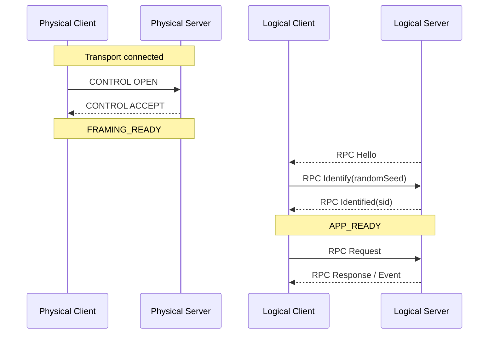
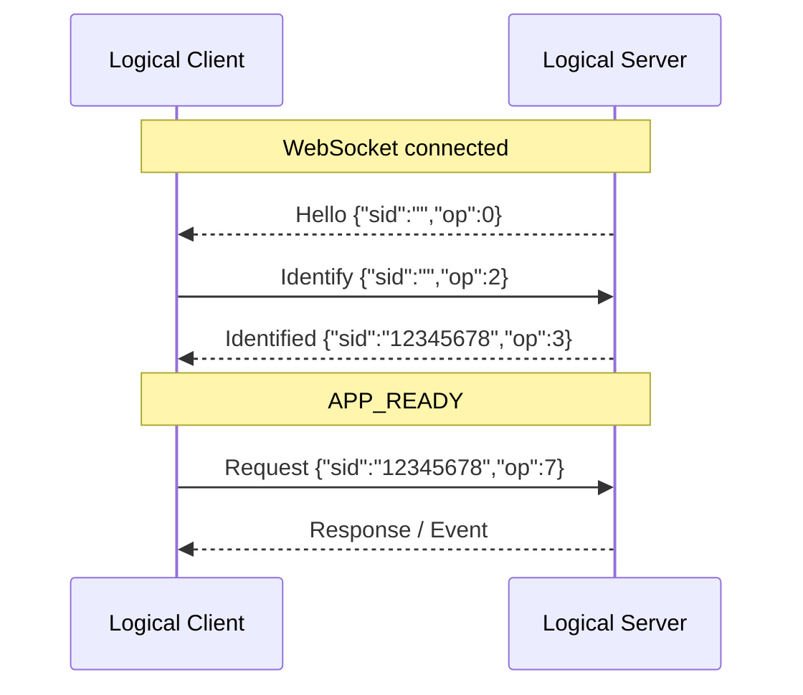
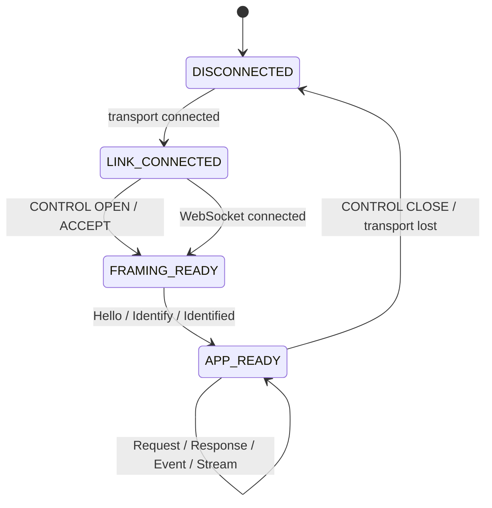

# AXTP 核心协议流程指南

本文是 runtime、SDK、mock server 和测试同学的轻量入口，只说明最小启动顺序和实现边界。正式 wire / session 语义以 [Core Spec](../../specs/20-core.md) 为准；完整报文、认证细节和 STREAM 样例保留在仓库后台 `workspace/runtime/core-protocol-flow.md`，不进入默认 release artifact。

## 1. 两层启动

AXTP 把传输链路和应用会话分成两层：

```text
CONTROL OPEN / ACCEPT 只建立 AXTP Framed Link Context。
RPC Hello / Identify / Identified 才建立 AXTP RPC Session。
```

方向也要分清：

```text
OPEN 跟随 Physical Client -> Physical Server。
Hello 永远由 Logical Server -> Logical Client。
```

设备主动连接云端时，设备是 Physical Client，但如果设备提供能力，它仍然是 Logical Server，所以 WebSocket 建立后仍由设备发送 Hello。

## 2. Standard Framed 路径

TCP / USB HID 等 Standard Framed profile 使用固定外层：

```text
Standard Frame Header(12B) + Payload(N) + CRC16(2B)
```

最小顺序：



Standard Framed runtime 必须按 PayloadType 分发：

| PayloadType | Parser | Phase 1 作用 |
|---:|---|---|
| `0x01` | CONTROL | OPEN / ACCEPT / HEARTBEAT / HEARTBEAT_ACK / CLOSE / CLOSE_ACK；ACK / NACK 预留。 |
| `0x02` | RPC | Hello / Identify / Identified / Request / Response / Event。 |
| `0x03` | STREAM | 音视频等连续数据面。 |

## 3. WebSocket JSON 路径

WebSocket JSON 是 RPC-only profile，不使用 Standard Frame Header、CONTROL、CRC 或 STREAM。



WebSocket JSON 不实现：

| 不实现 | 原因 |
|---|---|
| CONTROL OPEN / ACCEPT | WebSocket 连接本身已经提供消息边界；RPC Hello 可直接开始。 |
| CONTROL HEARTBEAT / CLOSE | 使用 WebSocket ping/pong、close 或应用层 RPC 状态。 |
| CRC16 / Standard Frame Header | 不走 Standard Framed Binary。 |
| STREAM | 该 profile 是轻量控制面，不承载连续数据面。 |

## 4. 状态机



| 状态 | 允许 | 不允许 |
|---|---|---|
| `LINK_CONNECTED` | Standard Framed 只允许 CONTROL OPEN；WebSocket 可等待 Hello。 | 业务 RPC / STREAM。 |
| `FRAMING_READY` | Hello / Identify / Identified。 | 业务 Request / STREAM。 |
| `APP_READY` | Request / Response / Event；Standard Framed 可 STREAM。 | 未注册 method、未授权 method、未识别 session。 |

## 5. 实现检查清单

| 检查项 | 通过标准 |
|---|---|
| OPEN 方向 | 只由 Physical Client 发送。 |
| ACCEPT 匹配 | `controlId` 与 OPEN 一致，成功后进入 `FRAMING_READY`。 |
| CONTROL 心跳 | Standard Framed 实现 HEARTBEAT / HEARTBEAT_ACK；连续超时后关闭链路并重连。 |
| CONTROL 关闭 | Standard Framed 实现 CLOSE / CLOSE_ACK；收到 CLOSE 后停止新业务并清理上下文。 |
| ACK/NACK 边界 | Phase 1 只保留字段和 opcode，不实现严格重传。 |
| Hello 方向 | 永远由 Logical Server 发送。 |
| Identify | 新会话 `sid=""`，必须携带 `randomSeed:uint32`。 |
| Identified | 客户端保存 8 位 hex `sid`，后续 RPC 都携带它。 |
| Request gating | Identified 前不得发送业务 Request。 |
| Generated 边界 | APP_READY 后只能调用已采纳并生成的 method。 |
| STREAM 边界 | 只有 Standard Framed runtime 处理 STREAM；WebSocket JSON 不承载 STREAM。 |

## 6. 深入参考

需要完整 CONTROL packet、RPC JSON 包装、OBS-style 认证说明、音视频 STREAM 样例和丢包处理策略时，读仓库后台文件：

```text
workspace/runtime/core-protocol-flow.md
```

该后台文件不是 release artifact 的默认前台材料，不能替代 `specs/20-core.md`、`contract/**` 或 conformance。
