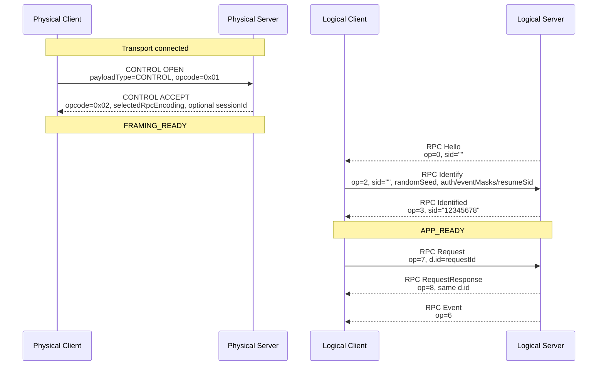
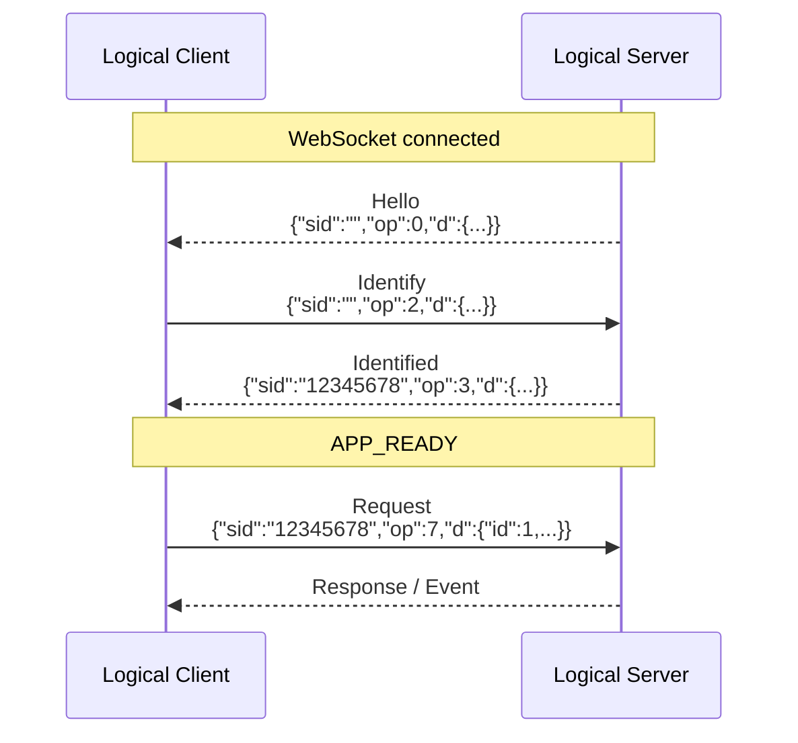
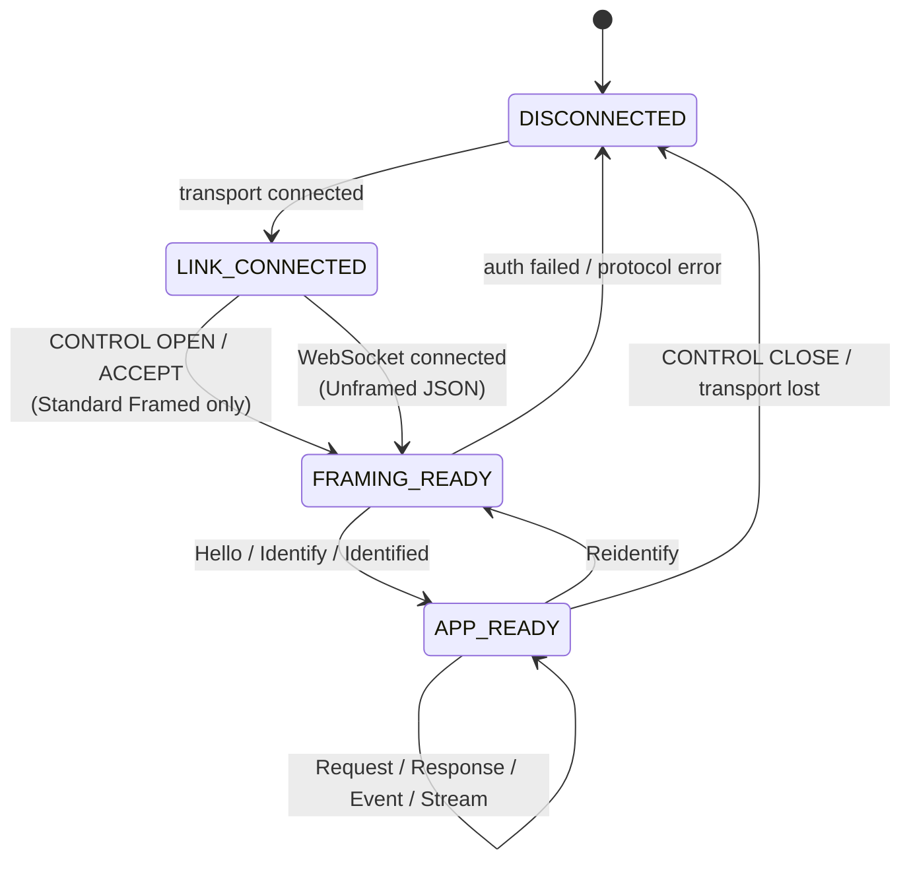
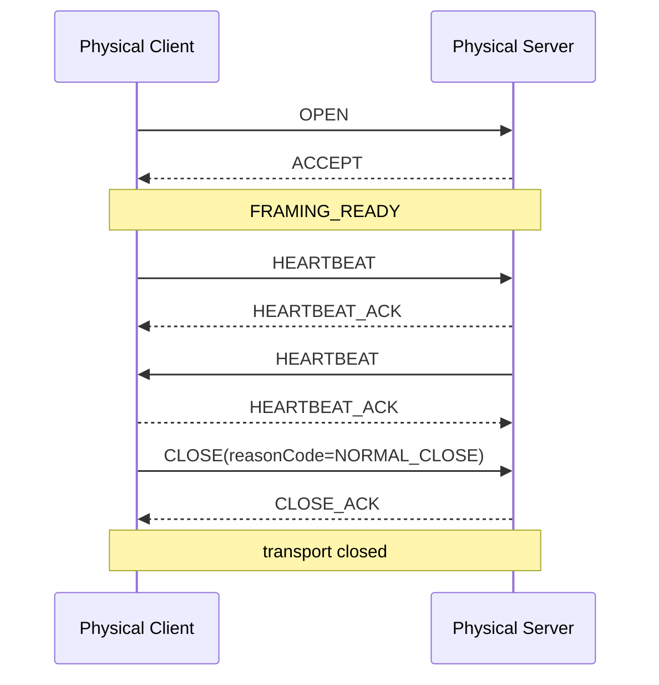
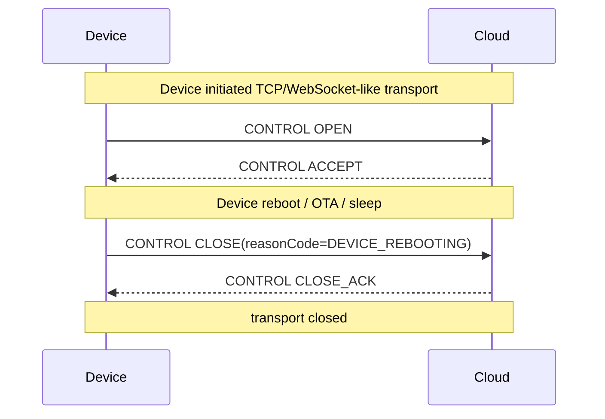
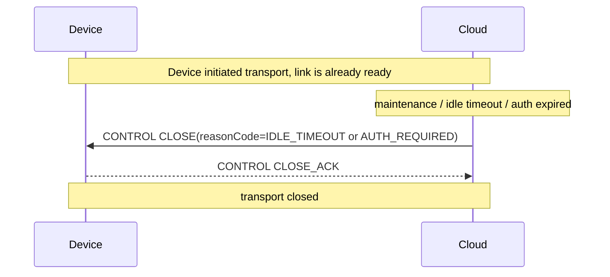
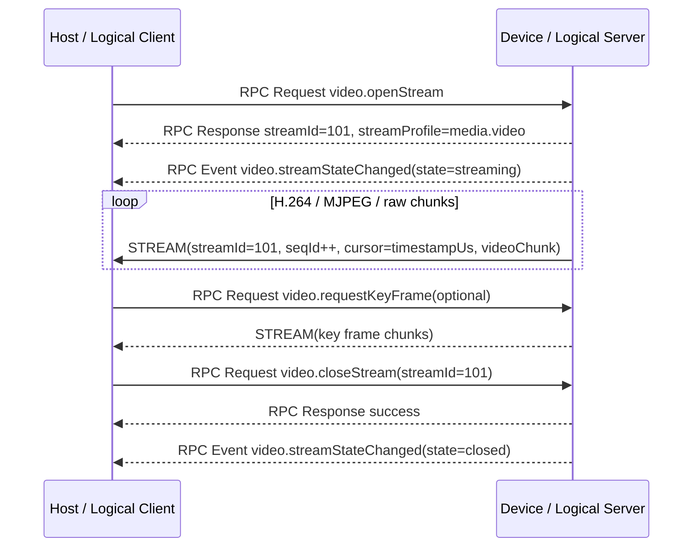
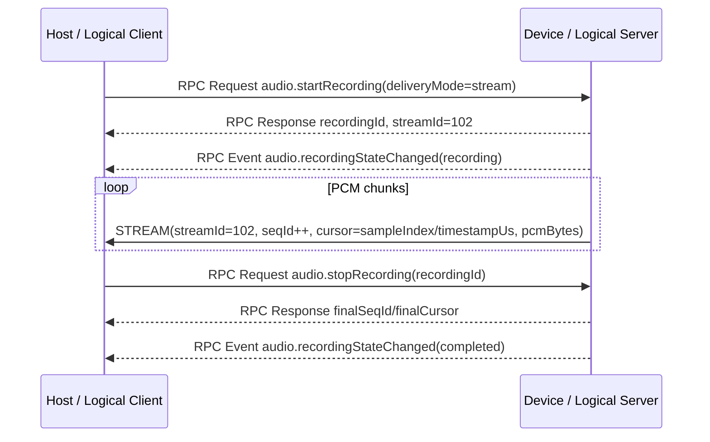

# AXTP 核心协议流程指南

本文面向 runtime、设备端、SDK、mock server 和测试同学，目标是把 Phase 1 里的最小核心链路讲清楚：先建立链路，再建立 RPC 会话，最后才允许业务 Request、Event 和 Stream。

本文不改变 `docs/specs/` 的正式语义，只把研发实现时最容易混淆的字段、报文、状态和鉴权选择集中写在一起。正式 wire format 仍以以下规范为准：

- [Frame and Payload Spec](../specs/1-core/03-Frame-and-Payload.md)
- [Transport Profiles](../specs/1-core/04-Transport-Profiles.md)
- [Control Session Spec](../specs/1-core/05-Control-Session.md)
- [RPC Session Spec](../specs/1-core/06-RPC-Session.md)

## 1. 先记住两句话

```text
CONTROL OPEN / ACCEPT 只建立传输链路上的 AXTP Framed Link Context。
RPC Hello / Identify / Identified 才建立应用层 AXTP RPC Session。
```

```text
OPEN 跟随 Physical Client -> Physical Server。
Hello 永远由 Logical Server -> Logical Client。
```

这两个方向不要混在一起。设备主动连接云端时，设备是 Physical Client，但它仍然是 Logical Server，所以 WebSocket 建立后仍由设备发送 Hello。

## 2. 为什么要分两层

AXTP 把“链路能不能承载 AXTP 帧”和“客户端能不能调用业务能力”拆开，是为了解决几个现实问题：

| 问题 | 拆层后的处理 |
|---|---|
| USB HID / TCP 需要先协商最大 Frame、payload type、心跳和预留 ACK 策略 | 放在 CONTROL OPEN / ACCEPT，不污染业务 RPC；profile-specific MTU 只在对应 transport 需要时出现。 |
| WebSocket JSON 不需要二进制 Frame Header | 直接进入 RPC Hello / Identify，不实现 CONTROL。 |
| 云端反连会让物理连接方向反转 | Hello 按 Logical Server 方向发送，不按 socket accept/connect 判断。 |
| 鉴权、订阅、sid、requestId 属于应用层 | 放在 RPC Hello / Identify / Identified，所有传输形态复用一套语义。 |
| 并发请求、事件和流数据容易互相干扰 | `requestId` 匹配 RPC，`messageId` 匹配 Frame，`streamId` 匹配连续数据流。 |

这样做之后，runtime 可以先实现统一 Core，再按不同 transport 插入 USB HID、TCP、WebSocket 或云端反连。

## 3. 两条正式启动路径

### 3.1 Standard Framed：TCP / USB HID



Standard Framed 线上结构固定为：

```text
Standard Frame Header(12B) + Payload(N) + CRC16(2B)
```

Frame Header 只决定一级 parser：

| PayloadType | Parser | 说明 |
|---:|---|---|
| `0x01` | CONTROL | OPEN / ACCEPT / HEARTBEAT / HEARTBEAT_ACK / CLOSE / CLOSE_ACK；ACK / NACK 仅预留 |
| `0x02` | RPC | Hello / Identify / Request / Response / Event |
| `0x03` | STREAM | P0 音视频媒体流；后续固件、文件、日志等连续数据面 |

### 3.2 WebSocket Unframed JSON：App / Web / Node / Cloud



WebSocket JSON 不使用：

- Standard Frame Header
- CONTROL OPEN / ACCEPT
- CONTROL HEARTBEAT / HEARTBEAT_ACK
- CONTROL CLOSE / CLOSE_ACK
- CONTROL ACK / NACK 严格重传
- CRC16
- STREAM Payload 数据面（Standard Framed P0 必做）
- Binary RPC 15B Header

## 4. 状态机



| 状态 | 允许 | 不允许 |
|---|---|---|
| `LINK_CONNECTED` | Standard Framed 只允许 CONTROL OPEN | RPC / STREAM |
| `FRAMING_READY` | RPC Hello / Identify / Identified | 业务 Request / STREAM |
| `APP_READY` | Request / Response / Event / STREAM | 未注册 method、未授权 method |

## 5. Phase 1 CONTROL 实现范围

Phase 1 只实现三组 CONTROL 消息：

| 消息 | 是否实现 | 为什么需要 | 典型场景 |
|---|---:|---|---|
| `OPEN / ACCEPT` | 是 | 建立 AXTP Framed Link Context，协商最大 Frame、payload type、RPC encoding、心跳间隔和预留 ACK 策略。 | USB HID、TCP、串口网关等需要二进制 Frame 的链路。 |
| `HEARTBEAT / HEARTBEAT_ACK` | 是 | 发现半开连接和静默断链，避免业务层一直等待。 | 设备重启、USB 断开但上层未立即感知、TCP/NAT 空闲超时、移动端网络切换。 |
| `CLOSE / CLOSE_ACK` | 是 | 做优雅下线，让对端清理连接上下文和未完成 RPC。 | App 主动退出、设备准备重启、OTA 前断开、服务端维护下线。 |
| `ACK / NACK` | 预留 | 未来用于严格重传、分片确认、低带宽链路和固件传输；当前版本不做。 | STREAM 固件升级、弱链路选择性重传、需要精确分片确认的 profile。 |

当前不实现 ACK / NACK 的原因很直接：Phase 1 的核心目标是先把控制建连、RPC 会话、业务调用和基础保活跑通。普通 RPC 已经由 `requestId` 和 `REQUEST_RESPONSE.status` 表达业务结果，不需要再为每个 Frame 做一层严格确认。后续如果低带宽、固件升级或 STREAM 场景确实需要可靠分片，再启用已预留的 `ackMode / targetType / messageId / frameIndex`。

最小状态关系：



### 5.1 HEARTBEAT / HEARTBEAT_ACK 最小规则

HEARTBEAT 可以无 body，也可以携带 `timestamp(0x0F)`。HEARTBEAT_ACK 必须复用 HEARTBEAT 的 `controlId`，`statusCode = SUCCESS(0x0000)`。

```text
HEARTBEAT payload:
04 02 00 00 00

HEARTBEAT_ACK payload:
05 02 00 00 00
```

建议实现：

| 项 | 建议 |
|---|---|
| 心跳间隔 | 使用 OPEN / ACCEPT 协商出的 `heartbeatIntervalMs`，建议 1000-5000ms。 |
| 超时判断 | 连续 3 次未收到 HEARTBEAT_ACK，认为链路异常。 |
| 异常处理 | 停止发送业务 RPC 和后续 STREAM 数据，关闭 transport，必要时重新 OPEN。 |
| WebSocket JSON | 不走 CONTROL HEARTBEAT；使用 WebSocket ping/pong 或应用层 RPC event。 |

### 5.2 CLOSE / CLOSE_ACK 最小规则

CLOSE 用于优雅关闭。它不是重传保证，也不要求复杂队列；严重解析错误、CRC 连续失败或安全策略触发时，可以直接断开 transport。

```text
CLOSE payload with reasonCode=NORMAL_CLOSE:
0A 03 00 00 00 10 02 01 00

CLOSE_ACK payload:
0B 03 00 00 00
```

建议实现：

| 场景 | 发送方 | reasonCode |
|---|---|---|
| App 主动退出或正常断开 | 任意一端 | `NORMAL_CLOSE(0x0001)` |
| 空闲超时 | 检测到超时的一端 | `IDLE_TIMEOUT(0x0002)` |
| 协议状态错误 | 检测到错误的一端 | `PROTOCOL_ERROR(0x0003)` |
| 设备准备重启或 OTA | 设备端 | `DEVICE_REBOOTING(0x0005)` |

收到 CLOSE 后，应停止接受新的业务 Request，尽量完成或取消本地未完成任务，发送相同 `controlId` 的 CLOSE_ACK，然后关闭 transport。

设备主动连接云端时，方向要这样理解：

```text
Physical Client = 设备
Physical Server = 云端
```

`OPEN / ACCEPT` 跟随物理建连方向，所以固定是：

```text
设备 -> 云端: CONTROL OPEN
云端 -> 设备: CONTROL ACCEPT
```

但 `CLOSE / CLOSE_ACK` 不跟随建连方向，也不跟随 Logical Server / Logical Client。谁要优雅结束当前 transport 上的 AXTP Framed Link Context，谁就先发送 CLOSE，对端回复 CLOSE_ACK。





如果 transport 已经不可用，例如设备断网、NAT 超时、USB 被拔掉，就不会再有 CLOSE / CLOSE_ACK，runtime 直接按 transport lost 处理并清理本地上下文。

## 6. CONTROL OPEN

OPEN 由 Physical Client 发送，用于声明本端能接受的链路参数。

### 6.1 Payload 结构

```text
Control Payload = opcode(1) + controlId(2) + statusCode(2) + TLV body(N)
```

| 字段 | 类型 | 示例 | 说明 |
|---|---|---|---|
| `opcode` | uint8 | `0x01` | OPEN |
| `controlId` | uint16 BE | `0x0001` | 请求 / 响应匹配序号 |
| `statusCode` | uint16 BE | `0x0000` | OPEN 请求固定填 SUCCESS |
| `body` | TLV | 见下表 | 协商参数 |

OPEN 常用 TLV：

| 字段 | TLV | 示例值 | 示例编码 | 说明 |
|---|---:|---|---|---|
| `maxFrameSize` | `0x04` | `4096` | `04 02 10 00` | 本端可接收最大 Frame |
| `supportedPayloadTypes` | `0x07` | CONTROL/RPC/STREAM | `07 01 07` | bit0/1/2 全支持 |
| `supportedRpcEncodings` | `0x08` | JSON/JSON_BINARY | `08 01 09` | bit0=JSON，bit3=JSON_BINARY |
| `heartbeatIntervalMs` | `0x0A` | `1000` | `0a 02 03 e8` | 心跳间隔 |
| `ackMode` | `0x0B` | NONE | `0b 01 00` | Phase 1 不启用 ACK/NACK 重传 |

`protocolVersion(0x02)` 是 Deprecated/Transition 字段，新实现省略；`mtu(0x06)` 是 profile-specific optional 字段，只在 transport/profile 需要声明 packet/report 单元时出现。

### 6.2 完整 OPEN packet 示例

示例参数：

| 项 | 值 |
|---|---|
| PayloadType | `CONTROL(0x01)` |
| SourceId / DestinationId | `0x01 -> 0x02` |
| MessageId | `0x0001` |
| PayloadLength | `22` |
| CRC16-CCITT-FALSE | `0x2470`，Big-Endian / network byte order 写入 `24 70` |

```text
Header:
41 58 01 01 00 16 01 02 00 01 00 01

Control Payload:
01 00 01 00 00
04 02 10 00
07 01 07
08 01 09
0a 02 03 e8
0b 01 00

CRC16 Big-Endian / network byte order:
24 70

Full packet:
41 58 01 01 00 16 01 02 00 01 00 01
01 00 01 00 00 04 02 10 00 07 01 07 08 01 09
0a 02 03 e8 0b 01 00 24 70
```

## 7. CONTROL ACCEPT

ACCEPT 由 Physical Server 返回，用于给出最终协商结果。ACCEPT 成功后进入 `FRAMING_READY`，随后 Logical Server 发送 RPC Hello。

### 7.1 Payload 结构

| 字段 | 类型 | 示例 | 说明 |
|---|---|---|---|
| `opcode` | uint8 | `0x02` | ACCEPT |
| `controlId` | uint16 BE | `0x0001` | 必须匹配 OPEN 的 controlId |
| `statusCode` | uint16 BE | `0x0000` | 成功为 0，失败填 ErrorCode |
| `body` | TLV | 见下表 | 最终协商结果 |

ACCEPT 常用 TLV：

| 字段 | TLV | 示例值 | 示例编码 | 说明 |
|---|---:|---|---|---|
| `sessionId` | `0x01` | `0x12345678` | `01 04 12 34 56 78` | MVP 可选链路上下文 ID；可保存用于日志/追踪/未来 RESUME，不参与业务路由 |
| `maxFrameSize` | `0x04` | `4096` | `04 02 10 00` | 最终可用最大 Frame |
| `supportedPayloadTypes` | `0x07` | CONTROL/RPC/STREAM | `07 01 07` | Phase 1 payload type 集合 |
| `selectedRpcEncoding` | `0x1E` | JSON | `1e 01 01` | 本示例选择 JSON，便于联调 |
| `heartbeatIntervalMs` | `0x0A` | `1000` | `0a 02 03 e8` | 最终心跳间隔 |
| `ackMode` | `0x0B` | NONE | `0b 01 00` | Phase 1 不启用 ACK/NACK 重传 |

> 如果 `selectedRpcEncoding=JSON_BINARY(0x04)`，后续 Hello / Identify / Identified 必须按 JSON_BINARY 15B header + TLV8/TLV16 body 编码。本文示例选择 JSON，是为了让研发先把流程打通。

> `sessionId` 在 Phase 1 不是核心依赖。普通 RPC / STREAM 不携带它，STREAM 也不应把它当业务路由 ID；业务 session 以 RPC `sid` 和建流返回的 `streamId` 为准。MVP runtime 收到后可以保存到连接上下文中，主要用于日志、调试和未来 RESUME / SESSION_RESET / 网关链路管理。

### 7.2 完整 ACCEPT packet 示例

示例参数：

| 项 | 值 |
|---|---|
| PayloadType | `CONTROL(0x01)` |
| SourceId / DestinationId | `0x02 -> 0x01` |
| MessageId | `0x0002` |
| PayloadLength | `28` |
| CRC16-CCITT-FALSE | `0x57ea`，Big-Endian / network byte order 写入 `57 ea` |

```text
Header:
41 58 01 01 00 1c 02 01 00 02 00 01

Control Payload:
02 00 01 00 00
01 04 12 34 56 78
04 02 10 00
07 01 07
1e 01 01
0a 02 03 e8
0b 01 00

CRC16 Big-Endian / network byte order:
57 ea

Full packet:
41 58 01 01 00 1c 02 01 00 02 00 01
02 00 01 00 00 01 04 12 34 56 78 04 02 10 00
07 01 07 1e 01 01 0a 02 03 e8 0b 01 00 57 ea
```

### 7.3 协商失败

ACCEPT 可以携带非 0 `statusCode` 表示失败。

| 失败原因 | 建议 statusCode | 客户端行为 |
|---|---|---|
| Header version 不支持 | `FRAME_VERSION_UNSUPPORTED` | 断开或降级 |
| payload type 无交集 | `CONTROL_NEGOTIATION_FAILED` | 调整参数后最多重试 3 次 |
| rpc encoding 无交集 | `CONTROL_NEGOTIATION_FAILED` | 选择对端支持的 JSON/CBOR/MSGPACK/JSON_BINARY |
| OPEN 格式非法 | `CONTROL_PAYLOAD_INVALID` 或直接断开 | 修 parser 或配置 |

## 8. RPC sid 实现裁决

`sid` 是业务层 RPC Session ID。它不是 CONTROL `sessionId`，也不是全局用户 ID。

Phase 1 采用以下固定方案：

| 项 | 裁决 |
|---|---|
| 规范类型 | `uint32` |
| 保留值 | `0`，表示尚未分配业务 session |
| JSON 表达 | 固定 8 位十六进制字符串，例如 `"12345678"` |
| Binary 表达 | `uint32` Big-Endian / network byte order，例如 `12 34 56 78` |
| 分配方 | Logical Server 在 Identified 阶段分配 |
| 作用域 | 单个 Logical Server 的当前活跃/可恢复业务 session 集合 |

32-bit 是够用的，因为 `sid` 只需要在一个 Logical Server 的当前活跃/可恢复 session 中唯一。跨设备、跨云、跨租户的全局唯一性应由 `deviceId / endpointId / tenantId / connectionId + sid` 共同表达，不应把全局身份塞进 `sid`。

JSON 使用 hex string，而不是十进制 string 或任意 UTF-8 token：

| 表达 | 结论 | 原因 |
|---|---|---|
| `"12345678"` | 推荐 | 固定 8 位，和 Binary `0x12345678` 一眼对应。 |
| `"305419896"` | 不推荐 | 是同一个数的十进制表达，但不如 hex 方便和二进制对照。 |
| `"0x12345678"` | 不推荐 | 多两个字符，parser 还要处理前缀。 |
| `"s-001"` / UUID / 任意 ASCII | 不允许 | 会把固定 32-bit ID 变成可变长 token，Binary RPC Header 无法保持简单固定。 |

发送方必须使用 uppercase canonical form；接收方可以兼容 lowercase。Hello / Identify 新建 session 时 JSON `sid=""`，Binary `sid=0`；Identified 之后所有 Request / Event / Response 都必须携带非 0 `sid`。

## 9. RPC Hello

Hello 由 Logical Server 发送。它告诉客户端服务端 AXTP 规范版本，以及是否需要认证。Phase 1 默认不需要认证；只有启用 OBS-style 时才携带认证挑战参数。

### 9.1 字段

| 字段 | 类型 | 必填 | 说明 |
|---|---|---:|---|
| `sid` | string | 是 | Hello 阶段还没有 RPC session，固定填 `""` |
| `op` | uint8 | 是 | `0` |
| `d.axtpVersion` | string | 是 | 服务端 AXTP 版本 |
| `d.authentication` | object | 否 | 需要认证时出现 |
| `d.authentication.scheme` | string | 条件 | 认证方案名，便于后续兼容 |
| `d.authentication.challenge` | base64 string | 条件 | 服务端随机挑战 |
| `d.authentication.salt` | base64 string | 条件 | 服务端 salt |

### 9.2 完整 Hello JSON 报文

```json
{
  "sid": "",
  "op": 0,
  "d": {
    "axtpVersion": "1.0.0-rc1"
  }
}
```

WebSocket JSON 线上报文就是上面的 JSON。

如果走 Standard Framed 且 ACCEPT 选择 JSON RPC，则 Frame 包装为：

```text
Header:
按 `rpcEncoding(1B) + JSON bytes` 的精确长度填写 `PayloadLength`

Payload:
01 + UTF-8 JSON bytes of the Hello object above

CRC16 Big-Endian / network byte order:
按 Header + 精确 Payload bytes 计算后写入网络字节序。
```

## 10. RPC Identify

Identify 由 Logical Client 发送。它提交 `randomSeed:uint32`、事件订阅意图，以及可选的认证响应和断线恢复 `resumeSid`。

### 10.1 字段

| 字段 | 类型 | 必填 | 说明 |
|---|---|---:|---|
| `sid` | string | 是 | 新会话固定填 `""`；断线恢复也填 `""`，旧 sid 放在 `resumeSid` |
| `op` | uint8 | 是 | `2` |
| `d.randomSeed` | uint32 | 是 | Client 为本次新建 RPC Session 生成的随机种子 |
| `d.authentication` | string | 条件 | Hello 要求认证时必填 |
| `d.eventMasks` | hex string | 否 | 域级事件订阅掩码；空字符串表示不订阅 |
| `d.resumeSid` | string | 否 | 请求恢复旧 RPC session |

### 10.2 完整 Identify JSON 报文

```json
{
  "sid": "",
  "op": 2,
  "d": {
    "randomSeed": 305419896,
    "eventMasks": "090101"
  }
}
```

`eventMasks = "090101"` 表示订阅 `audio.*` 域 bit0 事件：

```text
DomainId = 0x09
MaskLen  = 0x01
Bitmask  = 0x01
```

Standard Framed JSON 包装：

```text
Header:
按 `rpcEncoding(1B) + JSON bytes` 的精确长度填写 `PayloadLength`

Payload:
01 + UTF-8 JSON bytes of the Identify object above

CRC16 Big-Endian / network byte order:
按 Header + 精确 Payload bytes 计算后写入网络字节序。
```

断线恢复请求：

```json
{
  "sid": "",
  "op": 2,
  "d": {
    "randomSeed": 305419896,
    "eventMasks": "090101",
    "resumeSid": "12345678"
  }
}
```

## 11. RPC Identified

Identified 由 Logical Server 发送。客户端收到后必须保存 `sid`，后续所有 Request / Event / Response 都要携带这个 `sid`。

### 11.1 字段

| 字段 | 类型 | 必填 | 说明 |
|---|---|---:|---|
| `sid` | string | 是 | 服务端分配的 RPC Session ID |
| `op` | uint8 | 是 | `3` |
| `d` | object | 是 | AXTP v1 无必需字段；最小值为 `{}` |

### 11.2 完整 Identified JSON 报文

```json
{
  "sid": "12345678",
  "op": 3,
  "d": {}
}
```

Standard Framed JSON 包装：

```text
Header:
按 `rpcEncoding(1B) + JSON bytes` 的精确长度填写 `PayloadLength`

Payload:
01 + UTF-8 JSON bytes of the Identified object above

CRC16 Big-Endian / network byte order:
按 Header + 精确 Payload bytes 计算后写入网络字节序。
```

认证失败时，服务端不发送 Identified，而是返回错误并关闭会话。建议映射：

| 场景 | ErrorCode |
|---|---|
| Hello 要求认证，但 Identify 未带认证字段 | `SEC_AUTH_REQUIRED` |
| 认证串计算错误 | `SEC_AUTH_FAILED` |
| 客户端版本或权限不满足 | `SEC_PERMISSION_DENIED` |

## 12. 鉴权与加密方案选择

这里先把边界讲清楚：

- 鉴权证明“你是谁 / 你是否知道 secret”。
- 加密保护“报文内容不被旁路读取或篡改”。
- 大部分设备直连、内网、产线工具、mock server 和本地控制场景不需要密码，也不需要额外链路加密。
- Phase 1 默认推荐无认证、无额外加密；只有客户明确要求密码门禁时，再启用 OBS-style challenge-response。
- OBS-style challenge-response 只是认证，不会自动加密后续 RPC / STREAM。

### 12.1 方案 A：无认证、无额外加密（Phase 1 默认推荐）

| 项 | 说明 |
|---|---|
| scheme | `AXTP-AUTH-NONE` |
| Hello | 不携带 `authentication` |
| Identify | 不携带 `authentication` |
| 适用 | 设备直连、本地控制、内网实验、mock server、产线夹具、可信环境内的快速交付 |
| 价值 | 最少字段、最低接入成本、最容易跨 C / C++ / TS / Python / Flutter runtime 对齐 |
| 边界 | 只适用于可信链路或业务上允许无密码访问的场景 |

默认 Hello / Identify 就是前文主流程里的报文，不带认证字段：

```json
{
  "sid": "",
  "op": 0,
  "d": {
    "axtpVersion": "1.0.0-rc1"
  }
}
```

```json
{
  "sid": "",
  "op": 2,
  "d": {
    "randomSeed": 305419896,
    "eventMasks": "090101"
  }
}
```

### 12.2 方案 B：OBS-style SHA256 challenge-response（可选密码门禁）

这是参考 obs-websocket 的做法：服务端下发 `salt` 和 `challenge`，客户端不传明文密码，而是传 challenge response。

计算方式：

```text
secret = Base64(SHA256(password + salt))
authentication = Base64(SHA256(secret + challenge))
```

示例：

```text
password       = "axtp-demo-secret"
salt           = "c2FsdC1leGFtcGxlLTEyMzQ1Ng=="
challenge      = "Y2hhbGxlbmdlLWV4YW1wbGUtMTIzNDU2"
secret         = "eWGqr/2kdAa2XVb+zhCtSc21Ikm29Gu38hZW+tU5Gb4="
authentication = "uGXkKQgJcTinrNiAyxTCj0TVXUq4c5iyRiQRL6nKnPU="
```

优点：

- 简单，容易在 C / C++ / TS / Python / Flutter 中实现。
- 明文密码不出现在链路上。
- 每次 Hello 的 challenge 不同，可以防止简单重放。
- 与 obs-websocket 研发经验接近，团队理解成本低。

限制：

- 它是认证，不是加密。
- 它不提供报文保密性，旁路仍可能看到业务报文内容。
- 如果密码强度很低，离线猜测风险仍然存在。

当某个产品、客户或部署环境明确要求密码门禁时，Hello 的 `d.authentication` 可以使用：

```json
{
  "scheme": "AXTP-AUTH-OBS-SHA256",
  "challenge": "<base64-random-16-to-32-bytes>",
  "salt": "<base64-random-or-device-salt>"
}
```

服务端要求：

- `challenge` 每次连接重新生成。
- `challenge` 有效期建议不超过 30 秒。
- 同一个 challenge 只能成功使用一次。
- 认证失败后关闭连接或回到 `FRAMING_READY`，不得进入 `APP_READY`。

暂不在本文档列出更多认证或加密方案。等具体客户、部署环境或安全审计提出明确需求后，再单独补充安全设计文档，避免 Phase 1 runtime 背上不必要的实现成本。

## 13. 推荐裁决

| 阶段 | 推荐 |
|---|---|
| Phase 1 默认 | `AXTP-AUTH-NONE`，无认证、无额外加密，优先保证 runtime 接入简单、联调顺滑。 |
| 需要密码门禁 | 使用 `AXTP-AUTH-OBS-SHA256`，字段保持 `challenge/salt/authentication`，不传明文密码。 |
| 后续安全增强 | 等有明确客户或部署需求时，再补充更强认证或链路加密方案。 |

## 14. Phase 1 音视频 STREAM 数据流

Phase 1 的 STREAM 不是只预留 `payloadType=0x03`。Standard Framed runtime 必须能完成音视频业务流的三个动作：

```text
RPC 建流 -> STREAM 数据包 -> RPC 关流
```

也就是说，CONTROL 负责让链路进入 `FRAMING_READY`，RPC 负责打开/关闭业务流，STREAM 负责搬运连续媒体数据。三者缺一不可。

发布前，具体 `video.*` / `audio.*` 方法仍必须进入 `registry/` 并由 generator 输出到 `docs/generated/protocol.json`。研发联调可以先按 `docs/protocol/video/video.stream.md` 和 `docs/protocol/audio/audio.recording.md` 草案实现 adapter，但不能把未采纳草案当作最终发布合同。

### 14.1 视频流完整流程



最小 `video.openStream` 请求：

```json
{
  "sid": "12345678",
  "op": 7,
  "d": {
    "id": 20,
    "method": "video.openStream",
    "params": {
      "source": "main_camera",
      "stream": "main",
      "codec": "h264",
      "streamProfile": "media.video",
      "preferredChunkSize": 65536
    }
  }
}
```

最小响应：

```json
{
  "sid": "12345678",
  "op": 8,
  "d": {
    "id": 20,
    "status": {
      "ok": true,
      "code": 0
    },
    "result": {
      "streamId": 101,
      "streamProfile": "media.video",
      "cursorUnit": "timestampUs",
      "ackMode": "none",
      "maxDataSize": 65536
    }
  }
}
```

视频 STREAM data 的解释：

| 字段 | 示例 | 说明 |
|---|---:|---|
| `streamId` | `101` | `video.openStream` 返回，后续所有视频 chunk 都用它查 Stream Context。 |
| `seqId` | `1` | 当前 `streamId` 内递增；用于发现丢包、乱序或重复包。 |
| `cursor` | `1000000` | `media.video` 默认是 `timestampUs`，这里表示 1 秒。 |
| `data` | H.264 NAL / MJPEG chunk / raw frame chunk | 业务 payload，不进入公共 STREAM header。 |

完整 Standard Framed STREAM packet 示例：

```text
Header:
41 58 01 03 00 17 02 01 00 06 00 01

STREAM Payload:
00 00 00 65              # streamId=101
00 00 00 01              # seqId=1
00 00 00 00 00 0f 42 40  # cursor=1000000us
00 00 00 01 65 88 84     # H.264 sample data

CRC16 Big-Endian / network byte order:
b5 07

Full packet:
41 58 01 03 00 17 02 01 00 06 00 01
00 00 00 65 00 00 00 01 00 00 00 00 00 0f 42 40
00 00 00 01 65 88 84 b5 07
```

### 14.2 音频流完整流程

音频可以用 `audio.startRecording(deliveryMode=stream)` 先落地。它适合实时监听、算法前后抓音、产测抓音和问题定位。



最小请求：

```json
{
  "sid": "12345678",
  "op": 7,
  "d": {
    "id": 30,
    "method": "audio.startRecording",
    "params": {
      "source": "mic_processed",
      "deliveryMode": "stream",
      "format": "pcm",
      "sampleRate": 48000,
      "channels": 2,
      "sampleFormat": "s16le",
      "chunkDurationMs": 20
    }
  }
}
```

最小响应：

```json
{
  "sid": "12345678",
  "op": 8,
  "d": {
    "id": 30,
    "status": {
      "ok": true,
      "code": 0
    },
    "result": {
      "recordingId": "rec-001",
      "streamId": 102,
      "streamProfile": "media.audio",
      "cursorUnit": "sampleIndex",
      "ackMode": "none",
      "chunkDurationMs": 20
    }
  }
}
```

音频 STREAM data 的 `data` 推荐直接承载 PCM bytes。以 `48000Hz / 2ch / s16le / 20ms` 为例：

```text
48000 * 2 * 2 * 20 / 1000 = 3840 bytes
```

也就是每个 20ms 音频 chunk 的 STREAM payload 为：

```text
STREAM Header(16B) + PCM data(3840B)
```

### 14.3 P0 不用 ACK/NACK 怎么处理丢包

音视频流和固件、文件不一样。音视频优先保证低延迟，丢一个旧 chunk 通常不应该阻塞整个流。

Phase 1 最小策略：

| 场景 | P0 处理 |
|---|---|
| `seqId` 缺失 | 记录丢包计数，继续处理后续 chunk。视频可请求关键帧。 |
| `seqId` 重复 | 幂等丢弃。 |
| `seqId` 乱序 | 能重排则短暂重排；超过小窗口就丢弃旧包。 |
| CRC16 失败 | 丢弃当前 Frame；不进入 STREAM parser。 |
| `streamId` 不存在 | 丢弃并记录 `STREAM_NOT_FOUND`，必要时关闭或重开业务流。 |
| 解码失败 | 视频调用 `video.requestKeyFrame`；音频丢弃损坏 chunk 并继续。 |
| 接收端背压 | 丢旧帧、降码率、降帧率或暂停 producer；通过 stats/event 说明。 |

ACK/NACK、sliding window、selective repeat 后续仍可以服务固件、文件、低带宽链路或需要严格可靠的 profile，但不进入 Phase 1 音视频 MVP 的必选范围。

### 14.4 关流和清理

业务正常结束时，优先使用业务域关流方法：

```json
{
  "sid": "12345678",
  "op": 7,
  "d": {
    "id": 21,
    "method": "video.closeStream",
    "params": {
      "streamId": 101
    }
  }
}
```

或者：

```json
{
  "sid": "12345678",
  "op": 7,
  "d": {
    "id": 31,
    "method": "audio.stopRecording",
    "params": {
      "recordingId": "rec-001"
    }
  }
}
```

当 CONTROL CLOSE、TCP 断开、USB 拔出或心跳超时时，runtime 必须立刻释放当前 link 下所有 Stream Context，不等待业务层再发 close。

## 15. 实现检查清单

| 检查项 | 通过标准 |
|---|---|
| OPEN 方向 | 只由 Physical Client 发送。 |
| ACCEPT 匹配 | `controlId` 与 OPEN 一致，成功后进入 `FRAMING_READY`。 |
| CONTROL 心跳 | 实现 HEARTBEAT / HEARTBEAT_ACK；连续 3 次未收到 HEARTBEAT_ACK 后关闭链路并重新建连。 |
| CONTROL 关闭 | 实现 CLOSE / CLOSE_ACK；收到 CLOSE 后停止新业务并优雅断开。 |
| ACK/NACK 边界 | Phase 1 只保留字段和 opcode，不实现严格重传。 |
| `sessionId` 边界 | CONTROL `sessionId` 是 MVP 可选链路上下文 ID；可保存但不参与业务路由，不等同于 RPC `sid`。 |
| Hello 方向 | 永远由 Logical Server 发送，即设备或能力提供方。 |
| Identify 新会话 | `sid=""`；携带 `randomSeed:uint32`；默认不带认证字段，需要密码门禁时才把认证响应放在 `d.authentication`。 |
| Identified 保存 | 客户端保存返回的 8 位 hex `sid`，后续所有 RPC JSON / Binary 都携带它。 |
| requestId | `d.id` 在同一 RPC session 内未完成前不得复用。 |
| 鉴权失败 | 不进入 `APP_READY`，返回安全错误或关闭连接。 |
| 鉴权边界 | Phase 1 默认无认证；需要密码门禁时才启用 OBS-style challenge-response。 |
| generated 边界 | APP_READY 后只能调用已采纳并生成的 method。 |
| STREAM 建流 | Phase 1 audio/video 通过业务 RPC 建立 Stream Context，并返回非 0 `streamId`。 |
| STREAM 数据 | Standard Framed runtime 能解析 16B STREAM header，并按 `streamId` 投递到 audio/video profile。 |
| STREAM 关流 | 业务正常结束用 `video.closeStream` / `audio.stopRecording` 等业务方法释放；链路断开时 runtime 批量清理。 |
| STREAM 可靠性 | Phase 1 不要求 ACK/NACK；音视频按 best-effort、丢包统计、关键帧请求和背压策略处理。 |

## 16. 参考

- [obs-websocket generated protocol](https://github.com/obsproject/obs-websocket/blob/master/docs/generated/protocol.md)：本文的 `Hello / Identify / Identified` 鉴权思路参考其 challenge/salt 认证模型。
