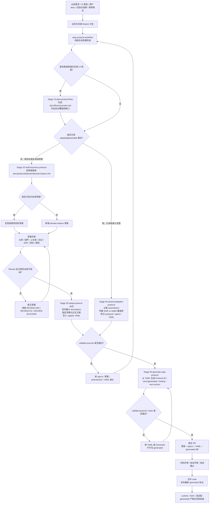

# AXTP 协议维护者 SOP

## 你的角色是什么？

| 你的角色 | 直接看 |
| --- | --- |
| 协议维护者（写草案、采纳、生成、修订） | 继续读本文档 |
| Runtime / SDK 实现者 | [研发接入 Quickstart](quickstart.md) |
| 测试 / Conformance 验收 | [Conformance 测试入门](testing-conformance-quickstart.md) |
| 产品 / 架构（了解协议当前状态） | [Product Domain Status](../product/domain-status.md) |
| 首次接触 AXTP | [docs/README.md](../README.md) |

本文档是**协议维护者的操作主页**。它回答”我现在要干什么、从哪里开始”。其他角色请优先从 `docs/start-here/` 进入，不要把本 SOP 当成通用读者入口。

---

使用这个仓库时，优先用自然语言描述你想完成的协议工作。AXTP 已经围绕 lifecycle skills、generated artifacts 和 CI checks 建立了完整流水线，所以好的请求应该描述”想达成什么协议结果”，而不是从”改哪个文件、跑哪个命令”开始。

这份指南说明一个自然语言需求如何贯穿仓库工作流：

```text
自然语言需求
  -> lifecycle skill
  -> business / flow / RFC / registry source
  -> generator
  -> generated references and protocol IR
  -> conformance and release automation
```

## 完整工作流图

下面这张图来自 kickoff 文档中的研发流程，但已经按当前主库目录和 skill 分工做了更新。它表达的是：协作者先用自然语言提出业务意图，skill 负责判断生命周期阶段，协议事实只有经过评审和采纳后才进入 YAML，Generator 和 CI 只负责从事实源生成与验证，不从草案里猜协议。



读这张图时抓住四条线：

| 线索 | 含义 |
| --- | --- |
| 自然语言输入线 | 需求可以来自 UI、用户 story、旧协议或架构想法；第一步不是写 YAML，而是让 workflow 判断阶段。 |
| 草案评审线 | `docs/flows/` 和 `docs/protocol/` 是评审空间，保留 `[REVIEW-*]` 是正常状态，不能把未确认事实推进 registry。 |
| 事实采纳线 | 只有 `adopt-protocol-draft` 或 `amend-adopted-protocol` 能把确认后的协议事实写入 `registry/` 和 `registry/domains/`。 |
| 自动化验证线 | `generate-axtp-protocol`、Generator tests、conformance 和 CI 都从 YAML 事实源出发；generated 文件错误时回修源头。 |

## 心智模型

AXTP 仓库里有三类材料：

| 类型 | 路径 | 含义 |
| --- | --- | --- |
| 评审输入 | `docs/business/`、`docs/flows/`、`docs/protocol/`、`docs/legacy-migration/` | 用于讨论、规划和评审，但还不是 runtime 合同。 |
| 事实源 | `docs/specs/`、`registry/`、`registry/domains/` | 定义当前协议的人读规则和机器可读事实。 |
| 生成合同 | `protocol/axtp.protocol.yaml`、`docs/generated/`、`tooling/test-vectors/`、Generator snapshots | 供工具、测试、release artifacts 和 runtime 仓库消费的输出。 |

不要手写 generated 产物。生成结果不对时，应修正产生它的输入，然后重新生成。

## 从自然语言请求开始

最有用的 AXTP 请求会说明业务目标、参与角色、预期行为和兼容性约束。

好的例子：

```text
为移动 App 发起的设备固件升级规划 AXTP 协议流程。
需要包含进度事件、stream 传输、重试行为和低带宽降级。
```

```text
为多屏设备的输出画面布局控制起草 AXTP 协议。
如果现有 display、video、output 草案已经覆盖，请优先复用。
```

```text
将已评审的 audio.algorithm 草案采纳到 registry YAML，并重新生成协议输出。
```

```text
修订已采纳的 display brightness 协议，将 maxBrightness 改为 deprecated，而不是直接删除。
需要保持 stable runtime 兼容性。
```

不够好的例子：

```text
加点 YAML。
```

```text
改一下 generated protocol 文件。
```

```text
让 runtime 支持这个。
```

这些请求隐藏了生命周期阶段，容易破坏协议合同边界。

## Skill 路由

如果你不确定当前请求属于哪个阶段，可以直接要求 workflow 路由：

```text
请把这个 AXTP 请求按协议工作流路由：
<描述业务需求、草案、采纳、修订、生成或发布目标>
```

生命周期 skills：

| 阶段 | Skill | 什么时候使用 | 典型输出 |
| ---: | --- | --- | --- |
| 00 | `axtp-protocol-workflow` | 不确定请求是规划、起草、采纳、修订、生成还是发布。 | 明确 workflow 和下一步动作。 |
| 10 | `plan-protocol-flow` | 有场景、UI flow、用户 story 或端到端交互。 | `docs/flows/<scenario>.md`，包含消息序列、覆盖情况和协议缺口。 |
| 20 | `draft-business-protocol` | 有粗略业务需求、legacy 线索或缺失协议行为。 | `docs/protocol/<domain>/<domain.feature>.md` RFC 草案。 |
| 30 | `adopt-protocol-draft` | 草案已评审，需要成为正式协议事实。 | 更新 specs 和 registry YAML。 |
| 40 | `amend-adopted-protocol` | 已采纳 / 已生成协议需要语义修正、废弃、改名、收窄或扩展。 | 更新 adopted proposal、specs、YAML 和 generated artifacts。 |
| 50 | `generate-axtp-protocol` | YAML 事实已准备好，需要刷新或验证输出。 | `protocol/axtp.protocol.yaml`、`docs/generated/*`、snapshots、test vectors。 |
| 60 | `release-axtp-spec` | 已验证 spec 需要发布为 `spec/vX.Y.Z`。 | Spec tag、release artifact、runtime dispatch 路径。 |

Skill 定义见 [docs/dev/skills/README.md](../dev/skills/README.md)。

## 常见工作流

### 1. 将产品场景转成协议工作

可以这样说：

```text
为 <scenario> 规划 AXTP 协议流程。
参与角色：<device, app, cloud, runtime, user>。
必要行为：<steps>。
边界情况：<errors, retry, timeout, low bandwidth, permissions>。
```

flow skill 会检查已采纳协议、generated references、现有草案和 legacy 材料。它应在 `docs/flows/` 下产出 flow 文档，并判断该场景是否已被覆盖、需要新 RFC，还是需要修订已采纳协议。

当请求仍是 story、页面流、用户旅程、时序图或产品行为时，优先使用这个阶段。

### 2. 起草新的业务协议

可以这样说：

```text
为 <domain.feature> 起草 AXTP 协议。
业务目标：<feature 做什么>。
输入输出：<关键字段>。
事件：<状态变化或通知>。
Legacy references：<旧命令、旧文档或旧行为，如有>。
兼容性约束：<stable fields, old runtime behavior, low bandwidth>。
```

draft skill 应先搜索现有 protocol drafts 和 generated facts，再决定复用、修改或新增。结果应进入 `docs/protocol/`，而不是 `registry/`，因为草案仍是评审输入。

在 unresolved `[REVIEW-*]` 项被解决前，不要请求采纳到 YAML。

### 3. 采纳已评审草案

可以这样说：

```text
采纳 docs/protocol/<domain>/<domain.feature>.md 中已评审的草案。
确认 naming、schema、method、event、error、capability、profile 和 legacy mapping。
然后更新 registry YAML 并重新生成。
```

adoption skill 应拒绝 unresolved blocker；必要时更新相关 spec 表；将机器可读事实写入 `registry/` 或 `registry/domains/`；然后交给 generation。

这是草案成为协议事实的时刻。

### 4. 修订已有协议

可以这样说：

```text
修订已采纳的 <domain.feature> 协议。
变更：<需要改什么>。
原因：<bug, compatibility issue, product change, legacy correction>。
兼容性等级：<draft, experimental, mvp, stable>。
偏好的处理方式：<deprecate, add replacement, rename before release, version>。
```

当协议已经进入 registry 或 generated 输出时，应使用 amendment，而不是重新走普通草案。skill 应保护兼容性规则，更新 adopted proposal 和 YAML，并重新生成输出。

### 5. 重新生成与校验

可以这样说：

```text
重新生成 AXTP 协议输出并校验仓库。
```

generation skill 应从 YAML 事实刷新 generated artifacts，并运行相关检查。它不应该从 Markdown 推断新的协议事实。

这个 workflow 背后的本地命令包括：

```bash
pnpm --dir generators build
pnpm --dir generators validate:sources
pnpm --dir generators generate
pnpm --dir generators validate:protocol
scripts/validate-conformance.sh
```

### 6. 发布 Spec

可以这样说：

```text
在验证 Generator 输出和 conformance 后，发布 AXTP spec v0.3.0。
```

release 路径会构建 spec artifact，将版本标记为 `spec/vMAJOR.MINOR.PATCH`，并可触发 runtime upgrade workflows。发布规则见 [docs/release/README.md](../release/README.md)。

## CI 如何接住工作流

CI 是安全网，不是起点。

| 自动化 | 保护什么 |
| --- | --- |
| `validate-conformance.yml` | 在 pull request 和 push 到 `main` 时构建 Generator，并验证 `docs/conformance/**`。 |
| `spec-release-dispatch.yml` | 对 `spec/v*` tag 构建 release artifact，并派发 runtime upgrade events。 |
| `notify-runtimes.yml` | 手动为某个 spec tag 派发 runtime upgrade 通知。 |

提交 PR 前的本地信心检查：

```bash
pnpm --dir generators build
pnpm --dir generators test
pnpm --dir generators validate:sources
pnpm --dir generators generate
pnpm --dir generators validate:protocol
scripts/validate-conformance.sh
git diff --check
```

如果只是文档变更，通常 `git diff --check` 加上针对性的链接 / 路径检查就足够；但如果文档影响 generated facts、conformance、release artifacts 或 workflow scripts，就应该跑完整链路。

## 守则

- 从业务含义开始，不从文件编辑开始。
- 请求是场景时，先 flow，后 draft。
- 行为未评审时，先 draft，后 registry adoption。
- 已采纳 / 已生成协议事实需要变化时，走 amendment。
- Runtime 专属 API 设计放在 runtime 仓库。
- Generated artifacts 必须保持 generated。
- `registry/` 和 `registry/domains/` 是机器可读合同。
- `docs/protocol/` 在采纳完成前是评审空间。

## 完整例子

自然语言请求：

```text
我们需要让移动 App 通过 AXTP 更新设备固件。
App 应该能启动更新、传输 chunks、接收进度、断线重连后恢复，
并报告成功或失败。一些旧设备还有 AXDP 固件命令。
请规划 flow，起草缺失协议，并告诉我后续哪些内容可以采纳。
```

预期仓库路径：

```text
docs/flows/<firmware-update-scenario>.md
  -> docs/protocol/firmware/firmware.update.md
  -> review and resolve [REVIEW-*] items
  -> registry/domains/firmware/domain.yaml
  -> pnpm --dir generators generate
  -> protocol/axtp.protocol.yaml
  -> docs/generated/*
  -> docs/conformance/** updates if behavior needs runtime validation
```

这就是 AXTP 的预期工作方式：先自然语言意图，再协议生命周期，再 generated contracts，最后 runtime 消费。

Runtime 团队第一次接入时，建议额外阅读 [runtime-mvp-conformance.md](runtime-mvp-conformance.md)，先按 Phase 1 MVP checklist 声明 runtime 支持范围，再接入 conformance。测试团队验收 runtime、SDK 或 mock server 时，建议从 [testing-conformance-quickstart.md](testing-conformance-quickstart.md) 开始。
