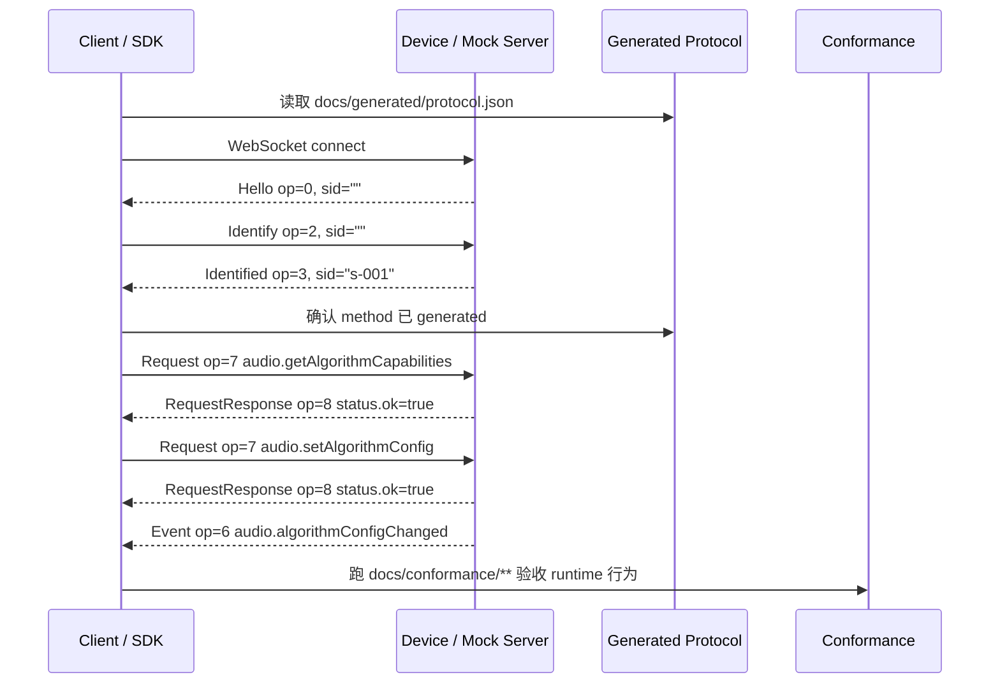

# AXTP 研发接入 Quickstart

这份文档给研发一个最短可跑方案：先用 `AXTP-WS-JSON` 接通 RPC，再按 generated protocol 做业务调用和 conformance 验收。

适用场景：

- App、Web、Node、Python、mock server 或云端先接入控制面。
- 只需要 RPC / Event，不需要 STREAM 连续数据。
- 目标是最快验证协议、SDK、mock server 或设备端业务方法。

不适用场景：

- 固件升级数据块、媒体帧、日志流、文件块等连续数据传输。
- 必须走 USB HID / TCP Standard Frame 的设备链路。
- 低带宽 BLE / UART / HID-64 降级链路。

这些场景仍然可以用 AXTP，但不是最短接入路径，需要进入 Standard Framed、STREAM 或 Low-Bandwidth 文档。

## 0. 最短方案选型

| 方案 | 什么时候用 | 是否需要 Frame Header | 是否支持 STREAM | 最短接入建议 |
|---|---|---:|---:|---|
| `AXTP-WS-JSON` | App / Web / Node / Python / mock server 快速 RPC 接入 | 否 | 否 | 首选 |
| `AXTP-WS-CLOUD-REVERSE` | 设备主动连云，云端作为逻辑客户端 | 否 | 否 | 云接入首选 |
| `AXTP-TCP` | 局域网设备直连，需要 Standard Frame 或 STREAM | 是 | 是 | 第二步 |
| `AXTP-USB-HID` | USB HID 设备、固件或大 report 传输 | 是 | 是 | 固件/runtime 接入 |

最短接入先记住一句话：

```text
WebSocket 打开后，设备作为 Logical Server 先发 Hello；
客户端 Identify；
服务端 Identified 分配 sid；
之后所有 Request / Event / Response 都使用 { sid, op, d } JSON envelope。
```

## 1. 研发需要拿到什么

Runtime 或 SDK 接入 AXTP 时，不应该自己重新定义协议。最小输入包如下：

| 内容 | 源路径 | 用途 |
|---|---|---|
| Spec lock | `AXTP_SPEC.lock.yaml` | 记录当前 runtime 绑定的 AXTP spec tag / commit。 |
| Protocol IR | `protocol/axtp.protocol.yaml` | 机器可读协议模型，适合 generator、runtime、mock server 消费。 |
| Generated JSON | `docs/generated/protocol.json` | 工具、SDK、自动化测试读取的当前协议参考。 |
| Generated Markdown | `docs/generated/protocol.md` | 人读协议参考和联调对照。 |
| Conformance cases | `docs/conformance/**` | runtime 行为一致性验收输入。 |

Runtime 仓库建议保留这样的 spec lock：

```yaml
axtp_spec:
  repository: https://github.com/Mostorm-Labs/axtp
  tag: spec/v0.0.3
  version: 0.0.3
  commit: "<resolved-commit-sha>"
  compatibility: ">=0.0.3 <0.1.0"
  updated_at: "YYYY-MM-DD"
```

开发期可以直接指向主库 checkout；发布期必须使用明确的 spec tag 或 commit，不能依赖浮动 `main`。

## 2. 最短接入流程图



这条链路的关键点：

| 步骤 | 要点 |
|---|---|
| 读取 generated | 客户端不要写死未采纳草案，只调用 `docs/generated/protocol.json` 中存在的方法。 |
| 等待 Hello | `AXTP-WS-JSON` 没有 CONTROL OPEN / ACCEPT，WebSocket 打开后等待 Logical Server 发 Hello。 |
| 发送 Identify | 新 session 的 `sid` 填 `""`，断线恢复用 `resumeSid`。 |
| 保存 sid | Identified 返回的 `sid` 后续所有 Request / Event / Response 都要携带。 |
| requestId 递增 | `d.id` 从 1 开始，同一 session 内未完成请求不得复用。 |
| 按 conformance 验收 | 接通不等于实现正确，最终以 conformance 和 generated contract 为准。 |

## 3. 最小 JSON 报文

### 3.1 Hello：服务端发给客户端

WebSocket 建立后，设备或 mock server 作为 Logical Server 先发 Hello。

```json
{
  "sid": "",
  "op": 0,
  "d": {
    "axtpVersion": "1.0.0",
    "rpcVersion": 1
  }
}
```

### 3.2 Identify：客户端发给服务端

新 session 时 `sid` 为空；不订阅事件时 `eventMasks` 可以省略或为空字符串。

```json
{
  "sid": "",
  "op": 2,
  "d": {
    "rpcVersion": 1,
    "eventMasks": ""
  }
}
```

断线恢复时：

```json
{
  "sid": "",
  "op": 2,
  "d": {
    "rpcVersion": 1,
    "resumeSid": "s-001"
  }
}
```

### 3.3 Identified：服务端确认 session

客户端必须保存这个 `sid`。

```json
{
  "sid": "s-001",
  "op": 3,
  "d": {
    "negotiatedRpcVersion": 1
  }
}
```

### 3.4 Request：查询已采纳能力

当前 generated 协议中已采纳的最小业务域是 `audio.algorithm`。先调用能力查询，确认设备支持哪些算法字段。

```json
{
  "sid": "s-001",
  "op": 7,
  "d": {
    "id": 1,
    "method": "audio.getAlgorithmCapabilities",
    "params": {
      "items": ["noiseSuppression"]
    }
  }
}
```

成功响应：

```json
{
  "sid": "s-001",
  "op": 8,
  "d": {
    "id": 1,
    "status": {
      "ok": true,
      "code": 0
    },
    "result": {
      "capability": "audio.algorithm",
      "updatePolicy": {
        "partialUpdateSupported": true,
        "multiAlgorithmUpdateSupported": true,
        "atomicUpdateSupported": true
      },
      "algorithms": {
        "noiseSuppression": {
          "supported": true,
          "displayName": "Noise Suppression",
          "enabled": {
            "type": "boolean",
            "defaultBool": true
          },
          "level": {
            "type": "uint8",
            "defaultInt32": 2,
            "min": 0,
            "max": 3,
            "step": 1
          }
        }
      }
    }
  }
}
```

### 3.5 Request：查询当前配置

```json
{
  "sid": "s-001",
  "op": 7,
  "d": {
    "id": 2,
    "method": "audio.getAlgorithmConfig",
    "params": {
      "items": ["noiseSuppression"]
    }
  }
}
```

成功响应：

```json
{
  "sid": "s-001",
  "op": 8,
  "d": {
    "id": 2,
    "status": {
      "ok": true,
      "code": 0
    },
    "result": {
      "noiseSuppression": {
        "enabled": true,
        "level": 2
      }
    }
  }
}
```

### 3.6 Request：设置配置

```json
{
  "sid": "s-001",
  "op": 7,
  "d": {
    "id": 3,
    "method": "audio.setAlgorithmConfig",
    "params": {
      "config": {
        "noiseSuppression": {
          "enabled": true,
          "level": 3
        }
      }
    }
  }
}
```

成功响应：

```json
{
  "sid": "s-001",
  "op": 8,
  "d": {
    "id": 3,
    "status": {
      "ok": true,
      "code": 0
    },
    "result": {
      "applyState": "applied",
      "requiresAudioRestart": false,
      "config": {
        "noiseSuppression": {
          "enabled": true,
          "level": 3
        }
      }
    }
  }
}
```

配置变化事件：

```json
{
  "sid": "s-001",
  "op": 6,
  "d": {
    "event": "audio.algorithmConfigChanged",
    "intent": 1,
    "data": {
      "reason": "user_request",
      "applyState": "applied",
      "requiresAudioRestart": false,
      "config": {
        "noiseSuppression": {
          "enabled": true,
          "level": 3
        }
      },
      "changedFields": ["noiseSuppression.level"]
    }
  }
}
```

### 3.7 失败响应格式

失败响应必须带 `status.ok=false`，并且不要携带业务 `result`。

```json
{
  "sid": "s-001",
  "op": 8,
  "d": {
    "id": 3,
    "status": {
      "ok": false,
      "code": 603,
      "msg": "Value out of range",
      "details": {
        "field": "noiseSuppression.level",
        "min": 0,
        "max": 3
      }
    }
  }
}
```

## 4. JSON Envelope 速查

| op | 名称 | 方向 | 最小内容 |
|---:|---|---|---|
| 0 | Hello | Server -> Client | `{ "sid": "", "op": 0, "d": { "axtpVersion": "...", "rpcVersion": 1 } }` |
| 2 | Identify | Client -> Server | `{ "sid": "", "op": 2, "d": { "rpcVersion": 1 } }` |
| 3 | Identified | Server -> Client | `{ "sid": "s-001", "op": 3, "d": { "negotiatedRpcVersion": 1 } }` |
| 6 | Event | Server -> Client | `{ "sid": "s-001", "op": 6, "d": { "event": "...", "intent": 1, "data": {} } }` |
| 7 | Request | Client -> Server | `{ "sid": "s-001", "op": 7, "d": { "id": 1, "method": "...", "params": {} } }` |
| 8 | RequestResponse | Server -> Client | `{ "sid": "s-001", "op": 8, "d": { "id": 1, "status": { "ok": true, "code": 0 } } }` |

## 5. 如果必须走 TCP / HID：Standard Framed 包内容

`AXTP-WS-JSON` 没有 Frame Header。如果研发要接 TCP / USB HID，就需要 Standard Frame：

```text
Standard Frame = Header(12B) + Payload(N) + CRC16(2B)
```

Header 字段：

| Offset | 字段 | 示例 | 说明 |
|---:|---|---|---|
| 0 | Magic[0] | `0x41` | ASCII `A` |
| 1 | Magic[1] | `0x58` | ASCII `X` |
| 2 | Version | `0x01` | Standard Header v1 |
| 3 | PayloadType | `0x02` | RPC |
| 4-5 | PayloadLength | `0x004D` little-endian | Payload 字节数，示例为 77 |
| 6 | SourceId | `0x01` | 发送方逻辑节点 |
| 7 | DestinationId | `0x02` | 接收方逻辑节点 |
| 8-9 | MessageId | `0x0001` little-endian | Frame message id |
| 10 | FrameIndex | `0x00` | 未分片时为 0 |
| 11 | FrameCount | `0x01` | 未分片时为 1 |

示例 payload 是这条 JSON Request：

```json
{"sid":"s-001","op":7,"d":{"id":1,"method":"audio.getAlgorithmCapabilities"}}
```

对应 Standard Framed packet：

```text
Header:
41 58 01 02 4d 00 01 02 01 00 00 01

Payload UTF-8:
7b 22 73 69 64 22 3a 22 73 2d 30 30 31 22 2c 22 6f 70 22 3a 37 2c 22 64 22 3a 7b 22 69 64 22 3a 31 2c 22 6d 65 74 68 6f 64 22 3a 22 61 75 64 69 6f 2e 67 65 74 41 6c 67 6f 72 69 74 68 6d 43 61 70 61 62 69 6c 69 74 69 65 73 22 7d 7d

CRC16-CCITT-FALSE little-endian:
58 48

Full packet:
41 58 01 02 4d 00 01 02 01 00 00 01 7b 22 73 69 64 22 3a 22 73 2d 30 30 31 22 2c 22 6f 70 22 3a 37 2c 22 64 22 3a 7b 22 69 64 22 3a 31 2c 22 6d 65 74 68 6f 64 22 3a 22 61 75 64 69 6f 2e 67 65 74 41 6c 67 6f 72 69 74 68 6d 43 61 70 61 62 69 6c 69 74 69 65 73 22 7d 7d 58 48
```

说明：

- CRC 覆盖 Header + Payload，不覆盖 CRC 自身。
- 多字节整数使用 little-endian。
- Standard Framed 传输在 RPC 前还需要 CONTROL OPEN / ACCEPT；上面的 packet 只展示 RPC frame 内容。
- 如果要传固件、文件、日志、媒体等连续数据，应使用 STREAM，不要把大块数据塞进 RPC JSON。

## 6. 最短验收清单

| 检查项 | 通过标准 |
|---|---|
| 能建立 WebSocket | 客户端能收到 `Hello op=0`。 |
| 能建立 session | 客户端发送 `Identify op=2` 后收到 `Identified op=3` 和 `sid`。 |
| 能读取 generated | 客户端只调用 `docs/generated/protocol.json` 中存在的方法。 |
| 能完成一次 request/response | `audio.getAlgorithmCapabilities` 返回 `status.ok=true`。 |
| 能处理失败 | 非法参数返回 `status.ok=false`，并带稳定错误码。 |
| 能处理事件 | `audio.setAlgorithmConfig` 成功后，客户端能接收或容忍 `audio.algorithmConfigChanged`。 |
| 能通过 conformance | runtime 指向同一份 spec checkout 或 release artifact，并通过 `docs/conformance/**` 对应用例。 |

## 7. 下一步读什么

| 目标 | 文档 |
|---|---|
| 理解完整仓库工作流 | [how-to-use.md](how-to-use.md) |
| 查看当前 generated 协议 | [../generated/protocol.md](../generated/protocol.md) |
| 查看 RPC envelope 规范 | [../specs/1-core/06-RPC-Session.md](../specs/1-core/06-RPC-Session.md) |
| 查看 Frame / Payload 规范 | [../specs/1-core/03-Frame-and-Payload.md](../specs/1-core/03-Frame-and-Payload.md) |
| 查看 conformance | [../conformance/README.md](../conformance/README.md) |
| 查看 runtime spec lock | [../release/AXTP_RUNTIME_SPEC_LOCK.zh-CN.md](../release/AXTP_RUNTIME_SPEC_LOCK.zh-CN.md) |
