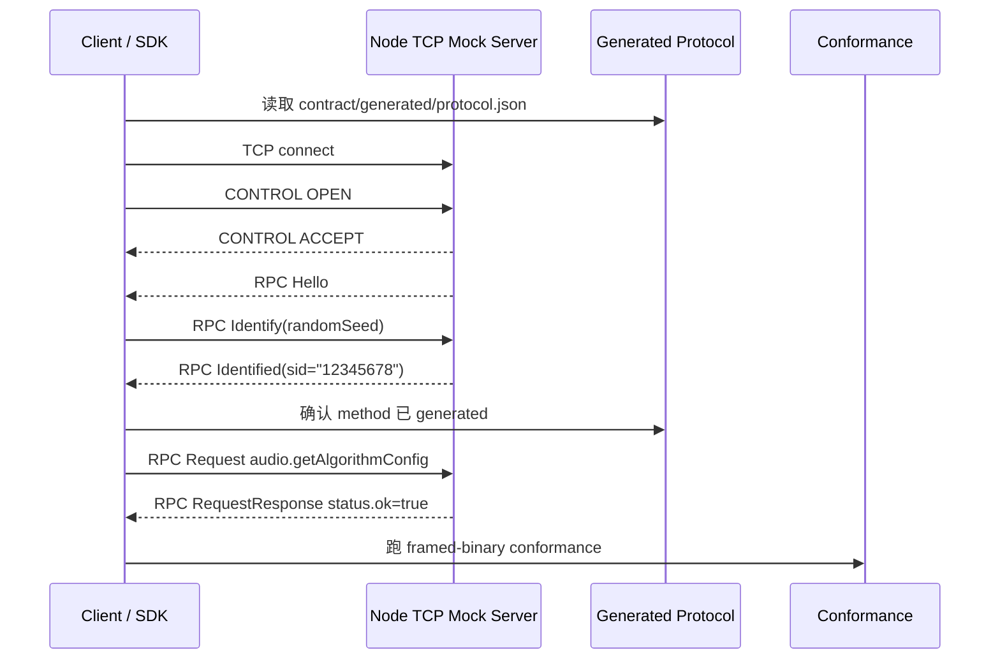

# Runtime / SDK Guide

Runtime / SDK 的目标不是重新定义 AXTP，而是消费主仓库已经发布的协议合同，声明自己支持的 profile，并通过 conformance。

核心规则：

```text
runtime 只能从 release artifact、Protocol IR、generated reference、specs 和 conformance 实现。
runtime 不得从 draft-only workspace/protocol/** 实现正式能力。
```

## 先选接入路径

| 路径 | 什么时候用 | 最短顺序 |
|---|---|---|
| AXTP-TCP Standard Framed | 跨 runtime / mock-server 一致性验证，或设备端需要二进制 Frame / STREAM。 | transport connect -> CONTROL OPEN / ACCEPT -> Hello / Identify / Identified -> generated business RPC |
| AXTP-WS-JSON | App、Web、Node、Python、云端控制面或 WS-only mock server。 | WebSocket open -> Hello / Identify / Identified -> Request / Response / Event |
| AXTP-USB-HID | USB HID 设备、固件或大 report 传输。 | HID connect -> CONTROL OPEN / ACCEPT -> RPC / STREAM |

当前跨 runtime 推荐联调基准是 **AXTP-TCP Standard Framed + Node mock-server**。WebSocket JSON 是轻量 RPC-only 控制面路径，不承载 CONTROL、Frame Header、CRC16 或 STREAM data packet。

没有真实设备时，先连接 [axtp-mock-server](https://github.com/Mostorm-Labs/axtp-mock-server)。Standard Framed runtime 优先用 Node TCP mock-server 做互操作基准；RPC-only runtime 才声明并验证 `websocket-jsonrpc` profile。

## 实现输入

| 输入 | 路径 | 用途 |
|---|---|---|
| Spec lock | runtime 仓库 `AXTP_SPEC.lock.yaml` | 记录绑定的 spec tag、commit 或 release artifact。 |
| Protocol IR | [../../contract/protocol/axtp.protocol.yaml](../../contract/protocol/axtp.protocol.yaml) | 机器可读协议模型。 |
| Generated JSON | [../../contract/generated/protocol.json](../../contract/generated/protocol.json) | SDK、mock server、自动化测试读取。 |
| Generated Markdown | [../../contract/generated/protocol.md](../../contract/generated/protocol.md) | 人工联调和字段核对。 |
| Specs | [../specs/README.md](../../specs/README.md) | wire、session、registry、codec、tooling 规则。 |
| Conformance | [../../conformance/README.md](../../conformance/README.md) | runtime 行为验收输入。 |

发布期不能依赖浮动 `main`。开发期可以指向本地 checkout；release 必须锁定 spec tag、明确 commit 或 release artifact。

```yaml
axtp_spec:
  repository: https://github.com/Mostorm-Labs/axtp
  tag: spec/v0.0.3
  version: 0.0.3
  commit: "<resolved-commit-sha>"
  compatibility: ">=0.0.3 <0.1.0"
  updated_at: "YYYY-MM-DD"
```

## 最短实现步骤

1. 选择 transport profile：`framed-binary` 或 `websocket-jsonrpc`。
2. 加载 Protocol IR 或 generated JSON，不写死未采纳草案。
3. 实现 Hello / Identify / Identified 和 app-ready gate。
4. 实现 Request / RequestResponse / Event、标准错误形状和 `requestId` 匹配。
5. Standard Framed runtime 再实现 Frame Header、CRC16、CONTROL 和 STREAM dispatch。
6. 声明 conformance level，并运行对应 case。
7. 在 runtime 仓库记录 spec lock 和 conformance 声明。

## TCP Standard Framed 基准



这条链路验证 TCP byte stream 上的 Standard Frame 拆包、CONTROL gate、RPC session gate、`sid` 复用和 generated business RPC。

## WebSocket JSON 快速路径

```text
WebSocket open
  -> Server Hello op=0, sid=""
  -> Client Identify op=2, sid="", randomSeed:uint32
  -> Server Identified op=3, sid="<8 hex chars>"
  -> Client Request op=7, d.id=<request id>, method=<generated method>
  -> Server RequestResponse op=8, d.id matches request
```

关键约束：

| 项 | 要求 |
|---|---|
| Hello | Logical Server 先发，客户端收到 Hello 后才能 Identify。 |
| `sid` | 新 session 使用 `sid=""`；APP_READY 后使用 Identified 返回的固定 8 位 hex string。 |
| `requestId` | `d.id` 从 1 开始，同一 session 内未完成请求不得复用。 |
| method/event | 必须来自 generated protocol。 |
| error | 失败返回 `status.ok=false` 和稳定错误码，不携带成功 `result`。 |

## Standard Framed MVP

| 检查项 | 通过标准 |
|---|---|
| Header parser | 校验 `AX` magic、version、PayloadType、payloadLength、fragment 字段。 |
| CRC16 | CRC 覆盖 Header + Payload，不覆盖 CRC 自身；多字节整数使用 Big-Endian。 |
| Payload dispatch | `CONTROL` 进 ControlParser，`RPC` 进 RpcParser，`STREAM` 进 StreamParser。 |
| CONTROL OPEN / ACCEPT | OPEN 只在 `LINK_CONNECTED` 发送；ACCEPT 的 `controlId` 匹配后进入 `FRAMING_READY`。 |
| HEARTBEAT / CLOSE | ACK 使用相同 `controlId`；连续心跳超时或 CLOSE 完成后清理上下文。 |
| RPC session | CONTROL 成功后再执行 Hello / Identify / Identified。 |
| STREAM | 通过业务 RPC 建立 Stream Context，解析 16B STREAM Header 并按 `streamId` 投递数据。 |

Frame、CONTROL、RPC、STREAM 的完整规则分别见 [Frame and Payload](../../specs/1-core/03-Frame-and-Payload.md)、[Control Session](../../specs/1-core/05-Control-Session.md)、[RPC Session](../../specs/1-core/06-RPC-Session.md) 和 [Stream Data Plane](../../specs/1-core/07-Stream-Data-Plane.md)。长流程参考 [core-protocol-flow.md](core-protocol-flow.md)。

## 验收定义

一个 Phase 1 runtime 至少应满足：

| 项 | 标准 |
|---|---|
| Spec lock | 有明确 spec tag、commit 或 release artifact。 |
| Protocol loading | 能读取 Protocol IR 或 generated JSON。 |
| Session | 能完成 Hello / Identify / Identified。 |
| RPC | 能完成至少一次 generated method 的 Request / Response。 |
| Error | 能返回标准错误形状。 |
| Event | 支持事件或明确声明不支持 event level。 |
| Conformance | 通过已声明 level 的 required cases。 |

Standard Framed runtime 还应完成 OPEN / ACCEPT、HEARTBEAT、CLOSE、Frame/CRC、STREAM open/data/close，并至少声明 `core + framed-binary`。
