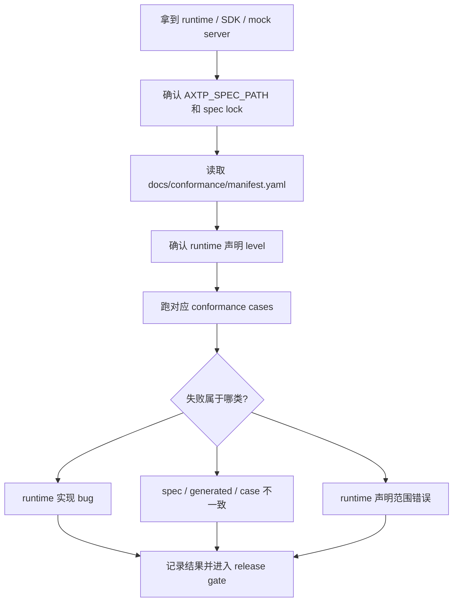

# 测试与 Conformance 使用指南

这份文档给测试团队使用：拿到 AXTP spec、runtime 或 mock server 后，如何判断“能不能测、测什么、怎么判定失败、失败归谁”。

测试不要从草案直接写用例。测试输入优先来自：

```text
spec lock
  -> protocol/axtp.protocol.yaml
  -> docs/generated/protocol.json
  -> docs/conformance/**
  -> runtime 声明的 profile / level
```

## 1. 测试先拿到什么

| 输入 | 从哪里拿 | 测试用途 |
|---|---|---|
| Spec lock | runtime 仓库 `AXTP_SPEC.lock.yaml` 或发布包 | 确认测的是哪个 spec 版本，不测浮动 main。 |
| Generated JSON | `docs/generated/protocol.json` | 构造 method、event、schema、error 的合法输入。 |
| Generated Markdown | `docs/generated/protocol.md` | 人工核对字段、错误码、能力语义。 |
| Conformance manifest | `docs/conformance/manifest.yaml` | 确认 runtime 声明的 level 需要跑哪些 case。 |
| Conformance cases | `docs/conformance/cases/**` | 自动化验收输入。 |
| Runtime profile 声明 | runtime README、spec lock 或测试配置 | 判断 WebSocket JSON、Standard Framed、STREAM 是否应该被测。 |

如果 runtime 没有声明支持某个 profile，不要把该 profile 的失败当成 runtime bug；先要求 runtime 团队补清楚支持范围。

## 2. 最短测试路径



测试时先跑最小闭环，再扩展业务能力：

| 顺序 | 测试集 | 目标 |
|---:|---|---|
| 1 | Smoke | 能连接、能建 session、能发一个 generated method。 |
| 2 | Core conformance | requestId、标准错误形状、method not found。 |
| 3 | Profile conformance | WebSocket JSON 或 Standard Framed 的 profile 行为。 |
| 4 | Capability / Event | 能力查询、订阅、事件发送。 |
| 5 | Stream | 只有 runtime 声明支持 STREAM 时再测。 |

## 3. WebSocket JSON 测试要点

适用于 App、Web、Node、Python、WS-only mock server、云端控制面。

| 用例 | 通过标准 |
|---|---|
| Hello | WebSocket open 后，Logical Server 发送 `op=0`、`sid=""`。 |
| Identify | Client 发送 `op=2`、`sid=""`、`randomSeed:uint32`。 |
| Identified | Server 返回 `op=3` 和固定 8 位 hex `sid`，例如 `"12345678"`。 |
| Request | Client 使用 generated method，`d.id` 在未完成前不复用。 |
| Response | Server 返回相同 `d.id`，成功 `status.ok=true`。 |
| Error | 非法 method 或非法参数返回 `status.ok=false` 和稳定错误码。 |
| Event | 事件名来自 generated protocol；未订阅事件时行为符合 runtime 声明。 |

最小手工 smoke：

```json
{
  "sid": "",
  "op": 2,
  "d": {
    "randomSeed": 305419896,
    "eventMasks": ""
  }
}
```

```json
{
  "sid": "12345678",
  "op": 7,
  "d": {
    "id": 1,
    "method": "audio.getAlgorithmCapabilities",
    "params": {
      "items": ["noiseSuppression"]
    }
  }
}
```

## 4. Standard Framed 测试要点

适用于 TCP、USB HID、设备端 C/C++ runtime、Node TCP mock-server、未来需要 STREAM 的链路。

| 用例 | 通过标准 |
|---|---|
| Header parser | `AX` magic、version、payloadLength、payloadType、fragment 字段正确校验。 |
| CRC16 | CRC 覆盖 Header + Payload，不覆盖 CRC 自身。 |
| OPEN / ACCEPT | OPEN 只在 `LINK_CONNECTED` 发送；ACCEPT 的 `controlId` 匹配。 |
| HEARTBEAT / HEARTBEAT_ACK | ACK 使用相同 `controlId`，连续超时后清理链路。 |
| CLOSE / CLOSE_ACK | 任意一端可发 CLOSE，对端返回相同 `controlId` 后关闭 transport。 |
| RPC after CONTROL | ACCEPT 成功后才允许 RPC Hello / Identify / Identified。 |
| ACK/NACK | Phase 1 不实现严格重传，不能把未实现 ACK/NACK 判为失败。 |

当前 Phase 1 framed-binary conformance 至少覆盖：

```text
handshake.open_accept
handshake.heartbeat
handshake.close
rpc.request_id_match
```

## 5. 怎么跑 Conformance

主库里先验证 conformance 文件本身：

```bash
pnpm --dir generators install --frozen-lockfile
pnpm --dir generators build
scripts/validate-conformance.sh
```

runtime 仓库测试时，先指定 spec 路径：

```bash
export AXTP_SPEC_PATH=/path/to/axtp-spec-or-release-artifact
```

runtime 测试脚本应能读取：

```text
$AXTP_SPEC_PATH/docs/conformance
$AXTP_SPEC_PATH/conformance
```

测试团队执行 runtime 仓库自己的 conformance 脚本，例如：

```bash
bash scripts/run-conformance.sh
```

如果 runtime 仓库还没有脚本，测试应先要求 runtime 团队提供 adapter，而不是在主库里临时复制 case。主库只维护 conformance 输入和 schema，runtime 仓库负责把这些 case 跑到自己的实现上。

## 6. 失败怎么归类

| 失败类型 | 判断标准 | 处理 |
|---|---|---|
| Runtime bug | case 与 manifest、generated、spec 一致，但 runtime 行为不符。 | 提 runtime 仓库缺陷。 |
| Spec / case mismatch | case 要求与当前 Phase 1 裁决或 specs 冲突。 | 回主库修 `docs/conformance/**` 或 specs。 |
| Generated mismatch | generated protocol 与 registry / specs 不一致。 | 回主库修源头并重新 generate。 |
| Profile 声明错误 | runtime 没实现某能力却声明支持对应 level。 | 要 runtime 修 spec lock / README / 测试配置。 |
| 测试环境问题 | spec path、版本、mock 数据、transport 地址不对。 | 修测试配置，不改协议。 |

提缺陷时至少带：

```text
spec tag / commit
runtime repo / commit
runtime 声明 profile / level
失败 case id
实际报文
期望报文
错误日志
```

## 7. Release Gate 建议

| 阶段 | 测试门槛 |
|---|---|
| runtime MVP | 通过声明的 `core` + transport profile。 |
| SDK 首次交付 | 通过 smoke、核心 RPC、错误响应、generated method 调用。 |
| 客户交付 | 固定 spec tag，runtime spec lock 不指向浮动 main。 |
| 发布前 | conformance 全绿，`git diff --check`，确认 generated 未手写。 |

测试结论不要写“AXTP 通过 / 不通过”这么宽。推荐写：

```text
axtp-ts-runtime @ <commit>
spec: spec/vX.Y.Z
declared levels: core, websocket-jsonrpc, capability
result: pass / fail
failed cases: <case ids>
blocking release: yes / no
```

这样产品、研发、runtime 和协议维护者能马上知道问题落在哪一层。
