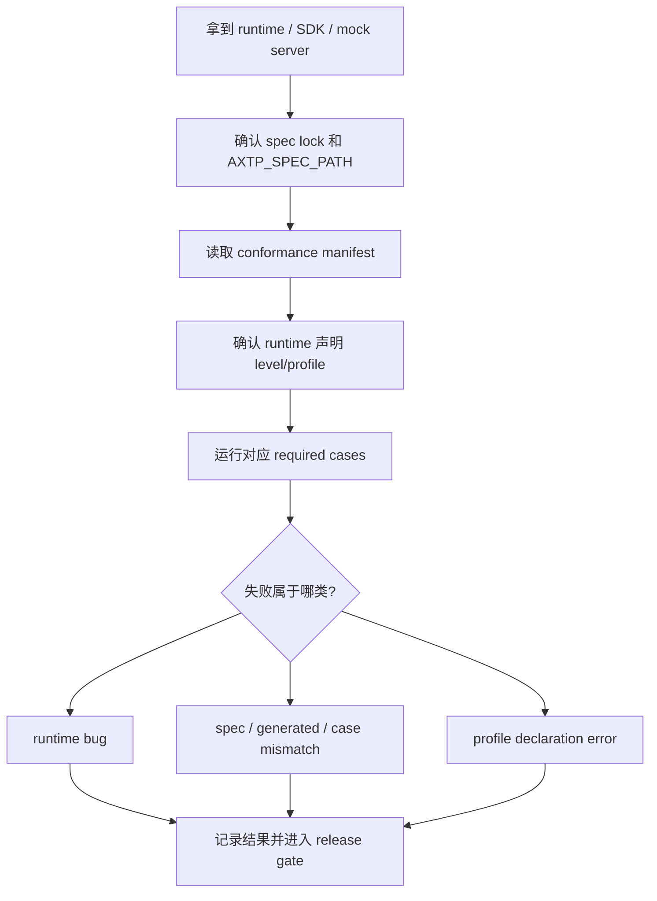

# Testing / Conformance Guide

Conformance 是 runtime、SDK、mock server 和工具仓库的行为验收入口。测试的目标不是从草案猜行为，而是按 runtime 声明的 profile / level，加载当前 spec 的 generated、Protocol IR、specs 和 conformance cases。

mock server 也按声明 profile 验收。当前 Node mock-server 应覆盖 TCP Standard Framed 的 `core + framed-binary`；WS-only mock 才声明 `websocket-jsonrpc`。

## 测试输入

| 输入 | 用途 |
|---|---|
| Spec lock | 确认测的是哪个 spec tag、commit 或 release artifact。 |
| [../../contract/generated/protocol.json](../../contract/generated/protocol.json) | 构造 method、event、schema、error 的合法输入。 |
| [../../contract/generated/protocol.md](../../contract/generated/protocol.md) | 人工核对字段、错误码、能力语义。 |
| [../../conformance/manifest.yaml](../../conformance/manifest.yaml) | 确认声明 level 需要跑哪些 case。 |
| [../../conformance/cases](../../conformance/cases) | 自动化验收输入。 |
| Runtime profile 声明 | 判断 WebSocket JSON、Standard Framed、STREAM 是否应该被测。 |

如果 runtime 没声明某个 profile，不要把该 profile 的失败直接判成 runtime bug；先要求补支持范围声明或实现。

## 最短测试路径



建议顺序：

| 顺序 | 测试集 | 目标 |
|---:|---|---|
| 1 | Smoke | 能连接、能建 session、能发一个 generated method。 |
| 2 | Core conformance | `sid`、`requestId`、标准错误形状、method not found。 |
| 3 | Profile conformance | WebSocket JSON 或 Standard Framed 的 profile 行为。 |
| 4 | Capability / Event | 能力查询、订阅、事件发送。 |
| 5 | STREAM | 只有 runtime 声明 `stream` 时再测。 |

## WebSocket JSON 要点

| 用例 | 通过标准 |
|---|---|
| Hello | WebSocket open 后，Logical Server 发送 `op=0`、`sid=""`。 |
| Identify | Client 发送 `op=2`、`sid=""`、`randomSeed:uint32`。 |
| Identified | Server 返回 `op=3` 和固定 8 位 hex `sid`。 |
| Request | Client 使用 generated method，`d.id` 在未完成前不复用。 |
| Response | Server 返回相同 `d.id`，成功 `status.ok=true`。 |
| Error | 非法 method 或非法参数返回 `status.ok=false` 和稳定错误码。 |
| Event | 事件名来自 generated protocol；未订阅事件时行为符合 runtime 声明。 |

WebSocket JSON 不承载 CONTROL、Frame Header、CRC16 或 STREAM data packet。

## Standard Framed 要点

| 用例 | 通过标准 |
|---|---|
| Header parser | `AX` magic、version、payloadLength、payloadType、fragment 字段正确校验。 |
| CRC16 | CRC 覆盖 Header + Payload，不覆盖 CRC 自身。 |
| OPEN / ACCEPT | OPEN 只在 `LINK_CONNECTED` 发送；ACCEPT 的 `controlId` 匹配。 |
| HEARTBEAT / HEARTBEAT_ACK | ACK 使用相同 `controlId`，连续超时后清理链路。 |
| CLOSE / CLOSE_ACK | 任意一端可发 CLOSE，对端返回相同 `controlId` 后关闭 transport。 |
| RPC after CONTROL | ACCEPT 成功后才允许 RPC Hello / Identify / Identified。 |
| STREAM | L2 才要求 STREAM 16B header 和 open/data/close P0 case。 |

Phase 1 不把 ACK/NACK 严格重传、RESUME、低带宽 profile、链路加密作为 required conformance。

## 怎么跑

主库验证 conformance 源文件：

```bash
pnpm --dir tooling/generators install --frozen-lockfile
pnpm --dir tooling/generators build
tooling/scripts/validate-conformance.sh
```

runtime 仓库测试时先指定 spec 路径：

```bash
export AXTP_SPEC_PATH=/path/to/axtp-spec-or-release-artifact
```

runtime runner 应兼容两个路径：

```text
$AXTP_SPEC_PATH/conformance
```

如果 runtime 仓库还没有 runner，测试应先要求 runtime 团队提供 adapter，不在主库临时复制 case。

## 失败归类

| 失败类型 | 判断标准 | 处理 |
|---|---|---|
| Runtime bug | case 与 manifest、generated、spec 一致，但 runtime 行为不符。 | 提 runtime 仓库缺陷。 |
| Spec / case mismatch | case 要求与 specs 或 generated 冲突。 | 回主库修 `conformance/**` 或 specs。 |
| Generated mismatch | generated protocol 与 registry / specs 不一致。 | 回主库修源头并重新 generate。 |
| Profile 声明错误 | runtime 没实现某能力却声明支持对应 level。 | 要 runtime 修 spec lock、README 或测试配置。 |
| 测试环境问题 | spec path、版本、mock 数据、transport 地址不对。 | 修测试配置。 |

报告至少包含：

```text
runtime: <repo>@<commit>
spec: <spec tag or commit>
profiles: <declared profiles>
levels: <declared levels>
result: pass | fail
failed cases: <case ids>
unsupported: <declared unsupported>
blocking release: yes | no
```
