# device-sdk 时序图｜2026-06-08

## 保存来源

- 请求：更新到最新代码，然后输出 device-sdk 的时序图，并完整保存到 Notion。
- 仓库：`/Users/was/Desktop/code/aw-saas-platform`
- 包：`@saas-platform/device-sdk`
- 当前时间：2026-06-08 19:43:07 CST

## 最新代码状态

- `git pull --ff-only --prune`：Already up to date
- 当前 HEAD：`d9f24df chore(release): bump launcher version to 1.0.1`
- device-sdk 版本：`1.4.0`

## 验证结果

- `pnpm -F @saas-platform/device-sdk type-check`：通过。
- `pnpm -F @saas-platform/device-sdk test -- --runInBand`：未完全通过。结果为 `52/53` tests passed，`15/16` suites passed。
- 失败项：`src/sdk.spec.ts` 中 `createServerSdk register wires command/event handlers` 断言失败。
- 失败原因：实际 `response.d.result` 比预期多了 `expiresInSeconds: 1800`。

## 核心流程说明

`@saas-platform/device-sdk` 分为设备端与服务端两条高层 API：

- 设备端：`createDeviceSdk(options)` 创建 `DeviceClient` 与 `DeviceRouter`。
- 服务端：`createServerSdk(options)` 创建 `ServerClient` 与 `ServerRouter`。
- 握手协议：设备端连接 WebSocket 后发送 `op=0 Hello`，服务端校验后返回 `op=1 HelloAck`，并分配 `sid`。
- 请求响应：双方通过 `op=7 Request` 与 `op=8 Response` 执行 RPC 调用。
- 事件通知：双方通过 `op=6 Event` 推送事件。
- 心跳：双方自动发起 `KeepAlive` 请求，响应成功后维持连接。
- 重连：设备端非手动断开时由 `RetryModule` 自动重连，恢复后触发 `ConnectionRestore`。

## device-sdk 完整时序图

```mermaid
sequenceDiagram
    autonumber
    participant AppD as Device App
    participant DeviceSdk as createDeviceSdk
    participant DeviceClient as DeviceClient
    participant DeviceRouter as DeviceRouter
    participant WS as WebSocket
    participant ServerSdk as createServerSdk
    participant ServerClient as ServerClient
    participant ServerRouter as ServerRouter
    participant AppS as Server App

    AppS->>ServerSdk: createServerSdk()
    ServerSdk->>ServerClient: new ServerClient()
    ServerSdk->>ServerRouter: createServerRouter(server)
    AppS->>ServerSdk: handle("GetBindCode", handler)
    ServerSdk->>ServerRouter: register command handler
    AppS->>ServerSdk: on("DeviceConnected", handler)
    ServerSdk->>ServerRouter: subscribe event
    AppS->>ServerSdk: listen(8080)
    ServerSdk->>ServerClient: listen(port)
    ServerClient->>WS: create WebSocketServer

    AppD->>DeviceSdk: createDeviceSdk({ url, deviceId })
    DeviceSdk->>DeviceClient: new DeviceClient(options)
    DeviceSdk->>DeviceRouter: createDeviceRouter(client)
    AppD->>DeviceSdk: handle("Restart", handler)
    DeviceSdk->>DeviceRouter: register command handler
    AppD->>DeviceSdk: on("ConnectionOpen", handler)
    DeviceSdk->>DeviceRouter: subscribe event

    AppD->>DeviceSdk: connect()
    DeviceSdk->>DeviceClient: connect()
    DeviceClient->>WS: connect()
    WS-->>ServerClient: connection(socket)

    DeviceClient->>ServerClient: op=0 Hello<br/>axdpVersion, rpcVersion, deviceId
    ServerClient->>ServerClient: validate Hello
    ServerClient->>ServerClient: generate sid
    ServerClient-->>DeviceClient: op=1 HelloAck<br/>sid, negotiatedRpcVersion
    ServerClient->>ServerClient: register session by sid
    ServerClient->>ServerRouter: emit device:connected
    ServerRouter->>AppS: DeviceConnected({ sid, deviceId })

    DeviceClient->>DeviceClient: markConnected()
    DeviceClient->>DeviceRouter: connection:open
    DeviceRouter->>AppD: ConnectionOpen

    par Device calls Server command
        AppD->>DeviceSdk: call("GetBindCode")
        DeviceSdk->>DeviceClient: call(method, params)
        DeviceClient->>DeviceClient: RequestManager.create(id)
        DeviceClient->>ServerClient: op=7 Request<br/>id, method, params
        ServerClient->>ServerRouter: protocol:message
        ServerRouter->>AppS: handler({ sid, deviceId }, params)
        AppS-->>ServerRouter: result
        ServerRouter->>ServerClient: responseSuccess()
        ServerClient-->>DeviceClient: op=8 Response<br/>id, status, result
        DeviceClient->>DeviceClient: RequestManager.resolve(id)
        DeviceClient-->>AppD: Promise resolves
    and Server calls Device command
        AppS->>ServerSdk: call(sid, "Restart", params)
        ServerSdk->>ServerClient: call(sid, method, params)
        ServerClient->>DeviceClient: op=7 Request<br/>id, method, params
        DeviceClient->>DeviceRouter: protocol:message
        DeviceRouter->>AppD: handler({ sid, deviceId }, params)
        AppD-->>DeviceRouter: result
        DeviceRouter->>DeviceClient: responseSuccess()
        DeviceClient-->>ServerClient: op=8 Response<br/>id, status, result
        ServerClient-->>AppS: Promise resolves
    and Device event notify
        AppD->>DeviceSdk: notify("OnTelemetryReport", data)
        DeviceSdk->>DeviceRouter: emit(event, data)
        DeviceRouter->>DeviceClient: notify(event, data)
        DeviceClient->>ServerClient: op=6 Event<br/>event, data
        ServerClient->>ServerRouter: event
        ServerRouter->>AppS: OnTelemetryReport({ sid, data })
    and Server event notify
        AppS->>ServerSdk: notify(sid, "OnBindState", data)
        ServerSdk->>ServerRouter: emit(sid, event, data)
        ServerRouter->>ServerClient: session.notify(event, data)
        ServerClient->>DeviceClient: op=6 Event<br/>event, data
        DeviceClient->>DeviceRouter: event
        DeviceRouter->>AppD: OnBindState({ sid, data })
    and KeepAlive
        DeviceClient->>ServerClient: op=7 Request KeepAlive
        ServerClient-->>DeviceClient: op=8 Response { ok: true }
        ServerClient->>DeviceClient: op=7 Request KeepAlive
        DeviceClient-->>ServerClient: op=8 Response { ok: true }
        ServerRouter->>AppS: KeepAlive({ sid, deviceId, at })
        DeviceRouter->>AppD: KeepAlive
    end

    alt socket closed / error / heartbeat timeout
        DeviceClient->>DeviceRouter: connection:lost
        DeviceRouter->>AppD: ConnectionLost
        DeviceClient->>DeviceClient: RetryModule.start(reconnect)
        DeviceClient->>WS: reconnect()
        DeviceClient->>ServerClient: Hello again
        ServerClient-->>DeviceClient: HelloAck new sid
        DeviceClient->>DeviceRouter: connection:restore
        DeviceRouter->>AppD: ConnectionRestore
    else manual disconnect
        AppD->>DeviceSdk: disconnect()
        DeviceSdk->>DeviceClient: disconnect()
        DeviceClient->>WS: close()
        DeviceClient->>DeviceRouter: connection:closed
        DeviceRouter->>AppD: ConnectionClosed
        ServerClient->>ServerRouter: device:disconnected
        ServerRouter->>AppS: DeviceDisconnected({ sid, reason, deviceId })
    end
```

## 关键源码依据

- `packages/device-sdk/src/sdk.ts`：高层 `createDeviceSdk` / `createServerSdk`，封装 register、handle、on、call、notify、connect/listen。
- `packages/device-sdk/src/clients/device-client.ts`：设备端 WebSocket 连接、Hello 握手、sid 保存、心跳、断线与重连。
- `packages/device-sdk/src/clients/server-client.ts`：服务端 WebSocketServer、Hello 校验、HelloAck、Session 注册、设备连接/断开事件。
- `packages/device-sdk/src/clients/base-client.ts`：通用消息编码发送、`op=6` 事件、`op=7` 请求、`op=8` 响应、KeepAlive 自动响应、RequestManager resolve/reject。
- `packages/device-sdk/src/router/device-router.ts`：设备端命令 handler、事件订阅、设备向服务端 emit。
- `packages/device-sdk/src/router/server-router.ts`：服务端命令 handler、事件订阅、服务端向设备 emit，并过滤系统事件。
- `packages/device-sdk/src/router/device-router.events.ts`：设备端内部事件到公开事件的映射，例如 `connection:open` -> `ConnectionOpen`。
- `packages/device-sdk/src/router/server-router.events.ts`：服务端内部事件到公开事件的映射，例如 `device:connected` -> `DeviceConnected`。
- `packages/device-sdk/src/protocol/types.ts`：`HelloData`、`HelloAckData`、`RequestData`、`ResponseData`、`EventData` 结构定义。
- `packages/device-sdk/src/core/request-manager.ts`：RPC 请求等待、超时、resolve/reject。

## Notion 记录说明

这页记录的是 2026-06-08 基于最新 `main` 代码的 device-sdk 时序图与验证结果。Notion API 写入时 Mermaid 以 code block 保存；如果 Notion 页面不直接渲染 Mermaid，可复制代码块到 Mermaid Live Editor 或支持 Mermaid 的 Markdown 工具中查看。