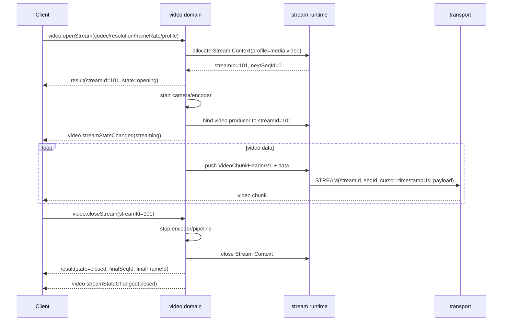
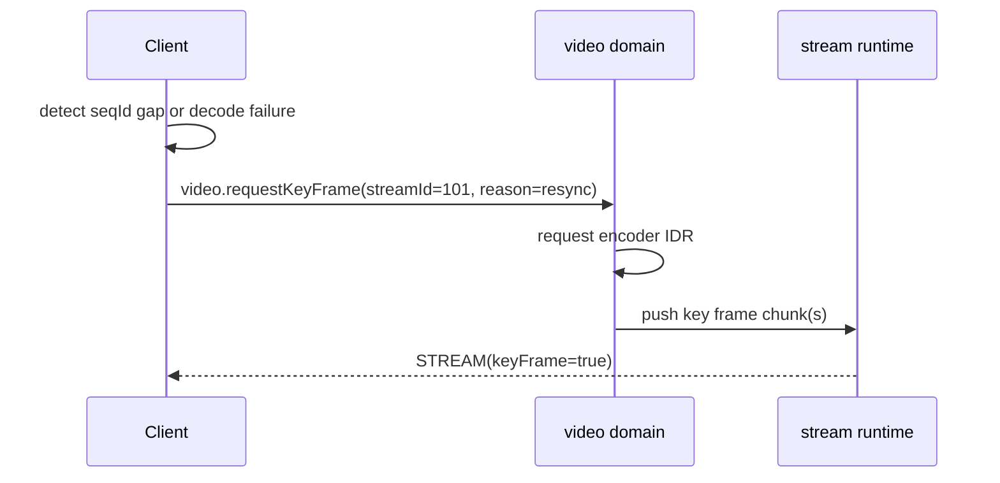
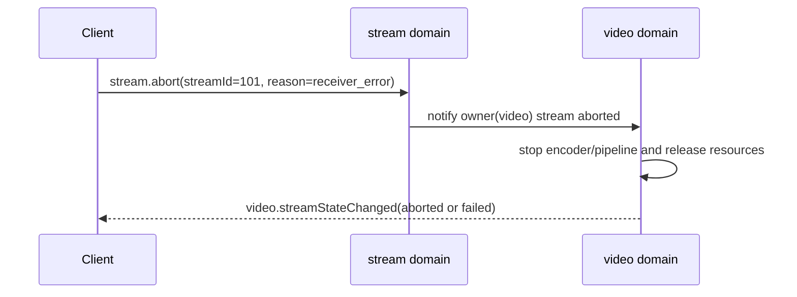

# AXTP Video Stream 协议草案

状态：Protocol Review Draft
归属域：`video.stream`
适用范围：通过 AXTP `PayloadType = STREAM` 承载的设备视频预览、编码视频输出、MJPEG/Raw 调试流和 legacy 视频流迁移。
依赖文档：`docs/specs/06-AXTP-Stream-Spec.md`、`docs/protocol/stream/stream.flowcontrol.md`、`docs/protocol/video/video.ndi.md`、`docs/protocol/video/video.framing.md`

本文是 `docs/protocol` 评审输入，不是最终生成事实源。采纳后需要同步到 `registry/domains/video/domain.yaml`、`registry/core/stream_profile.yaml`、method/event/capability/schema/error registry，并运行 generator。

## 0. Review 处理结论

| 标记 | 对象 | 处理结论 | 后续动作 |
|---|---|---|---|
| `[REVIEW-OK]` | `video.stream` / `video.openStream` / `video.closeStream` | 保留 video 域作为视频业务流 owner。`stream` 域只提供公共数据面和可选流控。 | 可进入 video domain YAML 草案。 |
| `[REVIEW-OK]` | `video.getStreamState` / `video.streamStateChanged` | 保留状态查询和状态事件在 video 域，避免把视频业务状态混入通用 stream control。 | 确认 schema 后写入 registry。 |
| `[REVIEW-FIX]` | 文档语气 | 已移除 intake/任务说明式语气，改为规范正文。 | 无。 |
| `[REVIEW-FIX]` | `stream.open` 边界 | 本文正式方法表不包含常规 `stream.open`。现有 registry 中的 `stream.open` 只能作为历史 HID media draft 处理，后续应 deprecated、改名为 vendor/debug 接口，或迁移到业务域方法。 | registry 同步时处理。 |
| `[REVIEW-ASK]` | AXDP `CommonGetStreamMediaStatus` | 暂映射到 `video.getStreamState`；若旧字段只描述底层传输窗口/缓冲，则改映射到 `stream.getState`。 | 需要确认 legacy 返回字段。 |

## 1. 分层边界

AXTP 视频流分为三层：

```text
+--------------------------------------------------+
| video 域                                         |
| 打开/关闭视频流，配置 source、codec、resolution、 |
| frameRate、bitrate、gop、pixelFormat、状态和事件 |
+---------------------------+----------------------+
                            |
                            | allocates streamId and binds Stream Context
                            v
+--------------------------------------------------+
| stream 域 / stream runtime                       |
| 统一 STREAM 16B header、streamId、seqId、cursor、 |
| profile、统计、ACK/window/pause/resume/abort      |
+---------------------------+----------------------+
                            |
                            | PayloadType = STREAM bytes
                            v
+--------------------------------------------------+
| transport                                         |
| USB HID、TCP、WebSocket framed bridge、BLE、UART  |
+--------------------------------------------------+
```

职责规则：

| 事项 | 归属 | 规则 |
|---|---|---|
| 创建视频业务流 | `video.openStream` | 唯一常规入口，成功后返回 `streamId`。 |
| 正常关闭视频业务流 | `video.closeStream` | 停止 encoder/pipeline，释放视频资源，关闭对应 Stream Context。 |
| STREAM 数据面 | `PayloadType = STREAM` | 固定 16B header：`streamId:uint32`、`seqId:uint32`、`cursor:uint64`。 |
| 视频 chunk 元数据 | video payload envelope | `frameId`、`frameOffset`、`keyFrame`、`frameStart`、`frameEnd` 放在 video payload 内，不放进公共 STREAM header。 |
| 公共流控 | `stream` 域 | ACK、window、pause、resume、stats、abort 面向 runtime/SDK 或高级工具。 |
| 异常释放 | `stream.abort` | 兜底释放接口，不作为业务正常关闭入口。 |

禁止项：

- 不定义常规 `stream.open` 作为视频流打开入口。
- 不要求调用方先调用 `stream.open` 再调用 `video.openStream`。
- 不让 `stream` 域承载 `codec`、`resolution`、`frameRate`、`bitrate` 等视频业务参数。
- 不使用 `stream.close` 作为视频流正常关闭入口；若仓库已有该接口，应标记 deprecated 或替换为 `stream.abort`。

## 2. 方法、事件和能力总览

### 2.1 Video 域方法

| 方法 | 阶段 | 用途 | Capability |
|---|---|---|---|
| `video.getStreamCapabilities` | MVP | 查询视频流能力范围。 | `video.stream` |
| `video.openStream` | MVP | 打开一路 AXTP 视频业务流并返回 `streamId`。 | `video.stream` |
| `video.closeStream` | MVP | 正常关闭一路视频业务流。 | `video.stream` |
| `video.getStreamState` | MVP | 查询指定视频流状态和运行信息。 | `video.stream` |
| `video.requestKeyFrame` | MVP | 请求编码器输出关键帧，用于丢包/解码失败重同步。 | `video.stream` |
| `video.getStreamConfig` | P1 | 查询已打开流或默认流配置。 | `video.stream` |
| `video.setStreamConfig` | P1 | 修改已打开流的可变配置，例如码率、帧率。 | `video.stream` |

### 2.2 Video 域事件

| 事件 | 阶段 | 用途 | 命名说明 |
|---|---|---|---|
| `video.streamStateChanged` | MVP | 视频流生命周期或错误状态变化。 | 状态变化使用 `Changed`。 |
| `video.streamStatsReported` | MVP | 周期性上报视频流统计。 | 周期统计使用 `Reported`，不使用 `Changed`。 |

### 2.3 Stream 域公共接口

这些接口由 `stream.flowControl` capability 表示，面向 SDK/runtime、高级调试工具和特殊低带宽场景。普通业务 App 不需要显式调用 `stream.ack`、`stream.windowUpdate`、`stream.pause` 或 `stream.resume`。

| 方法 | 用途 | 视频流默认行为 |
|---|---|---|
| `stream.getCapabilities` | 查询公共流控能力。 | 可选。 |
| `stream.getState` | 查询通用 Stream Context 状态。 | 可用于诊断，不替代 `video.getStreamState`。 |
| `stream.getStats` | 查询通用 stream 统计。 | 可用于诊断，不替代 `video.streamStatsReported`。 |
| `stream.ack` | 确认可靠流接收进度。 | `media.video` 默认不需要业务方 ACK。 |
| `stream.windowUpdate` | 调整接收窗口。 | SDK/runtime 可自动发送。 |
| `stream.pause` | 暂停 producer 或发送端。 | 恢复后从新帧或关键帧继续。 |
| `stream.resume` | 恢复 producer 或发送端。 | 不要求补历史视频 chunk。 |
| `stream.abort` | 异常中止并释放 stream。 | 只用于异常释放、调试或底层错误恢复。 |

正式 stream 方法表不得包含常规 `stream.open`。

## 3. Stream Profile

仓库当前 `registry/core/stream_profile.yaml` 已存在 `media.video`。本文采用 `media.video` 作为正式 registry profile 名称，并保留草案中的 `realtime_video` 作为行为 preset 或 legacy alias。实现层在分配 Stream Context 前应将 `realtime_video` 归一化为 `media.video`。

```json
{
  "streamProfile": "media.video",
  "profilePreset": "realtime_video",
  "legacyAliases": ["realtime_video"],
  "domain": "video",
  "direction": "device_to_host",
  "cursorUnit": "timestampUs",
  "reliability": "best_effort",
  "ordered": true,
  "ackMode": "none",
  "lossRecovery": "request_key_frame",
  "backpressurePolicy": "drop_old_frames",
  "maxBufferBytes": 1048576,
  "highWatermarkBytes": 786432,
  "lowWatermarkBytes": 262144
}
```

Profile 规则：

- `media.video` 低延迟优先。
- 默认不要求 ACK，不默认重传历史视频 chunk。
- `cursorUnit` 为 `timestampUs`；同一帧的多个 chunk 使用相同 `cursor`。
- 发生丢包、乱序或解码失败时，优先调用 `video.requestKeyFrame` 重同步。
- 背压时允许丢弃旧帧、降低帧率或降低码率，但必须通过 stats/event 暴露丢帧信息。
- SDK/runtime 可根据 profile 自动执行窗口、暂停、恢复和背压处理。

## 4. video.getStreamCapabilities

用途：查询设备支持的视频源、编码格式、分辨率、帧率、码率、chunk 大小、profile 和运行时能力。

请求：

```json
{
  "method": "video.getStreamCapabilities",
  "params": {}
}
```

返回示例：

```json
{
  "result": {
    "supported": true,
    "sources": [
      {
        "sourceId": "main_camera",
        "type": "camera",
        "label": "Main Camera"
      },
      {
        "sourceId": "hdmi",
        "type": "input",
        "label": "HDMI Input"
      },
      {
        "sourceId": "mixed",
        "type": "composition",
        "label": "Mixed Output"
      }
    ],
    "streams": ["main", "sub"],
    "codecs": ["h264", "h265", "mjpeg", "raw"],
    "pixelFormats": ["nv12", "yuy2", "rgb24"],
    "resolutions": [
      { "width": 1920, "height": 1080 },
      { "width": 1280, "height": 720 },
      { "width": 640, "height": 360 }
    ],
    "frameRates": [15, 25, 30, 50, 60],
    "bitrateRangeKbps": {
      "min": 256,
      "max": 20000,
      "step": 128
    },
    "gopRange": {
      "min": 1,
      "max": 120,
      "step": 1
    },
    "streamProfiles": ["media.video"],
    "profileAliases": {
      "realtime_video": "media.video"
    },
    "defaultStreamProfile": "media.video",
    "defaultProfilePreset": "realtime_video",
    "maxConcurrentStreams": 2,
    "preferredChunkSize": 65536,
    "maxChunkSize": 262144,
    "supportsKeyFrameRequest": true,
    "supportsRuntimeConfig": true,
    "runtimeConfigFields": ["bitrateKbps", "frameRate", "gop"],
    "supportsStats": true,
    "flowControlManagedByRuntime": true
  }
}
```

字段规则：

| 字段 | 说明 |
|---|---|
| `sources` | 可作为 `video.openStream.params.source` 的视频源。 |
| `streams` | 同一 source 的码流档位，例如 `main` / `sub`。 |
| `streamProfiles` | 正式 Stream Profile registry name。 |
| `profileAliases` | legacy 或 intake 名称到正式 profile 的归一化映射。 |
| `preferredChunkSize` | 推荐每个 STREAM payload 中 video data 的大小，不含 AXTP 16B STREAM header。 |
| `maxChunkSize` | 单个 STREAM payload 中 video data 的最大值。 |
| `flowControlManagedByRuntime` | 为 true 时，普通业务 App 不需要直接调用 stream 流控方法。 |

## 5. video.openStream

用途：打开一路 AXTP 内部视频流。成功后返回 `streamId`，后续视频数据通过 `PayloadType = STREAM` 发送。

`video.openStream` 是视频业务流唯一常规打开入口。上位机不得通过常规 `stream.open` 打开视频流。

### 5.1 H.264 实时视频请求

```json
{
  "method": "video.openStream",
  "params": {
    "source": "main_camera",
    "stream": "main",
    "codec": "h264",
    "width": 1920,
    "height": 1080,
    "frameRate": 30,
    "bitrateKbps": 4096,
    "gop": 30,
    "chunkSizeHint": 65536,
    "streamProfile": "media.video"
  }
}
```

### 5.2 MJPEG 请求

```json
{
  "method": "video.openStream",
  "params": {
    "source": "main_camera",
    "stream": "sub",
    "codec": "mjpeg",
    "width": 1280,
    "height": 720,
    "frameRate": 15,
    "quality": 80,
    "chunkSizeHint": 65536,
    "streamProfile": "media.video"
  }
}
```

### 5.3 Raw Video 请求

```json
{
  "method": "video.openStream",
  "params": {
    "source": "main_camera",
    "codec": "raw",
    "pixelFormat": "nv12",
    "width": 640,
    "height": 360,
    "strideBytes": 640,
    "frameRate": 15,
    "chunkSizeHint": 65536,
    "streamProfile": "media.video"
  }
}
```

### 5.4 返回

```json
{
  "result": {
    "streamId": 101,
    "streamProfile": "media.video",
    "profilePreset": "realtime_video",
    "state": "opening",
    "source": "main_camera",
    "stream": "main",
    "codec": "h264",
    "width": 1920,
    "height": 1080,
    "frameRate": 30,
    "bitrateKbps": 4096,
    "gop": 30,
    "chunkSize": 65536,
    "cursorUnit": "timestampUs",
    "cursor": 0,
    "nextSeqId": 0,
    "nextFrameId": 0,
    "ackMode": "none",
    "codecConfig": {
      "format": "annexb",
      "parameterSetsInKeyFrame": true
    }
  }
}
```

### 5.5 字段规则

| 字段 | 必选 | 说明 |
|---|---:|---|
| `source` | 是 | 视频源 ID，来自 `video.getStreamCapabilities.sources[].sourceId`。 |
| `stream` | 否 | 码流档位，例如 `main` / `sub`。设备不区分档位时可省略。 |
| `codec` | 是 | `h264`、`h265`、`mjpeg` 或 `raw`。 |
| `width` / `height` | 是 | 输出分辨率。 |
| `frameRate` | 是 | 目标帧率。 |
| `bitrateKbps` | 编码视频必选 | H.264/H.265 码率。 |
| `gop` | 编码视频推荐 | 关键帧间隔，单位帧。 |
| `quality` | MJPEG 推荐 | JPEG 质量，建议 1-100。 |
| `pixelFormat` | Raw 必选 | Raw 像素格式。 |
| `strideBytes` | Raw 推荐 | 单行步长。未传时由设备按 pixelFormat 推导。 |
| `chunkSizeHint` | 否 | 调用方期望 video data chunk 大小。设备可按 transport MTU 降级。 |
| `streamProfile` | 否 | 默认 `media.video`。若传 `realtime_video`，实现应归一化为 `media.video`。 |

`video.openStream` 成功后：

- 必须返回非零 `streamId`。
- `streamId` 是后续 STREAM 数据面的唯一流标识。
- `nextSeqId` 初始值通常为 0。
- `nextFrameId` 初始值通常为 0。
- `cursorUnit` 对 `media.video` 为 `timestampUs`，`cursor=0` 表示尚未发送首帧。
- 不得在普通 RPC response 中返回视频大数据。
- 可先返回 `state=opening`，随后用 `video.streamStateChanged(state=streaming)` 表示 encoder 已开始推流。

## 6. video.closeStream

用途：正常关闭视频业务流。

请求：

```json
{
  "method": "video.closeStream",
  "params": {
    "streamId": 101,
    "drain": true,
    "timeoutMs": 2000
  }
}
```

返回：

```json
{
  "result": {
    "streamId": 101,
    "state": "closed",
    "finalSeqId": 1599,
    "finalFrameId": 899,
    "finalCursor": 1710000030000000,
    "cursorUnit": "timestampUs",
    "bytesSent": 104857600,
    "closedAtMs": 1710000031000
  }
}
```

关闭规则：

- 正常关闭视频流必须调用 `video.closeStream`。
- video 域负责停止 encoder、停止或释放 video pipeline 引用、停止向 `streamId` 发送数据、关闭 Stream Context，并触发 `video.streamStateChanged`。
- `finalCursor` 使用当前 Stream Context 的 `cursorUnit`；对 `media.video` 表示最后一个视频 chunk 的时间戳，不表示字节偏移。
- `stream.abort` 只能用于异常释放、调试或底层错误恢复。

## 7. video.getStreamState

用途：查询视频业务流状态。该方法返回视频域状态和关键统计；底层窗口、ACK 或缓冲诊断可以另行调用 `stream.getState`。

请求：

```json
{
  "method": "video.getStreamState",
  "params": {
    "streamId": 101
  }
}
```

返回：

```json
{
  "result": {
    "streamId": 101,
    "streamProfile": "media.video",
    "profilePreset": "realtime_video",
    "state": "streaming",
    "source": "main_camera",
    "stream": "main",
    "codec": "h264",
    "width": 1920,
    "height": 1080,
    "frameRate": 30,
    "bitrateKbps": 4096,
    "cursorUnit": "timestampUs",
    "cursor": 1710000000033333,
    "nextSeqId": 16,
    "nextFrameId": 8,
    "framesSent": 8,
    "bytesSent": 1048576,
    "droppedFrames": 0,
    "startedAtMs": 1710000000000
  }
}
```

状态枚举：

| 状态 | 说明 |
|---|---|
| `opening` | Stream Context 已分配，encoder/pipeline 正在启动。 |
| `streaming` | 正在发送视频数据。 |
| `pausing` | runtime 或业务域正在暂停。 |
| `paused` | 已暂停发送或生产。 |
| `closing` | 正常关闭中。 |
| `closed` | 已正常关闭。 |
| `aborting` | 异常释放中。 |
| `aborted` | 已异常释放。 |
| `failed` | 视频流失败。 |
| `unsupported` | 当前设备或模式不支持。 |

## 8. video.requestKeyFrame

用途：实时视频丢包、乱序、解码失败或 client 加入时，请求编码器输出关键帧。

请求：

```json
{
  "method": "video.requestKeyFrame",
  "params": {
    "streamId": 101,
    "reason": "resync"
  }
}
```

返回：

```json
{
  "result": {
    "streamId": 101,
    "accepted": true,
    "state": "keyframe_requested"
  }
}
```

规则：

- `media.video` 默认不要求重传历史视频 chunk。
- Client 检测到 `seqId` 跳跃、`frameEnd` 缺失或解码失败时，应优先请求关键帧。
- 设备不支持关键帧请求时返回 `NOT_SUPPORTED` 或 `MEDIA_CODEC_UNSUPPORTED`，不得伪装成功。

## 9. video.getStreamConfig / video.setStreamConfig

用途：查询或调整已打开视频流的配置。是否支持运行时修改由 `video.getStreamCapabilities.supportsRuntimeConfig` 和 `runtimeConfigFields` 声明。

查询：

```json
{
  "method": "video.getStreamConfig",
  "params": {
    "streamId": 101
  }
}
```

返回：

```json
{
  "result": {
    "streamId": 101,
    "codec": "h264",
    "width": 1920,
    "height": 1080,
    "frameRate": 30,
    "bitrateKbps": 4096,
    "gop": 30,
    "mutableFields": ["bitrateKbps", "frameRate", "gop"]
  }
}
```

设置：

```json
{
  "method": "video.setStreamConfig",
  "params": {
    "streamId": 101,
    "bitrateKbps": 2048,
    "frameRate": 30
  }
}
```

无需重启的返回：

```json
{
  "result": {
    "streamId": 101,
    "state": "applied",
    "bitrateKbps": 2048,
    "frameRate": 30,
    "requiresRestart": false
  }
}
```

需要重启的返回：

```json
{
  "result": {
    "streamId": 101,
    "state": "pending_restart",
    "bitrateKbps": 2048,
    "requiresRestart": true
  }
}
```

`video.setStreamConfig` 不用于配置 RTSP URL、NDI sourceName 或外部推流地址。这些配置归 `video.rtsp`、`video.ndi` 或后续 `video.pushStream` feature。

## 10. STREAM 数据面

### 10.1 AXTP STREAM header

视频数据通过 AXTP `PayloadType = STREAM` 承载，公共 STREAM header 固定 16B：

```text
+------------------+
| streamId:uint32  | 4B
+------------------+
| seqId:uint32     | 4B
+------------------+
| cursor:uint64    | 8B
+------------------+
| video data...    | N
```

所有字段 Little-Endian。`payloadLength = 16 + videoPayloadLength`。

公共 header 中不得新增 `payloadType`、`codec`、`timestamp`、`frameId`、`offset`、`keyFrame` 等业务字段。视频业务元数据必须放入 video payload envelope，或通过 `video.openStream` 返回的 Stream Context 绑定。

### 10.2 VideoChunkHeaderV1

每个 `media.video` STREAM data 以 `VideoChunkHeaderV1` 开头，然后承载一段编码后或 raw 的视频数据。

```text
+------------------------+
| headerVersion:uint8    | 1B  固定为 1
+------------------------+
| headerLength:uint8     | 1B  固定为 16
+------------------------+
| flags:uint16           | 2B  bit field
+------------------------+
| frameId:uint32         | 4B
+------------------------+
| frameOffset:uint32     | 4B
+------------------------+
| dataLength:uint32      | 4B
+------------------------+
| data bytes...          | N
```

所有字段 Little-Endian。`dataLength` 必须等于当前 STREAM payload 中 `VideoChunkHeaderV1` 后的剩余字节数。

`flags` 定义：

| Bit | 名称 | 说明 |
|---:|---|---|
| 0 | `frameStart` | 当前 chunk 是一帧的开始。 |
| 1 | `frameEnd` | 当前 chunk 是一帧的结束。 |
| 2 | `keyFrame` | 当前帧为关键帧。 |
| 3 | `codecConfig` | 当前 chunk 携带 SPS/PPS/VPS、JPEG header 或 raw format 辅助信息。 |
| 4 | `discontinuity` | 前面存在丢帧、跳帧或 encoder discontinuity。 |
| 5-15 | reserved | 发送端必须置 0，接收端必须忽略未知 bit。 |

### 10.3 JSON 诊断表示

下面的 JSON 仅用于日志、测试向量和文档说明；二进制 STREAM wire 仍按 16B STREAM header + `VideoChunkHeaderV1` + data bytes 编码。

首帧第一段：

```json
{
  "streamId": 101,
  "seqId": 0,
  "cursor": 1710000000000000,
  "cursorUnit": "timestampUs",
  "frameId": 0,
  "frameOffset": 0,
  "timestampUs": 1710000000000000,
  "codec": "h264",
  "keyFrame": true,
  "frameStart": true,
  "frameEnd": false,
  "payload": "base64:AAAA..."
}
```

同一帧第二段：

```json
{
  "streamId": 101,
  "seqId": 1,
  "cursor": 1710000000000000,
  "cursorUnit": "timestampUs",
  "frameId": 0,
  "frameOffset": 65536,
  "timestampUs": 1710000000000000,
  "codec": "h264",
  "keyFrame": true,
  "frameStart": false,
  "frameEnd": true,
  "payload": "base64:BBBB..."
}
```

下一帧：

```json
{
  "streamId": 101,
  "seqId": 2,
  "cursor": 1710000000033333,
  "cursorUnit": "timestampUs",
  "frameId": 1,
  "frameOffset": 0,
  "timestampUs": 1710000000033333,
  "codec": "h264",
  "keyFrame": false,
  "frameStart": true,
  "frameEnd": true,
  "payload": "base64:CCCC..."
}
```

### 10.4 seqId / cursor / frameId / frameOffset

| 字段 | 层级 | 规则 | 不能用于 |
|---|---|---|---|
| `seqId` | STREAM header | 每发送一个 stream chunk 加 1，用于检测丢包、乱序、重复包。 | 不能表示字节偏移或帧号。 |
| `cursor` | STREAM header | 对 `media.video` 是 `timestampUs`；同一帧多个 chunk 使用相同值。 | 不能表示帧内 offset。 |
| `frameId` | VideoChunkHeaderV1 | 每个视频帧加 1；同一帧多个 chunk 共享同一个 `frameId`。 | 不能独立检测 chunk 丢包。 |
| `frameOffset` | VideoChunkHeaderV1 | 当前 chunk 在该帧编码数据内的字节偏移。 | 不能替代 stream-level cursor。 |

丢包判断：

- `seqId` 不连续表示 stream chunk 缺失或乱序。
- `frameStart=true` 但上一帧未收到 `frameEnd=true`，表示上一帧不完整。
- `frameOffset` 不连续表示同一帧内部缺少 chunk。
- 对实时视频，不要求补齐历史缺失 chunk，优先请求关键帧。

## 11. 编码格式规则

### 11.1 H.264 / H.265

- `data bytes` 承载编码后的 NAL 或 access unit 数据。
- 推荐一帧对应一个 access unit；一帧过大时拆成多个 chunk。
- `keyFrame=true` 表示 IDR 或 intra frame。
- H.264 可使用 `annexb` 或 `avcc`；H.265 可使用 `annexb` 或 `hvcC`。
- SPS/PPS/VPS 必须在关键帧前或关键帧中可获得；推荐 `parameterSetsInKeyFrame=true`。
- 若发生丢包或解码失败，client 应调用 `video.requestKeyFrame`。

`video.openStream` 返回示例：

```json
{
  "codecConfig": {
    "format": "annexb",
    "parameterSetsInKeyFrame": true
  }
}
```

### 11.2 MJPEG

- 每帧是一个 JPEG 图片。
- 每帧通常 `keyFrame=true`。
- 一个 JPEG 帧可以拆成多个 chunk。
- `frameStart=true` 的 chunk 应从 JPEG SOI 或完整 JPEG 片段起点开始。
- `frameEnd=true` 的 chunk 应包含 JPEG EOI 或让接收端能确认帧结束。

### 11.3 Raw Video

- Raw video 必须声明 `pixelFormat`、`width`、`height`。
- 推荐声明 `strideBytes`；未声明时接收端按 `pixelFormat` 和 width 推导。
- Raw 数据量大，设备可以限制分辨率、帧率和并发数。
- Raw 帧可以拆成多个 chunk，`frameOffset` 表示当前 chunk 在 raw frame 内的字节偏移。

## 12. 事件

### 12.1 video.streamStateChanged

进入 streaming：

```json
{
  "event": "video.streamStateChanged",
  "params": {
    "streamId": 101,
    "state": "streaming",
    "source": "main_camera",
    "stream": "main",
    "codec": "h264",
    "width": 1920,
    "height": 1080,
    "frameRate": 30,
    "timestampMs": 1710000000000
  }
}
```

正常关闭：

```json
{
  "event": "video.streamStateChanged",
  "params": {
    "streamId": 101,
    "state": "closed",
    "finalSeqId": 1599,
    "finalFrameId": 899,
    "finalCursor": 1710000030000000,
    "cursorUnit": "timestampUs",
    "bytesSent": 104857600,
    "timestampMs": 1710000031000
  }
}
```

失败：

```json
{
  "event": "video.streamStateChanged",
  "params": {
    "streamId": 101,
    "state": "failed",
    "errorCode": "MEDIA_STREAM_START_FAILED",
    "message": "Video encoder failed",
    "timestampMs": 1710000001000
  }
}
```

### 12.2 video.streamStatsReported

```json
{
  "event": "video.streamStatsReported",
  "params": {
    "streamId": 101,
    "state": "streaming",
    "framesSent": 900,
    "bytesSent": 104857600,
    "bitrateKbps": 4096,
    "frameRate": 30,
    "droppedFrames": 0,
    "keyFramesSent": 30,
    "cursor": 1710000030000000,
    "cursorUnit": "timestampUs",
    "nextSeqId": 1600,
    "nextFrameId": 900,
    "timestampMs": 1710000030000
  }
}
```

## 13. 调用流程

### 13.1 正常视频流



### 13.2 丢包重同步



### 13.3 异常释放



## 14. 多路视频流

- 每次 `video.openStream` 返回一个新的 `streamId`。
- 不同 `streamId` 的 `seqId`、`cursor`、`frameId` 和 `frameOffset` 独立计数。
- 每个 `streamId` 必须独立关闭。
- `maxConcurrentStreams` 由 `video.getStreamCapabilities` 声明。
- 同一 source 是否允许多个 codec/resolution 并发，由设备能力和资源状态决定。

示例：

```text
streamId=101 source=main_camera stream=main codec=h264  width=1920 height=1080 frameRate=30
streamId=102 source=main_camera stream=sub  codec=mjpeg width=1280 height=720  frameRate=15
```

## 15. 与 RTSP / NDI / 外部推流的关系

| 能力 | 方法示例 | 数据去向 | 与 `video.openStream` 的关系 |
|---|---|---|---|
| AXTP 内部视频流 | `video.openStream` | AXTP `PayloadType = STREAM` | 本文定义。 |
| RTSP 服务 | `video.setRtspConfig` / `video.getRtspConfig` | 外部播放器通过 `rtsp://` URL 访问 | 不使用 AXTP STREAM data plane。 |
| NDI 输出 | `video.setNdiConfig` / `video.getNdiConfig` | NDI discovery/receiver | 不使用 AXTP STREAM data plane。 |
| 外部直播推流 | 后续 `video.pushStream` 或独立 feature | RTMP/SRT/自定义服务器 | 不应塞进 `video.openStream`。 |

`video.openStream` 不携带 RTSP URL、NDI sourceName 或外部直播地址。旧协议中的 `LiveAddress`、`RTSPStreamURL` 等字段需要根据实际行为归到 `video.rtsp`、`video.ndi` 或后续推流 feature，不能默认归入 AXTP 内部视频流。

## 16. 错误处理

建议使用现有 registry 错误码，避免新增同义错误：

| 场景 | 推荐错误码 |
|---|---|
| 设备不支持视频流 | `NOT_SUPPORTED` 或 `CAPABILITY_STREAM_UNSUPPORTED` |
| 参数非法 | `RPC_PARAM_INVALID` 或 `INVALID_ARGUMENT` |
| 参数超出能力范围 | `RPC_PARAM_OUT_OF_RANGE` 或 `OUT_OF_RANGE` |
| 并发数超限、buffer 不足 | `RESOURCE_EXHAUSTED` |
| 当前状态不允许操作 | `INVALID_STATE` |
| 设备或编码器忙 | `BUSY` |
| 权限不足 | `PERMISSION_DENIED` |
| source 不存在 | `MEDIA_SOURCE_NOT_FOUND` |
| source 不可用 | `MEDIA_SOURCE_UNAVAILABLE` |
| codec 不支持 | `MEDIA_CODEC_UNSUPPORTED` |
| resolution 不支持 | `MEDIA_RESOLUTION_UNSUPPORTED` |
| frameRate 不支持 | `MEDIA_FRAMERATE_UNSUPPORTED` |
| bitrate 不支持 | `MEDIA_BITRATE_UNSUPPORTED` |
| encoder/pipeline 启动失败 | `MEDIA_STREAM_START_FAILED` |
| encoder/pipeline 停止失败 | `MEDIA_STREAM_STOP_FAILED` |
| streamId 不存在 | `STREAM_NOT_FOUND` |
| stream payload 不合法 | `STREAM_PAYLOAD_INVALID` |
| seqId 不合法或重复 | `STREAM_SEQ_INVALID` / `STREAM_SEQ_DUPLICATED` |
| stream 已关闭 | `STREAM_CLOSED` |

错误示例：

```json
{
  "error": {
    "code": "MEDIA_FRAMERATE_UNSUPPORTED",
    "message": "frameRate is not supported by this source",
    "data": {
      "field": "frameRate",
      "value": 120,
      "supported": [15, 25, 30, 50, 60]
    }
  }
}
```

## 17. Registry 草案

### 17.1 Capability

| 建议 ID | Capability | Domain | Type | Schema | 说明 |
|---|---|---|---|---|---|
| `0x0701` | `video.stream` | `video` | object | `VideoStreamCapability` | 设备支持 AXTP 内部视频流。 |
| `0x050B` | `stream.flowControl` | `stream` | object | `StreamFlowControlCapability` | 设备支持公共 stream 流控/诊断方法。 |

`stream.hidMedia` 是当前 registry 中的历史 draft capability。采纳本文后，应将 HID media 视频能力迁到 `video.stream`，音频能力迁到 `audio.stream` 或 `audio.record`，`stream.hidMedia` 标记为 deprecated 或 adapter-only。

### 17.2 Video method registry

建议 ID 需要在写入 YAML 前做全局冲突检查。

| 建议 ID | Method | Request Schema | Response Schema | Capability | Errors |
|---|---|---|---|---|---|
| `0x0701` | `video.getStreamCapabilities` | `VideoGetStreamCapabilitiesRequest` | `VideoGetStreamCapabilitiesResponse` | `video.stream` | `SUCCESS`, `NOT_SUPPORTED` |
| `0x0702` | `video.openStream` | `VideoOpenStreamRequest` | `VideoOpenStreamResponse` | `video.stream` | `SUCCESS`, `RPC_PARAM_INVALID`, `RPC_PARAM_OUT_OF_RANGE`, `BUSY`, `RESOURCE_EXHAUSTED`, `MEDIA_*` |
| `0x0703` | `video.closeStream` | `VideoCloseStreamRequest` | `VideoCloseStreamResponse` | `video.stream` | `SUCCESS`, `STREAM_NOT_FOUND`, `INVALID_STATE`, `MEDIA_STREAM_STOP_FAILED` |
| `0x0704` | `video.getStreamState` | `VideoGetStreamStateRequest` | `VideoGetStreamStateResponse` | `video.stream` | `SUCCESS`, `STREAM_NOT_FOUND` |
| `0x0705` | `video.requestKeyFrame` | `VideoRequestKeyFrameRequest` | `VideoRequestKeyFrameResponse` | `video.stream` | `SUCCESS`, `STREAM_NOT_FOUND`, `NOT_SUPPORTED`, `MEDIA_CODEC_UNSUPPORTED` |
| `0x0706` | `video.getStreamConfig` | `VideoGetStreamConfigRequest` | `VideoGetStreamConfigResponse` | `video.stream` | `SUCCESS`, `STREAM_NOT_FOUND` |
| `0x0707` | `video.setStreamConfig` | `VideoSetStreamConfigRequest` | `VideoSetStreamConfigResponse` | `video.stream` | `SUCCESS`, `STREAM_NOT_FOUND`, `RPC_PARAM_INVALID`, `RPC_PARAM_OUT_OF_RANGE`, `INVALID_STATE` |

### 17.3 Video event registry

| 建议 ID | Event | Event Schema | Capability | Severity |
|---|---|---|---|---|
| `0x0701` | `video.streamStateChanged` | `VideoStreamStateChangedEvent` | `video.stream` | `info` / `error` |
| `0x0702` | `video.streamStatsReported` | `VideoStreamStatsReportedEvent` | `video.stream` | `info` |

### 17.4 Stream profile registry

| 建议 ID | Name | Domain | Status | Description |
|---|---|---|---|---|
| `0x1001` | `media.video` | `video` 或 `media` | draft | AXTP internal realtime video stream profile. |

若保留 `media` domain，description 应从 “bound by RPC stream.open” 改为 “bound by business-domain methods such as `video.openStream`”。若迁到 `video` domain，需同步生成器和历史映射。

## 18. Schema 草案字段

### 18.1 VideoOpenStreamRequest

| Field ID | 字段 | 类型 | 必选 | 说明 |
|---:|---|---|---:|---|
| `0x01` | `source` | string | 是 | 视频源 ID。 |
| `0x02` | `stream` | string | 否 | 码流档位。 |
| `0x03` | `codec` | enum/string | 是 | `h264` / `h265` / `mjpeg` / `raw`。 |
| `0x04` | `width` | uint16 | 是 | 宽度。 |
| `0x05` | `height` | uint16 | 是 | 高度。 |
| `0x06` | `frameRate` | uint16 | 是 | 帧率。 |
| `0x07` | `bitrateKbps` | uint32 | 否 | 编码视频码率。 |
| `0x08` | `gop` | uint16 | 否 | 关键帧间隔。 |
| `0x09` | `pixelFormat` | string | 否 | Raw video 像素格式。 |
| `0x0A` | `quality` | uint8 | 否 | MJPEG 质量。 |
| `0x0B` | `strideBytes` | uint32 | 否 | Raw 每行步长。 |
| `0x0C` | `chunkSizeHint` | uint32 | 否 | 推荐 chunk 大小。 |
| `0x0D` | `streamProfile` | string | 否 | 默认 `media.video`。 |

### 18.2 VideoOpenStreamResponse

| Field ID | 字段 | 类型 | 必选 | 说明 |
|---:|---|---|---:|---|
| `0x01` | `streamId` | uint32 | 是 | 分配的 stream ID。 |
| `0x02` | `streamProfile` | string | 是 | 归一化后的 profile，默认 `media.video`。 |
| `0x03` | `profilePreset` | string | 否 | `realtime_video`。 |
| `0x04` | `state` | enum | 是 | `opening` 或 `streaming`。 |
| `0x05` | `chunkSize` | uint32 | 是 | 实际 chunk 大小。 |
| `0x06` | `cursorUnit` | enum | 是 | `timestampUs`。 |
| `0x07` | `cursor` | uint64 | 是 | 初始 cursor，通常 0。 |
| `0x08` | `nextSeqId` | uint32 | 是 | 初始 seqId。 |
| `0x09` | `nextFrameId` | uint32 | 是 | 初始 frameId。 |
| `0x0A` | `ackMode` | enum | 是 | 默认 `none`。 |
| `0x0B` | `codecConfig` | object | 否 | 编码器格式和参数集策略。 |

其他 request/response/event schema 可按正文 JSON 字段进入 YAML；field ID 必须按 `docs/specs/17-AXTP-Schema-Field-Numbering.md` 做唯一性检查。

## 19. Legacy 映射建议

| Legacy | 当前分类 | 建议映射 | Review 状态 |
|---|---|---|---|
| AXDP `CommonGetStreamMediaStatus` | `video.stream` | `video.getStreamState`；若只返回底层窗口/transport 状态，则改为 `stream.getState`。 | `[REVIEW-ASK]` |
| Rooms `StartLiveStream` | `video.stream` | `video.openStream` | 可采纳。 |
| Rooms `StopLiveStream` | `video.stream` | `video.closeStream` | 可采纳。 |
| Rooms `LiveStreamStatus` | `video.stream` | `video.streamStateChanged` | 可采纳。 |
| Rooms `UsbcStreamEvent` | `video.stream` | `video.streamStateChanged` 或 `video.streamStatsReported`，按字段确认。 | 需确认事件字段。 |
| VM33 `VideoMgr.Status` | `video.stream` | `video.getStreamState` | 可采纳。 |
| VM33 `VideoMgr.GetCap` | `video.stream` | `video.getStreamCapabilities`；当前分类中映射到 state，后续应修正。 | `[REVIEW-FIX]` |
| VM33 `PushStream.Start` / `PushStream.start` | `video.stream` | 如果是 AXTP 内部视频流，映射 `video.openStream`；如果是外部 RTMP/SRT，迁到后续 `video.pushStream`。 | 需确认目的地。 |
| VM33 `PushStream.Stop` | `video.stream` | 同上，内部流映射 `video.closeStream`。 | 需确认目的地。 |
| VM33 `Config.Set/Get:LiveAddress` | `video.stream` | 多数情况下不是 AXTP 内部视频流，应优先评估 `video.rtsp` 或 `video.pushStream`。 | `[REVIEW-ASK]` |
| VM33 `Config.Set/Get:MjpegMode` | `video.stream` | 若控制 AXTP MJPEG stream，映射 `video.set/getStreamConfig`；若控制 RTSP/HTTP MJPEG 服务，迁到对应服务 feature。 | `[REVIEW-ASK]` |

## 20. 采纳检查清单

- `video.openStream` 是视频流常规创建入口。
- `video.closeStream` 是视频流常规关闭入口。
- `stream.abort` 只用于异常释放、调试或底层错误恢复。
- 正式方法表不定义常规 `stream.open`。
- `stream.close` 不作为业务流正常关闭入口。
- 视频业务参数只出现在 video 域方法或 video payload envelope 中。
- AXTP STREAM 公共 header 保持 16B：`streamId`、`seqId`、`cursor`。
- `media.video` 的 `cursorUnit` 为 `timestampUs`，不把 `cursor` 当作视频字节偏移。
- `VideoChunkHeaderV1` 明确定义 `frameId`、`frameOffset`、`keyFrame`、`frameStart`、`frameEnd`。
- `seqId`、`cursor`、`frameId`、`frameOffset` 的语义不混用。
- 丢包重同步使用 `video.requestKeyFrame`。
- 普通业务 App 不需要显式调用 `stream.ack`、`stream.windowUpdate`、`stream.pause` 或 `stream.resume`。
- 多路视频流的 `streamId`、`seqId`、`cursor`、`frameId` 独立计数。
- RTSP、NDI 和外部推流配置不混入 `video.openStream`。
- 采纳前同步 method/event/capability/schema/profile registry，并处理现有 `stream.open` / `stream.hidMedia` 历史 draft。
