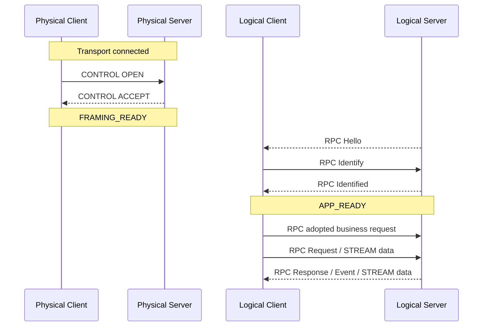
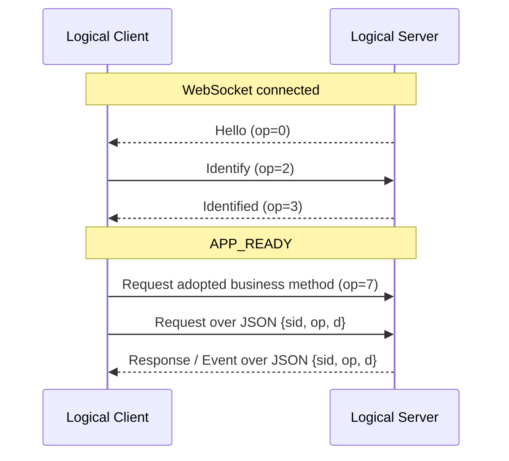
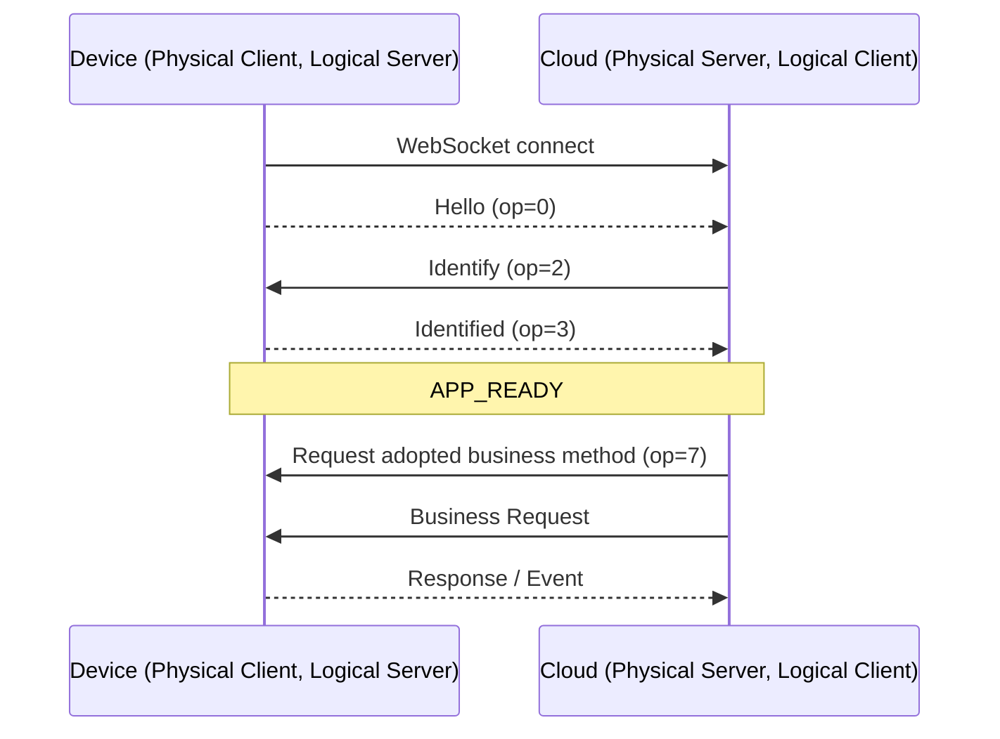

# 03《AXTP Transport Profiles》

> Status: AXTP v1 Core Freeze Candidate
> Spec Version: 1.0.0-rc1
> Scope: v1 Core transport profiles / connection roles / startup flow

版本：v1.0.0-rc1
状态：AXTP v1 Core Freeze Candidate
适用范围：AXTP 当前正式连接形态
前置文档：01《AXTP Protocol Framework》、02《AXTP Frame and Payload Spec》
后续文档：04《AXTP Control Session Spec》、05《AXTP RPC Session Spec》、06《AXTP Stream Spec》、18《AXTP Low-Bandwidth Degradation》

---

## 1. 架构裁决

AXTP v1 Core 收敛为两类正式路径：

```text
Standard Framed
  Transport: AXTP-USB-HID / AXTP-TCP
  Frame:     STANDARD_FRAME
  Payload:   CONTROL / RPC / STREAM
  RPC:       BINARY 或 JSON

WebSocket Unframed JSON
  Transport: AXTP-WS-JSON / AXTP-WS-CLOUD-REVERSE
  Frame:     none
  Payload:   RPC JSON envelope only
  RPC:       JSON
```

Compact / HID-64 / BLE / UART 是低带宽降级路径，不作为 v1 Core 必选实现。降级路径不得改变 MethodId、EventId、PayloadType、CONTROL/RPC/STREAM payload header 或 STREAM 16B Header。

---

## 2. 当前 Transport Profiles

| Transport Profile | 模式 | Frame Profile | RPC Encoding | CONTROL | STREAM | 典型用途 |
|---|---|---|---|---:|---:|---|
| `AXTP-USB-HID` | Standard Framed | `STANDARD_FRAME` | BINARY / JSON | 是 | 是 | USB HID 高速/大 report 设备 |
| `AXTP-TCP` | Standard Framed | `STANDARD_FRAME` | BINARY / JSON | 是 | 是 | PC / App 与设备直连 |
| `AXTP-WS-JSON` | WebSocket Unframed JSON | none | JSON | 否 | 否 | 浏览器、云端、轻量 RPC 集成 |
| `AXTP-WS-CLOUD-REVERSE` | WebSocket Unframed JSON | none | JSON | 否 | 否 | 设备主动连接云端 |

`AXTP-WS-JSON` 和 `AXTP-WS-CLOUD-REVERSE` 是正式 RPC-only 通道，不再被描述为 Debug-only。它们不承载正式 STREAM 数据，音视频、OTA、文件等连续数据必须使用 Standard Framed transport。

---

## 3. 角色模型

AXTP 区分物理连接角色和逻辑服务角色：

| 角色 | 含义 | 负责动作 |
|---|---|---|
| Physical Client | 底层连接发起方 | 建立 transport 连接；Standard Framed 中发送 CONTROL OPEN |
| Physical Server | 底层监听/接收方 | 接收连接；Standard Framed 中返回 CONTROL ACCEPT |
| Logical Client | AXTP 调用方 / 控制方 | 发送 Identify，发起 Request，订阅 Event |
| Logical Server | AXTP 能力提供方 | 发送 Hello，校验 Identify，提供 Methods / Events / Streams |

核心规则：

```text
OPEN follows the physical connection direction.
Hello follows the logical service direction.
```

即：Standard Framed 中，OPEN 顺着物理连接方向；所有模式中，Hello 都由 Logical Server 发送。

| Transport Profile | Physical Client | Physical Server | Logical Client | Logical Server | Hello 发送方 |
|---|---|---|---|---|---|
| `AXTP-USB-HID` | Host / App | USB HID Device | Host / App | Device | Device |
| `AXTP-TCP` | App / PC | Device | App / PC | Device | Device |
| `AXTP-WS-JSON` | App / Cloud | Device / Gateway | App / Cloud | Device | Device |
| `AXTP-WS-CLOUD-REVERSE` | Device | Cloud | Cloud | Device | Device |

云端反连场景中，设备是 Physical Client，但仍是 Logical Server。因此 WebSocket 建立后仍由设备发送 Hello。

---

## 4. Standard Framed 启动流程

适用于 `AXTP-USB-HID` 和 `AXTP-TCP`：



Standard Framed 支持：

- `PayloadType = CONTROL / RPC / STREAM`
- `rpcEncoding = BINARY`，bodyEncoding 推荐 TLV8
- `rpcEncoding = JSON`，用于调试、诊断或实现便利场景
- STREAM 16B Header：`streamId:uint32`、`seqId:uint32`、`cursor:uint64`

---

## 5. WebSocket Unframed JSON 启动流程

适用于 `AXTP-WS-JSON`：



WebSocket Unframed JSON 不使用：

- Standard Frame Header
- CONTROL OPEN / ACCEPT / ACK / NACK / CLOSE
- STREAM Payload
- CRC16
- Binary RPC 11B Header

WebSocket 断开即代表该 unframed RPC session 断开。恢复策略由应用层重新连接、重新 Identify、重新查询能力完成。

---

## 6. Cloud Reverse 启动流程

适用于 `AXTP-WS-CLOUD-REVERSE`：



这个场景中角色发生反转：

| 维度 | Device | Cloud |
|---|---|---|
| Physical role | Physical Client | Physical Server |
| Logical role | Logical Server | Logical Client |
| Hello | 发送 | 接收 |
| Request | 接收并执行 | 发起 |
| Event | 发送 | 接收 |

Cloud 不因为自己是 WebSocket Physical Server 就发送 Hello。Hello 永远由 Logical Server 发送。

---

## 7. 低带宽降级边界

Compact/HID-64/BLE/UART 迁移到 18《AXTP Low-Bandwidth Degradation》。这些链路可以作为后续版本或特殊低带宽场景使用，但不得改变当前 Registry 与 Payload 层语义：

- MethodId / EventId / ErrorCode 不变
- PayloadType 仍只有 CONTROL / RPC / STREAM
- Binary RPC Header 仍为 11B
- STREAM Header 仍为 16B
- stream profile 通过 RPC 建流绑定到 streamId，不进入 STREAM Header
