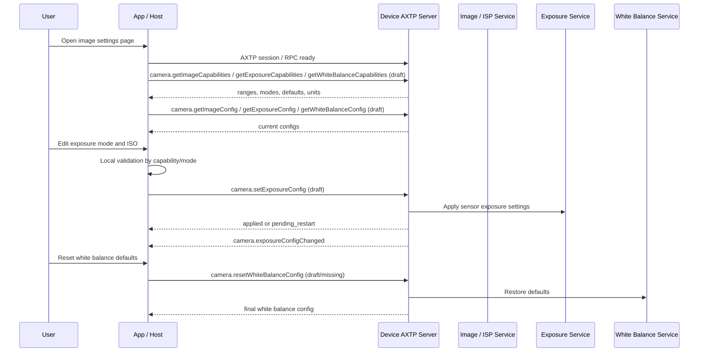

# Camera Image Settings Protocol Interaction Flow

> Status: flow design
> Scope: Camera image quality, exposure, ISO/gain, shutter, WDR, anti-flicker, and white balance settings
> Source inputs: `docs/workspace/business/camera-image-settings.md`, `docs/workspace/protocol/camera/camera.image.md`, `docs/workspace/protocol/camera/camera.exposure.md`, `docs/workspace/protocol/camera/camera.whiteBalance.md`, `docs/workspace/legacy-migration/classification/camera.md`, `contract/generated/protocol.md`
> Protocol lifecycle: Stage 10 `plan-protocol-flow`

本文根据 camera image settings 业务需求，梳理 App / Host 加载图像参数能力、读取配置、编辑并保存 image / exposure / white balance 设置、恢复默认和接收配置变化的 AXTP 交互流程。

本文不是最终协议事实源。当前 generated 协议没有 `camera.image`、`camera.exposure`、`camera.whiteBalance` 的业务 method / event；相关能力仍处于 `docs/workspace/protocol/camera/**` 草案阶段。

## 0. 速读结论

| 项目 | 内容 |
|---|---|
| Flow 目标 | 让 App / Host 能读取和设置基础图像参数、曝光/ISO/WDR/防频闪、白平衡/色温/RGB gain，并处理模式依赖和恢复默认。 |
| 当前协议覆盖 | partial |
| 涉及 domain.feature | `camera.image`, `camera.exposure`, `camera.whiteBalance` |
| 已有 adopted/generated | AXTP session/RPC envelope、core errors；无 generated camera image settings 业务方法。 |
| 缺口 | 三个 camera 配置草案需要补能力字段、模式依赖、单位/范围、partial update、reset 和事件 payload。 |
| 是否需要新增协议草案 | no，已有 camera 草案；需要后续修订/采纳。 |
| 是否涉及 Legacy | yes |
| 是否涉及 STREAM | no |
| 下一步 | draft protocol；修订 `camera.image`、`camera.exposure`、`camera.whiteBalance` 草案后进入 adoption。 |

## 1. Story Summary

| Item | Content |
|---|---|
| User goal | 用户在图像设置页查看当前成像参数，调整画质、曝光和白平衡，并可恢复默认。 |
| Trigger | App / Host 建立 AXTP session 后进入摄像头图像设置页，或设备 profile / 本地操作导致配置变化。 |
| Success result | App 展示支持字段、当前值和模式依赖；设置成功后设备返回最终配置；外部变化通过事件或轮询同步。 |
| Primary actors | User, App / Host, Device AXTP server, image/ISP service, exposure service, white balance service |
| Product scope | 支持可调摄像头图像参数的会议摄像设备。 |

## 2. Source Observations

### 2.1 UI / Prototype

| Screen or control | Observed behavior | Protocol relevance |
|---|---|---|
| Image sliders | brightness、contrast、saturation、sharpness 等滑条。 | `camera.image` capability/config。 |
| Image style selector | 用户选择图像风格或视角。 | `camera.image` config；sight angle 归属需确认。 |
| Exposure mode selector | auto/manual/partial auto。 | `camera.exposure` mode；控制 ISO/gain/shutter/EV 可写性。 |
| ISO / gain / shutter controls | 手动曝光下可编辑。 | `camera.exposure` fields with ranges/units。 |
| WDR / anti-flicker controls | 用户启用 WDR，选择 50Hz / 60Hz / auto。 | `camera.exposure` config。 |
| White balance mode selector | auto/manual/locked。 | `camera.whiteBalance` mode。 |
| Color temperature / RGB gain controls | 手动白平衡下可编辑。 | `camera.whiteBalance` fields。 |
| Reset button | 恢复当前页或全部图像参数默认值。 | reset config candidate。 |

### 2.2 Requirement Notes

- `camera.image` 管基础图像参数，不承载曝光和白平衡的复杂模式依赖。
- `camera.exposure` 管 exposure mode、ISO/gain、shutter、EV、WDR、防频闪。
- `camera.whiteBalance` 管 white balance mode、色温、RGB gain、lock。
- 配置接口应支持 partial update，但需要确认原子性和跨 feature 更新边界。
- 自动模式下的手动字段通常不可写，App 需要基于 capability 和当前 mode 做本地禁用。
- 某些设置可能需要 camera pipeline restart，需要 result 或 event 表达 `applyState`。

### 2.3 Device / System State Observations

| State | Meaning | Protocol relevance |
|---|---|---|
| capabilities loaded | App 已知道可配置字段、范围、默认值和单位。 | query；get capabilities draft。 |
| config loaded | App 已加载当前 image/exposure/WB 配置。 | query；get config draft。 |
| editing local draft | 用户正在本地编辑但未提交。 | local-only；本地校验。 |
| applying | 设备正在应用 ISP 或 sensor 参数。 | response/event；apply state。 |
| applied | 配置已生效。 | response/event；刷新 UI。 |
| pending restart | 需要重启摄像头 pipeline 才生效。 | result/event；提示用户。 |
| unavailable | 摄像头未打开、隐私遮挡、传感器忙或模式冲突。 | error/state；禁用控件。 |

## 3. Assumptions And Non-Goals

| Type | Item | Status |
|---|---|---|
| Assumption | camera image settings 拆为 `camera.image`、`camera.exposure`、`camera.whiteBalance` 三个 feature。 | `[REVIEW-OK]` |
| Assumption | WDR 和 power-line frequency 当前归 `camera.exposure`。 | `[REVIEW-DRAFT]` |
| Assumption | VM33 Camera 大配置需要拆分字段，不全部塞进 `camera.image`。 | `[REVIEW-OK]` |
| Question | ISO/gain/shutter/EV 的单位、范围和默认值由固件 capability 暴露。 | `[REVIEW-ASK]` |
| Non-goal | 不处理 PTZ/zoom/focus/autofocus。 | `[REVIEW-OK]` |
| Non-goal | 不处理视频 stream/encoder/recording。 | `[REVIEW-OK]` |

## 4. Protocol Coverage

| Need | Coverage state | AXTP protocol | Evidence | Next action |
|---|---|---|---|---|
| 建立 AXTP session 和 RPC 调用 | generated | AXTP RPC/session | `contract/generated/protocol.md` | 可按 generated core 实现。 |
| 查询基础图像能力 | draft | `camera.getImageCapabilities` | `docs/workspace/protocol/camera/camera.image.md` | 补字段范围、默认值、单位和 reset scope。 |
| 读取/设置基础图像配置 | draft | `camera.getImageConfig`, `camera.setImageConfig` | `docs/workspace/protocol/camera/camera.image.md` | 补 partial update 和 changed event payload。 |
| 查询曝光能力 | draft | `camera.getExposureCapabilities` | `docs/workspace/protocol/camera/camera.exposure.md` | 补 mode、ISO/gain、shutter、EV、WDR、anti-flicker。 |
| 读取/设置曝光配置 | draft | `camera.getExposureConfig`, `camera.setExposureConfig` | `docs/workspace/protocol/camera/camera.exposure.md` | 补自动/手动依赖和 units。 |
| 查询白平衡能力 | draft | `camera.getWhiteBalanceCapabilities` | `docs/workspace/protocol/camera/camera.whiteBalance.md` | 补 color temperature、RGB gain、lock。 |
| 读取/设置白平衡配置 | draft | `camera.getWhiteBalanceConfig`, `camera.setWhiteBalanceConfig` | `docs/workspace/protocol/camera/camera.whiteBalance.md` | 补 mode 依赖和事件。 |
| 恢复默认图像设置 | draft/missing | `reset*Config` candidates | `docs/workspace/protocol/camera/*.md` | 确认按 feature reset 还是统一 reset。 |
| 配置变化同步 | draft | `camera.imageConfigChanged`, `camera.exposureConfigChanged`, `camera.whiteBalanceConfigChanged` | appendix event candidates, protocol drafts | 确认 event payload 完整状态还是 patch。 |

## 5. End-To-End Sequence

## 6. Interaction Steps

| Step | Actor | Action | Capability / precondition | Protocol call/event | Payload fields | Result / state change | Coverage | Error / fallback |
|---:|---|---|---|---|---|---|---|---|
| 1 | App | 建立连接并加载 generated registry。 | AXTP session ready。 | generated RPC/session | session fields | 可调用设备 RPC。 | generated | 连接失败则不可进入页面。 |
| 2 | App / Device | 查询 image/exposure/WB 能力。 | camera settings supported。 | get capabilities candidates | cameraId, sections | 返回字段范围、默认值、单位和模式依赖。 | draft | 某 feature 不支持则隐藏对应区域。 |
| 3 | App / Device | 查询当前配置。 | capabilities loaded。 | `camera.getImageConfig`, `camera.getExposureConfig`, `camera.getWhiteBalanceConfig` | cameraId | 返回当前配置。 | draft | 读取失败时显示未知并允许重试。 |
| 4 | User / App | 用户编辑基础图像滑条。 | field supported。 | local-only validation | brightness/contrast/saturation/sharpness | 本地 draft 更新。 | local-only | 超范围时本地阻止提交。 |
| 5 | App / Device | 保存基础图像配置。 | fields supported。 | `camera.setImageConfig` | partial image config | 返回 applied config。 | draft | 不支持字段返回 invalid argument。 |
| 6 | User / App | 用户切换曝光模式。 | exposure mode supported。 | local validation + `camera.setExposureConfig` | mode, optional ISO/gain/shutter/EV | exposure applied 或 pending restart。 | draft | 自动模式下手动字段非法时返回 mode conflict/invalid。 |
| 7 | User / App | 用户设置 WDR 或防频闪。 | field supported。 | `camera.setExposureConfig` | wdr, powerLineFrequency | exposure config changed。 | draft | 不支持 50/60Hz 时返回 not supported。 |
| 8 | User / App | 用户切换白平衡模式或色温。 | WB supported。 | `camera.setWhiteBalanceConfig` | mode, colorTemperature/RGB gains | WB applied。 | draft | 自动模式下手动字段不可写。 |
| 9 | User / App | 恢复默认配置。 | reset supported。 | reset config candidates | feature/scope | 返回最终 config，触发 changed event。 | draft/missing | 需要确认按 feature reset 还是跨 feature reset。 |
| 10 | Device / App | 上报配置变化。 | event subscribed。 | config changed events | changedFields, config, applyState, reason | App 刷新页面。 | draft | 事件丢失后调用 get 校准。 |

## 7. State Changes And Events

| State change | Trigger | Event needed | Payload | Client handling | Coverage |
|---|---|---|---|---|---|
| image config changed | set/reset/profile/local control | `camera.imageConfigChanged` | changedFields, config, reason, applyState | 更新 image 控件。 | draft |
| exposure config changed | set/reset/auto algorithm/profile | `camera.exposureConfigChanged` | changedFields, config, reason, applyState | 更新 exposure 控件和 mode 依赖。 | draft |
| white balance config changed | set/reset/auto algorithm/profile | `camera.whiteBalanceConfigChanged` | changedFields, config, reason, applyState | 更新 WB 控件。 | draft |
| pending restart | 某些 ISP/sensor 参数需要重启 pipeline | config changed event or set result | applyState=pending_restart | 提示用户重启或等待生效。 | draft/missing |

## 8. Protocol Details

### 8.1 Adopted / Generated Protocols

| Method/Event | Purpose in this flow | Source |
|---|---|---|
| AXTP RPC/session | 承载 camera image settings 查询、设置和事件。 | `contract/generated/protocol.md` |
| Core errors | unsupported、invalid argument、out of range、busy、permission denied 等错误基础。 | `contract/registry/error/error_code.yaml` |

### 8.2 Draft Or Missing Protocol Gaps

| Gap | Candidate domain.feature | Candidate method/event/schema | Routed skill | Review question |
|---|---|---|---|---|
| 基础图像字段集合不完整 | `camera.image` | image capabilities/config schema | `draft-business-protocol` | `[REVIEW-ASK]` MVP 是否包含 brightness/contrast/saturation/sharpness/hue/style/sightAngle？ |
| exposure 单位和模式依赖 | `camera.exposure` | exposure capabilities/config schema | `draft-business-protocol` | `[REVIEW-ASK]` ISO/gain/shutter/EV 的单位和合法组合是什么？ |
| WDR/anti-flicker 归属 | `camera.exposure` | wdr, powerLineFrequency fields | `draft-business-protocol` | `[REVIEW-ASK]` WDR 是否应拆到 image enhancement？ |
| white balance 手动字段 | `camera.whiteBalance` | colorTemperature, rgbGain, lock | `draft-business-protocol` | `[REVIEW-ASK]` 手动白平衡支持色温、RGB gain 还是二者都支持？ |
| reset 范围 | `camera.image` / `camera.exposure` / `camera.whiteBalance` | reset config methods | `draft-business-protocol` | `[REVIEW-ASK]` 按 feature reset 还是统一 camera image reset？ |
| VM33 Camera 配置拆分 | camera settings features | legacy field mapping | `draft-business-protocol` | `[REVIEW-ASK]` VM33 `Camera` 配置字段如何拆到 image/exposure/WB？ |

## 9. Test / Conformance Notes

| Case | Given | When | Then | Protocol evidence |
|---|---|---|---|---|
| happy path | 设备支持 image/exposure/WB | 用户加载页面 | 返回能力和当前配置 | camera settings get capabilities/config |
| image set | brightness 在合法范围内 | 用户保存 image config | 返回 applied config，事件同步 | `camera.setImageConfig`, `camera.imageConfigChanged` |
| exposure mode conflict | 当前 auto exposure | 用户提交 manual-only shutter | 返回 invalid/mode conflict，配置不部分生效 | `camera.setExposureConfig` |
| white balance manual | 设备支持手动色温 | 用户设置 color temperature | 返回 applied WB config | `camera.setWhiteBalanceConfig` |
| reset | 用户恢复默认 | 设备执行 reset | 返回默认配置并触发 changed event | reset candidate, changed events |

## 10. Acceptance Gates

- App 只把 generated core 当稳定合同，camera settings 方法继续按 draft gap 路由。
- 每个 UI 字段都能映射到 image、exposure 或 whiteBalance 之一，不能混在泛 `camera.image`。
- 自动/手动模式依赖和单位范围由 capability 明确提供。
- reset、pending restart 和事件同步都有后续协议草案 owner。

## 11. Open Questions

| Question | Impact | Owner | Status | Next action |
|---|---|---|---|---|
| 基础图像 MVP 字段集合是什么？ | product/protocol | Product/Firmware | REVIEW-ASK | 修订 `camera.image` 草案。 |
| ISO/gain/shutter/EV 的单位和范围是什么？ | firmware/protocol | Firmware | REVIEW-ASK | 修订 `camera.exposure` 草案。 |
| 白平衡手动控制采用色温还是 RGB gain？ | firmware/product | Firmware/Product | REVIEW-ASK | 修订 `camera.whiteBalance` 草案。 |
| VM33 Camera 配置如何拆分？ | legacy/protocol | Architecture | REVIEW-ASK | 补 legacy mapping。 |
