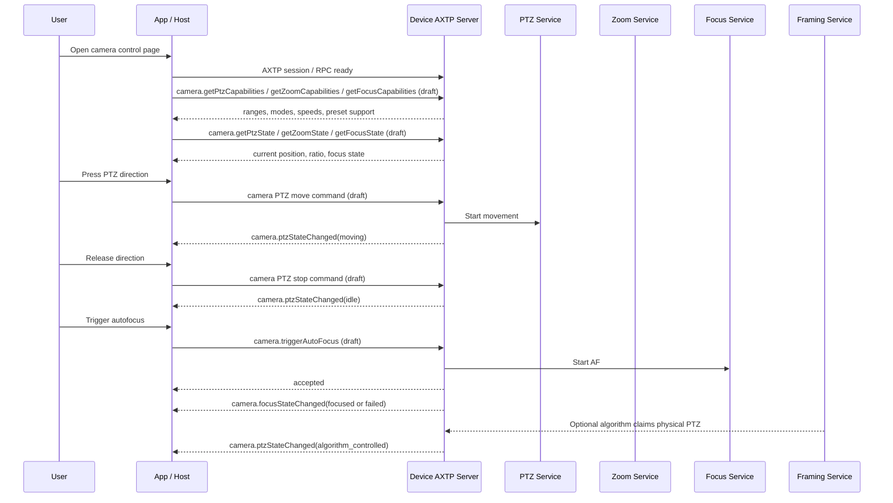

# Camera Lens Control Protocol Interaction Flow

> Status: flow design
> Scope: PTZ, zoom, autofocus, manual focus, focus region, and preset-oriented lens control
> Source inputs: `docs/workspace/business/camera-lens-control.md`, `docs/workspace/protocol/camera/camera.ptz.md`, `docs/workspace/protocol/camera/camera.zoom.md`, `docs/workspace/protocol/camera/camera.focus.md`, `docs/workspace/legacy-migration/classification/camera.md`, `contract/generated/protocol.md`
> Protocol lifecycle: Stage 10 `plan-protocol-flow`

本文根据 camera lens control 业务需求，梳理 App / Host 对 PTZ、zoom、focus/autofocus 的查询、控制、事件同步和冲突处理流程。

本文不是最终协议事实源。当前 generated 协议没有 `camera.ptz`、`camera.zoom`、`camera.focus` 的业务 method / event；相关能力仍处于 `docs/workspace/protocol/camera/**` 草案阶段。

## 0. 速读结论

| 项目 | 内容 |
|---|---|
| Flow 目标 | 让 App / Host 能控制物理 PTZ、zoom、autofocus、手动 focus 和 preset，并处理算法接管与多端冲突。 |
| 当前协议覆盖 | partial |
| 涉及 domain.feature | `camera.ptz`, `camera.zoom`, `camera.focus`, related `video.framing` |
| 已有 adopted/generated | AXTP session/RPC envelope、core errors；无 generated camera lens 业务方法。 |
| 缺口 | PTZ/zoom/focus 草案需要补能力、状态、动作、preset、冲突 owner 和事件 payload；`CommonSetPanTiltZoom` 的拆分边界待确认。 |
| 是否需要新增协议草案 | no，已有 camera 草案；需要后续修订/采纳。 |
| 是否涉及 Legacy | yes |
| 是否涉及 STREAM | no |
| 下一步 | draft protocol；修订 `camera.ptz`、`camera.zoom`、`camera.focus` 草案后进入 adoption。 |

## 1. Story Summary

| Item | Content |
|---|---|
| User goal | 用户打开摄像头控制页，调整视角、缩放和对焦，或保存/调用预置位。 |
| Trigger | App / Host 建立 AXTP session 后进入摄像头控制页，或 framing 算法/遥控器/本地按键改变镜头状态。 |
| Success result | App 展示 PTZ、zoom、focus 能力和当前状态；控制成功后设备状态同步；冲突或不可用时有明确错误。 |
| Primary actors | User, App / Host, Device AXTP server, PTZ service, zoom service, focus service, optional video framing service |
| Product scope | 支持摄像头机械控制、变焦或对焦的会议摄像设备。 |

## 2. Source Observations

### 2.1 UI / Prototype

| Screen or control | Observed behavior | Protocol relevance |
|---|---|---|
| Direction pad / joystick | 用户按住方向键移动，松开停止。 | `camera.ptz` start/stop/relative move 或 set state。 |
| Zoom slider / buttons | 用户放大或缩小画面。 | `camera.zoom` config/state；可能是 optical/digital/default。 |
| Autofocus button | 用户触发一次自动对焦。 | `camera.triggerAutoFocus`，状态通过 event 或 query 确认。 |
| Focus mode selector | 用户切换 auto / continuous_auto / manual / fixed。 | `camera.focus` mode/config。 |
| Focus region picker | 用户点选或框选对焦区域。 | `camera.focus` region/target。 |
| Preset list | 用户保存、调用、删除预置位。 | `camera.ptz` preset candidate；是否包含 zoom/focus 待确认。 |

### 2.2 Requirement Notes

- physical PTZ 是机械 pan/tilt；electronic PTZ 是裁切/数字平移，可能与 `video.framing` 相关。
- `camera.zoom` 负责倍率/位置/光学与数字变焦；`camera.ptz` 不应吞掉所有 zoom 配置。
- autofocus 是动作型流程，RPC 成功表示请求被接受，不代表已完成对焦。
- focus/zoom/PTZ 范围必须来自 capability，不假设统一范围。
- framing 区域追踪 over physical PTZ 可能会抢占手动 PTZ 控制。

### 2.3 Device / System State Observations

| State | Meaning | Protocol relevance |
|---|---|---|
| lens capabilities loaded | App 已知道 PTZ/zoom/focus 支持范围。 | query；camera capabilities draft。 |
| ptz idle / moving / limited | 云台空闲、移动中或到达限位。 | state/event；`camera.ptzStateChanged` draft。 |
| zoom idle / moving | zoom 空闲或变焦中。 | state/event；`camera.zoomStateChanged` draft。 |
| focus idle / focusing / focused / failed | 对焦状态。 | query/event；`camera.getFocusState`, `camera.focusStateChanged` draft。 |
| algorithm controlled | framing 算法接管 PTZ/zoom/focus。 | state/event；冲突处理。 |
| unavailable | 摄像头被隐私、校准、低电源或其他服务占用。 | error/state；禁用控件。 |

## 3. Assumptions And Non-Goals

| Type | Item | Status |
|---|---|---|
| Assumption | PTZ、zoom、focus 分属三个 feature，但 App 可在同一摄像头控制页编排。 | `[REVIEW-OK]` |
| Assumption | preset 初版归 `camera.ptz`，是否包含 zoom/focus 作为扩展字段待确认。 | `[REVIEW-DRAFT]` |
| Assumption | `CommonSetPanTiltZoom` 先作为拆分边界待确认的 legacy 线索，不直接决定正式方法归属。 | `[REVIEW-DRAFT]` |
| Question | physical PTZ 与 electronic PTZ 是否同时出现在 lens control 页，还是 electronic PTZ 只归 framing？ | `[REVIEW-ASK]` |
| Non-goal | 不设计图像质量参数和曝光/白平衡。 | `[REVIEW-OK]` |
| Non-goal | 不设计 AF calibration 或工厂产测。 | `[REVIEW-OK]` |

## 4. Protocol Coverage

| Need | Coverage state | AXTP protocol | Evidence | Next action |
|---|---|---|---|---|
| 建立 AXTP session 和 RPC 调用 | generated | AXTP RPC/session | `contract/generated/protocol.md` | 可按 generated core 实现。 |
| 查询 PTZ 能力和状态 | draft | `camera.getPtzCapabilities`, `camera.getPtzState` | `docs/workspace/protocol/camera/camera.ptz.md` | 草案需补 state/action/preset 字段。 |
| 控制 PTZ | draft | `camera.setPtzConfig` / movement candidates | `docs/workspace/protocol/camera/camera.ptz.md` | 明确 absolute/relative/continuous move 和 stop。 |
| preset 保存/调用 | missing/draft | `camera.ptz` preset candidates | business requirement, legacy position number | 补 preset model 或确认另建 feature。 |
| 查询 zoom 能力和状态 | draft | `camera.getZoomCapabilities`, `camera.getZoomState` | `docs/workspace/protocol/camera/camera.zoom.md` | 补 optical/digital/default type、speed、region。 |
| 设置 zoom | draft | `camera.setZoomConfig` | `docs/workspace/protocol/camera/camera.zoom.md` | 明确 ratio/position/relative/speed 和事件。 |
| 查询 focus 能力和状态 | draft | `camera.getFocusCapabilities`, `camera.getFocusState` | `docs/workspace/protocol/camera/camera.focus.md` | 已有较多内容；需统一为模板/采纳候选。 |
| 触发 autofocus | draft | `camera.triggerAutoFocus` | `docs/workspace/protocol/camera/camera.focus.md`, appendix candidates | 确认 async result/event。 |
| 设置 focus mode / position / region | draft | focus mode/position/region candidates | `docs/workspace/protocol/camera/camera.focus.md` | 确认 VM33 `SetFocus` 与 `SetFocusRegion` 映射。 |
| 与 framing 算法冲突 | draft | `video.framing` + camera state owner fields | `docs/workspace/protocol/video/video.framing.md` | 补 control owner / conflict policy。 |

## 5. End-To-End Sequence

## 6. Interaction Steps

| Step | Actor | Action | Capability / precondition | Protocol call/event | Payload fields | Result / state change | Coverage | Error / fallback |
|---:|---|---|---|---|---|---|---|---|
| 1 | App | 建立连接并加载 generated registry。 | AXTP session ready。 | generated RPC/session | session fields | 可调用设备 RPC。 | generated | 连接失败则不可进入页面。 |
| 2 | App / Device | 查询 PTZ/zoom/focus 能力。 | camera control supported。 | `camera.getPtzCapabilities`, `camera.getZoomCapabilities`, `camera.getFocusCapabilities` | cameraId | 返回范围、模式、速度、事件支持。 | draft | 某能力不支持则隐藏对应控件。 |
| 3 | App / Device | 查询当前镜头状态。 | capability loaded。 | `camera.getPtzState`, `camera.getZoomState`, `camera.getFocusState` | cameraId | 当前 pan/tilt、zoom ratio、focus state。 | draft | 状态不可用时显示 unavailable。 |
| 4 | User / App | 按住 PTZ 方向键。 | physical PTZ idle。 | movement candidate / `camera.setPtzConfig` | direction, speed | PTZ moving。 | draft | 被 framing 接管时返回 conflict 或提示先关闭算法。 |
| 5 | User / App | 松开方向键。 | PTZ moving。 | PTZ stop candidate | operationId/cameraId | PTZ idle。 | missing/draft | stop 丢失时设备应有超时保护。 |
| 6 | User / App | 设置 zoom。 | zoom supported。 | `camera.setZoomConfig` | zoomType, ratio/position, speed | zoom moving 或 applied。 | draft | 超范围按 capability 返回 out-of-range。 |
| 7 | User / App | 触发 autofocus。 | AF supported。 | `camera.triggerAutoFocus` | target, region/point, timeout | accepted, focusing。 | draft | 最终失败通过 state changed 或 get state。 |
| 8 | User / App | 设置手动 focus。 | manual focus supported。 | focus mode/position candidates | mode=manual, position | focus position applied。 | draft | 当前模式不允许时返回 mode conflict。 |
| 9 | User / App | 设置 focus region。 | region AF supported。 | focus region candidate | target, point/region | region stored 或 AF started。 | draft | 坐标非法返回 invalid/out-of-range。 |
| 10 | User / App | 保存/调用 preset。 | preset supported。 | preset candidates | presetId/name, includeZoomFocus | preset saved or recalled。 | missing/draft | 需确认 preset 范围和字段。 |
| 11 | Device / App | 上报状态变化。 | event subscribed。 | `camera.ptzStateChanged`, `camera.zoomStateChanged`, `camera.focusStateChanged` | state, reason, owner | App 刷新控件。 | draft | 事件丢失后调用 get 校准。 |

## 7. State Changes And Events

| State change | Trigger | Event needed | Payload | Client handling | Coverage |
|---|---|---|---|---|---|
| PTZ position/state changed | 手动操作、preset、framing 算法、本地按键 | `camera.ptzStateChanged` | cameraId, pan/tilt, state, owner, reason | 更新方向控件和位置显示。 | draft |
| zoom state changed | slider、button、optical/digital zoom action | `camera.zoomStateChanged` | cameraId, ratio/position, zoomType, state | 更新 zoom slider。 | draft |
| focus state changed | autofocus、manual position、focus region | `camera.focusStateChanged` | cameraId, state, confidence, reason | 显示 focused/failed；必要时 get 校准。 | draft |
| control owner changed | framing 接管或释放 lens control | camera state event or framing event | owner, mode, reason | 禁用/恢复手动控件。 | draft/missing |

## 8. Protocol Details

### 8.1 Adopted / Generated Protocols

| Method/Event | Purpose in this flow | Source |
|---|---|---|
| AXTP RPC/session | 承载 camera control 查询、设置和事件。 | `contract/generated/protocol.md` |
| Core errors | unsupported、invalid argument、out of range、busy、mode conflict 等错误基础。 | `contract/registry/error/error_code.yaml` |

### 8.2 Draft Or Missing Protocol Gaps

| Gap | Candidate domain.feature | Candidate method/event/schema | Routed skill | Review question |
|---|---|---|---|---|
| PTZ movement 模型不完整 | `camera.ptz` | absolute/relative/continuous move, stop, state event | `draft-business-protocol` | `[REVIEW-ASK]` 是否保留 `setPtzConfig`，还是新增动作型 move/stop？ |
| preset 模型未固化 | `camera.ptz` | preset save/recall/delete/list candidates | `draft-business-protocol` | `[REVIEW-ASK]` preset 是否包含 zoom/focus？ |
| zoom 类型和单位未确认 | `camera.zoom` | zoom ratio/position/type/speed | `draft-business-protocol` | `[REVIEW-ASK]` optical/digital/default 如何表达？ |
| focus async 语义需固化 | `camera.focus` | `triggerAutoFocus`, `focusStateChanged` | `draft-business-protocol` | `[REVIEW-ASK]` response 是否只返回 accepted？ |
| 算法接管冲突 | `camera.ptz` / `video.framing` | owner/conflict fields | `draft-business-protocol` | `[REVIEW-ASK]` 手动控制是抢占算法还是被拒绝？ |
| legacy `CommonSetPanTiltZoom` 拆分 | `camera.ptz` / `camera.zoom` | adapter mapping | `draft-business-protocol` | `[REVIEW-ASK]` payload 中 pan/tilt/zoom 的真实单位和语义是什么？ |

## 9. Test / Conformance Notes

| Case | Given | When | Then | Protocol evidence |
|---|---|---|---|---|
| happy path | 设备支持 PTZ/zoom/focus | 用户加载页面 | 返回能力和当前状态 | camera capability/state queries |
| PTZ move | PTZ idle | 用户按下方向键再松开 | moving 后 idle，位置变化 | PTZ move/stop, `camera.ptzStateChanged` |
| autofocus | AF supported | 用户触发自动对焦 | accepted 后事件上报 focused 或 failed | `camera.triggerAutoFocus`, `camera.focusStateChanged` |
| conflict | framing 正在接管 physical PTZ | 用户手动 PTZ | 返回 conflict 或暂停算法 | PTZ/framing state |
| unsupported | 设备固定焦 | 用户打开 focus 控件 | 控件禁用或显示 fixed | `camera.getFocusCapabilities` |

## 10. Acceptance Gates

- App 不把未 generated 的 camera 方法作为正式合同。
- PTZ、zoom、focus 三类状态各有清晰 coverage 和后续草案路由。
- legacy 映射中的 `CommonSetPanTiltZoom` 不直接决定正式能力归属。
- 异步 autofocus 和 movement stop 的失败路径可测试。

## 11. Open Questions

| Question | Impact | Owner | Status | Next action |
|---|---|---|---|---|
| PTZ movement 是否需要独立 move/stop 方法？ | protocol/firmware | Architecture/Firmware | REVIEW-ASK | 修订 `camera.ptz` 草案。 |
| preset 是否包含 zoom/focus/framing？ | product/protocol | Product | REVIEW-ASK | 确认 preset scope。 |
| electronic PTZ 是否归 camera lens control？ | product/protocol | Product/Architecture | REVIEW-ASK | 和 `video.framing` 一起评审。 |
| 多端控制冲突策略是什么？ | protocol/firmware | Firmware | REVIEW-ASK | 设计 owner/conflict 字段。 |
