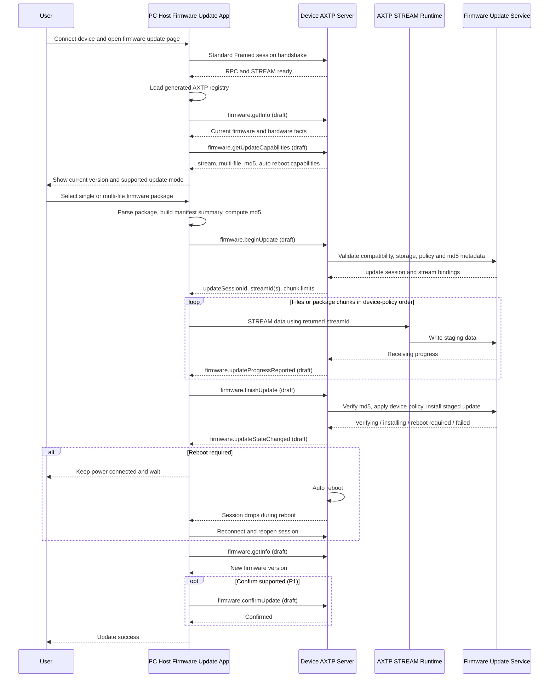

# Device Firmware Update Protocol Interaction Flow

> Status: flow design
> Scope: PC Host updates a directly connected device through the generic `firmware.update` capability
> Source inputs: `docs/workspace/business/device-firmware-update.md`, `tooling/skills/10-plan-protocol-flow/references/flow-plan-template.md`, `docs/workspace/protocol/firmware/firmware.update.md`, `docs/workspace/protocol/firmware/firmware.info.md`, `docs/legacy-classification/firmware.md`
> Protocol lifecycle: Stage 10 `plan-protocol-flow`

本文根据“设备接到 PC 上位机后可以读取当前版本并执行固件更新，且需要从单个 `.bin` 扩展到多个 `.bin` 文件”的业务需求，梳理需要使用的 AXTP 协议、已有覆盖状态和协议缺口。

本文不是最终协议事实源；已采纳事实以 `contract/registry/**/*.yaml`、`contract/registry/domains/**/*.yaml` 和 `contract/generated/**` 为准，新增或修改协议必须转入 `docs/workspace/protocol/**` 草案和后续采纳流程。当前 generated 协议提供 AXTP Core、Standard Framed transport、STREAM 数据面和 firmware/stream 错误码；`firmware.getInfo`、`firmware.getUpdateCapabilities`、`firmware.beginUpdate`、`firmware.finishUpdate` 及固件更新事件仍是草案依赖。

Flow 文档负责描述业务场景和交互步骤、判断每一步协议覆盖状态、识别协议缺口，并将缺口路由到 candidate `domain.feature`。Flow 文档不负责定义完整 method / event / schema / capability，不分配 methodId / eventId / errorCode / fieldId，也不能替代 `docs/workspace/protocol/<domain>/<feature>.md`。

完整 method / event / schema / capability 定义必须进入 `docs/workspace/protocol/<domain>/<feature>.md`。

## 0. 速读结论

| 项目 | 内容 |
|---|---|
| Flow 目标 | PC Host 读取设备固件信息，选择单 `.bin` 或多 `.bin` 包，通过 AXTP STREAM 上传，调用 `firmware.finishUpdate` 后由设备自主校验、安装、自动重启，并在重连后确认新版本。 |
| 当前协议覆盖 | partial |
| 涉及 domain.feature | `firmware.info`, `firmware.update`, `stream.flowControl` |
| 已有 adopted/generated | AXTP Standard Framed transport、`AXTP-USB-HID`、Core `STREAM` 数据面、firmware/stream error codes。 |
| 缺口 | `firmware.info` 和 `firmware.update` 业务方法、事件、manifest、多文件策略、`finishUpdate` 移交语义、进度/状态语义尚未 adopted/generated。 |
| 是否需要新增协议草案 | yes；已有 `docs/workspace/protocol/firmware/**` 草案需 review/adopt。 |
| 是否涉及 Legacy | yes；AXDP Alpha/Beta、Rooms、Signage、VM33 升级线索作为迁移证据。 |
| 是否涉及 STREAM | yes；本地固件字节上传走 Standard Framed `STREAM`。 |
| 下一步 | 使用 `tooling/skills/20-draft-business-protocol/SKILL.md` 继续评审并采纳 `firmware.info` / `firmware.update` 草案。 |

## 1. Story Summary

| Item | Content |
|---|---|
| User goal | 用户将设备连接到 PC 上位机，查看当前固件版本，选择或导入升级包，并完成可靠升级。 |
| Trigger | 上位机检测到设备接入，或用户打开固件升级页面并选择本地固件更新包。 |
| Success result | 设备确认包兼容，接收单文件或多文件固件；Host 调用 `finishUpdate` 后，设备自主完成 md5 校验、安装和自动重启，上位机重连后看到新版本。 |
| Primary actors | User, PC Host firmware update app/service, Device AXTP server, Firmware update service, AXTP STREAM runtime |
| Product scope | 通用 `firmware.update` 能力；P0 覆盖 PC 本地包升级，兼容单 `.bin`、多 `.bin` 和带 manifest 的整包。 |

## 2. Source Observations

### 2.1 UI / Prototype

| Screen or control | Observed behavior | Protocol relevance |
|---|---|---|
| Device connection entry | 设备接到 PC 后，上位机识别设备并建立会话。 | 使用 AXTP Standard Framed transport，典型路径是 `AXTP-USB-HID`。 |
| Current version display | 上位机需要展示当前版本、硬件或产品信息。 | 草案依赖 `firmware.getInfo`；采纳前可由 legacy adapter 或设备现有接口提供。 |
| Firmware package picker | 用户选择一个 `.bin`、多个 `.bin` 或一个包含 manifest 的包。 | 本地文件解析、包格式识别和 md5 预计算是 Host 行为；协议只接收 manifest 摘要。 |
| Start update button | 用户确认升级后，上位机开始固件更新。 | 草案依赖 `firmware.getUpdateCapabilities` 和 `firmware.beginUpdate`。 |
| Progress view | UI 展示整体进度、每个文件进度、当前阶段和失败原因。 | 草案依赖 `firmware.updateProgressReported` / `firmware.updateStateChanged`；事件丢失时可轮询 `firmware.getUpdateState`。 |
| Cancel / retry | 接收或校验阶段允许取消；传输异常时 P0 可重试当前 chunk/file 或重新开始。 | 草案依赖 `firmware.cancelUpdate`；断点续传、乱序补传和多文件并行只作为预留设计。 |
| Reboot / reconnect prompt | `finishUpdate` 后设备进入自主校验、安装和自动重启流程，上位机提示保持供电并等待重连。 | 草案依赖 `firmware.finishUpdate` response 和状态事件；P0 不要求 Host 调用 `system.reboot`。 |
| UI prototype image | `[REVIEW-ASK]` 当前没有 UI 图；页面文案、按钮状态、失败提示和是否需要用户二次确认需产品/UI 确认。 | 不新增协议，只影响 App 状态展示。 |

### 2.2 Requirement Notes

- 单 `.bin` 和多 `.bin` 不走两套协议；Host 统一转成 manifest 语义后进入 `firmware.update`。
- 多文件包可包含 bootloader、application、resource、model 或 vendor 等目标；安装顺序由设备策略决定，不由文件列表顺序作为唯一事实。
- Host 根据设备策略解析多文件包，或按设备策略将多个包拆分/排序后下发。
- 本产品生产包 P0 不强制签名，只使用 md5 做完整性校验；sha256 和签名作为后续扩展。
- Host 不编排设备内部的提交、校验和安装阶段；固件字节发送完成后调用 `firmware.finishUpdate`，由设备自主决定后续校验、安装、重启流程。
- 安装后如需重启，由设备自动执行；上位机只提示保持供电、等待断连，并在重连后读取版本。
- P0 不要求断点续传、乱序补传或多文件并行传输；相关字段和方法只作为后续预留。
- `file.transfer` 暂存模式不是本流程 P0；本地上传优先使用 `firmware.update` STREAM 数据面。

### 2.3 Device / System State Observations

| State | Meaning | Protocol relevance |
|---|---|---|
| session ready | PC Host 与设备已建立 Standard Framed AXTP session。 | generated；本地上传需要 RPC + STREAM。 |
| current firmware known | Host 已读取当前固件版本和硬件/产品信息。 | draft query；`firmware.getInfo`。 |
| update capability known | 设备返回 transfer mode、stream layout、hash algorithm、multi-file、chunk size、auto reboot 等能力。 | draft query；`firmware.getUpdateCapabilities`。 |
| package parsed | Host 已将单/多文件包转成 manifest 摘要，并完成本地基础校验。 | local-only；不进入 AXTP 协议。 |
| update session accepted | 设备接受 manifest 并返回 update session 与 STREAM 绑定信息。 | draft request；`firmware.beginUpdate`。 |
| receiving | 设备 staging 区正在接收 STREAM bytes。 | generated STREAM + draft firmware binding。 |
| transfer finished | Host 已完成本次会话所需固件字节发送，并把后续处理权移交给设备。 | draft request；`firmware.finishUpdate`。 |
| verifying | 设备自主校验 size/md5 或设备内部包规则。 | draft event/state；不要求 Host 调用独立 verify 方法。 |
| installing | 设备自主安装固件，部分阶段不可取消。 | draft event/state；不要求 Host 调用独立 install 方法。 |
| rebooting | 安装后设备自动重启，连接会断开。 | draft state/event + Host reconnect fallback。 |
| confirmed | Host 重连后读取到新版本；A/B 确认可作为 P1。 | draft query/action；`firmware.getInfo`, optional `firmware.confirmUpdate`。 |

## 3. Assumptions And Non-Goals

| Type | Item | Status |
|---|---|---|
| Assumption | 上位机和设备通过 `AXTP-USB-HID` 或等价 Standard Framed transport 建立会话，因此可以同时使用 RPC 和 STREAM。 | `[REVIEW-DRAFT]` |
| Assumption | PC 本地固件包可由 Host 解析出 manifest；如果包内没有 manifest，Host 按产品包规则生成 manifest 摘要。 | `[REVIEW-DRAFT]` |
| Assumption | 单 `.bin` 可表示为 manifest 中一个文件；多 `.bin` 使用多个 `fileId` 分别描述。 | `[REVIEW-DRAFT]` |
| Assumption | 设备在安装前有 staging 区或等价保护，校验失败不会覆盖当前可启动版本。 | `[REVIEW-DRAFT]` |
| Assumption | 多文件安装顺序由设备策略决定，Host 按设备策略解析、拆分或排序后下发。 | `[REVIEW-OK]` |
| Assumption | 生产包 P0 不强制签名，只使用 md5 做完整性校验。 | `[REVIEW-OK]` |
| Assumption | P0 中 Host 只在传输完成后调用 `firmware.finishUpdate`；设备自主校验、安装、自动重启，并通过状态/进度事件上报阶段和错误。 | `[REVIEW-OK]` |
| Assumption | 安装后需要重启时由设备自动重启，上位机不调用 `system.reboot`。 | `[REVIEW-OK]` |
| Assumption | P0 不要求断点续传、乱序补传或多文件并行传输；相关设计仅作为协议预留。 | `[REVIEW-OK]` |
| Non-goal | 不设计固件包制作工具、发布后台、灰度策略或自动检查更新策略。 | `[REVIEW-OK]` |
| Non-goal | 不把 `firmware.updatePolicy` 混入本次手动升级流程。 | `[REVIEW-OK]` |
| Non-goal | 不重新定义 STREAM ACK、window、header 字段或 transport 行为。 | `[REVIEW-OK]` |
| Non-goal | 不在 Stage 10 修改 `docs/workspace/protocol/**`、registry YAML、Protocol IR 或 generated 文件。 | `[REVIEW-OK]` |

## 4. Protocol Coverage

| Need | Coverage state | AXTP protocol | Evidence | Next action |
|---|---|---|---|---|
| 上位机与直连设备建立可传 RPC 和 STREAM 的会话 | generated | `AXTP-USB-HID`, Standard Framed, CONTROL/RPC/STREAM lifecycle | `contract/generated/protocol.md`, `contract/protocol/axtp.protocol.yaml` | 可按 AXTP Core 实现连接和数据面。 |
| 识别设备型号、硬件版本或产品 ID | draft / local-only | USB descriptor, `device.info`, `firmware.getInfo` | `docs/workspace/protocol/device/device.info.md`, `docs/workspace/protocol/firmware/firmware.info.md` | USB 信息足够时可作为 local-only；否则转 Stage 20 细化信息边界。 |
| 查询当前固件版本 | draft | `firmware.getInfo` | `docs/workspace/protocol/firmware/firmware.info.md`, `docs/workspace/protocol/firmware/firmware.update.md` | 转 Stage 20 评审并采纳。 |
| 查询固件更新能力 | draft | `firmware.getUpdateCapabilities`, `firmware.update` capability | `docs/workspace/protocol/firmware/firmware.update.md` | Stage 20 固化 multi-file、md5、auto reboot；resume/parallel/signature 仅扩展。 |
| 本地选择和解析固件包 | local-only | Host firmware update app/service | `docs/workspace/business/device-firmware-update.md` | 上位机实现，不进入协议。 |
| Host 按设备策略拆分、排序或映射多文件包 | local-only / draft | Host package parser + `firmware.update` manifest policy fields | `docs/workspace/protocol/firmware/firmware.update.md` | Host 本地实现；策略标识和版本需 Stage 20 固化。 |
| 创建固件更新会话并传入 manifest 摘要 | draft | `firmware.beginUpdate` | `docs/workspace/protocol/firmware/firmware.update.md` | Stage 20 确认 manifest、streamLayout、idempotency、device policy。 |
| 固件字节传输 | generated / draft | Core `STREAM`; draft `firmware.update` stream profile binding | `contract/generated/protocol.md`, `contract/protocol/axtp.protocol.yaml`, `docs/workspace/protocol/firmware/firmware.update.md` | Core STREAM 已 generated；`streamId` / `fileId` 绑定需采纳。 |
| 通知设备固件字节发送完成并移交后续处理 | draft | `firmware.finishUpdate` | `docs/workspace/protocol/firmware/firmware.update.md` | Stage 20 新增/调整为 P0 方法；设备接管校验、安装和重启。 |
| 查询或上报升级进度 | draft | `firmware.getUpdateState`, `firmware.updateProgressReported`, `firmware.updateStateChanged` | `docs/workspace/protocol/firmware/firmware.update.md` | P0 用顺序传输和状态轮询兜底。 |
| 设备自主校验包完整性和 md5 | draft | internal phase exposed by state/progress/result events | `docs/workspace/protocol/firmware/firmware.update.md` | 不作为 P0 Host 控制方法；失败通过事件/状态上报。 |
| 设备自主安装已校验固件更新 | draft | internal phase exposed by state/progress/result events | `docs/workspace/protocol/firmware/firmware.update.md` | 不作为 P0 Host 控制方法；设备根据自身流程安装。 |
| 细粒度批次提交、外部校验、外部安装控制 | draft / P1 | `firmware.commitUpdateBatch`, `firmware.verifyUpdatePackage`, `firmware.installUpdate` | `docs/workspace/protocol/firmware/firmware.update.md` | 降为 P1 或高级能力；仅在设备需要 Host 细粒度协同时启用。 |
| 设备自动重启后确认新版本 | draft | `firmware.finishUpdate`, `firmware.getInfo`; optional `firmware.confirmUpdate` | `docs/workspace/protocol/firmware/firmware.update.md` | P0 不新增 Host 主动重启；confirm/rollback 为 P1。 |
| 固件更新错误码 | generated | Firmware and stream error codes | `contract/generated/error_code.generated.md`, `contract/registry/error/error_code.yaml` | 复用已生成错误码；业务方法错误映射在 Stage 20 草案中声明。 |
| 旧协议迁移证据 | draft evidence | AXDP Alpha/Beta, Rooms, Signage, VM33 upgrade/progress | `docs/legacy-classification/firmware.md` | 仅作为迁移证据；稳定 `legacyRefs` 需 Stage 20/30 确认。 |

Coverage 取值：

| Coverage | Meaning |
|---|---|
| generated | 已进入 `contract/generated/**` 或 protocol IR，可作为实现合同视图。 |
| adopted | 已写入 registry YAML，但当前 flow 未直接引用 generated 输出。 |
| draft | 已有 `docs/workspace/protocol/**` 草案，但尚未 adopted/generated。 |
| missing | 没有合适的 adopted/generated/draft 协议覆盖。 |
| local-only | App/UI/runtime 本地逻辑，不需要 AXTP 协议。 |
| non-protocol | 产品规则、人工流程、运营策略或文档说明，不进入协议。 |

## 5. End-To-End Sequence

## 6. Interaction Steps

| Step | Actor | Action | Capability / precondition | Protocol call/event | Payload fields | Result / state change | Coverage | Error / fallback |
|---:|---|---|---|---|---|---|---|---|
| 1 | User / Host | 用户连接设备，上位机发现设备。 | USB/HID 可枚举；设备支持 Standard Framed。 | AXTP transport/session | CONTROL/RPC session fields | 建立 RPC 和 STREAM 可用会话。 | generated | WebSocket JSON RPC-only transport 不支持本地 STREAM 上传；提示切换 transport 或 URL 模式。 |
| 2 | Host | 加载当前产品 generated registry。 | generated registry available。 | local lookup | supported payloads, errors, generated methods | Host 发现 firmware 业务方法尚未 generated。 | generated / local-only | 纯 AXTP 实现需等待 Stage 20/30/50；当前产品可走 legacy adapter。 |
| 3 | Host | 查询当前版本。 | `firmware.info` 或 legacy adapter 可用。 | `firmware.getInfo` | version, product, hardware selectors summary | UI 展示当前版本和硬件信息。 | draft | 读取失败时禁止盲目升级；提示用户重连或检查设备状态。 |
| 4 | Host | 查询固件更新能力。 | 设备声明或实现 `firmware.update`。 | `firmware.getUpdateCapabilities` | transfer modes, stream layout, hash algorithms, multi-file, auto reboot | Host 判断是否支持本地 STREAM、多文件、md5 和设备自动重启。 | draft | 不支持时隐藏或禁用升级入口；能力缺失时不要猜测 multi-file 支持。 |
| 5 | User / Host | 用户选择固件包。 | 本地文件可读。 | local-only | file list, package metadata, md5 facts | Host 得到可校验的包输入。 | local-only | 包缺失必要文件或格式不明时中止。 |
| 6 | Host | Host 解析单/多文件包并按设备策略准备下发。 | Host 知道产品包规则或设备策略版本。 | local-only | manifest summary, files, target, size, hash, policy id/version | 后续流程统一按 manifest 语义处理。 | local-only / draft | 策略不匹配、目标冲突或 required 文件缺失时中止。 |
| 7 | Host / Device | 创建固件更新会话。 | 设备状态允许升级，存储空间足够。 | `firmware.beginUpdate` | package id, target version, transfer mode, stream layout, manifest summary, idempotency key | 返回 update session、stream binding 和 chunk/window 限制。 | draft | 版本不兼容、空间不足、设备未就绪或已有会话时返回 typed error。 |
| 8 | Host / Stream | 发送固件字节。 | `beginUpdate` 已返回 streamId。 | PayloadType `STREAM` | streamId, seqId, cursor, bytes | 设备写入 staging 区并推进 receiving 状态。 | generated / draft | STREAM 传输错误按 generated stream error 处理；业务绑定仍需 `firmware.update` 采纳。 |
| 9 | Host / Device | 通知设备本次数据发送完成，并移交后续处理。 | Host 已完成当前 update session 所需字节发送。 | `firmware.finishUpdate` | update session, completion summary, optional idempotency key | 设备接受 finish，进入自主校验、安装或失败状态。 | draft | 若数据缺失、会话状态非法或设备未就绪，返回 typed error；Host 不直接触发 verify/install。 |
| 10 | Device / Host | 展示接收、校验、安装和重启准备进度。 | progress event 或 state query 可用。 | `firmware.updateProgressReported`; `firmware.updateStateChanged`; optional `firmware.getUpdateState` | state, phase, overall progress, per-file progress, error summary | UI 展示 receiving/verifying/installing/reboot_required/failed 等阶段。 | draft | 事件丢失不得导致升级失败；Host 可轮询 state 校正。 |
| 11 | Host / Device | 处理传输中断。 | P0 不要求 resume。 | local retry; reserved `firmware.getUpdateTransferState` | cursor or file summary only if extension supported | P0 重试当前 chunk/file 或重新开始会话。 | local-only / draft | 不实现 resume/missingRanges/parallel 时不得依赖这些字段。 |
| 12 | Device / Host | 设备自主校验和安装。 | `finishUpdate` 已被接受。 | state/progress/result events | verifying/installing phase, error code, file id if failed | 设备按自身策略完成 md5 校验、安装和重启准备。 | draft | size/md5/安装失败通过事件或状态上报；Host 不统一编排内部流程。 |
| 13 | Device / Host | 处理设备自动重启。 | state 表示 requires reboot 或设备即将断连。 | `firmware.updateStateChanged` + reconnect | state, reboot required, disconnect expected | Host 等待设备断开并重连。 | draft | 本流程不调用 `system.reboot`；重连超时展示可诊断失败。 |
| 14 | Host / Device | 重连后读取版本并确认成功。 | session restored。 | `firmware.getInfo`; optional `firmware.confirmUpdate` | version summary, optional update session | UI 展示新版本和成功状态。 | draft | 新版本未启动或确认失败时走 rollback 扩展或人工修复。 |

## 7. State Changes And Events

| State change | Trigger | Event needed | Payload | Client handling | Coverage |
|---|---|---|---|---|---|
| update session accepted | `firmware.beginUpdate` 成功 | optional `firmware.updateStateChanged` | update session and stream binding summary | 进入传输阶段。 | draft |
| receiving progress | STREAM chunk 写入 staging | `firmware.updateProgressReported` | overall progress and per-file progress | 更新进度条；事件丢失时轮询。 | draft |
| finish accepted | `firmware.finishUpdate` 成功 | `firmware.updateStateChanged` | update session, next phase | Host 停止发送数据，等待设备自主处理。 | draft |
| transfer interrupted | STREAM CRC/offset/timeout | generated stream error and optional firmware state event | stream id, cursor, error code | P0 重试当前 chunk/file 或重新开始。 | generated / draft |
| verification failed | 设备内部 md5/size 校验失败 | `firmware.updateStateChanged` | failed phase, file id, md5 mismatch summary | 阻止成功提示，显示失败文件和校验结果。 | draft |
| verified | 设备内部校验成功 | `firmware.updateStateChanged` | state=verified 或 phase summary | 继续等待设备安装；Host 不主动触发 install。 | draft |
| installing | 设备内部进入安装阶段 | `firmware.updateStateChanged` | installing phase, cancelable=false | 禁用取消，提示不要断电。 | draft |
| reboot required / rebooting | 安装完成且设备自动重启 | `firmware.updateStateChanged` | requires reboot, disconnect expected | 等待断连和重连。 | draft |
| update confirmed | 重连后读取新版本或 confirm 成功 | optional `firmware.updateResultReported` | new version and result summary | 显示成功。 | draft |

## 8. Protocol Details

### 8.1 Adopted / Generated Protocols

| Method/Event | Purpose in this flow | Source |
|---|---|---|
| `AXTP-USB-HID` | PC 上位机和直连设备之间的 Standard Framed transport，支持 CONTROL、RPC 和 STREAM。 | `contract/generated/protocol.md`, `contract/protocol/axtp.protocol.yaml` |
| Core `STREAM` payload | 固件字节传输的数据面；STREAM header 只承载 `streamId`、`seqId`、`cursor` 等公共字段。 | `contract/generated/protocol.md`, `contract/protocol/axtp.protocol.yaml` |
| Firmware error codes | 升级中复用 `FW_IMAGE_INVALID`、`FW_HASH_MISMATCH`、`FW_APPLY_FAILED`、`FW_STORAGE_NOT_ENOUGH`、`FW_DEVICE_NOT_READY` 等错误。 | `contract/generated/error_code.generated.md`, `contract/registry/error/error_code.yaml` |
| Stream error codes | 传输中复用 `STREAM_CRC_ERROR`、`STREAM_OFFSET_INVALID`、`STREAM_CHUNK_MISSING`、`STREAM_RESUME_FAILED` 等错误。 | `contract/generated/error_code.generated.md`, `contract/registry/error/error_code.yaml` |

当前 generated 协议没有 adopted `firmware.*` 业务方法，也没有可直接消费的 `firmware.update` method/event registry。下表只记录 Stage 10 routing，不作为 wire 合同。

### 8.2 Draft Or Missing Protocol Gaps

| Gap | Candidate domain.feature | Candidate method/event/schema | Routed skill | Review question |
|---|---|---|---|---|
| 当前版本查询尚未进入 generated。 | `firmware.info` | `firmware.getInfo`, `firmware.infoChanged` | `tooling/skills/20-draft-business-protocol/SKILL.md` | `[REVIEW-ASK]` 版本信息是否只归 `firmware.info`，还是需要与 `device.info` 明确边界？ |
| 固件更新 P0 业务方法和事件尚未采纳。 | `firmware.update` | capabilities, begin, finish, cancel, state/progress/result events | `tooling/skills/20-draft-business-protocol/SKILL.md` | `[REVIEW-OK]` P0 包含多文件顺序传输、`finishUpdate` 移交、设备自主 md5 校验/安装/重启。 |
| 多 `.bin` 包的设备策略和 manifest 来源需要协议化。 | `firmware.update` | manifest summary, file targets, device policy id/version | `tooling/skills/20-draft-business-protocol/SKILL.md` | `[REVIEW-ASK]` 设备策略如何版本化并暴露给 Host？ |
| Host 主动触发系统重启不进入本流程。 | `firmware.update` | finish response/state expresses auto reboot | `tooling/skills/20-draft-business-protocol/SKILL.md` | `[REVIEW-OK]` 安装后由设备自动重启，不新增 `system.reboot` 依赖。 |
| 细粒度 Host 编排方法不作为 P0。 | `firmware.update` | `commitUpdateBatch`, `verifyUpdatePackage`, `installUpdate` as P1/advanced methods if retained | `tooling/skills/20-draft-business-protocol/SKILL.md` | `[REVIEW-OK]` 不同设备内部流程不同，Host 不统一控制校验/安装阶段。 |
| `file.transfer` 暂存模式不能作为 P0。 | `file.transfer` | file staging upload/complete methods | `tooling/skills/20-draft-business-protocol/SKILL.md` only if P1 file staging is required | `[REVIEW-ASK]` 目标设备是否必须先暂存到文件系统，还是可直接使用 `firmware.update` STREAM 写 staging？ |
| 旧协议字段进入稳定 `legacyRefs` 前需要复核。 | `firmware.update`, `firmware.info` | AXDP Alpha/Beta, Rooms, Signage, VM33 mappings | `tooling/skills/20-draft-business-protocol/SKILL.md` then adoption | `[REVIEW-ASK]` 哪些 legacy 字段可稳定映射，哪些仅 adapter-only？ |

### 8.3 Flow-Level Payload Notes

| Item | Flow-level rule | Protocol source |
|---|---|---|
| single vs multi-file | 单 `.bin` 是多文件模型的一个文件特例；Host 不应走另一套协议分支。 | `docs/workspace/protocol/firmware/firmware.update.md` |
| manifest | Flow 只要求 manifest 摘要表达 package、target version、files、target、size、md5 和 device policy；完整 schema 在协议草案中定义。 | `docs/workspace/protocol/firmware/firmware.update.md` |
| install order | 多文件安装顺序由设备策略决定；Host 根据设备策略解析、拆分或排序后下发。 | `docs/workspace/protocol/firmware/firmware.update.md` |
| STREAM payload | 固件字节只走 STREAM data；`fileId`、hash、target、manifest 等业务字段不放入 STREAM header。 | `contract/generated/protocol.md`, `docs/workspace/protocol/stream/stream.flowControl.md` |
| finish | `firmware.finishUpdate` 表示 Host 已完成本次 update session 所需数据发送，请设备接管后续校验、安装和重启流程。 | `docs/workspace/protocol/firmware/firmware.update.md` |
| integrity | P0 使用 md5 做对象完整性校验；signature/sha256 是扩展，不作为本 flow P0 前置条件。 | `docs/workspace/protocol/firmware/firmware.update.md` |
| reboot | `finishUpdate` 后如需重启，由设备自动重启；Host 等待断连、重连并读取新版本。 | `docs/workspace/protocol/firmware/firmware.update.md` |

### 8.4 Error And Recovery Strategy

| Situation | Expected behavior |
|---|---|
| Device does not support `firmware.update` | Host 在 capability 阶段阻止升级，提示固件或设备不支持。 |
| Unsupported target version or hardware revision | begin 阶段拒绝，UI 显示版本/硬件不兼容。 |
| Insufficient storage or unsafe device state | begin 阶段或 finish 后设备处理阶段返回 typed firmware error，UI 提供可执行修复建议。 |
| Stream interruption | P0 重试当前 chunk/file 或重新开始；resume、missing ranges 和 parallel 是预留扩展。 |
| Finish rejected | 如果数据不完整、会话状态非法或设备不允许进入后续阶段，`finishUpdate` 返回 typed error，Host 保持失败或可重试状态。 |
| md5 mismatch | `finishUpdate` 后设备内部校验失败，设备不得安装，Host 通过状态/事件显示失败文件和 md5 校验结果。 |
| Install failure | `finishUpdate` 后设备内部安装失败，设备保持旧版本可启动或进入可诊断失败状态；Host 不得误报成功。 |
| Reboot required | 设备自动重启；Host 等待重连后读取新版本。 |
| User cancel | 在 receiving/verifying/verified 等可取消阶段调用 cancel；进入 bootloader 写入或 slot 切换等不可中断阶段后禁用取消入口。 |

## 9. Test / Conformance Notes

| Case | Given | When | Then | Protocol evidence |
|---|---|---|---|---|
| happy path | 设备支持 `firmware.update` STREAM、多文件、md5 和自动重启 | Host 上传单 `.bin` 或多 `.bin` 包并调用 finish | upload、finish、设备自主 verify/install、auto reboot、reconnect 后版本更新 | `firmware.getInfo`, `firmware.beginUpdate`, STREAM, `firmware.finishUpdate` |
| unsupported capability | 设备不支持 `firmware.update` 或当前 generated 无业务方法 | Host 打开升级页面 | Host 不进入升级流程，提示不支持或使用 legacy adapter | capability / generated registry |
| package validation | 包缺 required 文件、target 冲突或 md5 元数据非法 | Host 准备 begin update | Host 本地中止，或设备 begin 阶段拒绝且不创建会话 | local parser, `firmware.beginUpdate` |
| stream error | 传输中断、CRC 错误或 offset 错误 | Host 继续上传 | P0 重试当前 chunk/file 或重新开始；不要求 resume | generated STREAM error codes |
| finish rejected | 上传未完整或设备状态不允许接管 | Host 调用 finish | 设备拒绝进入后续阶段，UI 显示可诊断失败 | `firmware.finishUpdate`, firmware/stream error codes |
| md5 mismatch | 上传完成但 md5 不匹配 | Host 调用 finish 后设备内部校验 | 设备拒绝安装，UI 显示失败文件 | `firmware.finishUpdate`, `firmware.updateStateChanged`, `FW_HASH_MISMATCH` |
| auto reboot | finish 后设备自主安装并要求重启 | 设备自动重启 | Host 等待断连/重连并读取新版本 | `firmware.finishUpdate`, `firmware.getInfo` |
| cancel receiving | 用户在 receiving 阶段取消 | Host 调用 cancel | 设备清理临时文件并进入 cancelled 或 idle | `firmware.cancelUpdate`, state event |
| no stream transport | 使用 WebSocket JSON RPC-only transport | 用户选择本地文件上传 | Host 提示该 transport 不支持本地 STREAM 上传，或切换到 URL 模式扩展 | transport profile |

## 10. Acceptance Gates

- Host 在显示升级入口前能够识别设备并读取当前版本；如果 `firmware.getInfo` 未采纳，必须有明确 legacy adapter。
- Host 不根据文件数量硬编码协议分支；单文件和多文件都通过 manifest 语义驱动。
- Host 在 begin update 前校验包基本结构、目标版本、文件大小和 md5 元数据。
- begin update 成功后，固件字节只通过 AXTP STREAM 发送；STREAM header 不承载 `fileId`、hash、target 或 manifest 字段。
- 多文件固件更新的进度和完成状态按 `fileId` 独立维护；缺失范围和断点续传仅为扩展。
- Host 在本次会话所需固件字节发送完成后调用 `firmware.finishUpdate`，之后只观察设备状态，不再统一编排 verify/install。
- 设备在 `finishUpdate` 后自主完成 md5 校验、安装和自动重启；错误通过 state/result event 或 `getUpdateState` 暴露。
- `firmware.commitUpdateBatch`、`firmware.verifyUpdatePackage`、`firmware.installUpdate` 不作为 P0 主流程要求；如保留，应标为 P1/advanced capability。
- UI 覆盖 unsupported、version incompatible、storage not enough、device not ready、stream interruption、md5 mismatch、install failed、auto reboot required 和 cancel。
- 所有 `draft` / `missing` 协议缺口都有 Stage 20 路由；registry、Protocol IR 和 generated 文件保持不变。

## 11. Open Questions

| Question | Impact | Owner | Status | Next action |
|---|---|---|---|---|
| 单 `.bin` 的默认 target 是 `application`，还是需要按文件头、包规则或用户选择确定？ | product / firmware | TBD | REVIEW-ASK | Stage 20 固化 target 规则。 |
| 设备策略如何版本化并暴露给 Host，避免 Host 解析策略和设备真实策略不一致？ | protocol / firmware | TBD | REVIEW-ASK | 补 capability 或 policy version。 |
| 固件包 manifest 是包内固定文件、Host 根据发布元数据生成，还是设备解析 vendor package 后生成？ | product / tooling | TBD | REVIEW-ASK | 决定 package parser 分工。 |
| `firmware.finishUpdate` 是否需要携带 completion summary、expected total bytes、文件列表摘要或仅携带 updateSessionId？ | protocol / firmware | TBD | REVIEW-ASK | Stage 20 定义 finish request/response 最小字段。 |
| A/B 设备是否要求 Host 调用 `firmware.confirmUpdate`，还是设备自确认？ | firmware / conformance | TBD | REVIEW-ASK | 决定 confirm 是否纳入 P0。 |
| 升级过程中是否要求电量、温度、供电、空间等 preflight 检查字段返回给 UI？ | product / protocol | TBD | REVIEW-ASK | 补 capability/preflight schema。 |
| URL 远程升级是否作为同一页面扩展入口，还是本 flow 只覆盖 PC 本地上传？ | product | TBD | REVIEW-ASK | 决定 URL mode 是否纳入 P1 flow。 |
| `firmware.info` 和 `device.info` 的版本字段边界如何划分，避免 App 同时读两处产生冲突？ | architecture / protocol | TBD | REVIEW-ASK | 对齐 device/system/firmware 信息边界。 |
| 哪些 AXDP Alpha/Beta、Rooms、Signage、VM33 旧协议字段可以进入稳定 `legacyRefs`？ | legacy / protocol | TBD | REVIEW-ASK | Stage 20/30 逐项确认 legacy mapping。 |
