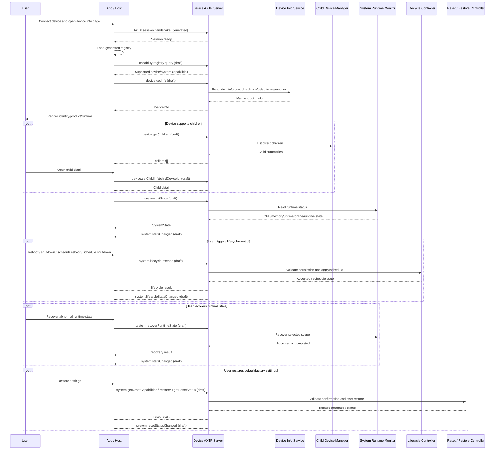

# Device Information And System Runtime State Protocol Interaction Flow

> Status: flow design
> Scope: Generic device identity, device information, child-device discovery, system runtime state monitoring/control, lifecycle control, runtime recovery, and reset/restore control
> Source inputs: `docs/workspace/business/device-system-info.md`, pasted reference text for generic `device.getInfo` schema, pasted reference text for child-device split APIs, `docs/workspace/protocol/device/**`, `docs/workspace/protocol/system/**`, `docs/workspace/protocol/capability/capability.registry.md`, `contract/generated/protocol.md`
> Protocol lifecycle: Stage 10 `plan-protocol-flow`

本文根据“设备信息管理需求大纲”和参考设计，梳理设备连接后读取基础信息、读取主设备和级联设备、读取/监听系统运行时状态，以及执行关机、重启、计划任务、运行时状态恢复和设备恢复默认/恢复出厂类控制的 AXTP 交互流程。

本文不是最终协议事实源；已采纳事实以 `contract/registry/**/*.yaml`、`contract/registry/domains/**/*.yaml`、`contract/protocol/axtp.protocol.yaml` 和 `contract/generated/**` 为准。当前 generated 协议只包含 AXTP Core、connection profiles、RPC/STREAM 基础事实、错误码和部分已采纳业务事实；本文涉及的 `device.*` / `system.*` / `capability.*` 仍以 `docs/workspace/protocol/**` 草案为评审输入。新增或修改协议必须转入 `docs/workspace/protocol/**` 草案和后续采纳流程。

Flow 文档负责：

- 描述设备信息、子设备、系统状态、生命周期和 reset/restore 的业务场景和交互步骤。
- 判断每一步协议覆盖状态。
- 识别协议缺口并路由到 candidate `domain.feature`。

Flow 文档不负责：

- 定义完整 method/event/schema/capability。
- 分配 methodId / eventId / errorCode / fieldId。
- 作为 runtime implementation contract。
- 替代 `docs/workspace/protocol/<domain>/<feature>.md`。

完整 method / event / schema / capability 定义必须进入 `docs/workspace/protocol/<domain>/<feature>.md`。

## 0. 速读结论

| 项目 | 内容 |
|---|---|
| Flow 目标 | 让 App / Host 连接设备后能识别“这是谁”、按需查看子设备、读取和监听系统运行态，并发起 lifecycle / runtime recovery / reset restore 控制。 |
| 当前协议覆盖 | partial |
| 涉及 domain.feature | `device.info`, `device.childDevice`, `capability.registry`, `system.state`, `system.lifecycle`, `system.reset`, `system.initialization` |
| 已有 adopted/generated | AXTP session/RPC envelope、connection profiles、core errors、generated registry；`device.*` / `system.*` 业务方法当前按草案处理。 |
| 缺口 | `device.info`、`device.childDevice`、`capability.registry`、`system.state`、`system.lifecycle`、`system.reset` 仍需进入 contract/registry/generated；legacy 字段映射和 reset scope / preserve 策略仍需确认。 |
| 是否需要新增协议草案 | no，核心草案已存在；后续需要继续 review / adopt / amend。 |
| 是否涉及 Legacy | yes |
| 是否涉及 STREAM | no |
| 下一步 | draft protocol / amend adopted protocol；草案 review 后进入 registry adoption 和 generated/conformance 同步。 |

## 1. Story Summary

| Item | Content |
|---|---|
| User goal | 用户或上位机连接设备后，快速获取当前 AXTP endpoint 代表的主设备身份和产品信息，按需发现级联/子设备，并持续查看 CPU、内存、在线、运行态等系统运行时状态。 |
| Trigger | App / PC host / cloud console 建立 AXTP session 后打开设备信息或系统状态页面。 |
| Success result | UI 可以区分“这是谁”与“现在状态怎样”；主设备信息轻量稳定；子设备和拓扑按需加载；运行时状态可轮询或事件同步；立即关机/重启、计划关机/重启、运行时状态恢复和设备恢复默认/恢复出厂都有明确权限、状态反馈和重连策略。 |
| Primary actors | User, App / PC host / cloud server, Device AXTP server, device info service, child-device manager, system runtime monitor, lifecycle controller |
| Product scope | 通用设备；覆盖 Windows Launcher、嵌入式设备、投屏接收端、数字标牌、Rooms 设备、主从/级联设备。 |

## 2. Source Observations

### 2.1 UI / Prototype

| Screen or control | Observed behavior | Protocol relevance |
|---|---|---|
| Device connection result | 连接完成后第一屏需要展示设备 ID、SN、产品、硬件、软件和 AXTP runtime。 | `device.getInfo` query；当前为 `device.info` 草案。 |
| Device identity card | 展示 `deviceId`、`serialNumber`、产品型号、展示名。 | `device.info` 应回答“我是谁”，并合并原 `device.identity`。 |
| Product / hardware / OS / software section | 同一接口要适配 Windows 盒子、嵌入式设备、Android 标牌、RTOS dongle 等多种设备。 | `device.getInfo` result 应分为 identity / product / hardware / os / software / runtime / capability summary。 |
| AXTP runtime section | 展示承载 AXTP 的 runtime、runtime 版本、host app。 | `runtime` 不等同于硬件型号；NearHub Launcher 应在 `software.components` 或 `runtime.hostAppId`。 |
| Capability summary | 页面展示建模摘要，完整能力走单独能力查询。 | `device.getInfo.capability` 是轻量摘要；完整 methods/events/permissions 走 `capability.registry` 草案。 |
| Child devices tab | 有主从或级联设备时，需要查看一级子设备、按需查看子设备详情、必要时查看完整树。 | `device.getInfo` 默认不返回 children；子设备归 `device.childDevice`。 |
| System status panel | 展示 CPU、内存、在线状态和运行态变化。 | 归 `system.state`；健康/告警/fault 由业务端根据 `system.stateChanged` 自行判定。 |
| Lifecycle controls | 用户触发关机、立即重启、计划重启、计划关机。 | 归 `system.lifecycle`；不保留独立 power-off / power schedule。 |
| Runtime state recovery | 用户触发“重置设备状态”以恢复 MCU、runtime service 或控制器异常状态。 | 归 `system.state` 的 `system.recoverRuntimeState`；不是恢复出厂或默认配置。 |
| Device restore | 用户触发设备恢复默认配置或恢复出厂设置。 | 归 `system.reset` 的 `system.restoreDefaultSettings` / `system.restoreFactorySettings`。 |
| State change monitor | 状态变化后 UI 自动刷新。 | 需要 `system.stateChanged`、`system.lifecycleStateChanged`、`system.resetStatusChanged`；事件不可用时轮询 get/status。 |
| UI prototype image | `[REVIEW-ASK]` 本轮未提供 UI 图；字段显示顺序、危险操作确认弹窗和权限提示需产品/UI 确认。 | 不新增协议，只影响 App 呈现。 |

### 2.2 Requirement Notes

- `device.getInfo` 应轻量、稳定、快速，默认只返回当前 AXTP endpoint 代表的主设备信息。
- `device.getInfo` 不应默认返回所有级联设备。级联设备数量、状态、权限、缓存策略与主设备信息不同，应拆到 children/topology 接口。
- `device.info` 本轮只保留只读 `device.getInfo`；设备名、资产标识等设置需求明确后再另起草写入协议，暂不定义信息变化通知事件。
- `product.model` 表示硬件或整机型号，不应填 `NearHub Launcher` 这类软件名。
- `software.components` 表示 Launcher、Signage、Cast Receiver 等软件组件；`runtime` 表示当前 AXTP runtime 和 host app。
- 运行时状态收敛到 `system`，并拆成 `system.state`、`system.lifecycle`、`system.reset`：`device` 专注身份、产品和拓扑。
- 健康、告警和 fault 不作为独立 `system.health` capability；设备只提供 `system.stateChanged` 状态变化事件，业务端接收后自行判定。
- 关机、立即重启、计划重启和计划关机属于 system lifecycle control；原“断开设备电源”场景与 shutdown 重复，不再建模为独立 power-off 方法。
- 重置设备状态用于从 MCU、runtime service 或控制器异常状态中恢复，归 `system.state` 的 `recoverRuntimeState` action。
- 恢复默认配置属于 `system.restoreDefaultSettings`，表示恢复到当前已安装版本的默认配置，不改变 Launcher 等软件版本。
- 恢复出厂设置属于 `system.restoreFactorySettings`，表示恢复到设备出厂基线，可能把 Launcher 等软件组件回退到出厂初始版本。

### 2.3 Device / System State Observations

| State | Meaning | Protocol relevance |
|---|---|---|
| connected / session ready | AXTP session 已建立，RPC 可用。 | precondition；使用 generated AXTP session/RPC。 |
| main device identified | 当前 endpoint 主设备身份、产品、软件和 runtime 已加载。 | query；`device.getInfo` draft。 |
| children available | 主设备代理或挂载了子设备。 | query / event；`device.getChildren`、`device.getChildInfo`、子设备变化事件 draft。 |
| system online | 系统处于可服务状态。 | query / event；`system.getState` 和 `system.stateChanged` draft。 |
| runtime abnormal | MCU、runtime service、controller 或 service 处于异常状态。 | precondition / action；`system.recoverRuntimeState` draft。 |
| rebooting / shutting_down | lifecycle 动作已接受，连接可能断开。 | event / reconnect fallback；`system.lifecycleStateChanged` draft。 |
| reboot_scheduled / shutdown_scheduled | 设备本地存在计划重启或计划关机任务。 | query / event；typed schedule get/set/cancel draft。 |
| restoring_default_settings | 正在恢复当前版本默认配置。 | status / event；`system.getResetStatus`、`system.resetStatusChanged` draft。 |
| restoring_factory_settings | 正在恢复出厂基线，可能清除数据或回退软件版本。 | status / event / reconnect fallback；`system.resetStatusChanged` draft。 |
| reconnect_required | lifecycle/reset/restore 导致连接断开或凭据变化。 | fallback；App 重新握手并读取 `device.getInfo`、`system.getState`、`system.getResetStatus`。 |

## 3. Assumptions And Non-Goals

| Type | Item | Status |
|---|---|---|
| Assumption | 一个 AXTP endpoint 默认代表一个主设备；子设备是该主设备代理、管理或挂载的对象。 | `[REVIEW-DRAFT]` |
| Assumption | `device.getInfo` 默认不返回 children；如支持 `includeChildren`，默认值必须是 `false`，且只返回 summary。 | `[REVIEW-DRAFT]` |
| Assumption | `device.getInfo` 保留 capability 建模摘要；完整 methods/events/permissions 查询由 `capability.registry` 承接。 | `[REVIEW-DRAFT]` |
| Assumption | `device.info` 与 `device.identity` 合并为一个 `device.info` 能力；本轮只承载只读设备信息。 | `[REVIEW-OK]` |
| Assumption | system 运行时状态拆成 `system.state`、`system.lifecycle`、`system.reset`，分别表达通用运行指标/状态变化、生命周期控制、恢复默认/恢复出厂。 | `[REVIEW-OK]` |
| Assumption | 不保留 `system.health`；健康状态、告警和故障等级由业务端基于 `system.stateChanged` 自行实现。 | `[REVIEW-OK]` |
| Assumption | “断开设备的电源”不再作为独立协议动作；软件关机/下电由 `system.shutdown` 覆盖，外部 PDU/继电器硬断电不属于本设备 AXTP 软件协议。 | `[REVIEW-OK]` |
| Assumption | 计划重启和计划关机分别使用 typed schedule get/set/cancel，不保留总括 lifecycle schedules 接口。 | `[REVIEW-OK]` |
| Assumption | 重置设备状态是运行时恢复动作，使用 `system.recoverRuntimeState`；不代表恢复默认配置、恢复出厂或首次初始化。 | `[REVIEW-DRAFT]` |
| Assumption | 重置设备为出厂设置状态是设备级 factory settings restore，使用 `system.restoreFactorySettings`；默认应保留硬件身份字段，具体清除范围需确认。 | `[REVIEW-DRAFT]` |
| Non-goal | 本 flow 不是最终协议事实源；协议细节进入 `docs/workspace/protocol/**` 草案，registry YAML、Protocol IR 和 generated 文件不在本阶段修改。 | `[REVIEW-OK]` |
| Non-goal | 不设计 network、storage、audio、firmware 等非 device/system 业务细节。 | `[REVIEW-OK]` |
| Non-goal | 不把调试方便的一次性大 payload 作为默认稳定接口。 | `[REVIEW-OK]` |

## 4. Protocol Coverage

| Need | Coverage state | AXTP protocol | Evidence | Next action |
|---|---|---|---|---|
| 建立设备管理会话 | generated | AXTP session, RPC, supported connection profiles | `contract/generated/protocol.md`, `contract/protocol/axtp.protocol.yaml` | 可按 AXTP Core 实现连接和 RPC envelope。 |
| 加载当前正式方法表 | generated | Generated registry | `contract/generated/protocol.md` | App/Host 使用当前 generated registry 做正式方法门禁；执行动作是本地 lookup。 |
| 运行时能力发现 | draft | `capability.registry` | `docs/workspace/protocol/capability/capability.registry.md` | 进入 Stage 20/30 review；明确 supported methods/events/capabilities 查询。 |
| 获取当前主设备信息 | draft | `device.info`; `device.getInfo` | `docs/workspace/protocol/device/device.info.md` | 草案已覆盖主设备只读信息；后续 adoption/generate/conformance。 |
| 查询一级子设备摘要 | draft | `device.childDevice`; `device.getChildren` | `docs/workspace/protocol/device/device.childDevice.md` | 草案已覆盖；确认分页、深度、权限和 child id 稳定性。 |
| 查询指定子设备详情 | draft | `device.childDevice`; `device.getChildInfo` | `docs/workspace/protocol/device/device.childDevice.md` | 草案已覆盖；补 legacy 字段映射。 |
| 查询完整设备拓扑 | missing | Candidate `device.getTopology` | current flow, child-device references | P1/P2 决定是否起草；不作为 P0 代替 `getChildren`。 |
| 子设备状态变化通知 | draft | child device changed event candidate | `docs/workspace/protocol/device/device.childDevice.md` | 确认事件命名和 payload 是 online/attached 还是完整拓扑变化。 |
| 获取 CPU、内存、在线、uptime 等通用运行状态 | draft | `system.state`; `system.getState` | `docs/workspace/protocol/system/system.state.md` | 草案已覆盖；确认 P0 sections 和采样/节流策略。 |
| 重置设备运行状态以恢复异常 | draft | `system.state`; `system.recoverRuntimeState` | `docs/workspace/protocol/system/system.state.md` | 草案已覆盖；确认 scope / componentId / 权限。 |
| 监听运行时状态变化 | draft | `system.stateChanged` | `docs/workspace/protocol/system/system.state.md` | 草案已覆盖；业务端自行计算健康/告警/fault。 |
| 关机、立即重启、计划重启和计划关机控制 | draft | `system.lifecycle` | `docs/workspace/protocol/system/system.lifecycle.md` | 草案已覆盖 typed action/schedule；确认冲突、取消、周期性策略。 |
| 设备恢复默认配置或出厂设置 | draft | `system.reset` | `docs/workspace/protocol/system/system.reset.md` | 草案已覆盖；确认 preserve/scope、factory baseline、软件版本回退范围。 |
| 首次初始化/初始化向导 | draft | `system.initialization` | `docs/workspace/protocol/system/system.initialization.md` | 不混入 factory settings restore；初始化向导另走 `system.initialization`。 |
| 系统时间 | draft | `system.time` | `docs/workspace/protocol/system/system.time.md` | 本 flow 不展开；时间配置另走专门 flow/draft。 |

Coverage 取值：

| Coverage | Meaning |
|---|---|
| generated | 已进入 `contract/generated/**` 或 protocol IR，可作为实现合同视图。 |
| adopted | 已写入 registry YAML，但当前 flow 未直接引用 generated 输出。 |
| draft | 已有 `docs/workspace/protocol/**` 草案，但尚未 adopted/generated。 |
| missing | 没有合适的 adopted/generated/draft 协议覆盖。 |
| local-only | App/UI/runtime 本地逻辑，不需要 AXTP 协议。 |
| non-protocol | 产品规则、人工流程、运营策略或文档说明，不进入协议。 |

## 5. End-To-End Sequence



## 6. Interaction Steps

| Step | Actor | Action | Capability / precondition | Protocol call/event | Payload fields | Result / state change | Coverage | Error / fallback |
|---:|---|---|---|---|---|---|---|---|
| 1 | App / Device | 建立 AXTP session。 | Transport profile 和 RPC 支持。 | AXTP session/RPC handshake | session fields | RPC 可用。 | generated | 握手失败显示连接错误。 |
| 2 | App | 加载正式方法表并做门禁。 | generated registry 可用。 | local generated registry lookup | method/event/capability names | App 知道哪些是正式 generated，哪些仍是 draft。 | generated | draft-only 方法不得作为稳定实现合同；lookup 本身是本地行为。 |
| 3 | App / Device | 查询运行时能力。 | device 支持 capability registry 草案或产品 profile。 | `capability.registry` query | domains, features, methods, events | App 确认 device/system capabilities。 | draft | 能力查询未采纳前，用产品 profile / 固件版本门禁。 |
| 4 | App / Device | 读取主设备信息。 | `device.info` supported。 | `device.getInfo` | includeCapabilitySummary, sections | 返回 identity/product/hardware/os/software/runtime/capability summary。 | draft | 读取失败时页面显示无法识别设备；不把软件名写入 `product.model`。 |
| 5 | App | 渲染设备信息。 | `device.getInfo` result。 | local-only | display fields | 用户看到“这是谁”。 | local-only | 本地展示策略不进入协议。 |
| 6 | App / Device | 查询子设备摘要。 | `device.childDevice` supported。 | `device.getChildren` | parent id, depth/summary selector | 返回直接 children summary。 | draft | 不支持子设备时隐藏 tab；子设备多时分页或过滤。 |
| 7 | App / Device | 查询子设备详情。 | child id 已知。 | `device.getChildInfo` | `childDeviceId` | 返回单个子设备详情、connection、state/capability summary。 | draft | `NOT_FOUND` 时刷新 children；权限不足提示。 |
| 8 | App / Device | 查询完整拓扑。 | topology capability supported。 | candidate `device.getTopology` | root, maxDepth | 返回树状拓扑。 | missing | P0 回退到 `device.getChildren` / `device.getChildInfo`。 |
| 9 | App / Device | 查询通用系统运行状态。 | `system.state` supported。 | `system.getState` | sections, includeRecoveryCapabilities | UI 展示 CPU、内存、uptime、online、runtime 状态。 | draft | 旧 `device.state` 方向迁移到 `system.state`。 |
| 10 | Device / App | 同步系统状态变化。 | event supported or polling fallback。 | `system.stateChanged` | changedFields, state, reason | UI 局部刷新；业务端自行判定健康/告警/fault。 | draft | 事件丢失时调用 `system.getState` 校准。 |
| 11 | User / App / Device | 执行立即重启。 | `system.lifecycle` supported；权限和确认满足。 | `system.reboot` | reason, delay, force, confirmation token | 设备进入 rebooting，可能断连。 | draft | `PERMISSION_DENIED`、`BUSY`、`INVALID_STATE`。 |
| 12 | App / Device | 查询当前计划重启。 | schedule capability supported。 | `system.getRebootSchedule` | selector/version | 返回 reboot schedule list、nextRunAt、version。 | draft | 不支持时隐藏相关 UI；读取失败时禁止覆盖未知计划。 |
| 13 | User / App / Device | 创建或更新计划重启。 | schedule capability supported；时间合法。 | `system.setRebootSchedule` | schedule, timezone, reason, expectedVersion, confirmation token | 保存计划并返回 scheduleId / nextRunAt / version。 | draft | 时间无效或版本冲突时返回 typed error。 |
| 14 | User / App / Device | 取消计划重启。 | schedule exists。 | `system.cancelRebootSchedule` | scheduleId, reason, expectedVersion | 取消计划并返回新版本。 | draft | 找不到计划返回 `NOT_FOUND`；版本冲突需重新读取。 |
| 15 | App / Device | 查询当前计划关机。 | shutdown schedule supported。 | `system.getShutdownSchedule` | selector/version | 返回 shutdown schedule list、nextRunAt、version。 | draft | 不支持时隐藏相关 UI。 |
| 16 | User / App / Device | 创建或更新计划关机。 | shutdown schedule supported；时间合法。 | `system.setShutdownSchedule` | schedule, timezone, reason, expectedVersion, confirmation token | 保存 planned graceful shutdown 计划。 | draft | 与已有 lifecycle 计划冲突时返回 `BUSY` 或冲突错误。 |
| 17 | User / App / Device | 取消计划关机。 | schedule exists。 | `system.cancelShutdownSchedule` | scheduleId, reason, expectedVersion | 取消计划并返回新版本。 | draft | 找不到计划返回 `NOT_FOUND`。 |
| 18 | User / App / Device | 执行关机。 | 权限和确认满足。 | `system.shutdown` | reason, delay, force/confirmation | 设备进入 shutting_down，连接可能断开。 | draft | 权限不足或 busy 时返回 typed error。 |
| 19 | User / App / Device | 恢复设备运行时异常状态。 | `system.state` recovery supported。 | `system.recoverRuntimeState` | scope, componentId, reason, force, confirmationToken | 设备接受或完成 runtime/MCU/controller/service 恢复。 | draft | 不支持 scope 返回 `NOT_SUPPORTED`；busy/权限错误按 typed error。 |
| 20 | User / App / Device | 恢复默认配置。 | `system.reset` supported；危险操作确认满足。 | `system.restoreDefaultSettings` | scopes, preserve, reason, rebootAfterRestore, confirmationToken | 恢复当前版本默认配置，不改变软件版本。 | draft | scope 不支持、确认缺失、系统忙时返回 typed error。 |
| 21 | User / App / Device | 恢复出厂设置。 | `system.reset` supported；用户确认风险。 | `system.restoreFactorySettings` | scopes, preserve, reason, rebootAfterRestore, confirmationToken | 恢复出厂基线，可能清除数据、断连或回退软件版本。 | draft | 需要 `system.getResetCapabilities` 和 `system.getResetStatus` 做前后状态校准。 |
| 22 | App / Device | 设备重连后刷新状态。 | reconnect completed。 | `device.getInfo`, `system.getState`, `system.getResetStatus` | selectors/status id | 确认设备 ready 或 restore completed。 | draft | 超时提示人工检查；凭据变化时进入重新配网/绑定流程。 |

## 7. State Changes And Events

| State change | Trigger | Event needed | Payload | Client handling | Coverage |
|---|---|---|---|---|---|
| 主设备信息被重新读取 | session ready / reconnect / user refresh | no event for current `device.info` | none | 调用 `device.getInfo` 刷新。 | draft |
| 子设备 attached/detached/online changed | USB/网络/级联关系变化 | child device changed event candidate | child id, relation, online, changedFields | 刷新列表或调用 `device.getChildInfo`。 | draft |
| system runtime state changed | CPU/内存/online/runtime/recovery 状态变化 | `system.stateChanged` | changedFields, state, reason | 局部更新 UI；需要完整状态时调用 `system.getState`。 | draft |
| reboot scheduled / shutdown scheduled | schedule set/cancel 成功或设备策略改变 | `system.lifecycleStateChanged` | lifecycle state, schedule summary, reason | 更新计划任务 UI；版本冲突时重新 get schedule。 | draft |
| rebooting / shutting_down | `system.reboot` / `system.shutdown` 被接受 | `system.lifecycleStateChanged` | actionId, lifecycleState, disconnectExpected | 显示过渡状态并进入重连等待。 | draft |
| runtime recovery requested/completed | `system.recoverRuntimeState` 被接受或完成 | `system.stateChanged` | recovery scope, state, reason | 刷新状态；业务端自行判断异常是否解除。 | draft |
| restore default/factory accepted/progress/completed | `system.restoreDefaultSettings` / `system.restoreFactorySettings` | `system.resetStatusChanged` | actionId, status, baseline, progress, disconnectExpected | 展示危险操作进度；断连后重连并调用 `system.getResetStatus`。 | draft |
| health/warning/fault display changed | App 根据 state/event 自行判定 | no protocol event | none | 业务端本地计算；不要求 `system.health`。 | local-only |

## 8. Protocol Details

### 8.1 Adopted / Generated Protocols

| Method/Event/Profile | Purpose in this flow | Source |
|---|---|---|
| AXTP session / RPC envelope | 建立连接、承载请求响应和事件。 | `contract/generated/protocol.md`, `contract/protocol/axtp.protocol.yaml` |
| Supported connection profiles | 支持 USB HID、TCP 和 WebSocket JSON 等接入方式。 | `contract/generated/protocol.md` |
| Core RPC errors | unsupported、invalid argument、permission denied、busy 等错误基础。 | `contract/generated/protocol.md`, `contract/registry/error/error_code.yaml` |
| Generated method registry | App/Host 用于判断当前产品包中哪些方法已正式采纳。 | `contract/generated/protocol.md` |

当前 generated 协议没有可直接作为本 flow 业务实现合同的 `device.*`、`system.*` 或 `capability.*` 方法。下面的方法名都是 flow 级草案依赖，不是 generated implementation contract。

### 8.2 Draft Or Missing Protocol Gaps

| Gap | Candidate domain.feature | Candidate method/event/schema | Routed skill | Review question |
|---|---|---|---|---|
| `device.info` 仍未 generated | `device.info` | `device.getInfo`, `DeviceInfo(identity/product/hardware/os/software/runtime/capability)` | `draft-business-protocol` / adoption | `[REVIEW-OK]` `device.info` 合并 `device.identity`，并保持只读。 |
| 设备显示名/资产标识设置暂不进入本轮 | future setting protocol | no current set method or changed event under `device.info` | `draft-business-protocol` if needed | `[REVIEW-OK]` 有具体设置需求后另起草。 |
| 子设备 P0/P1 边界需确认 | `device.childDevice` | `device.getChildren`, `device.getChildInfo`, optional `device.getTopology` | `draft-business-protocol` / adoption | `[REVIEW-ASK]` P0 是否只支持一级 children？最大深度和分页策略？ |
| 子设备事件命名和 payload 未固化 | `device.childDevice` | child device changed event candidate | `draft-business-protocol` | `[REVIEW-ASK]` 事件是在线/离线变化，还是完整拓扑变化？ |
| 完整 capability query 未 generated | `capability.registry` | supported methods/events/capabilities query | `draft-business-protocol` / adoption | `[REVIEW-ASK]` 动态能力查询是否 P0 必需，还是 generated registry + product profile 足够？ |
| `system.state` P0 字段和采样策略需确认 | `system.state` | `system.getState`, `system.stateChanged`, `system.recoverRuntimeState` | `draft-business-protocol` / adoption | `[REVIEW-ASK]` CPU、内存、online、uptime、load、runtime/recovery 哪些是 P0？ |
| `system.lifecycle` schedule 策略需确认 | `system.lifecycle` | reboot/shutdown action and typed schedule methods/events | `draft-business-protocol` / adoption | `[REVIEW-ASK]` 一次性/周期性计划、多个计划并存、取消和覆盖策略如何定义？ |
| `system.reset` preserve/scope/baseline 需确认 | `system.reset` | capabilities/status/restoreDefault/restoreFactory/statusChanged | `draft-business-protocol` / adoption | `[REVIEW-ASK]` factory restore 会清除哪些数据，哪些软件组件可回退？ |
| `system.health` 不进入协议 | `system.state` event only | `system.stateChanged` | no action | `[REVIEW-OK]` 设备只上报状态变化，业务端自行判定健康/告警。 |
| power-off 与 shutdown 重复 | `system.lifecycle` | `system.shutdown` | no new protocol | `[REVIEW-OK]` 不新增独立 power-off/power-schedule。 |

### 8.3 Recommended Payload Boundaries

这些 payload 只表达 flow 级边界，不替代 `docs/workspace/protocol/**` 中的完整 schema。

`device.getInfo` answers "who am I":

```json
{
  "identity": {
    "deviceId": "dev_001",
    "serialNumber": "NH-2026-000001",
    "vendorId": "nearhub",
    "productId": "nh-win-box-a1"
  },
  "product": {
    "brand": "NearHub",
    "productType": "windowsDevice",
    "model": "NH-WIN-BOX-A1",
    "displayName": "NearHub Display Controller"
  },
  "hardware": {
    "revision": "A1",
    "cpuArch": "x86_64",
    "memoryBytes": 8589934592
  },
  "os": {
    "type": "windows",
    "name": "Windows 11 IoT Enterprise",
    "version": "10.0.22631",
    "arch": "x86_64"
  },
  "software": {
    "components": [
      {
        "id": "launcher",
        "name": "NearHub Launcher",
        "version": "1.2.3",
        "role": "axtpHost"
      }
    ]
  },
  "runtime": {
    "axtpRuntime": "axtp-ts-runtime",
    "axtpRuntimeVersion": "0.1.0",
    "hostAppId": "launcher"
  },
  "capability": {
    "profile": "windows-managed-device",
    "domains": ["device", "system"],
    "features": [
      "device.info",
      "device.childDevice",
      "system.state",
      "system.lifecycle",
      "system.reset"
    ]
  }
}
```

Rules:

- `product.model` is a hardware or whole-product model; do not put `NearHub Launcher` there.
- `software.components[]` carries Launcher, Signage, Cast Receiver and similar software facts.
- `runtime` carries the AXTP runtime and host app facts.
- `capability` is a modeling summary only; complete supported methods, events, permissions, and dynamic availability belong to a dedicated capability query.
- `device.getInfo` default payload excludes children.

`device.getChildren` answers "who is below me":

```json
{
  "children": [
    {
      "deviceId": "dev_camera_001",
      "parentDeviceId": "dev_launcher_001",
      "relation": "attached",
      "path": "dev_launcher_001/dev_camera_001",
      "online": true,
      "product": {
        "productType": "cameraDevice",
        "model": "CAM-A1",
        "displayName": "Front Camera"
      },
      "connection": {
        "type": "usb",
        "port": "usb-1"
      }
    }
  ]
}
```

`system.getState` answers general runtime status:

```json
{
  "uptimeSeconds": 3600,
  "online": true,
  "runtimeRecoverySupported": true,
  "recoverableScopes": ["runtime", "mcu", "controller"],
  "cpu": {
    "usagePercent": 42.5
  },
  "memory": {
    "usedBytes": 2147483648,
    "totalBytes": 8589934592
  }
}
```

`system.recoverRuntimeState` answers "recover this runtime state":

```json
{
  "scope": "mcu",
  "componentId": "main-controller",
  "reason": "recover_from_abnormal_state",
  "confirmationToken": "TOKEN-REDACTED"
}
```

`system.restoreDefaultSettings` restores current-version default configuration without changing software versions:

```json
{
  "scopes": ["settings"],
  "preserve": ["identity", "network"],
  "reason": "restore_defaults",
  "rebootAfterRestore": false,
  "confirmationToken": "TOKEN-REDACTED"
}
```

`system.restoreFactorySettings` restores the factory baseline and may roll software components such as Launcher back to their initial factory versions:

```json
{
  "scopes": ["settings", "user_data", "software"],
  "preserve": ["identity"],
  "reason": "device_reassignment",
  "rebootAfterRestore": true,
  "confirmationToken": "TOKEN-REDACTED"
}
```

## 9. Test / Conformance Notes

| Case | Given | When | Then | Protocol evidence |
|---|---|---|---|---|
| happy path: main device info | AXTP session ready and `device.info` supported | App calls `device.getInfo` | Result returns current endpoint main device only, with identity/product/hardware/os/software/runtime/capability summary. | `device.getInfo`, `device.info` |
| happy path: child list | Device has direct children and `device.childDevice` supported | App calls `device.getChildren` | Result returns direct children summary; child details are not embedded by default in `device.getInfo`. | `device.getChildren`, `device.childDevice` |
| happy path: child detail | Child id is selected from list | App calls `device.getChildInfo` | Result returns selected child detail; missing child returns typed error. | `device.getChildInfo` |
| happy path: system state read | `system.state` supported | App calls `system.getState` | Result returns CPU/memory/uptime/online/runtime summary; business code may compute health locally. | `system.getState` |
| event path: system state | System runtime state changes | Device emits `system.stateChanged` | App updates UI or calls `system.getState` to calibrate. | `system.stateChanged` |
| happy path: reboot | Permission and confirmation are valid | App calls `system.reboot` | Device accepts action, enters rebooting, App waits for disconnect/reconnect. | `system.reboot`, `system.lifecycleStateChanged` |
| happy path: reboot schedule | Existing schedules are readable | App calls get/set/cancel reboot schedule methods | Device stores, reports, or cancels typed reboot schedule with version/nextRunAt. | `system.getRebootSchedule`, `system.setRebootSchedule`, `system.cancelRebootSchedule` |
| happy path: shutdown schedule | Existing schedules are readable | App calls get/set/cancel shutdown schedule methods | Device stores, reports, or cancels planned graceful shutdown schedule. | `system.getShutdownSchedule`, `system.setShutdownSchedule`, `system.cancelShutdownSchedule` |
| happy path: runtime recovery | Runtime/MCU/controller scope is supported | App calls `system.recoverRuntimeState` | Device accepts or completes recovery and emits/refetches system state. | `system.recoverRuntimeState`, `system.stateChanged` |
| happy path: default restore | Reset capability says default restore is supported | App calls `system.restoreDefaultSettings` with confirmation | Current-version defaults are restored; software versions do not change. | `system.getResetCapabilities`, `system.restoreDefaultSettings`, `system.getResetStatus` |
| happy path: factory restore | Reset capability says factory restore is supported | App calls `system.restoreFactorySettings` with confirmation | Device starts factory baseline restore; disconnect/reboot expected; App refetches reset status after reconnect. | `system.restoreFactorySettings`, `system.resetStatusChanged` |
| unsupported | Device does not support a draft capability/method | App attempts gated action | UI hides or disables action; protocol should return `NOT_SUPPORTED` if called. | capability query / draft method |
| event path: reset status | Restore progress changes | Device emits `system.resetStatusChanged` | App updates progress; after reconnect calls `system.getResetStatus`. | `system.resetStatusChanged`, `system.getResetStatus` |
| compatibility | Legacy command maps to new domain.feature | Adapter translates old command | AXTP model remains `device.info`, `device.childDevice`, `system.state`, `system.lifecycle`, or `system.reset`; legacy names do not pollute formal naming. | legacy mapping notes in protocol drafts |

## 10. Acceptance Gates

- `device.getInfo` is lightweight and default-main-device-only.
- `device.info` and `device.identity` are merged; device info schema separates identity/product/hardware/os/software/runtime/capability summary and remains read-only in this flow.
- No device info config write method or device info changed event is retained in this flow.
- Child devices and topology are queried through separate methods and have capability gates.
- Runtime state is not mixed into device identity/product information.
- Runtime state is split into `system.state`, `system.lifecycle`, and `system.reset` before adoption.
- Runtime state recovery is explicitly modeled as `system.recoverRuntimeState`, not as factory settings restore or default configuration restore.
- Device default settings restore is explicitly modeled as `system.restoreDefaultSettings`; it restores current-version default configuration without changing software versions.
- Device factory settings restore is explicitly modeled as `system.restoreFactorySettings`; it restores the factory baseline and may roll software components such as Launcher back to their initial factory versions.
- No independent power-off, power-state, power-schedule, health, warning, or fault capability candidate is retained in this flow.
- Lifecycle controls have explicit permissions, confirmation strategy, typed schedule semantics, transition state and reconnect behavior.
- Reset controls have explicit capability query, confirmation strategy, preserve/scope semantics, reset status/progress and reconnect behavior.
- All `draft` / `missing` gaps have Stage 20/30 follow-up before contract/registry/YAML/generated work.

## 11. Open Questions

| Question | Impact | Owner | Status | Next action |
|---|---|---|---|---|
| `device.getInfo` 是否允许 `includeChildren=true`？如果允许，是否只返回 summary 且默认 false？ | protocol / UI | Product + protocol | REVIEW-ASK | 在 `device.info` 和 `device.childDevice` review 中确认。 |
| legacy `SetDeviceName` 后续是继续留在旧 adapter，还是另起草设备名设置协议？ | protocol / legacy | Product + migration | REVIEW-ASK | 有明确设置需求后起草独立 writable info/asset feature。 |
| 子设备 ID 的稳定性规则是什么？`deviceId`、`localId`、`serialNumber` 和 topology `path` 如何组合？ | protocol / firmware | Device firmware + protocol | REVIEW-ASK | 在 `device.childDevice` 草案中补稳定性规则。 |
| `device.getTopology` 是否进入 P1/P2，还是本轮只采纳 `getChildren` / `getChildInfo`？ | product / protocol | Product | REVIEW-ASK | 决定 P0/P1 范围。 |
| `system.state` 首批字段有哪些？CPU、内存、在线、uptime、load 是否都是 P0？ | protocol / conformance | Product + runtime | REVIEW-ASK | 确认 P0 sections 和 conformance cases。 |
| legacy 中原归 `device.power` / AutoPower 的字段是否另行定域为 telemetry/sensor/external power control，还是仅作为 adapter 私有能力处理？ | legacy / protocol | Migration + protocol | REVIEW-ASK | 在 legacy mapping 审核中分类。 |
| reboot schedule 和 shutdown schedule 是否各自支持多个计划并存、周期性计划、覆盖已有计划和取消计划？ | product / firmware / conformance | Product + firmware | REVIEW-ASK | 在 `system.lifecycle` review 中定 schedule 模型。 |
| `system.recoverRuntimeState` 的 scope 首批有哪些？是否支持 `mcu`、`runtime`、`controller`、`service` 和 `componentId`？ | protocol / firmware | Runtime + firmware | REVIEW-ASK | 定义 P0 scope 和错误行为。 |
| `system.restoreFactorySettings` 会清除哪些配置/数据？`deviceId`、SN、license、绑定关系和网络配置是否保留？ | product / firmware / security | Product + firmware + security | REVIEW-ASK | 在 `system.reset` capability 中声明 preserve/scope 策略。 |
| factory baseline 如何定义？Launcher、runtime、业务应用和固件中哪些组件会回退到出厂初始版本？ | product / firmware / legacy | Product + firmware | REVIEW-ASK | 定义 factoryRestorableComponents 和版本回退策略。 |
| factory settings restore 后是否必须重启，是否会清除 AXTP 连接凭据并触发重新配网/绑定？ | firmware / UI / conformance | Firmware + App | REVIEW-ASK | 补 reset status、disconnectExpected、reconnect flow 测试。 |
