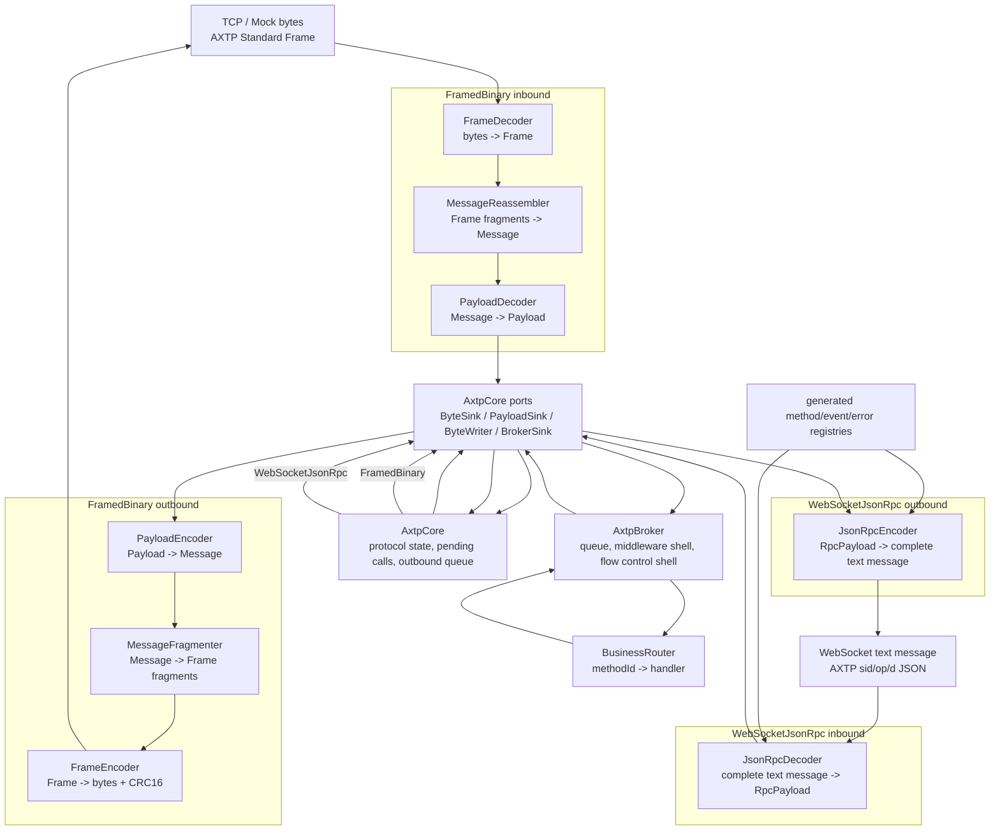
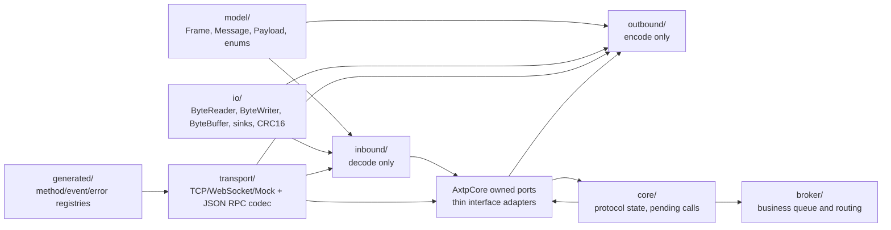

# AXTP C++ Core Architecture

This runtime implements the AXTP v1 core protocol only. It supports two first-class AXTP wire modes:

1. `FramedBinary`
2. `WebSocketJsonRpc`

Legacy protocol compatibility is not part of `runtimes/cpp-core`. Optional legacy adapters may live outside this runtime and depend on cpp-core's normalized payload interfaces.

## Phase Rollback Points

| Phase | Tag | Main addition |
|---:|---|---|
| 1 | `axtp-cpp-runtime-phase-01` | Model objects and byte IO |
| 2 | `axtp-cpp-runtime-phase-02` | Inbound bytes-to-payload pipeline |
| 3 | `axtp-cpp-runtime-phase-03` | Outbound payload-to-bytes pipeline |
| 4 | `axtp-cpp-runtime-phase-04` | Core state and outbound queue |
| 5 | `axtp-cpp-runtime-phase-05` | Transport abstraction and mock transport |
| 6 | `axtp-cpp-runtime-phase-06` | TCP and WebSocket transports |
| 7 | `axtp-cpp-runtime-phase-07` | Broker and business routing |
| 8 | `axtp-cpp-runtime-phase-08` | WebSocketJsonRpc codec and wire-mode split |

## Runtime Flow

## Ownership Boundaries

## Current Test Map

| Test | Covers |
|---|---|
| `phase1_model_io_test` | Little-endian IO, buffer operations, model includes |
| `phase2_inbound_test` | Half frames, sticky frames, fragment reassembly, magic resync, RPC decode |
| `phase3_outbound_test` | Payload encode, fragmentation, frame encode, inbound round trip |
| `phase4_core_test` | Core handlers, control responses, pending response matching |
| `phase5_transport_test` | `ITransport`, `MockTransport`, `attachTransport`, `flushOutbound` |
| `phase6_real_transport_test` | TCP framed path and WebSocketJsonRpc text path |
| `phase7_broker_test` | Core-to-Broker task submission and Broker response callback |

## Key Invariants

- `runtimes/cpp-core` implements AXTP v1 only: `FramedBinary` and `WebSocketJsonRpc`.
- `FramedBinary` uses Standard Frame, Payload, CONTROL, RPC, and STREAM.
- `WebSocketJsonRpc` is a first-class AXTP RPC-only profile for WebSocket text access.
- `WebSocketJsonRpc` uses the spec-defined `sid/op/d` envelope from `docs/specs/05-AXTP-RPC-Session-Spec.md`.
- In `WebSocketJsonRpc` mode, `IByteSink::onBytes()` must receive one complete WebSocket text message, not arbitrary stream chunks.
- `WebSocketJsonRpc` does not use `FrameDecoder`, `MessageReassembler`, `PayloadDecoder`, `FrameEncoder`, CONTROL, or STREAM.
- `AxtpCore` only handles normalized `ControlPayload`, `RpcPayload`, and `StreamPayload`; it does not parse JSON, WebSocket frames, or legacy commands.
- `AxtpBroker` does not know the transport or text envelope; it routes by method/event ids and normalized body bytes.
- Legacy adapters must depend on cpp-core. cpp-core must not depend on legacy adapters.

## Spec Notes

- The highest-priority WebSocketJsonRpc specs are `docs/specs/03-AXTP-Transport-Profiles.md` and `docs/specs/05-AXTP-RPC-Session-Spec.md`.
- There is no separate dedicated WebSocket JSON-RPC profile spec file yet. If that is added later, this runtime should treat it as the most specific source of truth.
