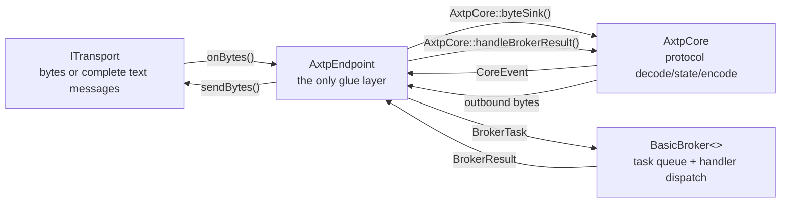

# AXTP C++ Runtime Architecture

The C++ runtime is organized around one narrow glue layer:

```text
ITransport <-> AxtpEndpoint -> AxtpCore -> BasicBroker
```

`AxtpEndpoint` is the only layer that knows both sides of the runtime. `AxtpCore` is protocol-only, and `BasicBroker` is business-dispatch-only.

## Targets

| Target | Shape | Responsibility |
|---|---|---|
| `axtp_core` | `INTERFACE` | model, IO interfaces, transport profile, FramedBinary pipeline, WebSocketJsonRpc decoder/encoder, `AxtpCore`, generated lookup helpers |
| `axtp_broker` | `INTERFACE` | `BasicBroker<>`, `BrokerTask`, `BrokerResult`, dynamic method dispatch helpers |
| `axtp_runtime` | `INTERFACE` | core + broker + endpoint glue for normal application use |
| `axtp_json_rpc` | `INTERFACE` | WebSocket session helper adapter and JSON registry-file loader |
| `axtp_transport_hidapi` | `STATIC` optional | HID report-level transport in `runtimes/cpp-transports`, backed by `runtimes/thirdparty/hidapi` |
| `axtp_transport_tcp_boost` | `INTERFACE` optional | Boost.Asio TCP transport in `runtimes/cpp-transports` |
| `axtp_transport_websocket_boost` | `INTERFACE` optional | Boost.Beast WebSocket transport in `runtimes/cpp-transports` |

The recommended runtime include is:

```cpp
#include <axtp/axtp.hpp>
```

Concrete transports are not included by the aggregate header.

## Development Documents

| Document | Purpose |
|---|---|
| `docs/dev/AXTP_CORE_API_DESIGN.md` | Core API contract and public header groups |
| `docs/dev/AXTP_CPP_RUNTIME_PATTERNS.md` | Runtime design patterns and extension recipes |
| `docs/dev/AXTP_CPP_EXECUTION_FLOW.md` | End-to-end data flow for runtime, SDK, CLI, and transports |
| `docs/dev/AXTP_CPP_STYLE.md` | Naming, file layout, include, formatting, and ownership rules |
| `docs/dev/AXTP_SDK_API_DESIGN.md` | SDK API shape and dynamic RPC policy |
| `docs/dev/AXTPCTL_COMMAND_DESIGN.md` | CLI command shape and dispatch policy |

## Runtime Flow



`AxtpCore` never owns or includes concrete transports and does not own a broker. `BasicBroker<>` never calls back into core. `AxtpEndpoint` drains `CoreEvent`, polls the broker, feeds `BrokerResult` back into core, and flushes outbound bytes to the attached transport.

## Wire Paths

```mermaid
flowchart TB
    subgraph Core["axtp_core"]
        FBIn["FramedBinary inbound<br/>FrameDecoder -> MessageReassembler -> PayloadDecoder"]
        FBOut["FramedBinary outbound<br/>PayloadEncoder -> MessageFragmenter -> FrameEncoder"]
        JIn["WebSocketJsonRpc inbound<br/>JsonRpcDecoder"]
        JOut["WebSocketJsonRpc outbound<br/>JsonRpcEncoder"]
        Core["AxtpCore<br/>ControlPayload / RpcPayload / StreamPayload"]
    end

    FBIn --> Core --> FBOut
    JIn --> Core --> JOut
```

- `FramedBinary` carries AXTP Standard Frames.
- `WebSocketJsonRpc` is a formal AXTP wire mode using complete UTF-8 text messages with the `sid/op/d` envelope.
- JSON-RPC decoder/encoder are in core because the runtime supports this wire mode directly; Boost.JSON is therefore an allowed `axtp_core` dependency.
- `WebSocketJsonRpcAdapter` remains a thin optional session/transport helper. It does not own `AxtpCore` or `BasicBroker`.

## Transport Boundary

- `ITransport` implementations only move bytes/messages and expose `TransportProfile`.
- `HidTransport` handles report id, report size, padding, read/write, and manual `poll()`. It does not parse frames, payloads, method ids, or legacy commands.
- TCP/WebSocket/HID concrete transports live in `runtimes/cpp-transports`.
- hidapi is vendored under `runtimes/thirdparty/hidapi` and is only linked by `axtp_transport_hidapi`.
- `axtp_core` public headers must not include hidapi, Boost.Asio, Boost.Beast, socket APIs, thread APIs, or concrete transport headers.

## Public Header Rules

- New protocol pipeline headers live under `axtp/core/inbound/*.hpp` and `axtp/core/outbound/*.hpp`.
- Old `axtp/inbound/*`, `axtp/outbound/*`, `AxtpBroker`, `AxtpInboundProcessor`, and `AxtpOutboundProcessor` compatibility names are intentionally not preserved.
- `BasicBroker<> + AxtpEndpoint + ITransport` is the recommended application runtime shape.
- Advanced users may use `AxtpCore` directly through `configure()`, `byteSink()`, `pollEvent()`, `handleBrokerResult()`, and `tryPopOutboundBytes()`.
- Legacy/AXDP adapters are outside cpp-core/runtime. They may depend on this runtime later; this runtime must not depend on them.

## C++ Code Style

AXTP C++ uses a Skia-like library discipline configured by the repository `.clang-format`: 4 spaces, 100 columns, attached braces, and no tabs. The core and generated traits are header-only, `BasicBroker<>` is header-only, and transport implementations are optional platform adapters.

All C++ symbols live in `namespace axtp` or a child namespace. The main protocol-stack entry is `axtp::AxtpCore`, and the lightweight broker is `axtp::BasicBroker<>`.

Internal pipeline components and protocol model types do not use redundant `Axtp` prefixes:

```cpp
axtp::InboundProcessor;
axtp::OutboundProcessor;
axtp::FrameDecoder;
axtp::Frame;
axtp::Message;
axtp::RpcPayload;
```

Private/protected data members use `_member` style, for example `_inbound`, `_transport`, and `_pendingCalls`. This is allowed only for class/struct data members where the character after `_` is lowercase. Do not use `__name`, `_Name`, `_AXTP_` macros, or namespace/global `_name` identifiers.

C++ file names use lower_snake_case and new public headers use `.hpp`, for example `axtp_core.hpp`, `frame_decoder.hpp`, and `basic_broker.hpp`. Run `scripts/format-cpp.sh` or `scripts/check-format-cpp.sh` before committing C++ changes when a usable `clang-format` is available.

## Current Test Map

| Test | Covers |
|---|---|
| `phase1_model_io_test` | model and IO primitives |
| `phase2_inbound_test` | FramedBinary and WebSocketJsonRpc inbound decode |
| `phase3_outbound_test` | FramedBinary and WebSocketJsonRpc outbound encode |
| `phase4_core_test` | standalone core events, control handling, broker-result handling |
| `phase5_transport_test` | `AxtpEndpoint` with `MockTransport` |
| `phase6_real_transport_test` | optional TCP and WebSocketJsonRpc transport flows |
| `phase7_broker_test` | `BasicBroker<>` dynamic Raw/JSON/TLV dispatch |
| `phase8_api_surface_test` | `<axtp/axtp.hpp>`, packet/text IO, dynamic registry |
| `phase9_hid_transport_test` | optional HID report slicing, report-id filtering, ManualPoll callbacks |
