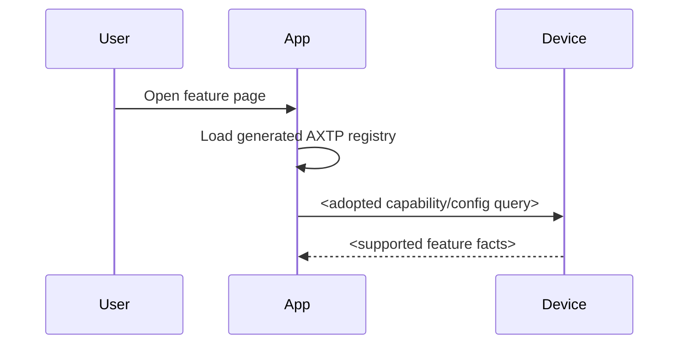

# <Scenario Name> Protocol Interaction Flow

> Status: flow design
> Scope: <product / device / app feature>
> Source inputs: <UI prototype, business story, legacy docs, requirement links>
> Protocol lifecycle: Stage 10 `plan-protocol-flow`

本文根据业务场景和交互 story 梳理需要使用的 AXTP 协议、已有覆盖状态和协议缺口。本文不是最终协议事实源；已采纳事实以 `contract/registry/**/*.yaml`、`contract/registry/domains/**/*.yaml` 和 `contract/generated/**` 为准，新增或修改协议必须转入 `docs/workspace/protocol/**` 草案和后续采纳流程。

Flow 文档负责：

- 描述业务场景和交互步骤。
- 判断每一步协议覆盖状态。
- 识别协议缺口。
- 将缺口路由到 candidate `domain.feature`。

Flow 文档不负责：

- 定义完整 method schema。
- 分配 methodId / eventId / errorCode / fieldId。
- 作为 runtime implementation contract。
- 替代 `docs/workspace/protocol/<domain>/<feature>.md`。

完整 method / event / schema / capability 定义必须进入 `docs/workspace/protocol/<domain>/<feature>.md`。

## 0. 速读结论

| 项目 | 内容 |
|---|---|
| Flow 目标 | <一句话描述本 flow 要完成的业务交互> |
| 当前协议覆盖 | complete / partial / missing / non-protocol |
| 涉及 domain.feature | <`domain.feature` list> |
| 已有 adopted/generated | <method / event / capability list> |
| 缺口 | <missing protocol gaps> |
| 是否需要新增协议草案 | yes / no |
| 是否涉及 Legacy | yes / no |
| 是否涉及 STREAM | yes / no |
| 下一步 | draft protocol / amend adopted protocol / no action |

## 1. Story Summary

| Item | Content |
|---|---|
| User goal | <what the user wants to accomplish> |
| Trigger | <how the flow starts> |
| Success result | <observable success state> |
| Primary actors | <App / server / device / firmware service / user> |
| Product scope | <device family / firmware / App version if known> |

## 2. Source Observations

### 2.1 UI / Prototype

| Screen or control | Observed behavior | Protocol relevance |
|---|---|---|
| <screen/control> | <visible field, toggle, slider, button, validation> | <read config / set config / event / local only> |

### 2.2 Requirement Notes

- <business rule>
- <persistence/restart/latency expectation>
- <legacy compatibility note>

### 2.3 Device / System State Observations

| State | Meaning | Protocol relevance |
|---|---|---|
| <state> | <what it means> | <query / event / precondition / fallback> |

## 3. Assumptions And Non-Goals

| Type | Item | Status |
|---|---|---|
| Assumption | <reasonable working assumption> | `[REVIEW-DRAFT]` |
| Question | <unconfirmed fact> | `[REVIEW-ASK]` |
| Non-goal | <what this flow does not cover> | `[REVIEW-OK]` |

## 4. Protocol Coverage

| Need | Coverage state | AXTP protocol | Evidence | Next action |
|---|---|---|---|---|
| <need> | generated / adopted / draft / missing / local-only / non-protocol | <method/event/capability> | <file path> | <implement / draft protocol / amend adopted protocol / no action> |

Coverage 取值：

| Coverage | Meaning |
|---|---|
| generated | 已进入 `contract/generated/**` 或 protocol IR，可作为实现合同视图。 |
| adopted | 已写入 registry YAML，但当前 flow 未直接引用 generated 输出。 |
| draft | 已有 `docs/workspace/protocol/**` 草案，但尚未 adopted/generated。 |
| missing | 没有合适的 adopted/generated/draft 协议覆盖。 |
| local-only | App/UI/runtime 本地逻辑，不需要 AXTP 协议。 |
| non-protocol | 产品规则、人工流程、运营策略或文档说明，不进入协议。 |

## 5. End-To-End Sequence

## 6. Interaction Steps

| Step | Actor | Action | Capability / precondition | Protocol call/event | Payload fields | Result / state change | Coverage | Error / fallback |
|---:|---|---|---|---|---|---|---|---|
| 1 | <actor> | <action> | <capability or precondition> | <method/event/local-only> | <important fields> | <result/state change> | generated / adopted / draft / missing / local-only / non-protocol | <errors/fallback> |

## 7. State Changes And Events

| State change | Trigger | Event needed | Payload | Client handling | Coverage |
|---|---|---|---|---|---|
| <state change> | <trigger> | <event or no event> | <payload summary> | <update UI / call get / ignore> | generated / draft / missing |

## 8. Protocol Details

### 8.1 Adopted / Generated Protocols

| Method/Event | Purpose in this flow | Source |
|---|---|---|
| <method/event> | <why used> | `contract/generated/protocol.md` |

### 8.2 Draft Or Missing Protocol Gaps

| Gap | Candidate domain.feature | Candidate method/event/schema | Routed skill | Review question |
|---|---|---|---|---|
| <gap> | `<domain.feature>` | <candidate> | `draft-business-protocol` or `amend-adopted-protocol` | `[REVIEW-ASK]` |

## 9. Test / Conformance Notes

| Case | Given | When | Then | Protocol evidence |
|---|---|---|---|---|
| happy path | <precondition> | <action> | <expected result> | <method/event/capability> |
| unsupported | <precondition> | <action> | <expected error/fallback> | <method/event/capability> |
| event path | <precondition> | <trigger> | <expected event/client behavior> | <event> |

## 10. Acceptance Gates

- All required adopted/generated methods are present in the generated registry, and any runtime capability/config query confirms device support.
- App and device use generated schemas for protocol payloads.
- All `draft` / `missing` protocol gaps have an owner and next workflow.
- Error and unsupported-method behavior is visible in the UI or product flow.

## 11. Open Questions

| Question | Impact | Owner | Status | Next action |
|---|---|---|---|---|
| <question> | protocol / product / UI / firmware / legacy / conformance | TBD | REVIEW-ASK / blocked / decided | <next action> |
