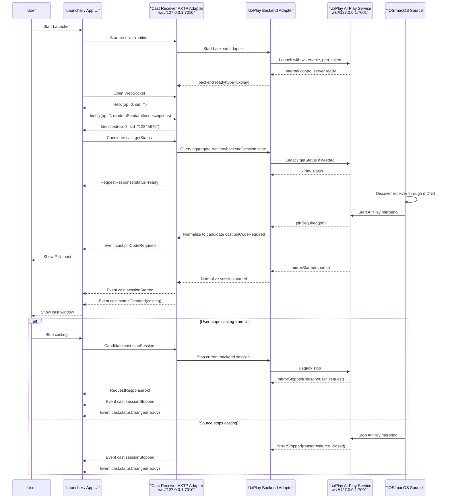

# Cast Receiver UxPlay Protocol Interaction Flow

> Status: flow design
> Scope: Windows Launcher 集成 AirPlay 接收端、Electron 外部控制口、UxPlay backend adapter
> Source inputs: `workspace/business/cast-receiver-uxplay.md`, `workspace/legacy-migration/evidence/WEBSOCKET_PROTOCOL.md`, `contract/generated/protocol.md`, `workspace/protocol/auth/auth.session.md`, `workspace/protocol/auth/auth.token.md`, `workspace/protocol/auth/auth.permission.md`
> Protocol lifecycle: Stage 10 `plan-protocol-flow`

本文根据 Launcher 集成 UxPlay/AirPlay 接收端的业务场景，梳理外部 AXTP 控制口、UI、UxPlay backend adapter 和 iOS/macOS 投屏源之间的协议交互、已有覆盖状态和协议缺口。

本文不是最终协议事实源。已采纳事实以 `contract/registry/**/*.yaml`、`contract/registry/domains/**/*.yaml` 和 `contract/generated/**` 为准；新增或修改协议必须进入 `workspace/protocol/**` 草案，并经过后续采纳和生成流程。

Flow 文档负责描述业务场景和交互步骤、判断每一步协议覆盖状态、识别协议缺口，并将缺口路由到 candidate `domain.feature`。Flow 文档不负责定义完整 method/event/schema/capability，不分配 methodId/eventId/errorCode/fieldId，也不能替代 `workspace/protocol/<domain>/<feature>.md`。

命名说明：`cast.status`、`cast.session` 等只表示候选 capability 归属；真正进入 RPC wire 的 method/event 名称应按后续 Stage 20 草案确认，例如候选 `cast.getStatus`、`cast.stopSession`、`cast.sessionStarted`。

## 0. 速读结论

| 项目 | 内容 |
|---|---|
| Flow 目标 | Launcher 启动 UxPlay AirPlay 接收端后，外部控制端通过本机 AXTP WS-JSON 控制口查询投屏状态、接收 PIN/投屏/窗口/音频/backend/runtime 事件，并可控制停止投屏、窗口、音频和运行时行为。 |
| 当前协议覆盖 | partial |
| 涉及 domain.feature | `cast.status`, `cast.session`, `cast.pinCode`, `cast.audio`, `cast.window`, `cast.runtime`, `cast.backend`, draft `auth.session` / `auth.token` / `auth.permission` |
| 已有 adopted/generated | `AXTP-WS-JSON`, RPC `Hello`, `Identify`, `Identified`, `Request`, `RequestResponse`, `Event`, JSON `sid/op/d` envelope。 |
| 缺口 | `cast` domain 尚未有 adopted/generated/draft 协议；状态聚合、投屏会话、PIN、窗口、音频、runtime/backend、错误模型和 legacy adapter mapping 需要 Stage 20 草案。外部控制口 token/LAN/权限策略只有 auth 草案雏形，仍需细化。 |
| 是否需要新增协议草案 | yes |
| 是否涉及 Legacy | yes，`workspace/legacy-migration/evidence/WEBSOCKET_PROTOCOL.md` 是主要旧协议证据。 |
| 是否涉及 STREAM | no，AirPlay 媒体面和 UxPlay 内部媒体传输不进入本 AXTP 控制 flow。 |
| 下一步 | 使用 `tooling/skills/20-draft-business-protocol/SKILL.md` 起草或补齐 `cast.status`、`cast.session`、`cast.pinCode`，随后拆分补齐 `cast.window`、`cast.audio`、`cast.runtime`、`cast.backend`；认证策略路由到 auth 草案。 |

## 1. Story Summary

| Item | Content |
|---|---|
| User goal | Launcher 启动 AirPlay 接收端后，iOS/macOS 能通过 mDNS 发现并开始投屏；UI 和外部控制端能感知投屏、PIN、服务、窗口和音频状态变化，并能执行必要控制。 |
| Trigger | Launcher 启动 Electron/UxPlay 接收端服务；或控制端连接 Electron 外部 AXTP 控制口 `ws://127.0.0.1:7010/`。 |
| Success result | AirPlay service ready；控制端完成 AXTP RPC handshake；投屏开始时 UI 自动展示投屏窗口和 PIN toast；状态、服务退出、窗口大小、音频变化均有事件；控制端可查询状态并发起停止投屏、PIN、音频、窗口、runtime/backend 控制。 |
| Primary actors | User, Launcher / App UI, Cast Receiver AXTP Adapter, UxPlay Backend Adapter, UxPlay AirPlay Service, iOS/macOS Source |
| Product scope | Windows Launcher 集成 AirPlay receiver；Electron 外部控制口默认 `ws://127.0.0.1:7010/`；UxPlay backend 内部控制口默认 `ws://127.0.0.1:7001/`。 |

## 2. Source Observations

### 2.1 UI / Prototype

| Screen or control | Observed behavior | Protocol relevance |
|---|---|---|
| Launcher startup | Launcher 随软件启动自动拉起投屏接收端和 AirPlay service。 | 启动编排是 local-only；需要 runtime/backend ready 或 error 事件对 UI 可见。 |
| Receiver discovery | iOS/macOS 通过 mDNS 发现 AirPlay 接收端。 | mDNS/AirPlay discovery 是 non-protocol；AXTP 只暴露 receiver ready/status。 |
| PIN toast | 接收到投屏信号或 backend 要求 PIN 时，应用侧展示当前投屏密码。 | 需要 PIN required/changed/hidden 类事件；归入候选 `cast.pinCode`。 |
| Cast window | 投屏开始后 UI 主动展示投屏窗口；停止后隐藏或恢复默认状态。 | 需要 session started/stopped 事件驱动 UI；窗口控制归入候选 `cast.window`。 |
| Window size/state | 窗口大小、显示、隐藏、全屏、置顶变化时有事件。 | 需要 `cast.windowChanged` 候选事件，并区分投屏窗口和 PIN 展示。 |
| Audio controls | 可获取和设置投屏音频开关、静音状态。 | 需要候选 `cast.getAudio` / `cast.setAudio` / `cast.setMuted` 和 `cast.audioChanged`。 |
| Runtime controls | 可获取/设置服务端口号、服务显示名称，并监听端口变化。 | 需要 `cast.runtime` 候选能力；端口修改的生效时机和权限仍待确认。 |
| Backend controls | 可感知 UxPlay ready/exited，并可重启 backend。 | 需要 `cast.backend` 候选能力；`uxplay` 应作为 backend type，不进入标准 method name。 |

### 2.2 Requirement Notes

- 软件分为 UI 层受控端和 backend 服务层受控端，受控范围不同。
- Electron 外部控制口面向 Launcher、UI 或本机外部控制端；UxPlay `7001` 内部控制口是 adapter 到 backend 的实现细节。
- 旧协议外层已使用 `sid/op/d`，但 legacy handshake 是 client `Hello(op=0)` + server `HelloAck(op=1)` + `auth` request；新 AXTP 应使用 generated RPC session：Logical Server 发送 `Hello(op=0)`，Logical Client 发送 `Identify(op=2)`，Logical Server 返回 `Identified(op=3)`。
- Electron 启动 UxPlay 时会传 `-ws-enable -ws-port <UXPLAY_WS_PORT>`，并通过 token 环境变量保护内部/外部控制口。
- iOS/macOS mDNS、AirPlay/RAOP 媒体协议、UxPlay 内部媒体实现不进入 AXTP 标准化范围。
- `showPinWindow` / `hidePinWindow` 的语义是 PIN 展示，候选归入 `cast.pinCode`；`showCastWindow` / `hideCastWindow` 才归入 `cast.window`。

### 2.3 Device / System State Observations

| State | Meaning | Protocol relevance |
|---|---|---|
| runtime starting | Launcher 正在启动 Electron receiver runtime。 | local-only；候选 `cast.runtimeChanged` 可对外通知。 |
| WS control ready | 外部控制口 `7010` 可连接。 | generated `AXTP-WS-JSON` 可建立 RPC session；runtime ready 仍是候选业务事件。 |
| RPC identified | 控制端完成 Hello / Identify / Identified，获得 8 位 hex `sid`。 | generated RPC session 前置条件。 |
| backend starting / ready / exited | UxPlay backend 进程或服务状态变化。 | 候选 `cast.backendReady` / `cast.backendExited` / `cast.backendChanged`。 |
| receiver ready | AirPlay 接收端可被 mDNS 发现。 | 候选 `cast.getStatus` / `cast.statusChanged`。 |
| pin required / visible / hidden | Backend 要求 PIN，UI 展示或隐藏 PIN。 | 候选 `cast.pinCodeRequired` / `cast.pinCodeChanged` / `cast.pinCodeHidden`。 |
| casting | 有活动 AirPlay 投屏 session。 | 候选 `cast.sessionStarted` / `cast.statusChanged`。 |
| window visible / fullscreen / alwaysOnTop | 投屏窗口状态变化。 | 候选 `cast.windowChanged`。 |
| audio enabled / muted | 投屏音频启用或静音状态变化。 | 候选 `cast.audioChanged`。 |
| error | runtime、backend、session 或权限失败。 | 候选 `cast.error` 或 feature-specific typed error。 |

## 3. Assumptions And Non-Goals

| Type | Item | Status |
|---|---|---|
| Assumption | Electron 外部控制口是 AXTP Logical Server；Launcher / UI / 外部控制端是 Logical Client。WebSocket 建立后由服务端先发送 `Hello`。 | `[REVIEW-DRAFT]` |
| Assumption | 第一版外部控制口使用 `AXTP-WS-JSON`，即 WebSocket text frame 直接承载 JSON `{sid, op, d}`，不使用 CONTROL、STREAM、CRC16 或 JSON_BINARY header。 | `[REVIEW-DRAFT]` |
| Assumption | 认证优先放在 `Identify.d.authentication` 或 `auth.*` 草案中，不继续把 legacy `auth` 当成 cast 业务 method。 | `[REVIEW-DRAFT]` |
| Assumption | `cast` 第一版角色固定为 receiver：`roles=["receiver"]`、`activeRole="receiver"`；后续如支持 sender，再通过 capability/status 扩展角色。 | `[REVIEW-DRAFT]` |
| Question | 外部控制口是否只允许本机 `127.0.0.1`，还是需要 LAN 控制；如允许 LAN，鉴权、Origin、token 轮换和权限 scope 必须进入 auth/runtime 草案。 | `[REVIEW-ASK]` |
| Question | 修改控制端口后是立即重启监听、生效于下次启动，还是需要 Launcher 重启服务？ | `[REVIEW-ASK]` |
| Question | PIN 是否允许通过 `getPinCode` 明文读取，还是只允许 required/changed event 给 UI 临时展示？ | `[REVIEW-ASK]` |
| Non-goal | 不标准化 AirPlay、mDNS、RAOP、H.264/AAC 媒体面或 UxPlay 内部媒体实现。 | `[REVIEW-OK]` |
| Non-goal | 不把 UxPlay 内部 `7001` WebSocket 协议作为 AXTP 公共接口；它只作为 adapter evidence。 | `[REVIEW-OK]` |
| Non-goal | 本文不修改 `workspace/protocol/**`、`contract/registry/**`、`contract/protocol/axtp.protocol.yaml`、`contract/generated/**`。 | `[REVIEW-OK]` |

## 4. Protocol Coverage

| Need | Coverage state | AXTP protocol | Evidence | Next action |
|---|---|---|---|---|
| 外部控制端通过 WebSocket 建立 RPC 通道 | generated | `AXTP-WS-JSON` | `contract/generated/protocol.md`, `contract/registry/core/protocol_meta.yaml` | 可按 generated/core 实现。 |
| RPC session handshake | generated | `Hello(op=0)`, `Identify(op=2)`, `Identified(op=3)` | `contract/generated/protocol.md`, `specs/20-core.md` | 用新 handshake 替代 legacy `HelloAck`。 |
| RPC 请求、响应、事件 envelope | generated | `Request(op=7)`, `RequestResponse(op=8)`, `Event(op=6)`, JSON `sid/op/d` | `contract/generated/protocol.md`, `specs/20-core.md` | 可按 core 实现。 |
| 外部控制口 token、权限和 LAN 安全策略 | draft | `Identify.d.authentication`, draft `auth.session` / `auth.token` / `auth.permission` | `workspace/protocol/auth/auth.session.md`, `workspace/protocol/auth/auth.token.md`, `workspace/protocol/auth/auth.permission.md` | Stage 20 细化本场景 auth 策略。 |
| Launcher 启动 runtime | local-only | App process orchestration | `workspace/business/cast-receiver-uxplay.md` | UI/runtime 实现，不进 AXTP。 |
| Electron 启动 UxPlay backend | non-protocol | Backend adapter to `ws://127.0.0.1:7001/` | `workspace/legacy-migration/evidence/WEBSOCKET_PROTOCOL.md` | 只作为 adapter 实现。 |
| 查询整体投屏状态 | missing | Candidate `cast.getStatus` under `cast.status` | legacy `getStatus`, `status.changed` | 转 Stage 20。 |
| 整体状态变化和错误上报 | missing | Candidate `cast.statusChanged`, `cast.error` | legacy `status.changed`, `error` | 转 Stage 20。 |
| 投屏会话查询、停止、开始/停止事件和帧统计 | missing | Candidate `cast.getSession`, `cast.stopSession`, `cast.sessionStarted`, `cast.sessionStopped`, `cast.frameStats` | legacy `stop`, `mirrorStarted`, `mirrorStopped`, `casting.*` | 转 Stage 20。 |
| PIN 获取、设置、轮换、展示、隐藏和事件 | missing | Candidate `cast.getPinCode`, `cast.setPinCode`, `cast.rotatePinCode`, `cast.showPinCode`, `cast.hidePinCode`, `cast.pinCode*` | legacy `getPin`, `setPin`, `rotatePin`, `pin.*`, `showPinWindow` | 转 Stage 20，需先确认安全策略。 |
| 投屏音频状态和静音控制 | missing | Candidate `cast.getAudio`, `cast.setAudio`, `cast.setMuted`, `cast.audioChanged` | legacy `getAudio`, `setAudio`, `setMuted`, `audio.changed` | 转 Stage 20。 |
| 投屏窗口显示、隐藏、全屏、置顶和窗口事件 | missing | Candidate `cast.getWindowState`, `cast.showWindow`, `cast.hideWindow`, `cast.setFullscreen`, `cast.setAlwaysOnTop`, `cast.windowChanged` | legacy `showCastWindow`, `hideCastWindow`, `setFullscreen`, `window.changed` | 转 Stage 20。 |
| Runtime 显示名称、控制端口、ready、退出 | missing | Candidate `cast.getRuntimeStatus`, `cast.setDisplayName`, `cast.setControlPort`, `cast.quitRuntime`, runtime events | legacy `app.ready`, `serverName.changed`, `control.portChanged`, `quitApp` | 转 Stage 20。 |
| UxPlay backend 状态、重启、ready/exited | missing | Candidate `cast.getBackendStatus`, `cast.restartBackend`, backend events | legacy `uxplay.ready`, `uxplay.exited`, `restartUxPlay` | 转 Stage 20。 |
| UxPlay 内部控制口 `ws://127.0.0.1:7001/` | non-protocol | Adapter implementation detail | `workspace/legacy-migration/evidence/WEBSOCKET_PROTOCOL.md` | 不进入公共 AXTP 协议。 |
| mDNS 发现和 AirPlay 媒体传输 | non-protocol | AirPlay/UxPlay implementation detail | `workspace/business/cast-receiver-uxplay.md` | 不进入 AXTP cast 控制协议。 |

Coverage 取值：

| Coverage | Meaning |
|---|---|
| generated | 已进入 `contract/generated/**` 或 protocol IR，可作为实现合同视图。 |
| adopted | 已写入 registry YAML，但当前 flow 未直接引用 generated 输出。 |
| draft | 已有 `workspace/protocol/**` 草案，但尚未 adopted/generated。 |
| missing | 没有合适的 adopted/generated/draft 协议覆盖。 |
| local-only | App/UI/runtime 本地逻辑，不需要 AXTP 协议。 |
| non-protocol | 产品规则、人工流程、运营策略或文档说明，不进入协议。 |

## 5. End-To-End Sequence

## 6. Interaction Steps

| Step | Actor | Action | Capability / precondition | Protocol call/event | Payload fields | Result / state change | Coverage | Error / fallback |
|---:|---|---|---|---|---|---|---|---|
| 1 | Launcher | 启动投屏接收端 runtime。 | Launcher 配置可用。 | local-only | process config, external port | Electron receiver runtime 开始初始化。 | local-only | 启动失败时 UI 显示接收端不可用。 |
| 2 | AXTP Adapter | 启动 UxPlay backend。 | Backend binary/config/token 可用。 | non-protocol / legacy adapter | `-ws-enable`, backend port, token | UxPlay 内部控制口 ready。 | non-protocol | UxPlay 退出或端口冲突时，后续通过候选 backend/error event 上报。 |
| 3 | Control Client | 连接外部控制口。 | `AXTP-WS-JSON` profile。 | WebSocket open | `ws://127.0.0.1:7010/` | 进入 RPC handshake。 | generated | 连接失败按 UI 重连/提示策略处理。 |
| 4 | AXTP Adapter | 发送服务端 Hello。 | WebSocket 已建立。 | `Hello(op=0)` | `sid=""`, `axtpVersion`, auth challenge optional | Client 获得 session 规则和认证要求。 | generated | 超时未收到 Hello，Client 断开并重连。 |
| 5 | Control Client | 提交身份、认证、随机种子和订阅意图。 | Server Hello 已收到。 | `Identify(op=2)` | `randomSeed`, `authentication`, `eventMasks` | Server 校验版本、身份和权限，并使用 randomSeed 参与 sid 生成。 | generated / draft auth | auth 字段的 token/HMAC/scope 语义需 Stage 20 细化。 |
| 6 | AXTP Adapter | 确认 session ready。 | Identify 已通过。 | `Identified(op=3)` | fixed 8-char hex `sid` | 后续 Request/Event/Response 使用该 `sid`。 | generated | Identified 前收到业务 Request，应按 RPC session 错误处理。 |
| 7 | AXTP Adapter | 通知 runtime/backend ready。 | runtime/backend 已初始化。 | Candidate `cast.runtimeReady`, `cast.backendReady` | state, backend type, ports | UI 可显示接收端可用。 | missing | backend 未 ready 时整体 status 可为 `starting` 或 `error`。 |
| 8 | Control Client | 查询完整状态。 | RPC identified。 | Candidate `cast.getStatus` | no schema here; status selector optional | 返回 runtime、backend、session、pin、audio、window 摘要。 | missing | backend 暂不可用时仍应返回 runtime 状态。 |
| 9 | iOS/macOS Source | 发现并开始 AirPlay 投屏。 | AirPlay/mDNS 可用。 | non-protocol | mDNS / AirPlay | UxPlay 产生内部事件。 | non-protocol | 发现失败属于 backend 配置或网络问题。 |
| 10 | UxPlay / Backend | 需要 PIN。 | Backend emits `pinRequired`。 | Candidate `cast.pinCodeRequired` | visibility, expiry, optional pin per policy | UI 展示 PIN toast。 | missing | 是否允许明文 PIN 上报需安全评审。 |
| 11 | UxPlay / Backend | 投屏会话开始。 | AirPlay session established。 | Candidate `cast.sessionStarted`, `cast.statusChanged` | session summary, source, protocol | UI 显示投屏窗口并进入 casting 状态。 | missing | 缺少 source 字段时仍可进入 casting，但记录 legacy 字段缺口。 |
| 12 | Control Client | 调整窗口状态。 | Active window or runtime supports window control。 | Candidate `cast.showWindow`, `cast.hideWindow`, `cast.setFullscreen`, `cast.setAlwaysOnTop` | window intent fields | 返回窗口状态并广播 `cast.windowChanged`。 | missing | 窗口不存在或不支持时返回 typed error。 |
| 13 | Control Client | 调整投屏音频。 | Audio control supported。 | Candidate `cast.setAudio`, `cast.setMuted` | enabled, muted | 返回音频状态并广播 `cast.audioChanged`。 | missing | 系统音频或 backend 音频不可用时返回 typed error。 |
| 14 | Control Client | 停止当前投屏。 | Active cast session exists。 | Candidate `cast.stopSession` | reason | Backend 调 legacy `stop`；成功后广播 stopped/statusChanged。 | missing | 无活动 session 时返回 no active session。 |
| 15 | UxPlay / Backend | 服务退出或崩溃。 | Backend process exits。 | Candidate `cast.backendExited`, `cast.error` | exit code, signal, reason, recoverable | UI 提示服务异常或等待自动恢复。 | missing | 自动重启 backend 后广播 backendReady/statusChanged。 |
| 16 | Control Client | 退出或重启 receiver runtime。 | Admin/control scope。 | Candidate `cast.quitRuntime`, `cast.restartRuntime` | reason | runtime 返回 quitting/restarting，由 Launcher 接管生命周期。 | missing | 权限不足时拒绝；是否暴露给普通 UI 待确认。 |

## 7. State Changes And Events

| State change | Trigger | Event needed | Payload | Client handling | Coverage |
|---|---|---|---|---|---|
| RPC session identified | `Identified(op=3)` | no business event | sid | 开始业务查询和订阅。 | generated |
| runtime ready | Electron receiver runtime 初始化完成 | Candidate `cast.runtimeReady` / `cast.runtimeChanged` | runtime state, displayName, controlPort | 更新接收端可用状态。 | missing |
| backend ready / exited | UxPlay 启动成功或退出 | Candidate `cast.backendReady`, `cast.backendExited` | backend type, state, exit code/signal | 更新 backend 状态；必要时触发重启策略。 | missing |
| receiver ready | AirPlay service 可被发现 | Candidate `cast.statusChanged` | aggregate status summary | UI 更新主状态；必要时调用 status query 校准。 | missing |
| PIN required / changed / hidden | Backend 要求 PIN 或 PIN 轮换/隐藏 | Candidate `cast.pinCodeRequired`, `cast.pinCodeChanged`, `cast.pinCodeHidden` | pin visibility, pin policy, expiry | 展示/隐藏 PIN toast。 | missing |
| session started / stopped | AirPlay mirror started/stopped | Candidate `cast.sessionStarted`, `cast.sessionStopped` | sessionId, source, protocol, reason | 显示或隐藏投屏窗口。 | missing |
| frame stats updated | UxPlay 或 app 收到帧统计 | Candidate `cast.frameStats` | frame counters, fps, dropped frames | 调试或诊断展示；默认频率需确认。 | missing |
| window changed | UI 或 runtime 改变窗口状态 | Candidate `cast.windowChanged` | window kind, visible, bounds/fullscreen/topmost | 同步窗口控件。 | missing |
| audio changed | UI 或 backend 改变 audio/mute | Candidate `cast.audioChanged` | enabled, muted, source | 同步音频控件。 | missing |
| cast error | runtime/backend/session/auth 出错 | Candidate `cast.error` or feature-specific error | code, message, source, recoverable | 展示错误并可触发重试。 | missing |

## 8. Protocol Details

### 8.1 Adopted / Generated Protocols

| Method/Event/Profile | Purpose in this flow | Source |
|---|---|---|
| `AXTP-WS-JSON` | 外部控制口 WebSocket JSON transport profile。 | `contract/generated/protocol.md`, `contract/registry/core/protocol_meta.yaml` |
| `Hello(op=0)` | Logical Server 建立连接后主动宣布 AXTP version 和认证要求。 | `contract/generated/protocol.md`, `specs/20-core.md` |
| `Identify(op=2)` | Logical Client 提交身份、randomSeed、认证和订阅意图。 | `contract/generated/protocol.md`, `specs/20-core.md` |
| `Identified(op=3)` | Logical Server 分配 RPC `sid`，session 进入 ready。 | `contract/generated/protocol.md`, `specs/20-core.md` |
| `Request(op=7)` | 控制端调用业务 method。 | `contract/generated/protocol.md`, `specs/20-core.md` |
| `RequestResponse(op=8)` | 服务端返回请求结果。 | `contract/generated/protocol.md`, `specs/20-core.md` |
| `Event(op=6)` | 服务端广播状态变化、会话变化和窗口变化。 | `contract/generated/protocol.md`, `specs/20-core.md` |

### 8.2 Draft Or Missing Protocol Gaps

| Gap | Candidate domain.feature | Candidate method/event/schema | Routed skill | Review question |
|---|---|---|---|---|
| `cast` domain 尚未存在 adopted/generated/draft 事实。 | `cast` | domain metadata, receiver role, AirPlay protocol support, backend feature list | `tooling/skills/20-draft-business-protocol/SKILL.md` | `[REVIEW-ASK]` 第一版是否只声明 receiver role 和 `airplay` protocol？ |
| 外部控制口认证方式未标准化到本场景。 | `auth.session` / `auth.token` / `auth.permission` | Identify auth fields, token/HMAC scopes, LAN/Origin policy | `draft-business-protocol` | `[REVIEW-ASK]` 本机控制是否可 no-auth？LAN 控制是否必须 token/HMAC？ |
| 状态聚合 schema 未定义。 | `cast.status` | `CastStatus`, runtime/backend/session/pin/audio/window summary | `draft-business-protocol` | `[REVIEW-ASK]` `state` 枚举是否采用 `starting/ready/casting/stopping/error/disabled`？ |
| 投屏会话字段未定义。 | `cast.session` | session summary, source, protocol, stop reason, frame stats | `draft-business-protocol` | `[REVIEW-ASK]` `sessionId` 是 runtime 本地字符串，还是需要可恢复的稳定 ID？ |
| PIN 明文读取和事件暴露策略未定义。 | `cast.pinCode` | PIN schema, visibility, expiry, privacy policy | `draft-business-protocol` | `[REVIEW-ASK]` PIN 是否允许在 response/event 明文出现？ |
| 窗口状态和 PIN 展示边界未定义。 | `cast.window` / `cast.pinCode` | cast window state, pin presentation state | `draft-business-protocol` | `[REVIEW-ASK]` PIN toast/window 是否独立于投屏窗口建模？ |
| Runtime displayName、controlPort 读写语义未定义。 | `cast.runtime` | display name, control port, restart/quit policy | `draft-business-protocol` | `[REVIEW-ASK]` 端口修改立即生效还是下次启动生效？ |
| Backend 与 runtime 的重启边界未定义。 | `cast.backend` | backend status, restartBackend, backendChanged | `draft-business-protocol` | `[REVIEW-ASK]` `restartUxPlay` 只重启 UxPlay，还是重建整个 receiver runtime？ |
| Legacy 错误码和状态码需映射。 | `cast.status` / `cast.session` / `auth.*` | error model, `UNAUTHORIZED`, `INVALID_PARAMS`, `INVALID_STATE`, `INVALID_OP`, `INTERNAL_ERROR` mapping | `draft-business-protocol` | `[REVIEW-ASK]` 是否复用 AXTP common errors，还是补 cast-specific typed details？ |

### 8.3 Legacy To Candidate Mapping

| Legacy method/event | Candidate AXTP method/event | Notes |
|---|---|---|
| `HelloAck` | `Identified(op=3)` | 新 AXTP 不使用 `HelloAck` 作为握手确认。 |
| `auth` | `Identify.d.authentication` / `auth.*` | 认证放到 handshake 或 auth 草案，不作为 `cast.*` method。 |
| `getStatus`, `status.changed`, `error` | `cast.getStatus`, `cast.statusChanged`, `cast.error` | 整体 receiver 状态；归属 `cast.status`。 |
| `mirrorStarted`, `casting.started` | `cast.sessionStarted` | 投屏会话开始；归属 `cast.session`。 |
| `mirrorStopped`, `casting.stopped` | `cast.sessionStopped` | 投屏会话停止；归属 `cast.session`。 |
| `stop`, `stopCasting` | `cast.stopSession` | 停止当前投屏；归属 `cast.session`。 |
| `casting.frameStats` | `cast.frameStats` | 调试/诊断统计；是否默认开启待确认。 |
| `getPin`, `setPin`, `rotatePin` | `cast.getPinCode`, `cast.setPinCode`, `cast.rotatePinCode` | PIN 权限需评审；归属 `cast.pinCode`。 |
| `showPinWindow`, `hidePinWindow` | `cast.showPinCode`, `cast.hidePinCode` | PIN 展示属于 pinCode，不属于 cast window。 |
| `getAudio`, `setAudio`, `setMuted` | `cast.getAudio`, `cast.setAudio`, `cast.setMuted` | 投屏音频和静音；归属 `cast.audio`。 |
| `showCastWindow`, `hideCastWindow`, `setFullscreen`, `setAlwaysOnTop` | `cast.showWindow`, `cast.hideWindow`, `cast.setFullscreen`, `cast.setAlwaysOnTop` | 投屏窗口控制；归属 `cast.window`。 |
| `app.ready`, `serverName.changed`, `control.portChanged`, `quitApp` | `cast.runtimeReady`, `cast.displayNameChanged`, `cast.controlPortChanged`, `cast.quitRuntime` | Runtime 层，不等同于 UxPlay backend。 |
| `uxplay.ready`, `uxplay.exited`, `restartUxPlay` | `cast.backendReady`, `cast.backendExited`, `cast.restartBackend` | UxPlay 是 backend type；不进入 method name。 |
| `Bye`, `ByeAck` | optional RPC close / WebSocket close policy | Core 中 Bye/ByeAck 是 optional；是否暴露应用层 graceful close 待评审。 |

### 8.4 Candidate Feature Boundaries

| Feature | Responsibility | Candidate methods/events |
|---|---|---|
| `cast.status` | 投屏接收端整体状态、错误和摘要。 | `cast.getStatus`, `cast.statusChanged`, `cast.error` |
| `cast.session` | 一次投屏会话的查询、停止和统计。 | `cast.getSession`, `cast.stopSession`, `cast.sessionStarted`, `cast.sessionStopped`, `cast.frameStats` |
| `cast.pinCode` | PIN 获取、设置、轮换、显示和隐藏。 | `cast.getPinCode`, `cast.setPinCode`, `cast.rotatePinCode`, `cast.showPinCode`, `cast.hidePinCode`, `cast.pinCode*` |
| `cast.audio` | 投屏音频启用和静音。 | `cast.getAudio`, `cast.setAudio`, `cast.setMuted`, `cast.audioChanged` |
| `cast.window` | 投屏窗口显示、隐藏、全屏和置顶。 | `cast.getWindowState`, `cast.showWindow`, `cast.hideWindow`, `cast.setFullscreen`, `cast.setAlwaysOnTop`, `cast.windowChanged` |
| `cast.runtime` | 投屏接收端应用/服务运行时。 | `cast.getRuntimeStatus`, `cast.setDisplayName`, `cast.setControlPort`, `cast.restartRuntime`, `cast.quitRuntime`, runtime events |
| `cast.backend` | 具体投屏后端实现，例如 UxPlay。 | `cast.getBackendStatus`, `cast.restartBackend`, backend events |

## 9. Test / Conformance Notes

| Case | Given | When | Then | Protocol evidence |
|---|---|---|---|---|
| happy path | Receiver runtime running on `7010` | Client connects and completes Hello / Identify / Identified | Client receives 8-char hex `sid` and can send business request candidates | `AXTP-WS-JSON`, RPC session |
| handshake direction | Client opens WebSocket | Server sends Hello first | Client does not send legacy client Hello/HelloAck flow | `specs/20-core.md` |
| request before identified | Client sends business Request before Identified | Server receives request | Server rejects according to RPC session rules | `SESSION_NOT_READY` behavior in RPC spec |
| auth path | Hello indicates auth required | Client identifies without/with invalid auth | Server rejects Identify or closes per policy; correct auth enters ready | `Identify.d.authentication`, draft `auth.*` |
| event path | UxPlay emits `mirrorStarted` | Adapter normalizes event | Client receives candidate `cast.sessionStarted` and `cast.statusChanged(casting)` | candidate `cast.session`, `cast.status` |
| PIN path | UxPlay emits `pinRequired` | Adapter normalizes event | UI shows PIN toast or secure placeholder according to policy | candidate `cast.pinCode` |
| stop path | Active session exists | UI calls candidate `cast.stopSession` | Backend stops mirror and emits stopped/statusChanged | candidate `cast.session` |
| backend failure | UxPlay exits unexpectedly | Adapter observes process exit | Client receives backend exited/error state | candidate `cast.backend`, `cast.error` |
| legacy boundary | Internal backend control on `7001` exists | External client tries to treat it as AXTP public contract | Documentation rejects this path; only `7010` adapter is public | non-protocol adapter detail |

## 10. Acceptance Gates

- 外部控制口必须按 `AXTP-WS-JSON` 实现 JSON `sid/op/d` envelope 和 `Hello / Identify / Identified / Request / RequestResponse / Event`。
- `HelloAck`、legacy `auth` method、legacy light protocol `type/id/op/data/ok/error` 只能作为迁移线索；新规范握手以 AXTP RPC session 为准。
- `cast.*` 业务能力在进入 contract/registry/generated 前不得作为 adopted SDK 合同发布。
- UxPlay 内部 `7001` 控制口不能直接暴露为标准协议；标准接口应停留在外部 AXTP Adapter。
- Runtime 与 backend 必须分层：runtime 表示投屏接收端应用/服务，backend 表示 UxPlay/AirPlay/Miracast 等具体实现。
- PIN、token、control port、LAN 控制和 admin 操作在 Stage 20 草案中必须明确权限和安全边界。
- Event 覆盖服务 ready/exited、投屏 started/stopped、PIN required/changed/hidden、audio changed、window changed 和 error。
- UI 和测试用例必须能区分 AirPlay discovery/media 失败、UxPlay backend 失败和 AXTP 控制协议失败。

## 11. Open Questions

| Question | Impact | Owner | Status | Next action |
|---|---|---|---|---|
| 外部控制口是否允许 LAN 访问？如果允许，是否必须启用 token/HMAC、Origin 白名单和权限 scope？ | security / product | TBD | REVIEW-ASK | 进入 auth/runtime 草案。 |
| `getPinCode` 是否允许返回明文 PIN？PIN event 是否也允许包含明文？ | security / protocol | TBD | REVIEW-ASK | 决定 PIN schema 和日志脱敏策略。 |
| `controlPort` 是 runtime 配置项、Launcher 配置项，还是只读运行状态？ | product / runtime | TBD | REVIEW-ASK | 决定是否支持 set 以及生效时机。 |
| `quitRuntime`、`restartRuntime`、`restartBackend` 是否给普通 UI 暴露，还是只给调试/运维/admin scope？ | permission / product | TBD | REVIEW-ASK | 进入 capability/permission 定义。 |
| 投屏窗口和 PIN 窗口是否一定独立？如果产品只有一个窗口，应如何表达 `pinCode.showPinCode` 与 `window.showWindow` 的 UI 映射？ | UI / protocol | TBD | REVIEW-ASK | 确认 feature 边界。 |
| `frameStats` 的频率、字段和性能开销是否默认开启，还是按订阅/调试模式启用？ | conformance / performance | TBD | REVIEW-ASK | 决定 event 频率和订阅策略。 |
| 是否需要保留 legacy method alias 用于过渡期兼容，还是外部新接口只接受 `cast.*`？ | legacy / product | TBD | REVIEW-ASK | 决定 adapter 策略。 |
