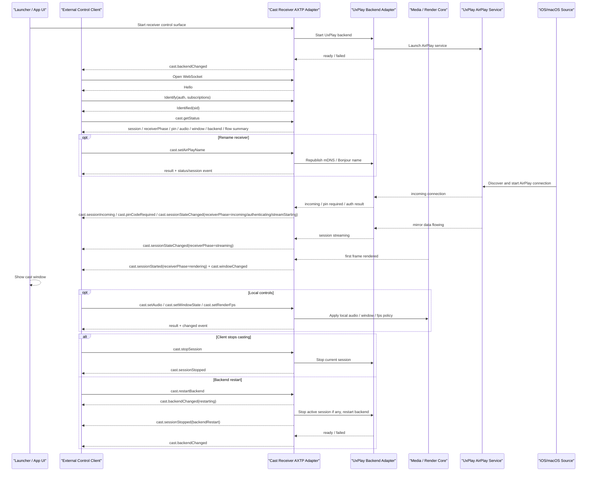

# Cast Receiver UxPlay Protocol Interaction Flow

> Status: flow design
> Scope: Windows Launcher AirPlay receiver, Cast Receiver AXTP Adapter, UxPlay backend, Media / Render Core
> Source inputs: `workspace/business/cast-receiver-uxplay.md`, `workspace/legacy-migration/evidence/WEBSOCKET_PROTOCOL.md`, `contract/generated/protocol.md`, `workspace/protocol/auth/*.md`, `workspace/protocol/cast/*.md`
> Protocol lifecycle: Stage 10 `plan-protocol-flow`

本文只描述外部控制端、Launcher、UxPlay backend 和 AirPlay source 之间的控制面交互。正式合同仍以 `contract/registry/**`、`contract/protocol/axtp.protocol.yaml` 和 `contract/generated/**` 为准。

## 0. 速读结论

| 项目 | 内容 |
|---|---|
| Flow 目标 | 外部控制端通过 AXTP WS-JSON 管理 AirPlay 名称、会话、PIN、音频、窗口、backend 重启和本地渲染流控。 |
| 当前覆盖 | core RPC 已 generated；`cast.session`、`cast.pinCode`、`cast.audio`、`cast.window`、`cast.backend`、`cast.flowControl`、`cast.status` 已有 draft。 |
| 主要缺口 | LAN auth 入口策略、AirPlay 名称 schema、`stopSession` 幂等性、无窗口控制行为、backend 重启事件顺序。 |
| 边界 | AirPlay / mDNS / RAOP / 媒体帧不进入 AXTP cast 控制协议；UxPlay backend 内部控制口只是 adapter 实现。 |

## 1. 已确认决策

| Decision | Status |
|---|---|
| 对外控制口由 Cast Receiver AXTP Adapter 承载，不直接暴露 UxPlay backend 内部控制服务。 | `[REVIEW-OK]` |
| 第一版外部控制面使用 `AXTP-WS-JSON`；WebSocket 建立后由服务端发送 `Hello`，客户端 `Identify`。 | `[REVIEW-DRAFT]` |
| 外部控制口允许 LAN 访问；是否需要 token / HMAC 和 Origin 白名单由 auth 草案收敛。 | `[REVIEW-DRAFT]` |
| `cast.*` 普通查询和控制能力先按朴素可调用状态面设计，不拆分 per-method 权限 scope。 | `[REVIEW-OK]` |
| AirPlay 显示名称归入 `cast.session`。 | `[REVIEW-OK]` |
| 投屏音频播放默认关闭，只影响接收端本地播放。 | `[REVIEW-OK]` |
| PIN 保护默认开启；默认 PIN 自动生成，授权 response / event 可携带明文 PIN。 | `[REVIEW-OK]` |
| Backend 重启只重启 UxPlay backend；活动会话会被强制结束。 | `[REVIEW-OK]` |
| `receiverPhase` 作为跨 AirPlay/UxPlay 与 HID/NA20 的接收端统一阶段；`sessionState` 或媒体 source/stream state 继续保留为协议细节状态。 | `[REVIEW-OK]` |
| `cast.setRenderFps` 只控制本地渲染 fps，不要求 source 降低输入 fps。 | `[REVIEW-OK]` |
| `fps=0` 表示不限速；目标 fps 高于输入时按输入 fps 运行；默认 `dropMode=drop-late`。 | `[REVIEW-OK]` |
| 投屏窗口 `mode=normal` 表示退出全屏、取消置顶，并恢复进入全屏 / 置顶前的窗口尺寸和位置。 | `[REVIEW-OK]` |

## 2. Protocol Coverage

| Need | Coverage | AXTP candidate | Remaining question |
|---|---|---|---|
| WebSocket RPC 通道 | generated | `Hello`, `Identify`, `Identified`, `Request`, `RequestResponse`, `Event` | 用新 RPC session 替代 legacy `HelloAck`。 |
| LAN auth 入口策略 | draft | `Identify.d.authentication`, `auth.session`, `auth.token` | 确认是否需要 token / HMAC 和 Origin 白名单。 |
| AirPlay 名称 | draft | `cast.getAirPlayName`, `cast.setAirPlayName` | 名称长度、字符集、立即生效和失败恢复。 |
| 投屏会话查询与停止 | draft | `cast.getSession`, `cast.stopSession`, `cast.session*` | 状态枚举和无活动会话时的幂等性。 |
| 聚合状态 | draft | `cast.getStatus`, `cast.statusChanged` | 聚合字段、敏感字段裁剪和事件节流。 |
| PIN / 密码保护 | draft | `cast.getPinCodeConfig`, `cast.setPinCodeConfig`, `cast.setPinCode`, `cast.pinCode*` | PIN 格式、明文可见性和日志脱敏验证。 |
| 投屏音频 | draft | `cast.getAudio`, `cast.setAudio`, `cast.setMuted`, `cast.audioChanged` | `enabled` / `muted` 关系和 `setMuted` 是否独立保留。 |
| 投屏窗口 | draft | `cast.getWindowState`, `cast.setWindowState`, `cast.windowChanged` | 无活动窗口时拒绝还是记住预设；是否需要 public show / hide。 |
| Backend 状态和重启 | draft | `cast.getBackendStatus`, `cast.restartBackend`, `cast.backendChanged` | session / backend 事件顺序。 |
| 本地渲染流控 | draft | `cast.getFlowControlState`, `cast.setRenderFps`, `cast.setFlowPolicy`, `cast.flowControlChanged` | 当前无业务阻断项；采纳时补 conformance。 |
| Launcher 启动与 UxPlay 内部控制口 | local / non-protocol | app orchestration, backend adapter | 不进入 AXTP 公共协议。 |

### 2.1 Receiver Phase Model

`receiverPhase` 是给 UI、重连校准和跨协议对齐使用的低频阶段；它不替代 AirPlay 的 `sessionState`，也不要求 HID/NA20 新增独立 `cast.streaming` method domain。

| receiverPhase | AirPlay / UxPlay 映射 | HID/NA20 映射 |
|---|---|---|
| `idle` | receiver ready，但没有活动 source / session。 | 没有 active upstream source 或 downstream stream。 |
| `incoming` | UxPlay 收到 AirPlay source 连接或投屏意图。 | NA20 检测到 NT10 source available / receiving。 |
| `authenticating` | 等待 PIN、校验密码或 AirPlay 认证握手。 | 通常跳过；摘要中可标记 `authRequired=false`。 |
| `streamStarting` | 鉴权通过，mirror / media session 正在协商或 renderer 正在准备。 | `video.openStream` / `audio.openStream` accepted，stream 处于 `opening`。 |
| `streaming` | UxPlay 已收到媒体数据，或 backend 已确认 mirror 数据开始流动。 | video/audio downstream stream 进入 `streaming` 且 STREAM 数据开始到达。 |
| `rendering` | Render Core 已渲染首帧或开始本地音频播放；用户可见投屏开始。 | MediaHost player 完成首帧渲染或音频播放；AV MVP 可要求视频和音频都 ready。 |
| `interrupted` | source 暂停、短暂断流、窗口/renderer 可恢复异常。 | receiver inactive 且 source retained，或短暂背压/缺包后仍可恢复。 |
| `stopping` | 外部 stop、source 关闭或 backend restart 正在收敛。 | `closeStream` 发起，或 source stopped 正在关闭 active stream。 |
| `ended` | 正常结束，receiver 回到可接收下一次投屏。 | source stop / user stop 后 stream 正常关闭。 |
| `failed` | 鉴权、协商、backend 或 renderer 异常失败。 | source failed、open failed、session lost 或不可恢复媒体错误。 |

## 3. End-To-End Sequence

## 4. Review Checks

- 密码保护关闭时，source 可直接进入投屏；密码保护开启时，等待密码、鉴权成功、鉴权失败不得误报为 `receiverPhase=streaming` 或 `receiverPhase=rendering`。
- `receiverPhase=streaming` 表示媒体数据开始流动；`receiverPhase=rendering` 必须等到 Render Core 首帧或音频播放开始。
- 控制端重连后优先用 `cast.getStatus` 校准；事件丢失时再调用 feature-specific get method。
- Backend 重启需要固定 `cast.sessionStopped` 与 `cast.backendChanged` 的顺序和用户可理解原因。
- 本地 fps cap 生效后，`inputFps` 和 `renderFps` 不能混淆，队列和端到端延迟不得持续增长。
- LAN 控制口如启用 auth，应在入口层完成身份校验；`cast.*` 内部普通操作不再按 scope 拆分。

## 5. Open Questions

| Question | Impact | Owner | Status |
|---|---|---|---|
| LAN 控制口是否需要 token / HMAC 和 Origin 白名单？ | security / product | auth | REVIEW-ASK |
| AirPlay 名称长度、字符集、立即生效策略和失败恢复如何定义？ | protocol / backend | cast.session | REVIEW-ASK |
| `stopSession` 在无活动会话时应返回成功，还是返回 no active session？ | protocol / app | cast.session | REVIEW-ASK |
| Backend 重启强制结束会话时，停止原因和 backend 状态如何展示给用户？ | product / backend | cast.backend / cast.session | REVIEW-ASK |
