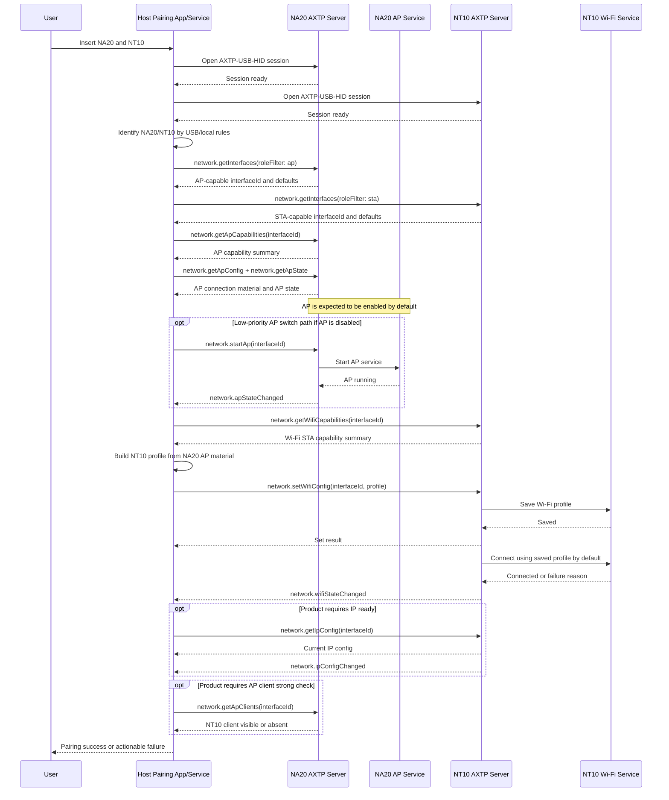

# Cast RX/TX Pairing Protocol Interaction Flow

> Status: flow design
> Scope: NA20 receiver AP management, NT10 transmitter Wi-Fi STA management, host pairing orchestration
> Source inputs: `workspace/business/cast-rxtx-paring.md`
> Protocol lifecycle: Stage 10 `plan-protocol-flow`

本文根据“投屏器发射/接收端配对流程”的业务需求，梳理上位机、NA20 接收端、NT10 发射端和 AXTP 协议之间的交互流程。本文不是最终协议事实源；已采纳事实以 `contract/registry/**/*.yaml`、`contract/registry/domains/**/*.yaml` 和 `contract/generated/**` 为准，新增或修改协议必须转入 `workspace/protocol/**` 草案和后续采纳流程。

Flow 文档负责：

- 描述业务场景和交互步骤。
- 判断每一步协议覆盖状态。
- 识别协议缺口。
- 将缺口路由到 candidate `domain.feature`。

Flow 文档不负责：

- 定义完整 method schema。
- 分配 methodId / eventId / errorCode / fieldId。
- 作为 runtime implementation contract。
- 替代 `workspace/protocol/<domain>/<feature>.md`。

完整 method / event / schema / capability 定义必须进入 `workspace/protocol/<domain>/<feature>.md`。

## 0. 速读结论

| 项目 | 内容 |
|---|---|
| Flow 目标 | Host 在同时接入 NA20 和 NT10 后，发现 AP/STA 接口，读取 NA20 AP 连接材料，写入 NT10 Wi-Fi STA profile，NT10 默认立即连接到新的 Wi-Fi，并按产品策略完成连接验收。 |
| 当前协议覆盖 | partial |
| 涉及 domain.feature | `network.interface`, `network.ap`, `network.wifi`, `network.ip` |
| 已有 adopted/generated | AXTP core/session/RPC、`AXTP-USB-HID` transport profile、core errors。 |
| 缺口 | `network.interface`、`network.ap`、`network.wifi`、`network.ip` 均仍为 draft；AP 默认开启、一次性凭据导出、接口选择和立即连接已有 flow 决策；USB 枚举、NA20/NT10 本地识别、本地配对编排、多设备选择和凭据日志策略属于 local-only。 |
| 是否需要新增协议草案 | yes，已有 draft 需继续按 Stage 20 收敛字段和采纳边界。 |
| 是否涉及 Legacy | yes，旧 AP/Wi-Fi 命令只作为迁移证据。 |
| 是否涉及 STREAM | no，本 flow 不覆盖投屏传流。 |
| 下一步 | 按本 flow 已确认的决策继续完善 `network.interface`、`network.ap`、`network.wifi`、`network.ip` 草案；本次不新增 `cast.pairing` 一键协议，不要求 `device.info` 承载设备角色区分。 |

## 1. Story Summary

| Item | Content |
|---|---|
| User goal | 用户将 NA20 和 NT10 同时插到上位机，两者自动完成配对：Host 读取 NA20 热点连接信息，并写入 NT10 的 Wi-Fi STA 配置。 |
| Trigger | 上位机检测到 NA20 和 NT10 通过 USB 接入，或用户在上位机软件中触发自动配对。 |
| Success result | NT10 保存 NA20 的 Wi-Fi profile，并默认立即关联到 NA20 AP；可选通过 IP ready 或 NA20 AP 客户端列表完成强校验。 |
| Primary actors | User, host pairing app/service, NA20 AXTP server, NT10 AXTP server, NA20 AP service, NT10 Wi-Fi service |
| Product scope | NA20 作为投屏接收端和 AP 端点；NT10 作为投屏发射端和 Wi-Fi STA；两者都通过 USB 与上位机交互。 |

## 2. Source Observations

### 2.1 UI / Prototype

| Screen or control | Observed behavior | Protocol relevance |
|---|---|---|
| USB 插入行为 | 用户把 NA20 和 NT10 插到有上位机的电脑上。 | 上位机发现两个 USB 设备并分别建立 AXTP 会话；USB 枚举和设备节点选择属于 local-only。 |
| 自动配对入口 | 原始需求倾向插入后自动完成配对，没有描述手动按钮或配对页面。 | 自动触发属于上位机编排；NA20/NT10 识别由 Host 本地完成，协议侧需要支持接口发现、AP 读取、STA profile 写入和状态观察。 |
| 配对进度 | 原始需求未描述 UI。 | `[REVIEW-ASK]` 是否需要展示“发现设备”“确认接口”“读取热点”“写入配置”“连接中”“连接成功/失败”等阶段。 |
| 多设备选择 | 原始需求未描述同时多台 NA20/NT10。 | 多设备策略由上位机决定，与 NA20/NT10 协议能力无关；属于 local-only 编排。 |

### 2.2 Requirement Notes

- NA20 自带 Wi-Fi 模块，作为 AP 端点，通过 USB 与上位机交互。
- NT10 自带 Wi-Fi 模块，作为 STA 端，连接到 NA20 后进行推流投屏，通过 USB 与上位机交互。
- 本需求只覆盖 NA20 热点功能管理、NT10 Wi-Fi 功能管理和两者配对流程。
- 本需求不覆盖投屏传流、音视频处理或设备升级。
- NA20 / NT10 的设备角色识别由 Host 基于 USB descriptor、本地规则或人工选择完成，不要求 `device.info` 提供配对角色字段。
- Host 不得假设设备内部网卡名；AP/STA 目标接口必须来自设备返回的 `interfaceId`、`roles` 和默认接口信息。
- `network.getInterfaces` 返回的 `roles` 和默认接口信息足以选择 AP/STA 目标接口。
- NA20 AP 默认始终开启；AP 开关方法可以增加，但不是配对 flow 的高优先级依赖。
- NA20 AP 的 SSID/密码由上位机可配置。
- NA20 AP 凭据允许通过 AXTP 一次性导出；日志策略和一次性导出的细节需要在后续协议草案阶段固化。
- NT10 写入新的 Wi-Fi profile 后，默认立即使用该新方案连接到新的 Wi-Fi。
- 旧协议中 APInfo、Wifi、OpenApService、CommonSetTailWiFiSSID 等 payload 可以提供字段级映射，作为 Stage 20 草案输入。

### 2.3 Device / System State Observations

| State | Meaning | Protocol relevance |
|---|---|---|
| host detected devices | Host 已在 USB 层发现候选设备。 | local-only / precondition；不一定需要 AXTP 查询。 |
| NA20 session ready | Host 已建立到 NA20 的 AXTP session。 | generated；后续可查询接口和 AP 能力。 |
| NT10 session ready | Host 已建立到 NT10 的 AXTP session。 | generated；后续可查询接口和写入 Wi-Fi profile。 |
| receiver/transmitter role known | Host 已区分 NA20 receiver 和 NT10 transmitter。 | local-only；来自 USB descriptor、本地设备匹配规则或人工选择，不由 `device.info` 决定。 |
| AP-capable interface known | Host 已从 NA20 的接口列表中选出 AP-capable `interfaceId`。 | draft；`network.interface` 是 `network.ap` 的前置发现层。 |
| STA-capable interface known | Host 已从 NT10 的接口列表中选出 STA-capable `interfaceId`。 | draft；`network.interface` 是 `network.wifi` 的前置发现层。 |
| AP running | NA20 AP 服务默认开启并可被 STA 连接。 | draft；`network.ap` 查询和事件表达 AP 服务状态；AP 开关能力为低优先级 optional。 |
| AP credential available | Host 通过 AXTP 一次性导出可安全写入 NT10 的连接材料。 | draft / security precondition；由 `network.ap` 的凭据导出策略决定。 |
| Wi-Fi profile saved | NT10 已保存 NA20 AP profile，并默认立即尝试使用新 profile 连接。 | draft；由 `network.wifi` 写入结果、状态查询和事件表达。 |
| STA associated | NT10 已完成 Wi-Fi 认证和关联。 | draft；由 `network.wifiStateChanged` 或 `network.getWifiState` 表达。 |
| IP ready | NT10 或 NA20 AP 本端地址已可用于后续业务。 | draft；`network.ip` 可选查询或订阅地址变化。 |
| client visible on AP | NA20 AP 客户端列表可看到 NT10。 | draft optional；用于强验收或诊断。 |

## 3. Assumptions And Non-Goals

| Type | Item | Status |
|---|---|---|
| Assumption | 上位机同时维护两条独立 AXTP-over-USB-HID 会话：一条到 NA20，一条到 NT10。 | `[REVIEW-DRAFT]` |
| Assumption | NA20 与 NT10 之间的配对由上位机编排完成，不要求 NA20 直接向 NT10 下发配置。 | `[REVIEW-DRAFT]` |
| Decision | NA20 / NT10 的设备角色识别属于 Host local-only，不通过 `device.info` 的配对角色字段区分。 | `[REVIEW-OK]` |
| Decision | Host 通过 `network.getInterfaces` 返回的 `roles` 和默认接口信息确认 AP/STA 角色，再把返回的 `interfaceId` 传入 `network.ap`、`network.wifi`、`network.ip`。 | `[REVIEW-OK]` |
| Assumption | AP 连接材料至少包含 SSID、安全类型和凭据材料；BSSID、频段、信道、IP 网段或设备标识是否进入配对材料待确认。 | `[REVIEW-DRAFT]` |
| Assumption | NT10 写入 profile 后默认持久化，重启或重新插拔后仍能连接 NA20，除非产品定义临时配对。 | `[REVIEW-DRAFT]` |
| Decision | NA20 AP 默认始终开启；配对流程默认不需要启动 AP，AP 开关方法可作为低优先级 optional 能力。 | `[REVIEW-OK]` |
| Decision | NA20 AP 的 SSID/密码由上位机可配置。 | `[REVIEW-OK]` |
| Decision | NA20 AP 凭据允许通过 AXTP 一次性导出，再由 Host 写入 NT10。 | `[REVIEW-OK]` |
| Decision | 多台 NA20/NT10 同时接入时，配对策略由上位机决定，与 NA20 或 NT10 本身无关。 | `[REVIEW-OK]` |
| Decision | NT10 写入 Wi-Fi 配置后默认立即使用新的 profile 连接到新的 Wi-Fi。 | `[REVIEW-OK]` |
| Non-goal | 不设计 NA20 与 NT10 之间的投屏传流协议。 | `[REVIEW-OK]` |
| Non-goal | 不设计固件升级、音视频流、设备云端绑定或账号权限。 | `[REVIEW-OK]` |
| Non-goal | 默认不新增跨设备的 `cast.pairing` 一键方法；优先由上位机编排多个 network 能力。 | `[REVIEW-OK]` |
| Non-goal | 本文不定义完整 schema，不复制 network 草案字段表，不写入 registry 或 generated 输出。 | `[REVIEW-OK]` |

## 4. Protocol Coverage

| Need | Coverage state | AXTP protocol | Evidence | Next action |
|---|---|---|---|---|
| 上位机与 NA20/NT10 建立 USB AXTP 会话 | generated | `AXTP-USB-HID`, AXTP session/RPC lifecycle | `contract/generated/protocol.md`, `contract/protocol/axtp.protocol.yaml` | 可按 generated core 实现。 |
| 枚举本机 USB 设备节点并形成配对候选集 | local-only | Host USB enumeration | `workspace/business/cast-rxtx-paring.md` | Host/runtime 实现，不进入 AXTP business protocol。 |
| 识别哪个设备是 NA20、哪个是 NT10 | local-only | USB descriptor, Host local selection | `workspace/business/cast-rxtx-paring.md` | 由 Host 基于 USB descriptor、本地设备匹配规则或人工选择完成；不进入 `device.info`。 |
| 查询 NA20 / NT10 网络接口并选择目标接口 | draft | `network.getInterfaces`, `network.getInterfaceInfo`, `network.interfaceStateChanged` | `workspace/protocol/network/network.interface.md` | 已确认 `roles` 和默认接口信息足以选择 AP/STA；Stage 20 固化默认接口语义和 `interfaceId` 稳定性。 |
| 查询 NA20 AP 能力、配置和状态 | draft | `network.getApCapabilities`, `network.getApConfig`, `network.getApState` | `workspace/protocol/network/network.ap.md` | 已确认 AP 默认开启、SSID/密码由上位机可配置、凭据可通过 AXTP 一次性导出；Stage 20 固化字段和安全语义。 |
| 低优先级 AP 开关控制 | draft | `network.startAp`, `network.stopAp`, `network.apStateChanged` | `workspace/protocol/network/network.ap.md` | AP 默认开启，配对主路径不依赖 start；开关方法可作为 optional。 |
| 查询 NT10 Wi-Fi STA 能力 | draft | `network.getWifiCapabilities`, `network.getWifiConfig` | `workspace/protocol/network/network.wifi.md` | 确认 profile 保存能力、支持安全类型和凭据导入能力。 |
| 将 NA20 AP 连接材料写入 NT10 | draft | `network.setWifiConfig`, `network.wifiConfigChanged` | `workspace/protocol/network/network.wifi.md` | 已确认写入后默认立即连接；Stage 20 固化 profile 保存和默认连接语义。 |
| 观察 NT10 连接 NA20 AP 的 STA 状态 | draft | `network.getWifiState`, `network.wifiStateChanged`, optional `network.connectWifi` | `workspace/protocol/network/network.wifi.md` | 确认扫描、认证、关联、断开的状态枚举和失败原因；显式 connect 方法可保留为手动重连能力。 |
| 配对后检查 NT10 IP 或 NA20 AP 本端 IP | draft | `network.getIpConfig`, `network.ipConfigChanged` | `workspace/protocol/network/network.ip.md` | 确认配对验收是否需要 IP ready，以及查询哪个 `interfaceId`。 |
| 在 NA20 端验证 NT10 客户端可见 | draft | `network.getApClients`, `network.apClientChanged` | `workspace/protocol/network/network.ap.md` | 若作为强验收，确认客户端列表字段和隐私策略。 |
| 上位机本地编排、重试、多设备策略、进度展示和凭据日志策略 | local-only | Host pairing app/service | `workspace/business/cast-rxtx-paring.md` | 多设备配对由 Host 决定；App/runtime 行为实现，安全策略可作为产品规范，不进入 AXTP schema。 |

Coverage 取值：

| Coverage | Meaning |
|---|---|
| generated | 已进入 `contract/generated/**` 或 protocol IR，可作为实现合同视图。 |
| adopted | 已写入 registry YAML，但当前 flow 未直接引用 generated 输出。 |
| draft | 已有 `workspace/protocol/**` 草案，但尚未 adopted/generated。 |
| missing | 没有合适的 adopted/generated/draft 协议覆盖。 |
| local-only | App/UI/runtime 本地逻辑，不需要 AXTP 协议。 |
| non-protocol | 产品规则、人工流程、运营策略或文档说明，不进入协议。 |

## 5. End-To-End Sequence

## 6. Interaction Steps

| Step | Actor | Action | Capability / precondition | Protocol call/event | Payload fields | Result / state change | Coverage | Error / fallback |
|---:|---|---|---|---|---|---|---|---|
| 1 | User / Host | 用户插入 NA20 和 NT10。 | Host 可枚举 USB HID 设备。 | USB enumeration | USB descriptor summary | 进入自动配对候选集。 | local-only | 只发现一个设备时等待另一个设备或提示缺失。 |
| 2 | Host | 分别建立到两个设备的 AXTP 会话。 | `AXTP-USB-HID` supported。 | AXTP session lifecycle | session handshake | 两个设备均可接收 RPC。 | generated | 任一会话失败则中止配对并提示设备连接异常。 |
| 3 | Host | 判断 NA20 / NT10。 | USB descriptor、本地设备匹配规则或人工选择可区分 NA20/NT10。 | local-only | USB descriptor, host selection metadata | 标记 NA20 receiver 与 NT10 transmitter。 | local-only | 若无法区分，不自动猜测，转人工选择或失败。 |
| 4 | Host / NA20 | 查询 NA20 网络接口，选择 AP-capable `interfaceId`。 | NA20 session ready。 | `network.getInterfaces`, optional `network.getInterfaceInfo` | role filter: `ap`, defaults | Host 获得后续 AP/IP 调用目标接口。 | draft | 未返回 AP role 时中止或提示固件不支持；不得硬编码内部网卡名。 |
| 5 | Host / NT10 | 查询 NT10 网络接口，选择 STA-capable `interfaceId`。 | NT10 session ready。 | `network.getInterfaces`, optional `network.getInterfaceInfo` | role filter: `sta`, defaults | Host 获得后续 Wi-Fi/IP 调用目标接口。 | draft | 未返回 STA role 时中止或提示固件不支持；不得硬编码内部网卡名。 |
| 6 | Host / NA20 | 检查 NA20 AP 能力。 | AP-capable `interfaceId` known。 | `network.getApCapabilities` | interfaceId | 确认安全类型、频段、凭据导出和启停能力。 | draft | 不支持时中止配对；能力缺失时进入产品兼容处理。 |
| 7 | Host / NA20 | 获取 NA20 AP 配置和状态。 | AP capability supports read；AP 默认开启。 | `network.getApConfig`, `network.getApState` | interfaceId, config sections | 通过 AXTP 一次性导出可写入 NT10 的 AP 连接材料，并确认 AP service state。 | draft | 凭据导出失败时中止；不得把敏感凭据写入普通日志。 |
| 8 | Host / NA20 | 低优先级可选：若 AP 被关闭且产品允许开关控制，则启动 NA20 AP。 | AP start supported；产品允许。 | `network.startAp`, `network.apStateChanged` | interfaceId, timeout policy | NA20 AP 服务进入 running。 | draft | 配对主路径默认不依赖此步骤；启动失败、忙碌或策略禁止时中止并提示。 |
| 9 | Host | 构造 NT10 Wi-Fi profile。 | NA20 AP 连接材料完整。 | local-only | SSID, security, credential material, persist policy, default connect policy | 得到一份待写入 NT10 的 profile。 | local-only | 字段缺失时中止；明文凭据不得进入普通日志。 |
| 10 | Host / NT10 | 检查 NT10 Wi-Fi 能力。 | STA-capable `interfaceId` known。 | `network.getWifiCapabilities` | interfaceId | 确认 NT10 可保存 profile 并连接 NA20 AP。 | draft | 不支持时中止配对；提示固件不支持。 |
| 11 | Host / NT10 | 写入 NA20 AP profile 到 NT10。 | NT10 支持 STA profile 保存。 | `network.setWifiConfig`, optional `network.wifiConfigChanged` | interfaceId, profile summary, persist policy | NT10 保存 Wi-Fi profile，并默认立即使用新 profile 发起连接。 | draft | 参数非法、凭据不被接受或存储失败时回滚/提示失败。 |
| 12 | NT10 | 默认连接新的 Wi-Fi profile。 | profile 已保存。 | `network.wifiStateChanged`, optional `network.connectWifi` for manual retry | interfaceId, profile reference, state/reason | NT10 开始扫描、认证和关联 NA20 AP。 | draft | 连接超时或认证失败需给出失败原因；显式 connect 方法可用于手动重试。 |
| 13 | NT10 / Host | 观察 NT10 Wi-Fi 状态。 | Event supported or polling fallback。 | `network.wifiStateChanged`, `network.getWifiState` | interfaceId, state, reason, profile reference | Host 判定 STA 是否已完成关联。 | draft | 未收到事件时轮询；认证失败时重新读取 AP 材料或提示用户。 |
| 14 | Host / NT10 | 可选：确认 NT10 IP ready。 | 产品要求连接后具备 IP 地址。 | `network.getIpConfig`, `network.ipConfigChanged` | interfaceId, address family | Host 确认 NT10 已获得当前有效地址。 | draft | 若产品只要求 Wi-Fi 关联，可跳过；地址获取超时需独立错误提示。 |
| 15 | Host / NA20 | 可选：确认 NA20 AP 本端 IP ready。 | 后续业务依赖 AP 本端地址或网段。 | `network.getIpConfig`, `network.ipConfigChanged` | interfaceId, address family | Host 获得 NA20 AP 本端地址摘要。 | draft | 不作为默认配对条件，除非产品验收要求。 |
| 16 | Host / NA20 | 可选：在 NA20 AP 客户端列表确认 NT10。 | AP clients query supported。 | `network.getApClients`, `network.apClientChanged` | interfaceId, client identifier summary | NA20 看到 NT10 客户端，配对强校验通过。 | draft | 不支持客户端列表时，以 NT10 Wi-Fi state 或 IP ready 作为验收依据。 |
| 17 | Host | 完成配对并记录结果。 | 成功条件已满足。 | local-only | device serials, pair time, profile reference | 用户看到配对成功。 | local-only | 失败结果保留可诊断原因；不得保存明文凭据。 |

## 7. State Changes And Events

| State change | Trigger | Event needed | Payload | Client handling | Coverage |
|---|---|---|---|---|---|
| Interface appears/disappears | 设备启动、USB 会话建立后网络接口可见性变化 | `network.interfaceStateChanged` | interfaceId, role summary, admin/basic link state, reason | 更新 Host 选择到的 AP/STA 接口；若目标接口消失则中止或重新发现。 | draft |
| Interface enabled/disabled or basic link changed | 设备策略、管理员操作或底层链路变化 | `network.interfaceStateChanged` | interfaceId, admin state, link state | 不把 Wi-Fi 认证、AP running 或 IP 地址变化混入 interface 事件。 | draft |
| AP service started/stopped | 低优先级 AP 开关调用或设备策略变化 | `network.apStateChanged` | interfaceId, AP service state, reason | AP 默认开启；只有 AP 被关闭或做诊断/管理操作时才依赖该事件。 | draft |
| AP config changed | AP 配置被本会话、其他会话或设备策略改变 | `network.apConfigChanged` | interfaceId, config summary, credential policy marker | 若配对中发生变化，重新读取 AP config 并重建 NT10 profile。 | draft |
| Wi-Fi profile saved/changed | Host 写入 NT10 profile 或设备策略变更 | `network.wifiConfigChanged` | interfaceId, profile summary, change reason | 更新本地配对记录；不展示敏感凭据；写入后默认进入连接流程。 | draft |
| STA scanning/auth/associated/disconnected | 写入新 profile 后默认连接，或 Host 手动重试连接 | `network.wifiStateChanged` | interfaceId, Wi-Fi role state, reason, profile reference | 展示连接进度，关联成功后可进入 IP ready 检查。 | draft |
| IP address ready/changed | DHCP/static 地址变化或地址失效 | `network.ipConfigChanged` | interfaceId, address family, config summary, reason | 若验收要求 IP ready，则在有效地址出现后通过。 | draft |
| AP client joined/left | NT10 连接或断开 NA20 AP | `network.apClientChanged` | interfaceId, client summary, join/leave reason | 作为强校验或诊断信号；不替代 Wi-Fi/IP 状态。 | draft |

## 8. Protocol Details

### 8.1 Adopted / Generated Protocols

| Method/Event/Profile | Purpose in this flow | Source |
|---|---|---|
| `AXTP-USB-HID` | 上位机通过 USB HID 与 NA20、NT10 分别建立 AXTP 会话。 | `contract/generated/protocol.md`, `contract/protocol/axtp.protocol.yaml` |
| AXTP session / RPC lifecycle | Host 在 session ready 后发起业务 RPC；连接、握手、基础错误按 generated core 处理。 | `contract/generated/protocol.md`, `specs/1-core/06-RPC-Session.md` |

当前 generated 协议没有 adopted `network.*` 业务方法。因此下面的方法名只能作为草案依赖引用，不能作为实现合同；`device.info` 不作为本 flow 的设备识别依赖。

### 8.2 Draft Or Missing Protocol Gaps

| Gap | Candidate domain.feature | Candidate method/event/schema | Routed skill | Review question |
|---|---|---|---|---|
| AP/STA 接口发现规则和默认接口语义需要固化。 | `network.interface` | `network.getInterfaces`, `network.getInterfaceInfo`, `network.interfaceStateChanged` | `tooling/skills/20-draft-business-protocol/SKILL.md` | `[REVIEW-OK]` `roles` 和默认接口信息足以选择 AP/STA。 |
| NA20 AP 凭据通过 AXTP 一次性导出的语义需要固化。 | `network.ap` | `network.getApCapabilities`, `network.getApConfig`, credential export schema | `tooling/skills/20-draft-business-protocol/SKILL.md` | `[REVIEW-OK]` 允许一次性导出；Stage 20 定义导出次数、有效期和脱敏规则。 |
| NA20 AP 默认开启；AP 开关方法低优先级。 | `network.ap` | `network.startAp`, `network.stopAp`, `network.getApState`, `network.apStateChanged` | `tooling/skills/20-draft-business-protocol/SKILL.md` | `[REVIEW-OK]` 配对主路径不依赖自动启动 AP；开关能力可 optional。 |
| NA20 AP 客户端列表是否作为配对成功强校验。 | `network.ap` | `network.getApClients`, `network.apClientChanged` | `tooling/skills/20-draft-business-protocol/SKILL.md` | `[REVIEW-ASK]` 是否必须在 NA20 AP 客户端列表中看到 NT10 才算成功？ |
| NT10 Wi-Fi profile 写入后默认立即连接的语义需要固化。 | `network.wifi` | `network.setWifiConfig`, optional `network.connectWifi`, `network.getWifiState`, `network.wifiStateChanged` | `tooling/skills/20-draft-business-protocol/SKILL.md` | `[REVIEW-OK]` 写入后默认使用新 profile 连接；Stage 20 定义是否需要 `connectAfterSave` 字段或显式重试方法。 |
| 配对后是否需要 IP ready 作为验收条件。 | `network.ip` | `network.getIpConfig`, `network.ipConfigChanged` | `tooling/skills/20-draft-business-protocol/SKILL.md` | `[REVIEW-ASK]` 验收需要检查 NT10 IP、NA20 AP 本端 IP，还是只检查 Wi-Fi 关联？ |
| 多设备配对属于上位机本地流程。 | local-only | Host pairing orchestration, local credential handling | runtime / product security work | `[REVIEW-OK]` 多台 NA20/NT10 同时接入时由 Host 决定配对策略。 |
| 旧协议 payload 可提供字段级映射。 | `network.ap`, `network.wifi` | Legacy APInfo / Wifi / OpenApService / CommonSetTailWiFiSSID mapping | `tooling/skills/20-draft-business-protocol/SKILL.md` | `[REVIEW-OK]` Stage 20 可补字段级 legacy evidence。 |

### 8.3 Candidate Payload Semantics

下面只记录 flow 阶段需要的业务语义片段，不定义完整 schema，不展示 wire envelope。

| Candidate payload | Required semantic fields in this flow | Notes |
|---|---|---|
| Interface query filter | desired role `ap` or `sta`; optional interface type filter | 返回值必须能让 Host 选择设备返回的 `interfaceId`。 |
| AP capability summary | interfaceId, supported security types, one-time credential export support, optional start/stop support, client list support | `network.ap` 只描述 AP 配置、凭据、启停和 AP 服务状态；AP 默认开启，开关低优先级。 |
| AP config summary | interfaceId, SSID, security type, one-time exported credential material, band/channel summary if available | SSID/密码由上位机可配置；敏感字段只在可信本地链路和产品允许策略下传递。 |
| Wi-Fi capability summary | interfaceId, supported security types, profile storage support, scan/connect support, credential import modes | `network.wifi` 只描述 STA profile、扫描、认证、关联和断开。 |
| Wi-Fi profile write summary | interfaceId, SSID, security type, credential material, persistence policy, default immediate connect policy | 写入后默认立即连接；是否用字段表达或显式重试方法由 Stage 20 定稿。 |
| IP ready summary | interfaceId, address family, effective address presence, mode and source summary | `network.ip` 只描述地址配置和地址变化，不表达 Wi-Fi/AP 角色状态。 |
| AP client summary | interfaceId, opaque client identifier, join/leave state, optional signal fields | 若涉及 MAC 等标识，需确认隐私和日志策略。 |

安全规则：

- AP 凭据允许通过 AXTP 一次性导出，只能在本地可信链路内传递，优先限定为上位机到设备的 USB AXTP 会话。
- 上位机不得把明文凭据写入普通日志、崩溃报告或可同步的配置文件。
- 一次性导出的有效期、重复导出行为、脱敏返回和是否绑定 NT10 设备身份，需要在 `network.ap` 草案中定稿。

## 9. Test / Conformance Notes

| Case | Given | When | Then | Protocol evidence |
|---|---|---|---|---|
| happy path | Host 发现一台 NA20 和一台 NT10，并建立两条 AXTP-over-USB-HID 会话 | Host 发现 AP/STA 接口，读取 AP config，写入 NT10 profile | NT10 保存 profile 并默认立即连接；若要求验证则完成 IP 或 AP client 验收 | generated core, `network.getInterfaces`, `network.getApConfig`, `network.setWifiConfig`, `network.wifiStateChanged` |
| no hard-coded interface | 设备返回的 AP/STA `interfaceId` 不是 Host 预设名称 | Host 执行配对 | Host 使用设备返回的 `interfaceId` 调用 AP/Wi-Fi/IP 方法 | `network.getInterfaces`, `network.getInterfaceInfo` |
| unsupported role | NA20 未返回 AP-capable 接口或 NT10 未返回 STA-capable 接口 | Host 查询接口 | Host 中止配对并提示固件不支持，不继续猜测接口 | `network.getInterfaces` |
| AP switch optional | NA20 AP 被关闭且产品允许低优先级 AP 开关控制 | Host 调用 AP start | AP running 后继续配对；默认设备不应进入该分支 | `network.startAp`, `network.apStateChanged` |
| one-time credential export | NA20 支持通过 AXTP 一次性导出 AP 凭据 | Host 请求 AP config | Host 获得一次性凭据材料并写入 NT10，不泄露到普通日志 | `network.getApCapabilities`, `network.getApConfig` |
| Wi-Fi auth failed | NT10 写入后连接失败 | NT10 上报 STA 状态 | Host 显示认证失败并避免误报配对成功 | `network.wifiStateChanged` |
| IP ready required | 产品要求连接后具备 IP 地址 | Host 观察 Wi-Fi connected 后查询 IP | 有效地址出现后才通过验收 | `network.getIpConfig`, `network.ipConfigChanged` |
| AP client strong check | 产品要求 NA20 端强校验 | Host 查询 AP clients | NT10 客户端可见才通过强校验 | `network.getApClients`, `network.apClientChanged` |
| multiple devices | Host 同时发现多个 NA20 或多个 NT10 | 自动配对触发 | 配对策略完全由上位机决定，设备侧协议不承载该策略 | local host orchestration |
| persist after replug | NT10 已保存 profile | 重新插拔或重启 NT10 | NT10 仍保留 NA20 Wi-Fi profile，除非产品定义临时配对 | `network.setWifiConfig` persist semantics |

## 10. Acceptance Gates

- 上位机能稳定发现并区分 NA20 和 NT10；多设备场景不发生误配。
- Host 必须通过设备返回的 `interfaceId` 和 `roles` 选择 AP/STA 目标接口，不硬编码内部网卡名。
- `network.getInterfaces` 返回的 `roles` 和默认接口信息足以作为 AP/STA 接口选择依据。
- NA20 AP 默认开启；AP 开关方法属于低优先级 optional，不是配对主路径的前置条件。
- NA20 AP 的 SSID/密码可由上位机配置。
- NA20 AP 凭据能通过 AXTP 一次性导出，并能转成 NT10 Wi-Fi profile。
- NT10 能保存 NA20 Wi-Fi profile，并默认立即使用新的 profile 连接；必须能报告连接成功或可诊断失败原因。
- 如果产品要求 IP ready，验收必须通过 `network.ip` 查询或事件确认有效地址。
- 如果产品要求 NA20 AP 客户端强校验，必须确认 `network.getApClients` / `network.apClientChanged` 是否进入 MVP 或 optional。
- 明文 AP 密码不得进入普通日志、本地持久化记录或非必要 UI。
- 多设备自动配对策略由上位机负责，不进入 NA20/NT10 设备侧协议。
- 旧协议 APInfo、Wifi、OpenApService、CommonSetTailWiFiSSID 等 payload 的字段级映射可作为 Stage 20 evidence。
- 所有 `network.interface`、`network.ap`、`network.wifi`、`network.ip` 依赖在采纳前都只能作为草案依赖，不得按 generated 实现合同开发。
- 本流程不修改 registry、generated 或 Protocol IR；后续协议事实必须通过 Stage 20/30/50 工作流进入正式生成路径。

## 11. Open Questions

| Question | Impact | Owner | Status | Next action |
|---|---|---|---|---|
| `cast-rxtx-paring` 文件名是否沿用当前拼写，还是后续统一改为 `cast-rxtx-pairing`？ | docs | TBD | REVIEW-ASK | 如要改名，应单独处理链接迁移。 |
| Host 识别 NA20/NT10 是否需要 `device.info`？ | protocol / firmware | Host | DECISION | 不需要；NA20/NT10 识别由 USB descriptor、本地规则或人工选择完成，`device.info` 不承载配对角色区分。 |
| `network.getInterfaces` 返回的 `roles` 和默认接口信息是否足以选择 AP/STA 接口？ | protocol / firmware | TBD | DECISION | 是；Stage 20 将该规则固化到 `network.interface` 草案。 |
| NA20 AP 是否始终开启，还是配对流程需要在必要时启动 AP？ | product / protocol | TBD | DECISION | NA20 AP 默认始终开启；AP 开关方法可增加，但优先级不高。 |
| NA20 AP 的 SSID/密码是固定出厂值、运行时生成值，还是由上位机/用户可配置？ | product / protocol | TBD | DECISION | 由上位机可配置；Stage 20 固化到 `network.ap` 配置语义。 |
| NA20 AP 凭据是否允许通过 AXTP 导出，还是应返回一次性 token / opaque credential？ | security / protocol | TBD | DECISION | 允许通过 AXTP 一次性导出凭据；Stage 20 定义导出细节和日志脱敏规则。 |
| NT10 写入 Wi-Fi 后是否立即连接，还是只保存 profile？ | product / firmware | TBD | DECISION | 立即连接；写入后默认使用新的 profile 连接到新的 Wi-Fi。 |
| 配对成功是否必须确认 IP ready？ | product / conformance | TBD | REVIEW-ASK | 决定是否把 `network.getIpConfig` / `network.ipConfigChanged` 纳入验收。 |
| 配对成功是否需要 NA20 AP 客户端列表确认，还是 NT10 自身 Wi-Fi 状态即可？ | product / conformance | TBD | REVIEW-ASK | 决定是否要求 `network.getApClients` 和 `network.apClientChanged`。 |
| 多台 NA20/NT10 同时接入时，是按绑定记录、人工选择、序列号排序，还是禁止自动配对？ | product / UX / runtime | Host | DECISION | 由上位机决定，与 NA20 或 NT10 本身无关。 |
| 旧协议中 APInfo、Wifi、OpenApService、CommonSetTailWiFiSSID 等条目的 payload 是否能提供字段级映射？ | legacy | TBD | DECISION | 能；Stage 20 补字段级 legacy mapping evidence。 |
