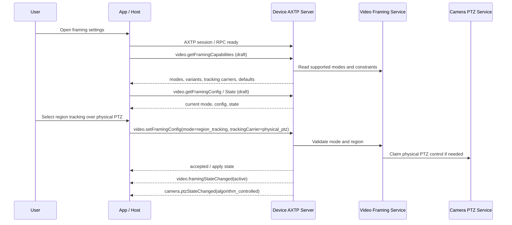

# Video Framing Modes Protocol Interaction Flow

> Status: flow design
> Scope: Camera/video framing mode discovery, mode switching, mode-specific configuration, and state synchronization
> Source inputs: `workspace/business/video-framing-modes.md`, `workspace/protocol/video/video.framing.md`, `workspace/protocol/camera/camera.ptz.md`, `workspace/legacy-migration/classification/video.md`, `contract/generated/protocol.md`
> Protocol lifecycle: Stage 10 `plan-protocol-flow`

本文根据 video framing 业务需求，梳理 App / Host 查询构图能力、加载当前模式、切换模式、配置区域追踪或 gallery / speaker tracking 参数、接收状态变化和处理错误的 AXTP 交互流程。

本文不是最终协议事实源。当前 generated 协议没有 `video.framing` 的业务 method / event；相关能力仍处于 `workspace/protocol/video/video.framing.md` 草案阶段。Flow 文档只负责描述场景、覆盖状态和协议缺口，不定义完整 method / event / schema。

## 0. 速读结论

| 项目 | 内容 |
|---|---|
| Flow 目标 | 让 App / Host 能展示并控制全景、auto framing、区域追踪、gallery、无上边条 gallery、speaker tracking 等构图模式。 |
| 当前协议覆盖 | partial |
| 涉及 domain.feature | `video.framing`, `camera.ptz`; related `video.layout` / `output.layout` as boundary only |
| 已有 adopted/generated | AXTP session/RPC envelope、core errors；无 generated `video.framing` 业务方法。 |
| 缺口 | `video.framing` 尚未 generated；模式枚举、区域追踪 PTZ 承载方式、gallery/no-top-bar gallery、speaker tracking 参数和状态事件需要草案补齐。 |
| 是否需要新增协议草案 | no，已有 `video.framing` 草案；需要后续修订/采纳。 |
| 是否涉及 Legacy | yes |
| 是否涉及 STREAM | no，本 flow 只控制构图；视频帧数据走 `video.stream`。 |
| 下一步 | draft protocol；修订 `workspace/protocol/video/video.framing.md` 后进入 adoption。 |

## 1. Story Summary

| Item | Content |
|---|---|
| User goal | 用户在视频设置页查看设备支持的构图模式，并切换到全景、智能取景、区域追踪、gallery 或 speaker tracking 等目标模式。 |
| Trigger | App / Host 建立 AXTP session 后打开视频构图设置页，或用户通过 UI / 遥控器 / 旧协议触发模式切换。 |
| Success result | App 展示能力、当前模式和运行状态；用户设置成功后设备进入目标 framing mode；本地或外部变化能同步回 App。 |
| Primary actors | User, App / Host, Device AXTP server, video framing service, optional camera PTZ service, audio/speaker detection service |
| Product scope | 支持智能构图、区域追踪、gallery 或 speaker tracking 的会议摄像设备。 |

## 2. Source Observations

### 2.1 UI / Prototype

| Screen or control | Observed behavior | Protocol relevance |
|---|---|---|
| Framing mode selector | 用户选择 panorama / auto framing / region tracking / gallery / speaker tracking。 | 查询支持的 modes，设置 mode，监听 mode/config/state 变化。 |
| Region tracking editor | 用户选择追踪区域和 tracking carrier。 | 设置区域坐标、`trackingCarrier=physical_ptz` 或 `electronic_ptz`。 |
| Gallery option | 用户选择普通 gallery 或无上边条 gallery。 | 模式或 config 字段需要区分 gallery variant。 |
| Speaker tracking option | 用户设置 speaker tracking 和延迟/策略。 | 需要 speaker tracking 参数和运行态；可能依赖音频算法可用性。 |
| Apply / Reset buttons | 用户保存或恢复默认 framing 配置。 | set/reset config；失败时需要错误原因。 |

### 2.2 Requirement Notes

- framing 是视频构图控制面，不是 AXTP core frame。
- 同一时刻默认只有一个主 framing mode 生效。
- 区域追踪 over physical PTZ 会驱动物理云台，可能影响 `camera.ptz` 状态。
- 区域追踪 over electronic PTZ 只影响裁切/取景，不应伪造物理 PTZ 位置变化。
- gallery 与无上边条 gallery 需要明确是 mode variant 还是 overlay/layout 参数。
- speaker tracking 可能依赖音频定位服务，需可表达 unavailable / degraded。

### 2.3 Device / System State Observations

| State | Meaning | Protocol relevance |
|---|---|---|
| capability loaded | 设备已返回支持的 framing modes 和每种模式配置项。 | query；`video.getFramingCapabilities` draft。 |
| config loaded | App 已加载当前 mode 和配置。 | query；`video.getFramingConfig` / `video.getFramingMode` draft。 |
| applying | 设备正在切换模式或重新配置算法。 | result/event；需要 apply state。 |
| active | 目标 mode 已生效。 | result/event；刷新 UI。 |
| degraded | 算法可用但受摄像头、音频、隐私或低光限制。 | event/state；展示原因。 |
| unavailable | framing 服务不可用或被其他功能占用。 | error/state；禁用相关操作。 |

## 3. Assumptions And Non-Goals

| Type | Item | Status |
|---|---|---|
| Assumption | `video.framing` 承载构图算法模式；`camera.ptz` 只承载物理云台状态和手动控制。 | `[REVIEW-DRAFT]` |
| Assumption | 区域追踪 over physical PTZ / electronic PTZ 先建模为 region tracking 的 `trackingCarrier` 配置。 | `[REVIEW-DRAFT]` |
| Assumption | gallery 与 no-top-bar gallery 先建模为 gallery variant，后续评审决定是否拆到 overlay/layout。 | `[REVIEW-DRAFT]` |
| Question | speaker tracking 的音频定位依赖是否需要引用 `audio.algorithm` capability？ | `[REVIEW-ASK]` |
| Non-goal | 不传输视频帧，不定义视频编码参数。 | `[REVIEW-OK]` |
| Non-goal | 不定义 PTZ joystick 和 preset 的完整控制流程。 | `[REVIEW-OK]` |

## 4. Protocol Coverage

| Need | Coverage state | AXTP protocol | Evidence | Next action |
|---|---|---|---|---|
| 建立 AXTP session 和 RPC 调用 | generated | AXTP RPC/session | `contract/generated/protocol.md` | 可按 generated core 实现。 |
| 查询 framing 能力 | draft | `video.getFramingCapabilities` | `workspace/protocol/video/video.framing.md` | 补齐 modes、variants、tracking carriers、config ranges。 |
| 查询当前 mode/config/state | draft | `video.getFramingMode`, `video.getFramingConfig`, `video.getFramingState` | `workspace/protocol/video/video.framing.md` | 统一是否保留 mode 独立方法或收敛到 config/state。 |
| 设置 framing mode | draft | `video.setFramingMode` / `video.setFramingConfig` | `workspace/protocol/video/video.framing.md` | 增加 mode enum 和 apply state。 |
| 配置区域追踪 | draft | `video.setFramingConfig` | `workspace/protocol/video/video.framing.md` | 补 `trackingRegion`, `trackingCarrier`, horizontal/vertical strategy。 |
| gallery / no-top-bar gallery | missing/draft | `video.framing` candidate fields | business requirement | 在 `video.framing` 草案中补 gallery variant 或路由到 `video.layout`。 |
| speaker tracking 参数 | draft | `video.setFramingConfig`; possible audio dependency | `workspace/protocol/video/video.framing.md`, legacy classification | 补 delay/strategy/dependency/unavailable reason。 |
| framing 状态变化事件 | draft | `video.framingConfigChanged`, `video.framingModeChanged`, `video.framingStateChanged` | `workspace/protocol/video/video.framing.md`, appendix event candidates | 确认事件命名和 payload 是完整状态还是 patch。 |
| 物理 PTZ 被算法接管 | draft | `camera.ptzStateChanged` plus framing state | `workspace/protocol/camera/camera.ptz.md` | 明确手动 PTZ 与 framing 算法的冲突策略。 |

Coverage 取值：`generated` 表示已进入 generated；`draft` 表示已有 `workspace/protocol/**` 草案；`missing` 表示还没有合适草案；`local-only` 表示 App 本地逻辑。

## 5. End-To-End Sequence

## 6. Interaction Steps

| Step | Actor | Action | Capability / precondition | Protocol call/event | Payload fields | Result / state change | Coverage | Error / fallback |
|---:|---|---|---|---|---|---|---|---|
| 1 | App | 建立连接并加载 generated registry。 | AXTP session ready。 | generated RPC/session | session fields | 可调用设备 RPC。 | generated | 连接失败则不可进入页面。 |
| 2 | App / Device | 查询 framing 能力。 | `video.framing` supported。 | `video.getFramingCapabilities` | cameraId/source optional | 返回 modes、默认值、可配置项。 | draft | 不支持时隐藏 framing 设置或展示 unsupported。 |
| 3 | App / Device | 查询当前配置和运行态。 | capability loaded。 | `video.getFramingConfig`, `video.getFramingState` | selector | 返回当前 mode/config/state。 | draft | 读取失败时展示未知状态并允许重试。 |
| 4 | User / App | 用户选择全景或 auto framing。 | mode supported。 | local validation + `video.setFramingMode` or `setFramingConfig` | mode | 设备接受并进入 applying/active。 | draft | mode 不支持返回 `NOT_SUPPORTED`。 |
| 5 | User / App | 用户设置区域追踪 over physical PTZ。 | region tracking + physical PTZ supported。 | `video.setFramingConfig` | mode, trackingRegion, trackingCarrier | framing 接管 PTZ，状态变 active。 | draft | PTZ busy 返回 `BUSY` 或 `DEVICE_MODE_CONFLICT`。 |
| 6 | User / App | 用户设置区域追踪 over electronic PTZ。 | electronic crop supported。 | `video.setFramingConfig` | mode, trackingRegion, trackingCarrier | 只改变 framing crop，不改变物理 PTZ。 | draft | 低分辨率/视场限制返回 out-of-range 或 unavailable。 |
| 7 | User / App | 用户启用 gallery 或 no-top-bar gallery。 | gallery variant supported。 | `video.setFramingConfig` | mode=gallery, variant | 输出 gallery 构图。 | missing/draft | 若实际属于 layout/overlay，则 route 到对应 protocol。 |
| 8 | User / App | 用户启用 speaker tracking。 | speaker detection available。 | `video.setFramingConfig` | mode=speaker_tracking, delay/strategy | 设备跟踪发言人。 | draft | 音频定位不可用时返回 unavailable reason。 |
| 9 | Device / App | 设备主动上报状态变化。 | event subscribed。 | `video.framingConfigChanged` / `StateChanged` | changedFields, state, reason | App 刷新当前模式和状态。 | draft | 事件丢失后调用 get 校准。 |
| 10 | User / App | 恢复默认 framing 设置。 | reset supported。 | candidate reset or `setFramingConfig(default)` | scope | 设备回到默认模式。 | draft/missing | reset method 是否需要独立定义待确认。 |

## 7. State Changes And Events

| State change | Trigger | Event needed | Payload | Client handling | Coverage |
|---|---|---|---|---|---|
| framing config changed | set config、reset、profile、legacy adapter、本地按键 | `video.framingConfigChanged` | changedFields, config, reason | 直接刷新 UI 或调用 get 校准。 | draft |
| framing mode changed | 主模式切换 | `video.framingModeChanged` candidate | mode, previousMode, reason | 更新 mode selector。 | draft |
| framing state changed | applying/active/degraded/failed | `video.framingStateChanged` | state, reason, unavailableReason | 展示加载、失败或降级原因。 | draft |
| PTZ algorithm control changed | region tracking over physical PTZ 启停 | `camera.ptzStateChanged` | controlOwner, position/state | 禁用或恢复手动 PTZ 控件。 | draft |

## 8. Protocol Details

### 8.1 Adopted / Generated Protocols

| Method/Event | Purpose in this flow | Source |
|---|---|---|
| AXTP RPC/session | 承载 framing 查询、设置和事件订阅。 | `contract/generated/protocol.md` |
| Core errors | unsupported、invalid argument、busy、permission denied 等基础错误。 | `contract/registry/error/error_code.yaml` |

### 8.2 Draft Or Missing Protocol Gaps

| Gap | Candidate domain.feature | Candidate method/event/schema | Routed skill | Review question |
|---|---|---|---|---|
| framing mode 枚举不完整 | `video.framing` | `FramingMode`, `FramingConfig`, `FramingState` | `draft-business-protocol` | `[REVIEW-ASK]` 正式枚举和默认模式是什么？ |
| region tracking carrier 需要表达 | `video.framing` | `trackingCarrier`, `trackingRegion`, strategy fields | `draft-business-protocol` | `[REVIEW-ASK]` physical/electronic PTZ 是参数还是 mode？ |
| gallery/no-top-bar gallery 边界 | `video.framing` / `video.layout` / `video.overlay` | gallery variant fields | `draft-business-protocol` | `[REVIEW-ASK]` no-top-bar 是构图模式、布局模板还是 overlay 开关？ |
| speaker tracking 参数 | `video.framing` | speaker delay, strategy, dependency status | `draft-business-protocol` | `[REVIEW-ASK]` 是否依赖 `audio.algorithm`？ |
| reset framing defaults | `video.framing` | `video.resetFramingConfig` candidate | `draft-business-protocol` | `[REVIEW-ASK]` 是否需要独立 reset 方法？ |

## 9. Test / Conformance Notes

| Case | Given | When | Then | Protocol evidence |
|---|---|---|---|---|
| happy path | 设备支持 auto framing | 用户切换到 auto framing | 返回 accepted，事件上报 active | `video.setFramingConfig`, `video.framingStateChanged` |
| physical tracking | 设备支持 physical PTZ region tracking | 用户设置区域追踪 | framing active 且 PTZ 控制 owner 变化 | `video.framingStateChanged`, `camera.ptzStateChanged` |
| unsupported | 设备不支持 no-top-bar gallery | 用户选择该 variant | 返回 not supported，UI 回滚 | `video.getFramingCapabilities` |
| event path | 遥控器切换 speaker tracking | 设备上报变化 | App 更新 mode selector | `video.framingModeChanged` |

## 10. Acceptance Gates

- Flow 中所有 draft/missing gap 都有 candidate `domain.feature` 和后续 workflow。
- UI 不把未 generated 的 `video.framing` 当正式实现合同。
- physical PTZ 与 electronic PTZ 的状态边界在草案评审前被确认。
- 旧协议映射只作为线索，不直接污染正式枚举命名。

## 11. Open Questions

| Question | Impact | Owner | Status | Next action |
|---|---|---|---|---|
| framing modes 的正式枚举值是什么？ | protocol/product | Product/Firmware | REVIEW-ASK | 在 `video.framing` 草案中确认。 |
| gallery/no-top-bar gallery 归属哪里？ | protocol/product | Product/Architecture | REVIEW-ASK | 判断留在 `video.framing` 还是拆到 layout/overlay。 |
| speaker tracking 依赖哪些音频能力？ | protocol/firmware | Firmware/Audio | REVIEW-ASK | 确认 unavailable/degraded 状态。 |
| 区域追踪 physical/electronic PTZ 如何互斥？ | protocol/firmware | Firmware | REVIEW-ASK | 设计冲突策略和事件。 |
