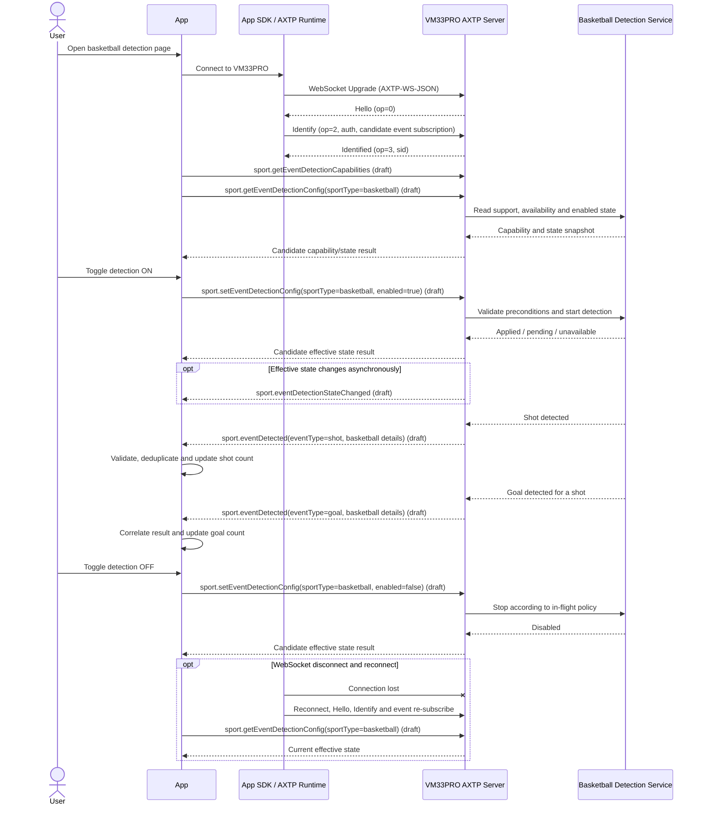

# VM33PRO Basketball Shot And Goal Detection Protocol Interaction Flow

> Status: flow design
> Scope: VM33PRO basketball detection capability discovery through shared sport event-detection control, App toggle control, shot/goal event delivery, state synchronization, and reconnect handling
> Source inputs: `workspace/business/vm33pro-basketball-event-detection.md`, `contract/generated/protocol.md`, `specs/20-core.md`, `specs/30-registry.md`, `contract/registry/core/rpc_op.yaml`, `contract/registry/core/domain_registry.yaml`, `contract/registry/error/error_code.yaml`, `workspace/legacy-migration/plans/vm33-protocol-migration-plan.md`
> Protocol lifecycle: Stage 10 `plan-protocol-flow`

本文把 VM33PRO 篮球事件检测需求拆成 App、AXTP runtime、设备固件和检测算法之间的端到端交互，并判断每一步的协议覆盖状态。

本文不是最终协议事实源。表格中的 candidate method / event / schema 仅用于标记缺口和后续路由，不是可直接实现的合同；正式名称、ID、字段和错误语义必须进入 `workspace/protocol/**` 草案，评审采纳到 registry 后再由 Generator 生成。

## 0. 速读结论

| 项目 | 内容 |
|---|---|
| Flow 目标 | App 通过 WebSocket 查询并控制 VM33PRO 篮球事件检测开关，在检测开启后接收投篮和进球结果，并在断线、重启或算法不可用时恢复正确状态。 |
| 当前协议覆盖 | partial |
| 涉及 domain.feature | generated core RPC/session、candidate `sport.eventDetection` + specialization `sport.basketball`；`device.info` 只可辅助识别设备型号，不能替代业务能力发现。 |
| 已有 adopted/generated | `AXTP-WS-JSON`、Hello / Identify / Identified、RPC Request / RequestResponse / Event、`eventMasks` 订阅规则、core error model、`device.getInfo`。 |
| 缺口 | 没有篮球检测 capability、当前状态查询、开关控制、状态变化事件、投篮/进球事件及其关联/排序/重连恢复语义。 |
| 是否需要新增协议草案 | yes；已拆分为通用 `sport.eventDetection` 与篮球专项 `sport.basketball` 两份候选草案；`sport` domain 尚未进入 registry，需先完成定域评审。 |
| 是否涉及 Legacy | yes；只涉及 VM33 Pro 新业务迁移策略，未找到篮球检测旧命令或事件映射。 |
| 是否涉及 STREAM | no；投篮和进球是低频 RPC Event。WebSocket Unframed JSON 不承载 STREAM，也不传输原始视频。 |
| 下一步 | 评审 [sport.eventDetection](../protocol/sport/sport.eventDetection.md) 与 [sport.basketball](../protocol/sport/sport.basketball.md)，通过后进入 `adopt-protocol-draft`；不需要修改 AXTP WebSocket / RPC core。若产品要求跨重连可靠补发或 exactly-once，再单独评估 feature-local recovery 或 core/profile amendment。 |

## 1. Story Summary

| Item | Content |
|---|---|
| User goal | 用户在 App 中开启篮球事件检测，并近实时看到投篮和进球结果；关闭后设备停止产生新的篮球业务事件。 |
| Trigger | App 与 VM33PRO 建立 AXTP WebSocket session，用户打开篮球检测设置或训练页面。 |
| Success result | App 能确认设备是否支持该能力、读取当前有效状态、控制开关；设备在已订阅且已授权的 session 上发送投篮/进球事件，App 正确关联、去重并更新展示。 |
| Primary actors | User、App、App SDK / AXTP runtime、VM33PRO AXTP logical server、VM33PRO basketball detection service。 |
| Product scope | VM33PRO 新业务；旧 VM33 保持原 HTTP JSON 协议，不新增旧 `Class.Method`。 |
| Overall coverage | AXTP transport/session/event envelope 已覆盖；篮球业务协议整体缺失。 |

## 2. Source Observations

### 2.1 UI / Prototype

当前未提供 UI 原型或截图，以下只记录需求明确提出的控件及其协议相关性；视觉样式、页面层级和文案不做假设。

| Screen or control | Observed / required behavior | Protocol relevance |
|---|---|---|
| 篮球事件检测开关 | App 控制设备是否开启检测；UI 必须显示设备实际生效状态，而不是只显示本地点击结果。 | capability discovery、read state、set state、state changed event。 |
| 开关处理中状态 | 设备可能同步生效，也可能存在启动/停止算法的短暂过程。 | candidate apply/effective state；是否需要 pending 状态待确认。 |
| 不可用提示 | 设备不支持、摄像头被占用、算法未准备、隐私遮挡或权限不足时，开关应禁用或回滚。 | capability/state/error。 |
| 投篮结果展示 | App 收到投篮事件后更新实时展示或计数。 | candidate shot event；事件的业务定义待确认。 |
| 进球结果展示 | App 收到进球事件后更新命中结果，并按产品定义关联对应投篮。 | candidate goal event；关联和乱序策略待确认。 |
| 连接状态提示 | WebSocket 断开时提示事件可能不完整；重连后重新读取有效开关状态。 | generated session + missing feature state query/recovery。 |
| 训练统计 / 历史记录 | 若仅基于已收到事件做本地累计，属于 App 本地行为；云端同步和持久化未进入当前范围。 | local-only / non-protocol。 |

### 2.2 Requirement Notes

- VM33PRO 设备负责检测投篮和进球，App 不在本 flow 中自行分析原始视频。
- 设备通过 WebSocket 向 App 主动发送业务事件。
- App 提供设备检测开关，并需要看到设备实际生效状态。
- 事件应使用 AXTP RPC Event，而不是 request 的异步 response，也不是 STREAM 数据。
- AXTP Event 需要在 Identify / Reidentify 的 domain-scoped `eventMasks` 中订阅；篮球事件进入 registry 前无法形成正式订阅 bit。
- VM33 Pro 新业务通过 AXTP 草案、registry 和 generated 流程新增，不继续扩展旧 VM33 `Seq/Class/Method/Param`。
- 当前没有 UI 原型、算法事件样例、固件私有命令、连接拓扑或明确的性能指标。

### 2.3 Device / System State Observations

以下是 flow 所需的产品状态观察，不是最终协议 enum：

| State | Meaning | Protocol relevance |
|---|---|---|
| unsupported | 当前设备/固件没有篮球检测能力。 | capability absence；App 隐藏或禁用入口。 |
| disabled | 能力存在，但检测未开启。 | state query / set result / state event。 |
| enabling | 设备已接受开启请求，算法尚未达到可检测状态。 | 是否需要异步 apply state 待确认。 |
| enabled / ready | 检测开启且前置条件满足，可产生投篮/进球事件。 | effective state；允许业务 event。 |
| degraded | 检测仍运行，但低光、遮挡或标定等因素降低可靠性。 | candidate state/reason；是否对 App 暴露待确认。 |
| unavailable | 能力存在，但当前因摄像头占用、隐私策略、资源或内部故障不可用。 | `UNAVAILABLE` / state reason；允许后续恢复。 |
| disabling | 设备正在停止算法或等待当前检测窗口结束。 | 关闭边界与在途事件策略待确认。 |
| disconnected | App 与设备的 WebSocket session 已断开。 | runtime local state；重连后重新 Identify、订阅并查询有效状态。 |

### 2.4 Evidence Findings

| Evidence | Finding |
|---|---|
| `contract/generated/protocol.md` | `AXTP-WS-JSON` 是正式 RPC-only WebSocket profile，支持 Request / Response / Event，不支持 STREAM。 |
| `specs/20-core.md` | Logical Server 发送 Hello；Identify 携带 event subscription intent；Event 使用 `op=6`，业务数据位于 `d.data`；`eventMasks` 依据 domain/event bitOffset 订阅。 |
| `specs/30-registry.md` | 低频事件使用 RPC Event；高频连续数据才使用 STREAM；optional event 不应发送给未订阅的 peer。 |
| `contract/registry/core/domain_registry.yaml` | `video` 负责视频处理，`sensor` 负责传感器遥测/配置；篮球识别的最终定域仍需评审。 |
| `workspace/protocol/video/video.scene.md` | 现有草案处理视频场景/preset/切换策略，不覆盖语义识别事件，不能直接复用为篮球检测。 |
| `workspace/legacy-migration/classification/sensor.md` | 仅有陀螺仪 motion 和遥测线索，没有投篮或进球业务证据。 |
| `workspace/legacy-migration/plans/vm33-protocol-migration-plan.md` | VM33 Pro 新业务必须走 AXTP 新业务协议；旧 VM33 parser/handler 只作兼容。 |

## 3. Actors And System Boundaries

| Actor / boundary | Responsibility | AXTP boundary |
|---|---|---|
| User | 操作开关并查看检测结果。 | 不直接参与协议。 |
| App UI | 展示能力、有效状态、事件和错误；维护本地统计。 | 通过 SDK/runtime 消费 generated facts。 |
| App SDK / AXTP runtime | 管理 WebSocket、Hello/Identify/Identified、`sid`、request correlation、event subscription、重连和消息分发。 | AXTP Logical Client。 |
| VM33PRO AXTP runtime | 作为 Logical Server 发送 Hello、鉴权、路由业务 method、绑定 capability/event 和返回统一错误。 | AXTP Logical Server。 |
| Basketball detection service | 启停算法，提供可用状态，产出投篮/进球结果。 | 设备内部服务，不是独立 AXTP peer。 |
| Camera / privacy / resource services | 决定算法前置条件和冲突状态。 | 设备内部依赖；只通过篮球 feature 的状态/错误向 App 暴露必要摘要。 |
| Cloud / gateway（可选） | 仅在产品实际使用转发或云反向连接时参与。 | 若设备主动连云，应评估 `AXTP-WS-CLOUD-REVERSE`；当前 main flow 不假设存在云端。 |

主协议边界是 App SDK/runtime 与 VM33PRO AXTP runtime。算法输出不能直接绕过 AXTP session 向 App 发送私有 WebSocket JSON。

## 4. Assumptions And Non-Goals

| Type | Item | Status |
|---|---|---|
| Assumption | 主路径先按 App 主动连接 VM33PRO / gateway 的 `AXTP-WS-JSON` 建模；设备保持 Logical Server。 | `[REVIEW-DRAFT]` |
| Assumption | 投篮和进球属于低频语义事件，频率远低于连续视频帧，不需要 STREAM。 | `[REVIEW-DRAFT]` |
| Assumption | 本 flow 按方案 C 使用 `sport.eventDetection` 承载跨运动项目公共控制/事件 envelope，使用 `sport.basketball` 承载 shot/goal 专项 details；`sport` domain 的正式注册仍待评审。 | `[REVIEW-DRAFT]` |
| Assumption | App 重连后以重新查询设备有效状态为准，不仅恢复本地 toggle 缓存。 | `[REVIEW-DRAFT]` |
| Question | 投篮和进球使用一个带类型的统一 event，还是两个独立 event？ | `[REVIEW-ASK]` |
| Question | 断线期间是否要求缓存、补发、查询历史或允许丢失？ | `[REVIEW-ASK]` |
| Non-goal | 不传输原始视频、预览流或录像。 | `[REVIEW-OK]` |
| Non-goal | 不定义算法模型、判定阈值、场地标定或摄像头安装方案。 | `[REVIEW-OK]` |
| Non-goal | 不在本 flow 中定义完整 method/event/schema、数值 ID 或正式 enum。 | `[REVIEW-OK]` |
| Non-goal | 不修改旧 VM33 HTTP JSON 协议。 | `[REVIEW-OK]` |

## 5. Protocol Coverage

| Need | Coverage state | AXTP protocol | Evidence | Next action |
|---|---|---|---|---|
| WebSocket RPC 连接 | generated | `AXTP-WS-JSON` | `contract/generated/protocol.md` | App / device 可按 generated profile 实现。 |
| Session 建立和鉴权入口 | generated | Hello / Identify / Identified | `contract/generated/protocol.md`, `contract/registry/core/rpc_op.yaml` | 复用 generated core；产品补充实际 auth policy。 |
| 事件订阅机制 | generated | Identify / Reidentify intent + `eventMasks` | `specs/20-core.md` | 复用 core；篮球 events 采纳后分配 domain-local bitOffset。 |
| 识别 VM33PRO 型号 | generated | `device.getInfo` | `contract/generated/protocol.md` | 可辅助版本/型号诊断，不能替代 feature capability。 |
| 发现篮球检测能力 | draft | `sport.eventDetection` capability，descriptor 中声明 basketball 及 shot/goal；`sport.basketball` 提供专项 details schema | business requirement; [sport.eventDetection](../protocol/sport/sport.eventDetection.md), [sport.basketball](../protocol/sport/sport.basketball.md) | 评审两份草案后进入 `adopt-protocol-draft`。 |
| 读取检测开关和算法有效状态 | draft | `sport.getEventDetectionConfig(sportType=basketball)` | [sport.eventDetection](../protocol/sport/sport.eventDetection.md) | 通用方法复用；专项只绑定 sportType。 |
| 开启/关闭检测 | draft | `sport.setEventDetectionConfig(sportType=basketball)` | [sport.eventDetection](../protocol/sport/sport.eventDetection.md) | 通用方法复用；确认单项目/多项目并发策略。 |
| 开关或可用状态变化同步 | draft | `sport.eventDetectionStateChanged`，payload.state.sportType=basketball | [sport.eventDetection](../protocol/sport/sport.eventDetection.md) | 复用公共状态事件。 |
| 投篮事件通知 | draft | `sport.eventDetected` + `sportType=basketball` + `eventType=shot` + `SportBasketballShotDetails` | [sport.basketball](../protocol/sport/sport.basketball.md) | 评审 shot 定义和专项字段。 |
| 进球事件通知 | draft | `sport.eventDetected` + `sportType=basketball` + `eventType=goal` + `SportBasketballGoalDetails` | [sport.basketball](../protocol/sport/sport.basketball.md) | 评审 goal 与 shot 的关联规则。 |
| 投篮与进球关联、排序和去重 | draft | 公共 eventId/sequence + 专项 shotId/goalId/shotId reference | 两份 protocol draft | 在专项草案中定义最小关联语义。 |
| 断线后重新读取有效状态 | draft + runtime | 通用 state query + generated reconnect/session | 两份 protocol draft, core session | 重连由 SDK/runtime 实现；补发策略另行采纳。 |
| 断线期间事件补发 / exactly-once | non-protocol/missing policy | feature-local history/replay candidate，或无补发 | no current requirement decision | 产品先定数据完整性策略；不要默认 core Event 提供可靠补发。 |
| toggle pending、错误提示、计数 UI | local-only | App state management | business requirement | App 实现；只消费协议结果。 |
| 投篮/进球算法判定 | non-protocol | device algorithm | business requirement | 算法与产品验收，不进入 AXTP wire contract。 |
| 基础业务错误 | generated | `NOT_SUPPORTED`, `INVALID_STATE`, `BUSY`, `PERMISSION_DENIED`, `INVALID_ARGUMENT`, `UNAVAILABLE`, `INTERNAL_ERROR` | `contract/registry/error/error_code.yaml`, `contract/generated/protocol.md` | 草案优先复用；只有确有跨实现业务语义时才新增错误。 |

Coverage 结论为 `partial`：核心 WebSocket、session、RPC 和事件承载已具备，但实现业务目标所需的 feature capability、控制 method 和 events 全部缺失。

## 6. End-To-End Sequence

下图中的 `candidate` 交互均为缺口占位，不是已采纳 method/event 名称。

### 6.1 Alternate Transport Topology

若最终架构是 VM33PRO 主动连接云端、App 从云端消费事件，则物理连接应评估 `AXTP-WS-CLOUD-REVERSE`：设备仍是 Logical Server 并发送 Hello，云端是 Logical Client。云端到 App 的第二段接口、鉴权和多端订阅不应在未确认前混入设备 feature schema。

## 7. Interaction Steps

`Payload fields` 只列 flow 所需语义，不是完整 schema。

| Step | Actor | Action | Capability / precondition | Protocol call/event | Payload fields | Result / state change | Coverage | Error / fallback |
|---:|---|---|---|---|---|---|---|---|
| 1 | App SDK / Device | 建立 WebSocket，完成 Hello / Identify / Identified。 | VM33PRO 暴露 `AXTP-WS-JSON`；认证信息可用。 | generated core session | `sid`, identity/auth, event subscription intent | session 进入 app-ready。 | generated | 连接或鉴权失败时页面进入 disconnected / unauthorized，不调用业务 method。 |
| 2 | App | 可选读取设备身份，确认当前设备为 VM33PRO。 | session ready。 | `device.getInfo` | model / runtime summary | App 获得设备型号和版本诊断。 | generated | 不能以型号推断篮球 capability；读取失败不应伪造支持状态。 |
| 3 | App / Device | 查询跨运动项目事件检测 capability。 | session ready。 | `sport.getEventDetectionCapabilities` | 可选 sportTypes 过滤 | 返回 basketball 是否支持、shot/goal、专项 details schema 和并发约束。 | draft | 未注册 method 返回 `RPC_METHOD_NOT_FOUND`；注册但当前不支持返回 `NOT_SUPPORTED`。 |
| 4 | App / Device | 查询篮球当前有效开关和算法状态。 | `sportType=basketball` 已在 capability 中声明。 | `sport.getEventDetectionConfig` | `sportType` | 返回 effective enabled、runtime state、reason 和 revision/time 摘要。 | draft | 读取失败时 UI 显示 unknown，不使用旧缓存冒充设备状态。 |
| 5 | User / App | 用户打开 toggle，App 进入 pending UI。 | capability supported，当前非 enabled。 | local validation | desired enabled=true | 防止重复点击；等待设备结果。 | local-only | 本地只校验已知条件，设备仍做权威校验。 |
| 6 | App / Device | 请求开启篮球检测。 | 已授权；摄像头、隐私、资源和算法前置条件允许。 | `sport.setEventDetectionConfig` | `sportType=basketball`, desired enabled state，可选 expected revision | 同步返回 applied / pending / rejected 及有效状态。 | draft | `NOT_SUPPORTED`, `INVALID_STATE`, `BUSY`, `PERMISSION_DENIED`, `UNAVAILABLE`；失败则回滚 toggle。 |
| 7 | Device / App | 算法异步达到 ready 或变为 unavailable。 | App 已订阅公共状态事件。 | `sport.eventDetectionStateChanged` | state.sportType, effective state, reason, revision/time | App 从 enabling 更新为 ready，或展示 unavailable。 | draft | 事件丢失时调用通用 state query 校准。 |
| 8 | Detector / Device | 检测到一次投篮。 | basketball state 为 enabled/ready；session 已订阅统一 event。 | `sport.eventDetected` / `eventType=shot` | 通用 event identity/sequence + `SportBasketballShotDetails` | App 按 sportType 路由、校验、去重并更新投篮结果。 | draft | 未订阅时不发送 optional event；未知专项事件由客户端忽略并保持 session。 |
| 9 | Detector / Device | 判断某次投篮进球。 | 有可关联投篮，或产品允许独立进球事件。 | `sport.eventDetected` / `eventType=goal` | 通用 event identity/sequence + `SportBasketballGoalDetails` | App 按 shotId 关联投篮并更新进球结果。 | draft | 引用未知投篮时按确认策略暂存、独立展示或忽略，不能默认关联。 |
| 10 | App | 处理重复、乱序或迟到事件。 | 协议提供可执行的 event identity/order/correlation。 | local processing based on candidate schema | event id/sequence/time/reference | 统计只计一次；乱序结果可最终收敛。 | missing + local-only | 若协议不给关联依据，App 无法可靠实现此步骤。 |
| 11 | User / App | 用户关闭篮球检测 toggle。 | basketball capability supported；当前 enabled/enabling。 | `sport.setEventDetectionConfig` | `sportType=basketball`, desired enabled=false | 设备进入 disabling/disabled；App 展示最终有效状态。 | draft | 正在判定的投篮是否完成上报由 in-flight policy 决定。 |
| 12 | SDK / App | WebSocket 断开并重连。 | transport 可恢复。 | generated session reconnect + event re-subscribe + candidate state query | new sid, subscriptions, state selector | App 重新建立订阅并校准有效状态。 | generated + missing | 断线期间事件是否丢失/补发不做默认保证。 |
| 13 | Device | 设备重启或恢复默认。 | 产品生命周期事件发生。 | `sport.eventDetectionStateChanged` + state query | persistence/effective state | App 以重连后的设备状态为准。 | draft | 默认开关值和持久化策略未确认。 |

## 8. State Changes And Events

下表先确认业务状态变化，再由后续协议草案决定一个统一 event 还是多个细分 event。

| State change / detection result | Trigger | Event needed | Candidate payload summary | Client handling | Coverage |
|---|---|---|---|---|---|
| detection effective state changed | App set、设备重启、恢复默认、内部策略或算法故障 | yes，`sport.eventDetectionStateChanged` | state.sportType, effective enabled, runtime state, reason, revision/time | 更新对应项目 toggle 和状态提示；部分 payload 时调用 query 校准。 | draft |
| detector availability changed | 摄像头占用、隐私遮挡、标定、资源、光照或内部故障变化 | may share state event | availability/degraded reason, effective state | 禁用、恢复或降级 UI；不要自动假设开关被永久关闭。 | missing |
| shot detected | 算法判定一次业务投篮 | yes，`sport.eventDetected` / `eventType=shot` | stable event identity/order, `sportType=basketball`, `SportBasketballShotDetails` | 去重、排序、更新投篮展示。 | draft |
| goal detected | 算法判定命中 | yes，`sport.eventDetected` / `eventType=goal` | stable event identity/order, `sportType=basketball`, `SportBasketballGoalDetails` | 关联投篮、更新进球展示；处理乱序。 | draft |
| App connection state changed | WebSocket 建立、断开、重连 | no basketball business event | transport/session state | App 本地提示并在重连后 query。 | local-only / generated core |
| historical replay completed | 仅当产品选择断线补发/历史查询 | maybe response/event | replay boundary, sequence range, completeness | 合并事件并避免重复。 | non-protocol decision / missing |

Event 订阅约束：正式 `sport.eventDetectionStateChanged` 和 `sport.eventDetected` 采纳后必须拥有 `sport` domain 内唯一 `bitOffset`，App 在 Identify / Reidentify 的 `eventMasks` 中订阅；设备不得向未订阅 peer 主动发送 optional basketball events。

## 9. Protocol Details

### 9.1 Adopted / Generated Protocols

| Method / event / rule | Purpose in this flow | Source |
|---|---|---|
| `AXTP-WS-JSON` | App 与设备之间的 RPC-only WebSocket transport profile。 | `contract/generated/protocol.md` |
| Hello / Identify / Identified | 建立 Logical Client / Logical Server session、分配 `sid`、提交认证和事件订阅意图。 | `contract/generated/protocol.md`, `contract/registry/core/rpc_op.yaml` |
| RPC Request / RequestResponse | 承载后续篮球 capability、query 和 set method。 | `contract/generated/protocol.md` |
| RPC Event (`op=6`) | 承载低频投篮、进球和状态变化事件。 | `contract/generated/protocol.md`, `specs/20-core.md`, `specs/30-registry.md` |
| `eventMasks` | 依据 domain-local event bitOffset 订阅 optional events。 | `specs/20-core.md` |
| `device.getInfo` | 可选读取产品型号和 runtime 信息；不作为篮球 feature capability。 | `contract/generated/protocol.md` |
| Core errors | 复用 unsupported、invalid state、busy、permission denied、invalid argument、unavailable 和 internal error。 | `contract/registry/error/error_code.yaml`, `contract/generated/protocol.md` |

### 9.2 Draft Or Missing Protocol Gaps

候选名称均未采纳，后续草案可以调整、拆分或合并。

| Gap | Candidate domain.feature | Candidate method/event/schema direction | Routed skill | Review question |
|---|---|---|---|---|
| 业务定域与通用 capability | `sport.eventDetection`（`sport` domain 尚未注册） | 跨运动项目公共 capability，声明 supportedSports、supportedEvents、并发和 toggle 约束 | `draft-business-protocol`（已创建） | `[REVIEW-ASK]` 是否接受新增 `sport` domain？ |
| 篮球专项 capability | `sport.basketball` specialization | 声明 shot/goal details schema 和 goal/shot 关联策略 | `draft-business-protocol`（已更新） | `[REVIEW-ASK]` 专项 capability 是否只作为 descriptor，还是需要独立 registry facts？ |
| 查询能力与有效状态 | `sport.eventDetection` + `sport.basketball` | `sport.getEventDetectionCapabilities` + `sport.getEventDetectionConfig(sportType=basketball)` | `draft-business-protocol` | `[REVIEW-ASK]` 是否允许同时启用多个 sportType？ |
| 开启/关闭检测 | `sport.eventDetection` | `sport.setEventDetectionConfig(sportType=basketball)`，返回 final effective state 或 apply state | `draft-business-protocol` | `[REVIEW-ASK]` 开关同步生效还是异步 applying；是否持久化？ |
| 状态变化同步 | `sport.eventDetection` | `sport.eventDetectionStateChanged`，state 带 sportType | `draft-business-protocol` | `[REVIEW-DRAFT]` 公共 state event 是否覆盖所有未来运动项目？ |
| 投篮与进球事件 | `sport.eventDetection` + `sport.basketball` | `sport.eventDetected` + `eventType=shot/goal` + 专项 `details` | `draft-business-protocol` | `[REVIEW-ASK]` 通用 discriminated event 是否足以覆盖未来项目？ |
| 事件关联、排序和去重 | `sport.eventDetection` + `sport.basketball` | 公共 eventId/sequence + shotId/goalId/shotId reference | `draft-business-protocol` | `[REVIEW-ASK]` 进球是否必须引用投篮；设备时间使用什么语义？ |
| 重连恢复 | `sport.eventDetection` | 通用 state query；若要求补发，再考虑 bounded history/replay query | `draft-business-protocol` | `[REVIEW-ASK]` MVP 是否允许断线期间事件丢失？ |
| 事件可靠投递 | feature-local first；必要时 profile/core review | 不默认 Event exactly-once；优先使用幂等 event identity + query/replay 收敛 | `draft-business-protocol`; hard global guarantee 才评估 `amend-adopted-protocol` | `[REVIEW-ASK]` 是否有必须跨断线不丢事件的业务承诺？ |

### 9.3 Domain Recommendation

本 flow 按方案 C 采用 `sport` domain，并将公共检测协议与篮球专项语义分层：

- `sport.eventDetection` 负责跨运动项目复用的 capability discovery、开关、运行态、订阅、事件 envelope、顺序和去重。
- `sport.basketball` 负责 `shot` / `goal` 的业务定义、`shotId` / `goalId` 关联和专项 `details` schema。
- 未来足球、棒球、网球沿用 `sport.eventDetection`，分别增加 `sport.football`、`sport.baseball`、`sport.tennis` 专项 descriptor/schema；不新增独立 domain。
- `video` / `camera` / `sensor` 只表达原始输入或设备能力，不替代运动语义 domain。
- 当前 `contract/registry/core/domain_registry.yaml` 没有 `sport` domain；新增 domain、high-byte 和专项 capability 仍需评审，不得直接当作 generated fact。

## 10. Test / Conformance Notes

| Case | Given | When | Then | Protocol evidence |
|---|---|---|---|---|
| WebSocket session | VM33PRO 支持 `AXTP-WS-JSON` | App 建立 WebSocket | Device 发送 Hello，App Identify，Device Identified 后进入 app-ready。 | generated core session |
| event subscription | 篮球 events 已注册且 App 声明对应 `eventMasks` | session Identified | Device 只向已订阅且授权的 session 发送 optional events。 | `eventMasks`, RPC Event rules |
| capability supported | VM33PRO 固件实现 `sport.eventDetection` + `sport.basketball` | App 打开页面并查询 | App 获取 supportedSports、shot/goal details 和当前有效状态，展示可操作 toggle。 | draft `sport.eventDetection` + `sport.basketball` |
| unsupported device | 旧 VM33 或未实现 feature 的 VM33PRO | App 尝试能力发现或调用 | App 隐藏/禁用入口；registered-but-unavailable 使用 `NOT_SUPPORTED`，未注册 method 使用 `RPC_METHOD_NOT_FOUND`。 | core errors + candidate capability |
| enable happy path | basketball capability 可用且前置条件满足 | 用户开启 toggle | Device 返回 applied 或 pending；最终状态为 enabled/ready，App 与设备状态一致。 | draft common set/state event |
| enable unavailable | 摄像头占用、隐私遮挡或算法不可用 | 用户开启 toggle | Device 拒绝或返回 unavailable state/reason；App 回滚 toggle 并提示。 | draft common errors + state schema |
| shot event | 检测已开启，App 已订阅统一 event | 算法判定一次投篮 | Device 发送 `sport.eventDetected(eventType=shot)`，App 只计一次。 | draft `sport.eventDetection` + `sport.basketball` |
| goal correlation | 一次投篮后设备判定进球 | goal event 早于、晚于或紧随 shot event 到达 | App 按 `shotId` / `goalId` 和确认规则最终收敛为一次投篮、一次命中。 | draft basketball details schema |
| duplicate / out-of-order | transport/runtime 重试或多线程导致重复/乱序 | App 接收事件 | App 使用公共 eventId/sequence 处理，不重复统计且不关闭 session。 | draft common metadata + core liveness rule |
| disable boundary | 检测已开启且可能有在途投篮 | 用户关闭 toggle | Device 按确认的 in-flight policy 停止；关闭生效后不产生违规新事件。 | draft common set/state policy |
| reconnect | WebSocket 在检测过程中断开 | SDK 重连并重新 Identify / 订阅 | App 查询篮球 state；断线数据按明确策略丢失或补发，不静默假设完整。 | generated reconnect + draft state/recovery |
| restart persistence | 检测已开启 | Device 重启或恢复默认 | 重连后的 common state query 返回产品定义的默认/持久化结果，App 以设备状态为准。 | draft persistence/state semantics |
| no STREAM | 检测产生投篮/进球结果 | Device 上报结果 | 仅发送 RPC Event，不在 WebSocket 上创建 STREAM 或发送原始视频。 | `AXTP-WS-JSON`, event rules |

## 11. Acceptance Gates

- 产品和架构确认新增 `sport` domain，以及 `sport.eventDetection` + `sport.basketball` 的分层边界；不得把 flow candidate 名称当成 generated fact。
- 通用 capability、状态查询、开关控制、公共状态事件和统一事件 envelope 进入 `sport.eventDetection` 草案；shot/goal 语义与 details 进入 `sport.basketball` 草案。
- 投篮、进球的业务定义、关联关系和重复/乱序处理规则可以被 App 与算法团队共同测试。
- App 展示设备实际 effective state；set 失败、异步 applying、unavailable 和重连后均不会保留错误 toggle 状态。
- 事件只有在正式注册、绑定 capability 并通过 `eventMasks` 订阅后才发送。
- 断线期间的数据完整性策略明确；如果不补发，UI 和验收必须明确可能丢失，不能声称 exactly-once。
- VM33PRO 使用 generated AXTP session/envelope/error model，不创建篮球私有 WebSocket envelope。
- 旧 VM33 协议保持不变；没有篮球 legacy command 时不创建虚假 legacy mapping。
- 本 flow 不要求 STREAM；若未来加入视频预览/录像，应另建 `video.stream` / recording flow。
- 草案采纳后再补 registry、generated 和 conformance；当前 flow 不能作为 runtime implementation contract。

## 12. Open Questions

| Question | Impact | Owner | Status | Next action |
|---|---|---|---|---|
| “投篮事件”的精确定义是什么：出手、球离手、触框/篮板还是完整尝试？ | product / algorithm / event trigger | Product / Algorithm | REVIEW-ASK | 提供带时间线的正例、假动作和漏检样例。 |
| “进球事件”是否一定关联投篮；未命中或未知是否需要事件？ | protocol / App statistics | Product / Algorithm / App | REVIEW-ASK | 固化关联和统计口径。 |
| 是否接受新增 `sport` domain，并采用 `sport.eventDetection` + `sport.basketball` 分层？ | domain taxonomy / registry | Architecture / Protocol | REVIEW-ASK | 在 draft 评审中确认 domain registry 变更边界和 capability 关系。 |
| App 是否直接连接设备；是否存在 gateway/cloud reverse 拓扑？ | transport / auth / deployment | Architecture / Firmware | REVIEW-ASK | 输出连接拓扑并选择 `AXTP-WS-JSON` 或 cloud-reverse path。 |
| 开关是否持久化；设备重启、升级、恢复默认后的值是什么？ | state recovery / UX | Product / Firmware | REVIEW-ASK | 定义生命周期状态表。 |
| 开启/关闭是同步生效还是存在 enabling/disabling；在途投篮如何处理？ | method result / state event | Firmware / Algorithm / Product | REVIEW-ASK | 提供算法启停状态机。 |
| `sport.eventDetected` 是否覆盖 shot/goal 及未来运动项目？ | event registry / subscriptions / schema | Protocol / App / Algorithm | REVIEW-ASK | 比较统一 discriminated event 与专项 event。 |
| 事件最小关联字段是什么：event identity、sequence、occurrence time、shot reference、training session、confidence？ | dedupe / order / diagnostics | Protocol / App / Algorithm | REVIEW-ASK | App 提交最小消费字段，算法提交可提供字段。 |
| 断线期间事件允许丢失、设备缓存补发，还是 App 主动查询历史？ | reliability / storage / conformance | Product / Architecture / Firmware | REVIEW-ASK | 选择 MVP recovery 策略并明确完整性承诺。 |
| 目标事件时延、最大频率、允许丢失率和重复率是多少？ | performance / acceptance | Product / Test | REVIEW-ASK | 建立端到端可测量指标。 |
| 算法不可用和 degraded 的原因是否需要标准化给 App？ | UI / error/state schema | Algorithm / Firmware / App | REVIEW-ASK | 列出用户可恢复原因和仅诊断原因。 |
| 是否已有 VM33PRO 私有消息、事件日志、App 原型或测试视频？ | evidence / migration / conformance | Firmware / App / Test | REVIEW-ASK | 补充版本化样例；没有则明确为 greenfield。 |
| MVP 是否仅本地实时展示，还是需要云端存储、多端同步和训练报告？ | scope / privacy / topology | Product / Cloud / Privacy | REVIEW-ASK | 冻结 MVP 数据生命周期。 |
